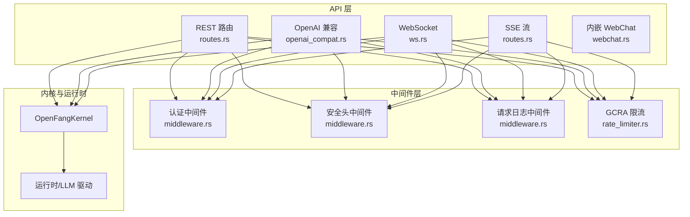
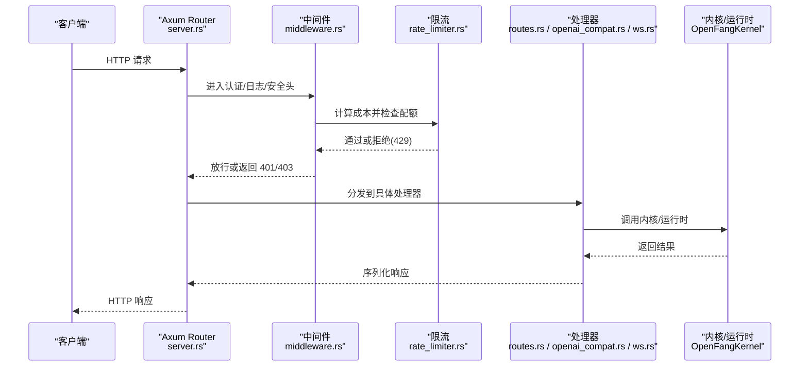
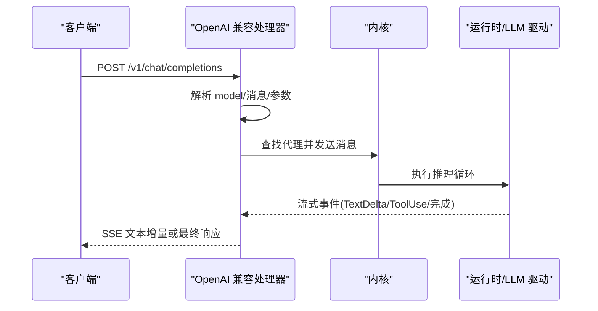
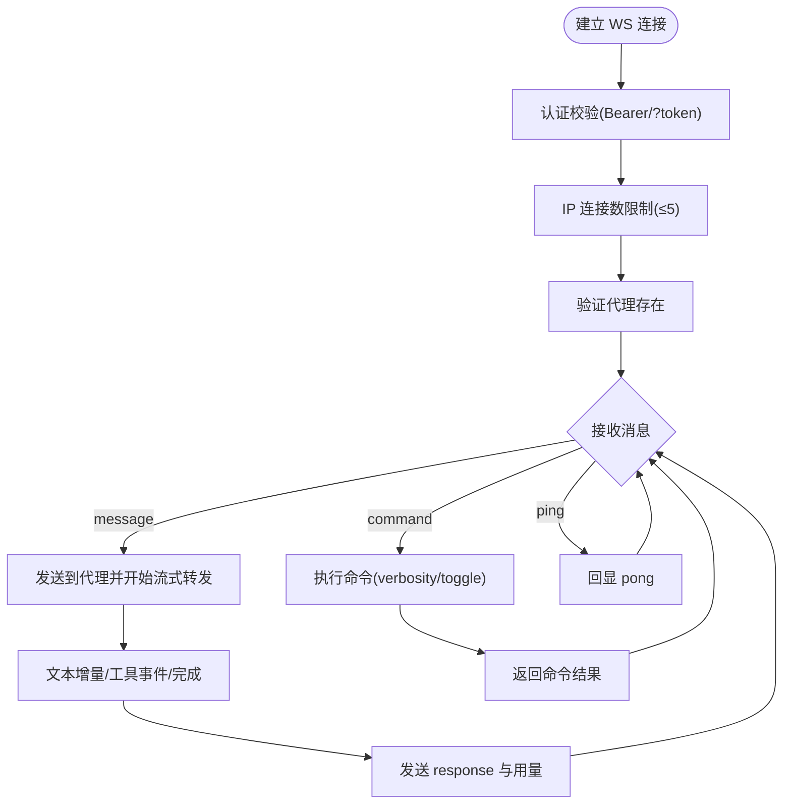
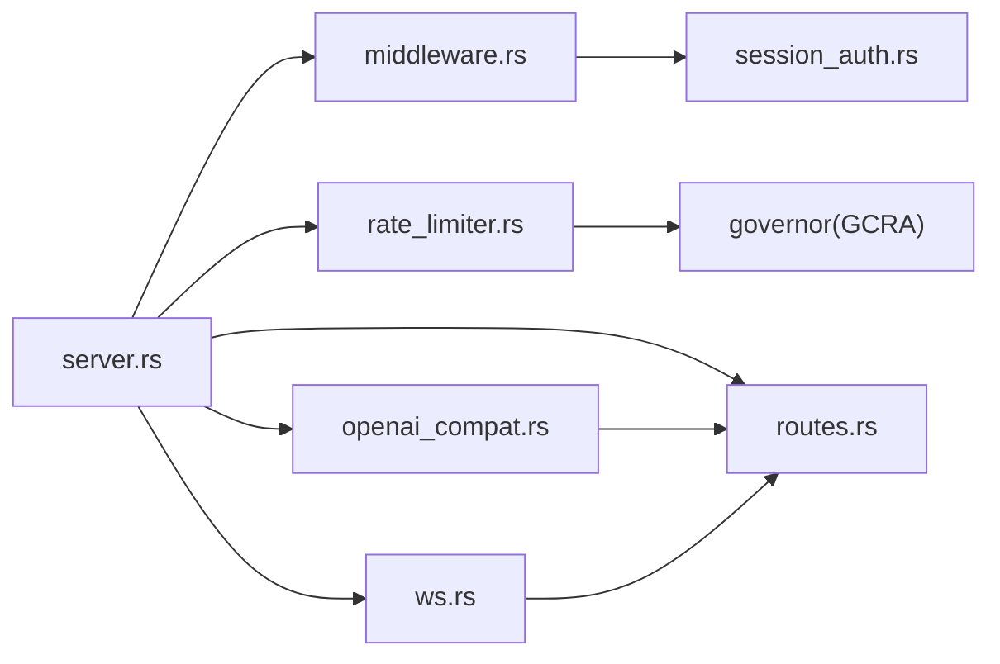

# API 参考文档

<cite>
**本文档引用的文件**
- [lib.rs](file://crates/openfang-api/src/lib.rs)
- [server.rs](file://crates/openfang-api/src/server.rs)
- [routes.rs](file://crates/openfang-api/src/routes.rs)
- [routes_legacy.rs](file://crates/openfang-api/src/routes_legacy.rs)
- [types.rs](file://crates/openfang-api/src/types.rs)
- [openai_compat.rs](file://crates/openfang-api/src/openai_compat.rs)
- [ws.rs](file://crates/openfang-api/src/ws.rs)
- [webchat.rs](file://crates/openfang-api/src/webchat.rs)
- [middleware.rs](file://crates/openfang-api/src/middleware.rs)
- [session_auth.rs](file://crates/openfang-api/src/session_auth.rs)
- [rate_limiter.rs](file://crates/openfang-api/src/rate_limiter.rs)
- [api-reference.md](file://docs/api-reference.md)
- [package.json](file://sdk/javascript/package.json)
- [setup.py](file://sdk/python/setup.py)
</cite>

## 目录
1. [简介](#简介)
2. [项目结构](#项目结构)
3. [核心组件](#核心组件)
4. [架构总览](#架构总览)
5. [详细组件分析](#详细组件分析)
6. [依赖关系分析](#依赖关系分析)
7. [性能考虑](#性能考虑)
8. [故障排查指南](#故障排查指南)
9. [结论](#结论)
10. [附录](#附录)

## 简介
本文件为 OpenFang Agent OS 的完整 API 参考文档，覆盖 140+ 个 REST/WS/SSE 端点，包括：
- 标准 REST API：HTTP 方法、URL 模式、请求/响应结构、认证方式
- OpenAI 兼容 API：/v1/chat/completions、/v1/models
- WebSocket 协议：/api/agents/{id}/ws 实时聊天
- SSE 流式传输：/api/logs/stream、/api/comms/events/stream
- 认证机制：API 密钥、会话令牌、Dashboard 登录态
- 权限控制、速率限制策略
- 客户端 SDK 使用示例与最佳实践
- 版本管理、向后兼容与迁移指南
- 与其他系统组件的集成关系、调试与监控方法

## 项目结构
OpenFang API 服务位于 crates/openfang-api，采用模块化设计：
- 路由与控制器：routes.rs 定义所有 REST 端点；openai_compat.rs 提供 OpenAI 兼容接口；ws.rs 处理 WebSocket；webchat.rs 提供内嵌 WebChat 静态资源
- 中间件：middleware.rs 提供认证、安全头、日志；rate_limiter.rs 提供 GCRA 成本感知限流
- 类型定义：types.rs 统一请求/响应模型
- 启动与路由装配：server.rs 构建 Router 并注入中间件与状态

图表来源
- [server.rs:37-722](file://crates/openfang-api/src/server.rs#L37-L722)
- [middleware.rs:46-259](file://crates/openfang-api/src/middleware.rs#L46-L259)
- [rate_limiter.rs:14-80](file://crates/openfang-api/src/rate_limiter.rs#L14-L80)
- [openai_compat.rs:245-367](file://crates/openfang-api/src/openai_compat.rs#L245-L367)
- [ws.rs:140-207](file://crates/openfang-api/src/ws.rs#L140-L207)

章节来源
- [lib.rs:1-19](file://crates/openfang-api/src/lib.rs#L1-L19)
- [server.rs:37-722](file://crates/openfang-api/src/server.rs#L37-L722)

## 核心组件
- REST 路由与控制器：集中于 routes.rs，提供代理管理、工作流、触发器、内存、通道、模板、系统状态、模型目录、提供商配置、技能市场、MCP/A2A、审计与安全、用量统计、会话管理等端点
- OpenAI 兼容接口：/v1/chat/completions 支持流式与非流式；/v1/models 列出可用代理作为模型对象
- WebSocket：/api/agents/{id}/ws 提供实时双向消息通道，支持打字指示、文本增量、工具调用、错误与心跳
- SSE：/api/logs/stream、/api/comms/events/stream 提供事件流推送
- 认证与安全：Bearer Token 或查询参数 token；Dashboard 会话令牌；CSP、X-Frame-Options、X-Content-Type-Options、HSTS 等安全头
- 速率限制：基于 GCRA 的按 IP 成本感知限流，不同端点不同 token 成本
- 内嵌 WebChat：SPA 单页应用，打包静态资源

章节来源
- [routes.rs](file://crates/openfang-api/src/routes.rs)
- [openai_compat.rs:245-367](file://crates/openfang-api/src/openai_compat.rs#L245-L367)
- [ws.rs:140-207](file://crates/openfang-api/src/ws.rs#L140-L207)
- [middleware.rs:46-259](file://crates/openfang-api/src/middleware.rs#L46-L259)
- [rate_limiter.rs:14-80](file://crates/openfang-api/src/rate_limiter.rs#L14-L80)
- [webchat.rs:77-170](file://crates/openfang-api/src/webchat.rs#L77-L170)

## 架构总览
下图展示从客户端到内核的调用链路与中间件处理流程。

图表来源
- [server.rs:121-719](file://crates/openfang-api/src/server.rs#L121-L719)
- [middleware.rs:62-215](file://crates/openfang-api/src/middleware.rs#L62-L215)
- [rate_limiter.rs:52-80](file://crates/openfang-api/src/rate_limiter.rs#L52-L80)

## 详细组件分析

### 认证与授权
- API 密钥认证
  - 当配置了非空 api_key 时，除公开端点外均需 Authorization: Bearer <api_key> 或查询参数 token=
  - 支持常量时间比较防止时序攻击
- Dashboard 会话认证
  - 登录成功后设置 openfang_session Cookie，后续请求可绕过 Bearer 校验
  - 会话令牌使用 HMAC-SHA256 签名，包含用户名与过期时间
- 公开端点
  - 健康检查、根页面、部分只读端点无需认证
- WebSocket 认证
  - 仅支持 Bearer 或 ?token= 查询参数（浏览器限制无法自定义头部时使用）

章节来源
- [middleware.rs:62-215](file://crates/openfang-api/src/middleware.rs#L62-L215)
- [session_auth.rs:9-72](file://crates/openfang-api/src/session_auth.rs#L9-L72)
- [ws.rs:140-191](file://crates/openfang-api/src/ws.rs#L140-L191)

### 速率限制（GCRA）
- 成本模型：不同端点按操作复杂度分配 token 成本（如 health=1、spawn=50、message=30 等）
- 限额：每 IP 每分钟 500 个 token
- 行为：超出返回 429，并设置 Retry-After: 60

章节来源
- [rate_limiter.rs:14-80](file://crates/openfang-api/src/rate_limiter.rs#L14-L80)

### OpenAI 兼容 API
- /v1/chat/completions
  - 支持流式与非流式响应
  - model 解析逻辑：openfang:name、UUID、名称三类解析
  - 消息转换：支持文本与图片（data URI）内容块
  - 工具调用：在流中以增量 delta 发送 tool_calls
- /v1/models
  - 将可用代理映射为模型对象列表

图表来源
- [openai_compat.rs:245-367](file://crates/openfang-api/src/openai_compat.rs#L245-L367)
- [openai_compat.rs:369-532](file://crates/openfang-api/src/openai_compat.rs#L369-L532)

章节来源
- [openai_compat.rs:245-559](file://crates/openfang-api/src/openai_compat.rs#L245-L559)

### WebSocket 协议
- 端点：/api/agents/{id}/ws
- 认证：Bearer 或 ?token=
- 连接限制：每 IP 最多 5 个并发连接
- 心跳与空闲：Ping/Pong；30 分钟无活动自动断开
- 消息类型：
  - 客户端 → 服务器：{"type":"message","content":"..."} 或 {"type":"command","command":"...","args":"..."}
  - 服务器 → 客户端：typing（start/tool/stop）、text_delta、response、error、agents_updated、silent_complete、canvas
- 工具细节冗长度：off/on/full 三档，可通过命令切换
- 速率限制：每 60 秒最多 10 条消息

图表来源
- [ws.rs:140-207](file://crates/openfang-api/src/ws.rs#L140-L207)
- [ws.rs:390-800](file://crates/openfang-api/src/ws.rs#L390-L800)

章节来源
- [ws.rs:140-800](file://crates/openfang-api/src/ws.rs#L140-L800)

### SSE 流式传输
- /api/logs/stream：实时日志流
- /api/comms/events/stream：通信事件流
- 用于前端轮询替代方案，降低延迟与带宽

章节来源
- [server.rs:428-448](file://crates/openfang-api/src/server.rs#L428-L448)

### 内嵌 WebChat
- 提供单页应用（SPA），包含主题切换、Markdown 渲染、WebSocket 实时聊天与 HTTP 回退
- 编译时内联静态资源，便于单二进制部署

章节来源
- [webchat.rs:77-170](file://crates/openfang-api/src/webchat.rs#L77-L170)

### 数据模型与类型
- SpawnRequest/SpawnResponse：启动代理请求/响应
- MessageRequest/MessageResponse：消息发送请求/响应（含 token 用量）
- AttachmentRef：上传附件引用
- AgentUpdateRequest/SetModeRequest/MigrateRequest 等

章节来源
- [types.rs:5-110](file://crates/openfang-api/src/types.rs#L5-L110)

## 依赖关系分析
- 组件耦合
  - server.rs 作为装配中心，统一注入中间件与共享状态（AppState）
  - openai_compat.rs 与 ws.rs 通过 AppState 访问内核与运行时
  - middleware.rs 与 rate_limiter.rs 通过提取器与扩展访问客户端 IP 与请求上下文
- 外部依赖
  - Axum 路由框架
  - Tower 中间件栈（CORS、Trace、Compression、Security Headers）
  - Governor GCRA 限流
  - Subtle 常量时间比较
  - Base64、Hex、HMAC、SHA256 等密码学工具

图表来源
- [server.rs:121-719](file://crates/openfang-api/src/server.rs#L121-L719)
- [middleware.rs:46-259](file://crates/openfang-api/src/middleware.rs#L46-L259)
- [rate_limiter.rs:38-80](file://crates/openfang-api/src/rate_limiter.rs#L38-L80)

章节来源
- [server.rs:37-722](file://crates/openfang-api/src/server.rs#L37-L722)
- [middleware.rs:46-259](file://crates/openfang-api/src/middleware.rs#L46-L259)
- [rate_limiter.rs:14-80](file://crates/openfang-api/src/rate_limiter.rs#L14-L80)

## 性能考虑
- GCRA 成本感知限流：根据端点复杂度动态分配 token，避免高成本操作挤占带宽
- SSE/WS：低延迟实时交互，减少轮询开销
- 压缩：启用 gzip/deflate 压缩响应体
- CORS 与安全头：减少跨域与安全相关额外往返
- 日志与追踪：TraceLayer 与 request_logging 提供可观测性，便于定位瓶颈

## 故障排查指南
- 401 未授权
  - 检查 Authorization: Bearer <api_key> 是否正确
  - 若使用 SSE/WS，请确认 ?token= 参数是否随请求传递
  - Dashboard 登录态：确认 openfang_session Cookie 是否有效
- 403 禁止访问
  - 某些写操作（POST/PUT/DELETE）始终需要认证
- 429 速率超限
  - 观察 Retry-After: 60，等待配额恢复
  - 调整客户端重试策略，避免短时间高频请求
- WS 连接被拒
  - 检查每 IP 连接上限（默认 5）
  - 确认代理是否存在且可访问
- 日志与追踪
  - 查看请求 ID（x-request-id）关联日志
  - 使用 /api/health 与 /api/health/detail 检查系统健康状态

章节来源
- [middleware.rs:62-215](file://crates/openfang-api/src/middleware.rs#L62-L215)
- [rate_limiter.rs:52-80](file://crates/openfang-api/src/rate_limiter.rs#L52-L80)
- [ws.rs:184-191](file://crates/openfang-api/src/ws.rs#L184-L191)

## 结论
OpenFang API 通过清晰的模块化设计与强大的中间件体系，提供了安全、可观测、可扩展的 REST/WS/SSE 能力。结合 OpenAI 兼容接口与内嵌 WebChat，既满足开发者生态对接，也提供易用的可视化界面。建议在生产环境启用 API 密钥与 Dashboard 登录态，并配合 GCRA 限流与安全头策略，确保系统稳定与安全。

## 附录

### 端点清单与规范（节选）
- 健康检查
  - GET /api/health（公开）
  - GET /api/health/detail（需认证）
- 代理管理
  - GET /api/agents（公开）
  - GET /api/agents/{id}（公开）
  - POST /api/agents（需认证）
  - DELETE /api/agents/{id}（需认证）
  - PUT /api/agents/{id}/update（需认证）
  - PUT /api/agents/{id}/mode（需认证）
  - POST /api/agents/{id}/message（需认证）
  - POST /api/agents/{id}/message/stream（需认证）
  - GET /api/agents/{id}/session（需认证）
  - GET /api/agents/{id}/sessions（需认证）
  - POST /api/agents/{id}/sessions/{session_id}/switch（需认证）
  - POST /api/agents/{id}/session/reset（需认证）
  - DELETE /api/agents/{id}/history（需认证）
  - POST /api/agents/{id}/session/compact（需认证）
  - POST /api/agents/{id}/stop（需认证）
  - PUT /api/agents/{id}/model（需认证）
  - GET /api/agents/{id}/tools（需认证）
  - PUT /api/agents/{id}/tools（需认证）
  - GET /api/agents/{id}/skills（需认证）
  - PUT /api/agents/{id}/skills（需认证）
  - GET /api/agents/{id}/mcp_servers（需认证）
  - PUT /api/agents/{id}/mcp_servers（需认证）
  - PATCH /api/agents/{id}/identity（需认证）
  - PATCH /api/agents/{id}/config（需认证）
  - POST /api/agents/{id}/clone（需认证）
  - GET /api/agents/{id}/files（需认证）
  - GET /api/agents/{id}/files/{filename}（需认证）
  - GET /api/agents/{id}/deliveries（需认证）
  - POST /api/agents/{id}/upload（需认证）
  - GET /api/agents/{id}/ws（需认证）
- 工作流
  - GET /api/workflows（公开）
  - POST /api/workflows（需认证）
  - GET /api/workflows/{id}（公开）
  - PUT /api/workflows/{id}（需认证）
  - DELETE /api/workflows/{id}（需认证）
  - POST /api/workflows/{id}/run（需认证）
  - GET /api/workflows/{id}/runs（需认证）
- 触发器
  - GET /api/triggers（需认证）
  - POST /api/triggers（需认证）
  - PUT /api/triggers/{id}（需认证）
  - DELETE /api/triggers/{id}（需认证）
- 内存 KV
  - GET /api/memory/agents/{id}/kv（需认证）
  - GET /api/memory/agents/{id}/kv/{key}（需认证）
  - PUT /api/memory/agents/{id}/kv/{key}（需认证）
  - DELETE /api/memory/agents/{id}/kv/{key}（需认证）
- 通道
  - GET /api/channels（公开）
  - POST /api/channels/{name}/configure（需认证）
  - DELETE /api/channels/{name}/configure（需认证）
  - POST /api/channels/{name}/test（需认证）
  - POST /api/channels/reload（需认证）
  - POST /api/channels/whatsapp/qr/start（需认证）
  - GET /api/channels/whatsapp/qr/status（需认证）
- 模板
  - GET /api/templates（公开）
  - GET /api/templates/{name}（公开）
- 系统
  - GET /api/status（需认证）
  - GET /api/version（需认证）
  - POST /api/shutdown（仅本地回环）
  - GET /api/profiles（公开）
  - GET /api/tools（公开）
  - GET /api/config（需认证）
  - GET /api/peers（需认证）
  - GET /api/sessions（需认证）
  - DELETE /api/sessions/{id}（需认证）
  - PUT /api/sessions/{id}/label（需认证）
  - GET /api/agents/{id}/sessions/by-label/{label}（需认证）
- 模型目录
  - GET /api/models（公开）
  - GET /api/models/aliases（公开）
  - POST /api/models/custom（需认证）
  - DELETE /api/models/custom/{*id}（需认证）
  - GET /api/models/{*id}（公开）
  - GET /api/providers（公开）
  - POST /api/providers/{name}/key（需认证）
  - DELETE /api/providers/{name}/key（需认证）
  - POST /api/providers/{name}/test（需认证）
  - PUT /api/providers/{name}/url（需认证）
- 技能与市场
  - GET /api/skills（公开）
  - POST /api/skills/install（需认证）
  - POST /api/skills/uninstall（需认证）
  - GET /api/marketplace/search（公开）
- ClawHub
  - GET /api/clawhub/search（公开）
  - GET /api/clawhub/browse（公开）
  - GET /api/clawhub/skill/{slug}（公开）
  - GET /api/clawhub/skill/{slug}/code（公开）
  - POST /api/clawhub/install（需认证）
- MCP 与 A2A
  - GET /.well-known/agent.json（公开）
  - GET /a2a/agents（公开）
  - POST /a2a/tasks/send（需认证）
  - GET /a2a/tasks/{id}（需认证）
  - POST /a2a/tasks/{id}/cancel（需认证）
  - GET /api/a2a/agents（需认证）
  - POST /api/a2a/discover（需认证）
  - POST /api/a2a/send（需认证）
  - GET /api/a2a/tasks/{id}/status（需认证）
  - POST /mcp（需认证）
- 审计与安全
  - GET /api/audit/recent（需认证）
  - GET /api/audit/verify（需认证）
  - GET /api/security（需认证）
- 用量与预算
  - GET /api/usage（需认证）
  - GET /api/usage/summary（需认证）
  - GET /api/usage/by-model（需认证）
  - GET /api/usage/daily（需认证）
  - GET /api/budget（需认证）
  - PUT /api/budget（需认证）
  - GET /api/budget/agents（需认证）
  - GET /api/budget/agents/{id}（需认证）
  - PUT /api/budget/agents/{id}（需认证）
- 集成与配对
  - GET /api/integrations（需认证）
  - GET /api/integrations/available（需认证）
  - POST /api/integrations/add（需认证）
  - DELETE /api/integrations/{id}（需认证）
  - POST /api/integrations/{id}/reconnect（需认证）
  - GET /api/integrations/health（需认证）
  - POST /api/integrations/reload（需认证）
  - POST /api/pairing/request（需认证）
  - POST /api/pairing/complete（需认证）
  - GET /api/pairing/devices（需认证）
  - DELETE /api/pairing/devices/{id}（需认证）
  - POST /api/pairing/notify（需认证）
- 通信与事件
  - GET /api/comms/topology（需认证）
  - GET /api/comms/events（需认证）
  - GET /api/comms/events/stream（需认证）
  - POST /api/comms/send（需认证）
  - POST /api/comms/task（需认证）
- 流式与上传
  - GET /api/logs/stream（需认证）
  - GET /api/uploads/{file_id}（公开）
- OpenAI 兼容
  - POST /v1/chat/completions（公开，但受限于认证策略）
  - GET /v1/models（公开）

章节来源
- [server.rs:121-692](file://crates/openfang-api/src/server.rs#L121-L692)
- [api-reference.md:1-2235](file://docs/api-reference.md#L1-L2235)

### 认证与会话
- API 密钥设置与使用
  - 在配置文件中设置 api_key
  - 所有非公开端点需携带 Authorization: Bearer <api_key> 或 ?token=
- Dashboard 会话
  - 登录后生成 openfang_session Cookie
  - 有效期可配置，使用 HMAC-SHA256 签名

章节来源
- [middleware.rs:62-215](file://crates/openfang-api/src/middleware.rs#L62-L215)
- [session_auth.rs:9-72](file://crates/openfang-api/src/session_auth.rs#L9-L72)

### 速率限制策略
- 成本分配参考
  - /api/health: 1
  - /api/status: 1
  - /api/version: 1
  - /api/tools: 1
  - /api/agents: 2
  - /api/skills: 2
  - /api/peers: 2
  - /api/config: 2
  - /api/usage: 3
  - /api/audit/*: 5
  - /api/marketplace/*: 10
  - POST /api/agents: 50
  - POST .../message: 30
  - POST .../run: 100
  - POST /api/skills/install: 50
  - POST /api/skills/uninstall: 10
  - POST /api/migrate: 100
  - PUT .../update: 10
  - 其他: 5
- 限额：每 IP 每分钟 500 token

章节来源
- [rate_limiter.rs:14-45](file://crates/openfang-api/src/rate_limiter.rs#L14-L45)

### 客户端 SDK 与示例
- JavaScript/TypeScript SDK
  - 包含基础示例与流式示例
- Python SDK
  - 包含基础示例与流式示例
- 建议
  - 使用 Bearer Token 或 Dashboard 会话进行认证
  - 对长耗时任务使用 SSE/WS 获取增量反馈
  - 遵循 GCRA 限流策略，避免突发流量

章节来源
- [package.json:1-18](file://sdk/javascript/package.json#L1-L18)
- [setup.py:1-15](file://sdk/python/setup.py#L1-L15)

### 版本管理与迁移
- 版本信息
  - /api/version 返回构建版本、平台、架构等
- 迁移工具
  - /api/migrate/detect、/api/migrate/scan、/api/migrate 执行迁移
- 向后兼容
  - OpenAI 兼容接口保持与 OpenAI 生态一致
  - WebSocket 协议与事件格式保持稳定

章节来源
- [server.rs:562-571](file://crates/openfang-api/src/server.rs#L562-L571)
- [openai_compat.rs:534-559](file://crates/openfang-api/src/openai_compat.rs#L534-L559)