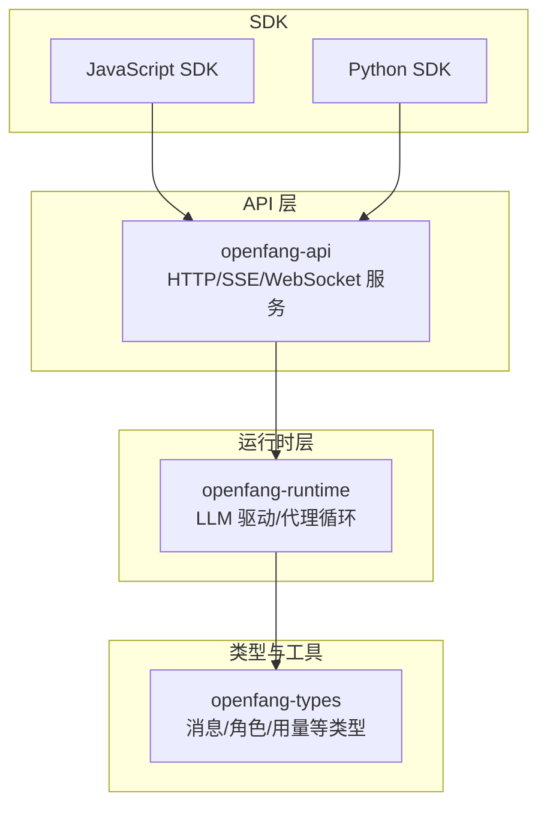
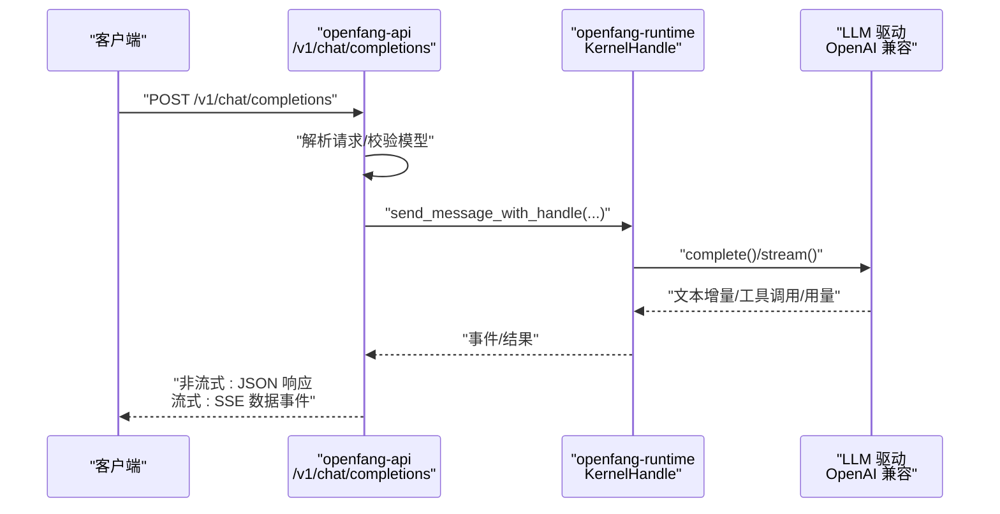
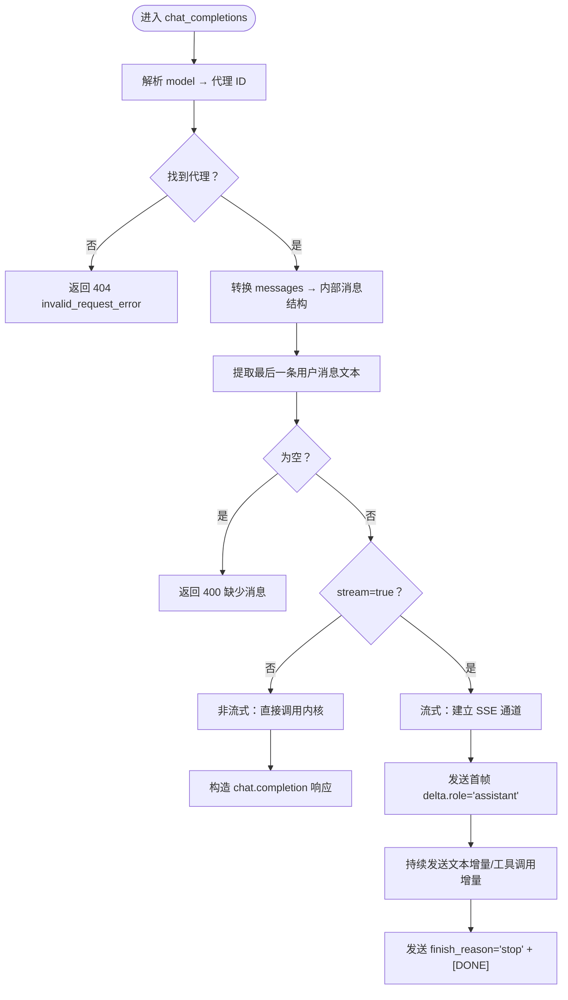
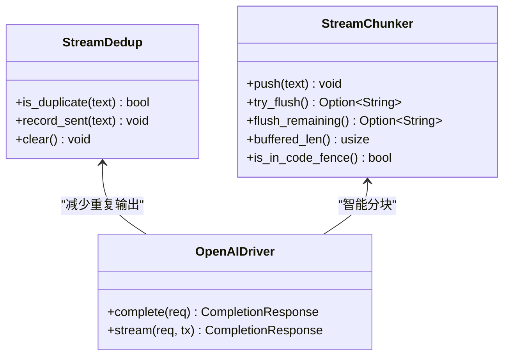
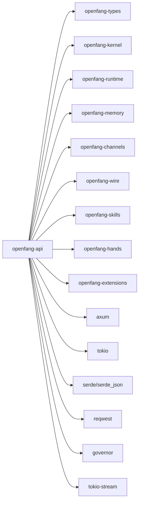

# OpenAI 兼容 API

<cite>
**本文引用的文件**
- [crates/openfang-api/src/lib.rs](file://crates/openfang-api/src/lib.rs)
- [crates/openfang-api/src/openai_compat.rs](file://crates/openfang-api/src/openai_compat.rs)
- [crates/openfang-api/src/routes.rs](file://crates/openfang-api/src/routes.rs)
- [crates/openfang-api/src/types.rs](file://crates/openfang-api/src/types.rs)
- [crates/openfang-api/src/stream_chunker.rs](file://crates/openfang-api/src/stream_chunker.rs)
- [crates/openfang-api/src/stream_dedup.rs](file://crates/openfang-api/src/stream_dedup.rs)
- [crates/openfang-runtime/src/drivers/openai.rs](file://crates/openfang-runtime/src/drivers/openai.rs)
- [sdk/javascript/index.js](file://sdk/javascript/index.js)
- [sdk/python/openfang_client.py](file://sdk/python/openfang_client.py)
- [crates/openfang-api/Cargo.toml](file://crates/openfang-api/Cargo.toml)
- [README.md](file://README.md)
</cite>

## 目录
1. [简介](#简介)
2. [项目结构](#项目结构)
3. [核心组件](#核心组件)
4. [架构总览](#架构总览)
5. [详细组件分析](#详细组件分析)
6. [依赖分析](#依赖分析)
7. [性能考虑](#性能考虑)
8. [故障排查指南](#故障排查指南)
9. [结论](#结论)
10. [附录](#附录)

## 简介
本文件面向希望将现有 OpenAI SDK 应用迁移到 OpenFang 的团队与个人开发者，系统化地阐述 OpenFang 的 OpenAI 兼容 API（/v1/chat/completions）端点规范、参数映射关系、响应格式转换、流式响应处理细节，并提供从 OpenAI SDK 迁移到 OpenFang 的完整步骤、配置变更要点、兼容性差异与限制、性能对比建议、自定义模型支持、多提供商切换、成本优化策略，以及故障转移、降级处理与监控告警的最佳实践。

## 项目结构
OpenFang 以模块化 Rust crate 组织，其中 openfang-api 提供 HTTP/WebSocket/SSE API 服务，内建 OpenAI 兼容端点；openfang-runtime 提供 LLM 驱动与代理循环；openfang-types 定义核心数据类型；SDK 提供 JavaScript 与 Python 客户端。

图表来源
- [crates/openfang-api/src/lib.rs:1-18](file://crates/openfang-api/src/lib.rs#L1-L18)
- [crates/openfang-api/Cargo.toml:1-44](file://crates/openfang-api/Cargo.toml#L1-L44)

章节来源
- [crates/openfang-api/src/lib.rs:1-18](file://crates/openfang-api/src/lib.rs#L1-L18)
- [crates/openfang-api/Cargo.toml:1-44](file://crates/openfang-api/Cargo.toml#L1-L44)

## 核心组件
- OpenAI 兼容端点：/v1/chat/completions（非流式与流式）、/v1/models（列出可用“模型”）
- 请求/响应类型：消息内容、角色、工具调用、用量统计
- 流式处理：SSE 分块、去重、Markdown 智能分块
- LLM 驱动：OpenAI 兼容驱动（含 Azure 模式、温度/令牌上限适配、错误恢复）

章节来源
- [crates/openfang-api/src/openai_compat.rs:24-158](file://crates/openfang-api/src/openai_compat.rs#L24-L158)
- [crates/openfang-api/src/stream_chunker.rs:6-17](file://crates/openfang-api/src/stream_chunker.rs#L6-L17)
- [crates/openfang-api/src/stream_dedup.rs:1-18](file://crates/openfang-api/src/stream_dedup.rs#L1-L18)
- [crates/openfang-runtime/src/drivers/openai.rs:1-107](file://crates/openfang-runtime/src/drivers/openai.rs#L1-L107)

## 架构总览
OpenFang 在 API 层解析 OpenAI 兼容请求，将消息与参数映射到内部消息结构，选择目标代理（Agent），通过运行时内核发送消息或启动流式通道，最终以 OpenAI 兼容格式返回。

图表来源
- [crates/openfang-api/src/openai_compat.rs:245-367](file://crates/openfang-api/src/openai_compat.rs#L245-L367)
- [crates/openfang-runtime/src/drivers/openai.rs:266-745](file://crates/openfang-runtime/src/drivers/openai.rs#L266-L745)

## 详细组件分析

### OpenAI 兼容端点：/v1/chat/completions
- 支持非流式与流式两种模式
- 参数映射
  - model → 解析为代理标识（名称/openfang:<name>/UUID）
  - messages → 角色与内容映射，支持文本与图片（data URI）
  - max_tokens/temperature → 映射至运行时请求
  - stream → 控制是否返回 SSE
- 响应格式
  - 非流式：chat.completion，包含 choices[].message.content/tool_calls 与 usage
  - 流式：chat.completion.chunk，首帧 delta.role="assistant"，后续增量文本/工具调用，结束发送 [DONE]
- 错误处理：模型不存在返回 404；无用户消息返回 400；内部错误返回 500

图表来源
- [crates/openfang-api/src/openai_compat.rs:245-532](file://crates/openfang-api/src/openai_compat.rs#L245-L532)

章节来源
- [crates/openfang-api/src/openai_compat.rs:24-158](file://crates/openfang-api/src/openai_compat.rs#L24-L158)
- [crates/openfang-api/src/openai_compat.rs:245-367](file://crates/openfang-api/src/openai_compat.rs#L245-L367)
- [crates/openfang-api/src/openai_compat.rs:369-532](file://crates/openfang-api/src/openai_compat.rs#L369-L532)

### /v1/models 列表端点
- 将所有已注册代理作为“模型”返回，id 采用 openfang:<name> 前缀，owned_by 固定为 openfang
- 便于在 SDK 中以统一方式枚举可用模型

章节来源
- [crates/openfang-api/src/openai_compat.rs:534-559](file://crates/openfang-api/src/openai_compat.rs#L534-L559)

### 请求/响应数据模型
- 请求体：ChatCompletionRequest（model/messages/stream/max_tokens/temperature）
- 响应体：ChatCompletionResponse（choices[].message.content/tool_calls/usage）
- 流式响应体：ChatCompletionChunk（choices[].delta.content/tool_calls/finish_reason）

章节来源
- [crates/openfang-api/src/openai_compat.rs:26-158](file://crates/openfang-api/src/openai_compat.rs#L26-L158)

### 流式处理与优化
- 去重检测：避免重复文本（精确匹配与归一化匹配）
- Markdown 智能分块：不破坏代码块边界，按段落/换行/句号优先切分
- SSE 事件：首帧 role，后续增量文本/工具调用，结束帧 finish_reason + [DONE]

图表来源
- [crates/openfang-api/src/stream_dedup.rs:12-68](file://crates/openfang-api/src/stream_dedup.rs#L12-L68)
- [crates/openfang-api/src/stream_chunker.rs:6-139](file://crates/openfang-api/src/stream_chunker.rs#L6-L139)
- [crates/openfang-runtime/src/drivers/openai.rs:747-751](file://crates/openfang-runtime/src/drivers/openai.rs#L747-L751)

章节来源
- [crates/openfang-api/src/stream_dedup.rs:1-161](file://crates/openfang-api/src/stream_dedup.rs#L1-L161)
- [crates/openfang-api/src/stream_chunker.rs:1-245](file://crates/openfang-api/src/stream_chunker.rs#L1-L245)
- [crates/openfang-runtime/src/drivers/openai.rs:747-751](file://crates/openfang-runtime/src/drivers/openai.rs#L747-L751)

### LLM 驱动与多提供商支持
- OpenAI 兼容驱动：支持标准 OpenAI 与 Azure OpenAI（部署 URL 与 api-key 头）
- 自适应参数：根据模型自动切换 max_tokens/max_completion_tokens、温度限制、禁用思考等
- 错误恢复：429 重试、参数修正（如温度/令牌上限）、工具调用失败恢复、模型不支持工具时自动降级

章节来源
- [crates/openfang-runtime/src/drivers/openai.rs:1-107](file://crates/openfang-runtime/src/drivers/openai.rs#L1-L107)
- [crates/openfang-runtime/src/drivers/openai.rs:135-172](file://crates/openfang-runtime/src/drivers/openai.rs#L135-L172)
- [crates/openfang-runtime/src/drivers/openai.rs:474-744](file://crates/openfang-runtime/src/drivers/openai.rs#L474-L744)

### SDK 使用与迁移指南
- JavaScript SDK：支持健康检查、状态查询、SSE 流式迭代
- Python SDK：支持健康检查、SSE 流式迭代、会话管理
- 迁移步骤
  - 将 OpenAI Base URL 替换为 OpenFang API 地址（例如 http://localhost:4200）
  - 将 model 名称替换为 OpenFang 代理名称（或 openfang:<name>）
  - 若使用 Azure OpenAI，请确保驱动处于 Azure 模式并正确设置 api-key
  - 对于流式场景，使用 SDK 的流式接口消费 SSE 事件

章节来源
- [sdk/javascript/index.js:1-480](file://sdk/javascript/index.js#L1-L480)
- [sdk/python/openfang_client.py:1-368](file://sdk/python/openfang_client.py#L1-L368)
- [README.md:389-405](file://README.md#L389-L405)

## 依赖分析
- openfang-api 依赖 openfang-types/openfang-kernel/openfang-runtime/openfang-memory/openfang-channels/openfang-wire/openfang-skills/openfang-hands/openfang-extensions
- 关键外部依赖：axum、tokio、serde、reqwest、governor（速率限制）、tokio-stream（SSE）

图表来源
- [crates/openfang-api/Cargo.toml:8-38](file://crates/openfang-api/Cargo.toml#L8-L38)

章节来源
- [crates/openfang-api/Cargo.toml:1-44](file://crates/openfang-api/Cargo.toml#L1-L44)

## 性能考虑
- 流式渲染优化：通过 StreamChunker 与 StreamDedup 减少重复与过度切分，提升用户体验
- LLM 驱动自适应：针对不同模型自动调整参数，降低重试与失败率
- 速率限制：内置 GCRA 限流器，结合 per-IP 跟踪，避免突发流量导致下游过载
- 成本优化：多提供商路由与智能回退，结合 per-model 价格信息进行成本感知调度

## 故障排查指南
- 常见错误码
  - 404：模型未找到（model 不匹配任何代理）
  - 400：缺少用户消息或请求格式错误
  - 500：代理处理失败或上游 LLM 返回异常
- 排查步骤
  - 确认 model 是否为 openfang:<name> 或代理名称/UUID
  - 确认 messages 中至少包含一条用户消息
  - 检查上游 LLM 返回状态与错误信息（驱动会进行参数修正与重试）
  - 开启日志与指标，观察 SSE 事件是否正常到达客户端
- 降级策略
  - 当上游模型不支持工具调用时，驱动会自动去除工具并重试
  - 当模型拒绝温度参数或 max_tokens 设置时，驱动会自动修正参数

章节来源
- [crates/openfang-api/src/openai_compat.rs:250-288](file://crates/openfang-api/src/openai_compat.rs#L250-L288)
- [crates/openfang-runtime/src/drivers/openai.rs:474-744](file://crates/openfang-runtime/src/drivers/openai.rs#L474-L744)

## 结论
OpenFang 的 OpenAI 兼容 API 以最小改造即可接入现有 OpenAI 生态，同时提供更强的流式体验、多提供商路由与成本控制能力。通过 SDK 的流式接口与内建的去重与智能分块机制，可获得更顺滑的交互体验。建议在生产中结合速率限制、监控告警与故障转移策略，确保稳定性与可观测性。

## 附录

### OpenAI 兼容端点与参数对照
- 端点：POST /v1/chat/completions
- 请求字段
  - model：代理名称或 openfang:<name> 或 UUID
  - messages：角色与内容（支持文本与 data URI 图片）
  - stream：是否启用流式
  - max_tokens/temperature：传入运行时
- 响应字段
  - 非流式：choices[].message.content/tool_calls/usage
  - 流式：choices[].delta.content/tool_calls/finish_reason，结束发送 [DONE]

章节来源
- [crates/openfang-api/src/openai_compat.rs:26-158](file://crates/openfang-api/src/openai_compat.rs#L26-L158)
- [crates/openfang-api/src/openai_compat.rs:245-532](file://crates/openfang-api/src/openai_compat.rs#L245-L532)

### 迁移步骤清单
- 更改 Base URL 为 OpenFang API（如 http://localhost:4200）
- 将 OpenAI model 名称替换为 OpenFang 代理名称（或 openfang:<name>）
- 如使用 Azure OpenAI，启用 Azure 模式并设置 api-key
- 使用 SDK 的流式接口消费 SSE 事件
- 在生产中配置速率限制、监控与告警

章节来源
- [README.md:389-405](file://README.md#L389-L405)
- [sdk/javascript/index.js:1-480](file://sdk/javascript/index.js#L1-L480)
- [sdk/python/openfang_client.py:1-368](file://sdk/python/openfang_client.py#L1-L368)