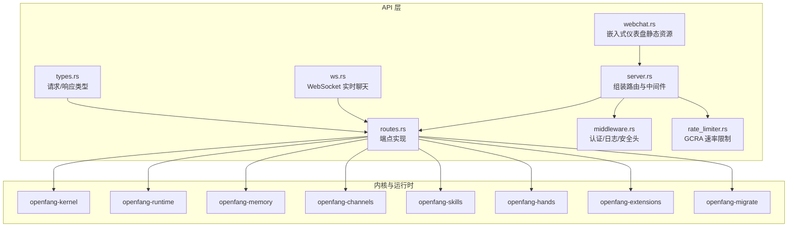
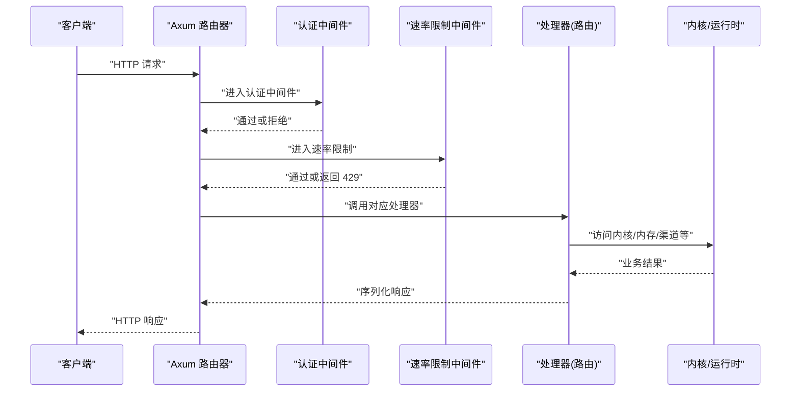
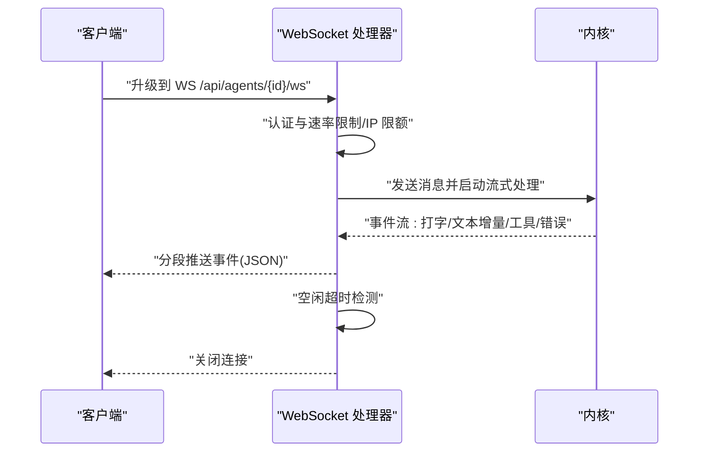
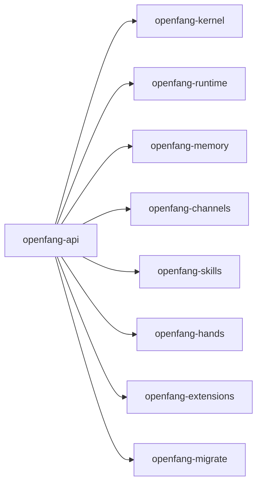

# REST API

<cite>
**本文引用的文件**
- [crates/openfang-api/src/server.rs](file://crates/openfang-api/src/server.rs)
- [crates/openfang-api/src/middleware.rs](file://crates/openfang-api/src/middleware.rs)
- [crates/openfang-api/src/rate_limiter.rs](file://crates/openfang-api/src/rate_limiter.rs)
- [crates/openfang-api/src/types.rs](file://crates/openfang-api/src/types.rs)
- [crates/openfang-api/src/webchat.rs](file://crates/openfang-api/src/webchat.rs)
- [crates/openfang-api/src/ws.rs](file://crates/openfang-api/src/ws.rs)
- [crates/openfang-api/Cargo.toml](file://crates/openfang-api/Cargo.toml)
</cite>

## 目录
1. [简介](#简介)
2. [项目结构](#项目结构)
3. [核心组件](#核心组件)
4. [架构总览](#架构总览)
5. [详细组件分析](#详细组件分析)
6. [依赖关系分析](#依赖关系分析)
7. [性能与限流](#性能与限流)
8. [故障排查指南](#故障排查指南)
9. [结论](#结论)
10. [附录：端点清单与规范](#附录端点清单与规范)

## 简介
本文件为 OpenFang Agent OS 的 REST API 详细文档，覆盖所有已实现的 140+ 个 REST 端点，包含：
- HTTP 方法、URL 路径、请求参数、响应格式
- 功能用途、必需/可选参数、数据类型与验证规则
- 成功/失败示例、状态码含义、错误响应格式
- 认证与安全策略（API Key、会话 Cookie、CORS）
- 版本控制与向后兼容策略
- 客户端实现指南与最佳实践

OpenFang 提供智能体管理、消息处理、会话管理、工作流编排、渠道集成、技能市场、Hands 工具、审计与日志、预算用量、MCP 协议、A2A Agent-to-Agent 协议等核心能力的统一 REST 接口。

## 项目结构
OpenFang 的 API 服务位于 openfang-api crate，采用 Axum 框架构建，通过 server.rs 组装路由与中间件，routes.rs 中定义具体端点逻辑（在该仓库中以模块形式存在），并通过 middleware.rs 和 rate_limiter.rs 提供认证、安全头、日志与速率限制。

图表来源
- [crates/openfang-api/src/server.rs:35-722](file://crates/openfang-api/src/server.rs#L35-L722)
- [crates/openfang-api/src/middleware.rs:1-270](file://crates/openfang-api/src/middleware.rs#L1-L270)
- [crates/openfang-api/src/rate_limiter.rs:1-100](file://crates/openfang-api/src/rate_limiter.rs#L1-L100)
- [crates/openfang-api/src/types.rs:1-110](file://crates/openfang-api/src/types.rs#L1-L110)
- [crates/openfang-api/src/webchat.rs:1-170](file://crates/openfang-api/src/webchat.rs#L1-L170)
- [crates/openfang-api/src/ws.rs:1-1372](file://crates/openfang-api/src/ws.rs#L1-L1372)

章节来源
- [crates/openfang-api/src/server.rs:35-722](file://crates/openfang-api/src/server.rs#L35-L722)
- [crates/openfang-api/Cargo.toml:1-46](file://crates/openfang-api/Cargo.toml#L1-L46)

## 核心组件
- 路由器与端点注册：server.rs 将所有端点注册到 Axum Router，并注入共享状态 AppState。
- 认证中间件：middleware.rs 支持 Bearer Token 与查询参数 token，以及基于配置的会话 Cookie 验证。
- 速率限制：rate_limiter.rs 使用 GCRA 算法，按操作成本进行配额扣减。
- 请求/响应类型：types.rs 定义了常用请求体（如 SpawnRequest、MessageRequest）与响应体（如 SpawnResponse）。
- 嵌入式仪表盘：webchat.rs 提供静态 HTML/CSS/JS 资源，支持单二进制部署。
- WebSocket：ws.rs 提供实时聊天通道，支持打字指示、文本增量、工具事件与错误通知。

章节来源
- [crates/openfang-api/src/server.rs:121-722](file://crates/openfang-api/src/server.rs#L121-L722)
- [crates/openfang-api/src/middleware.rs:54-215](file://crates/openfang-api/src/middleware.rs#L54-L215)
- [crates/openfang-api/src/rate_limiter.rs:47-80](file://crates/openfang-api/src/rate_limiter.rs#L47-L80)
- [crates/openfang-api/src/types.rs:5-110](file://crates/openfang-api/src/types.rs#L5-L110)
- [crates/openfang-api/src/webchat.rs:77-170](file://crates/openfang-api/src/webchat.rs#L77-L170)
- [crates/openfang-api/src/ws.rs:135-207](file://crates/openfang-api/src/ws.rs#L135-L207)

## 架构总览
下图展示 API 服务器如何组织端点、中间件与内核交互：

图表来源
- [crates/openfang-api/src/server.rs:706-722](file://crates/openfang-api/src/server.rs#L706-L722)
- [crates/openfang-api/src/middleware.rs:62-215](file://crates/openfang-api/src/middleware.rs#L62-L215)
- [crates/openfang-api/src/rate_limiter.rs:52-80](file://crates/openfang-api/src/rate_limiter.rs#L52-L80)

## 详细组件分析

### 认证与安全
- API Key 认证
  - 支持请求头 Authorization: Bearer <api_key> 或查询参数 ?token=。
  - 使用常量时间比较防止时序攻击。
  - 当未配置或为空白时，禁用认证（开发友好）。
- 会话认证
  - 当启用 dashboard auth 时，支持会话 Cookie openfang_session。
  - 会话签名使用 session_secret 验证。
- CORS
  - 无 API Key 时仅允许本地回环与常见开发端口。
  - 有 API Key 时允许本地回环与预设前端端口。
- 安全头
  - 设置 X-Content-Type-Options、X-Frame-Options、X-XSS-Protection、CSP、Referrer-Policy、Cache-Control、HSTS 等。
- 速率限制
  - GCRA 算法，每 IP 每分钟 500 令牌。
  - 不同端点按操作成本扣费（例如 /api/health=1，POST /api/agents=50，POST .../message=30）。

章节来源
- [crates/openfang-api/src/middleware.rs:54-215](file://crates/openfang-api/src/middleware.rs#L54-L215)
- [crates/openfang-api/src/server.rs:56-104](file://crates/openfang-api/src/server.rs#L56-L104)
- [crates/openfang-api/src/rate_limiter.rs:14-45](file://crates/openfang-api/src/rate_limiter.rs#L14-L45)

### WebSocket 实时聊天
- 端点：GET /api/agents/{id}/ws
- 认证：支持 Bearer Token 或 ?token= 查询参数；限制每 IP 最多 5 个连接。
- 连接保活：空闲超时 30 分钟，发送错误消息后关闭。
- 流式输出：文本增量、工具开始/结束、打字指示、错误、代理列表更新、静默完成、画布渲染等事件。
- 输入校验：最大消息长度 64KB；每分钟最多 10 条消息；内容清洗与空值检查。

图表来源
- [crates/openfang-api/src/ws.rs:135-207](file://crates/openfang-api/src/ws.rs#L135-L207)
- [crates/openfang-api/src/ws.rs:217-384](file://crates/openfang-api/src/ws.rs#L217-L384)
- [crates/openfang-api/src/ws.rs:390-781](file://crates/openfang-api/src/ws.rs#L390-L781)

章节来源
- [crates/openfang-api/src/ws.rs:135-207](file://crates/openfang-api/src/ws.rs#L135-L207)
- [crates/openfang-api/src/ws.rs:217-384](file://crates/openfang-api/src/ws.rs#L217-L384)
- [crates/openfang-api/src/ws.rs:390-781](file://crates/openfang-api/src/ws.rs#L390-L781)

### 嵌入式仪表盘与静态资源
- 提供 /、/logo.png、/favicon.ico、/manifest.json、/sw.js 等静态资源。
- 编译期将 HTML/CSS/JS 合并为单文件，支持主题切换、Markdown 渲染、WebSocket 聊天与 SPA 路由。

章节来源
- [crates/openfang-api/src/webchat.rs:77-170](file://crates/openfang-api/src/webchat.rs#L77-L170)

### 请求/响应类型
- SpawnRequest：创建智能体的请求，支持模板名或内联 TOML，可选签名。
- MessageRequest：发送消息请求，支持附件引用（file_id、filename、content_type）。
- MessageResponse：消息响应，包含输入/输出 token、迭代次数、费用估算。
- 其他常用类型：技能安装/卸载、代理更新、模式设置、迁移请求等。

章节来源
- [crates/openfang-api/src/types.rs:5-110](file://crates/openfang-api/src/types.rs#L5-L110)

## 依赖关系分析
- openfang-api 依赖 openfang-kernel、openfang-runtime、openfang-memory、openfang-channels、openfang-skills、openfang-hands、openfang-extensions、openfang-migrate 等子 crate。
- 中间件与限流器通过 Tower 中间件链接入，确保全局一致的安全与性能策略。

图表来源
- [crates/openfang-api/Cargo.toml:8-18](file://crates/openfang-api/Cargo.toml#L8-L18)

章节来源
- [crates/openfang-api/Cargo.toml:8-18](file://crates/openfang-api/Cargo.toml#L8-L18)

## 性能与限流
- GCRA 速率限制
  - 每 IP 每分钟 500 令牌。
  - 操作成本示例：健康检查 1、列出工具/技能/代理 2、状态/版本 1、代理列表 2、用量查询 3、审计/市场 5、创建代理 50、消息 30、运行工作流/迁移 100、更新代理 10。
- 日志与追踪
  - 请求 ID 注入与结构化日志，便于问题定位。
- 压缩与缓存
  - 压缩层开启；静态资源带缓存头；仪表盘带 ETag。
- WebSocket
  - 文本缓冲去抖、空闲超时、每 IP 连接上限、速率限制与消息大小限制。

章节来源
- [crates/openfang-api/src/rate_limiter.rs:14-45](file://crates/openfang-api/src/rate_limiter.rs#L14-L45)
- [crates/openfang-api/src/middleware.rs:18-44](file://crates/openfang-api/src/middleware.rs#L18-L44)
- [crates/openfang-api/src/server.rs:116-118](file://crates/openfang-api/src/server.rs#L116-L118)
- [crates/openfang-api/src/webchat.rs:18-92](file://crates/openfang-api/src/webchat.rs#L18-L92)
- [crates/openfang-api/src/ws.rs:35-47](file://crates/openfang-api/src/ws.rs#L35-L47)
- [crates/openfang-api/src/ws.rs:294-301](file://crates/openfang-api/src/ws.rs#L294-L301)

## 故障排查指南
- 401 未授权
  - 检查 Authorization: Bearer <api_key> 是否正确；或是否启用了 dashboard auth 并提供了有效的 openfang_session Cookie。
- 403 禁止
  - 可能是 CORS 限制或未满足认证条件。
- 429 速率超限
  - 观察 GCRA 令牌消耗；减少高频请求或等待重试。
- 426 升级到 WebSocket 失败
  - 确认认证参数有效；检查每 IP 连接数是否超过 5；确认消息未超过 64KB。
- 5xx 内部错误
  - 查看服务端日志中的请求 ID，定位具体处理器与内核调用栈。

章节来源
- [crates/openfang-api/src/middleware.rs:136-215](file://crates/openfang-api/src/middleware.rs#L136-L215)
- [crates/openfang-api/src/rate_limiter.rs:67-77](file://crates/openfang-api/src/rate_limiter.rs#L67-L77)
- [crates/openfang-api/src/ws.rs:175-189](file://crates/openfang-api/src/ws.rs#L175-L189)

## 结论
OpenFang 的 REST API 以清晰的路由分层、完善的认证与安全策略、成本感知的速率限制、以及丰富的实时通信能力，支撑从智能体生命周期管理到工作流编排、渠道集成与技能市场的完整场景。建议客户端在生产环境始终启用 API Key 认证与 HTTPS，并结合速率限制策略与合理的重试退避机制。

## 附录：端点清单与规范

以下为已实现端点的分类与规范概览（按路径前缀组织）。由于端点数量较多，本节提供“清单+示例”指引，具体字段与验证规则请参考 server.rs 中的路由注册与 types.rs 中的请求/响应类型定义。

- 基础健康与状态
  - GET /api/health
  - GET /api/health/detail
  - GET /api/status
  - GET /api/version
  - 示例：返回服务健康状态、内核状态、版本信息
  - 认证：公开端点（GET）

- 代理管理
  - GET /api/agents
  - POST /api/agents
  - GET /api/agents/{id}
  - DELETE /api/agents/{id}
  - PATCH /api/agents/{id}
  - PUT /api/agents/{id}/mode
  - POST /api/agents/{id}/restart
  - POST /api/agents/{id}/start
  - POST /api/agents/{id}/stop
  - PUT /api/agents/{id}/model
  - GET /api/agents/{id}/tools
  - PUT /api/agents/{id}/tools
  - GET /api/agents/{id}/skills
  - PUT /api/agents/{id}/skills
  - GET /api/agents/{id}/mcp_servers
  - PUT /api/agents/{id}/mcp_servers
  - PATCH /api/agents/{id}/identity
  - PATCH /api/agents/{id}/config
  - POST /api/agents/{id}/clone
  - GET /api/agents/{id}/files
  - GET /api/agents/{id}/files/{filename}
  - PUT /api/agents/{id}/files/{filename}
  - GET /api/agents/{id}/deliveries
  - POST /api/agents/{id}/upload
  - GET /api/agents/{id}/ws
  - GET /api/uploads/{file_id}
  - 示例：创建、查询、更新、删除代理；切换模式；模型与工具/技能/MCP 配置；文件上传与下载；WebSocket 实时聊天
  - 认证：除 GET /api/agents 为公开外，其余均需认证

- 会话管理
  - GET /api/agents/{id}/session
  - GET /api/agents/{id}/sessions
  - POST /api/agents/{id}/sessions
  - POST /api/agents/{id}/sessions/{session_id}/switch
  - POST /api/agents/{id}/session/reset
  - DELETE /api/agents/{id}/history
  - POST /api/agents/{id}/session/compact
  - 示例：查询/创建/切换会话；重置/清理历史；压缩会话
  - 认证：需认证

- 消息与聊天
  - POST /api/agents/{id}/message
  - POST /api/agents/{id}/message/stream
  - 示例：同步/流式发送消息；支持附件引用
  - 认证：需认证
  - 类型：请求体见 MessageRequest；响应体见 MessageResponse

- 渠道管理
  - GET /api/channels
  - POST /api/channels/{name}/configure
  - DELETE /api/channels/{name}/configure
  - POST /api/channels/{name}/test
  - POST /api/channels/reload
  - POST /api/channels/whatsapp/qr/start
  - GET /api/channels/whatsapp/qr/status
  - 示例：列出/配置/测试/重载渠道；WhatsApp 二维码登录流程
  - 认证：需认证

- 模板与内存
  - GET /api/templates
  - GET /api/templates/{name}
  - GET /api/memory/agents/{id}/kv
  - GET /api/memory/agents/{id}/kv/{key}
  - GET /api/memory/agents/{id}/kv/{key}
  - PUT /api/memory/agents/{id}/kv/{key}
  - DELETE /api/memory/agents/{id}/kv/{key}

- 触发器与定时任务
  - GET /api/triggers
  - POST /api/triggers
  - PUT /api/triggers/{id}
  - DELETE /api/triggers/{id}
  - GET /api/schedules
  - POST /api/schedules
  - PUT /api/schedules/{id}
  - DELETE /api/schedules/{id}
  - POST /api/schedules/{id}/run
  - 示例：触发器与定时任务 CRUD、执行
  - 认证：需认证

- 工作流编排
  - GET /api/workflows
  - POST /api/workflows
  - GET /api/workflows/{id}
  - PUT /api/workflows/{id}
  - DELETE /api/workflows/{id}
  - POST /api/workflows/{id}/run
  - GET /api/workflows/{id}/runs
  - 示例：工作流 CRUD、运行与查看运行历史
  - 认证：需认证

- 技能市场与安装
  - GET /api/skills
  - POST /api/skills/install
  - POST /api/skills/uninstall
  - GET /api/marketplace/search
  - 示例：列出技能、安装/卸载、搜索市场
  - 认证：需认证

- ClawHub 生态
  - GET /api/clawhub/search
  - GET /api/clawhub/browse
  - GET /api/clawhub/skill/{slug}
  - GET /api/clawhub/skill/{slug}/code
  - POST /api/clawhub/install
  - 示例：搜索/浏览/安装 ClawHub 技能
  - 认证：需认证

- Hands 工具
  - GET /api/hands
  - POST /api/hands/install
  - POST /api/hands/upsert
  - GET /api/hands/active
  - GET /api/hands/{hand_id}
  - POST /api/hands/{hand_id}/activate
  - POST /api/hands/{hand_id}/check-deps
  - POST /api/hands/{hand_id}/install-deps
  - GET /api/hands/{hand_id}/settings
  - PUT /api/hands/{hand_id}/settings
  - POST /api/hands/instances/{id}/pause
  - POST /api/hands/instances/{id}/resume
  - DELETE /api/hands/instances/{id}
  - GET /api/hands/instances/{id}/stats
  - GET /api/hands/instances/{id}/browser
  - 示例：Hands 列表、安装/激活/依赖检查/设置、实例暂停/恢复/统计
  - 认证：需认证

- MCP 与 A2A 协议
  - GET /api/mcp/servers
  - GET /.well-known/agent.json
  - GET /a2a/agents
  - POST /a2a/tasks/send
  - GET /a2a/tasks/{id}
  - POST /a2a/tasks/{id}/cancel
  - GET /api/a2a/agents
  - POST /api/a2a/discover
  - POST /api/a2a/send
  - GET /api/a2a/tasks/{id}/status
  - 示例：MCP 服务器、A2A 代理卡片、任务发送/查询/取消、外部发现与发送
  - 认证：需认证

- 审计与日志
  - GET /api/audit/recent
  - GET /api/audit/verify
  - GET /api/logs/stream
  - 示例：最近审计、验证、SSE 实时日志流
  - 认证：需认证

- 网络与通信
  - GET /api/peers
  - GET /api/network/status
  - GET /api/comms/topology
  - GET /api/comms/events
  - GET /api/comms/events/stream
  - POST /api/comms/send
  - POST /api/comms/task
  - 示例：节点拓扑、网络状态、事件流、发送/派发任务
  - 认证：需认证

- 配置与模型
  - GET /api/config
  - GET /api/config/schema
  - POST /api/config/set
  - GET /api/models
  - GET /api/models/aliases
  - POST /api/models/custom
  - DELETE /api/models/custom/{*id}
  - GET /api/models/{*id}
  - GET /api/providers
  - POST /api/providers/github-copilot/oauth/start
  - GET /api/providers/github-copilot/oauth/poll/{poll_id}
  - POST /api/providers/{name}/key
  - DELETE /api/providers/{name}/key
  - POST /api/providers/{name}/test
  - PUT /api/providers/{name}/url
  - 示例：配置读取/热重载、模型/别名/自定义模型、提供商密钥/测试/URL
  - 认证：需认证

- 预算与用量
  - GET /api/budget
  - PUT /api/budget
  - GET /api/budget/agents
  - GET /api/budget/agents/{id}
  - PUT /api/budget/agents/{id}
  - GET /api/usage
  - GET /api/usage/summary
  - GET /api/usage/by-model
  - GET /api/usage/daily
  - 示例：全局/代理预算、用量统计与明细
  - 认证：需认证

- 会话与标签
  - GET /api/sessions
  - DELETE /api/sessions/{id}
  - PUT /api/sessions/{id}/label
  - GET /api/agents/{id}/sessions/by-label/{label}
  - 示例：会话列表、删除、标签设置、按标签查找
  - 认证：需认证

- 安全与配对
  - GET /api/security
  - POST /api/pairing/request
  - POST /api/pairing/complete
  - GET /api/pairing/devices
  - DELETE /api/pairing/devices/{id}
  - POST /api/pairing/notify
  - 示例：安全状态、设备配对流程
  - 认证：需认证

- 集成管理
  - GET /api/integrations
  - GET /api/integrations/available
  - POST /api/integrations/add
  - DELETE /api/integrations/{id}
  - POST /api/integrations/{id}/reconnect
  - GET /api/integrations/health
  - POST /api/integrations/reload
  - 示例：集成 CRUD、重连、健康检查、重载
  - 认证：需认证

- 迁移
  - GET /api/migrate/detect
  - POST /api/migrate/scan
  - POST /api/migrate
  - 示例：检测/扫描/执行迁移
  - 认证：需认证

- Cron 作业
  - GET /api/cron/jobs
  - POST /api/cron/jobs
  - DELETE /api/cron/jobs/{id}
  - PUT /api/cron/jobs/{id}/enable
  - GET /api/cron/jobs/{id}/status
  - 示例：CRON 作业 CRUD、启用/禁用、状态查询
  - 认证：需认证

- Webhook 与命令
  - POST /hooks/wake
  - POST /hooks/agent
  - GET /api/commands
  - 示例：外部事件唤醒、动态命令菜单
  - 认证：需认证

- 配置热重载
  - POST /api/config/reload
  - 示例：手动触发配置热重载
  - 认证：需认证

- 绑定管理
  - GET /api/bindings
  - POST /api/bindings
  - DELETE /api/bindings/{index}
  - 示例：代理绑定管理
  - 认证：需认证

- MCP HTTP
  - POST /mcp
  - 示例：通过 HTTP 暴露 MCP 协议
  - 认证：需认证

- OpenAI 兼容接口
  - POST /v1/chat/completions
  - GET /v1/models
  - 示例：兼容 OpenAI 的聊天补全与模型列表
  - 认证：需认证

- 仪表盘认证
  - POST /api/auth/login
  - POST /api/auth/logout
  - GET /api/auth/check
  - 示例：登录/登出/检查会话
  - 认证：当启用 dashboard auth 时需要会话

章节来源
- [crates/openfang-api/src/server.rs:121-722](file://crates/openfang-api/src/server.rs#L121-L722)
- [crates/openfang-api/src/types.rs:5-110](file://crates/openfang-api/src/types.rs#L5-L110)