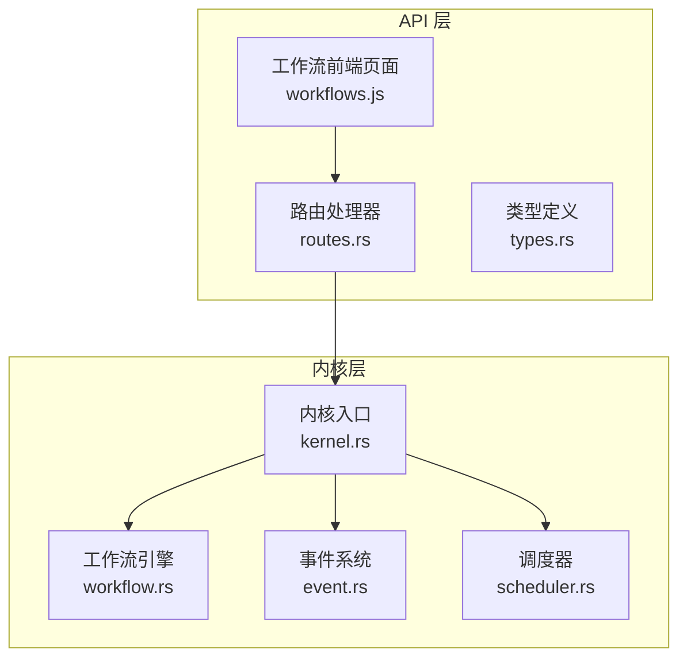
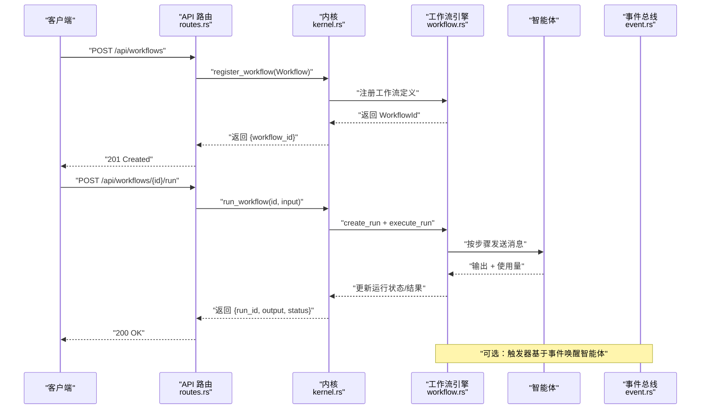
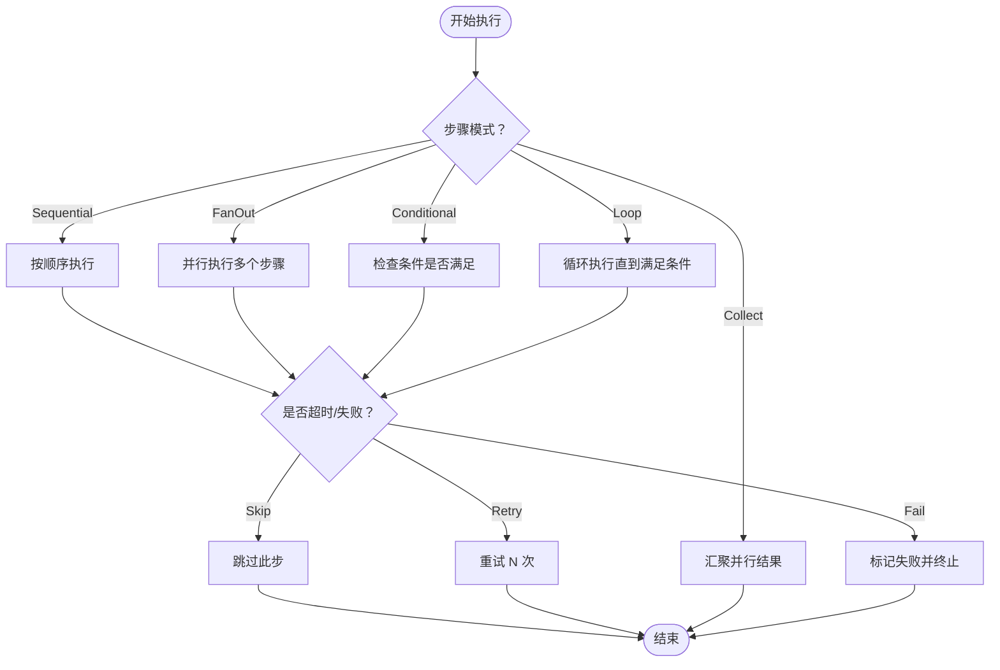
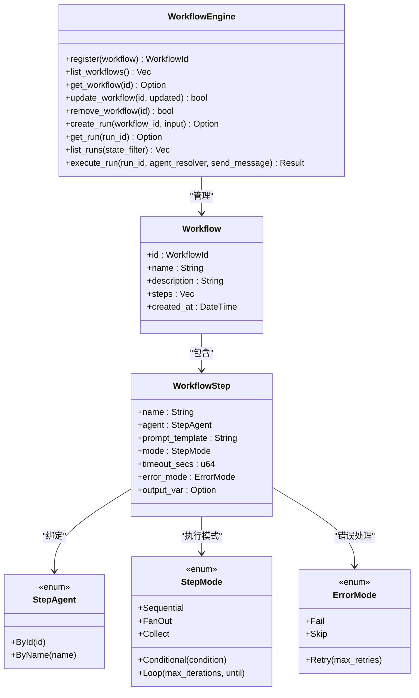
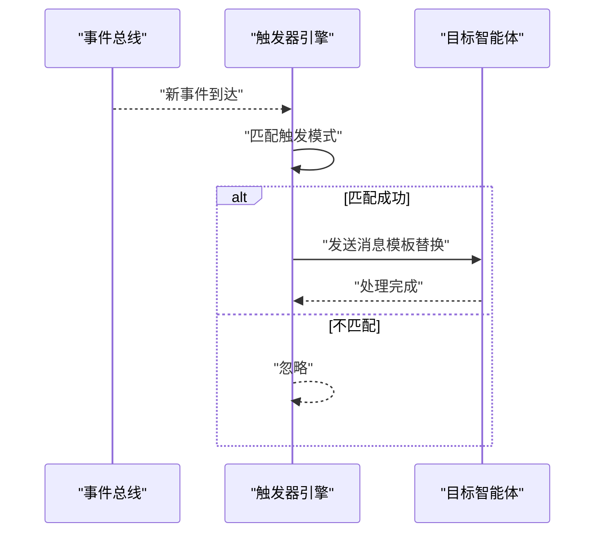
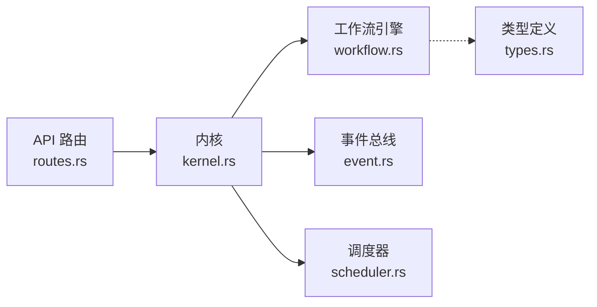

# 工作流编排 API

<cite>
**本文引用的文件**
- [routes.rs](file://crates/openfang-api/src/routes.rs)
- [workflow.rs](file://crates/openfang-kernel/src/workflow.rs)
- [types.rs](file://crates/openfang-api/src/types.rs)
- [event.rs](file://crates/openfang-types/src/event.rs)
- [scheduler.rs](file://crates/openfang-kernel/src/scheduler.rs)
- [workflows.js](file://crates/openfang-api/static/js/pages/workflows.js)
- [kernel.rs](file://crates/openfang-kernel/src/kernel.rs)
- [agent.rs](file://crates/openfang-types/src/agent.rs)
</cite>

## 目录
1. [简介](#简介)
2. [项目结构](#项目结构)
3. [核心组件](#核心组件)
4. [架构总览](#架构总览)
5. [详细组件分析](#详细组件分析)
6. [依赖关系分析](#依赖关系分析)
7. [性能考量](#性能考量)
8. [故障排查指南](#故障排查指南)
9. [结论](#结论)
10. [附录](#附录)

## 简介
本文件为“工作流编排 API”的权威技术文档，覆盖以下内容：
- 工作流创建、管理与执行的完整 API 列表与行为说明
- 工作流步骤定义、智能体绑定、条件判断、循环与并行策略
- 错误处理、超时控制、重试与跳过策略
- 工作流与智能体的交互方式、事件驱动机制、状态持久化
- 调试、监控与故障恢复的运维建议

该 API 基于 Rust 实现，通过 HTTP 接口对外提供工作流生命周期管理能力；后端由内核（Kernel）协调事件总线、调度器、内存与工具执行，实现多智能体流水线编排。

## 项目结构
工作流编排 API 的核心位于 openfang-api 与 openfang-kernel 两个子模块中：
- openfang-api：HTTP 路由层，负责请求解析、参数校验、响应封装与前端页面集成
- openfang-kernel：内核引擎层，包含工作流引擎、触发器引擎、调度器、事件总线等核心能力

图表来源
- [routes.rs](file://crates/openfang-api/src/routes.rs)
- [workflow.rs](file://crates/openfang-kernel/src/workflow.rs)
- [event.rs](file://crates/openfang-types/src/event.rs)
- [scheduler.rs](file://crates/openfang-kernel/src/scheduler.rs)
- [workflows.js](file://crates/openfang-api/static/js/pages/workflows.js)
- [kernel.rs](file://crates/openfang-kernel/src/kernel.rs)

章节来源
- [routes.rs](file://crates/openfang-api/src/routes.rs)
- [workflow.rs](file://crates/openfang-kernel/src/workflow.rs)
- [workflows.js](file://crates/openfang-api/static/js/pages/workflows.js)

## 核心组件
- 工作流引擎（WorkflowEngine）
  - 定义工作流（Workflow）、步骤（WorkflowStep）、运行实例（WorkflowRun）、运行状态（WorkflowRunState）
  - 支持顺序、并行（FanOut/Collect）、条件（Conditional）、循环（Loop）与变量存储（output_var）
  - 提供注册、更新、删除、查询、执行运行实例等能力
- 路由处理器（routes.rs）
  - 提供工作流 CRUD 与运行接口：POST /api/workflows、GET /api/workflows、POST /api/workflows/:id/run、GET /api/workflows/:id/runs、GET /api/workflows/:id、PUT /api/workflows/:id、DELETE /api/workflows/:id
  - 解析 JSON 请求体，构建 Workflow/WorkflowStep 结构，调用内核方法执行
- 类型定义（types.rs）
  - 定义消息发送、附件上传等通用请求/响应结构，便于 API 一致性
- 事件系统（event.rs）
  - 事件总线用于跨智能体与系统通信，支持触发器（Triggers）基于事件自动唤醒智能体
- 调度器（scheduler.rs）
  - 资源配额与使用统计，保障多智能体并发下的稳定性
- 前端页面（workflows.js）
  - 工作流页面的前端逻辑，负责加载、创建、执行与查看运行历史

章节来源
- [workflow.rs](file://crates/openfang-kernel/src/workflow.rs)
- [routes.rs](file://crates/openfang-api/src/routes.rs)
- [types.rs](file://crates/openfang-api/src/types.rs)
- [event.rs](file://crates/openfang-types/src/event.rs)
- [scheduler.rs](file://crates/openfang-kernel/src/scheduler.rs)
- [workflows.js](file://crates/openfang-api/static/js/pages/workflows.js)

## 架构总览
工作流编排的端到端流程如下：

图表来源
- [routes.rs](file://crates/openfang-api/src/routes.rs)
- [workflow.rs](file://crates/openfang-kernel/src/workflow.rs)
- [kernel.rs](file://crates/openfang-kernel/src/kernel.rs)
- [event.rs](file://crates/openfang-types/src/event.rs)

## 详细组件分析

### API 端点与行为
- 创建工作流
  - 方法与路径：POST /api/workflows
  - 请求体字段：name、description、steps（数组）
  - 步骤字段：name、agent_id 或 agent_name、mode、prompt、timeout_secs、error_mode、max_retries、output_var、condition、max_iterations、until
  - 返回：workflow_id
- 获取工作流列表
  - 方法与路径：GET /api/workflows
  - 返回：简要列表（id、name、description、steps 数、创建时间）
- 执行工作流
  - 方法与路径：POST /api/workflows/{id}/run
  - 请求体字段：input
  - 返回：run_id、output、status
- 查看运行历史
  - 方法与路径：GET /api/workflows/{id}/runs
  - 返回：运行实例列表（id、workflow_name、state、steps_completed、started_at、completed_at）
- 获取单个工作流
  - 方法与路径：GET /api/workflows/{id}
  - 返回：完整工作流定义（含 steps）
- 更新工作流
  - 方法与路径：PUT /api/workflows/{id}
  - 请求体字段：name、description、steps
  - 返回：status、workflow_id
- 删除工作流
  - 方法与路径：DELETE /api/workflows/{id}
  - 返回：status、workflow_id

章节来源
- [routes.rs](file://crates/openfang-api/src/routes.rs)

### 工作流步骤与编排策略
- 步骤绑定智能体
  - 支持通过 agent_id 或 agent_name 绑定
  - 通过 StepAgent 枚举在引擎侧解析
- 执行模式
  - 顺序（Sequential）：前一步完成后执行下一步
  - 并行（FanOut）：与后续 FanOut 步骤并行，Collect 汇聚
  - 条件（Conditional）：当前输出包含特定关键字才执行
  - 循环（Loop）：重复执行直到满足 until 条件或达到最大迭代次数
- 变量与模板
  - 支持在 prompt 中使用 {{input}} 与 {{var_name}} 占位符
  - output_var 将上一步输出存入变量，供后续步骤使用
- 错误处理
  - Fail：默认，失败即终止
  - Skip：失败则跳过，继续执行
  - Retry：最多重试 N 次
- 超时控制
  - 每步可设置 timeout_secs，默认 120 秒
- 运行状态
  - Pending、Running、Completed、Failed

图表来源
- [workflow.rs](file://crates/openfang-kernel/src/workflow.rs)

章节来源
- [workflow.rs](file://crates/openfang-kernel/src/workflow.rs)

### 工作流与智能体的交互
- 引擎通过 agent_resolver 解析 StepAgent，定位具体 AgentId
- 通过 send_message 发送消息给智能体，接收文本输出与 token 使用量
- 支持在步骤间传递输出，形成流水线式编排
- 调度器（AgentScheduler）负责资源配额与并发控制，避免资源耗尽

图表来源
- [workflow.rs](file://crates/openfang-kernel/src/workflow.rs)

章节来源
- [workflow.rs](file://crates/openfang-kernel/src/workflow.rs)
- [scheduler.rs](file://crates/openfang-kernel/src/scheduler.rs)

### 事件驱动机制
- 触发器（TriggerEngine）监听事件总线，匹配预设模式后向指定智能体发送消息
- 支持的模式：生命周期事件、系统事件、内存变更、内容匹配等
- 可限制最大触发次数，超过后自动禁用

图表来源
- [event.rs](file://crates/openfang-types/src/event.rs)
- [kernel.rs](file://crates/openfang-kernel/src/kernel.rs)

章节来源
- [event.rs](file://crates/openfang-types/src/event.rs)
- [kernel.rs](file://crates/openfang-kernel/src/kernel.rs)

### 状态持久化与运行历史
- 工作流定义持久化至磁盘目录（默认在 home 目录下 workflows 子目录），重启后可恢复
- 运行实例（WorkflowRun）保存在内存中，保留最近完成/失败的实例，超出上限会按创建时间淘汰旧记录
- 运行历史可通过 GET /api/workflows/{id}/runs 查询

章节来源
- [routes.rs](file://crates/openfang-api/src/routes.rs)
- [workflow.rs](file://crates/openfang-kernel/src/workflow.rs)

### 前端工作流页面
- 加载工作流列表、创建/编辑工作流、执行工作流、查看运行历史
- 与 API 端点一一对应，提供直观的可视化编排体验

章节来源
- [workflows.js](file://crates/openfang-api/static/js/pages/workflows.js)

## 依赖关系分析
- API 层依赖内核层提供的工作流引擎与注册表
- 内核层依赖事件总线、调度器、内存子系统与工具执行环境
- 工作流引擎不直接依赖内核，而是通过闭包（agent_resolver、send_message）解耦

图表来源
- [routes.rs](file://crates/openfang-api/src/routes.rs)
- [workflow.rs](file://crates/openfang-kernel/src/workflow.rs)
- [event.rs](file://crates/openfang-types/src/event.rs)
- [scheduler.rs](file://crates/openfang-kernel/src/scheduler.rs)
- [types.rs](file://crates/openfang-api/src/types.rs)
- [kernel.rs](file://crates/openfang-kernel/src/kernel.rs)

章节来源
- [routes.rs](file://crates/openfang-api/src/routes.rs)
- [workflow.rs](file://crates/openfang-kernel/src/workflow.rs)
- [kernel.rs](file://crates/openfang-kernel/src/kernel.rs)

## 性能考量
- 并行执行（FanOut）提升吞吐，但需关注资源配额与并发限制
- 超时与重试策略平衡可靠性与延迟
- 运行历史上限控制内存占用，避免长期运行导致内存膨胀
- 建议为高负载场景配置合理的资源配额与模型路由策略

## 故障排查指南
- 常见错误与状态码
  - 400：请求体缺失必要字段（如 steps、agent_id/name、mode 等）
  - 404：未找到工作流或智能体
  - 413：请求体过大（工作流定义或消息）
  - 429：配额限制（令牌/成本/网络等）
  - 500：内部错误（如执行失败、超时）
- 常见问题定位
  - 检查工作流步骤中的 agent_id/name 是否正确解析
  - 检查 error_mode 与 timeout_secs 设置是否合理
  - 查看运行历史（GET /api/workflows/{id}/runs）定位失败步骤
  - 关注配额警告与健康检查事件
- 建议操作
  - 启用日志与审计追踪，定位异常
  - 对不稳定步骤启用 Retry 或 Skip
  - 适当调整资源配额与并发策略

章节来源
- [routes.rs](file://crates/openfang-api/src/routes.rs)
- [workflow.rs](file://crates/openfang-kernel/src/workflow.rs)
- [event.rs](file://crates/openfang-types/src/event.rs)
- [scheduler.rs](file://crates/openfang-kernel/src/scheduler.rs)

## 结论
工作流编排 API 提供了从定义到执行的全链路能力，结合事件驱动与资源调度，能够支撑复杂多智能体流水线。通过合理的步骤设计、错误处理与监控运维，可在生产环境中稳定运行。

## 附录

### API 端点一览（摘要）
- POST /api/workflows：创建工作流
- GET /api/workflows：获取工作流列表
- POST /api/workflows/{id}/run：执行工作流
- GET /api/workflows/{id}/runs：查看运行历史
- GET /api/workflows/{id}：获取单个工作流
- PUT /api/workflows/{id}：更新工作流
- DELETE /api/workflows/{id}：删除工作流

章节来源
- [routes.rs](file://crates/openfang-api/src/routes.rs)

### 工作流配置示例（字段说明）
- name：工作流名称
- description：描述
- steps：步骤数组
  - name：步骤名
  - agent_id 或 agent_name：智能体标识
  - mode：执行模式（sequential/fan_out/collect/conditional/loop）
  - prompt：提示词模板（可使用 {{input}}、{{var_name}}）
  - timeout_secs：超时秒数
  - error_mode：错误处理（fail/skip/retry）
  - max_retries：重试次数（仅 retry 生效）
  - output_var：输出变量名（用于后续步骤模板）
  - condition：条件关键字（仅 conditional 生效）
  - max_iterations/until：循环参数（仅 loop 生效）

章节来源
- [routes.rs](file://crates/openfang-api/src/routes.rs)
- [workflow.rs](file://crates/openfang-kernel/src/workflow.rs)