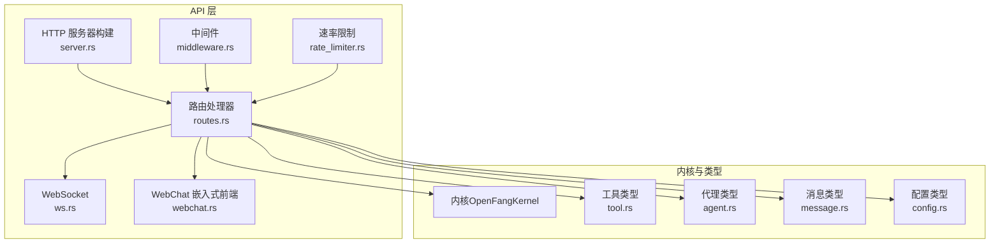
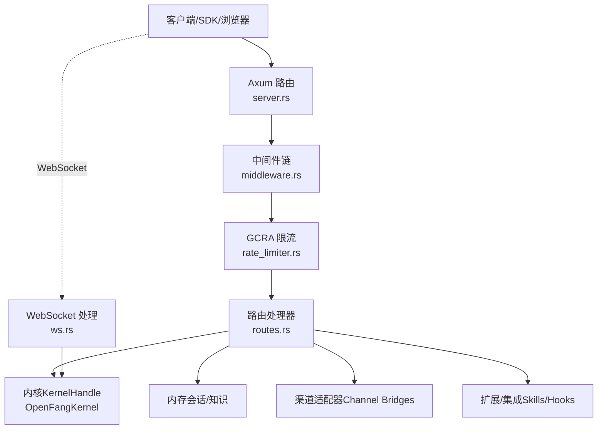
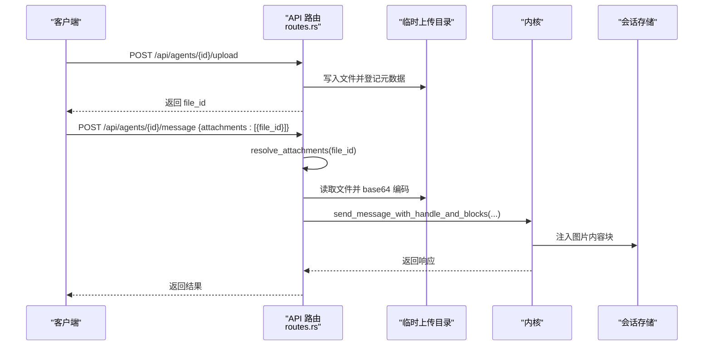
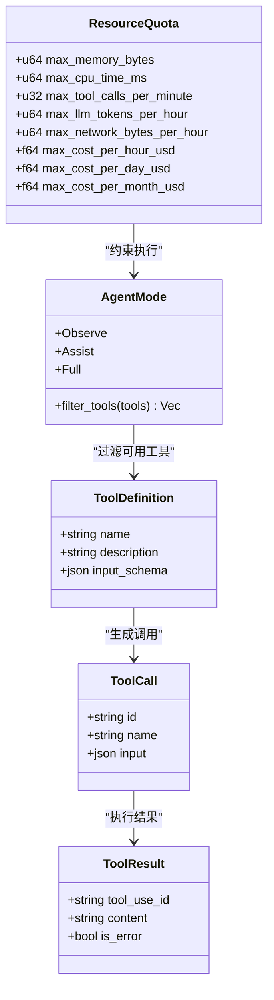
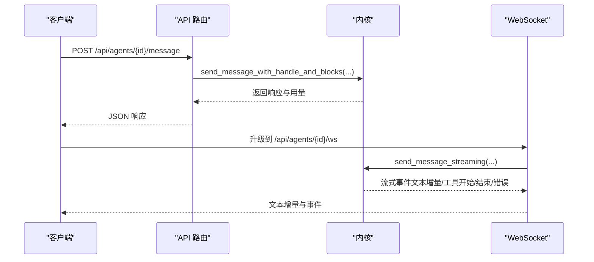
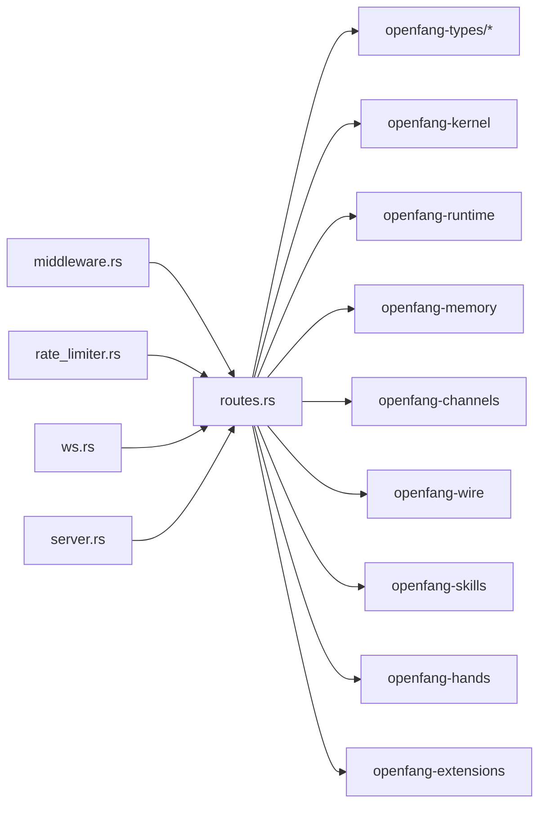

# 工具辅助 API

<cite>
**本文引用的文件**
- [lib.rs](file://crates/openfang-api/src/lib.rs)
- [routes.rs](file://crates/openfang-api/src/routes.rs)
- [server.rs](file://crates/openfang-api/src/server.rs)
- [types.rs](file://crates/openfang-api/src/types.rs)
- [webchat.rs](file://crates/openfang-api/src/webchat.rs)
- [ws.rs](file://crates/openfang-api/src/ws.rs)
- [middleware.rs](file://crates/openfang-api/src/middleware.rs)
- [rate_limiter.rs](file://crates/openfang-api/src/rate_limiter.rs)
- [Cargo.toml](file://crates/openfang-api/Cargo.toml)
- [tool.rs](file://crates/openfang-types/src/tool.rs)
- [agent.rs](file://crates/openfang-types/src/agent.rs)
- [message.rs](file://crates/openfang-types/src/message.rs)
- [config.rs](file://crates/openfang-types/src/config.rs)
</cite>

## 目录
1. [简介](#简介)
2. [项目结构](#项目结构)
3. [核心组件](#核心组件)
4. [架构总览](#架构总览)
5. [详细组件分析](#详细组件分析)
6. [依赖关系分析](#依赖关系分析)
7. [性能考虑](#性能考虑)
8. [故障排查指南](#故障排查指南)
9. [结论](#结论)
10. [附录](#附录)

## 简介
本文件为工具辅助 API 的系统化文档，覆盖以下主题：
- 系统工具与实用功能：代理管理、会话与消息、工作流编排、技能与手部（Hands）管理、渠道适配器、审计与日志、预算与用量统计、模型与提供商管理等。
- 辅助接口：文件上传与附件处理、图像注入到会话、WebSocket 实时聊天、OpenAI 兼容接口、WebHook 触发、设备配对、A2A 协议等。
- 工具策略与资源限制：工具模式（只读/受限/全权限）、资源配额（内存、CPU、网络、令牌、成本）、执行策略与安全模式。
- 运维工具：健康检查、热重载配置、优雅关闭、日志流、网络状态、审计校验等。
- 开发辅助：速率限制中间件、安全头、请求日志、认证与会话、OpenAI 兼容 API、WebChat 嵌入式界面。

## 项目结构
openfang-api 是基于 Rust 的 HTTP/WebSocket API 服务器，负责向内核（kernel）暴露 REST 接口，并在进程中运行内核实例。其模块组织如下：
- lib.rs：模块导出入口，声明子模块（路由、中间件、限流、WebSocket、类型等）。
- server.rs：构建路由、挂载中间件、启动 HTTP 服务、守护进程信息写入与热重载配置监听。
- routes.rs：所有 API 路由处理器，包括代理生命周期、消息发送、会话查询、工具/技能/手部管理、渠道与集成、审计与日志、预算与用量、模型与提供商、WebHook、A2A、OpenAI 兼容等。
- types.rs：API 请求/响应数据结构（如 SpawnRequest、MessageRequest、AttachmentRef 等）。
- middleware.rs：请求日志、认证（Bearer/X-API-Key/会话 Cookie）、安全头、CORS。
- rate_limiter.rs：基于 GCRA 的按操作成本的速率限制。
- ws.rs：WebSocket 升级与实时聊天，支持文本增量、工具事件、上下文压力提示、静默完成等。
- webchat.rs：嵌入式 WebChat 前端页面与静态资源（PWA 支持）。

图表来源
- [server.rs:37-712](file://crates/openfang-api/src/server.rs#L37-L712)
- [routes.rs:1-11270](file://crates/openfang-api/src/routes.rs#L1-L11270)
- [middleware.rs:1-270](file://crates/openfang-api/src/middleware.rs#L1-L270)
- [rate_limiter.rs:1-98](file://crates/openfang-api/src/rate_limiter.rs#L1-L98)
- [ws.rs:1-1372](file://crates/openfang-api/src/ws.rs#L1-L1372)
- [webchat.rs:1-170](file://crates/openfang-api/src/webchat.rs#L1-L170)
- [tool.rs:1-650](file://crates/openfang-types/src/tool.rs#L1-L650)
- [agent.rs:1-1304](file://crates/openfang-types/src/agent.rs#L1-L1304)
- [message.rs:1-341](file://crates/openfang-types/src/message.rs#L1-L341)
- [config.rs:1-4013](file://crates/openfang-types/src/config.rs#L1-L4013)

章节来源
- [lib.rs:1-18](file://crates/openfang-api/src/lib.rs#L1-L18)
- [server.rs:37-712](file://crates/openfang-api/src/server.rs#L37-L712)

## 核心组件
- 应用状态 AppState：持有内核句柄、桥接管理器、通道配置、通知句柄、缓存等，供所有路由共享。
- 路由处理器：覆盖代理生命周期、消息与会话、工具/技能/手部、渠道与集成、审计与日志、预算与用量、模型与提供商、WebHook、A2A、OpenAI 兼容等。
- 中间件：请求日志、认证（Bearer/X-API-Key/会话 Cookie）、安全头、CORS、压缩、追踪。
- 速率限制：基于 GCRA 的按操作成本的限流，保护系统免受滥用。
- WebSocket：实时聊天、文本增量、工具事件、上下文压力提示、静默完成。
- WebChat：嵌入式前端，提供代理管理、工作流、内存浏览、审计日志等界面。

章节来源
- [routes.rs:21-43](file://crates/openfang-api/src/routes.rs#L21-L43)
- [server.rs:37-712](file://crates/openfang-api/src/server.rs#L37-L712)
- [middleware.rs:14-270](file://crates/openfang-api/src/middleware.rs#L14-L270)
- [rate_limiter.rs:14-98](file://crates/openfang-api/src/rate_limiter.rs#L14-L98)
- [ws.rs:135-800](file://crates/openfang-api/src/ws.rs#L135-L800)
- [webchat.rs:77-170](file://crates/openfang-api/src/webchat.rs#L77-L170)

## 架构总览
下图展示 API 服务器如何组织与交互：

图表来源
- [server.rs:121-712](file://crates/openfang-api/src/server.rs#L121-L712)
- [routes.rs:1-11270](file://crates/openfang-api/src/routes.rs#L1-L11270)
- [ws.rs:135-800](file://crates/openfang-api/src/ws.rs#L135-L800)

## 详细组件分析

### 文件上传与附件处理
- 上传端点：POST /api/agents/{id}/upload
- 服务端点：GET /api/uploads/{file_id}
- 附件解析：resolve_attachments 将上传目录中的文件读取并编码为 ContentBlock::Image，注入到会话消息中。
- 图像注入：inject_attachments_into_session 在用户消息前插入图片内容块，确保 LLM 能看到图像。

图表来源
- [routes.rs:240-326](file://crates/openfang-api/src/routes.rs#L240-L326)
- [routes.rs:328-428](file://crates/openfang-api/src/routes.rs#L328-L428)

章节来源
- [routes.rs:240-326](file://crates/openfang-api/src/routes.rs#L240-L326)
- [routes.rs:328-428](file://crates/openfang-api/src/routes.rs#L328-L428)

### 工具注册与策略
- 工具定义：ToolDefinition、ToolCall、ToolResult；支持跨提供商的 JSON Schema 归一化。
- 工具模式：AgentMode（只读/受限/全权限），根据模式过滤可用工具列表。
- 资源配额：ResourceQuota 控制内存、CPU、工具调用频率、LLM 令牌、网络与成本上限。
- 执行策略：ExecSecurityMode（Deny/Allowlist/Full），结合白名单/黑名单与沙箱策略。

图表来源
- [tool.rs:5-36](file://crates/openfang-types/src/tool.rs#L5-L36)
- [agent.rs:188-223](file://crates/openfang-types/src/agent.rs#L188-L223)
- [agent.rs:247-282](file://crates/openfang-types/src/agent.rs#L247-L282)

章节来源
- [tool.rs:5-36](file://crates/openfang-types/src/tool.rs#L5-L36)
- [agent.rs:188-223](file://crates/openfang-types/src/agent.rs#L188-L223)
- [agent.rs:247-282](file://crates/openfang-types/src/agent.rs#L247-L282)

### 消息与会话处理
- 发送消息：POST /api/agents/{id}/message（支持附件注入）
- 获取会话：GET /api/agents/{id}/session（支持 ToolUse/ToolResult 合并显示）
- WebSocket 实时聊天：GET /api/agents/{id}/ws（支持文本增量、工具事件、静默完成）

图表来源
- [routes.rs:328-428](file://crates/openfang-api/src/routes.rs#L328-L428)
- [routes.rs:430-619](file://crates/openfang-api/src/routes.rs#L430-L619)
- [ws.rs:135-800](file://crates/openfang-api/src/ws.rs#L135-L800)

章节来源
- [routes.rs:328-428](file://crates/openfang-api/src/routes.rs#L328-L428)
- [routes.rs:430-619](file://crates/openfang-api/src/routes.rs#L430-L619)
- [ws.rs:135-800](file://crates/openfang-api/src/ws.rs#L135-L800)

### 工作流与调度
- 工作流注册：POST /api/workflows（步骤数组，支持按 ID 或名称绑定代理）
- 工作流运行：POST /api/workflows/{id}/run
- 计划任务：/api/schedules（增删改查、启用/禁用、状态查询）

章节来源
- [routes.rs:771-860](file://crates/openfang-api/src/routes.rs#L771-L860)
- [server.rs:297-308](file://crates/openfang-api/src/server.rs#L297-L308)

### 渠道与集成
- 渠道管理：/api/channels（列出/配置/测试/重载）
- WhatsApp 登录：/api/channels/whatsapp/qr/start、/api/channels/whatsapp/qr/status
- 集成管理：/api/integrations（增删改/重连/健康检查/重载）
- MCP 适配：/mcp（HTTP 暴露 MCP 协议）

章节来源
- [server.rs:247-270](file://crates/openfang-api/src/server.rs#L247-L270)
- [server.rs:631-660](file://crates/openfang-api/src/server.rs#L631-L660)

### 审计与日志
- 审计查看：/api/audit/recent、/api/audit/verify
- 日志流：/api/logs/stream（SSE）
- 安全状态：/api/security

章节来源
- [server.rs:419-428](file://crates/openfang-api/src/server.rs#L419-L428)
- [server.rs:519-521](file://crates/openfang-api/src/server.rs#L519-L521)

### 预算与用量
- 预算总览：/api/budget、/api/budget/agents、/api/budget/agents/{id}
- 用量统计：/api/usage、/api/usage/summary、/api/usage/by-model、/api/usage/daily

章节来源
- [server.rs:487-499](file://crates/openfang-api/src/server.rs#L487-L499)
- [server.rs:476-486](file://crates/openfang-api/src/server.rs#L476-L486)

### 模型与提供商
- 模型目录：/api/models、/api/models/aliases、/api/models/custom
- 提供商管理：/api/providers（增删改/测试/URL 设置）
- OpenAI 兼容：/v1/chat/completions、/v1/models

章节来源
- [server.rs:521-558](file://crates/openfang-api/src/server.rs#L521-L558)
- [server.rs:682-691](file://crates/openfang-api/src/server.rs#L682-L691)

### WebHook 与 A2A
- WebHook：/hooks/wake、/hooks/agent
- A2A：/.well-known/agent.json、/a2a/agents、/a2a/tasks/send、/a2a/tasks/{id}、/a2a/tasks/{id}/cancel、/api/a2a/agents、/api/a2a/discover、/api/a2a/send、/api/a2a/tasks/{id}/status

章节来源
- [server.rs:579-631](file://crates/openfang-api/src/server.rs#L579-L631)
- [server.rs:599-631](file://crates/openfang-api/src/server.rs#L599-L631)

### 设备配对
- /api/pairing/request、/api/pairing/complete、/api/pairing/devices、/api/pairing/devices/{id}、/api/pairing/notify

章节来源
- [server.rs:660-681](file://crates/openfang-api/src/server.rs#L660-L681)

### OpenAI 兼容接口
- /v1/chat/completions、/v1/models
- 通过 openai_compat 模块实现

章节来源
- [server.rs:682-691](file://crates/openfang-api/src/server.rs#L682-L691)

### 中间件与安全
- 认证：Bearer/X-API-Key/会话 Cookie
- 安全头：X-Content-Type-Options、X-Frame-Options、X-XSS-Protection、CSP、Referrer-Policy、Strict-Transport-Security
- CORS：根据配置与 API Key 动态设置
- 请求日志：统一请求 ID 与结构化日志
- 速率限制：GCRA 成本限流

章节来源
- [middleware.rs:46-270](file://crates/openfang-api/src/middleware.rs#L46-L270)
- [rate_limiter.rs:14-98](file://crates/openfang-api/src/rate_limiter.rs#L14-L98)

### 嵌入式 WebChat
- /、/logo.png、/favicon.ico、/manifest.json、/sw.js
- 前端资源打包于编译期，支持 PWA

章节来源
- [webchat.rs:27-170](file://crates/openfang-api/src/webchat.rs#L27-L170)

## 依赖关系分析
- 组件耦合：路由处理器依赖内核、内存、渠道、扩展、类型定义；中间件与限流独立于业务逻辑但贯穿所有请求。
- 外部依赖：Axum、Tower、Governing（GCRA）、DashMap、Base64、UUID、Tracing 等。
- 可能的循环依赖：无直接循环，各模块通过 trait/Arc 弱耦合。

图表来源
- [Cargo.toml:8-38](file://crates/openfang-api/Cargo.toml#L8-L38)
- [routes.rs:1-20](file://crates/openfang-api/src/routes.rs#L1-L20)

章节来源
- [Cargo.toml:8-38](file://crates/openfang-api/Cargo.toml#L8-L38)

## 性能考虑
- 速率限制：按操作成本的 GCRA 限流，避免热点端点被刷爆。
- 压缩与追踪：开启 gzip 压缩与 HTTP 追踪，降低带宽与便于诊断。
- 会话与缓存：ClawHub 响应缓存、提供商探测缓存，减少重复外部调用。
- WebSocket：文本增量与去抖、空闲超时、每 IP 并发限制，防止资源滥用。
- 上传与图像：限制最大解码大小、仅允许白名单类型，避免内存膨胀。

章节来源
- [rate_limiter.rs:14-98](file://crates/openfang-api/src/rate_limiter.rs#L14-L98)
- [server.rs:15-18](file://crates/openfang-api/src/server.rs#L15-L18)
- [ws.rs:35-800](file://crates/openfang-api/src/ws.rs#L35-L800)
- [message.rs:98-127](file://crates/openfang-types/src/message.rs#L98-L127)

## 故障排查指南
- 认证失败：检查 Authorization 头或 X-API-Key 是否正确；若启用会话认证，确认 Cookie 是否有效。
- 速率限制：收到 429，检查操作成本与配额；可通过调整客户端退避策略缓解。
- WebSocket 连接：检查 IP 并发限制、空闲超时、消息大小限制；确认鉴权参数（Bearer 或 ?token=）。
- 上传与图像：确认 file_id 格式（UUID）、内容类型是否为 image/*、大小是否超过限制。
- 健康检查：使用 /api/health 与 /api/health/detail 快速判断内核与提供商状态。
- 日志流：使用 /api/logs/stream 查看实时日志，定位异常。

章节来源
- [middleware.rs:62-215](file://crates/openfang-api/src/middleware.rs#L62-L215)
- [rate_limiter.rs:51-79](file://crates/openfang-api/src/rate_limiter.rs#L51-L79)
- [ws.rs:135-384](file://crates/openfang-api/src/ws.rs#L135-L384)
- [message.rs:98-127](file://crates/openfang-types/src/message.rs#L98-L127)
- [server.rs:129-135](file://crates/openfang-api/src/server.rs#L129-L135)

## 结论
工具辅助 API 提供了从代理管理、消息与会话、工具与技能、渠道与集成到审计与运维的完整能力矩阵。通过中间件与限流保障安全与稳定性，借助 WebSocket 提供实时交互体验，配合嵌入式 WebChat 与 OpenAI 兼容接口，满足多场景下的开发与运维需求。建议在生产环境中合理配置认证、速率限制与资源配额，并利用健康检查与日志流进行持续监控。

## 附录
- 端点概览（按功能分组）
  - 代理管理：/api/agents、/api/agents/{id}、/api/agents/{id}/restart、/api/agents/{id}/mode、/api/agents/{id}/model、/api/agents/{id}/tools、/api/agents/{id}/skills、/api/agents/{id}/mcp_servers、/api/agents/{id}/identity、/api/agents/{id}/config、/api/agents/{id}/clone、/api/agents/{id}/files、/api/agents/{id}/deliveries
  - 消息与会话：/api/agents/{id}/message、/api/agents/{id}/message/stream、/api/agents/{id}/session、/api/agents/{id}/sessions、/api/agents/{id}/sessions/{session_id}/switch、/api/agents/{id}/session/reset、/api/agents/{id}/history、/api/agents/{id}/session/compact、/api/agents/{id}/stop、/api/agents/{id}/upload、/api/uploads/{file_id}
  - 工作流与调度：/api/workflows、/api/workflows/{id}、/api/workflows/{id}/run、/api/workflows/{id}/runs、/api/schedules、/api/schedules/{id}、/api/schedules/{id}/run
  - 技能与手部：/api/skills、/api/skills/install、/api/skills/uninstall、/api/hands、/api/hands/install、/api/hands/upsert、/api/hands/active、/api/hands/{hand_id}、/api/hands/{hand_id}/activate、/api/hands/{hand_id}/check-deps、/api/hands/{hand_id}/install-deps、/api/hands/{hand_id}/settings、/api/hands/instances/{id}/pause、/api/hands/instances/{id}/resume、/api/hands/instances/{id}、/api/hands/instances/{id}/stats、/api/hands/instances/{id}/browser
  - 渠道与集成：/api/channels、/api/channels/{name}/configure、/api/channels/{name}/test、/api/channels/reload、/api/channels/whatsapp/qr/start、/api/channels/whatsapp/qr/status、/api/integrations、/api/integrations/available、/api/integrations/add、/api/integrations/{id}、/api/integrations/{id}/reconnect、/api/integrations/health、/api/integrations/reload、/mcp
  - 审计与日志：/api/audit/recent、/api/audit/verify、/api/logs/stream、/api/security
  - 预算与用量：/api/budget、/api/budget/agents、/api/budget/agents/{id}、/api/usage、/api/usage/summary、/api/usage/by-model、/api/usage/daily
  - 模型与提供商：/api/models、/api/models/aliases、/api/models/custom、/api/providers、/api/providers/{name}/key、/api/providers/{name}/test、/api/providers/{name}/url、/api/providers/github-copilot/oauth/start、/api/providers/github-copilot/oauth/poll/{poll_id}
  - WebHook 与 A2A：/hooks/wake、/hooks/agent、/.well-known/agent.json、/a2a/agents、/a2a/tasks/send、/a2a/tasks/{id}、/a2a/tasks/{id}/cancel、/api/a2a/agents、/api/a2a/discover、/api/a2a/send、/api/a2a/tasks/{id}/status
  - 设备配对：/api/pairing/request、/api/pairing/complete、/api/pairing/devices、/api/pairing/devices/{id}、/api/pairing/notify
  - OpenAI 兼容：/v1/chat/completions、/v1/models
  - 公共与状态：/api/health、/api/health/detail、/api/status、/api/version、/api/metrics、/api/shutdown、/api/config、/api/config/schema、/api/config/set、/api/config/reload、/api/commands、/api/bindings、/api/auth/login、/api/auth/logout、/api/auth/check