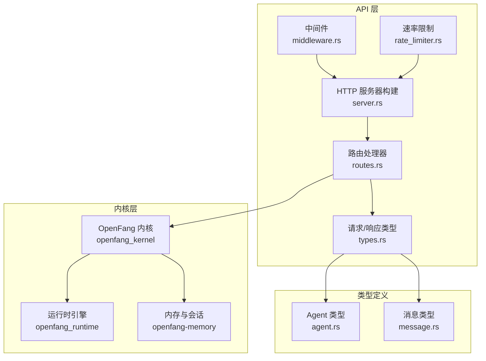
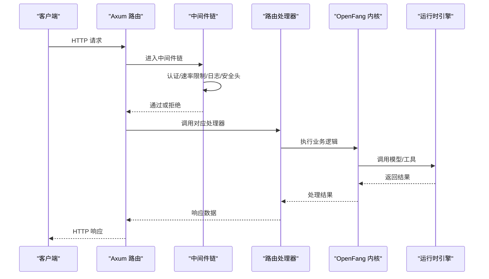
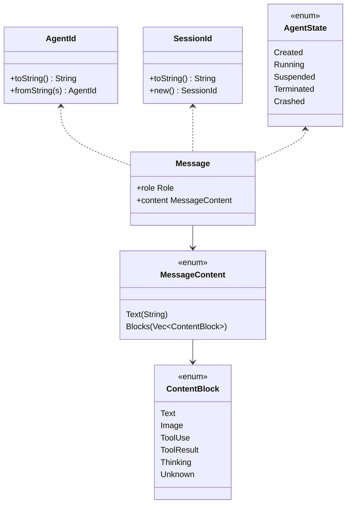

# 智能体管理 API

<cite>
**本文档引用的文件**
- [routes.rs](file://crates/openfang-api/src/routes.rs)
- [types.rs](file://crates/openfang-api/src/types.rs)
- [server.rs](file://crates/openfang-api/src/server.rs)
- [middleware.rs](file://crates/openfang-api/src/middleware.rs)
- [rate_limiter.rs](file://crates/openfang-api/src/rate_limiter.rs)
- [agent.rs](file://crates/openfang-types/src/agent.rs)
- [message.rs](file://crates/openfang-types/src/message.rs)
- [api_integration_test.rs](file://crates/openfang-api/tests/api_integration_test.rs)
- [agent.toml](file://agents/assistant/agent.toml)
- [agent.toml](file://agents/analyst/agent.toml)
</cite>

## 目录
1. [简介](#简介)
2. [项目结构](#项目结构)
3. [核心组件](#核心组件)
4. [架构总览](#架构总览)
5. [详细组件分析](#详细组件分析)
6. [依赖关系分析](#依赖关系分析)
7. [性能考虑](#性能考虑)
8. [故障排除指南](#故障排除指南)
9. [结论](#结论)

## 简介
本文件为 OpenFang 智能体管理 API 的完整技术文档，覆盖智能体生命周期管理的核心端点：创建智能体、获取智能体列表、向智能体发送消息、获取智能体会话、终止智能体、重启智能体等。文档详细说明每个端点的请求参数、响应格式、状态码含义，并提供完整的请求/响应示例路径与说明。同时解释智能体状态转换、错误处理机制、安全验证要求，以及智能体模板使用、签名验证、大小限制等安全特性。

## 项目结构
OpenFang 采用模块化设计，智能体管理 API 主要位于 crates/openfang-api 子模块中，类型定义位于 crates/openfang-types 中，服务启动与路由注册在 server.rs 中完成。

图表来源
- [server.rs:37-712](file://crates/openfang-api/src/server.rs#L37-L712)
- [routes.rs:1-168](file://crates/openfang-api/src/routes.rs#L1-L168)
- [types.rs:1-94](file://crates/openfang-api/src/types.rs#L1-L94)
- [middleware.rs:1-270](file://crates/openfang-api/src/middleware.rs#L1-L270)
- [rate_limiter.rs:1-98](file://crates/openfang-api/src/rate_limiter.rs#L1-L98)

章节来源
- [server.rs:37-712](file://crates/openfang-api/src/server.rs#L37-L712)

## 核心组件
- 路由处理器：负责解析请求、调用内核接口、返回标准化响应。
- 请求/响应类型：定义 API 输入输出的数据结构。
- 中间件：认证、CORS、安全头、日志、速率限制。
- 服务器构建器：组装路由、中间件并启动 HTTP 服务。
- 类型系统：AgentId、SessionId、AgentState、MessageContent 等。

章节来源
- [types.rs:1-94](file://crates/openfang-api/src/types.rs#L1-L94)
- [agent.rs:112-186](file://crates/openfang-types/src/agent.rs#L112-L186)
- [message.rs:5-96](file://crates/openfang-types/src/message.rs#L5-L96)

## 架构总览
API 通过 Axum 路由注册到 HTTP 服务器，中间件链对所有请求进行统一处理。内核负责智能体生命周期、会话管理、工具执行等核心逻辑。

图表来源
- [server.rs:121-709](file://crates/openfang-api/src/server.rs#L121-L709)
- [middleware.rs:62-215](file://crates/openfang-api/src/middleware.rs#L62-L215)
- [rate_limiter.rs:51-79](file://crates/openfang-api/src/rate_limiter.rs#L51-L79)

## 详细组件分析

### 1. 创建智能体：POST /api/agents
- 功能：从 TOML 清单或模板创建新智能体。
- 请求体字段：
  - manifest_toml：智能体清单的 TOML 字符串（可选）
  - template：模板名称（可选，与 manifest_toml 二选一）
  - signed_manifest：Ed25519 签名的清单 JSON（可选）
- 安全特性：
  - 模板名称白名单过滤，防止路径遍历
  - 清单大小限制（1MB）
  - 可选签名验证，匹配 manifest_toml
- 成功响应：201，返回 agent_id 和 name
- 错误响应：
  - 400：缺少必要字段、模板不存在、清单格式无效、签名不匹配
  - 413：清单过大
  - 500：内部错误

请求示例路径
- [api_integration_test.rs:238-250](file://crates/openfang-api/tests/api_integration_test.rs#L238-L250)

响应示例路径
- [routes.rs:152-158](file://crates/openfang-api/src/routes.rs#L152-L158)

章节来源
- [routes.rs:46-168](file://crates/openfang-api/src/routes.rs#L46-L168)
- [types.rs:6-26](file://crates/openfang-api/src/types.rs#L6-L26)
- [api_integration_test.rs:233-284](file://crates/openfang-api/tests/api_integration_test.rs#L233-L284)

### 2. 获取智能体列表：GET /api/agents
- 功能：列出所有已注册的智能体，附带模型、认证状态、就绪状态等元信息。
- 响应：数组，每项包含 id、name、state、mode、created_at、last_active、model_provider、model_name、model_tier、auth_status、ready、profile、identity 等。
- 成功响应：200

请求示例路径
- [api_integration_test.rs:252-283](file://crates/openfang-api/tests/api_integration_test.rs#L252-L283)

响应示例路径
- [routes.rs:171-238](file://crates/openfang-api/src/routes.rs#L171-L238)

章节来源
- [routes.rs:171-238](file://crates/openfang-api/src/routes.rs#L171-L238)

### 3. 发送消息给智能体：POST /api/agents/:id/message
- 功能：向指定智能体发送消息，支持附件注入。
- 路径参数：id（AgentId）
- 请求体字段：
  - message：文本消息
  - attachments：附件引用数组（file_id、filename、content_type）
  - sender_id、sender_name：发送者身份标识
- 安全特性：
  - 消息大小限制（64KB）
  - 附件仅接受图片类型，校验 UUID 文件 ID，避免路径遍历
- 成功响应：200，返回 response、input_tokens、output_tokens、iterations、cost_usd（可选）
- 错误响应：
  - 400：agent_id 无效
  - 404：agent 不存在
  - 413：消息过大
  - 500：内部错误或配额超限

请求示例路径
- [api_integration_test.rs:337-356](file://crates/openfang-api/tests/api_integration_test.rs#L337-L356)

响应示例路径
- [routes.rs:402-411](file://crates/openfang-api/src/routes.rs#L402-L411)

章节来源
- [routes.rs:328-428](file://crates/openfang-api/src/routes.rs#L328-L428)
- [types.rs:39-62](file://crates/openfang-api/src/types.rs#L39-L62)

### 4. 获取智能体会话：GET /api/agents/:id/session
- 功能：获取智能体会话历史，将工具调用与结果合并展示。
- 路径参数：id（AgentId）
- 响应：session_id、agent_id、message_count、context_window_tokens、label、messages（含 role、content、tools、images）
- 成功响应：200
- 错误响应：400（agent_id 无效）、404（agent 不存在）、500（内部错误）

请求示例路径
- [api_integration_test.rs:302-314](file://crates/openfang-api/tests/api_integration_test.rs#L302-L314)

响应示例路径
- [routes.rs:588-599](file://crates/openfang-api/src/routes.rs#L588-L599)

章节来源
- [routes.rs:430-619](file://crates/openfang-api/src/routes.rs#L430-L619)

### 5. 终止智能体：DELETE /api/agents/:id
- 功能：终止指定智能体进程。
- 路径参数：id（AgentId）
- 成功响应：200，返回 status 和 agent_id
- 错误响应：400（agent_id 无效）、404（agent 不存在或已终止）

请求示例路径
- [api_integration_test.rs:264-273](file://crates/openfang-api/tests/api_integration_test.rs#L264-L273)

响应示例路径
- [routes.rs:636-648](file://crates/openfang-api/src/routes.rs#L636-L648)

章节来源
- [routes.rs:621-649](file://crates/openfang-api/src/routes.rs#L621-L649)

### 6. 重启智能体：POST /api/agents/:id/restart
- 功能：重启崩溃/卡住的智能体，取消活动任务，重置状态为 Running。
- 路径参数：id（AgentId）
- 成功响应：200，返回 status、agent、agent_id、previous_state、task_cancelled
- 错误响应：400（agent_id 无效）、404（agent 不存在）

请求示例路径
- [api_integration_test.rs:585-674](file://crates/openfang-api/tests/api_integration_test.rs#L585-L674)

响应示例路径
- [routes.rs:699-710](file://crates/openfang-api/src/routes.rs#L699-L710)

章节来源
- [routes.rs:651-710](file://crates/openfang-api/src/routes.rs#L651-L710)

### 7. 其他相关端点（与智能体生命周期相关）
- 获取单个智能体详情：GET /api/agents/:id
- 设置智能体模式：PUT /api/agents/:id/mode
- 上传文件：POST /api/agents/:id/upload
- 会话管理：GET /api/agents/:id/sessions、POST /api/agents/:id/sessions、POST /api/agents/:id/sessions/{session_id}/switch、POST /api/agents/:id/session/reset、DELETE /api/agents/:id/history、POST /api/agents/:id/session/compact
- WebSocket：GET /api/agents/:id/ws
- SSE 流式消息：POST /api/agents/:id/message/stream

章节来源
- [server.rs:142-241](file://crates/openfang-api/src/server.rs#L142-L241)
- [routes.rs:1332-1494](file://crates/openfang-api/src/routes.rs#L1332-L1494)

## 依赖关系分析

图表来源
- [agent.rs:112-186](file://crates/openfang-types/src/agent.rs#L112-L186)
- [message.rs:5-96](file://crates/openfang-types/src/message.rs#L5-L96)

章节来源
- [agent.rs:112-186](file://crates/openfang-types/src/agent.rs#L112-L186)
- [message.rs:5-96](file://crates/openfang-types/src/message.rs#L5-L96)

## 性能考虑
- 速率限制：基于 GCRA 算法，按操作成本分配令牌预算，防止滥用。
- 日志与追踪：中间件统一注入请求 ID 并记录请求耗时，便于性能分析。
- 会话序列化：会话历史在返回前进行两阶段整理，避免重复扫描。
- 上传处理：图片附件解码后写入临时目录，支持后续回传。

章节来源
- [rate_limiter.rs:14-79](file://crates/openfang-api/src/rate_limiter.rs#L14-L79)
- [middleware.rs:18-44](file://crates/openfang-api/src/middleware.rs#L18-L44)
- [routes.rs:430-619](file://crates/openfang-api/src/routes.rs#L430-L619)

## 故障排除指南
- 认证失败：检查 Authorization 头或 X-API-Key，确保与配置一致；或使用会话 Cookie。
- 速率限制：收到 429，等待重试时间或降低请求频率。
- 模板加载失败：确认模板名称仅包含字母数字、连字符和下划线，且存在对应 agent.toml。
- 清单过大：减少 manifest_toml 长度至 1MB 以内。
- 消息过大：减少 message 长度至 64KB 以内。
- 代理健康检查：使用 /api/health 或 /api/health/detail 排查服务状态。

章节来源
- [middleware.rs:62-215](file://crates/openfang-api/src/middleware.rs#L62-L215)
- [rate_limiter.rs:51-79](file://crates/openfang-api/src/rate_limiter.rs#L51-L79)
- [routes.rs:46-168](file://crates/openfang-api/src/routes.rs#L46-L168)
- [routes.rs:328-428](file://crates/openfang-api/src/routes.rs#L328-L428)

## 结论
OpenFang 智能体管理 API 提供了完整的生命周期管理能力，具备完善的认证、速率限制、安全头、日志与错误处理机制。通过清晰的请求/响应结构与丰富的安全特性，能够满足生产环境下的智能体编排与运维需求。建议在生产环境中启用 API Key 或会话认证，并结合速率限制策略保障系统稳定性。