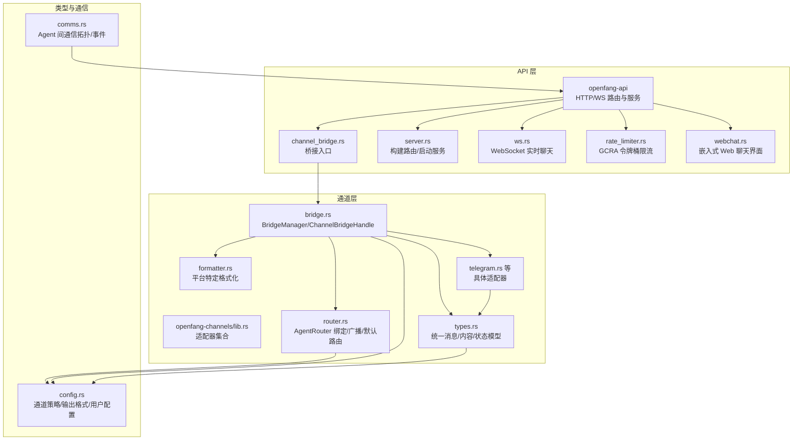
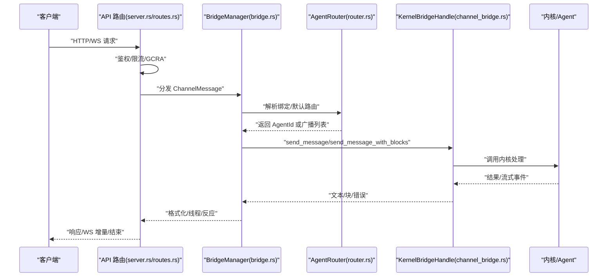
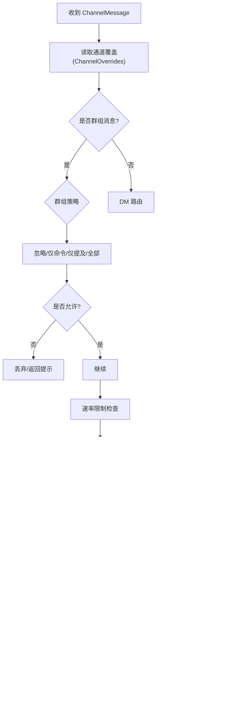
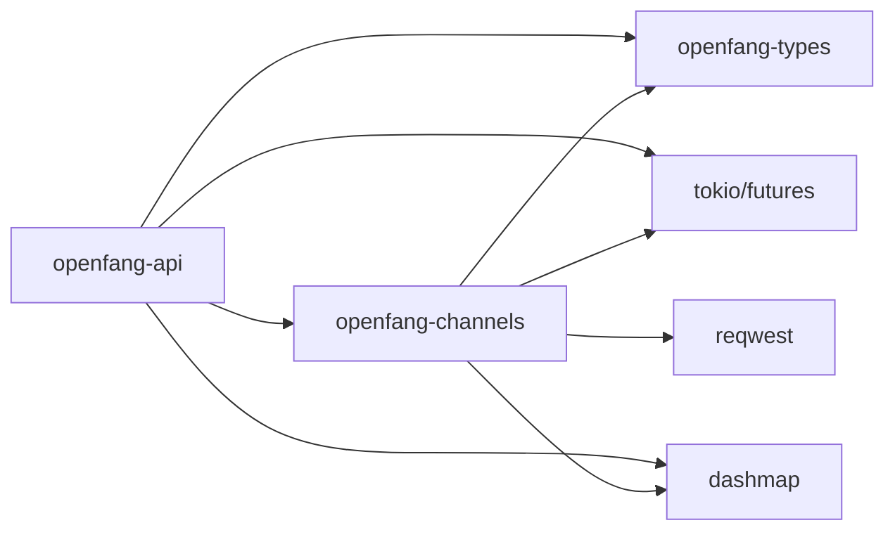

# 消息渠道 API

<cite>
**本文引用的文件**
- [lib.rs](file://crates/openfang-api/src/lib.rs)
- [routes.rs](file://crates/openfang-api/src/routes.rs)
- [server.rs](file://crates/openfang-api/src/server.rs)
- [channel_bridge.rs](file://crates/openfang-api/src/channel_bridge.rs)
- [ws.rs](file://crates/openfang-api/src/ws.rs)
- [rate_limiter.rs](file://crates/openfang-api/src/rate_limiter.rs)
- [webchat.rs](file://crates/openfang-api/src/webchat.rs)
- [lib.rs](file://crates/openfang-channels/src/lib.rs)
- [types.rs](file://crates/openfang-channels/src/types.rs)
- [bridge.rs](file://crates/openfang-channels/src/bridge.rs)
- [router.rs](file://crates/openfang-channels/src/router.rs)
- [formatter.rs](file://crates/openfang-channels/src/formatter.rs)
- [telegram.rs](file://crates/openfang-channels/src/telegram.rs)
- [comms.rs](file://crates/openfang-types/src/comms.rs)
- [config.rs](file://crates/openfang-types/src/config.rs)
</cite>

## 目录
1. [简介](#简介)
2. [项目结构](#项目结构)
3. [核心组件](#核心组件)
4. [架构总览](#架构总览)
5. [详细组件分析](#详细组件分析)
6. [依赖关系分析](#依赖关系分析)
7. [性能考虑](#性能考虑)
8. [故障排查指南](#故障排查指南)
9. [结论](#结论)
10. [附录](#附录)

## 简介
本文件为“消息渠道 API”的详细技术文档，覆盖渠道管理、消息路由、连接状态、通道适配器接口规范、消息格式转换、错误与重试机制、渠道桥接工作原理（含消息去重与速率限制）、健康检查与运维能力（连接池、故障转移）以及常见渠道集成示例与最佳实践。目标读者既包括需要快速上手的开发者，也包括希望深入理解系统设计的架构师。

## 项目结构
OpenFang 将“HTTP/WebSocket API 层”与“渠道桥接层”解耦：
- openfang-api：提供 HTTP REST 与 WebSocket 接口，承载内核状态、代理通道桥接、中间件与限流。
- openfang-channels：提供 40+ 渠道适配器（Telegram、Discord、Slack、WhatsApp 等），统一抽象为 ChannelAdapter，并通过 BridgeManager 与 AgentRouter 协作。
- openfang-types：定义跨模块共享类型（如 ChannelMessage、ChannelContent、ChannelType、输出格式、通道策略等）。

图表来源
- [lib.rs:1-18](file://crates/openfang-api/src/lib.rs#L1-L18)
- [server.rs:30-712](file://crates/openfang-api/src/server.rs#L30-L712)
- [channel_bridge.rs:1-800](file://crates/openfang-api/src/channel_bridge.rs#L1-L800)
- [bridge.rs:1-800](file://crates/openfang-channels/src/bridge.rs#L1-L800)
- [router.rs:1-645](file://crates/openfang-channels/src/router.rs#L1-L645)
- [types.rs:1-478](file://crates/openfang-channels/src/types.rs#L1-L478)
- [formatter.rs:1-676](file://crates/openfang-channels/src/formatter.rs#L1-L676)
- [telegram.rs:1-200](file://crates/openfang-channels/src/telegram.rs#L1-L200)
- [comms.rs:1-171](file://crates/openfang-types/src/comms.rs#L1-L171)
- [config.rs:27-113](file://crates/openfang-types/src/config.rs#L27-L113)

章节来源
- [lib.rs:1-18](file://crates/openfang-api/src/lib.rs#L1-L18)
- [server.rs:30-712](file://crates/openfang-api/src/server.rs#L30-L712)

## 核心组件
- API 路由与状态
  - 提供 /api/agents、/api/agents/:id/message、/api/agents/:id/session、/api/agents/:id/ws 等端点；支持健康检查、版本查询、审计日志、预算统计、网络状态等。
- 渠道桥接
  - 通过 BridgeManager 管理各适配器生命周期，统一调度消息分发、命令处理、广播路由、速率限制与输出格式化。
- 通道适配器
  - 实现 ChannelAdapter trait，负责长轮询/推送、消息发送、线程回复、反应标记、状态上报等。
- 消息路由
  - AgentRouter 支持绑定规则（按频道/群组/用户/角色）、直接路由、用户默认、频道默认与系统默认，支持广播策略。
- 输出格式化
  - 针对 Telegram HTML、Slack mrkdwn、纯文本进行格式转换，避免平台不兼容。
- 连接与会话
  - WebSocket 提供实时聊天，支持打字指示、文本增量、工具执行事件、静默完成等。
- 限流与安全
  - GCRA 成本感知限流；API 密钥认证；每 IP 连接数限制；WS 空闲超时；请求体大小限制。

章节来源
- [routes.rs:1-800](file://crates/openfang-api/src/routes.rs#L1-L800)
- [channel_bridge.rs:1-800](file://crates/openfang-api/src/channel_bridge.rs#L1-L800)
- [bridge.rs:1-800](file://crates/openfang-channels/src/bridge.rs#L1-L800)
- [router.rs:1-645](file://crates/openfang-channels/src/router.rs#L1-L645)
- [types.rs:1-478](file://crates/openfang-channels/src/types.rs#L1-L478)
- [formatter.rs:1-676](file://crates/openfang-channels/src/formatter.rs#L1-L676)
- [ws.rs:1-800](file://crates/openfang-api/src/ws.rs#L1-L800)
- [rate_limiter.rs:1-98](file://crates/openfang-api/src/rate_limiter.rs#L1-L98)

## 架构总览
下图展示从客户端到内核的消息通路：HTTP/WS 请求经 API 层验证与限流，进入通道桥接，再由适配器解析为统一 ChannelMessage，交由 AgentRouter 决策路由，最终调用 KernelBridgeHandle 发送至 Agent 并回传响应。

图表来源
- [server.rs:120-712](file://crates/openfang-api/src/server.rs#L120-L712)
- [routes.rs:1-800](file://crates/openfang-api/src/routes.rs#L1-L800)
- [bridge.rs:270-800](file://crates/openfang-channels/src/bridge.rs#L270-L800)
- [router.rs:138-221](file://crates/openfang-channels/src/router.rs#L138-L221)
- [channel_bridge.rs:63-173](file://crates/openfang-api/src/channel_bridge.rs#L63-L173)

## 详细组件分析

### 渠道适配器通用接口规范
- ChannelAdapter
  - 必须实现：name()/channel_type()/start()/send()/stop()；可选：send_typing()/send_reaction()/send_in_thread()/status()/suppress_error_responses()。
  - start() 返回异步流，持续产出 ChannelMessage；send()/send_in_thread() 将响应写回平台。
- ChannelMessage/ChannelContent
  - 统一抽象：文本、图片、文件、语音、位置、命令等；携带 sender、timestamp、thread_id、metadata 等上下文。
- 输出格式与平台差异
  - formatter.rs 提供 Telegram HTML、Slack mrkdwn、纯文本转换；不同适配器可覆盖默认输出格式。
- 生命周期反应与打字指示
  - send_lifecycle_reaction()/spawn_typing_loop() 提升用户体验，部分平台支持。

章节来源
- [types.rs:215-280](file://crates/openfang-channels/src/types.rs#L215-L280)
- [formatter.rs:10-27](file://crates/openfang-channels/src/formatter.rs#L10-L27)
- [bridge.rs:437-472](file://crates/openfang-channels/src/bridge.rs#L437-L472)

### 渠道桥接与消息路由
- BridgeManager
  - 启动适配器、订阅消息流、并发派发、速率限制、输出格式化、线程回复、生命周期反应。
  - 使用 ChannelRateLimiter 对“频道:用户”维度做每分钟限额。
- AgentRouter
  - 路由优先级：绑定规则 > 直接路由 > 用户默认 > 频道默认 > 系统默认；支持广播策略（并行/串行）。
  - 绑定规则支持频道、账户、用户、群组、角色等多维匹配。
- 通道策略与覆盖
  - ChannelOverrides 支持 DM/群组策略、速率限制、线程、输出格式、生命周期反应开关等。

图表来源
- [bridge.rs:526-800](file://crates/openfang-channels/src/bridge.rs#L526-L800)
- [router.rs:138-254](file://crates/openfang-channels/src/router.rs#L138-L254)
- [config.rs:70-113](file://crates/openfang-types/src/config.rs#L70-L113)

章节来源
- [bridge.rs:271-382](file://crates/openfang-channels/src/bridge.rs#L271-L382)
- [router.rs:25-645](file://crates/openfang-channels/src/router.rs#L25-L645)
- [config.rs:70-113](file://crates/openfang-types/src/config.rs#L70-L113)

### 消息格式转换与错误处理
- 格式转换
  - Telegram HTML：支持粗体、斜体、代码、预格式、链接、引用块、有序/无序列表。
  - Slack mrkdwn：支持粗体、链接。
  - WeCom 强制纯文本，避免泄露 Markdown。
- 错误与重试
  - 适配器内部采用指数退避拉取（以 Telegram 为例）；失败时记录日志并尝试恢复。
  - 通道侧对“Agent not found”场景尝试按名称重新解析默认代理，减少断链风险。
  - 发送失败记录 DeliveryReceipt，便于追踪与审计。

章节来源
- [formatter.rs:29-564](file://crates/openfang-channels/src/formatter.rs#L29-L564)
- [telegram.rs:20-97](file://crates/openfang-channels/src/telegram.rs#L20-L97)
- [bridge.rs:487-524](file://crates/openfang-channels/src/bridge.rs#L487-L524)

### 连接状态与健康检查
- 通道适配器状态
  - ChannelStatus 记录连接状态、启动时间、最后消息时间、收发计数、最近错误。
- API 健康检查
  - /api/health 与 /api/health/detail 提供内核与通道层健康信息；支持探针缓存避免阻塞。
- 运行时热重载
  - 通道配置热重载，BridgeManager 可在运行中替换与重启适配器。

章节来源
- [types.rs:195-210](file://crates/openfang-channels/src/types.rs#L195-L210)
- [server.rs:120-135](file://crates/openfang-api/src/server.rs#L120-L135)
- [routes.rs:1-800](file://crates/openfang-api/src/routes.rs#L1-L800)

### 实时聊天与会话管理
- WebSocket
  - /api/agents/:id/ws 提供实时聊天，支持打字指示、文本增量、工具执行事件、静默完成、Canvas 扩展。
  - 客户端消息类型：message/command/ping；服务端事件：typing/text_delta/response/error/agents_updated/silent_complete。
  - 限流：每 IP 最大 5 个连接；每连接 10 条/分钟；空闲 30 分钟自动断开。
- 附件与多模态
  - 支持上传图片作为 ContentBlock 注入会话，提升视觉理解能力。

章节来源
- [ws.rs:1-800](file://crates/openfang-api/src/ws.rs#L1-L800)
- [routes.rs:240-326](file://crates/openfang-api/src/routes.rs#L240-L326)

### 速率限制与安全
- GCRA 成本感知限流
  - 不同端点设置不同成本（如 /api/agents=50，/api/agents/:id/message=30），全局 500/min/IP。
- API 认证
  - 支持 API Key 或会话认证；WebSocket 升级支持 Header 或查询参数校验。
- 连接与输入保护
  - 每 IP 最大 5 个 WS；WS 每连接 10 条/分钟；消息最大 64KB；上传最大 64KB 文本与 1MB 清单。

章节来源
- [rate_limiter.rs:14-79](file://crates/openfang-api/src/rate_limiter.rs#L14-L79)
- [ws.rs:135-207](file://crates/openfang-api/src/ws.rs#L135-L207)
- [routes.rs:44-101](file://crates/openfang-api/src/routes.rs#L44-L101)

### 常见渠道集成示例与最佳实践
- Telegram
  - 长轮询 + 指数退避；支持线程回复、@提及检测、HTML 格式化、图片/文件发送。
  - 建议：启用 threading 与 lifecycle_reactions；设置合理 rate_limit_per_user；使用 OutputFormat::TelegramHtml。
- Slack/Discord/WhatsApp 等
  - 通过 ChannelAdapter 抽象统一接入；建议配置 DM/群组策略、输出格式与速率限制。
- 最佳实践
  - 使用 ChannelOverrides 精细化控制；为高并发场景开启广播并行模式；为公开频道关闭生命周期反应或抑制错误回显。
  - 为关键业务配置绑定规则，确保权限与路由可控。

章节来源
- [telegram.rs:1-200](file://crates/openfang-channels/src/telegram.rs#L1-L200)
- [types.rs:215-280](file://crates/openfang-channels/src/types.rs#L215-L280)
- [config.rs:70-113](file://crates/openfang-types/src/config.rs#L70-L113)

## 依赖关系分析
- 组件耦合
  - openfang-api 依赖 openfang-channels 的 BridgeManager 与 AgentRouter；通过 ChannelBridgeHandle 解耦内核与通道。
  - openfang-channels 依赖 openfang-types 的统一消息与配置模型。
- 外部依赖
  - reqwest 用于 HTTP 调用（如 Telegram API）。
  - tokio/futures 提供异步流与任务管理。
  - dashmap 提供高性能并发映射（如速率限制桶、上传注册表）。

图表来源
- [lib.rs:1-18](file://crates/openfang-api/src/lib.rs#L1-L18)
- [lib.rs:1-55](file://crates/openfang-channels/src/lib.rs#L1-L55)
- [types.rs:1-11](file://crates/openfang-channels/src/types.rs#L1-L11)

章节来源
- [lib.rs:1-18](file://crates/openfang-api/src/lib.rs#L1-L18)
- [lib.rs:1-55](file://crates/openfang-channels/src/lib.rs#L1-L55)

## 性能考虑
- 并发派发
  - BridgeManager 对每个消息派发使用独立任务，上限 32；避免慢 LLM 调用阻塞后续消息。
- 流式传输
  - WebSocket 文本增量与定时刷新，降低延迟；debounce 与字符阈值平衡实时性与带宽。
- 缓存与探针
  - Provider 探针缓存与 ClawHub 响应缓存，减轻频繁刷新压力。
- 速率限制
  - 通道级与 API 级双层限流，防止滥用与雪崩。

章节来源
- [bridge.rs:309-382](file://crates/openfang-channels/src/bridge.rs#L309-L382)
- [ws.rs:42-46](file://crates/openfang-api/src/ws.rs#L42-L46)
- [server.rs:52-53](file://crates/openfang-api/src/server.rs#L52-L53)

## 故障排查指南
- 通道无法接收消息
  - 检查 /api/health/detail 与适配器 status()；确认令牌/密钥有效；查看日志中的退避与重试。
- 速率限制触发
  - 查看通道覆盖 rate_limit_per_user；调整为 0 表示不限制；或提升用户白名单。
- 代理不可达
  - 观察“Agent not found”错误；系统会尝试按名称重新解析默认代理；若仍失败，检查代理是否存在或已重启。
- WebSocket 断连
  - 检查每 IP 连接数、每连接速率、空闲超时；确认客户端 ping/pong 正常。
- 发送失败
  - 查看 DeliveryReceipt 中的错误字段；根据平台错误码定位问题。

章节来源
- [types.rs:195-210](file://crates/openfang-channels/src/types.rs#L195-L210)
- [bridge.rs:487-524](file://crates/openfang-channels/src/bridge.rs#L487-L524)
- [ws.rs:300-384](file://crates/openfang-api/src/ws.rs#L300-L384)

## 结论
消息渠道 API 通过清晰的分层与统一抽象，实现了对 40+ 渠道的高效接入与稳定运行。其核心优势在于：
- 通道适配器接口标准化，便于扩展新渠道；
- 路由与策略可配置，满足复杂业务场景；
- 流式传输与实时交互体验良好；
- 成本感知限流与健康监控保障稳定性；
- 广泛的格式化与错误处理提升跨平台一致性。

## 附录
- 常用端点速览
  - 渠道管理：/api/channels、/api/channels/{name}/configure、/api/channels/reload、/api/channels/{name}/test
  - 渠道测试：/api/channels/whatsapp/qr/start、/api/channels/whatsapp/qr/status
  - 代理管理：/api/agents、/api/agents/{id}、/api/agents/{id}/restart、/api/agents/{id}/message、/api/agents/{id}/session
  - 实时聊天：/api/agents/{id}/ws
  - 健康与状态：/api/health、/api/health/detail、/api/status、/api/version
  - 其他：/api/tools、/api/skills、/api/workflows、/api/comms/*、/api/logs/stream 等

章节来源
- [server.rs:131-682](file://crates/openfang-api/src/server.rs#L131-L682)