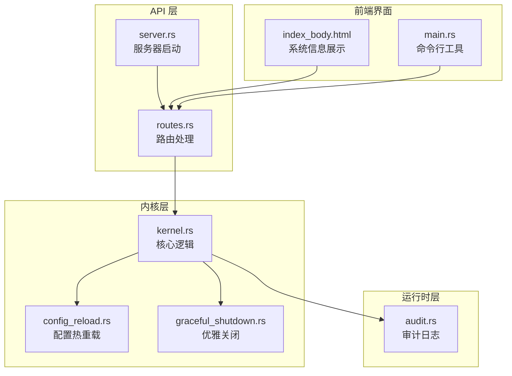
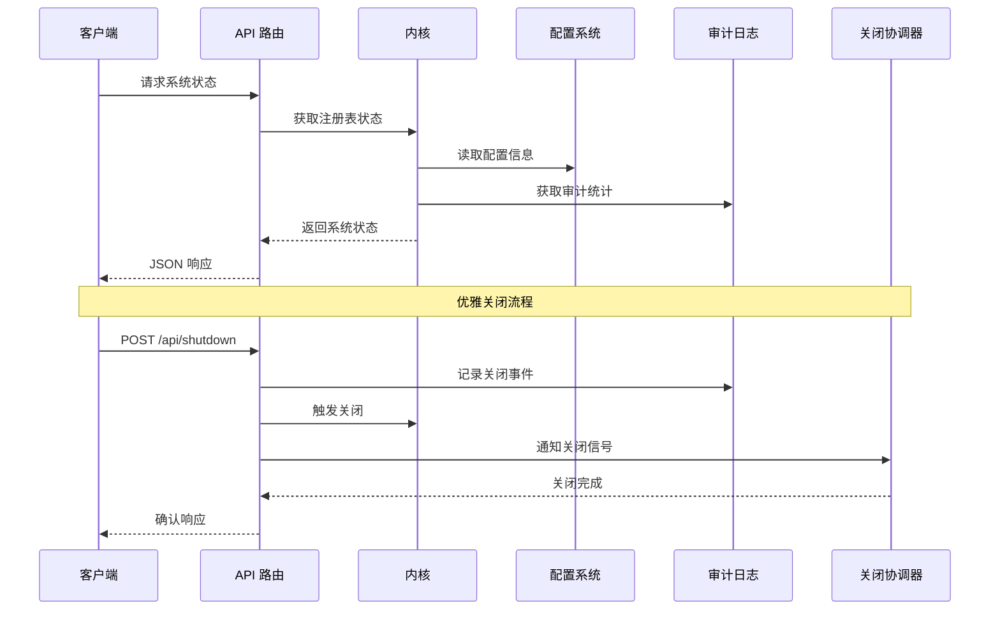
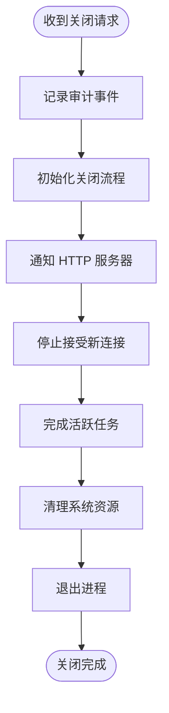
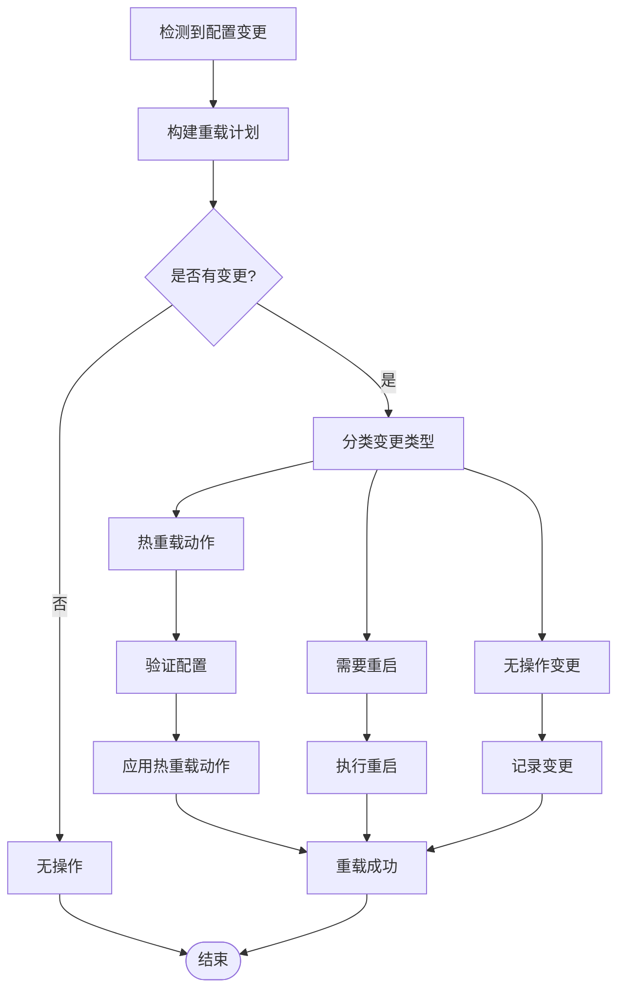
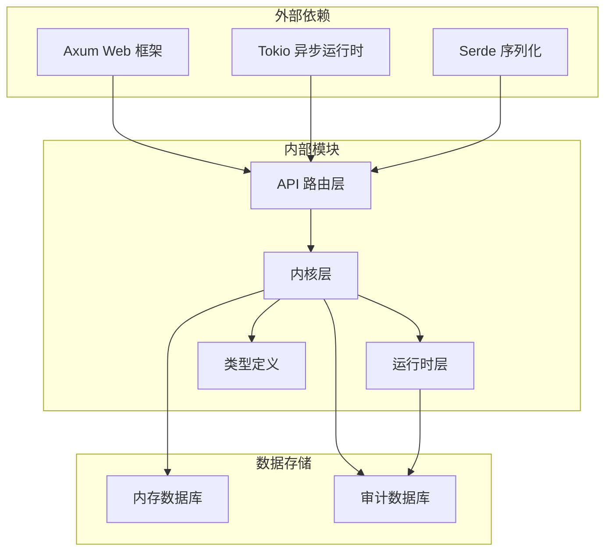

# 系统状态 API

<cite>
**本文档引用的文件**
- [routes.rs](file://crates/openfang-api/src/routes.rs)
- [server.rs](file://crates/openfang-api/src/server.rs)
- [kernel.rs](file://crates/openfang-kernel/src/kernel.rs)
- [config_reload.rs](file://crates/openfang-kernel/src/config_reload.rs)
- [graceful_shutdown.rs](file://crates/openfang-runtime/src/graceful_shutdown.rs)
- [audit.rs](file://crates/openfang-runtime/src/audit.rs)
- [index_body.html](file://crates/openfang-api/static/index_body.html)
- [main.rs](file://crates/openfang-cli/src/main.rs)
</cite>

## 目录
1. [简介](#简介)
2. [项目结构](#项目结构)
3. [核心组件](#核心组件)
4. [架构概览](#架构概览)
5. [详细组件分析](#详细组件分析)
6. [依赖关系分析](#依赖关系分析)
7. [性能考虑](#性能考虑)
8. [故障排除指南](#故障排除指南)
9. [结论](#结论)

## 简介

系统状态 API 是 OpenFang 平台的核心监控和运维接口，提供全面的系统健康检查、状态查询、配置管理和优雅关闭功能。该 API 支持实时监控、审计日志查询、性能指标收集和系统诊断，为平台的稳定运行和运维管理提供了重要保障。

本文档详细介绍了系统状态 API 的所有端点，包括系统健康检查、配置查询、性能监控、优雅关闭、配置更新、审计日志查询等功能，并解释了系统版本管理、热重载机制、配置热更新等特性。

## 项目结构

OpenFang 系统状态 API 主要分布在以下模块中：



**图表来源**
- [routes.rs:1-11270](file://crates/openfang-api/src/routes.rs#L1-L11270)
- [server.rs:1-954](file://crates/openfang-api/src/server.rs#L1-L954)

**章节来源**
- [routes.rs:1-11270](file://crates/openfang-api/src/routes.rs#L1-L11270)
- [server.rs:1-954](file://crates/openfang-api/src/server.rs#L1-L954)

## 核心组件

系统状态 API 包含以下核心组件：

### 1. 系统状态管理
- **状态查询**：提供系统运行状态、版本信息、代理数量等关键指标
- **健康检查**：支持最小化存活探针和完整健康诊断
- **性能监控**：集成 Prometheus 指标收集和暴露

### 2. 配置管理系统
- **配置查询**：获取当前运行配置
- **配置热更新**：支持无重启配置变更
- **配置验证**：确保配置变更的安全性和有效性

### 3. 审计日志系统
- **审计查询**：获取最近审计事件
- **实时流式**：支持 Server-Sent Events 实时审计流
- **完整性验证**：确保审计日志的不可篡改性

### 4. 优雅关闭机制
- **平滑关闭**：支持 API 触发的优雅关闭
- **关闭协调**：管理关闭流程和状态跟踪
- **资源清理**：确保所有资源正确释放

**章节来源**
- [routes.rs:712-765](file://crates/openfang-api/src/routes.rs#L712-L765)
- [routes.rs:3286-3339](file://crates/openfang-api/src/routes.rs#L3286-L3339)
- [routes.rs:4874-5046](file://crates/openfang-api/src/routes.rs#L4874-L5046)

## 架构概览

系统状态 API 采用分层架构设计，确保各组件职责清晰、耦合度低：



**图表来源**
- [routes.rs:712-765](file://crates/openfang-api/src/routes.rs#L712-L765)
- [server.rs:862-897](file://crates/openfang-api/src/server.rs#L862-L897)
- [graceful_shutdown.rs:84-114](file://crates/openfang-runtime/src/graceful_shutdown.rs#L84-L114)

## 详细组件分析

### 系统状态 API

#### GET /api/status - 系统状态查询

系统状态端点提供完整的系统运行信息，包括基础状态、版本信息、代理统计和配置详情。

**请求参数**
- 无

**响应数据结构**
```json
{
  "status": "running",
  "version": "1.0.0",
  "agent_count": 5,
  "default_provider": "openai",
  "default_model": "gpt-4",
  "uptime_seconds": 3600,
  "api_listen": "0.0.0.0:8080",
  "home_dir": "/home/user/.openfang",
  "log_level": "info",
  "network_enabled": true,
  "agents": [
    {
      "id": "agent-uuid",
      "name": "example-agent",
      "state": "Running",
      "mode": "active",
      "created_at": "2024-01-01T00:00:00Z",
      "model_provider": "openai",
      "model_name": "gpt-4",
      "profile": "default"
    }
  ]
}
```

**实现细节**
- 获取所有注册代理的状态信息
- 计算系统运行时间（秒）
- 提供默认模型提供商和名称
- 包含核心配置参数

**章节来源**
- [routes.rs:712-749](file://crates/openfang-api/src/routes.rs#L712-L749)

#### GET /api/health - 健康检查

健康检查端点提供最小化健康状态，用于简单的存活探针。

**请求参数**
- 无

**响应数据结构**
```json
{
  "status": "ok",
  "version": "1.0.0"
}
```

**GET /api/health/detail - 详细健康诊断**

详细健康诊断端点提供完整的系统健康信息，需要认证访问。

**响应数据结构**
```json
{
  "status": "ok",
  "version": "1.0.0",
  "uptime_seconds": 3600,
  "panic_count": 0,
  "restart_count": 2,
  "agent_count": 5,
  "database": "connected",
  "config_warnings": []
}
```

**章节来源**
- [routes.rs:3286-3339](file://crates/openfang-api/src/routes.rs#L3286-L3339)

#### POST /api/shutdown - 优雅关闭

优雅关闭端点允许通过 API 触发系统的平滑关闭过程。

**请求参数**
- 无

**响应数据结构**
```json
{
  "status": "shutting_down"
}
```

**关闭流程**


**图表来源**
- [routes.rs:751-765](file://crates/openfang-api/src/routes.rs#L751-L765)
- [server.rs:862-897](file://crates/openfang-api/src/server.rs#L862-L897)

**章节来源**
- [routes.rs:751-765](file://crates/openfang-api/src/routes.rs#L751-L765)
- [graceful_shutdown.rs:84-114](file://crates/openfang-runtime/src/graceful_shutdown.rs#L84-L114)

### 配置管理系统

#### GET /api/config - 配置查询

获取当前运行时配置信息。

**请求参数**
- 无

**响应数据结构**
- 返回完整的 KernelConfig 结构

#### POST /api/config/set - 配置设置

设置新的配置值。

**请求参数**
- JSON 格式的配置键值对

**响应数据结构**
- 成功或错误信息

#### POST /api/config/reload - 配置热重载

触发配置热重载机制。

**请求参数**
- 新配置内容

**响应数据结构**
- 重载计划和结果

**配置热重载机制**


**图表来源**
- [config_reload.rs:123-129](file://crates/openfang-kernel/src/config_reload.rs#L123-L129)
- [kernel.rs:3543-3558](file://crates/openfang-kernel/src/kernel.rs#L3543-L3558)

**章节来源**
- [config_reload.rs:115-129](file://crates/openfang-kernel/src/config_reload.rs#L115-L129)
- [kernel.rs:3543-3566](file://crates/openfang-kernel/src/kernel.rs#L3543-L3566)

### 审计日志系统

#### GET /api/audit/recent - 最近审计日志

获取最近的审计事件。

**请求参数**
- `n`: 返回事件数量（默认50，最大1000）

**响应数据结构**
```json
{
  "entries": [
    {
      "seq": 1,
      "timestamp": "2024-01-01T00:00:00Z",
      "agent_id": "agent-uuid",
      "action": "AgentSpawn",
      "detail": "创建新代理",
      "outcome": "success",
      "hash": "audit-hash"
    }
  ],
  "total": 100,
  "tip_hash": "latest-hash"
}
```

#### GET /api/audit/verify - 审计完整性验证

验证审计日志链的完整性。

**响应数据结构**
- 验证结果和错误信息

#### GET /api/logs/stream - 实时审计日志流

通过 Server-Sent Events 实时流式传输审计日志。

**请求参数**
- `level`: 按级别过滤（info, warn, error）
- `filter`: 文本过滤器
- `token`: 认证令牌

**章节来源**
- [routes.rs:4874-5046](file://crates/openfang-api/src/routes.rs#L4874-L5046)
- [audit.rs:113-136](file://crates/openfang-runtime/src/audit.rs#L113-L136)

### 性能监控系统

#### GET /api/metrics - Prometheus 指标

暴露 Prometheus 格式的监控指标。

**返回指标**
- `openfang_uptime_seconds`: 系统运行时间
- `openfang_agents_active`: 活跃代理数量
- `openfang_agents_total`: 总代理数量
- `openfang_tokens_total`: 总令牌消耗
- `openfang_tool_calls_total`: 工具调用总数
- `openfang_panics_total`: 异常总数
- `openfang_restarts_total`: 重启总数
- `openfang_info`: 版本信息

**章节来源**
- [routes.rs:3345-3424](file://crates/openfang-api/src/routes.rs#L3345-L3424)

### 系统信息展示

#### 前端系统信息

系统信息页面展示了关键的运行时信息：

- 平台和架构信息
- API 监听地址
- 数据目录位置
- 日志级别
- 网络状态

**章节来源**
- [index_body.html:4921-4933](file://crates/openfang-api/static/index_body.html#L4921-L4933)

#### 命令行工具集成

CLI 工具通过 `/api/status` 端点获取系统状态信息，支持 JSON 输出格式。

**章节来源**
- [main.rs:6126-6161](file://crates/openfang-cli/src/main.rs#L6126-L6161)

## 依赖关系分析

系统状态 API 的依赖关系如下：



**图表来源**
- [routes.rs:1-20](file://crates/openfang-api/src/routes.rs#L1-L20)
- [server.rs:1-18](file://crates/openfang-api/src/server.rs#L1-L18)

**章节来源**
- [routes.rs:1-20](file://crates/openfang-api/src/routes.rs#L1-L20)
- [server.rs:1-18](file://crates/openfang-api/src/server.rs#L1-L18)

## 性能考虑

### 1. 缓存策略
- **审计日志缓存**：使用内存缓存减少数据库查询压力
- **配置变更缓存**：避免频繁的磁盘读取操作
- **响应缓存**：对静态信息进行适当的缓存

### 2. 连接池管理
- **数据库连接池**：合理配置连接池大小
- **HTTP 连接复用**：利用 HTTP/1.1 Keep-Alive
- **异步 I/O**：使用 Tokio 进行非阻塞操作

### 3. 监控指标优化
- **批量指标收集**：减少 Prometheus 抓取频率
- **指标聚合**：在服务端进行指标聚合
- **选择性暴露**：只暴露必要的监控指标

## 故障排除指南

### 常见问题及解决方案

#### 1. 系统无法正常关闭
**症状**：POST /api/shutdown 后系统立即退出
**原因**：关闭信号未正确传播
**解决**：检查 `shutdown_notify` 通知机制

#### 2. 健康检查失败
**症状**：GET /api/health 返回 degraded
**原因**：数据库连接异常
**解决**：检查数据库连接状态和权限

#### 3. 配置热重载失败
**症状**：POST /api/config/reload 返回错误
**原因**：配置验证失败或不支持的变更
**解决**：查看配置验证错误信息并修正

#### 4. 审计日志丢失
**症状**：GET /api/audit/recent 返回空结果
**原因**：审计日志数据库异常
**解决**：检查审计数据库状态和磁盘空间

**章节来源**
- [routes.rs:3286-3339](file://crates/openfang-api/src/routes.rs#L3286-L3339)
- [config_reload.rs:280-303](file://crates/openfang-kernel/src/config_reload.rs#L280-L303)

## 结论

系统状态 API 为 OpenFang 平台提供了全面的监控、管理和诊断能力。通过精心设计的架构和丰富的功能集，该 API 支持：

- **实时监控**：提供系统健康状态和性能指标
- **配置管理**：支持配置查询、热重载和验证
- **审计追踪**：完整的操作审计和合规性支持
- **优雅运维**：安全的系统关闭和资源管理
- **故障诊断**：全面的诊断工具和错误处理

这些特性共同确保了 OpenFang 平台的稳定性、可维护性和可观测性，为生产环境部署提供了坚实的技术基础。