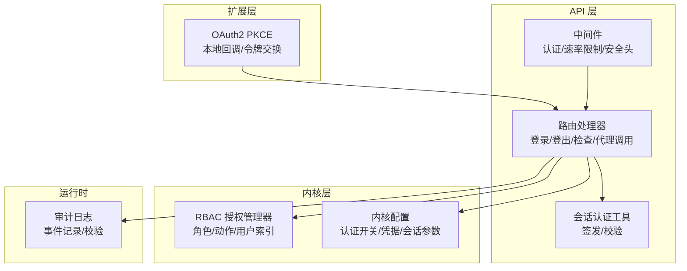
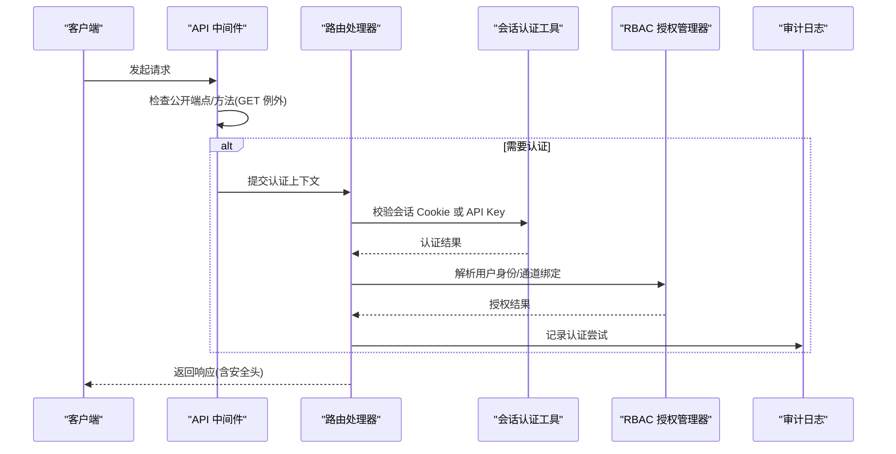
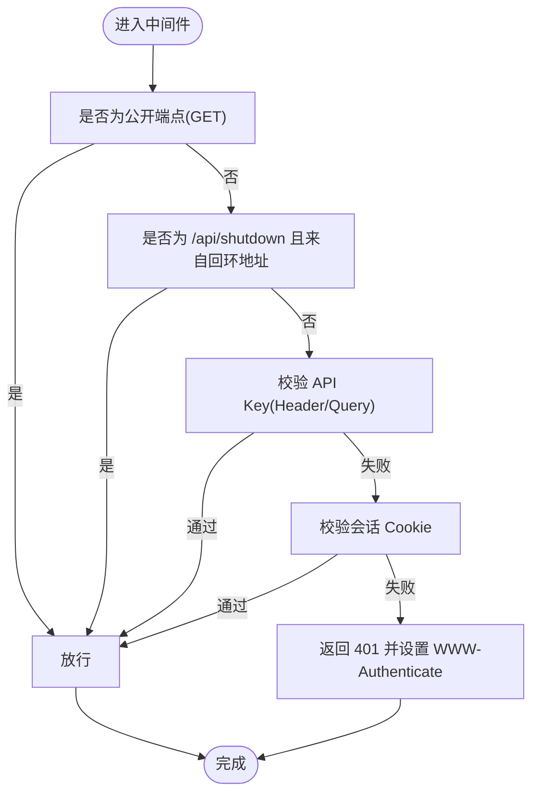
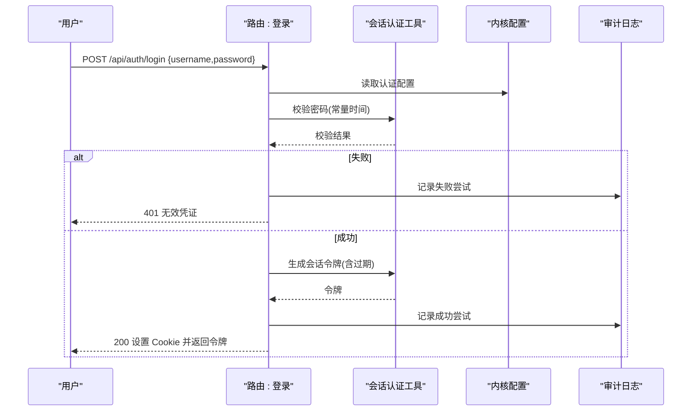
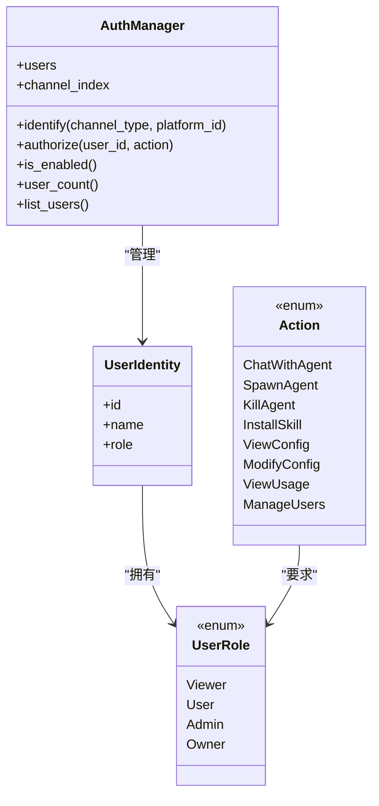
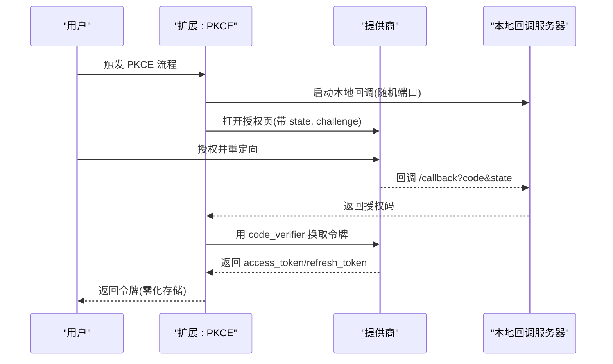
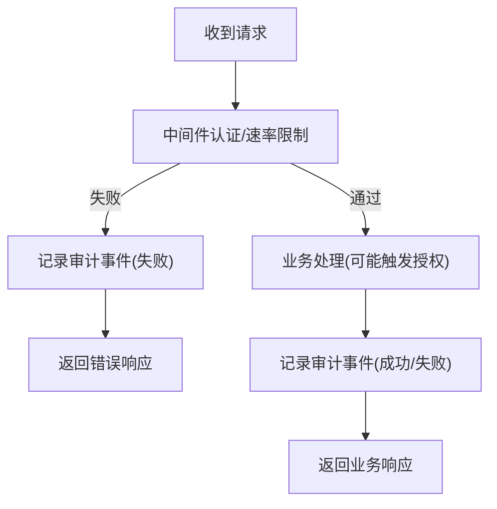
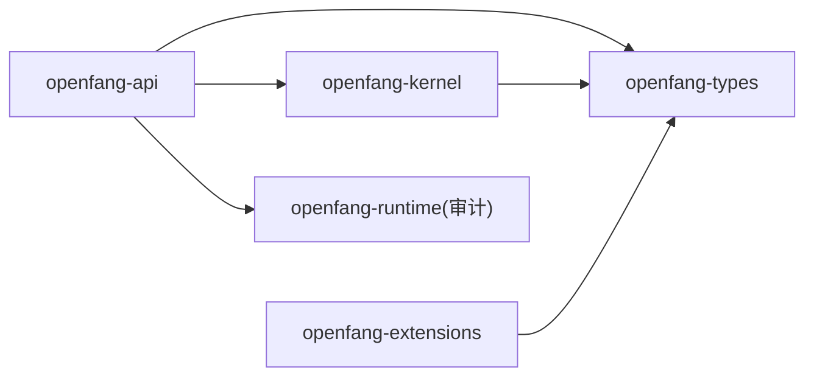

# 认证授权 API

<cite>
**本文引用的文件**
- [lib.rs](file://crates/openfang-api/src/lib.rs)
- [middleware.rs](file://crates/openfang-api/src/middleware.rs)
- [routes.rs](file://crates/openfang-api/src/routes.rs)
- [session_auth.rs](file://crates/openfang-api/src/session_auth.rs)
- [auth.rs](file://crates/openfang-kernel/src/auth.rs)
- [config.rs](file://crates/openfang-kernel/src/config.rs)
- [config.rs](file://crates/openfang-types/src/config.rs)
- [oauth.rs](file://crates/openfang-extensions/src/oauth.rs)
- [audit.rs](file://crates/openfang-runtime/src/audit.rs)
- [index_body.html](file://crates/openfang-api/static/index_body.html)
</cite>

## 目录
1. [简介](#简介)
2. [项目结构](#项目结构)
3. [核心组件](#核心组件)
4. [架构总览](#架构总览)
5. [详细组件分析](#详细组件分析)
6. [依赖关系分析](#依赖关系分析)
7. [性能考量](#性能考量)
8. [故障排查指南](#故障排查指南)
9. [结论](#结论)
10. [附录](#附录)

## 简介
本文件面向认证授权 API 的使用者与维护者，系统化梳理了基于 OpenFang Agent OS 的认证与权限控制能力，覆盖以下主题：
- 用户认证：API 密钥认证、会话 Cookie 登录、OAuth2 PKCE 流程
- 权限管理：RBAC 角色模型、操作授权、通道绑定识别
- 访问控制：中间件级请求拦截、公开端点白名单、速率限制
- 安全机制：常量时间比较、安全响应头、审计日志、令牌签名与过期控制
- 多租户与继承：通过通道绑定实现跨平台身份映射
- 客户端集成：浏览器端会话、SDK 使用建议、最佳实践

## 项目结构
认证授权相关代码主要分布在以下模块：
- openfang-api：HTTP 路由、中间件、会话认证工具
- openfang-kernel：RBAC 授权管理器、内核配置加载
- openfang-types：配置数据结构（含认证相关字段）
- openfang-extensions：OAuth2 PKCE 实现
- openfang-runtime：审计日志基础设施

图表来源
- [middleware.rs:1-270](file://crates/openfang-api/src/middleware.rs#L1-L270)
- [routes.rs:11047-11191](file://crates/openfang-api/src/routes.rs#L11047-L11191)
- [session_auth.rs:1-110](file://crates/openfang-api/src/session_auth.rs#L1-L110)
- [auth.rs:1-317](file://crates/openfang-kernel/src/auth.rs#L1-L317)
- [config.rs:1-458](file://crates/openfang-kernel/src/config.rs#L1-L458)
- [oauth.rs:1-384](file://crates/openfang-extensions/src/oauth.rs#L1-L384)
- [audit.rs:113-136](file://crates/openfang-runtime/src/audit.rs#L113-L136)

章节来源
- [lib.rs:1-18](file://crates/openfang-api/src/lib.rs#L1-L18)

## 核心组件
- 中间件认证与安全头
  - 请求 ID 注入与结构化日志
  - 公开端点白名单（仅 GET）
  - API 密钥认证（Header 或查询参数）
  - 会话 Cookie 认证（Dashboard）
  - 安全响应头（CSP、X-Frame-Options、HSTS 等）
- 会话认证工具
  - 基于 HMAC-SHA256 的无状态会话令牌（用户名+过期时间+签名）
  - 常量时间密码哈希与比对
- RBAC 授权管理器
  - 用户角色层级（Viewer/User/Admin/Owner）
  - 操作到角色的映射
  - 通道绑定索引（Telegram/Discord 等）解析用户身份
- OAuth2 PKCE
  - 本地回调服务器、CSRF state 校验
  - code_verifier/code_challenge（S256）
  - 令牌存储与零化
- 审计日志
  - 认证尝试事件记录
  - 近期事件流式输出与完整性校验

章节来源
- [middleware.rs:17-259](file://crates/openfang-api/src/middleware.rs#L17-L259)
- [session_auth.rs:9-72](file://crates/openfang-api/src/session_auth.rs#L9-L72)
- [auth.rs:13-189](file://crates/openfang-kernel/src/auth.rs#L13-L189)
- [oauth.rs:121-258](file://crates/openfang-extensions/src/oauth.rs#L121-L258)
- [audit.rs:113-136](file://crates/openfang-runtime/src/audit.rs#L113-L136)

## 架构总览
下图展示了从客户端到内核的认证与授权路径，以及关键的安全控制点。

图表来源
- [middleware.rs:62-215](file://crates/openfang-api/src/middleware.rs#L62-L215)
- [routes.rs:11047-11191](file://crates/openfang-api/src/routes.rs#L11047-L11191)
- [session_auth.rs:21-56](file://crates/openfang-api/src/session_auth.rs#L21-L56)
- [auth.rs:141-173](file://crates/openfang-kernel/src/auth.rs#L141-L173)
- [audit.rs:113-136](file://crates/openfang-runtime/src/audit.rs#L113-L136)

## 详细组件分析

### API 认证与中间件
- 公开端点白名单
  - 仅 GET 方法允许匿名访问（如健康检查、模型列表、上传预览等）
  - 对写操作（POST/PUT/DELETE）强制认证，防止未授权变更
- API 密钥认证
  - 支持 Authorization: Bearer 与 X-API-Key
  - 查询参数 token（SSE/EventSource 场景）
  - 常量时间比较，避免时序攻击
- 会话认证（Dashboard）
  - Cookie 名称 openfang_session
  - 服务端使用 HMAC-SHA256 签名，包含用户名与过期时间
- 安全响应头
  - nosniff、DENY、block、CSP、Strict-Transport-Security、Referrer-Policy 等

图表来源
- [middleware.rs:62-215](file://crates/openfang-api/src/middleware.rs#L62-L215)

章节来源
- [middleware.rs:17-259](file://crates/openfang-api/src/middleware.rs#L17-L259)

### 会话认证与令牌管理
- 会话令牌结构
  - base64(username:expiry:hmac)
  - HMAC 使用会话密钥（优先使用 API Key，否则使用配置中的密码哈希）
- 令牌验证
  - 解码后拆分三段，校验过期时间
  - 重新计算签名并与提供的签名进行常量时间比较
- 登录/登出/状态检查
  - 登录成功设置 HttpOnly SameSite=Strict Cookie，并返回令牌
  - 登出清除 Cookie
  - 检查当前会话状态

图表来源
- [routes.rs:11047-11132](file://crates/openfang-api/src/routes.rs#L11047-L11132)
- [session_auth.rs:9-72](file://crates/openfang-api/src/session_auth.rs#L9-L72)
- [audit.rs:113-136](file://crates/openfang-runtime/src/audit.rs#L113-L136)

章节来源
- [routes.rs:11047-11191](file://crates/openfang-api/src/routes.rs#L11047-L11191)
- [session_auth.rs:9-72](file://crates/openfang-api/src/session_auth.rs#L9-L72)

### RBAC 权限管理与多租户支持
- 角色与动作
  - Viewer/User/Admin/Owner 四级角色
  - 动作包括聊天、创建/销毁代理、安装技能、查看/修改配置、管理用户等
  - 每个动作对应最低所需角色
- 用户识别与通道绑定
  - 通过 channel_type:platform_id 映射到 OpenFang 用户 ID
  - 同一用户可在多个平台拥有相同身份
- 授权决策
  - 若用户角色低于所需角色则拒绝
  - 未知用户直接拒绝

图表来源
- [auth.rs:13-189](file://crates/openfang-kernel/src/auth.rs#L13-L189)

章节来源
- [auth.rs:13-189](file://crates/openfang-kernel/src/auth.rs#L13-L189)

### OAuth2 PKCE 集成
- 本地回调
  - 绑定 127.0.0.1:0 自动分配端口
  - 打开浏览器到授权 URL，接收 code
- 安全参数
  - state 防 CSRF
  - PKCE code_verifier/code_challenge(S256)
- 令牌交换
  - 使用 code_verifier 换取 access_token/refresh_token
  - 存储令牌并使用零化内存

图表来源
- [oauth.rs:121-258](file://crates/openfang-extensions/src/oauth.rs#L121-L258)

章节来源
- [oauth.rs:1-384](file://crates/openfang-extensions/src/oauth.rs#L1-L384)

### 审计日志与异常处理
- 审计事件
  - 认证尝试（成功/失败）均记录
  - 近期事件支持过滤与文本匹配
- 完整性校验
  - 提供 Merkle 链校验接口，保障审计链不可篡改
- 异常处理
  - 中间件统一返回 401/403/404/500
  - 日志记录错误与请求上下文

图表来源
- [middleware.rs:17-259](file://crates/openfang-api/src/middleware.rs#L17-L259)
- [routes.rs:11082-11096](file://crates/openfang-api/src/routes.rs#L11082-L11096)
- [audit.rs:113-136](file://crates/openfang-runtime/src/audit.rs#L113-L136)

章节来源
- [audit.rs:113-136](file://crates/openfang-runtime/src/audit.rs#L113-L136)
- [index_body.html:4301-4320](file://crates/openfang-api/static/index_body.html#L4301-L4320)

## 依赖关系分析
- openfang-api 依赖 openfang-kernel 的配置与审计日志
- openfang-api 依赖 openfang-types 的配置结构
- openfang-kernel 依赖 openfang-types 的用户配置与错误类型
- openfang-extensions 依赖 openfang-types 的 OAuth 配置结构

图表来源
- [lib.rs:1-18](file://crates/openfang-api/src/lib.rs#L1-L18)
- [config.rs:1-458](file://crates/openfang-kernel/src/config.rs#L1-L458)
- [config.rs:143-158](file://crates/openfang-types/src/config.rs#L143-L158)
- [oauth.rs:1-384](file://crates/openfang-extensions/src/oauth.rs#L1-L384)

章节来源
- [lib.rs:1-18](file://crates/openfang-api/src/lib.rs#L1-L18)

## 性能考量
- 中间件采用轻量日志与常量时间比较，避免时延抖动
- 会话令牌为无状态设计，无需持久化存储
- RBAC 授权基于并发哈希表，适合高并发场景
- 审计日志采用数据库持久化，注意磁盘 IO 与查询优化

## 故障排查指南
- 401 未授权
  - 检查 Authorization 头或 X-API-Key 是否正确
  - 检查查询参数 token 是否随 SSE/EventSource 传递
  - 确认公开端点仅允许 GET
- 403 禁止访问
  - 检查用户角色是否满足动作最低要求
  - 确认通道绑定是否正确解析用户身份
- 会话问题
  - 检查 Cookie 是否为 HttpOnly、SameSite、Max-Age 正确
  - 确认会话密钥与 API Key 或密码哈希一致
- 审计与安全
  - 使用 /api/audit/recent 查看近期事件
  - 使用 /api/audit/verify 校验审计链完整性

章节来源
- [middleware.rs:136-215](file://crates/openfang-api/src/middleware.rs#L136-L215)
- [routes.rs:11144-11191](file://crates/openfang-api/src/routes.rs#L11144-L11191)
- [audit.rs:113-136](file://crates/openfang-runtime/src/audit.rs#L113-L136)

## 结论
该认证授权体系在保证安全性的同时兼顾易用性：
- 通过中间件统一入口，确保所有写操作受控
- 会话与 API Key 双轨认证，适配不同客户端场景
- RBAC 提供细粒度权限控制，通道绑定实现跨平台多租户
- 审计日志与安全头强化合规与可观测性
- OAuth2 PKCE 为外部身份源提供标准对接方式

## 附录

### API 端点清单（认证相关）
- POST /api/auth/login
  - 输入：username、password
  - 输出：设置 openfang_session Cookie，返回 token 与用户名
  - 安全：常量时间密码校验，记录审计事件
- POST /api/auth/logout
  - 清除 openfang_session Cookie
- GET /api/auth/check
  - 检查当前会话状态（已登录/未登录）

章节来源
- [routes.rs:11047-11191](file://crates/openfang-api/src/routes.rs#L11047-L11191)

### 安全配置要点
- 在配置中启用认证并设置强密码哈希
- 合理设置会话过期时间（session_ttl_hours）
- 使用 HTTPS 与安全响应头，避免明文传输
- 审计日志开启并定期校验完整性

章节来源
- [session_auth.rs:58-72](file://crates/openfang-api/src/session_auth.rs#L58-L72)
- [middleware.rs:232-259](file://crates/openfang-api/src/middleware.rs#L232-L259)