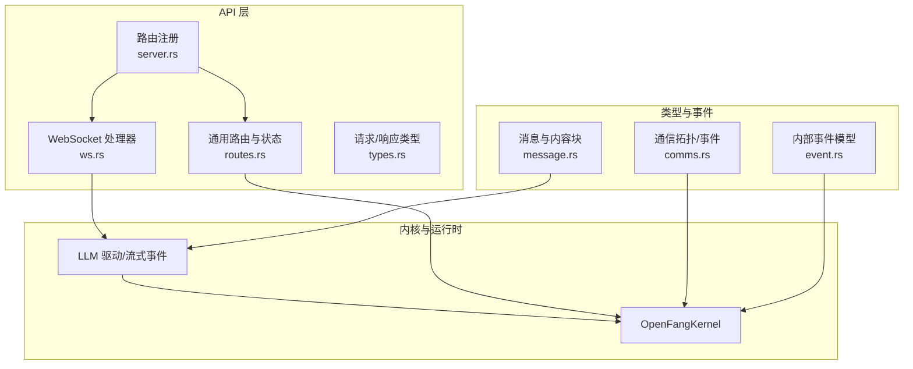
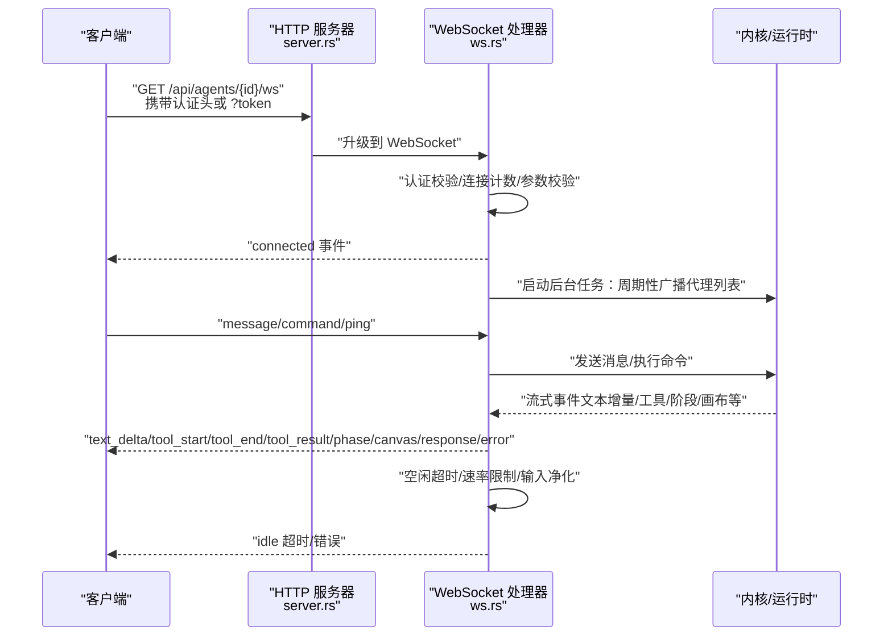
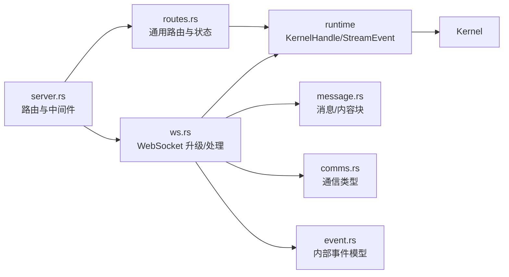
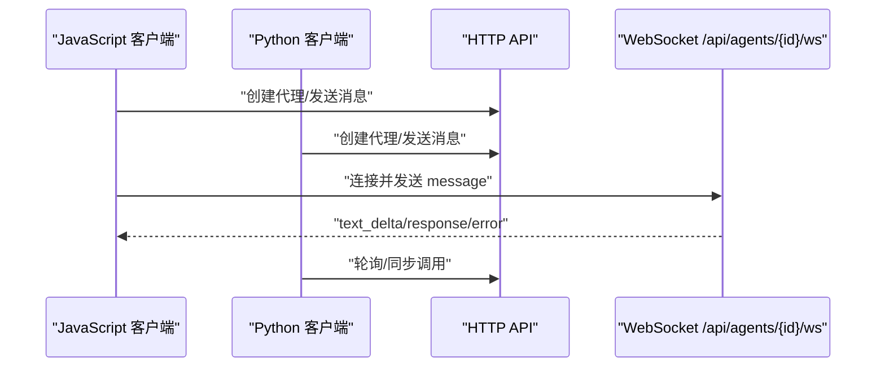

# WebSocket API

<cite>
**本文引用的文件**
- [ws.rs](file://crates/openfang-api/src/ws.rs)
- [server.rs](file://crates/openfang-api/src/server.rs)
- [lib.rs](file://crates/openfang-api/src/lib.rs)
- [routes.rs](file://crates/openfang-api/src/routes.rs)
- [types.rs](file://crates/openfang-api/src/types.rs)
- [comms.rs](file://crates/openfang-types/src/comms.rs)
- [message.rs](file://crates/openfang-types/src/message.rs)
- [event.rs](file://crates/openfang-types/src/event.rs)
- [basic.js](file://sdk/javascript/examples/basic.js)
- [streaming.js](file://sdk/javascript/examples/streaming.js)
- [client_basic.py](file://sdk/python/examples/client_basic.py)
</cite>

## 目录
1. [简介](#简介)
2. [项目结构](#项目结构)
3. [核心组件](#核心组件)
4. [架构总览](#架构总览)
5. [详细组件分析](#详细组件分析)
6. [依赖关系分析](#依赖关系分析)
7. [性能考量](#性能考量)
8. [故障排查指南](#故障排查指南)
9. [结论](#结论)
10. [附录](#附录)

## 简介
本文件为 OpenFang WebSocket API 的完整通信协议文档，覆盖 WebSocket 连接建立、认证机制、消息格式与事件类型、命令系统、实时推送、错误处理、心跳与断线重连策略、序列化与压缩、性能优化与并发管理、以及调试与排障建议。目标读者包括前端与后端开发者、集成工程师与运维人员。

## 项目结构
OpenFang 的 WebSocket 能力由 HTTP/WebSocket API 子系统提供，核心入口在 API 守护进程构建器中注册路由，WebSocket 升级处理器位于独立模块中，消息流通过内核（Kernel）与运行时（Runtime）驱动。

图示来源
- [server.rs:37-712](file://crates/openfang-api/src/server.rs#L37-L712)
- [ws.rs:135-207](file://crates/openfang-api/src/ws.rs#L135-L207)
- [routes.rs:21-43](file://crates/openfang-api/src/routes.rs#L21-L43)
- [message.rs:1-341](file://crates/openfang-types/src/message.rs#L1-L341)
- [comms.rs:1-171](file://crates/openfang-types/src/comms.rs#L1-L171)
- [event.rs:1-392](file://crates/openfang-types/src/event.rs#L1-L392)

章节来源
- [server.rs:37-712](file://crates/openfang-api/src/server.rs#L37-L712)
- [lib.rs:1-18](file://crates/openfang-api/src/lib.rs#L1-L18)

## 核心组件
- WebSocket 升级与握手：基于路径 /api/agents/{id}/ws，支持 Bearer 认证或查询参数 token。
- 连接跟踪与限流：按 IP 维度限制并发连接数；每连接速率限制；空闲超时。
- 消息处理：文本消息解析、附件注入、输入净化、模型能力校验、流式事件映射与去抖。
- 命令系统：会话重置、紧凑化、停止运行、模型切换、用量查询、上下文报告、冗长度设置、队列状态、预算查询、对等节点与 A2A 列表等。
- 实时推送：连接确认、代理列表变更广播、打字指示、文本增量、工具调用生命周期、阶段变化、画布呈现、静默完成、响应聚合、错误通知。
- 错误分类：将底层 LLM 错误映射为用户可理解的消息，含节流延迟建议、配额与鉴权提示等。

章节来源
- [ws.rs:135-207](file://crates/openfang-api/src/ws.rs#L135-L207)
- [ws.rs:213-384](file://crates/openfang-api/src/ws.rs#L213-L384)
- [ws.rs:390-804](file://crates/openfang-api/src/ws.rs#L390-L804)
- [ws.rs:810-991](file://crates/openfang-api/src/ws.rs#L810-L991)
- [ws.rs:997-1086](file://crates/openfang-api/src/ws.rs#L997-L1086)

## 架构总览
WebSocket 在 HTTP 路由体系中作为长连接通道，与 REST API 共享内核状态与中间件层。升级成功后，服务端维护连接生命周期、速率与活动监控，并通过内核驱动的流事件向客户端推送实时数据。

图示来源
- [server.rs:241-241](file://crates/openfang-api/src/server.rs#L241-L241)
- [ws.rs:135-207](file://crates/openfang-api/src/ws.rs#L135-L207)
- [ws.rs:242-292](file://crates/openfang-api/src/ws.rs#L242-L292)
- [ws.rs:390-781](file://crates/openfang-api/src/ws.rs#L390-L781)

## 详细组件分析

### WebSocket 升级与认证
- 路径与方法：GET /api/agents/{id}/ws
- 认证方式：
  - 授权头：Authorization: Bearer <token>
  - 查询参数：?token=<token>
- 安全检查：
  - API 密钥存在时启用常量时间比较进行鉴权
  - 按源 IP 限制最大并发连接数
  - 代理存在性校验
- 成功后发送连接确认事件，随后启动代理列表变更广播任务

章节来源
- [ws.rs:135-207](file://crates/openfang-api/src/ws.rs#L135-L207)
- [server.rs:241-241](file://crates/openfang-api/src/server.rs#L241-L241)

### 连接生命周期与保活
- 空闲超时：30 分钟无客户端消息则关闭连接并返回错误
- 心跳：收到 Ping 自动回复 Pong 并刷新活动时间
- 速率限制：每连接每分钟最多 10 条消息
- 输入大小限制：单条消息最大 64KB
- 连接计数：每个 IP 最多 5 个并发连接

章节来源
- [ws.rs:39-46](file://crates/openfang-api/src/ws.rs#L39-L46)
- [ws.rs:294-301](file://crates/openfang-api/src/ws.rs#L294-L301)
- [ws.rs:336-378](file://crates/openfang-api/src/ws.rs#L336-L378)
- [ws.rs:181-190](file://crates/openfang-api/src/ws.rs#L181-L190)

### 消息格式与事件类型
- 客户端 → 服务端
  - 文本消息：type=message，必填字段 content
  - 命令消息：type=command，字段 command 与 args
  - 心跳：type=ping
- 服务端 → 客户端
  - 连接确认：type=connected
  - 打字指示：type=typing，state=start/tool/stop
  - 文本增量：type=text_delta，content
  - 工具生命周期：type=tool_start/tool_end/tool_result
  - 阶段变化：type=phase
  - 画布呈现：type=canvas，包含 html/title/canvas_id
  - 响应聚合：type=response，包含 content/input_tokens/output_tokens/iterations/context_pressure
  - 静默完成：type=silent_complete
  - 错误通知：type=error，content
  - 代理列表更新：type=agents_updated，agents 数组
  - 命令结果：type=command_result，command/message/附加字段（如 model/provider）

章节来源
- [ws.rs:4-14](file://crates/openfang-api/src/ws.rs#L4-L14)
- [ws.rs:390-804](file://crates/openfang-api/src/ws.rs#L390-L804)
- [ws.rs:997-1086](file://crates/openfang-api/src/ws.rs#L997-L1086)

### 命令系统
- 支持命令与行为：
  - 新建/重置会话：reset/new
  - 紧凑化会话：compact
  - 停止当前运行：stop
  - 查看/切换模型：model
  - 查询用量：usage
  - 上下文压力报告：context
  - 冗长度切换：verbose（off/on/full）
  - 队列状态：queue
  - 预算查询：budget
  - 对等节点列表：peers
  - 外部 A2A 代理列表：a2a
- 返回统一结构：command_result 或 error

章节来源
- [ws.rs:810-991](file://crates/openfang-api/src/ws.rs#L810-L991)

### 流式事件映射与去抖
- 文本增量采用去抖策略：字符数超过阈值或定时器触发时批量发送 text_delta
- 工具事件映射：根据冗长度输出精简或完整输入/结果
- 阶段变化与内容完成事件用于生成最终 response
- 静默完成：当无文本增量且已捕获用量信息时，发送 silent_complete

章节来源
- [ws.rs:519-633](file://crates/openfang-api/src/ws.rs#L519-L633)
- [ws.rs:997-1086](file://crates/openfang-api/src/ws.rs#L997-L1086)
- [ws.rs:1092-1122](file://crates/openfang-api/src/ws.rs#L1092-L1122)

### 输入净化与附件处理
- 输入净化：提取 JSON envelope 中的 content 字段，移除控制字符（保留换行与制表），修剪空白
- 附件注入：将上传的图片转换为 ContentBlock 并注入会话，若模型不支持视觉则发出警告
- 图像校验：媒体类型与大小限制，防止过大或不受支持的格式

章节来源
- [ws.rs:426-487](file://crates/openfang-api/src/ws.rs#L426-L487)
- [routes.rs:244-289](file://crates/openfang-api/src/routes.rs#L244-L289)
- [message.rs:104-127](file://crates/openfang-types/src/message.rs#L104-L127)

### 错误分类与用户提示
- 将底层 LLM 错误分类为上下文溢出、速率限制、账单问题、鉴权失败、模型不存在、格式错误等
- 提供可操作建议（如 compact/new、等待秒数、切换模型）
- 对特定错误提取 HTTP 状态码辅助诊断

章节来源
- [ws.rs:1150-1212](file://crates/openfang-api/src/ws.rs#L1150-L1212)
- [ws.rs:1214-1249](file://crates/openfang-api/src/ws.rs#L1214-L1249)

### 代理列表变更广播
- 后台任务每 5 秒计算代理列表哈希，有变化才广播 agents_updated
- 广播内容包含 id/name/state/model_provider/model_name

章节来源
- [ws.rs:242-292](file://crates/openfang-api/src/ws.rs#L242-L292)

### 与内部事件系统的关联
- 类型定义涵盖事件标识、目标、载荷、生命周期、网络与系统事件等
- 通信 UI 使用拓扑与事件类型进行可视化展示与交互

章节来源
- [event.rs:1-392](file://crates/openfang-types/src/event.rs#L1-L392)
- [comms.rs:1-171](file://crates/openfang-types/src/comms.rs#L1-L171)

## 依赖关系分析

图示来源
- [server.rs:37-712](file://crates/openfang-api/src/server.rs#L37-L712)
- [ws.rs:15-33](file://crates/openfang-api/src/ws.rs#L15-L33)
- [routes.rs:21-43](file://crates/openfang-api/src/routes.rs#L21-L43)
- [message.rs:1-341](file://crates/openfang-types/src/message.rs#L1-L341)
- [comms.rs:1-171](file://crates/openfang-types/src/comms.rs#L1-L171)
- [event.rs:1-392](file://crates/openfang-types/src/event.rs#L1-L392)

章节来源
- [server.rs:37-712](file://crates/openfang-api/src/server.rs#L37-L712)
- [ws.rs:15-33](file://crates/openfang-api/src/ws.rs#L15-L33)

## 性能考量
- 去抖与批量发送：text_delta 基于字符阈值与定时器合并，降低帧数与带宽占用
- 背压与速率限制：每连接每分钟上限与空闲超时，避免资源滥用
- 连接池与并发：按 IP 限制并发，防止 DDoS 与资源耗尽
- 序列化与压缩：HTTP 层启用压缩中间件，WebSocket 传输 JSON 文本
- 资源清理：后台任务在连接关闭时自动终止；内核任务异步完成后台写入与镜像

章节来源
- [ws.rs:42-46](file://crates/openfang-api/src/ws.rs#L42-L46)
- [ws.rs:294-301](file://crates/openfang-api/src/ws.rs#L294-L301)
- [ws.rs:181-190](file://crates/openfang-api/src/ws.rs#L181-L190)
- [server.rs:15](file://crates/openfang-api/src/server.rs#L15-L15)

## 故障排查指南
- 认证失败
  - 检查 Authorization 头或 ?token 是否正确传递
  - 确认 API 密钥配置与常量时间比较逻辑
- 连接被拒
  - 检查是否超过每 IP 最大并发连接数
  - 确认代理 ID 是否存在
- 速率限制
  - 控制发送频率，避免超过每分钟 10 条
- 消息过大
  - 单条消息不超过 64KB
- 空闲断开
  - 定期发送 ping 或保持活跃
- LLM 错误
  - 根据错误分类提示采取相应措施（等待、切换模型、清理上下文）
- 图像不支持
  - 当前模型不支持视觉时，服务端会给出明确提示

章节来源
- [ws.rs:152-179](file://crates/openfang-api/src/ws.rs#L152-L179)
- [ws.rs:181-190](file://crates/openfang-api/src/ws.rs#L181-L190)
- [ws.rs:336-378](file://crates/openfang-api/src/ws.rs#L336-L378)
- [ws.rs:311-321](file://crates/openfang-api/src/ws.rs#L311-L321)
- [ws.rs:1150-1212](file://crates/openfang-api/src/ws.rs#L1150-L1212)
- [ws.rs:457-487](file://crates/openfang-api/src/ws.rs#L457-L487)

## 结论
OpenFang 的 WebSocket API 提供了安全、可控、可观测的实时通信通道，结合内核与运行时的流式事件模型，能够高效地支撑聊天、工具调用、状态推送与错误反馈等场景。通过去抖、限速、空闲超时与连接池等机制，系统在可用性与资源消耗之间取得平衡。建议在生产环境中配合健康检查、日志与告警体系，持续优化模型选择与会话管理策略。

## 附录

### 客户端连接示例与消息收发流程
- JavaScript 示例（REST 与流式）
  - 基础调用：[basic.js:1-35](file://sdk/javascript/examples/basic.js#L1-L35)
  - 流式输出：[streaming.js:1-34](file://sdk/javascript/examples/streaming.js#L1-L34)
- Python 示例（REST）
  - 基础调用：[client_basic.py:1-36](file://sdk/python/examples/client_basic.py#L1-L36)

图示来源
- [basic.js:10-32](file://sdk/javascript/examples/basic.js#L10-L32)
- [streaming.js:10-31](file://sdk/javascript/examples/streaming.js#L10-L31)
- [client_basic.py:15-35](file://sdk/python/examples/client_basic.py#L15-L35)
- [server.rs:241-241](file://crates/openfang-api/src/server.rs#L241-L241)

### 断线重连策略建议
- 指数退避重试：每次重连间隔递增，上限不超过 60 秒
- 发送 ping 保持活跃：周期性发送 ping，收到 pong 更新活动时间
- 本地缓冲：客户端缓存最近一次 response 的摘要，重连后请求增量同步
- 代理列表监听：订阅 agents_updated 事件，动态调整订阅目标

[本节为通用实践建议，无需具体文件引用]