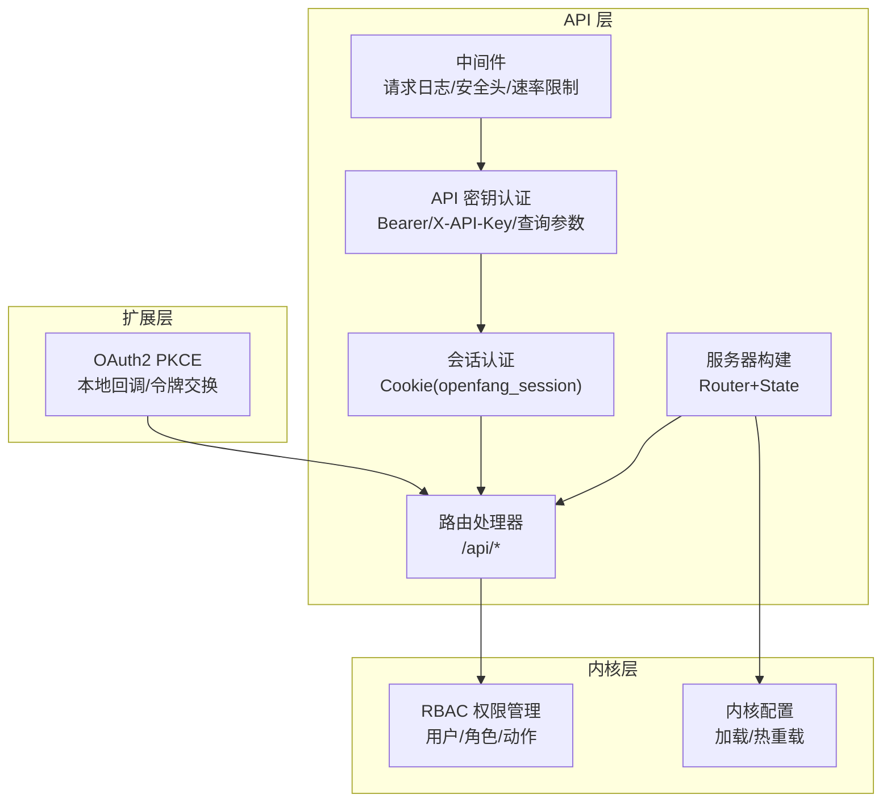
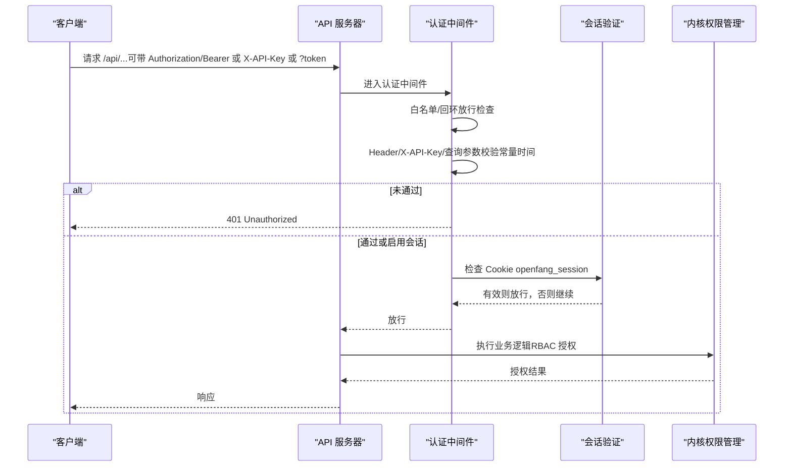
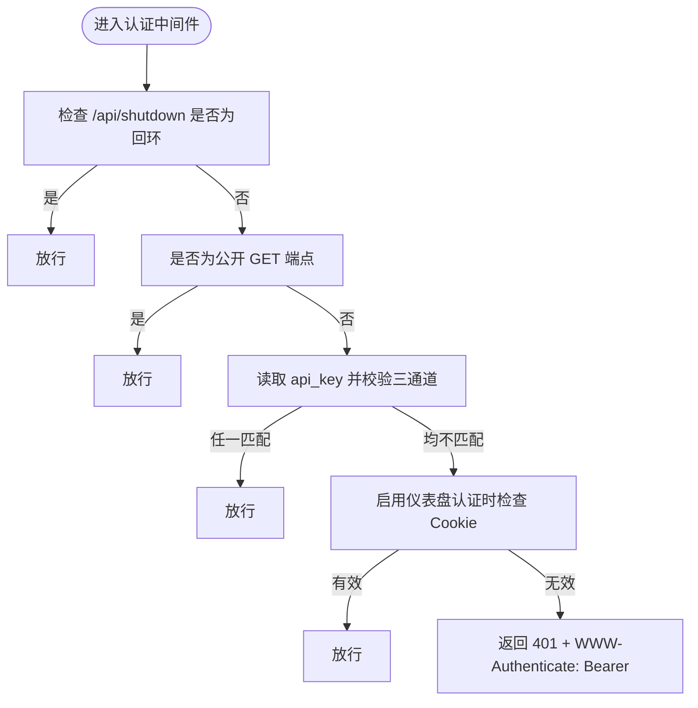
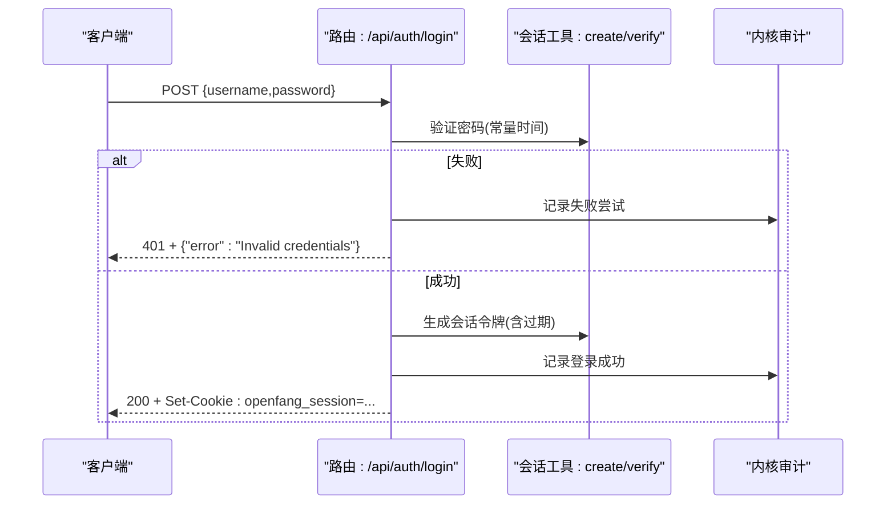
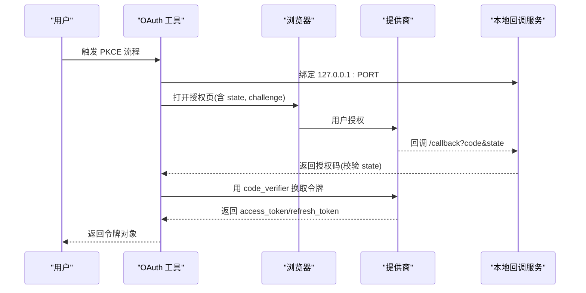
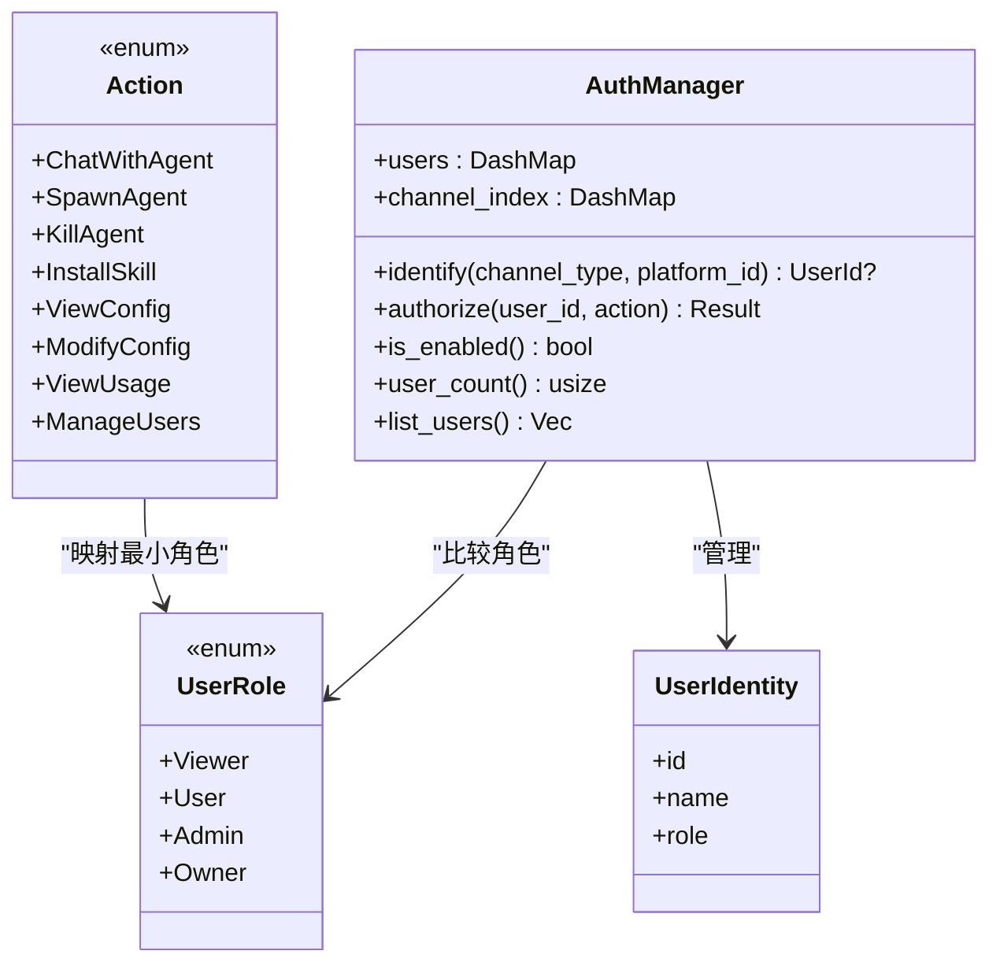
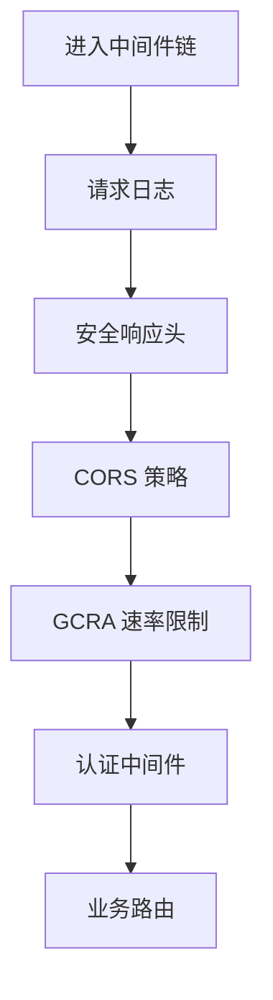
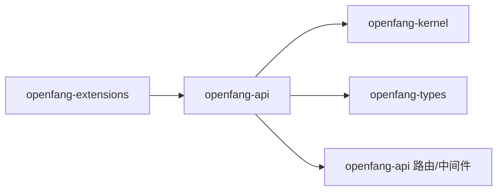

# 认证与授权

<cite>
**本文引用的文件**
- [lib.rs](file://crates/openfang-api/src/lib.rs)
- [middleware.rs](file://crates/openfang-api/src/middleware.rs)
- [session_auth.rs](file://crates/openfang-api/src/session_auth.rs)
- [routes.rs](file://crates/openfang-api/src/routes.rs)
- [server.rs](file://crates/openfang-api/src/server.rs)
- [auth.rs](file://crates/openfang-kernel/src/auth.rs)
- [config.rs](file://crates/openfang-kernel/src/config.rs)
- [oauth.rs](file://crates/openfang-extensions/src/oauth.rs)
- [config.rs（类型）](file://crates/openfang-types/src/config.rs)
- [rate_limiter.rs](file://crates/openfang-api/src/rate_limiter.rs)
</cite>

## 目录
1. [简介](#简介)
2. [项目结构](#项目结构)
3. [核心组件](#核心组件)
4. [架构总览](#架构总览)
5. [详细组件分析](#详细组件分析)
6. [依赖关系分析](#依赖关系分析)
7. [性能考量](#性能考量)
8. [故障排查指南](#故障排查指南)
9. [结论](#结论)
10. [附录](#附录)

## 简介
本文件面向 OpenFang 的认证与授权体系，覆盖以下主题：
- API 密钥认证：支持请求头 Authorization: Bearer 与 X-API-Key，以及查询参数 token 的安全校验。
- 会话令牌与仪表盘登录：基于 HMAC-SHA256 的无状态会话令牌，支持登录、检查与注销。
- OAuth2 集成：通过 PKCE 在本地回环地址完成浏览器授权，换取并存储令牌。
- 权限模型与角色：基于角色的访问控制（RBAC），支持查看者、用户、管理员、所有者四类角色。
- 中间件与安全：统一请求日志、安全响应头、CORS、速率限制（GCRA）与请求拦截。
- 会话管理：登录态维持、过期控制、注销清理。
- 安全审计与异常处理：失败尝试记录、错误响应格式化、防护策略。
- 客户端集成与最佳实践：密钥与令牌使用建议、安全配置范式。

## 项目结构
OpenFang 将认证与授权分布在多个模块中：
- openfang-api：HTTP 路由、中间件、会话与速率限制。
- openfang-kernel：RBAC 权限管理与内核配置加载。
- openfang-types：配置数据结构（含用户与认证配置）。
- openfang-extensions：OAuth2 PKCE 实现与令牌存储。

**图表来源**
- [server.rs:37-712](file://crates/openfang-api/src/server.rs#L37-L712)
- [middleware.rs:17-259](file://crates/openfang-api/src/middleware.rs#L17-L259)
- [routes.rs:11051-11195](file://crates/openfang-api/src/routes.rs#L11051-L11195)
- [auth.rs:13-189](file://crates/openfang-kernel/src/auth.rs#L13-L189)
- [oauth.rs:121-258](file://crates/openfang-extensions/src/oauth.rs#L121-L258)

**章节来源**
- [lib.rs:1-18](file://crates/openfang-api/src/lib.rs#L1-L18)
- [server.rs:37-712](file://crates/openfang-api/src/server.rs#L37-L712)

## 核心组件
- API 密钥认证中间件：支持多通道校验（Header、X-API-Key、查询参数），常量时间比较，支持白名单路径与回环跳过。
- 会话令牌：HMAC-SHA256 签名，包含用户名与过期时间，支持登录生成 Cookie、检查当前状态、注销清除。
- OAuth2 PKCE：本地回环回调、CSRF state 校验、code_verifier/code_challenge（S256）、令牌零化存储。
- RBAC 权限管理：用户角色与最小权限映射，按动作进行授权判定。
- 速率限制：基于 GCRA 的带操作成本的速率限制，按路径与方法计算消耗。
- 安全响应头：X-Content-Type-Options、X-Frame-Options、X-XSS-Protection、CSP、Referrer-Policy、Cache-Control、HSTS。

**章节来源**
- [middleware.rs:46-259](file://crates/openfang-api/src/middleware.rs#L46-L259)
- [session_auth.rs:9-72](file://crates/openfang-api/src/session_auth.rs#L9-L72)
- [oauth.rs:121-258](file://crates/openfang-extensions/src/oauth.rs#L121-L258)
- [auth.rs:13-189](file://crates/openfang-kernel/src/auth.rs#L13-L189)
- [rate_limiter.rs:14-79](file://crates/openfang-api/src/rate_limiter.rs#L14-L79)

## 架构总览
下图展示从客户端到内核的认证与授权流程，包括 API 密钥、会话与 OAuth2 的交互位置。

**图表来源**
- [middleware.rs:62-215](file://crates/openfang-api/src/middleware.rs#L62-L215)
- [session_auth.rs:21-56](file://crates/openfang-api/src/session_auth.rs#L21-L56)
- [auth.rs:155-173](file://crates/openfang-kernel/src/auth.rs#L155-L173)

## 详细组件分析

### 组件 A：API 密钥认证中间件
- 功能要点
  - 白名单路径与方法：仅 GET 的公开端点无需认证；/api/shutdown 对回环地址放行。
  - 多源校验：Authorization: Bearer、X-API-Key、查询参数 token。
  - 常量时间比较：防止时序攻击。
  - 会话回退：当启用仪表盘认证时，若 Cookie 有效也放行。
  - 错误响应：WWW-Authenticate: Bearer，返回结构化错误。
- 公开端点示例（仅 GET）
  - /、/logo.png、/favicon.ico、/.well-known/agent.json、/a2a/...、/api/health、/api/status、/api/version、/api/agents(GET)、/api/profiles(GET)、/api/config(GET)、/api/config/schema(GET)、/api/uploads/(GET)、/api/models(GET)、/api/models/aliases(GET)、/api/providers(GET)、/api/budget(GET)、/api/budget/agents(GET)、/api/budget/agents/(GET)、/api/network/status(GET)、/api/a2a/agents(GET)、/api/approvals(GET)、/api/approvals/(GET)、/api/channels(GET)、/api/hands(GET)、/api/hands/active(GET)、/api/hands/(GET)、/api/skills(GET)、/api/sessions(GET)、/api/integrations(GET)、/api/integrations/available(GET)、/api/integrations/health(GET)、/api/workflows(GET)、/api/logs/stream(SSE)、/api/cron/(GET)、/api/providers/github-copilot/oauth/(GET)、/api/auth/login、/api/auth/logout、/api/auth/check(GET)。
- 安全注意
  - 未配置 api_key 且未启用仪表盘认证时，整体跳过认证。
  - 查询参数 token 用于无法设置自定义头的场景（如 EventSource/SSE）。

**图表来源**
- [middleware.rs:62-215](file://crates/openfang-api/src/middleware.rs#L62-L215)

**章节来源**
- [middleware.rs:46-215](file://crates/openfang-api/src/middleware.rs#L46-L215)

### 组件 B：会话令牌与仪表盘认证
- 登录
  - 路径：POST /api/auth/login
  - 输入：username、password
  - 行为：常量时间密码校验，成功后生成会话令牌并写入 Cookie openfang_session（HttpOnly、SameSite=Strict、Max-Age 由配置决定）。
  - 审计：失败与成功均记录审计事件。
- 登出
  - 路径：POST /api/auth/logout
  - 行为：清空 Cookie openfang_session。
- 检查
  - 路径：GET /api/auth/check
  - 行为：解析 Cookie 并验证令牌有效性，返回当前认证状态与用户名。
- 会话签名
  - 令牌结构：base64(username:expiry:hmac)，HMAC 使用会话密钥（优先使用 api_key，否则使用仪表盘密码哈希）。
  - 验证：解码、拆分、过期判断、HMAC 校验（常量时间）。

**图表来源**
- [routes.rs:11051-11136](file://crates/openfang-api/src/routes.rs#L11051-L11136)
- [session_auth.rs:9-72](file://crates/openfang-api/src/session_auth.rs#L9-L72)

**章节来源**
- [routes.rs:11051-11195](file://crates/openfang-api/src/routes.rs#L11051-L11195)
- [session_auth.rs:9-72](file://crates/openfang-api/src/session_auth.rs#L9-L72)

### 组件 C：OAuth2 PKCE 集成
- 流程概览
  - 启动本地回环 HTTP 服务（随机端口），打开浏览器访问授权 URL（包含 client_id、redirect_uri、scope、state、code_challenge）。
  - 等待回调 /callback，校验 state 与错误，提取授权码。
  - 使用 code_verifier 交换访问令牌，返回令牌对象（access_token、refresh_token、expires_in、scope）。
- 关键安全
  - state 防 CSRF。
  - code_verifier 与 code_challenge（S256）。
  - 令牌使用 Zeroizing 存储，降低内存暴露风险。
- 默认 client_id
  - 内置默认值，可通过配置覆盖。

**图表来源**
- [oauth.rs:121-258](file://crates/openfang-extensions/src/oauth.rs#L121-L258)

**章节来源**
- [oauth.rs:17-84](file://crates/openfang-extensions/src/oauth.rs#L17-L84)
- [oauth.rs:121-258](file://crates/openfang-extensions/src/oauth.rs#L121-L258)

### 组件 D：RBAC 权限模型与角色
- 角色层级
  - Viewer（只读）< User（普通用户）< Admin（管理员）< Owner（所有者）。
- 动作与最小角色
  - ChatWithAgent → User
  - ViewConfig → User
  - ViewUsage → Admin
  - SpawnAgent/KillAgent/InstallSkill → Admin
  - ModifyConfig/ManageUsers → Owner
- 授权判定
  - 按用户角色与动作所需角色比较，不足则返回拒绝错误。
- 用户识别
  - 通过平台绑定（channel_type:platform_id）映射到 OpenFang 用户 ID，支持跨渠道同一身份。

**图表来源**
- [auth.rs:13-189](file://crates/openfang-kernel/src/auth.rs#L13-L189)

**章节来源**
- [auth.rs:13-189](file://crates/openfang-kernel/src/auth.rs#L13-L189)
- [config.rs（类型）:144-158](file://crates/openfang-types/src/config.rs#L144-L158)

### 组件 E：中间件与安全防护
- 请求日志中间件
  - 注入 x-request-id，记录方法、路径、状态、耗时。
- 安全响应头中间件
  - 设置 X-Content-Type-Options、X-Frame-Options、X-XSS-Protection、Content-Security-Policy、Referrer-Policy、Cache-Control、Strict-Transport-Security。
- CORS
  - 无 api_key 时允许本地回环；启用 api_key 或仪表盘认证时，限制为受信来源。
- 速率限制（GCRA）
  - 按路径与方法计算操作成本，每分钟配额 500 令牌，超限返回 429。

**图表来源**
- [server.rs:56-104](file://crates/openfang-api/src/server.rs#L56-L104)
- [rate_limiter.rs:46-79](file://crates/openfang-api/src/rate_limiter.rs#L46-L79)
- [middleware.rs:232-259](file://crates/openfang-api/src/middleware.rs#L232-L259)

**章节来源**
- [server.rs:56-104](file://crates/openfang-api/src/server.rs#L56-L104)
- [rate_limiter.rs:14-79](file://crates/openfang-api/src/rate_limiter.rs#L14-L79)
- [middleware.rs:232-259](file://crates/openfang-api/src/middleware.rs#L232-L259)

## 依赖关系分析
- openfang-api 依赖 openfang-kernel 提供的内核状态与审计能力；同时在 server.rs 中将 AuthState（包含 api_key、auth_enabled、session_secret）注入认证中间件。
- openfang-api 的 routes.rs 通过 KernelHandle 访问内核功能，并在部分场景记录审计事件。
- openfang-extensions 的 OAuth2 流程与 openfang-api 的路由配合，用于仪表盘与外部服务集成。

**图表来源**
- [server.rs:37-712](file://crates/openfang-api/src/server.rs#L37-L712)
- [routes.rs:11051-11195](file://crates/openfang-api/src/routes.rs#L11051-L11195)
- [oauth.rs:121-258](file://crates/openfang-extensions/src/oauth.rs#L121-L258)

**章节来源**
- [server.rs:37-712](file://crates/openfang-api/src/server.rs#L37-L712)
- [routes.rs:11051-11195](file://crates/openfang-api/src/routes.rs#L11051-L11195)

## 性能考量
- GCRA 速率限制
  - 按操作成本动态扣减令牌，避免高成本操作被频繁触发。
  - 可根据业务调整配额与成本权重。
- 常量时间比较
  - 防止时序侧信道，提升认证安全性。
- 会话令牌
  - 无状态设计，避免服务端会话存储开销；合理设置过期时间平衡安全与体验。
- 日志与审计
  - 结构化日志与审计事件有助于定位性能瓶颈与安全事件。

[本节为通用指导，无需列出具体文件来源]

## 故障排查指南
- 401 未授权
  - 检查 Authorization 头或 X-API-Key 是否正确；确认查询参数 token 是否随 SSE/EventSource 发送。
  - 若已启用仪表盘认证，确认 Cookie openfang_session 是否存在且未过期。
- 403 禁止访问
  - RBAC 拒绝：当前用户角色不足以执行该动作。检查用户角色与动作所需角色映射。
- 429 速率超限
  - 当前 IP 的 GCRA 配额不足。可降低请求频率或调整配额。
- 登录失败
  - 确认用户名与密码常量时间校验是否通过；查看审计日志中的失败记录。
- CORS 问题
  - 未配置 api_key 时仅允许本地回环；启用 api_key 或仪表盘认证时需配置受信来源。

**章节来源**
- [middleware.rs:136-215](file://crates/openfang-api/src/middleware.rs#L136-L215)
- [rate_limiter.rs:66-76](file://crates/openfang-api/src/rate_limiter.rs#L66-L76)
- [routes.rs:11086-11100](file://crates/openfang-api/src/routes.rs#L11086-L11100)
- [auth.rs:155-173](file://crates/openfang-kernel/src/auth.rs#L155-L173)

## 结论
OpenFang 的认证与授权体系采用“多通道 API 密钥 + 会话令牌 + RBAC”的组合方案，辅以严格的中间件安全防护与速率限制。OAuth2 PKCE 为仪表盘与外部服务提供了安全便捷的接入方式。通过常量时间比较、CSP/HSTS 等安全头、审计日志与回环放行等设计，系统在易用性与安全性之间取得良好平衡。

[本节为总结性内容，无需列出具体文件来源]

## 附录

### 认证配置示例（摘自配置结构）
- 仪表盘认证开关与凭据
  - enabled：是否启用仪表盘认证
  - username：仪表盘用户名
  - password_hash：仪表盘密码哈希
  - session_ttl_hours：会话有效期（小时）
- API 密钥
  - api_key：API 密钥字符串（空白或未设置时整体跳过认证）

**章节来源**
- [config.rs（类型）:144-158](file://crates/openfang-types/src/config.rs#L144-L158)
- [server.rs:106-118](file://crates/openfang-api/src/server.rs#L106-L118)

### 客户端集成要点
- API 密钥
  - 建议通过 Authorization: Bearer 传递；若无法设置自定义头，可使用查询参数 token。
- 会话令牌
  - 登录成功后自动写入 Cookie openfang_session；后续请求由中间件自动校验。
- OAuth2
  - 使用内置模板与默认 client_id，或在配置中覆盖；确保本地回环可用。

**章节来源**
- [middleware.rs:145-187](file://crates/openfang-api/src/middleware.rs#L145-L187)
- [routes.rs:11051-11136](file://crates/openfang-api/src/routes.rs#L11051-L11136)
- [oauth.rs:29-51](file://crates/openfang-extensions/src/oauth.rs#L29-L51)