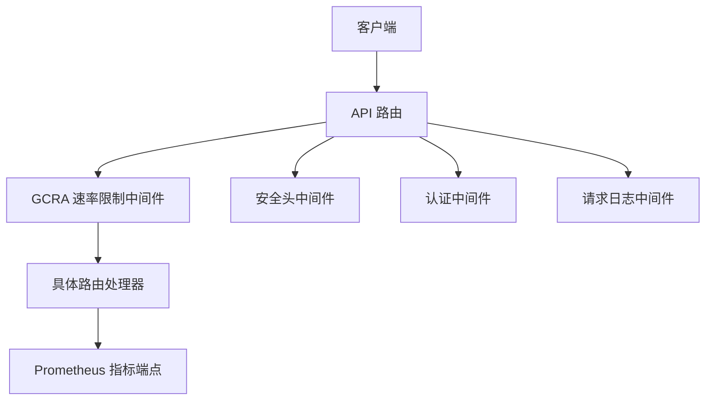
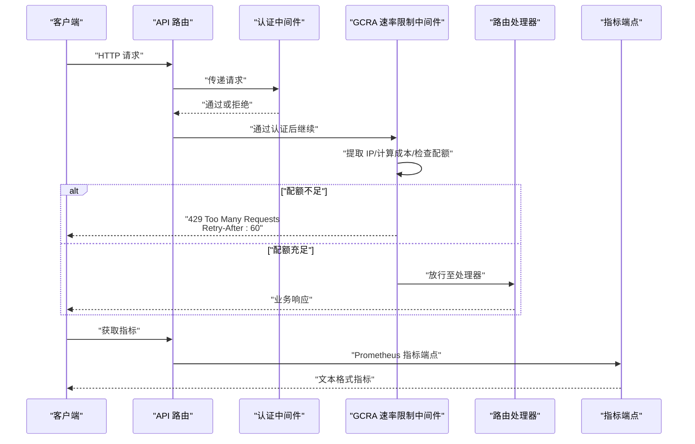
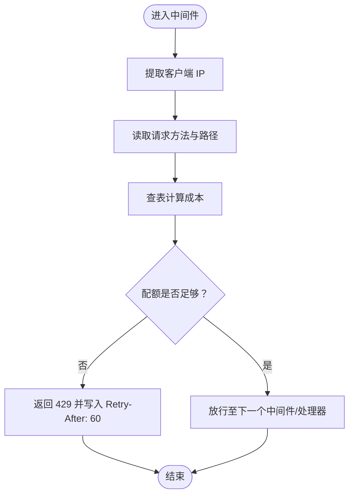
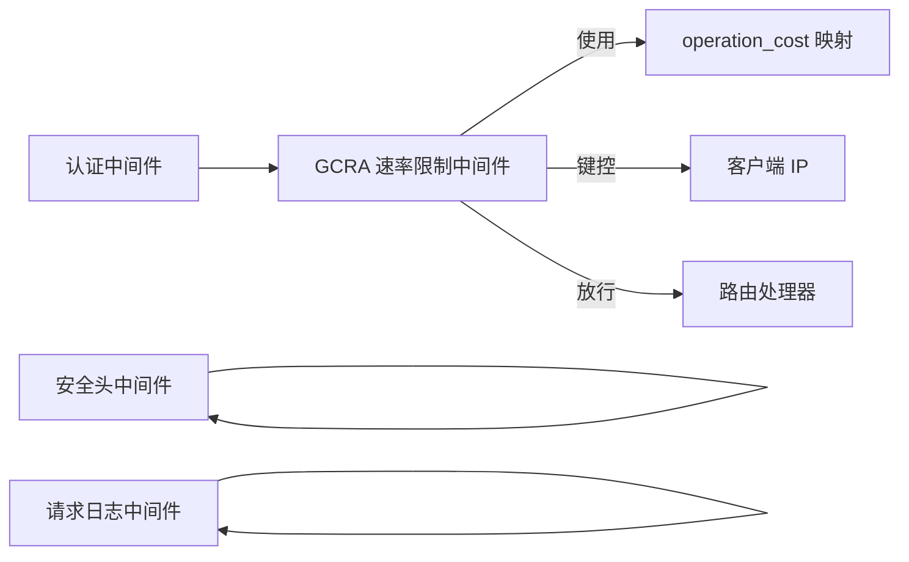

# 速率限制与节流

<cite>
**本文引用的文件**
- [rate_limiter.rs](file://crates/openfang-api/src/rate_limiter.rs)
- [middleware.rs](file://crates/openfang-api/src/middleware.rs)
- [server.rs](file://crates/openfang-api/src/server.rs)
- [routes.rs](file://crates/openfang-api/src/routes.rs)
- [openai_compat.rs](file://crates/openfang-api/src/openai_compat.rs)
- [load_test.rs](file://crates/openfang-api/tests/load_test.rs)
- [openfang.toml.example](file://openfang.toml.example)
- [config.rs](file://crates/openfang-types/src/config.rs)
</cite>

## 目录
1. [简介](#简介)
2. [项目结构](#项目结构)
3. [核心组件](#核心组件)
4. [架构总览](#架构总览)
5. [详细组件分析](#详细组件分析)
6. [依赖关系分析](#依赖关系分析)
7. [性能考量](#性能考量)
8. [故障排查指南](#故障排查指南)
9. [结论](#结论)
10. [附录](#附录)

## 简介
本技术文档聚焦于 OpenFang API 的速率限制与节流机制，系统阐述以下内容：
- 速率限制算法与配额模型：基于 GCRA（通用信元速率算法）的令牌桶扩展，按操作成本计费。
- 配额管理与突发处理：每 IP 每分钟 500 令牌的全局配额，结合路径与方法的差异化成本。
- 端点限流配置：对不同端点采用差异化成本，覆盖健康检查、列表查询、消息发送、工作流运行等。
- 触发条件与降级：当令牌不足时返回 429，并在响应头中提供 retry-after；同时记录警告日志。
- 监控与告警：Prometheus 指标端点输出运行时关键指标，可用于构建告警规则。
- 分布式与扩展性：当前实现为单进程内存态，未内置跨节点共享状态；可结合外部存储或上游网关实现分布式限流。
- 客户端重试与错误处理：建议遵循 Retry-After 头进行指数退避重试，避免雪崩。

## 项目结构
OpenFang API 在中间件层集成速率限制，围绕 GCRA 算法实现按请求成本的配额扣减。核心文件与职责如下：
- 速率限制器：定义成本映射、创建限流器实例、中间件执行逻辑。
- 中间件：统一注入请求 ID、日志、安全头、认证与速率限制。
- 服务器：组装路由与中间件链，挂载限流中间件。
- 路由与兼容接口：提供大量端点，其中部分端点在业务层也存在配额/预算控制。

图表来源
- [server.rs:119-120](file://crates/openfang-api/src/server.rs#L119-L120)
- [server.rs:700-705](file://crates/openfang-api/src/server.rs#L700-L705)
- [rate_limiter.rs:51-79](file://crates/openfang-api/src/rate_limiter.rs#L51-L79)

章节来源
- [server.rs:119-120](file://crates/openfang-api/src/server.rs#L119-L120)
- [server.rs:700-705](file://crates/openfang-api/src/server.rs#L700-L705)

## 核心组件
- GCRA 速率限制中间件
  - 基于 IP 地址键控的限流器，每分钟 500 令牌配额。
  - 通过请求方法与路径计算操作成本，成本越高消耗越多令牌。
  - 当配额不足时返回 429，并设置 Retry-After 头。
- 成本映射表
  - 对常见端点设定差异化成本，如健康检查与工具列表为 1 令牌，消息发送为 30 令牌，工作流运行为 100 令牌，代理创建为 50 令牌等。
- 中间件链
  - 认证中间件：支持 Bearer 与 X-API-Key，以及会话 Cookie 验证。
  - 安全头中间件：统一设置安全相关响应头。
  - 请求日志中间件：记录请求 ID、方法、路径、状态码与耗时。
- 指标与监控
  - Prometheus 指标端点输出运行时关键指标，便于告警与可视化。

章节来源
- [rate_limiter.rs:14-35](file://crates/openfang-api/src/rate_limiter.rs#L14-L35)
- [rate_limiter.rs:40-44](file://crates/openfang-api/src/rate_limiter.rs#L40-L44)
- [rate_limiter.rs:51-79](file://crates/openfang-api/src/rate_limiter.rs#L51-L79)
- [middleware.rs:18-44](file://crates/openfang-api/src/middleware.rs#L18-L44)
- [middleware.rs:232-259](file://crates/openfang-api/src/middleware.rs#L232-L259)
- [routes.rs:3353-3424](file://crates/openfang-api/src/routes.rs#L3353-L3424)

## 架构总览
下图展示从客户端到处理器的请求流经中间件链，其中速率限制中间件在认证之后、处理器之前执行。

图表来源
- [server.rs:696-709](file://crates/openfang-api/src/server.rs#L696-L709)
- [middleware.rs:62-215](file://crates/openfang-api/src/middleware.rs#L62-L215)
- [rate_limiter.rs:51-79](file://crates/openfang-api/src/rate_limiter.rs#L51-L79)
- [routes.rs:3353-3424](file://crates/openfang-api/src/routes.rs#L3353-L3424)

## 详细组件分析

### 速率限制算法与配额模型
- 算法基础
  - 使用 GCRA（通用信元速率算法），以“令牌”为单位衡量可用额度，按请求成本扣减。
  - 支持突发：只要在配额周期内累计未超过上限，即可瞬时消耗更多令牌。
- 配额参数
  - 全局配额：每 IP 每分钟 500 令牌。
  - 键控方式：以客户端真实 IP 作为键，确保同一来源的请求被统一约束。
- 成本计算
  - 不同端点与方法组合对应不同成本，例如：
    - GET /api/health、/api/status、/api/version、/api/tools：1 令牌
    - GET /api/agents、/api/skills、/api/peers、/api/config：2 令牌
    - GET /api/usage：3 令牌
    - GET /api/audit/*：5 令牌
    - GET /api/marketplace/*：10 令牌
    - POST /api/agents：50 令牌
    - POST .../message：30 令牌
    - POST .../run：100 令牌
    - POST /api/skills/install：50 令牌
    - POST /api/skills/uninstall：10 令牌
    - PUT .../update：10 令牌
    - 其他默认：5 令牌
- 执行流程
  - 提取连接信息中的客户端 IP（回退为本地地址）。
  - 解析请求方法与路径，查表得到成本。
  - 使用限流器检查“n 令牌”是否允许，若不允许则直接返回 429 并记录警告日志，否则放行。

图表来源
- [rate_limiter.rs:51-79](file://crates/openfang-api/src/rate_limiter.rs#L51-L79)
- [rate_limiter.rs:14-35](file://crates/openfang-api/src/rate_limiter.rs#L14-L35)

章节来源
- [rate_limiter.rs:14-35](file://crates/openfang-api/src/rate_limiter.rs#L14-L35)
- [rate_limiter.rs:40-44](file://crates/openfang-api/src/rate_limiter.rs#L40-L44)
- [rate_limiter.rs:51-79](file://crates/openfang-api/src/rate_limiter.rs#L51-L79)

### 端点限流配置与成本映射
- 健康与只读端点
  - GET /api/health、/api/status、/api/version、/api/tools：1 令牌
  - GET /api/agents、/api/skills、/api/peers、/api/config：2 令牌
  - GET /api/usage：3 令牌
  - GET /api/audit/*：5 令牌
  - GET /api/marketplace/*：10 令牌
- 写入与高成本端点
  - POST /api/agents：50 令牌
  - POST .../message：30 令牌
  - POST .../run：100 令牌
  - POST /api/skills/install：50 令牌
  - POST /api/skills/uninstall：10 令牌
  - PUT .../update：10 令牌
- 默认成本
  - 其他未显式列出的方法/路径：5 令牌
- 特殊说明
  - 路径前缀匹配用于审计与市场搜索等场景。
  - OpenAI 兼容接口 /v1/chat/completions 与 /v1/models 未在速率限制中间件中单独标注成本，但其底层调用仍受上述全局配额约束。

章节来源
- [rate_limiter.rs:14-35](file://crates/openfang-api/src/rate_limiter.rs#L14-L35)
- [openai_compat.rs:245-367](file://crates/openfang-api/src/openai_compat.rs#L245-L367)

### 触发条件与降级处理
- 触发条件
  - 当请求的成本大于剩余令牌预算时触发限流。
- 降级处理
  - 返回 429 状态码，响应体包含错误信息。
  - 设置响应头 Retry-After: 60，提示客户端等待 60 秒后重试。
  - 记录警告日志，包含 IP、成本与路径信息，便于审计与定位。
- 与业务层配额的关系
  - 业务层还存在按代理维度的预算与配额控制（见“预算与配额”小节），可能与速率限制共同作用，出现 429 或业务层拒绝的情况。

章节来源
- [rate_limiter.rs:66-76](file://crates/openfang-api/src/rate_limiter.rs#L66-L76)

### 监控指标与告警建议
- 指标端点
  - /api/metrics 输出 Prometheus 文本格式指标，包括：
    - 运行时：openfang_uptime_seconds
    - 代理：openfang_agents_active、openfang_agents_total
    - 使用量：openfang_tokens_total（按代理）、openfang_tool_calls_total（按代理）
    - 健康：openfang_panics_total、openfang_restarts_total
    - 版本：openfang_info
- 告警建议
  - 429 比例阈值：当 429/总请求数的比例超过阈值（如 1%）持续一段时间，触发告警。
  - 服务可用性：结合业务层错误（如 TOO_MANY_REQUESTS）与下游依赖失败率。
  - 代理负载：关注 openfang_tokens_total 与 openfang_tool_calls_total 的异常波动。
- 性能观测
  - 结合请求日志中间件记录的 latency_ms，观察在高并发下的延迟变化。

章节来源
- [routes.rs:3353-3424](file://crates/openfang-api/src/routes.rs#L3353-L3424)
- [middleware.rs:18-44](file://crates/openfang-api/src/middleware.rs#L18-L44)

### 预算与配额（业务层）
- 全局预算
  - 通过 /api/budget 更新最大小时/天/月美元限额与提醒阈值，该配置为内存态更新，不持久化到配置文件。
- 代理预算
  - /api/budget/agents/{id} 查询代理的小时/日/月花费与限额占比。
- 与速率限制的关系
  - 速率限制关注“请求频率”，预算控制关注“成本/费用”。两者叠加可实现更精细的资源保护。
- 配置项参考
  - 预算字段：max_hourly_usd、max_daily_usd、max_monthly_usd、alert_threshold、default_max_llm_tokens_per_hour。

章节来源
- [routes.rs:5267-5310](file://crates/openfang-api/src/routes.rs#L5267-L5310)
- [routes.rs:5312-5359](file://crates/openfang-api/src/routes.rs#L5312-L5359)
- [config.rs:391-403](file://crates/openfang-types/src/config.rs#L391-L403)

### 分布式限流与扩展性
- 当前实现
  - 限流器为进程内内存态，键空间为 IP→令牌桶，不跨进程/节点共享。
- 可选方案
  - 外部存储：将令牌桶状态持久化到 Redis/DynamoDB 等，实现跨实例共享。
  - 上游网关：在反向代理层（如 Nginx/Traefik/Envoy）实现基于 IP 的限流，再转发到 OpenFang。
  - 多级限流：网关层做粗粒度限流，应用层做细粒度限流（按端点成本）。
- 注意事项
  - 跨实例一致性与性能权衡。
  - 限流键的选择需考虑代理/负载均衡后的真实来源 IP。

[本小节为概念性说明，不直接分析具体文件]

### 客户端重试策略与错误处理最佳实践
- 重试策略
  - 遵循 Retry-After 头进行指数退避重试（如 1s、2s、4s、8s），上限不超过 60s。
  - 对幂等请求（GET/HEAD）可自动重试；对非幂等请求（POST/PUT/DELETE）应谨慎重试并确保去重。
- 错误处理
  - 429：记录原因、重试间隔与重试次数，必要时降级为更低成本的端点。
  - 401/403：检查鉴权头或会话有效性，避免无效重试。
  - 5xx：区分瞬时错误与持久错误，配合熔断与快速失败。
- 日志与追踪
  - 为每次重试生成唯一请求 ID，便于跨服务关联排查。

[本小节为通用实践建议，不直接分析具体文件]

## 依赖关系分析
- 速率限制中间件依赖
  - 限流器类型：KeyedRateLimiter（按 IP 键控）。
  - 成本映射：operation_cost() 将方法+路径映射为 NonZeroU32 成本。
  - IP 提取：从 ConnectInfo 中解析 SocketAddr 的 IP。
- 中间件链顺序
  - 认证中间件 → 速率限制中间件 → 安全头中间件 → 请求日志中间件 → 路由处理器。
- 与路由的关系
  - 速率限制对所有路由生效，OpenAI 兼容接口亦受此约束。

图表来源
- [rate_limiter.rs:14-35](file://crates/openfang-api/src/rate_limiter.rs#L14-L35)
- [rate_limiter.rs:51-79](file://crates/openfang-api/src/rate_limiter.rs#L51-L79)
- [server.rs:696-709](file://crates/openfang-api/src/server.rs#L696-L709)

章节来源
- [rate_limiter.rs:37-44](file://crates/openfang-api/src/rate_limiter.rs#L37-L44)
- [rate_limiter.rs:51-79](file://crates/openfang-api/src/rate_limiter.rs#L51-L79)
- [server.rs:696-709](file://crates/openfang-api/src/server.rs#L696-L709)

## 性能考量
- 限流器实现
  - 使用带键控的状态存储（DashMapStateStore），并发安全且开销可控。
- 成本计算
  - 查表映射为常数时间，整体开销极低。
- 中间件链
  - 限流中间件位于认证之后，避免对未认证请求的无谓计算。
- 测试验证
  - 负载测试覆盖了健康、状态、工具、模型、指标、配置、用量等多个端点的并发访问，验证了在高并发下的稳定性与延迟表现。

章节来源
- [rate_limiter.rs:37-44](file://crates/openfang-api/src/rate_limiter.rs#L37-L44)
- [load_test.rs:204-265](file://crates/openfang-api/tests/load_test.rs#L204-L265)

## 故障排查指南
- 429 Too Many Requests
  - 现象：客户端收到 429，响应头 Retry-After: 60。
  - 排查：检查日志中关于 GCRA 速率限制的警告条目，确认触发的路径与成本。
  - 处理：客户端按 Retry-After 退避重试；若持续 429，降低请求频率或合并请求。
- 配额耗尽
  - 现象：短时间内大量写入端点导致成本快速消耗。
  - 排查：结合 /api/metrics 与业务层 /api/budget 指标，判断是速率限制还是预算限制。
- 认证绕过
  - 现象：未设置 api_key 时，认证中间件跳过校验，可能放大限流压力。
  - 处理：在生产环境设置 api_key，启用认证中间件。
- 指标缺失
  - 现象：/api/metrics 返回空或缺少某些指标。
  - 排查：确认指标端点已注册、内核状态正常、调度器有使用数据。

章节来源
- [rate_limiter.rs:66-76](file://crates/openfang-api/src/rate_limiter.rs#L66-L76)
- [middleware.rs:62-215](file://crates/openfang-api/src/middleware.rs#L62-L215)
- [routes.rs:3353-3424](file://crates/openfang-api/src/routes.rs#L3353-L3424)

## 结论
OpenFang API 的速率限制采用轻量高效的 GCRA 算法，以 IP 为键控维度，按端点与方法差异化的成本进行配额扣减。该机制与认证、安全头、日志中间件协同工作，形成完整的请求治理链路。结合 Prometheus 指标与业务层预算控制，可实现对请求频率与成本的双重保护。对于分布式部署，建议引入外部存储或上游网关以实现跨实例共享限流状态。客户端应遵循 Retry-After 头进行指数退避重试，避免雪崩效应。

[本节为总结性内容，不直接分析具体文件]

## 附录

### 配置示例与建议
- 启用 API 鉴权
  - 在配置文件中设置 api_key，启用 Bearer 认证，提升安全性。
- 调整全局配额
  - 若业务峰值较高，可在认证通过后适当提高每分钟令牌数（需评估下游成本与稳定性）。
- 监控与告警
  - 基于 /api/metrics 构建告警规则，关注 429 比例、代理活跃数、token 使用量与重启次数。

章节来源
- [openfang.toml.example:4-6](file://openfang.toml.example#L4-L6)
- [routes.rs:3353-3424](file://crates/openfang-api/src/routes.rs#L3353-L3424)