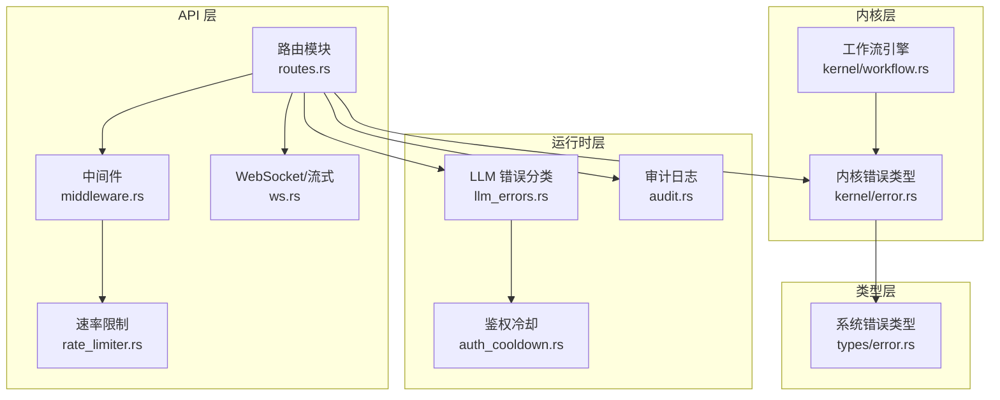
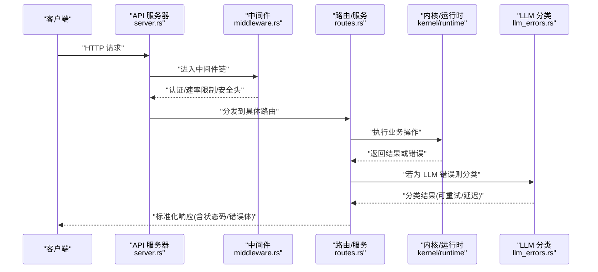
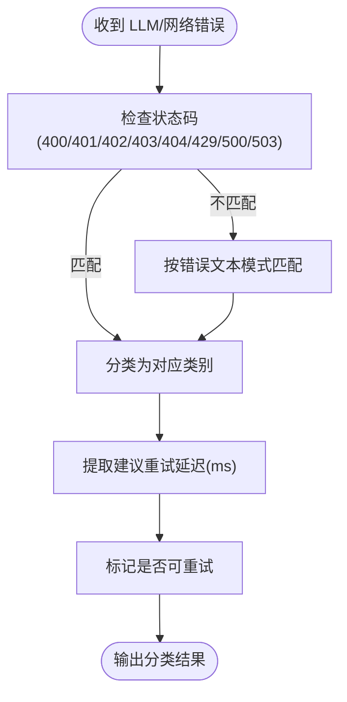
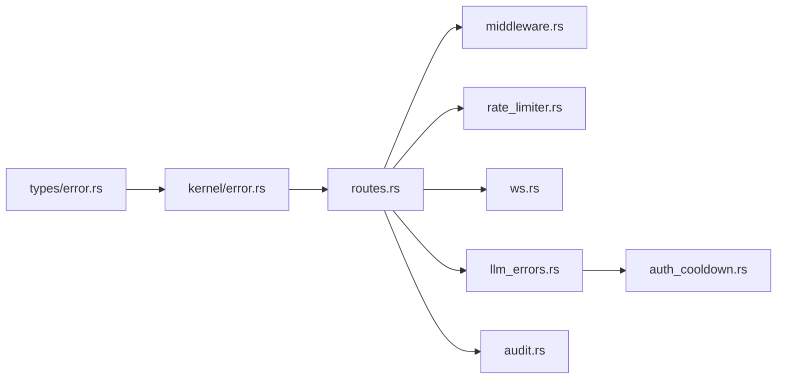

# 错误处理与响应码

<cite>
**本文引用的文件**
- [crates/openfang-api/src/lib.rs](file://crates/openfang-api/src/lib.rs)
- [crates/openfang-api/src/types.rs](file://crates/openfang-api/src/types.rs)
- [crates/openfang-api/src/middleware.rs](file://crates/openfang-api/src/middleware.rs)
- [crates/openfang-api/src/server.rs](file://crates/openfang-api/src/server.rs)
- [crates/openfang-api/src/routes.rs](file://crates/openfang-api/src/routes.rs)
- [crates/openfang-api/src/ws.rs](file://crates/openfang-api/src/ws.rs)
- [crates/openfang-api/src/rate_limiter.rs](file://crates/openfang-api/src/rate_limiter.rs)
- [crates/openfang-api/tests/api_integration_test.rs](file://crates/openfang-api/tests/api_integration_test.rs)
- [crates/openfang-kernel/src/error.rs](file://crates/openfang-kernel/src/error.rs)
- [crates/openfang-kernel/src/workflow.rs](file://crates/openfang-kernel/src/workflow.rs)
- [crates/openfang-types/src/error.rs](file://crates/openfang-types/src/error.rs)
- [crates/openfang-runtime/src/llm_errors.rs](file://crates/openfang-runtime/src/llm_errors.rs)
- [crates/openfang-runtime/src/auth_cooldown.rs](file://crates/openfang-runtime/src/auth_cooldown.rs)
- [crates/openfang-runtime/src/audit.rs](file://crates/openfang-runtime/src/audit.rs)
</cite>

## 目录
1. [简介](#简介)
2. [项目结构](#项目结构)
3. [核心组件](#核心组件)
4. [架构总览](#架构总览)
5. [详细组件分析](#详细组件分析)
6. [依赖关系分析](#依赖关系分析)
7. [性能考量](#性能考量)
8. [故障排查指南](#故障排查指南)
9. [结论](#结论)
10. [附录](#附录)

## 简介
本文件系统化梳理 OpenFang API 的错误处理与响应码体系，覆盖 HTTP 状态码使用规范、错误分类与传播路径、重试与降级策略、日志与审计追踪、监控指标建议以及客户端最佳实践。目标是帮助开发者与运维人员快速定位问题、制定恢复策略，并在生产环境中稳定运行。

## 项目结构
OpenFang API 的错误处理涉及多层协作：
- 路由层：根据业务逻辑返回标准 HTTP 状态码与统一错误体
- 中间件层：请求日志、认证鉴权、速率限制、安全头注入
- 运行时层：LLM 错误分类、重试延迟提取、鉴权冷却
- 内核层：内核错误类型与工作流错误传播
- 类型层：统一的错误类型定义与结果别名

图示来源
- [crates/openfang-api/src/routes.rs](file://crates/openfang-api/src/routes.rs)
- [crates/openfang-api/src/middleware.rs](file://crates/openfang-api/src/middleware.rs)
- [crates/openfang-api/src/rate_limiter.rs](file://crates/openfang-api/src/rate_limiter.rs)
- [crates/openfang-api/src/ws.rs](file://crates/openfang-api/src/ws.rs)
- [crates/openfang-runtime/src/llm_errors.rs](file://crates/openfang-runtime/src/llm_errors.rs)
- [crates/openfang-runtime/src/auth_cooldown.rs](file://crates/openfang-runtime/src/auth_cooldown.rs)
- [crates/openfang-runtime/src/audit.rs](file://crates/openfang-runtime/src/audit.rs)
- [crates/openfang-kernel/src/error.rs](file://crates/openfang-kernel/src/error.rs)
- [crates/openfang-kernel/src/workflow.rs](file://crates/openfang-kernel/src/workflow.rs)
- [crates/openfang-types/src/error.rs](file://crates/openfang-types/src/error.rs)

章节来源
- [crates/openfang-api/src/lib.rs](file://crates/openfang-api/src/lib.rs)
- [crates/openfang-api/src/server.rs](file://crates/openfang-api/src/server.rs)

## 核心组件
- 统一错误类型：系统级错误类型集中于类型层，便于跨模块传播与处理
- 路由错误响应：路由层对业务异常进行状态码映射与标准化错误体
- 中间件错误处理：认证失败、速率超限等通过中间件直接返回标准错误
- LLM 错误分类：将底层 LLM 返回或网络错误归类并给出可重试性与建议延迟
- 审计与日志：统一的审计链与请求日志，便于问题回溯与监控

章节来源
- [crates/openfang-types/src/error.rs](file://crates/openfang-types/src/error.rs)
- [crates/openfang-kernel/src/error.rs](file://crates/openfang-kernel/src/error.rs)
- [crates/openfang-api/src/routes.rs](file://crates/openfang-api/src/routes.rs)
- [crates/openfang-api/src/middleware.rs](file://crates/openfang-api/src/middleware.rs)
- [crates/openfang-runtime/src/llm_errors.rs](file://crates/openfang-runtime/src/llm_errors.rs)

## 架构总览
下图展示从客户端到内核的错误传播路径与关键处理点：

图示来源
- [crates/openfang-api/src/server.rs](file://crates/openfang-api/src/server.rs)
- [crates/openfang-api/src/middleware.rs](file://crates/openfang-api/src/middleware.rs)
- [crates/openfang-api/src/routes.rs](file://crates/openfang-api/src/routes.rs)
- [crates/openfang-runtime/src/llm_errors.rs](file://crates/openfang-runtime/src/llm_errors.rs)

## 详细组件分析

### HTTP 状态码与错误体规范
- 成功响应：200 OK；创建资源：201 Created；无内容：204 No Content；已删除：200 同时返回状态字段
- 客户端错误：
  - 400 Bad Request：参数无效（如 agent ID 格式不正确）、请求体过大、模板/清单无效
  - 401 Unauthorized：缺少或无效的 API Key
  - 403 Forbidden：签名验证失败、权限不足
  - 404 Not Found：资源不存在（如 agent 不存在）
  - 413 Payload Too Large：请求体超过限制（如消息/清单大小）
  - 429 Too Many Requests：速率限制触发
- 服务端错误：500 Internal Server Error（通用内部错误）

错误体格式统一为 JSON 对象，包含键值对：
- error：人类可读的错误描述
- 可选：更详细的上下文（如令牌用量、迭代次数等）

章节来源
- [crates/openfang-api/src/routes.rs](file://crates/openfang-api/src/routes.rs)
- [crates/openfang-api/src/middleware.rs](file://crates/openfang-api/src/middleware.rs)
- [crates/openfang-api/src/rate_limiter.rs](file://crates/openfang-api/src/rate_limiter.rs)

### 错误分类与传播机制
- 系统错误类型：集中于类型层，内核错误包装系统错误，便于上层捕获与转换
- 工作流错误：工作流引擎在错误模式为 skip 或 retry 时，按配置跳过或重试步骤
- LLM 错误分类：优先级从高到低依次为上下文溢出、计费错误、认证错误、速率限制、模型未找到、格式错误、过载/5xx、超时/网络错误；支持从错误字符串中提取 HTTP 状态码与重试延迟

图示来源
- [crates/openfang-runtime/src/llm_errors.rs](file://crates/openfang-runtime/src/llm_errors.rs)
- [crates/openfang-api/src/ws.rs](file://crates/openfang-api/src/ws.rs)

章节来源
- [crates/openfang-types/src/error.rs](file://crates/openfang-types/src/error.rs)
- [crates/openfang-kernel/src/error.rs](file://crates/openfang-kernel/src/error.rs)
- [crates/openfang-kernel/src/workflow.rs](file://crates/openfang-kernel/src/workflow.rs)
- [crates/openfang-runtime/src/llm_errors.rs](file://crates/openfang-runtime/src/llm_errors.rs)

### 错误恢复策略
- 可重试错误：速率限制、过载、超时等，建议指数退避重试并遵循建议延迟
- 不可重试错误：认证失败、格式错误、模型未找到等，需修正输入或配置后重试
- 鉴权冷却：鉴权失败时按配置进行冷却，避免频繁重试导致二次封禁
- 工作流容错：根据错误模式选择跳过或重试单步，确保整体流程稳健

章节来源
- [crates/openfang-runtime/src/llm_errors.rs](file://crates/openfang-runtime/src/llm_errors.rs)
- [crates/openfang-runtime/src/auth_cooldown.rs](file://crates/openfang-runtime/src/auth_cooldown.rs)
- [crates/openfang-kernel/src/workflow.rs](file://crates/openfang-kernel/src/workflow.rs)

### 常见错误场景与诊断
- 认证失败
  - 现象：401 未授权，提示缺少或无效 API Key
  - 排查：确认 Authorization 头或查询参数 token 是否正确；检查会话 Cookie 是否有效
  - 恢复：重新登录或更新密钥
- 速率限制
  - 现象：429 太多请求，响应头包含 retry-after
  - 排查：检查当前 IP 的配额与各端点成本
  - 恢复：等待冷却时间或降低调用频率
- 资源不存在
  - 现象：404 代理不存在或工作流/触发器不存在
  - 排查：确认 ID 格式与存在性
  - 恢复：使用正确的 ID 或先创建资源
- 请求体过大
  - 现象：413 清单或消息超过限制
  - 排查：检查消息长度与清单大小
  - 恢复：拆分请求或压缩数据
- LLM 错误
  - 现象：400/401/402/403/404/429/5xx
  - 排查：查看 LLM 返回的错误字符串与状态码；提取建议延迟
  - 恢复：按分类采取重试、更换模型或修正输入

章节来源
- [crates/openfang-api/src/middleware.rs](file://crates/openfang-api/src/middleware.rs)
- [crates/openfang-api/src/rate_limiter.rs](file://crates/openfang-api/src/rate_limiter.rs)
- [crates/openfang-api/src/routes.rs](file://crates/openfang-api/src/routes.rs)
- [crates/openfang-runtime/src/llm_errors.rs](file://crates/openfang-runtime/src/llm_errors.rs)

### 错误日志格式、审计与监控
- 请求日志：中间件统一注入 x-request-id，记录方法、路径、状态码与耗时
- 审计日志：记录操作序列、动作、详情、结果与哈希链，支持实时流式推送
- 监控指标：建议采集以下指标（基于现有实现扩展）：
  - 每端点的请求数、错误率、P50/P95 延迟
  - 4xx/5xx 分布与 top 常见错误原因
  - 速率限制触发次数与冷却时长
  - LLM 错误分类分布与重试成功率

章节来源
- [crates/openfang-api/src/middleware.rs](file://crates/openfang-api/src/middleware.rs)
- [crates/openfang-runtime/src/audit.rs](file://crates/openfang-runtime/src/audit.rs)
- [crates/openfang-api/src/routes.rs](file://crates/openfang-api/src/routes.rs)

### 客户端错误处理最佳实践
- 固定重试：对 429、503、超时等可重试错误采用指数退避，尊重建议延迟
- 幂等性：对可能幂等的写操作（如安装技能）允许自动重试
- 降级策略：当 LLM 不可用时，切换到本地模型或返回缓存结果
- 限流与退避：客户端侧也应遵守服务端配额，避免触发服务端限流
- 透明追踪：携带 x-request-id 以便服务端与客户端交叉定位问题

章节来源
- [crates/openfang-runtime/src/llm_errors.rs](file://crates/openfang-runtime/src/llm_errors.rs)
- [crates/openfang-api/src/middleware.rs](file://crates/openfang-api/src/middleware.rs)

### 错误国际化、调试信息与帮助文档
- 错误消息：优先使用统一的错误体，避免泄露敏感细节
- 调试信息：在开发环境可提供更详细的上下文（如令牌用量、迭代次数），但需受控
- 帮助文档：结合 API 参考与常见问题，提供错误码与解决方案的链接

章节来源
- [crates/openfang-api/src/types.rs](file://crates/openfang-api/src/types.rs)
- [crates/openfang-api/src/routes.rs](file://crates/openfang-api/src/routes.rs)

### 错误报告流程与社区支持
- 收集信息：请求 ID、状态码、错误体、时间戳、端点与方法
- 提交渠道：通过仓库 Issue 模板提交，附带最小可复现步骤与环境信息
- 社区支持：在讨论区或聊天频道寻求帮助，提供审计日志片段与请求日志

章节来源
- [crates/openfang-api/tests/api_integration_test.rs](file://crates/openfang-api/tests/api_integration_test.rs)
- [crates/openfang-runtime/src/audit.rs](file://crates/openfang-runtime/src/audit.rs)

## 依赖关系分析

图示来源
- [crates/openfang-types/src/error.rs](file://crates/openfang-types/src/error.rs)
- [crates/openfang-kernel/src/error.rs](file://crates/openfang-kernel/src/error.rs)
- [crates/openfang-api/src/routes.rs](file://crates/openfang-api/src/routes.rs)
- [crates/openfang-api/src/middleware.rs](file://crates/openfang-api/src/middleware.rs)
- [crates/openfang-api/src/rate_limiter.rs](file://crates/openfang-api/src/rate_limiter.rs)
- [crates/openfang-api/src/ws.rs](file://crates/openfang-api/src/ws.rs)
- [crates/openfang-runtime/src/llm_errors.rs](file://crates/openfang-runtime/src/llm_errors.rs)
- [crates/openfang-runtime/src/auth_cooldown.rs](file://crates/openfang-runtime/src/auth_cooldown.rs)
- [crates/openfang-runtime/src/audit.rs](file://crates/openfang-runtime/src/audit.rs)

章节来源
- [crates/openfang-api/src/server.rs](file://crates/openfang-api/src/server.rs)

## 性能考量
- 速率限制：基于 GCRA 的端点成本控制，避免热点端点被刷爆
- 日志与审计：请求日志与审计日志均为高频写入，建议异步落盘与限流
- 流式响应：SSE/WS 流式接口需注意背压与心跳保活
- LLM 错误分类：在高频调用场景下，建议缓存分类结果与延迟建议

章节来源
- [crates/openfang-api/src/rate_limiter.rs](file://crates/openfang-api/src/rate_limiter.rs)
- [crates/openfang-runtime/src/llm_errors.rs](file://crates/openfang-runtime/src/llm_errors.rs)
- [crates/openfang-api/src/routes.rs](file://crates/openfang-api/src/routes.rs)

## 故障排查指南
- 快速定位
  - 使用 x-request-id 在请求日志中检索该请求的完整生命周期
  - 通过审计日志流定位相关操作与结果
- 常见问题
  - 401：检查 API Key 与会话 Cookie
  - 429：检查客户端与服务端配额，遵循 retry-after
  - 400/413：检查请求体大小与格式
  - LLM 错误：根据分类结果决定重试或降级
- 验证与回归
  - 使用集成测试覆盖关键路径，确保错误码与错误体符合预期

章节来源
- [crates/openfang-api/tests/api_integration_test.rs](file://crates/openfang-api/tests/api_integration_test.rs)
- [crates/openfang-api/src/middleware.rs](file://crates/openfang-api/src/middleware.rs)
- [crates/openfang-runtime/src/audit.rs](file://crates/openfang-runtime/src/audit.rs)

## 结论
OpenFang API 的错误处理体系以统一的错误类型为基础，配合路由层的状态码映射、中间件的认证与限流、运行时的 LLM 错误分类与冷却机制，以及完善的审计与日志能力，形成了从错误发现到恢复的闭环。建议在生产中启用速率限制、严格区分可重试与不可重试错误、保留必要的审计与日志，并为客户端提供清晰的重试与降级策略。

## 附录
- 端点成本与速率限制
  - 健康检查与版本：低成本
  - 列表与查询：低至中等成本
  - 创建与消息：中高成本
  - 运行工作流：高成本
- 建议监控项
  - 每端点 QPS、错误率、P50/P95 延迟
  - 4xx/5xx 分布与 top 常见原因
  - 速率限制触发次数与冷却时长
  - LLM 错误分类分布与重试成功率

章节来源
- [crates/openfang-api/src/rate_limiter.rs](file://crates/openfang-api/src/rate_limiter.rs)
- [crates/openfang-api/src/routes.rs](file://crates/openfang-api/src/routes.rs)