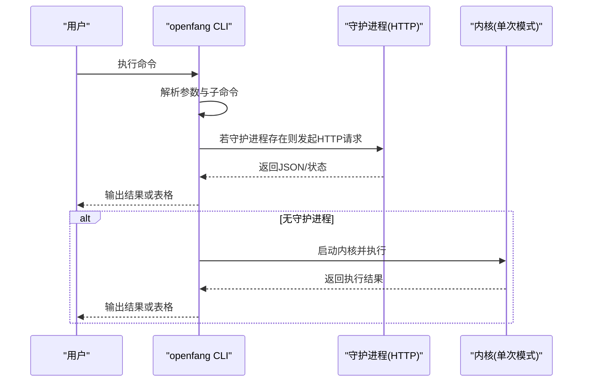
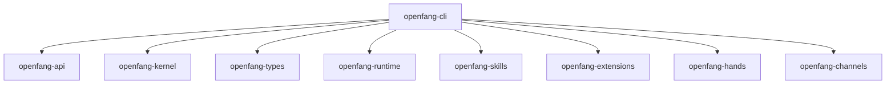

# CLI 命令参考

<cite>
**本文引用的文件**
- [main.rs](file://crates/openfang-cli/src/main.rs)
- [Cargo.toml](file://crates/openfang-cli/Cargo.toml)
- [Cargo.toml](file://Cargo.toml)
- [launcher.rs](file://crates/openfang-cli/src/launcher.rs)
- [dotenv.rs](file://crates/openfang-cli/src/dotenv.rs)
- [table.rs](file://crates/openfang-cli/src/table.rs)
- [dashboard.rs](file://crates/openfang-cli/src/tui/screens/dashboard.rs)
- [agents.rs](file://crates/openfang-cli/src/tui/screens/agents.rs)
- [workflows.rs](file://crates/openfang-cli/src/tui/screens/workflows.rs)
- [tui/mod.rs](file://crates/openfang-cli/src/tui/mod.rs)
</cite>

## 目录
1. [简介](#简介)
2. [项目结构](#项目结构)
3. [核心组件](#核心组件)
4. [架构总览](#架构总览)
5. [详细组件分析](#详细组件分析)
6. [依赖关系分析](#依赖关系分析)
7. [性能考量](#性能考量)
8. [故障排查指南](#故障排查指南)
9. [结论](#结论)
10. [附录](#附录)

## 简介
本文件为 OpenFang CLI 的命令参考文档，覆盖所有命令的语法、参数、选项与使用示例；详解全局选项（--config、--help、--version）与环境变量；深入说明各命令组功能（初始化、守护进程管理、智能体管理、工作流操作、触发器管理、技能管理、渠道配置等）；并包含命令行补全脚本生成、JSON 输出格式、错误处理与最佳实践，以及常见使用场景与自动化脚本示例。

## 项目结构
OpenFang CLI 位于 crates/openfang-cli，采用子命令模式组织命令，通过 Clap 定义命令树，并在无守护进程时以单次内核模式运行，在有守护进程时通过 HTTP 与后端交互。

```mermaid
graph TB
CLI["openfang CLI<br/>命令入口"] --> Parser["命令解析器<br/>Clap 子命令"]
Parser --> Init["init 初始化"]
Parser --> Start["start 启动守护进程"]
Parser --> Stop["stop 停止守护进程"]
Parser --> Agent["agent 智能体组"]
Parser --> Workflow["workflow 工作流组"]
Parser --> Trigger["trigger 触发器组"]
Parser --> Skill["skill 技能组"]
Parser --> Channel["channel 渠道组"]
Parser --> Hand["hand 手组"]
Parser --> Config["config 配置组"]
Parser --> Chat["chat 快速聊天"]
Parser --> Status["status 状态"]
Parser --> Doctor["doctor 健康检查"]
Parser --> Dashboard["dashboard 网页面板"]
Parser --> Completion["completion 补全脚本"]
Parser --> MCP["mcp MCP 服务"]
Parser --> Add["add 集成安装"]
Parser --> Remove["remove 集成移除"]
Parser --> Integrations["integrations 集成列表"]
Parser --> Vault["vault 凭证库"]
Parser --> New["new 模板脚手架"]
Parser --> Tui["tui 终端仪表盘"]
Parser --> Models["models 模型浏览"]
Parser --> Gateway["gateway 守护进程控制"]
Parser --> Approvals["approvals 审批"]
Parser --> Cron["cron 计划任务"]
Parser --> Sessions["sessions 会话"]
Parser --> Logs["logs 日志"]
Parser --> Health["health 健康快速检查"]
Parser --> Security["security 安全审计"]
Parser --> Memory["memory 内存键值"]
Parser --> Devices["devices 设备"]
Parser --> Qr["qr 设备配对码"]
Parser --> Webhooks["webhooks Webhook"]
Parser --> Onboard["onboard 引导向导"]
Parser --> Setup["setup 快速初始化"]
Parser --> Configure["configure 配置向导"]
Parser --> Message["message 单次消息"]
Parser --> System["system 系统信息"]
Parser --> Reset["reset 重置"]
Parser --> Uninstall["uninstall 卸载"]
```

图表来源
- [main.rs:88-294](file://crates/openfang-cli/src/main.rs#L88-L294)

章节来源
- [main.rs:88-294](file://crates/openfang-cli/src/main.rs#L88-L294)
- [Cargo.toml:1-33](file://crates/openfang-cli/Cargo.toml#L1-L33)

## 核心组件
- 命令定义与解析：基于 Clap 的子命令枚举，统一在主入口中声明。
- 全局选项：
  - --config：指定配置文件路径（优先级高于默认位置）。
  - --help：显示帮助信息。
  - --version：显示版本信息。
- 环境变量：
  - OPENFANG_HOME：用于定位配置与数据目录（影响 .env、secrets.env 与 config.toml 的默认位置）。
  - 多个大模型提供商 API Key 环境变量（如 ANTHROPIC_API_KEY、OPENAI_API_KEY 等）：用于自动检测与配置。
- JSON 输出：多数命令支持 --json 选项，便于脚本化与自动化集成。
- 补全脚本：completion 子命令可生成不同 Shell 的补全脚本。

章节来源
- [main.rs:99-105](file://crates/openfang-cli/src/main.rs#L99-L105)
- [main.rs:167-171](file://crates/openfang-cli/src/main.rs#L167-L171)
- [launcher.rs:18-29](file://crates/openfang-cli/src/launcher.rs#L18-L29)
- [dotenv.rs:9-15](file://crates/openfang-cli/src/dotenv.rs#L9-L15)

## 架构总览
CLI 在两种模式下运行：
- 守护进程模式：当守护进程运行时，CLI 通过 HTTP 与后端通信，调用相应 API。
- 单次内核模式：当没有守护进程时，CLI 启动内核并在本地执行命令，不持久化。

图表来源
- [main.rs:16-25](file://crates/openfang-cli/src/main.rs#L16-L25)
- [main.rs:18-19](file://crates/openfang-cli/src/main.rs#L18-L19)
- [launcher.rs:187-205](file://crates/openfang-cli/src/launcher.rs#L187-L205)

章节来源
- [main.rs:1-60](file://crates/openfang-cli/src/main.rs#L1-L60)
- [launcher.rs:175-269](file://crates/openfang-cli/src/launcher.rs#L175-L269)

## 详细组件分析

### 全局选项与环境变量
- --config：指定配置文件路径，优先于默认位置。
- --help：显示帮助与示例。
- --version：显示版本号。
- 环境变量：
  - OPENFANG_HOME：决定 ~/.openfang 目录位置。
  - 大模型提供商 API Key：用于自动检测与配置。
- JSON 输出：多数组命令支持 --json，便于脚本化。

章节来源
- [main.rs:99-105](file://crates/openfang-cli/src/main.rs#L99-L105)
- [main.rs:62-85](file://crates/openfang-cli/src/main.rs#L62-L85)
- [launcher.rs:18-29](file://crates/openfang-cli/src/launcher.rs#L18-L29)
- [dotenv.rs:9-15](file://crates/openfang-cli/src/dotenv.rs#L9-L15)

### 初始化命令：init
- 作用：初始化配置与数据目录，创建默认配置与 .env。
- 选项：
  - --quick：非交互式，适合 CI/脚本。
- 使用示例：
  - openfang init
  - openfang init --quick

章节来源
- [main.rs:109-114](file://crates/openfang-cli/src/main.rs#L109-L114)

### 守护进程管理：start、stop、status、doctor
- start
  - 作用：启动内核守护进程。
  - 选项：--yolo（自动批准工具调用）。
- stop
  - 作用：停止正在运行的守护进程。
- status
  - 作用：显示守护进程状态。
  - 选项：--json（输出 JSON）。
- doctor
  - 作用：运行健康检查。
  - 选项：--json（输出 JSON），--repair（尝试自动修复）。

章节来源
- [main.rs:115-122](file://crates/openfang-cli/src/main.rs#L115-L122)
- [main.rs:149-154](file://crates/openfang-cli/src/main.rs#L149-L154)
- [main.rs:155-163](file://crates/openfang-cli/src/main.rs#L155-L163)

### 智能体管理：agent new、spawn、list、chat、kill、set
- agent new
  - 作用：从模板创建新智能体，支持交互式选择或直接指定模板名。
  - 选项：template（可选，模板名）。
- agent spawn
  - 作用：从 TOML 清单文件启动智能体。
  - 参数：manifest（清单路径）。
- agent list
  - 作用：列出所有运行中的智能体。
  - 选项：--json（输出 JSON）。
- agent chat
  - 作用：与指定智能体进行交互式聊天。
  - 参数：agent_id（UUID）。
- agent kill
  - 作用：终止指定智能体。
  - 参数：agent_id（UUID）。
- agent set
  - 作用：设置智能体属性（例如模型）。
  - 参数：agent_id、field（字段名）、value（新值）。

章节来源
- [main.rs:458-494](file://crates/openfang-cli/src/main.rs#L458-L494)

### 工作流操作：workflow list、create、get、update、delete、run
- workflow list
  - 作用：列出所有已注册的工作流。
- workflow create
  - 作用：从 JSON 文件创建工作流。
  - 参数：file（JSON 路径）。
- workflow get
  - 作用：按 ID 获取工作流详情。
  - 参数：workflow_id（UUID）。
- workflow update
  - 作用：从 JSON 文件更新工作流。
  - 参数：workflow_id、file（JSON 路径）。
- workflow delete
  - 作用：按 ID 删除工作流。
  - 参数：workflow_id（UUID）。
- workflow run
  - 作用：按 ID 运行工作流。
  - 参数：workflow_id（UUID）、input（输入文本）。

章节来源
- [main.rs:497-529](file://crates/openfang-cli/src/main.rs#L497-L529)

### 触发器管理：trigger list、create、delete
- trigger list
  - 作用：列出所有触发器（可按 agent 过滤）。
  - 选项：--agent-id（可选，按智能体过滤）。
- trigger create
  - 作用：为智能体创建触发器。
  - 参数：agent_id（UUID）、pattern-json（触发模式 JSON）、prompt（提示词模板，默认值为“事件：{{event}}”）、max-fires（最大触发次数，默认 0 无限）。
- trigger delete
  - 作用：按 ID 删除触发器。
  - 参数：trigger_id（UUID）。

章节来源
- [main.rs:532-557](file://crates/openfang-cli/src/main.rs#L532-L557)

### 技能管理：skill list、install、remove、search、create
- skill list
  - 作用：列出已安装技能。
- skill install
  - 作用：从 FangHub 或本地目录安装技能。
  - 参数：source（名称/路径/URL）。
- skill remove
  - 作用：移除已安装技能。
  - 参数：name（技能名）。
- skill search
  - 作用：在 FangHub 中搜索技能。
  - 参数：query（搜索关键词）。
- skill create
  - 作用：创建新的技能模板。

章节来源
- [main.rs:321-341](file://crates/openfang-cli/src/main.rs#L321-L341)

### 渠道配置：channel list、setup、test、enable、disable
- channel list
  - 作用：列出已配置渠道及其状态。
- channel setup
  - 作用：交互式渠道设置向导。
  - 选项：channel（可选，渠道名；省略时显示选择器）。
- channel test
  - 作用：发送测试消息验证渠道。
  - 参数：channel（渠道名）。
- channel enable
  - 作用：启用渠道。
  - 参数：channel（渠道名）。
- channel disable
  - 作用：禁用渠道（保留配置）。
  - 参数：channel（渠道名）。

章节来源
- [main.rs:344-367](file://crates/openfang-cli/src/main.rs#L344-L367)

### 手（Hands）管理：hand list、active、install、activate、deactivate、info、check-deps、install-deps、pause、resume
- hand list
  - 作用：列出可用手。
- hand active
  - 作用：显示当前激活的手实例。
- hand install
  - 作用：从包含 HAND.toml 的本地目录安装手。
  - 参数：path（目录路径）。
- hand activate
  - 作用：按 ID 激活手。
  - 参数：id（手 ID）。
- hand deactivate
  - 作用：停用手实例。
  - 参数：id（手 ID）。
- hand info
  - 作用：显示手详情。
  - 参数：id（手 ID）。
- hand check-deps
  - 作用：检查手依赖。
  - 参数：id（手 ID）。
- hand install-deps
  - 作用：安装缺失依赖。
  - 参数：id（手 ID）。
- hand pause
  - 作用：暂停运行中的手实例。
  - 参数：id（实例 ID）。
- hand resume
  - 作用：恢复暂停的手实例。
  - 参数：id（实例 ID）。

章节来源
- [main.rs:370-415](file://crates/openfang-cli/src/main.rs#L370-L415)

### 配置管理：config show、edit、get、set、unset、set-key、delete-key、test-key
- config show
  - 作用：显示当前配置。
- config edit
  - 作用：在编辑器中打开配置文件。
- config get
  - 作用：按点分路径获取配置项。
  - 参数：key（路径）。
- config set
  - 作用：设置配置项（注意：会清除注释）。
  - 参数：key（路径）、value（新值）。
- config unset
  - 作用：删除配置项（注意：会清除注释）。
  - 参数：key（路径）。
- config set-key
  - 作用：保存提供商 API Key 到 ~/.openfang/.env（交互）。
  - 参数：provider（提供商名）。
- config delete-key
  - 作用：从 ~/.openfang/.env 删除提供商 Key。
  - 参数：provider（提供商名）。
- config test-key
  - 作用：测试提供商连通性。
  - 参数：provider（提供商名）。

章节来源
- [main.rs:418-455](file://crates/openfang-cli/src/main.rs#L418-L455)

### 模型浏览：models list、aliases、providers、set
- models list
  - 作用：列出可用模型（可按提供商过滤）。
  - 选项：--provider（可选，提供商名）、--json（输出 JSON）。
- models aliases
  - 作用：显示模型别名。
  - 选项：--json（输出 JSON）。
- models providers
  - 作用：列出已知 LLM 提供商及认证状态。
  - 选项：--json（输出 JSON）。
- models set
  - 作用：设置守护进程默认模型（可交互选择）。
  - 选项：model（可选，模型 ID 或别名）。

章节来源
- [main.rs:560-587](file://crates/openfang-cli/src/main.rs#L560-L587)

### 守护进程控制：gateway start、stop、status
- gateway start
  - 作用：启动内核守护进程。
- gateway stop
  - 作用：停止守护进程。
- gateway status
  - 作用：显示守护进程状态。
  - 选项：--json（输出 JSON）。

章节来源
- [main.rs:590-601](file://crates/openfang-cli/src/main.rs#L590-L601)

### 审批管理：approvals list、approve、reject
- approvals list
  - 作用：列出待审批请求。
  - 选项：--json（输出 JSON）。
- approvals approve
  - 作用：批准请求。
  - 参数：id（审批 ID）。
- approvals reject
  - 作用：拒绝请求。
  - 参数：id（审批 ID）。

章节来源
- [main.rs:604-621](file://crates/openfang-cli/src/main.rs#L604-L621)

### 计划任务：cron list、create、delete、enable、disable
- cron list
  - 作用：列出计划任务。
  - 选项：--json（输出 JSON）。
- cron create
  - 作用：创建计划任务。
  - 参数：agent（智能体名或 ID）、spec（Cron 表达式）、prompt（触发时发送的提示）。
  - 选项：--name（可选任务名）。
- cron delete
  - 作用：删除任务。
  - 参数：id（任务 ID）。
- cron enable
  - 作用：启用任务。
  - 参数：id（任务 ID）。
- cron disable
  - 作用：禁用任务。
  - 参数：id（任务 ID）。

章节来源
- [main.rs:624-658](file://crates/openfang-cli/src/main.rs#L624-L658)

### 会话与日志：sessions、logs
- sessions
  - 作用：列出对话会话。
  - 选项：agent（可选，按智能体过滤）、--json（输出 JSON）。
- logs
  - 作用：查看日志文件。
  - 选项：--lines（默认 50）、--follow（实时跟踪）。

章节来源
- [main.rs:216-231](file://crates/openfang-cli/src/main.rs#L216-L231)

### 健康检查：health
- health
  - 作用：快速健康检查。
  - 选项：--json（输出 JSON）。

章节来源
- [main.rs:233-237](file://crates/openfang-cli/src/main.rs#L233-L237)

### 安全审计：security status、audit、verify
- security status
  - 作用：显示安全状态摘要。
  - 选项：--json（输出 JSON）。
- security audit
  - 作用：显示最近审计条目。
  - 选项：--limit（默认 20）、--json（输出 JSON）。
- security verify
  - 作用：验证审计链完整性（Merkle 链）。

章节来源
- [main.rs:661-679](file://crates/openfang-cli/src/main.rs#L661-L679)

### 智能体内存：memory list、get、set、delete
- memory list
  - 作用：列出智能体的 KV 对。
  - 选项：agent（智能体名或 ID）、--json（输出 JSON）。
- memory get
  - 作用：获取特定 KV 值。
  - 选项：agent、key、--json（输出 JSON）。
- memory set
  - 作用：设置 KV 值。
  - 选项：agent、key、value。
- memory delete
  - 作用：删除 KV 对。
  - 选项：agent、key。

章节来源
- [main.rs:682-717](file://crates/openfang-cli/src/main.rs#L682-L717)

### 设备管理：devices list、pair、remove
- devices list
  - 作用：列出已配对设备。
  - 选项：--json（输出 JSON）。
- devices pair
  - 作用：开始新的设备配对流程。
- devices remove
  - 作用：移除已配对设备。
  - 参数：id（设备 ID）。

章节来源
- [main.rs:720-734](file://crates/openfang-cli/src/main.rs#L720-L734)

### Webhook：webhooks list、create、delete、test
- webhooks list
  - 作用：列出已配置 Webhook。
  - 选项：--json（输出 JSON）。
- webhooks create
  - 作用：创建 Webhook 触发器。
  - 参数：agent（智能体名或 ID）、url（回调 URL）。
- webhooks delete
  - 作用：删除 Webhook。
  - 参数：id（Webhook ID）。
- webhooks test
  - 作用：向 Webhook 发送测试负载。
  - 参数：id（Webhook ID）。

章节来源
- [main.rs:737-761](file://crates/openfang-cli/src/main.rs#L737-L761)

### 系统信息：system info、version
- system info
  - 作用：显示系统信息。
  - 选项：--json（输出 JSON）。
- system version
  - 作用：显示版本信息。
  - 选项：--json（输出 JSON）。

章节来源
- [main.rs:764-777](file://crates/openfang-cli/src/main.rs#L764-L777)

### 其他常用命令
- chat
  - 作用：与默认智能体快速聊天。
  - 选项：agent（可选，智能体名或 ID）。
- dashboard
  - 作用：在默认浏览器打开网页面板。
- completion
  - 作用：生成 Shell 补全脚本。
  - 参数：shell（Shell 类型）。
- mcp
  - 作用：通过标准输入输出启动 MCP 服务器。
- add/remove/integrations
  - 作用：一键安装/移除/搜索集成。
- vault
  - 作用：凭证库管理（init、set、list、remove）。
- new
  - 作用：脚手架新技能或集成模板。
- tui
  - 作用：启动交互式终端仪表盘。
- qr
  - 作用：生成设备配对二维码。
- onboard/setup/configure
  - 作用：引导向导、快速初始化、配置向导。
- message
  - 作用：向智能体发送一次性消息。
  - 选项：agent、text、--json（输出 JSON）。
- reset/uninstall
  - 作用：重置本地配置与状态、完全卸载。
  - 选项：reset 支持 --confirm；uninstall 支持 --confirm/--yes 与 --keep-config。

章节来源
- [main.rs:145-148](file://crates/openfang-cli/src/main.rs#L145-L148)
- [main.rs:164-166](file://crates/openfang-cli/src/main.rs#L164-L166)
- [main.rs:167-171](file://crates/openfang-cli/src/main.rs#L167-L171)
- [main.rs:172-173](file://crates/openfang-cli/src/main.rs#L172-L173)
- [main.rs:175-191](file://crates/openfang-cli/src/main.rs#L175-L191)
- [main.rs:193-194](file://crates/openfang-cli/src/main.rs#L193-L194)
- [main.rs:196-200](file://crates/openfang-cli/src/main.rs#L196-L200)
- [main.rs:202-202](file://crates/openfang-cli/src/main.rs#L202-L202)
- [main.rs:248-248](file://crates/openfang-cli/src/main.rs#L248-L248)
- [main.rs:253-266](file://crates/openfang-cli/src/main.rs#L253-L266)
- [main.rs:265-266](file://crates/openfang-cli/src/main.rs#L265-L266)
- [main.rs:267-275](file://crates/openfang-cli/src/main.rs#L267-L275)
- [main.rs:277-278](file://crates/openfang-cli/src/main.rs#L277-L278)
- [main.rs:280-293](file://crates/openfang-cli/src/main.rs#L280-L293)

### 命令行补全脚本生成
- completion 子命令支持生成不同 Shell 的补全脚本，参数为 shell（如 bash、zsh、fish 等）。

章节来源
- [main.rs:167-171](file://crates/openfang-cli/src/main.rs#L167-L171)

### JSON 输出格式
- 多数命令支持 --json 选项，输出结构化 JSON，便于脚本化与自动化集成。

章节来源
- [main.rs:152-153](file://crates/openfang-cli/src/main.rs#L152-L153)
- [main.rs:158-159](file://crates/openfang-cli/src/main.rs#L158-L159)
- [main.rs:220-221](file://crates/openfang-cli/src/main.rs#L220-L221)
- [main.rs:273-274](file://crates/openfang-cli/src/main.rs#L273-L274)
- [main.rs:567-568](file://crates/openfang-cli/src/main.rs#L567-L568)
- [main.rs:574-575](file://crates/openfang-cli/src/main.rs#L574-L575)
- [main.rs:580-581](file://crates/openfang-cli/src/main.rs#L580-L581)
- [main.rs:599-599](file://crates/openfang-cli/src/main.rs#L599-L599)
- [main.rs:608-609](file://crates/openfang-cli/src/main.rs#L608-L609)
- [main.rs:629-629](file://crates/openfang-cli/src/main.rs#L629-L629)
- [main.rs:675-675](file://crates/openfang-cli/src/main.rs#L675-L675)
- [main.rs:699-699](file://crates/openfang-cli/src/main.rs#L699-L699)
- [main.rs:725-725](file://crates/openfang-cli/src/main.rs#L725-L725)
- [main.rs:742-742](file://crates/openfang-cli/src/main.rs#L742-L742)
- [main.rs:775-775](file://crates/openfang-cli/src/main.rs#L775-L775)

### 错误处理与最佳实践
- 错误处理：
  - CLI 使用统一的错误传播机制，多数失败会返回错误信息。
  - doctor --repair 可尝试自动修复缺失目录与配置问题。
  - --json 输出便于脚本捕获错误状态。
- 最佳实践：
  - 使用 --config 指定配置文件，确保多环境隔离。
  - 使用 OPENFANG_HOME 控制数据与配置目录位置。
  - 使用 --json 结合 jq 等工具进行自动化处理。
  - 使用 completion 生成补全脚本提升效率。
  - 使用 vault 管理敏感凭据，避免硬编码。

章节来源
- [main.rs:160-162](file://crates/openfang-cli/src/main.rs#L160-L162)
- [main.rs:101-101](file://crates/openfang-cli/src/main.rs#L101-L101)
- [main.rs:101-101](file://crates/openfang-cli/src/main.rs#L101-L101)

### 实际使用场景与自动化脚本示例
- 场景一：首次部署
  - openfang init --quick
  - openfang start
  - openfang chat
- 场景二：自动化监控
  - openfang status --json | jq -r '.status'
  - openfang logs --follow --lines 100
- 场景三：工作流编排
  - openfang workflow create --file workflow.json
  - openfang workflow run <id> "<input>"
- 场景四：渠道联调
  - openfang channel setup
  - openfang channel test <name>
  - openfang channel enable <name>
- 场景五：技能扩展
  - openfang skill search "<query>"
  - openfang skill install "<name>"
- 场景六：安全审计
  - openfang security audit --limit 50
  - openfang security verify

章节来源
- [main.rs:65-82](file://crates/openfang-cli/src/main.rs#L65-L82)
- [main.rs:226-231](file://crates/openfang-cli/src/main.rs#L226-L231)
- [main.rs:523-528](file://crates/openfang-cli/src/main.rs#L523-L528)
- [main.rs:353-356](file://crates/openfang-cli/src/main.rs#L353-L356)
- [main.rs:358-366](file://crates/openfang-cli/src/main.rs#L358-L366)
- [main.rs:336-338](file://crates/openfang-cli/src/main.rs#L336-L338)
- [main.rs:324-326](file://crates/openfang-cli/src/main.rs#L324-L326)
- [main.rs:669-676](file://crates/openfang-cli/src/main.rs#L669-L676)
- [main.rs:678-678](file://crates/openfang-cli/src/main.rs#L678-L678)

## 依赖关系分析
CLI 依赖多个内部 crate，形成清晰的分层：
- openfang-cli：命令入口与 UI。
- openfang-api：HTTP 服务与路由。
- openfang-kernel：内核与调度。
- openfang-types：通用类型与错误。
- openfang-runtime：运行时驱动与工具。
- openfang-skills/openfang-extensions/openfang-hands/openfang-channels：能力扩展。

图表来源
- [Cargo.toml:12-32](file://crates/openfang-cli/Cargo.toml#L12-L32)
- [Cargo.toml:1-16](file://Cargo.toml#L1-L16)

章节来源
- [Cargo.toml:12-32](file://crates/openfang-cli/Cargo.toml#L12-L32)
- [Cargo.toml:1-16](file://Cargo.toml#L1-L16)

## 性能考量
- 守护进程模式：通过 HTTP 与后端通信，减少启动开销，适合频繁操作。
- 单次内核模式：每次命令启动内核，适合一次性任务与调试。
- JSON 输出：便于流水线处理，减少解析成本。
- 表格渲染：内置 ASCII 表格工具，适合人类可读输出。

章节来源
- [main.rs:16-25](file://crates/openfang-cli/src/main.rs#L16-L25)
- [table.rs:1-249](file://crates/openfang-cli/src/table.rs#L1-L249)

## 故障排查指南
- doctor --repair：尝试自动修复缺失目录与配置问题。
- logs --follow：实时查看日志，定位异常。
- health：快速检查守护进程健康状况。
- security audit/verify：检查审计链完整性。
- config test-key：验证提供商密钥连通性。
- completion：生成补全脚本，减少误操作。

章节来源
- [main.rs:155-163](file://crates/openfang-cli/src/main.rs#L155-L163)
- [main.rs:226-231](file://crates/openfang-cli/src/main.rs#L226-L231)
- [main.rs:233-237](file://crates/openfang-cli/src/main.rs#L233-L237)
- [main.rs:669-676](file://crates/openfang-cli/src/main.rs#L669-L676)
- [main.rs:678-678](file://crates/openfang-cli/src/main.rs#L678-L678)
- [main.rs:451-454](file://crates/openfang-cli/src/main.rs#L451-L454)
- [main.rs:167-171](file://crates/openfang-cli/src/main.rs#L167-L171)

## 结论
OpenFang CLI 提供了完整的命令体系，覆盖初始化、守护进程管理、智能体与工作流、技能与渠道、安全与审计、系统信息等各个方面。通过 JSON 输出、补全脚本与自动化脚本示例，CLI 能够满足从日常使用到生产运维的多种场景需求。

## 附录
- 交互式仪表盘：tui 子命令可启动终端仪表盘，便于可视化管理。
- .env 加载：dotenv 模块负责加载 ~/.openfang/.env 与 ~/.openfang/secrets.env，支持 OPENFANG_HOME 覆盖路径。
- 表格渲染：table 模块提供 ASCII 表格渲染，支持列对齐与边框样式。

章节来源
- [main.rs:202-202](file://crates/openfang-cli/src/main.rs#L202-L202)
- [dotenv.rs:22-32](file://crates/openfang-cli/src/dotenv.rs#L22-L32)
- [table.rs:1-249](file://crates/openfang-cli/src/table.rs#L1-L249)
- [tui/mod.rs:1-800](file://crates/openfang-cli/src/tui/mod.rs#L1-L800)
- [dashboard.rs:1-282](file://crates/openfang-cli/src/tui/screens/dashboard.rs#L1-L282)
- [agents.rs:1-800](file://crates/openfang-cli/src/tui/screens/agents.rs#L1-L800)
- [workflows.rs:1-706](file://crates/openfang-cli/src/tui/screens/workflows.rs#L1-L706)