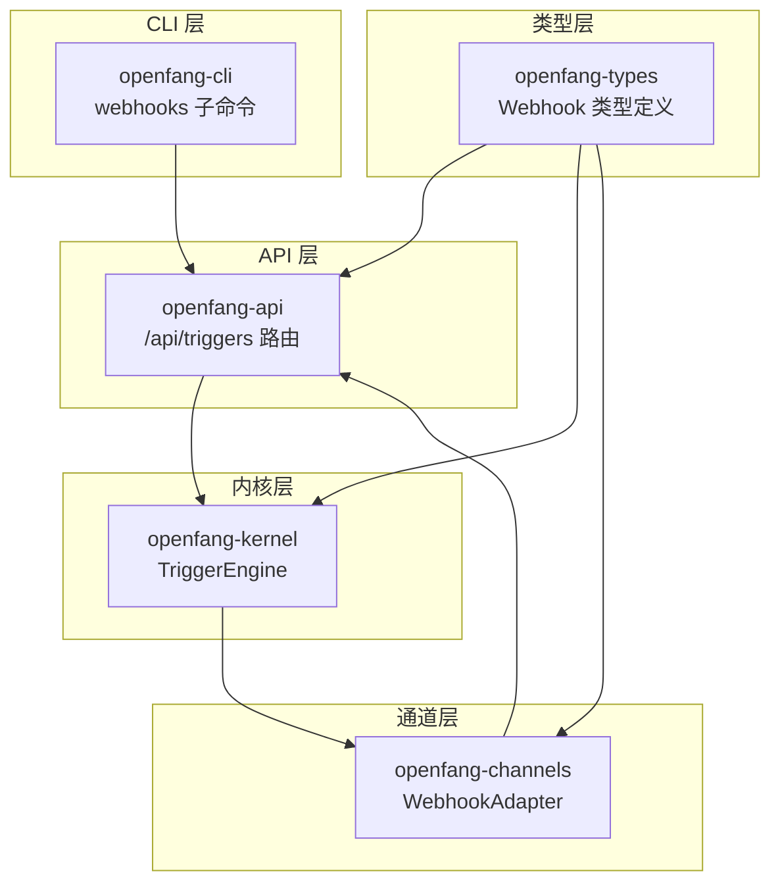
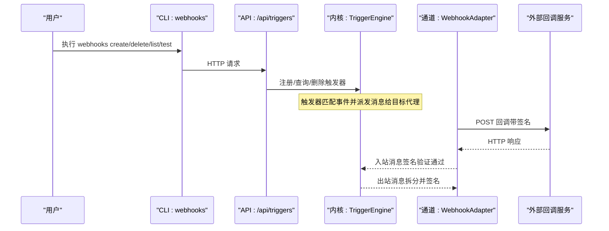
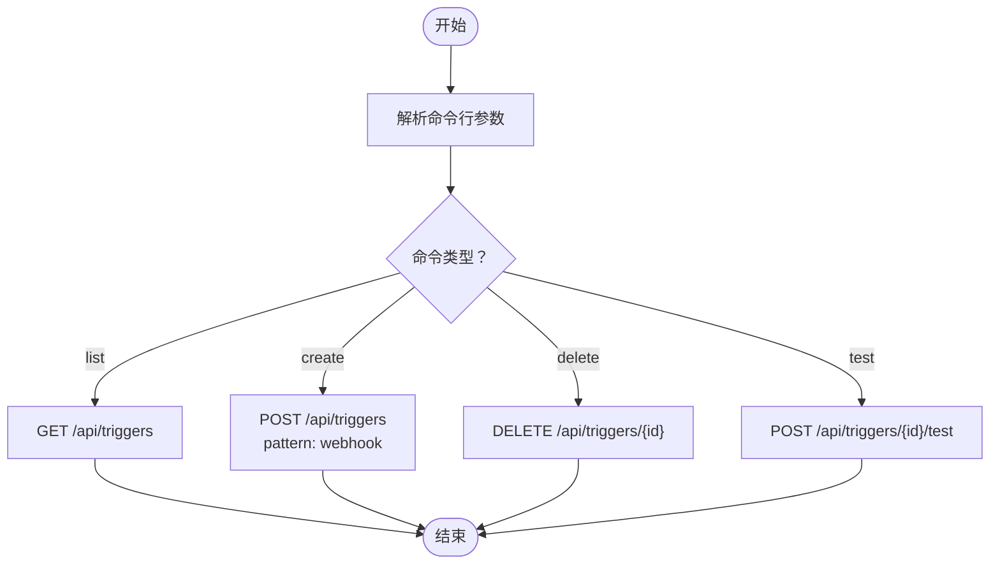
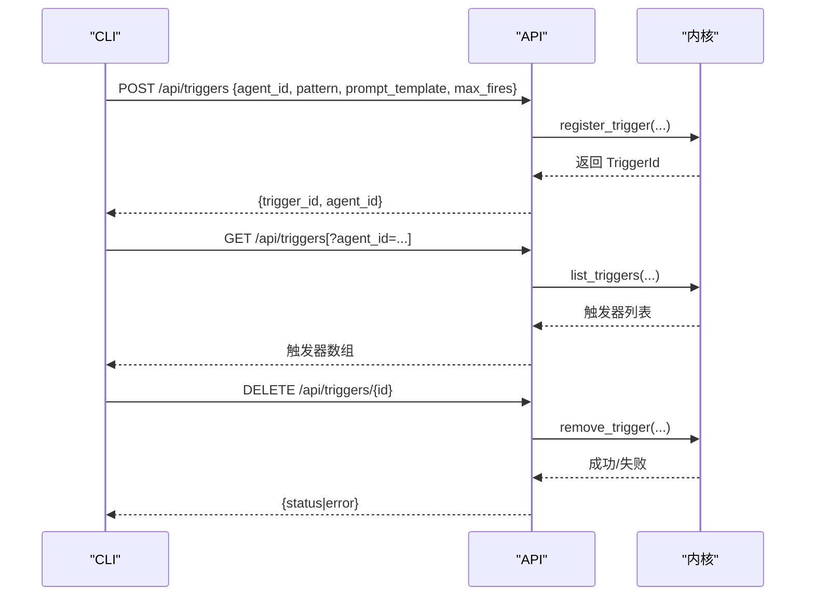
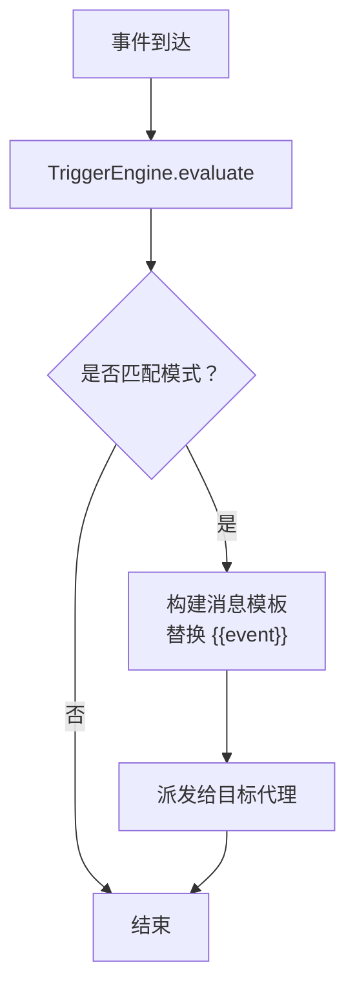
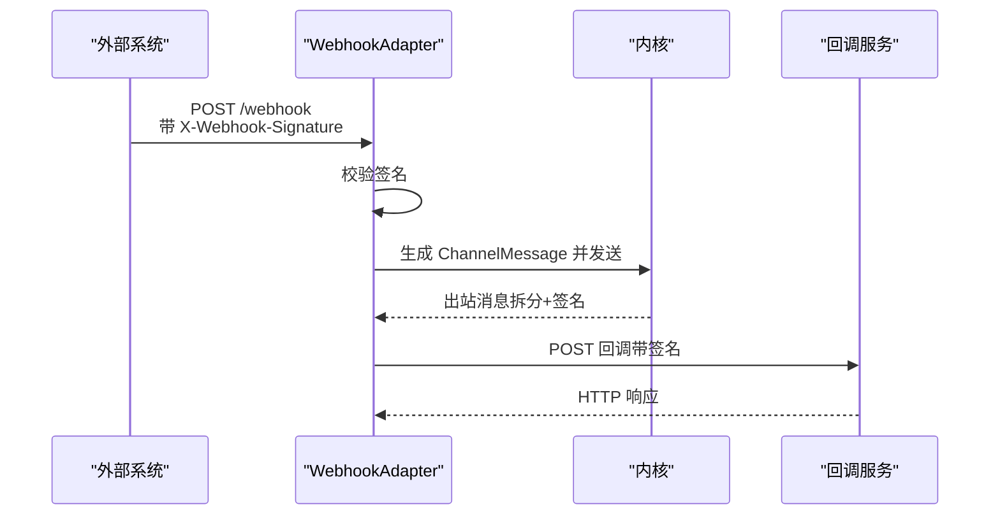
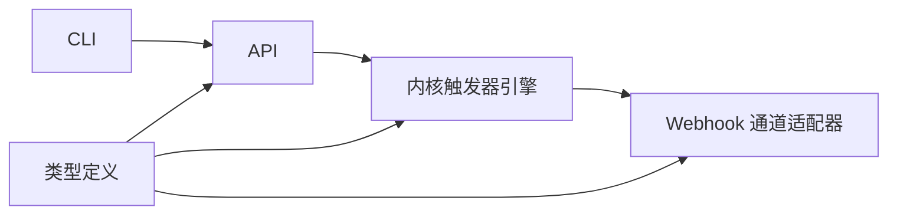

# Webhook 管理

<cite>
**本文档引用的文件**
- [crates/openfang-cli/src/main.rs](file://crates/openfang-cli/src/main.rs)
- [crates/openfang-api/src/routes.rs](file://crates/openfang-api/src/routes.rs)
- [crates/openfang-kernel/src/triggers.rs](file://crates/openfang-kernel/src/triggers.rs)
- [crates/openfang-channels/src/webhook.rs](file://crates/openfang-channels/src/webhook.rs)
- [crates/openfang-types/src/webhook.rs](file://crates/openfang-types/src/webhook.rs)
</cite>

## 目录
1. [简介](#简介)
2. [项目结构](#项目结构)
3. [核心组件](#核心组件)
4. [架构总览](#架构总览)
5. [详细组件分析](#详细组件分析)
6. [依赖关系分析](#依赖关系分析)
7. [性能考虑](#性能考虑)
8. [故障排除指南](#故障排除指南)
9. [结论](#结论)

## 简介
本文件为 OpenFang Webhook 管理命令的权威参考文档，覆盖以下内容：
- Webhook 管理命令：webhooks list、webhooks create、webhooks delete、webhooks test 的语法、参数、选项与使用示例
- Webhook 触发器、回调管理与测试验证机制
- Webhook 系统架构与事件传播路径
- 实际使用场景、最佳实践与错误处理策略

OpenFang 提供两类 Webhook 能力：
- 通过 CLI 的触发器管理命令，注册基于事件的 Webhook 触发器（触发器模式为 webhook）
- 通过通道适配器实现的通用 HTTP Webhook 通道，支持双向消息收发与签名验证

## 项目结构
OpenFang 将 Webhook 相关能力分布在多个子模块中：
- CLI 层：定义并实现 webhooks 子命令，调用后端 API 完成触发器的增删查与测试
- API 层：提供触发器的创建、查询、删除等 REST 接口
- 内核层：触发器引擎负责匹配事件并派发给目标代理
- 通道层：Webhook 通道适配器提供 HTTP 入站与出站能力，并内置签名验证
- 类型层：定义 Webhook 相关的数据模型与校验规则

**图表来源**
- [crates/openfang-cli/src/main.rs:736-761](file://crates/openfang-cli/src/main.rs#L736-L761)
- [crates/openfang-api/src/routes.rs:1120-1247](file://crates/openfang-api/src/routes.rs#L1120-L1247)
- [crates/openfang-kernel/src/triggers.rs:82-314](file://crates/openfang-kernel/src/triggers.rs#L82-L314)
- [crates/openfang-channels/src/webhook.rs:52-368](file://crates/openfang-channels/src/webhook.rs#L52-L368)
- [crates/openfang-types/src/webhook.rs:1-131](file://crates/openfang-types/src/webhook.rs#L1-L131)

**章节来源**
- [crates/openfang-cli/src/main.rs:736-761](file://crates/openfang-cli/src/main.rs#L736-L761)
- [crates/openfang-api/src/routes.rs:1120-1247](file://crates/openfang-api/src/routes.rs#L1120-L1247)
- [crates/openfang-kernel/src/triggers.rs:82-314](file://crates/openfang-kernel/src/triggers.rs#L82-L314)
- [crates/openfang-channels/src/webhook.rs:52-368](file://crates/openfang-channels/src/webhook.rs#L52-L368)
- [crates/openfang-types/src/webhook.rs:1-131](file://crates/openfang-types/src/webhook.rs#L1-L131)

## 核心组件
- CLI Webhooks 子命令
  - list：列出所有触发器（含 webhook 触发器），支持 JSON 输出
  - create：创建 webhook 触发器，绑定到指定代理，配置回调 URL
  - delete：删除指定 webhook 触发器
  - test：向指定触发器发送测试负载，验证回调可达性
- API 触发器接口
  - POST /api/triggers：创建触发器（pattern 支持 webhook）
  - GET /api/triggers：查询触发器列表
  - DELETE /api/triggers/{id}：删除触发器
- 触发器引擎
  - 注册、评估事件、匹配 webhook 模式并派发消息给目标代理
- Webhook 通道适配器
  - 入站：监听端口接收 HTTP POST 请求，校验 HMAC-SHA256 签名，解析 JSON 并转换为通道消息
  - 出站：将文本消息按最大长度拆分并通过回调 URL 发送，附带相同签名
- Webhook 类型定义
  - WakePayload、AgentHookPayload 及其校验逻辑（用于系统事件注入与隔离代理回合）

**章节来源**
- [crates/openfang-cli/src/main.rs:736-761](file://crates/openfang-cli/src/main.rs#L736-L761)
- [crates/openfang-api/src/routes.rs:1120-1247](file://crates/openfang-api/src/routes.rs#L1120-L1247)
- [crates/openfang-kernel/src/triggers.rs:82-314](file://crates/openfang-kernel/src/triggers.rs#L82-L314)
- [crates/openfang-channels/src/webhook.rs:52-368](file://crates/openfang-channels/src/webhook.rs#L52-L368)
- [crates/openfang-types/src/webhook.rs:1-131](file://crates/openfang-types/src/webhook.rs#L1-L131)

## 架构总览
下图展示从 CLI 到内核再到通道适配器的完整链路，以及事件如何被触发器捕获并派发给代理。

**图表来源**
- [crates/openfang-cli/src/main.rs:6015-6098](file://crates/openfang-cli/src/main.rs#L6015-L6098)
- [crates/openfang-api/src/routes.rs:1120-1247](file://crates/openfang-api/src/routes.rs#L1120-L1247)
- [crates/openfang-kernel/src/triggers.rs:272-308](file://crates/openfang-kernel/src/triggers.rs#L272-L308)
- [crates/openfang-channels/src/webhook.rs:177-368](file://crates/openfang-channels/src/webhook.rs#L177-L368)

## 详细组件分析

### CLI Webhooks 子命令详解
- 命令：webhooks list
  - 作用：列出所有触发器，显示 ID、代理 ID 与回调 URL
  - 参数：无
  - 选项：--json（输出 JSON）
  - 行为：调用 /api/triggers 获取列表
- 命令：webhooks create
  - 作用：创建 webhook 触发器
  - 参数：
    - agent：目标代理名称或 ID
    - url：回调 URL
  - 选项：无
  - 行为：POST /api/triggers，pattern 为 webhook，携带 agent_id 与 url
- 命令：webhooks delete
  - 作用：删除指定 webhook 触发器
  - 参数：id（触发器 ID）
  - 选项：无
  - 行为：DELETE /api/triggers/{id}
- 命令：webhooks test
  - 作用：向指定触发器发送测试负载
  - 参数：id（触发器 ID）
  - 选项：无
  - 行为：POST /api/triggers/{id}/test

**图表来源**
- [crates/openfang-cli/src/main.rs:6015-6098](file://crates/openfang-cli/src/main.rs#L6015-L6098)

**章节来源**
- [crates/openfang-cli/src/main.rs:736-761](file://crates/openfang-cli/src/main.rs#L736-L761)
- [crates/openfang-cli/src/main.rs:6015-6098](file://crates/openfang-cli/src/main.rs#L6015-L6098)

### API 触发器接口
- POST /api/triggers
  - 请求体字段：
    - agent_id：目标代理 ID
    - pattern：JSON 对象，webhook 场景下包含 url 字段
    - prompt_template：触发时发送给代理的消息模板
    - max_fires：最大触发次数（0 表示不限制）
  - 响应：返回触发器 ID 与 agent_id
- GET /api/triggers
  - 查询参数：agent_id（可选）过滤
  - 响应：触发器列表（含 pattern、prompt_template、enabled、fire_count、max_fires、created_at）
- DELETE /api/triggers/{id}
  - 响应：成功状态或错误信息

**图表来源**
- [crates/openfang-api/src/routes.rs:1120-1247](file://crates/openfang-api/src/routes.rs#L1120-L1247)

**章节来源**
- [crates/openfang-api/src/routes.rs:1120-1247](file://crates/openfang-api/src/routes.rs#L1120-L1247)

### 触发器引擎与事件传播
- 触发器模式
  - TriggerPattern 包含多种模式，webhook 触发器通过 pattern 的 webhook 字段与回调 URL 关联
- 事件评估
  - TriggerEngine.evaluate 根据事件类型与描述匹配模式，生成消息模板并派发给目标代理
  - 支持 max_fires 限制触发次数，超过后自动禁用
- 事件描述
  - describe_event 将不同类型的事件转换为人类可读的描述，用于 prompt 模板填充

**图表来源**
- [crates/openfang-kernel/src/triggers.rs:272-308](file://crates/openfang-kernel/src/triggers.rs#L272-L308)
- [crates/openfang-kernel/src/triggers.rs:368-457](file://crates/openfang-kernel/src/triggers.rs#L368-L457)

**章节来源**
- [crates/openfang-kernel/src/triggers.rs:82-314](file://crates/openfang-kernel/src/triggers.rs#L82-L314)
- [crates/openfang-kernel/src/triggers.rs:368-457](file://crates/openfang-kernel/src/triggers.rs#L368-L457)

### Webhook 通道适配器
- 入站（接收外部回调）
  - 监听端口，接收 POST /webhook 或 / 请求
  - 校验 X-Webhook-Signature 头部（HMAC-SHA256）
  - 解析 JSON，提取 sender_id、sender_name、message、thread_id、is_group、metadata
  - 将消息封装为 ChannelMessage 并通过内部通道传递
- 出站（发送回调）
  - 将文本消息按最大长度拆分（默认 65535 字节）
  - 为每段消息计算签名并发送到回调 URL
  - 若响应非成功状态，返回错误
- 安全与可靠性
  - 使用常量时间比较防止时序攻击
  - 分段发送时添加延迟避免过载
  - 未配置回调 URL 时不进行出站发送

**图表来源**
- [crates/openfang-channels/src/webhook.rs:177-368](file://crates/openfang-channels/src/webhook.rs#L177-L368)

**章节来源**
- [crates/openfang-channels/src/webhook.rs:52-368](file://crates/openfang-channels/src/webhook.rs#L52-L368)

### Webhook 类型与校验
- WakePayload
  - text：事件文本，最大 4096 字符，不允许控制字符（除换行）
  - mode：触发时机（立即/下一心跳）
- AgentHookPayload
  - message：消息内容，最大 16384 字符
  - agent：目标代理（可选）
  - deliver/channel/model：交付与模型覆盖
  - timeout_secs：超时秒数（10-600）
- 校验规则
  - 长度限制与字符合法性检查
  - 默认值与边界条件处理

**章节来源**
- [crates/openfang-types/src/webhook.rs:1-131](file://crates/openfang-types/src/webhook.rs#L1-L131)

## 依赖关系分析
- CLI 依赖 API 提供触发器管理接口
- API 依赖内核的触发器引擎完成注册、查询与删除
- 触发器引擎与通道适配器相互独立，但共同参与事件驱动的消息流转
- 类型层为 API、内核与通道提供统一的数据模型与校验

**图表来源**
- [crates/openfang-cli/src/main.rs:6015-6098](file://crates/openfang-cli/src/main.rs#L6015-L6098)
- [crates/openfang-api/src/routes.rs:1120-1247](file://crates/openfang-api/src/routes.rs#L1120-L1247)
- [crates/openfang-kernel/src/triggers.rs:82-314](file://crates/openfang-kernel/src/triggers.rs#L82-L314)
- [crates/openfang-channels/src/webhook.rs:52-368](file://crates/openfang-channels/src/webhook.rs#L52-L368)
- [crates/openfang-types/src/webhook.rs:1-131](file://crates/openfang-types/src/webhook.rs#L1-L131)

**章节来源**
- [crates/openfang-cli/src/main.rs:6015-6098](file://crates/openfang-cli/src/main.rs#L6015-L6098)
- [crates/openfang-api/src/routes.rs:1120-1247](file://crates/openfang-api/src/routes.rs#L1120-L1247)
- [crates/openfang-kernel/src/triggers.rs:82-314](file://crates/openfang-kernel/src/triggers.rs#L82-L314)
- [crates/openfang-channels/src/webhook.rs:52-368](file://crates/openfang-channels/src/webhook.rs#L52-L368)
- [crates/openfang-types/src/webhook.rs:1-131](file://crates/openfang-types/src/webhook.rs#L1-L131)

## 性能考虑
- 分段发送：当消息超过阈值时自动拆分并延时发送，降低单次请求压力
- 常量时间签名验证：避免时序攻击的同时保持较低开销
- 触发器评估：在内核中对事件进行快速匹配与计数，避免不必要的代理调用
- 回调 URL 健壮性：API 层对回调响应进行状态码检查，便于及时发现异常

[本节为通用指导，无需特定文件引用]

## 故障排除指南
- 回调签名错误
  - 现象：入站请求返回 403 Forbidden
  - 原因：X-Webhook-Signature 不匹配
  - 处理：确认共享密钥一致，检查请求体与签名算法
- 回调 URL 不可达或返回非成功状态
  - 现象：出站发送失败并返回错误
  - 处理：检查网络连通性、证书与防火墙设置；确保回调服务正确处理请求并返回 2xx
- 触发器未生效
  - 现象：事件未触发代理
  - 处理：确认触发器已启用、max_fires 未达上限；检查事件类型与模式匹配
- 测试失败
  - 现象：webhooks test 返回失败
  - 处理：使用 --json 查看详细错误；验证回调服务日志与网络连通性

**章节来源**
- [crates/openfang-channels/src/webhook.rs:100-112](file://crates/openfang-channels/src/webhook.rs#L100-L112)
- [crates/openfang-channels/src/webhook.rs:344-356](file://crates/openfang-channels/src/webhook.rs#L344-L356)
- [crates/openfang-cli/src/main.rs:6086-6098](file://crates/openfang-cli/src/main.rs#L6086-L6098)

## 结论
OpenFang 的 Webhook 管理通过 CLI 触发器命令与通道适配器协同工作，既支持基于事件的自动化触发，也支持通用 HTTP 回调的双向通信。遵循本文档的命令语法、参数选项与最佳实践，可安全、可靠地集成外部系统并实现高效的事件驱动工作流。