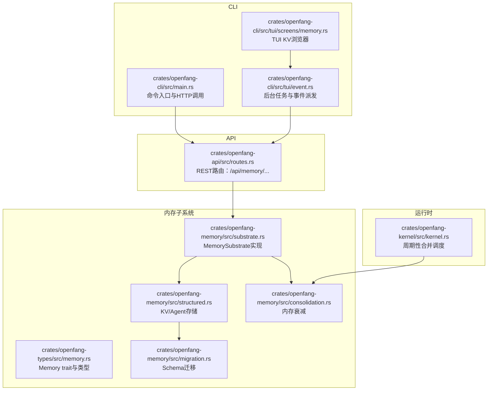
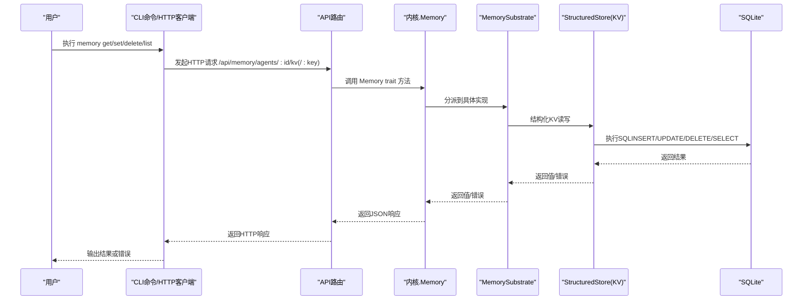
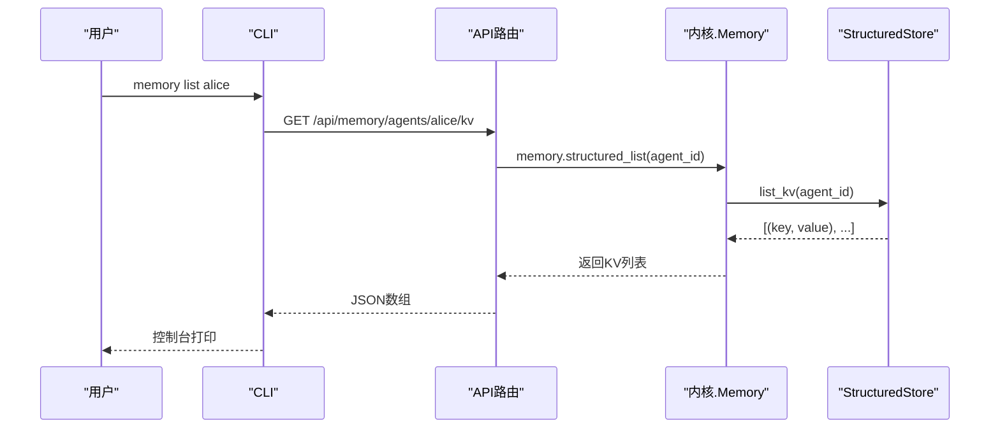
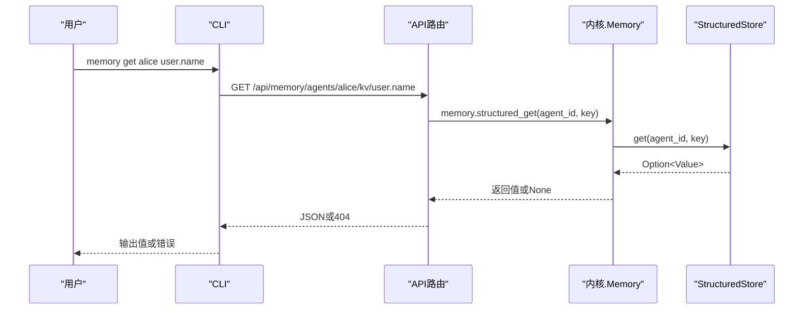
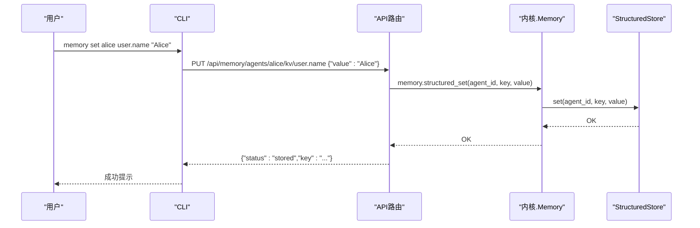
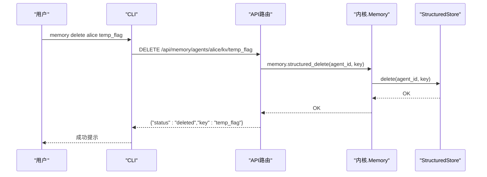
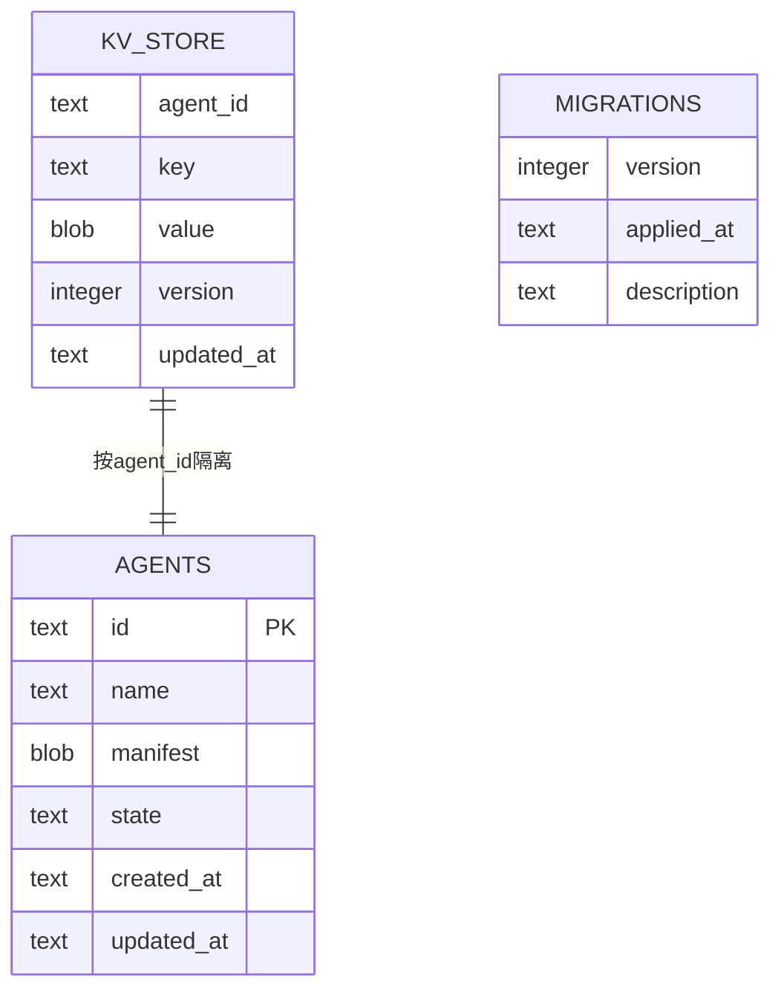
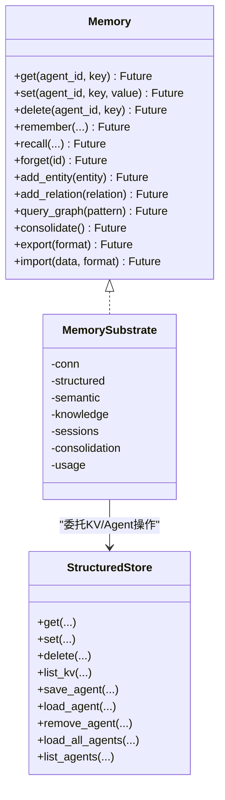
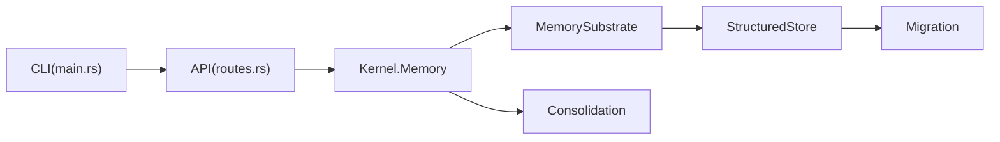

# 内存管理

<cite>
**本文引用的文件**   
- [crates/openfang-cli/src/main.rs](file://crates/openfang-cli/src/main.rs)
- [crates/openfang-cli/src/tui/screens/memory.rs](file://crates/openfang-cli/src/tui/screens/memory.rs)
- [crates/openfang-cli/src/tui/event.rs](file://crates/openfang-cli/src/tui/event.rs)
- [crates/openfang-api/src/routes.rs](file://crates/openfang-api/src/routes.rs)
- [crates/openfang-memory/src/lib.rs](file://crates/openfang-memory/src/lib.rs)
- [crates/openfang-memory/src/substrate.rs](file://crates/openfang-memory/src/substrate.rs)
- [crates/openfang-memory/src/structured.rs](file://crates/openfang-memory/src/structured.rs)
- [crates/openfang-memory/src/migration.rs](file://crates/openfang-memory/src/migration.rs)
- [crates/openfang-memory/src/consolidation.rs](file://crates/openfang-memory/src/consolidation.rs)
- [crates/openfang-types/src/memory.rs](file://crates/openfang-types/src/memory.rs)
- [crates/openfang-kernel/src/kernel.rs](file://crates/openfang-kernel/src/kernel.rs)
</cite>

## 目录
1. [简介](#简介)
2. [项目结构](#项目结构)
3. [核心组件](#核心组件)
4. [架构总览](#架构总览)
5. [详细组件分析](#详细组件分析)
6. [依赖关系分析](#依赖关系分析)
7. [性能考量](#性能考量)
8. [故障排查指南](#故障排查指南)
9. [结论](#结论)
10. [附录](#附录)

## 简介
本文件为 OpenFang 内存管理命令的权威参考，聚焦“知识存储”子系统中的 KV 键值操作能力，覆盖以下命令：
- memory list：列出指定代理的 KV 键值对
- memory get：获取指定键的值
- memory set：设置或更新指定键的值
- memory delete：删除指定键

同时，文档解释内存子系统的统一抽象、KV 存储实现、迁移与持久化机制，并提供备份与恢复策略建议及最佳实践。

## 项目结构
围绕内存管理的关键模块分布如下：
- CLI 命令层：解析并执行 memory list/get/set/delete 命令，调用守护进程 API 或 TUI 交互
- API 层：提供 /api/memory/agents/:id/kv 及其子路径的 REST 接口
- 内存子系统：统一 Memory 抽象，KV 操作由结构化存储（SQLite）承载
- 类型与契约：定义 Memory trait、KV 数据结构与导出/导入格式
- 运行时与维护：内核周期性触发内存合并与衰减；迁移脚本确保数据库模式演进

**图示来源**
- [crates/openfang-cli/src/main.rs:5833-5935](file://crates/openfang-cli/src/main.rs#L5833-L5935)
- [crates/openfang-api/src/routes.rs:3200-3284](file://crates/openfang-api/src/routes.rs#L3200-L3284)
- [crates/openfang-memory/src/substrate.rs:26-63](file://crates/openfang-memory/src/substrate.rs#L26-L63)
- [crates/openfang-memory/src/structured.rs:15-111](file://crates/openfang-memory/src/structured.rs#L15-L111)
- [crates/openfang-memory/src/migration.rs:11-48](file://crates/openfang-memory/src/migration.rs#L11-L48)
- [crates/openfang-memory/src/consolidation.rs:26-53](file://crates/openfang-memory/src/consolidation.rs#L26-L53)
- [crates/openfang-types/src/memory.rs:258-335](file://crates/openfang-types/src/memory.rs#L258-L335)
- [crates/openfang-kernel/src/kernel.rs:3965-3991](file://crates/openfang-kernel/src/kernel.rs#L3965-L3991)

**章节来源**
- [crates/openfang-cli/src/main.rs:5833-5935](file://crates/openfang-cli/src/main.rs#L5833-L5935)
- [crates/openfang-api/src/routes.rs:3200-3284](file://crates/openfang-api/src/routes.rs#L3200-L3284)
- [crates/openfang-memory/src/lib.rs:1-20](file://crates/openfang-memory/src/lib.rs#L1-L20)
- [crates/openfang-memory/src/substrate.rs:26-63](file://crates/openfang-memory/src/substrate.rs#L26-L63)
- [crates/openfang-memory/src/structured.rs:15-111](file://crates/openfang-memory/src/structured.rs#L15-L111)
- [crates/openfang-memory/src/migration.rs:11-48](file://crates/openfang-memory/src/migration.rs#L11-L48)
- [crates/openfang-types/src/memory.rs:258-335](file://crates/openfang-types/src/memory.rs#L258-L335)
- [crates/openfang-kernel/src/kernel.rs:3965-3991](file://crates/openfang-kernel/src/kernel.rs#L3965-L3991)

## 核心组件
- Memory trait：统一抽象，KV 操作（get/set/delete）、语义检索（remember/recall/forget）、知识图谱（add_entity/add_relation/query_graph）、维护（consolidate/export/import）
- MemorySubstrate：组合结构化存储、语义存储、知识图谱、会话存储与合并引擎，提供单一异步 API
- StructuredStore：基于 SQLite 的 KV 存储与代理持久化，支持按代理隔离
- Migration：首次启动与版本升级时创建/迁移表结构
- Consolidation：周期性降低长期未访问记忆的置信度
- API 路由：/api/memory/agents/:id/kv 与 /kv/:key 的 CRUD
- CLI/TUI：命令行与 TUI 提供 KV 浏览、编辑与删除

**章节来源**
- [crates/openfang-types/src/memory.rs:258-335](file://crates/openfang-types/src/memory.rs#L258-L335)
- [crates/openfang-memory/src/substrate.rs:26-63](file://crates/openfang-memory/src/substrate.rs#L26-L63)
- [crates/openfang-memory/src/structured.rs:15-111](file://crates/openfang-memory/src/structured.rs#L15-L111)
- [crates/openfang-memory/src/migration.rs:11-48](file://crates/openfang-memory/src/migration.rs#L11-L48)
- [crates/openfang-memory/src/consolidation.rs:26-53](file://crates/openfang-memory/src/consolidation.rs#L26-L53)

## 架构总览
下图展示从 CLI 到 API 再到内存子系统的端到端流程，以及 KV 存储在结构化层的实现位置。

**图示来源**
- [crates/openfang-cli/src/main.rs:5833-5935](file://crates/openfang-cli/src/main.rs#L5833-L5935)
- [crates/openfang-api/src/routes.rs:3200-3284](file://crates/openfang-api/src/routes.rs#L3200-L3284)
- [crates/openfang-memory/src/substrate.rs:26-63](file://crates/openfang-memory/src/substrate.rs#L26-L63)
- [crates/openfang-memory/src/structured.rs:15-111](file://crates/openfang-memory/src/structured.rs#L15-L111)

## 详细组件分析

### 命令：memory list
- 功能：列出指定代理的所有 KV 键值对
- 语法：openfang memory list AGENT [--json]
- 参数
  - AGENT：代理名称或ID
  - --json：以JSON输出便于脚本处理
- 行为
  - CLI 调用 /api/memory/agents/:id/kv
  - API 路由返回 {"kv_pairs": [...]} 或 {"key": "...", "value": "..."}
  - CLI 格式化输出键列表或完整JSON
- 使用示例
  - openfang memory list alice
  - openfang memory list alice --json

**图示来源**
- [crates/openfang-cli/src/main.rs:5833-5873](file://crates/openfang-cli/src/main.rs#L5833-L5873)
- [crates/openfang-api/src/routes.rs:3200-3211](file://crates/openfang-api/src/routes.rs#L3200-L3211)
- [crates/openfang-memory/src/structured.rs:82-111](file://crates/openfang-memory/src/structured.rs#L82-L111)

**章节来源**
- [crates/openfang-cli/src/main.rs:5833-5873](file://crates/openfang-cli/src/main.rs#L5833-L5873)
- [crates/openfang-api/src/routes.rs:3200-3211](file://crates/openfang-api/src/routes.rs#L3200-L3211)
- [crates/openfang-memory/src/structured.rs:82-111](file://crates/openfang-memory/src/structured.rs#L82-L111)

### 命令：memory get
- 功能：获取指定键的值
- 语法：openfang memory get AGENT KEY [--json]
- 参数
  - AGENT：代理名称或ID
  - KEY：键名
  - --json：以JSON输出
- 行为
  - CLI 调用 /api/memory/agents/:id/kv/:key
  - API 路由返回 {"key": "...", "value": "..."} 或 404
  - CLI 格式化输出值或JSON
- 使用示例
  - openfang memory get alice user.name
  - openfang memory get alice user.name --json

**图示来源**
- [crates/openfang-cli/src/main.rs:5875-5898](file://crates/openfang-cli/src/main.rs#L5875-L5898)
- [crates/openfang-api/src/routes.rs:3213-3237](file://crates/openfang-api/src/routes.rs#L3213-L3237)
- [crates/openfang-memory/src/structured.rs:21-43](file://crates/openfang-memory/src/structured.rs#L21-L43)

**章节来源**
- [crates/openfang-cli/src/main.rs:5875-5898](file://crates/openfang-cli/src/main.rs#L5875-L5898)
- [crates/openfang-api/src/routes.rs:3213-3237](file://crates/openfang-api/src/routes.rs#L3213-L3237)
- [crates/openfang-memory/src/structured.rs:21-43](file://crates/openfang-memory/src/structured.rs#L21-L43)

### 命令：memory set
- 功能：设置或更新指定键的值
- 语法：openfang memory set AGENT KEY VALUE
- 参数
  - AGENT：代理名称或ID
  - KEY：键名
  - VALUE：要存储的值（JSON字符串）
- 行为
  - CLI 调用 /api/memory/agents/:id/kv/:key，Body: {"value": "..."}
  - API 路由调用 memory.structured_set
  - 结果返回 {"status": "stored", "key": "..."} 或错误
- 使用示例
  - openfang memory set alice user.name "Alice"
  - openfang memory set alice config '{"debug": true}'

**图示来源**
- [crates/openfang-cli/src/main.rs:5900-5917](file://crates/openfang-cli/src/main.rs#L5900-L5917)
- [crates/openfang-api/src/routes.rs:3239-3262](file://crates/openfang-api/src/routes.rs#L3239-L3262)
- [crates/openfang-memory/src/structured.rs:45-66](file://crates/openfang-memory/src/structured.rs#L45-L66)

**章节来源**
- [crates/openfang-cli/src/main.rs:5900-5917](file://crates/openfang-cli/src/main.rs#L5900-L5917)
- [crates/openfang-api/src/routes.rs:3239-3262](file://crates/openfang-api/src/routes.rs#L3239-L3262)
- [crates/openfang-memory/src/structured.rs:45-66](file://crates/openfang-memory/src/structured.rs#L45-L66)

### 命令：memory delete
- 功能：删除指定键
- 语法：openfang memory delete AGENT KEY
- 参数
  - AGENT：代理名称或ID
  - KEY：键名
- 行为
  - CLI 调用 /api/memory/agents/:id/kv/:key
  - API 路由调用 memory.structured_delete
  - 返回 {"status": "deleted", "key": "..."} 或错误
- 使用示例
  - openfang memory delete alice temp_flag

**图示来源**
- [crates/openfang-cli/src/main.rs:5919-5935](file://crates/openfang-cli/src/main.rs#L5919-L5935)
- [crates/openfang-api/src/routes.rs:3264-3284](file://crates/openfang-api/src/routes.rs#L3264-L3284)
- [crates/openfang-memory/src/structured.rs:68-80](file://crates/openfang-memory/src/structured.rs#L68-L80)

**章节来源**
- [crates/openfang-cli/src/main.rs:5919-5935](file://crates/openfang-cli/src/main.rs#L5919-L5935)
- [crates/openfang-api/src/routes.rs:3264-3284](file://crates/openfang-api/src/routes.rs#L3264-L3284)
- [crates/openfang-memory/src/structured.rs:68-80](file://crates/openfang-memory/src/structured.rs#L68-L80)

### KV 存储与数据模型
- 存储后端：SQLite（rusqlite）
- 表结构要点（迁移脚本创建）
  - agents：代理注册与状态
  - sessions：会话历史
  - events：事件日志
  - kv_store：按代理隔离的键值存储（agent_id, key 主键）
  - memories：语义记忆（含 embedding 字段）
  - entities / relations：知识图谱
  - usage_events / canonical_sessions / paired_devices / audit_entries：其他支撑表
- KV 数据序列化
  - 值以 JSON 序列化为字节存储，支持 UTF-8 回退
  - 版本字段与更新时间用于冲突解决与审计
- 访问控制
  - API 路由通过共享代理ID（shared_memory_agent_id）限制访问范围

**图示来源**
- [crates/openfang-memory/src/migration.rs:74-186](file://crates/openfang-memory/src/migration.rs#L74-L186)
- [crates/openfang-memory/src/structured.rs:21-111](file://crates/openfang-memory/src/structured.rs#L21-L111)

**章节来源**
- [crates/openfang-memory/src/migration.rs:11-48](file://crates/openfang-memory/src/migration.rs#L11-L48)
- [crates/openfang-memory/src/migration.rs:74-186](file://crates/openfang-memory/src/migration.rs#L74-L186)
- [crates/openfang-memory/src/structured.rs:21-111](file://crates/openfang-memory/src/structured.rs#L21-L111)

### 内存子系统与统一抽象
- Memory trait 定义了统一接口，KV 操作映射到 StructuredStore
- MemorySubstrate 组合多存储后端，提供单一异步 API
- 运行时内核按配置周期性触发 consolidate，降低长期未访问记忆置信度

**图示来源**
- [crates/openfang-types/src/memory.rs:258-335](file://crates/openfang-types/src/memory.rs#L258-L335)
- [crates/openfang-memory/src/substrate.rs:26-63](file://crates/openfang-memory/src/substrate.rs#L26-L63)
- [crates/openfang-memory/src/structured.rs:15-440](file://crates/openfang-memory/src/structured.rs#L15-L440)

**章节来源**
- [crates/openfang-types/src/memory.rs:258-335](file://crates/openfang-types/src/memory.rs#L258-L335)
- [crates/openfang-memory/src/substrate.rs:26-63](file://crates/openfang-memory/src/substrate.rs#L26-L63)
- [crates/openfang-memory/src/structured.rs:15-440](file://crates/openfang-memory/src/structured.rs#L15-L440)

### 数据持久化与迁移机制
- 首次启动或升级时执行 run_migrations，确保表存在且版本正确
- 使用 PRAGMA user_version 跟踪当前版本，避免重复迁移
- 迁移兼容旧表结构，逐步添加新列（如 session_id、identity、embedding 等）

**章节来源**
- [crates/openfang-memory/src/migration.rs:11-48](file://crates/openfang-memory/src/migration.rs#L11-L48)
- [crates/openfang-memory/src/migration.rs:74-329](file://crates/openfang-memory/src/migration.rs#L74-L329)

### 内存维护与衰减
- 内核按配置周期触发 consolidate，降低超过一定时间未访问的记忆置信度
- 衰减阈值与速率可配置，防止过时信息主导决策

**章节来源**
- [crates/openfang-kernel/src/kernel.rs:3965-3991](file://crates/openfang-kernel/src/kernel.rs#L3965-L3991)
- [crates/openfang-memory/src/consolidation.rs:26-53](file://crates/openfang-memory/src/consolidation.rs#L26-L53)

## 依赖关系分析
- CLI 依赖 API 路由；API 路由依赖内核的 Memory trait；Memory 实现位于 MemorySubstrate；KV 操作最终落到 StructuredStore；StructuredStore 依赖 SQLite 连接与迁移脚本
- 内核负责调度周期性维护任务，避免与异步运行时阻塞

**图示来源**
- [crates/openfang-cli/src/main.rs:5833-5935](file://crates/openfang-cli/src/main.rs#L5833-L5935)
- [crates/openfang-api/src/routes.rs:3200-3284](file://crates/openfang-api/src/routes.rs#L3200-L3284)
- [crates/openfang-memory/src/substrate.rs:26-63](file://crates/openfang-memory/src/substrate.rs#L26-L63)
- [crates/openfang-memory/src/structured.rs:15-111](file://crates/openfang-memory/src/structured.rs#L15-L111)
- [crates/openfang-memory/src/migration.rs:11-48](file://crates/openfang-memory/src/migration.rs#L11-L48)
- [crates/openfang-kernel/src/kernel.rs:3965-3991](file://crates/openfang-kernel/src/kernel.rs#L3965-L3991)

**章节来源**
- [crates/openfang-cli/src/main.rs:5833-5935](file://crates/openfang-cli/src/main.rs#L5833-L5935)
- [crates/openfang-api/src/routes.rs:3200-3284](file://crates/openfang-api/src/routes.rs#L3200-L3284)
- [crates/openfang-memory/src/substrate.rs:26-63](file://crates/openfang-memory/src/substrate.rs#L26-L63)
- [crates/openfang-memory/src/structured.rs:15-111](file://crates/openfang-memory/src/structured.rs#L15-L111)
- [crates/openfang-memory/src/migration.rs:11-48](file://crates/openfang-memory/src/migration.rs#L11-L48)
- [crates/openfang-kernel/src/kernel.rs:3965-3991](file://crates/openfang-kernel/src/kernel.rs#L3965-L3991)

## 性能考量
- SQLite WAL 模式与忙等待超时提升并发与稳定性
- KV 操作为单行读写，复杂度 O(1)，索引按 agent_id/key 维护
- 语义检索与知识图谱查询依赖索引与分页，建议合理设置过滤条件
- 周期性合并仅更新置信度，避免大规模重写

**章节来源**
- [crates/openfang-memory/src/substrate.rs:40-46](file://crates/openfang-memory/src/substrate.rs#L40-L46)
- [crates/openfang-memory/src/migration.rs:106-173](file://crates/openfang-memory/src/migration.rs#L106-L173)

## 故障排查指南
- 常见错误
  - 404：键不存在（GET）
  - 500：内部错误（数据库/序列化失败）
  - 权限/认证：需要有效会话或密钥（视部署而定）
- 排查步骤
  - 确认代理ID/名称正确
  - 检查键名是否包含特殊字符或空格
  - 使用 --json 获取完整响应体定位问题
  - 查看内核日志中关于内存操作的警告
- 建议
  - 对大对象使用压缩或外部存储，KV 中仅保留轻量引用
  - 定期执行 memory list 检查异常键值

**章节来源**
- [crates/openfang-api/src/routes.rs:3200-3284](file://crates/openfang-api/src/routes.rs#L3200-L3284)
- [crates/openfang-cli/src/main.rs:5833-5935](file://crates/openfang-cli/src/main.rs#L5833-L5935)

## 结论
OpenFang 的内存管理以统一的 Memory trait 抽象为核心，KV 操作通过 StructuredStore 与 SQLite 稳健落地。CLI/TUI 提供直观的 KV 管理体验，API 路由保证一致的访问协议。配合迁移与周期性维护，系统在可用性与可演进性上取得平衡。建议在生产环境中结合备份与监控策略，确保数据安全与服务连续性。

## 附录

### 备份与恢复策略（建议）
- 备份
  - 直接复制 SQLite 数据库文件（WAL/SHM 文件需在关闭时复制）
  - 导出内存：使用 Memory trait 的 export（当前阶段可能不完整），或定期备份 kv_store 表
- 恢复
  - 将备份数据库文件替换到原位，重启服务
  - 如遇版本差异，确保先执行迁移脚本
- 最佳实践
  - 定期快照（每日/每周）
  - 校验一致性（校验 WAL/SHM 与主库同步）
  - 在维护窗口进行备份，避免在线复制导致的数据不一致

**章节来源**
- [crates/openfang-memory/src/migration.rs:11-48](file://crates/openfang-memory/src/migration.rs#L11-L48)
- [crates/openfang-types/src/memory.rs:326-335](file://crates/openfang-types/src/memory.rs#L326-L335)