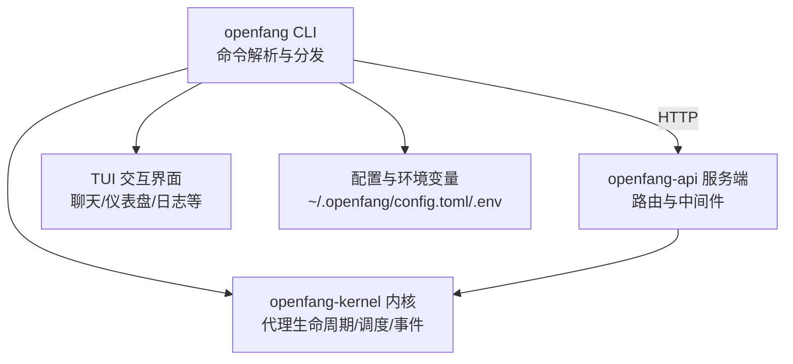
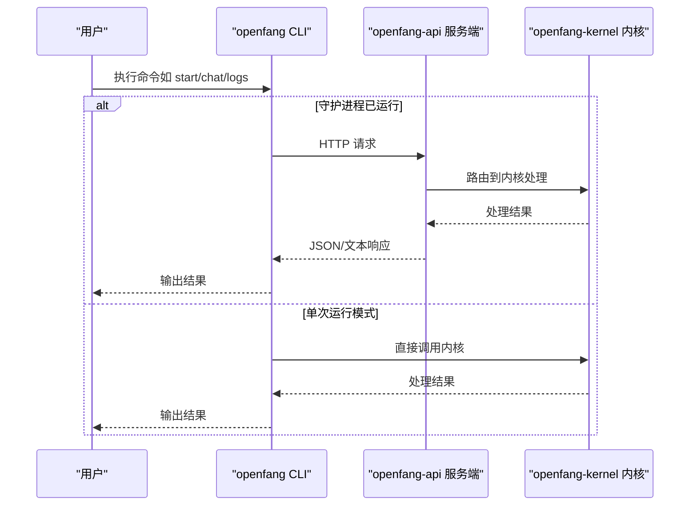
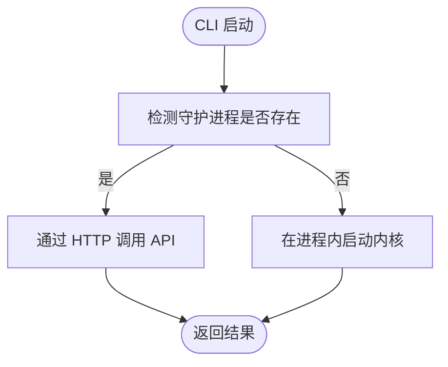
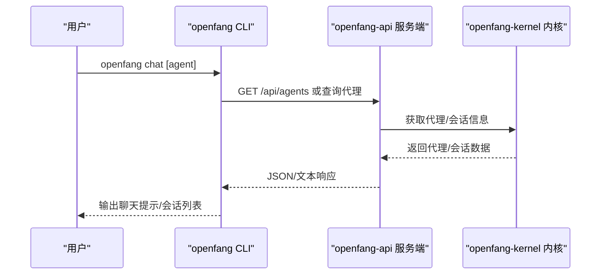
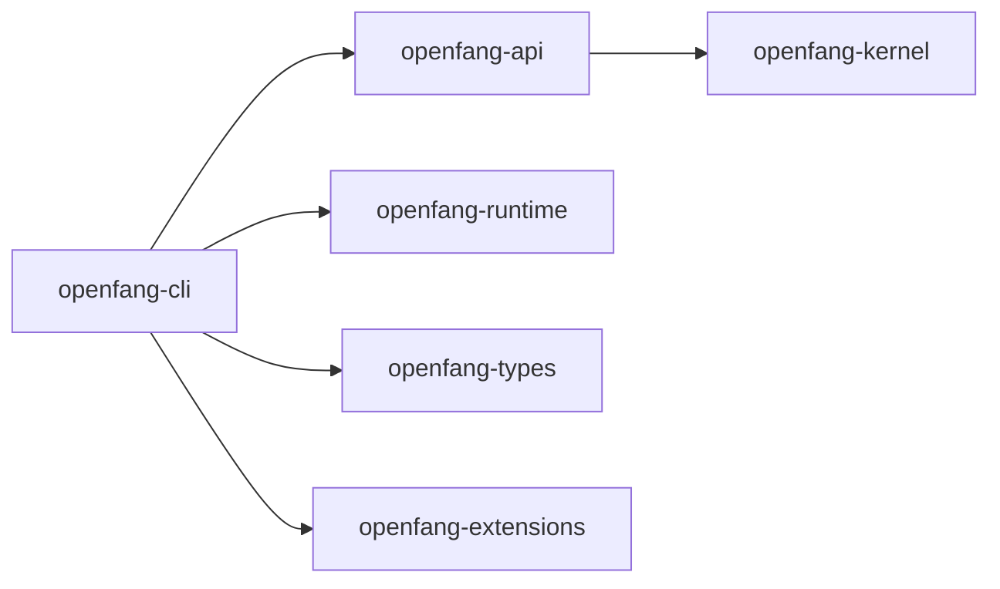

# 基础命令

<cite>
**本文引用的文件**
- [crates/openfang-cli/src/main.rs](file://crates/openfang-cli/src/main.rs)
- [crates/openfang-cli/src/launcher.rs](file://crates/openfang-cli/src/launcher.rs)
- [crates/openfang-cli/src/tui/mod.rs](file://crates/openfang-cli/src/tui/mod.rs)
- [crates/openfang-api/src/server.rs](file://crates/openfang-api/src/server.rs)
- [crates/openfang-kernel/src/lib.rs](file://crates/openfang-kernel/src/lib.rs)
- [openfang.toml.example](file://openfang.toml.example)
- [crates/openfang-cli/Cargo.toml](file://crates/openfang-cli/Cargo.toml)
</cite>

## 目录
1. [简介](#简介)
2. [项目结构](#项目结构)
3. [核心组件](#核心组件)
4. [架构总览](#架构总览)
5. [详细组件分析](#详细组件分析)
6. [依赖分析](#依赖分析)
7. [性能考虑](#性能考虑)
8. [故障排查指南](#故障排查指南)
9. [结论](#结论)
10. [附录](#附录)

## 简介
本文件为 OpenFang 基础命令的权威参考，覆盖以下类别：
- 初始化命令：init、setup、onboard
- 守护进程管理：start、stop、gateway start、gateway stop、status、health、doctor
- 快速交互命令：chat、tui、dashboard、logs、message、sessions

内容包含：
- 每个命令的语法、参数、选项与典型用法
- 全局选项（--config、--help、--version）
- 环境变量与配置文件的作用
- 单次运行模式与守护进程模式的区别
- 实际使用场景与自动化脚本示例（CI/CD、批量操作）

## 项目结构
OpenFang 的 CLI 位于 openfang-cli 工程，通过子命令组织功能；当存在运行中的守护进程时，CLI 通过 HTTP 与之通信；否则以“单次运行模式”在进程中启动内核。

图表来源
- [crates/openfang-cli/src/main.rs:88-294](file://crates/openfang-cli/src/main.rs#L88-L294)
- [crates/openfang-api/src/server.rs:35-54](file://crates/openfang-api/src/server.rs#L35-L54)
- [crates/openfang-kernel/src/lib.rs:1-30](file://crates/openfang-kernel/src/lib.rs#L1-L30)

章节来源
- [crates/openfang-cli/src/main.rs:88-294](file://crates/openfang-cli/src/main.rs#L88-L294)
- [crates/openfang-cli/src/launcher.rs:175-269](file://crates/openfang-cli/src/launcher.rs#L175-L269)
- [crates/openfang-cli/src/tui/mod.rs:138-180](file://crates/openfang-cli/src/tui/mod.rs#L138-L180)
- [crates/openfang-api/src/server.rs:35-54](file://crates/openfang-api/src/server.rs#L35-L54)
- [crates/openfang-kernel/src/lib.rs:1-30](file://crates/openfang-kernel/src/lib.rs#L1-L30)

## 核心组件
- 命令定义与解析：基于 clap 的子命令体系，集中于主入口文件，涵盖 init、setup、onboard、start、stop、gateway、status、health、doctor、chat、tui、dashboard、logs、message、sessions 等。
- 后台模式与单次运行模式：
  - 后台模式：openfang start 启动守护进程，CLI 通过 HTTP 调用 API。
  - 单次运行模式：无守护进程时，CLI 在进程中直接启动内核处理命令。
- TUI 交互：tui 子命令提供全屏交互界面；无守护进程时亦可在进程内运行。
- 配置与环境变量：默认配置路径为 ~/.openfang/config.toml；部分通道与模型提供商通过环境变量注入密钥。

章节来源
- [crates/openfang-cli/src/main.rs:88-294](file://crates/openfang-cli/src/main.rs#L88-L294)
- [crates/openfang-cli/src/launcher.rs:175-269](file://crates/openfang-cli/src/launcher.rs#L175-L269)
- [crates/openfang-cli/src/tui/mod.rs:138-180](file://crates/openfang-cli/src/tui/mod.rs#L138-L180)
- [openfang.toml.example:1-49](file://openfang.toml.example#L1-L49)

## 架构总览
下图展示 CLI、API 服务与内核之间的交互关系，以及两种运行模式的差异。

图表来源
- [crates/openfang-cli/src/main.rs:88-294](file://crates/openfang-cli/src/main.rs#L88-L294)
- [crates/openfang-api/src/server.rs:35-54](file://crates/openfang-api/src/server.rs#L35-L54)
- [crates/openfang-kernel/src/lib.rs:28-30](file://crates/openfang-kernel/src/lib.rs#L28-L30)

## 详细组件分析

### 初始化命令
- init
  - 作用：初始化配置与数据目录，生成默认配置与 .env 文件。
  - 关键选项：--config（指定配置路径），--help（查看帮助）。
  - 快速模式：--quick（非交互式，适合脚本/CI）。
  - 使用示例：openfang init；openfang init --quick。
- setup
  - 作用：非交互式初始化（等价于 init --quick）。
  - 关键选项：--quick。
  - 使用示例：openfang setup --quick。
- onboard
  - 作用：交互式引导向导，协助完成初始设置。
  - 关键选项：--quick（非交互模式）。
  - 使用示例：openfang onboard；openfang onboard --quick。

章节来源
- [crates/openfang-cli/src/main.rs:109-114](file://crates/openfang-cli/src/main.rs#L109-L114)
- [crates/openfang-cli/src/main.rs:253-257](file://crates/openfang-cli/src/main.rs#L253-L257)
- [crates/openfang-cli/src/main.rs:259-263](file://crates/openfang-cli/src/main.rs#L259-L263)

### 守护进程管理
- start
  - 作用：启动内核守护进程（API 服务器 + 内核）。
  - 关键选项：--config（指定配置路径），--help，--version；另有 --yolo（自动批准工具调用）。
  - 使用示例：openfang start；openfang start --yolo。
- stop
  - 作用：停止正在运行的守护进程。
  - 使用示例：openfang stop。
- gateway start / gateway stop / gateway status
  - 作用：通过 gateway 子命令管理守护进程（与 start/stop/status 等价）。
  - 使用示例：openfang gateway start；openfang gateway stop；openfang gateway status。
- status
  - 作用：显示内核状态，支持 --json 输出便于脚本处理。
  - 使用示例：openfang status；openfang status --json。
- health
  - 作用：快速健康检查，支持 --json。
  - 使用示例：openfang health；openfang health --json。
- doctor
  - 作用：诊断健康检查，支持 --json 与 --repair（尝试自动修复）。
  - 使用示例：openfang doctor；openfang doctor --json；openfang doctor --repair。

章节来源
- [crates/openfang-cli/src/main.rs:115-122](file://crates/openfang-cli/src/main.rs#L115-L122)
- [crates/openfang-cli/src/main.rs:590-601](file://crates/openfang-cli/src/main.rs#L590-L601)
- [crates/openfang-cli/src/main.rs:149-154](file://crates/openfang-cli/src/main.rs#L149-L154)
- [crates/openfang-cli/src/main.rs:232-237](file://crates/openfang-cli/src/main.rs#L232-L237)
- [crates/openfang-cli/src/main.rs:155-163](file://crates/openfang-cli/src/main.rs#L155-L163)

### 快速交互命令
- chat
  - 作用：与默认代理进行快速对话；可选指定代理名称或 ID。
  - 使用示例：openfang chat；openfang chat coder。
- tui
  - 作用：启动交互式终端仪表盘（TUI）。
  - 使用示例：openfang tui。
- dashboard
  - 作用：在浏览器中打开 Web 仪表盘（需守护进程运行）。
  - 使用示例：openfang dashboard。
- logs
  - 作用：查看 OpenFang 日志文件，支持 --lines 与 --follow。
  - 使用示例：openfang logs；openfang logs --lines 100；openfang logs --follow。
- message
  - 作用：向指定代理发送一次性消息，支持 --json。
  - 参数：agent（代理名称或 ID）、text（消息文本）。
  - 使用示例：openfang message coder "你好"；openfang message coder "你好" --json。
- sessions
  - 作用：列出会话；可按代理过滤，支持 --json。
  - 使用示例：openfang sessions；openfang sessions --agent coder；openfang sessions --json。

章节来源
- [crates/openfang-cli/src/main.rs:144-148](file://crates/openfang-cli/src/main.rs#L144-L148)
- [crates/openfang-cli/src/main.rs:201-202](file://crates/openfang-cli/src/main.rs#L201-L202)
- [crates/openfang-cli/src/main.rs:164-165](file://crates/openfang-cli/src/main.rs#L164-L165)
- [crates/openfang-cli/src/main.rs:223-231](file://crates/openfang-cli/src/main.rs#L223-L231)
- [crates/openfang-cli/src/main.rs:266-275](file://crates/openfang-cli/src/main.rs#L266-L275)
- [crates/openfang-cli/src/main.rs:215-222](file://crates/openfang-cli/src/main.rs#L215-L222)

### 全局选项与环境变量
- 全局选项
  - --config PATH：指定配置文件路径（优先级高于默认路径）。
  - --help：显示帮助信息。
  - --version：显示版本信息。
- 环境变量与配置文件
  - OPENFANG_HOME：用于确定配置与数据目录位置。
  - 示例配置项：默认模型 provider/model/api_key_env、内存与网络配置、通道适配器令牌等。
  - 通道与模型提供商密钥通常通过环境变量注入（例如 ANTHROPIC_API_KEY、OPENAI_API_KEY 等）。

章节来源
- [crates/openfang-cli/src/main.rs:99-101](file://crates/openfang-cli/src/main.rs#L99-L101)
- [crates/openfang-cli/src/launcher.rs:18-29](file://crates/openfang-cli/src/launcher.rs#L18-L29)
- [crates/openfang-cli/src/launcher.rs:40-50](file://crates/openfang-cli/src/launcher.rs#L40-L50)
- [openfang.toml.example:1-49](file://openfang.toml.example#L1-L49)

### 单次运行模式与守护进程模式
- 单次运行模式
  - 当 CLI 发现没有运行中的守护进程时，会在当前进程中启动内核处理命令，无需 HTTP 通信。
  - 适用于一次性任务、脚本与 CI 场景。
- 守护进程模式
  - 通过 openfang start 启动后，CLI 通过 HTTP 与 API 交互；适合长期运行与多命令协作。
  - API 服务负责路由、鉴权、限流与桥接通道。

图表来源
- [crates/openfang-cli/src/main.rs:88-97](file://crates/openfang-cli/src/main.rs#L88-L97)
- [crates/openfang-api/src/server.rs:35-54](file://crates/openfang-api/src/server.rs#L35-L54)

章节来源
- [crates/openfang-cli/src/main.rs:1-6](file://crates/openfang-cli/src/main.rs#L1-L6)
- [crates/openfang-api/src/server.rs:35-54](file://crates/openfang-api/src/server.rs#L35-L54)

### 命令执行流程（以 chat 为例）

图表来源
- [crates/openfang-cli/src/main.rs:144-148](file://crates/openfang-cli/src/main.rs#L144-L148)
- [crates/openfang-api/src/server.rs:136-200](file://crates/openfang-api/src/server.rs#L136-L200)

## 依赖分析
- openfang-cli 依赖 openfang-api、openfang-kernel、openfang-runtime 等模块，用于构建命令、调用内核与服务端接口。
- openfang-api 依赖 openfang-kernel 提供内核状态与能力，并通过路由暴露 HTTP 接口。

图表来源
- [crates/openfang-cli/Cargo.toml:12-32](file://crates/openfang-cli/Cargo.toml#L12-L32)

章节来源
- [crates/openfang-cli/Cargo.toml:12-32](file://crates/openfang-cli/Cargo.toml#L12-L32)

## 性能考虑
- 守护进程模式下，CLI 通过 HTTP 与 API 通信，减少重复启动内核的开销，适合频繁命令调用。
- 单次运行模式避免网络往返，但每次都会启动内核，适合短小任务与脚本。
- logs 支持 --follow 实时跟踪日志，注意在高吞吐场景下的终端渲染开销。
- status/health/doctor 提供轻量级查询，建议在脚本中结合 --json 降低解析成本。

## 故障排查指南
- doctor
  - 使用 --repair 尝试自动修复缺失目录与配置问题。
  - 结合 --json 输出便于脚本化处理。
- health
  - 快速检查守护进程健康状态，定位连接或认证问题。
- logs
  - 使用 --follow 实时观察日志；--lines 控制初始输出行数。
- 环境变量与配置
  - 确认 OPENFANG_HOME、各提供商 API 密钥环境变量是否正确设置。
  - 参考示例配置文件调整默认模型、网络监听地址与通道适配器。

章节来源
- [crates/openfang-cli/src/main.rs:155-163](file://crates/openfang-cli/src/main.rs#L155-L163)
- [crates/openfang-cli/src/main.rs:232-237](file://crates/openfang-cli/src/main.rs#L232-L237)
- [crates/openfang-cli/src/main.rs:223-231](file://crates/openfang-cli/src/main.rs#L223-L231)
- [crates/openfang-cli/src/launcher.rs:18-29](file://crates/openfang-cli/src/launcher.rs#L18-L29)
- [openfang.toml.example:1-49](file://openfang.toml.example#L1-L49)

## 结论
- 初始化类命令用于建立本地环境；守护进程类命令用于长期运行与管理；交互类命令用于快速体验与运维。
- 通过 --config、--help、--version 与环境变量，CLI 提供灵活的部署与调试方式。
- 在 CI/CD 与自动化脚本中，推荐使用 --json 输出与非交互模式（--quick/--yes），并结合 doctor/health/status 进行健康检查。

## 附录

### 常见使用场景与自动化脚本示例
- 初始化与准备
  - CI 首次运行：openfang setup --quick；openfang start --yolo。
  - 本地开发：openfang init；openfang onboard。
- 运维与监控
  - 健康巡检：openfang health --json；openfang status --json。
  - 诊断修复：openfang doctor --repair；openfang doctor --json。
- 日志与会话
  - 实时日志：openfang logs --follow。
  - 会话管理：openfang sessions；openfang sessions --agent coder。
- 交互与批处理
  - 快速聊天：openfang chat coder。
  - 一次性消息：openfang message coder "任务完成" --json。
  - TUI 仪表盘：openfang tui（需要守护进程）。

### 环境变量与配置要点
- OPENFANG_HOME：决定 ~/.openfang 的根目录位置。
- 模型提供商密钥：通过环境变量注入（如 ANTHROPIC_API_KEY、OPENAI_API_KEY 等）。
- 示例配置：参考 openfang.toml.example 中的默认模型、网络与通道适配器设置。

章节来源
- [crates/openfang-cli/src/launcher.rs:40-50](file://crates/openfang-cli/src/launcher.rs#L40-L50)
- [crates/openfang-cli/src/launcher.rs:18-29](file://crates/openfang-cli/src/launcher.rs#L18-L29)
- [openfang.toml.example:1-49](file://openfang.toml.example#L1-L49)