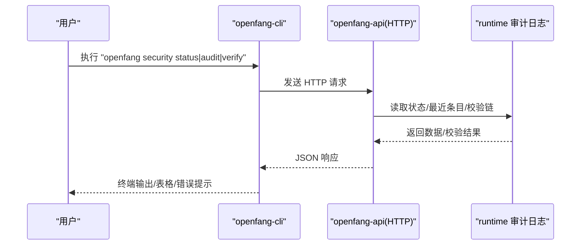
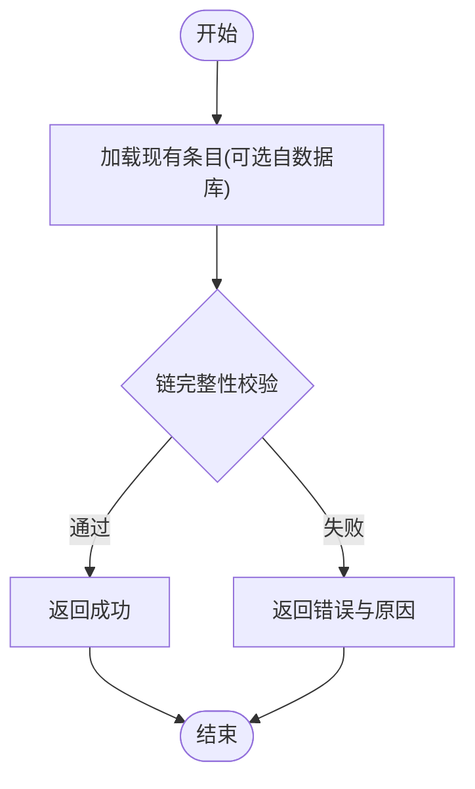
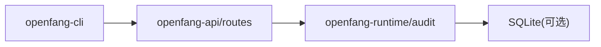

# 安全管理

<cite>
**本文引用的文件**
- [crates/openfang-cli/src/main.rs](file://crates/openfang-cli/src/main.rs)
- [crates/openfang-cli/src/tui/screens/security.rs](file://crates/openfang-cli/src/tui/screens/security.rs)
- [crates/openfang-cli/src/tui/event.rs](file://crates/openfang-cli/src/tui/event.rs)
- [crates/openfang-api/src/routes.rs](file://crates/openfang-api/src/routes.rs)
- [crates/openfang-api/src/server.rs](file://crates/openfang-api/src/server.rs)
- [crates/openfang-runtime/src/audit.rs](file://crates/openfang-runtime/src/audit.rs)
- [crates/openfang-memory/src/migration.rs](file://crates/openfang-memory/src/migration.rs)
- [README.md](file://README.md)
</cite>

## 目录
1. [简介](#简介)
2. [项目结构](#项目结构)
3. [核心组件](#核心组件)
4. [架构总览](#架构总览)
5. [详细组件分析](#详细组件分析)
6. [依赖关系分析](#依赖关系分析)
7. [性能考量](#性能考量)
8. [故障排查指南](#故障排查指南)
9. [结论](#结论)
10. [附录](#附录)

## 简介
本文件为 OpenFang 安全管理命令的权威参考，覆盖以下安全子命令与能力：
- 安全状态查询：显示当前内核启用的核心防护、可配置安全能力与监控项概要
- 审计日志查看：列出最近审计事件，支持限制条数与 JSON 输出
- 审计链完整性验证：对 Merkle 哈希链进行端到端校验，确保不可篡改性

同时，文档解释了 16 层安全防护机制与审计追踪系统的工作原理，并提供实际使用场景、最佳实践与威胁检测策略。

## 项目结构
安全相关能力由三部分协同实现：
- CLI 子命令：解析用户输入，调用守护进程 API 获取数据或触发验证
- API 路由层：提供 /api/security、/api/audit/recent、/api/audit/verify 等端点
- 运行时审计日志：基于 Merkle 链的不可篡改审计记录，支持内存与持久化存储

```mermaid
graph TB
subgraph "CLI"
CLI["openfang-cli<br/>命令解析与输出"]
end
subgraph "API 层"
ROUTES["openfang-api<br/>路由与处理器"]
SERVER["openfang-api<br/>HTTP 服务器"]
end
subgraph "运行时"
AUDIT["openfang-runtime<br/>审计日志(Merkle)"]
DB["SQLite 持久化"]
end
CLI --> |"HTTP 请求"| SERVER
SERVER --> ROUTES
ROUTES --> |"读取/校验"| AUDIT
AUDIT --> |"可选"| DB
```

图表来源
- [crates/openfang-cli/src/main.rs](file://crates/openfang-cli/src/main.rs)
- [crates/openfang-api/src/server.rs](file://crates/openfang-api/src/server.rs)
- [crates/openfang-api/src/routes.rs](file://crates/openfang-api/src/routes.rs)
- [crates/openfang-runtime/src/audit.rs](file://crates/openfang-runtime/src/audit.rs)

章节来源
- [crates/openfang-cli/src/main.rs](file://crates/openfang-cli/src/main.rs)
- [crates/openfang-api/src/server.rs](file://crates/openfang-api/src/server.rs)
- [crates/openfang-api/src/routes.rs](file://crates/openfang-api/src/routes.rs)
- [crates/openfang-runtime/src/audit.rs](file://crates/openfang-runtime/src/audit.rs)

## 核心组件
- 安全状态仪表盘
  - 提供核心防护、可配置能力与监控项的聚合视图
  - 包含审计链长度、标签跟踪范围、Ed25519 签名可用性等关键指标
- 审计日志（Merkle 链）
  - 记录每个可审计动作的序列号、时间戳、主体、类别、详情、结果与哈希链
  - 支持内存模式与数据库持久化，启动时自动校验链完整性
- 审计链验证
  - 对整条链进行重算校验，发现断链或哈希不一致即判定失败
  - 返回布尔值与错误信息，便于自动化脚本处理

章节来源
- [crates/openfang-api/src/routes.rs](file://crates/openfang-api/src/routes.rs)
- [crates/openfang-runtime/src/audit.rs](file://crates/openfang-runtime/src/audit.rs)
- [crates/openfang-memory/src/migration.rs](file://crates/openfang-memory/src/migration.rs)

## 架构总览
下图展示安全命令从 CLI 到 API 再到运行时审计模块的完整调用链：



图表来源
- [crates/openfang-cli/src/main.rs](file://crates/openfang-cli/src/main.rs)
- [crates/openfang-api/src/routes.rs](file://crates/openfang-api/src/routes.rs)
- [crates/openfang-runtime/src/audit.rs](file://crates/openfang-runtime/src/audit.rs)

## 详细组件分析

### 命令：security status
- 功能：打印安全状态摘要，包含审计链、污点跟踪、WASM 沙箱、协议认证、密钥处理、清单签名等关键能力
- 参数与选项
  - --json：以 JSON 格式输出，便于脚本消费
- 行为要点
  - 若未运行守护进程，CLI 将提示无法连接
  - 当守护进程运行时，通过 /api/health/detail 获取辅助信息（如活跃代理数量）并组合输出
- 使用示例
  - openfang security status
  - openfang security status --json

章节来源
- [crates/openfang-cli/src/main.rs](file://crates/openfang-cli/src/main.rs)
- [crates/openfang-api/src/routes.rs](file://crates/openfang-api/src/routes.rs)

### 命令：security audit
- 功能：列出最近的审计事件，支持限制返回条数与 JSON 输出
- 参数与选项
  - --limit：限制返回条目的数量，默认 20
  - --json：以 JSON 格式输出
- 行为要点
  - 无守护进程时会提示并退出
  - 输出包含时间戳、代理名称、事件类型与描述
- 使用示例
  - openfang security audit
  - openfang security audit --limit 50
  - openfang security audit --json

章节来源
- [crates/openfang-cli/src/main.rs](file://crates/openfang-cli/src/main.rs)
- [crates/openfang-api/src/routes.rs](file://crates/openfang-api/src/routes.rs)

### 命令：security verify
- 功能：对审计链进行完整性验证（Merkle 哈希链），确保未被篡改
- 参数与选项
  - 无额外参数
- 行为要点
  - 成功：输出成功提示
  - 失败：输出错误提示与原因，并以非零退出码结束
- 使用示例
  - openfang security verify

章节来源
- [crates/openfang-cli/src/main.rs](file://crates/openfang-cli/src/main.rs)
- [crates/openfang-runtime/src/audit.rs](file://crates/openfang-runtime/src/audit.rs)

### 审计日志（Merkle 链）数据模型
- 关键字段
  - 序列号：单调递增
  - 时间戳：ISO-8601
  - 主体：触发或受作用的代理标识
  - 类别：工具调用、能力检查、代理生命周期、内存/文件/网络访问、认证尝试、网络连接、配置变更等
  - 详情：具体动作描述（如工具名、路径）
  - 结果：执行结果（如 ok/denied/错误信息）
  - 前一哈希：前一条目哈希（初始为全零哨兵）
  - 自身哈希：对内容与前一哈希拼接后的 SHA-256
- 校验流程
  - 顺序遍历，逐条比对 prev_hash 与期望 prev_hash
  - 重新计算自身哈希并与存储哈希对比
  - 任一不一致即判定失败



图表来源
- [crates/openfang-runtime/src/audit.rs](file://crates/openfang-runtime/src/audit.rs)

章节来源
- [crates/openfang-runtime/src/audit.rs](file://crates/openfang-runtime/src/audit.rs)
- [crates/openfang-memory/src/migration.rs](file://crates/openfang-memory/src/migration.rs)

### 安全状态仪表盘（Web/TUI）
- Web/TUI 展示 16 层安全系统概览与实时状态卡片
- CLI 中的安全状态命令会调用 /api/security 获取聚合数据
- TUI 安全屏支持滚动浏览、刷新与链验证触发

章节来源
- [crates/openfang-api/src/routes.rs](file://crates/openfang-api/src/routes.rs)
- [crates/openfang-cli/src/tui/screens/security.rs](file://crates/openfang-cli/src/tui/screens/security.rs)
- [crates/openfang-cli/src/tui/event.rs](file://crates/openfang-cli/src/tui/event.rs)

## 依赖关系分析
- CLI 依赖守护进程 API；当守护进程未运行时，CLI 会提示并退出
- API 路由依赖运行时审计日志；审计日志可选持久化至 SQLite
- 数据库迁移在版本 8 引入审计表，确保链数据跨重启保留



图表来源
- [crates/openfang-cli/src/main.rs](file://crates/openfang-cli/src/main.rs)
- [crates/openfang-api/src/routes.rs](file://crates/openfang-api/src/routes.rs)
- [crates/openfang-runtime/src/audit.rs](file://crates/openfang-runtime/src/audit.rs)
- [crates/openfang-memory/src/migration.rs](file://crates/openfang-memory/src/migration.rs)

章节来源
- [crates/openfang-cli/src/main.rs](file://crates/openfang-cli/src/main.rs)
- [crates/openfang-api/src/routes.rs](file://crates/openfang-api/src/routes.rs)
- [crates/openfang-runtime/src/audit.rs](file://crates/openfang-runtime/src/audit.rs)
- [crates/openfang-memory/src/migration.rs](file://crates/openfang-memory/src/migration.rs)

## 性能考量
- 审计链校验为线性复杂度，按条目数量线性扫描
- 数据库模式仅在启动时加载与校验一次，后续读写为内存操作
- CLI 的 JSON 输出适合自动化集成，避免格式化开销

## 故障排查指南
- 守护进程未运行
  - 现象：CLI 报告守护进程未运行并退出
  - 处理：先执行 openfang start 启动守护进程
- 审计链验证失败
  - 现象：返回 valid=false 并给出错误信息
  - 处理：检查数据库一致性、磁盘权限与进程异常终止；必要时重建审计表并重新采集
- 权限与认证
  - 现象：API 返回 401/403
  - 处理：确认配置中是否设置了 API Key；CLI 会在存在密钥时自动附加 Authorization 头

章节来源
- [crates/openfang-cli/src/main.rs](file://crates/openfang-cli/src/main.rs)
- [crates/openfang-runtime/src/audit.rs](file://crates/openfang-runtime/src/audit.rs)

## 结论
OpenFang 的安全管理命令提供了从状态概览、审计日志查看到审计链完整性验证的完整闭环。结合 16 层防御体系与 Merkle 哈希链，系统实现了可观测、可追溯、可验证的安全能力，适用于生产环境的持续监控与合规审计。

## 附录

### 16 层安全防护机制（节选）
- WASM 双重计量沙箱：燃料与轮询中断，看门狗线程
- Merkle 哈希链审计：每一步加密链接，篡改即刻暴露
- 信息流污点跟踪：标签贯穿执行，敏感数据全程追踪
- Ed25519 签名代理清单：身份与能力集可信
- SSRF 防护：阻断私网与元数据端点
- 密钥零化：离开内存即擦除
- OFP 双向认证：HMAC-SHA256 随机数，常量时间校验
- 能力门禁：角色访问控制，声明所需工具
- 安全响应头：CSP/X-Frame-Options/HSTS 等
- 健康端点脱敏：公开健康检查最小化信息
- 子进程沙箱：清理环境变量，选择性传递
- 提示注入扫描：检测覆盖尝试与数据外泄
- 循环守卫：基于 SHA256 的工具调用循环检测
- 会话修复：七阶段消息历史校验与自动恢复
- 路径穿越防护：规范化与符号链接逃逸防护
- GCRA 速率限制：带成本感知的令牌桶，按 IP 跟踪

章节来源
- [README.md](file://README.md)