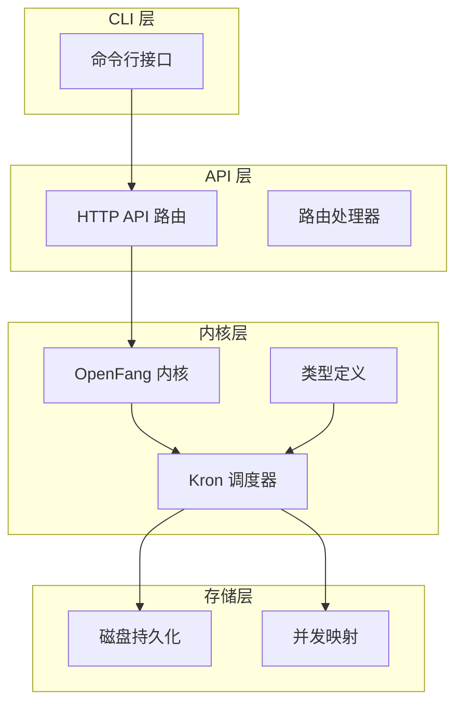
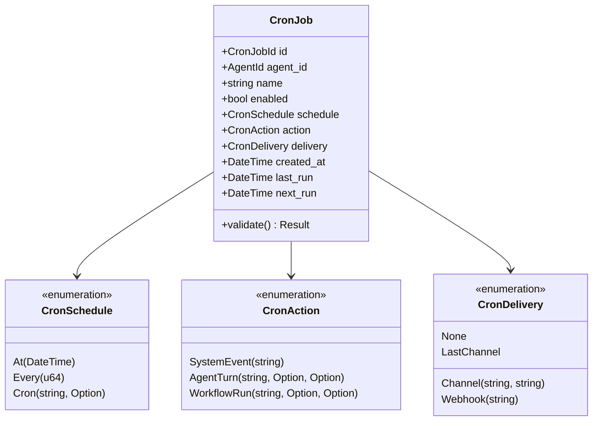
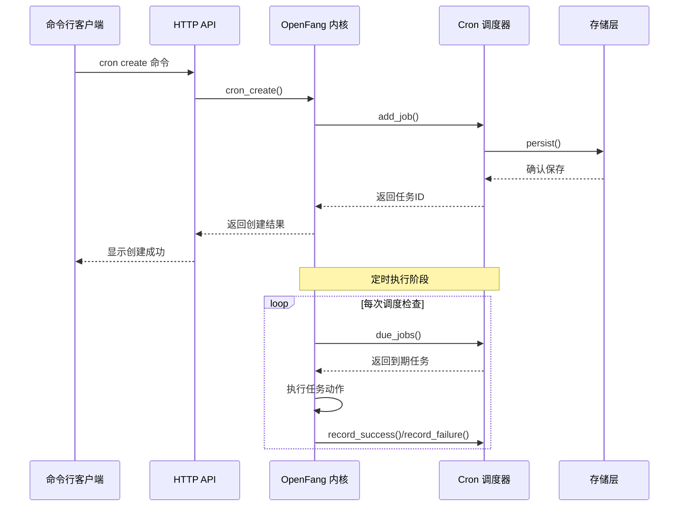
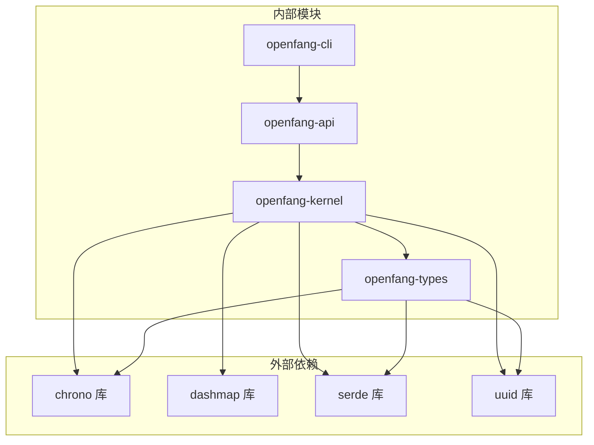
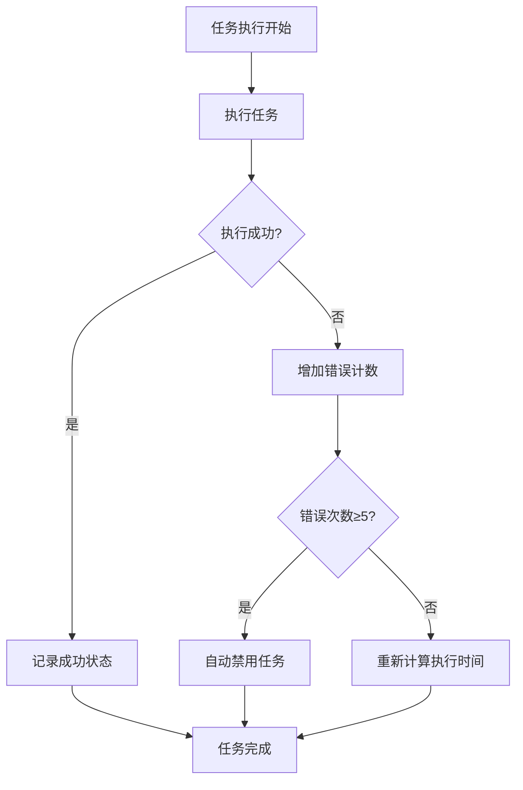

# 定时任务管理

<cite>
**本文档引用的文件**
- [crates/openfang-cli/src/main.rs](file://crates/openfang-cli/src/main.rs)
- [crates/openfang-api/src/routes.rs](file://crates/openfang-api/src/routes.rs)
- [crates/openfang-api/src/server.rs](file://crates/openfang-api/src/server.rs)
- [crates/openfang-kernel/src/cron.rs](file://crates/openfang-kernel/src/cron.rs)
- [crates/openfang-kernel/src/kernel.rs](file://crates/openfang-kernel/src/kernel.rs)
- [crates/openfang-types/src/scheduler.rs](file://crates/openfang-types/src/scheduler.rs)
</cite>

## 目录
1. [简介](#简介)
2. [项目结构](#项目结构)
3. [核心组件](#核心组件)
4. [架构概览](#架构概览)
5. [详细组件分析](#详细组件分析)
6. [依赖关系分析](#依赖关系分析)
7. [性能考虑](#性能考虑)
8. [故障排除指南](#故障排除指南)
9. [结论](#结论)

## 简介

OpenFang 定时任务管理系统是一个基于 cron 表达式的自动化任务调度平台，支持计划作业的创建、管理和执行。该系统提供了完整的命令行界面和 Web API 接口，允许用户以多种调度策略运行自动化任务。

系统的核心特性包括：
- 支持标准 cron 表达式（5 字段）和扩展格式（6 字段）
- 多种调度策略：一次性任务、固定间隔任务、周期性任务
- 丰富的执行动作：系统事件、代理对话、工作流执行、Webhook 调用
- 智能错误处理和自动禁用机制
- 数据持久化和热重载支持

## 项目结构

OpenFang 定时任务管理系统采用模块化架构设计，主要分布在以下核心模块中：



**图表来源**
- [crates/openfang-cli/src/main.rs:5486-5620](file://crates/openfang-cli/src/main.rs#L5486-L5620)
- [crates/openfang-api/src/routes.rs:9935-10073](file://crates/openfang-api/src/routes.rs#L9935-L10073)
- [crates/openfang-kernel/src/cron.rs:60-131](file://crates/openfang-kernel/src/cron.rs#L60-L131)

**章节来源**
- [crates/openfang-cli/src/main.rs:5486-5620](file://crates/openfang-cli/src/main.rs#L5486-L5620)
- [crates/openfang-api/src/server.rs:562-578](file://crates/openfang-api/src/server.rs#L562-L578)

## 核心组件

### Cron 调度器 (CronScheduler)

Cron 调度器是系统的核心组件，负责管理所有定时任务的生命周期。它使用线程安全的 DashMap 存储任务，并提供完整的 CRUD 操作。

关键特性：
- **并发安全**：使用 DashMap 实现线程安全的任务存储
- **持久化支持**：自动将任务状态保存到 JSON 文件
- **智能调度**：基于 cron 表达式计算下一次执行时间
- **错误处理**：自动检测连续失败并禁用问题任务

### CronJob 类型系统

系统定义了完整的任务类型层次结构，确保类型安全和数据完整性：



**图表来源**
- [crates/openfang-types/src/scheduler.rs:166-189](file://crates/openfang-types/src/scheduler.rs#L166-L189)
- [crates/openfang-types/src/scheduler.rs:80-101](file://crates/openfang-types/src/scheduler.rs#L80-L101)

**章节来源**
- [crates/openfang-types/src/scheduler.rs:11-40](file://crates/openfang-types/src/scheduler.rs#L11-L40)

## 架构概览

OpenFang 定时任务系统的整体架构采用分层设计，确保各层职责清晰且松耦合：



**图表来源**
- [crates/openfang-api/src/routes.rs:9967-9983](file://crates/openfang-api/src/routes.rs#L9967-L9983)
- [crates/openfang-kernel/src/cron.rs:134-166](file://crates/openfang-kernel/src/cron.rs#L134-L166)

系统架构的关键特点：
- **分层设计**：CLI → API → 内核 → 调度器 → 存储
- **异步执行**：使用 Tokio 异步运行时处理并发任务
- **持久化保证**：所有状态变更都写入磁盘，支持系统重启恢复
- **监控集成**：与 OpenFang 内核的审计日志和计量系统集成

## 详细组件分析

### 命令行接口实现

OpenFang 提供了完整的命令行工具来管理定时任务，支持以下核心命令：

#### cron list 命令
用于列出系统中的所有定时任务或特定代理的任务。

**命令语法：**
```bash
openfang cron list [--json]
```

**参数说明：**
- `--json`：以 JSON 格式输出详细信息

**使用示例：**
```bash
# 列出所有任务
openfang cron list

# 以 JSON 格式输出
openfang cron list --json
```

#### cron create 命令
创建新的定时任务，支持多种调度策略和执行动作。

**命令语法：**
```bash
openfang cron create <agent> <spec> <prompt> [--name <name>]
```

**参数说明：**
- `agent`：目标代理的 ID 或名称
- `spec`：cron 表达式（如 "0 9 * * 1-5"）
- `prompt`：要执行的提示文本
- `--name`：可选的任务名称

**使用示例：**
```bash
# 创建每日 9 点执行的任务
openfang cron create my-agent "0 9 * * *" "生成日报"

# 创建带自定义名称的任务
openfang cron create my-agent "0 0 * * *" "清理临时文件" --name "daily-cleanup"
```

#### cron delete 命令
删除指定的定时任务。

**命令语法：**
```bash
openfang cron delete <id>
```

**使用示例：**
```bash
# 删除指定 ID 的任务
openfang cron delete 123e4567-e89b-12d3-a456-426614174000
```

#### cron enable/disable 命令
启用或禁用定时任务。

**命令语法：**
```bash
# 启用任务
openfang cron enable <id>

# 禁用任务  
openfang cron disable <id>
```

**使用示例：**
```bash
# 启用任务
openfang cron enable 123e4567-e89b-12d3-a456-426614174000

# 禁用任务
openfang cron disable 123e4567-e89b-12d3-a456-426614174000
```

**章节来源**
- [crates/openfang-cli/src/main.rs:5486-5620](file://crates/openfang-cli/src/main.rs#L5486-L5620)

### API 接口实现

系统同时提供 HTTP API 接口，便于程序化调用和集成。

#### API 端点定义

| 端点 | 方法 | 描述 |
|------|------|------|
| `/api/cron/jobs` | GET | 获取所有定时任务列表 |
| `/api/cron/jobs` | POST | 创建新的定时任务 |
| `/api/cron/jobs/{id}` | DELETE | 删除指定任务 |
| `/api/cron/jobs/{id}/enable` | PUT | 启用/禁用任务 |
| `/api/cron/jobs/{id}/status` | GET | 获取任务状态 |

#### 请求和响应格式

**创建任务请求示例：**
```json
{
  "agent_id": "123e4567-e89b-12d3-a456-426614174000",
  "name": "daily-report",
  "schedule": {
    "kind": "cron",
    "expr": "0 9 * * 1-5"
  },
  "action": {
    "kind": "agent_turn",
    "message": "生成日报",
    "timeout_secs": 300
  },
  "delivery": {
    "kind": "none"
  }
}
```

**任务状态响应示例：**
```json
{
  "job": {
    "id": "123e4567-e89b-12d3-a456-426614174000",
    "agent_id": "123e4567-e89b-12d3-a456-426614174000",
    "name": "daily-report",
    "enabled": true,
    "schedule": {
      "kind": "cron",
      "expr": "0 9 * * 1-5",
      "tz": null
    },
    "action": {
      "kind": "agent_turn",
      "message": "生成日报",
      "timeout_secs": 300
    },
    "delivery": {
      "kind": "none"
    },
    "created_at": "2024-01-01T00:00:00Z",
    "last_run": null,
    "next_run": "2024-01-01T09:00:00Z"
  },
  "one_shot": false,
  "last_status": null,
  "consecutive_errors": 0
}
```

**章节来源**
- [crates/openfang-api/src/routes.rs:9935-10073](file://crates/openfang-api/src/routes.rs#L9935-L10073)

### Cron 表达式和调度策略

系统支持多种调度策略，满足不同的自动化需求：

#### 标准 cron 表达式格式
OpenFang 支持标准的 5 字段 cron 表达式格式：
```
分钟 小时 日期 月份 星期
```

**字段说明：**
- 分钟：0-59
- 小时：0-23  
- 日期：1-31
- 月份：1-12
- 星期：0-7（0 和 7 都表示周日）

**高级特性：**
- 支持范围：`1-5` 表示周一到周五
- 支持步长：`*/15` 表示每 15 分钟
- 支持列表：`1,3,5` 表示第 1、3、5 分钟
- 支持特殊字符：`*`（任意值）、`?`（不指定值）

#### 其他调度策略

除了 cron 表达式外，系统还支持其他调度策略：

**固定间隔调度：**
```rust
CronSchedule::Every { every_secs: 3600 }
```
适用于需要每隔固定时间执行的任务。

**一次性调度：**
```rust
CronSchedule::At { at: DateTime<Utc> }
```
适用于需要在特定时间点执行的任务。

**章节来源**
- [crates/openfang-types/src/scheduler.rs:80-101](file://crates/openfang-types/src/scheduler.rs#L80-L101)

### 任务执行动作

系统提供了多种任务执行动作，满足不同的自动化需求：

#### 系统事件 (SystemEvent)
触发系统内部事件，可用于启动其他自动化流程。

**配置示例：**
```json
{
  "kind": "system_event",
  "text": "maintenance.start"
}
```

#### 代理对话 (AgentTurn)
向指定代理发送消息，触发代理的响应和处理。

**配置示例：**
```json
{
  "kind": "agent_turn",
  "message": "请生成今天的报告",
  "model_override": "claude-3-opus-20240229",
  "timeout_secs": 300
}
```

#### 工作流执行 (WorkflowRun)
执行预定义的工作流，支持复杂的多步骤自动化。

**配置示例：**
```json
{
  "kind": "workflow_run",
  "workflow_id": "report-generation-123",
  "input": "{\"date\": \"2024-01-01\"}",
  "timeout_secs": 600
}
```

#### 交付配置 (Delivery)
控制任务执行结果的传递方式：

**无交付：** 仅执行任务，不发送结果
**频道交付：** 发送到指定通信频道
**最后频道：** 发送到代理最近交互的频道
**Webhook：** 通过 HTTP 请求发送到外部系统

**章节来源**
- [crates/openfang-types/src/scheduler.rs:107-160](file://crates/openfang-types/src/scheduler.rs#L107-L160)

## 依赖关系分析

OpenFang 定时任务系统的依赖关系体现了清晰的分层架构：



**图表来源**
- [crates/openfang-kernel/src/cron.rs:10-18](file://crates/openfang-kernel/src/cron.rs#L10-L18)
- [crates/openfang-types/src/scheduler.rs:6-9](file://crates/openfang-types/src/scheduler.rs#L6-L9)

### 关键依赖说明

**chrono**：提供日期时间处理功能，支持时区转换和时间计算
**dashmap**：提供线程安全的并发映射，支持高并发任务管理
**serde**：提供序列化和反序列化功能，支持 JSON 数据交换
**uuid**：提供唯一标识符生成，确保任务 ID 的唯一性

**章节来源**
- [crates/openfang-kernel/src/cron.rs:10-18](file://crates/openfang-kernel/src/cron.rs#L10-L18)

## 性能考虑

### 并发性能

系统采用多种技术确保高并发环境下的性能表现：

**线程安全设计：**
- 使用 DashMap 替代锁保护的 HashMap
- 支持无锁读取和原子更新操作
- 减少锁竞争，提高并发性能

**内存优化：**
- 任务状态只在需要时加载到内存
- 使用智能缓存策略减少磁盘 I/O
- 限制最大任务数量防止内存溢出

### 执行效率

**调度算法优化：**
- 使用高效的 cron 表达式解析库
- 预计算下次执行时间，避免重复计算
- 批量处理到期任务，减少系统调用开销

**资源管理：**
- 限制单个代理的任务数量（默认 50 个）
- 全局任务数量限制（可配置）
- 自动清理长时间未使用的任务

## 故障排除指南

### 常见问题和解决方案

**任务无法创建**
可能原因：
- cron 表达式格式错误
- 代理 ID 不存在
- 超过任务数量限制

解决方法：
1. 验证 cron 表达式的正确性
2. 确认代理存在且可用
3. 检查系统任务数量限制

**任务不执行**
可能原因：
- 任务被禁用
- 下次执行时间在未来
- 代理不可用

解决方法：
1. 检查任务状态是否为启用
2. 验证下次执行时间设置
3. 确认代理处于运行状态

**任务执行失败**
系统会自动记录错误并进行处理：



**图表来源**
- [crates/openfang-kernel/src/cron.rs:334-357](file://crates/openfang-kernel/src/cron.rs#L334-L357)

**章节来源**
- [crates/openfang-kernel/src/cron.rs:20-22](file://crates/openfang-kernel/src/cron.rs#L20-L22)

### 调试技巧

**启用详细日志：**
```bash
export RUST_LOG=openfang=debug
openfang daemon
```

**检查任务状态：**
```bash
openfang cron list --json
```

**验证 cron 表达式：**
使用在线 cron 表达式测试工具验证表达式的正确性。

## 结论

OpenFang 定时任务管理系统提供了完整、可靠且高性能的自动化任务调度解决方案。系统的设计充分考虑了并发性能、数据持久化和错误处理等关键方面，能够满足从简单到复杂的各种自动化需求。

**主要优势：**
- **易用性**：提供简洁的命令行接口和丰富的 API
- **可靠性**：完善的错误处理和自动恢复机制
- **性能**：优化的并发设计和内存管理
- **灵活性**：支持多种调度策略和执行动作
- **可扩展性**：模块化设计便于功能扩展

**适用场景：**
- 日常维护任务（备份、清理、监控）
- 周期性报告生成
- 数据同步和集成
- 系统健康检查
- 业务流程自动化

通过合理配置和使用，OpenFang 定时任务管理系统能够显著提升系统的自动化水平和运维效率。