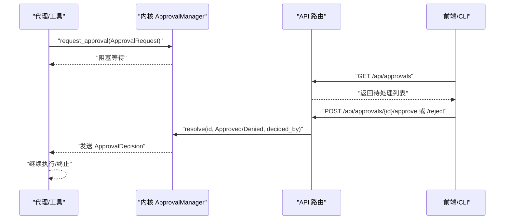
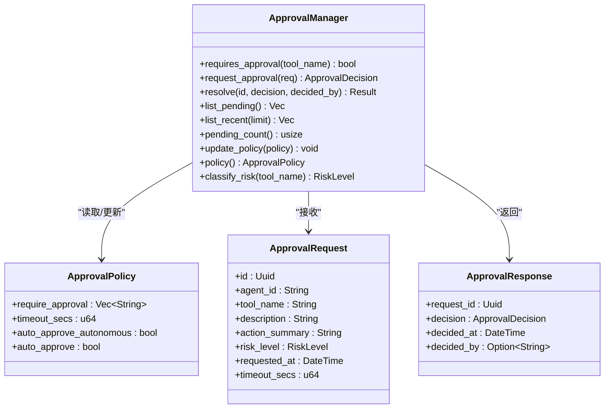
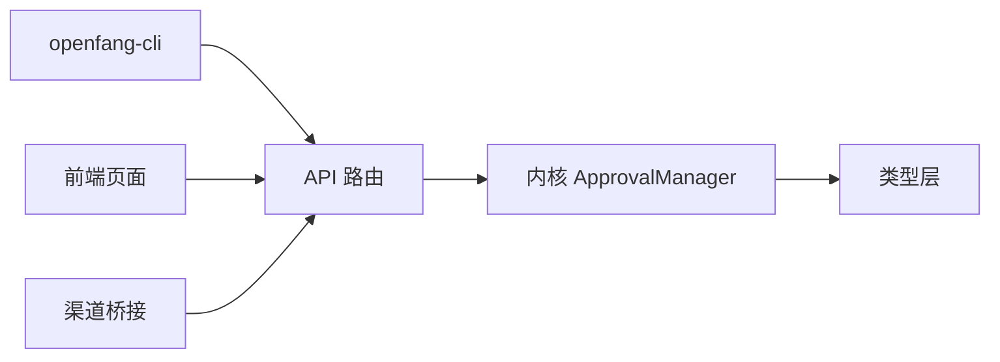

# 审批管理

<cite>
**本文引用的文件**
- [crates/openfang-cli/src/main.rs](file://crates/openfang-cli/src/main.rs)
- [crates/openfang-api/src/routes.rs](file://crates/openfang-api/src/routes.rs)
- [crates/openfang-api/src/channel_bridge.rs](file://crates/openfang-api/src/channel_bridge.rs)
- [crates/openfang-api/static/js/pages/approvals.js](file://crates/openfang-api/static/js/pages/approvals.js)
- [crates/openfang-kernel/src/approval.rs](file://crates/openfang-kernel/src/approval.rs)
- [crates/openfang-types/src/approval.rs](file://crates/openfang-types/src/approval.rs)
</cite>

## 目录
1. [简介](#简介)
2. [项目结构](#项目结构)
3. [核心组件](#核心组件)
4. [架构总览](#架构总览)
5. [详细组件分析](#详细组件分析)
6. [依赖关系分析](#依赖关系分析)
7. [性能考量](#性能考量)
8. [故障排查指南](#故障排查指南)
9. [结论](#结论)
10. [附录](#附录)

## 简介
本文件为 OpenFang 审批管理命令的权威参考，覆盖以下命令：
- 列表：approvals list
- 批准：approvals approve
- 拒绝：approvals reject

内容涵盖命令语法、参数、选项、使用示例、工具调用审批、安全策略与访问控制、工作原理与安全机制、流程设计与异常处理最佳实践。

## 项目结构
审批相关能力由多模块协同实现：
- 类型层：定义审批请求、响应、决策、风险等级与策略等数据模型
- 内核层：实现审批管理器，负责请求提交、等待、超时、批准/拒绝、历史记录与策略更新
- API 层：提供 REST 接口，支持审批列表、批准、拒绝与渠道桥接
- CLI 层：封装 approvals list/approve/reject 命令，通过守护进程通信调用 API
- 前端页面：提供审批队列的可视化界面与交互

```mermaid
graph TB
subgraph "CLI"
CLI["openfang-cli<br/>approvals list/approve/reject"]
end
subgraph "API 层"
ROUTES["routes.rs<br/>GET/POST /api/approvals*"]
BRIDGE["channel_bridge.rs<br/>渠道桥接"]
PAGE["approvals.js<br/>前端页面"]
end
subgraph "内核层"
KERNEL["approval.rs<br/>ApprovalManager"]
end
subgraph "类型层"
TYPES["approval.rs<br/>ApprovalRequest/Response/Policy/RiskLevel"]
end
CLI --> ROUTES
PAGE --> ROUTES
BRIDGE --> ROUTES
ROUTES --> KERNEL
KERNEL --> TYPES
```

图表来源
- [crates/openfang-cli/src/main.rs:603-621](file://crates/openfang-cli/src/main.rs#L603-L621)
- [crates/openfang-api/src/routes.rs:9529-9587](file://crates/openfang-api/src/routes.rs#L9529-L9587)
- [crates/openfang-api/src/channel_bridge.rs:618-681](file://crates/openfang-api/src/channel_bridge.rs#L618-L681)
- [crates/openfang-api/static/js/pages/approvals.js:1-83](file://crates/openfang-api/static/js/pages/approvals.js#L1-L83)
- [crates/openfang-kernel/src/approval.rs:18-188](file://crates/openfang-kernel/src/approval.rs#L18-L188)
- [crates/openfang-types/src/approval.rs:74-183](file://crates/openfang-types/src/approval.rs#L74-L183)

章节来源
- [crates/openfang-cli/src/main.rs:603-621](file://crates/openfang-cli/src/main.rs#L603-L621)
- [crates/openfang-api/src/routes.rs:9529-9587](file://crates/openfang-api/src/routes.rs#L9529-L9587)
- [crates/openfang-api/src/channel_bridge.rs:618-681](file://crates/openfang-api/src/channel_bridge.rs#L618-L681)
- [crates/openfang-api/static/js/pages/approvals.js:1-83](file://crates/openfang-api/static/js/pages/approvals.js#L1-L83)
- [crates/openfang-kernel/src/approval.rs:18-188](file://crates/openfang-kernel/src/approval.rs#L18-L188)
- [crates/openfang-types/src/approval.rs:74-183](file://crates/openfang-types/src/approval.rs#L74-L183)

## 核心组件
- 审批策略 ApprovalPolicy：配置哪些工具需要审批、默认超时、是否自动批准等
- 风险等级 RiskLevel：低/中/高/严重
- 审批请求 ApprovalRequest：包含工具名、描述、摘要、风险等级、超时秒数等
- 审批响应 ApprovalResponse：包含决策、决定时间、操作者
- 审批管理器 ApprovalManager：维护待处理请求、最近记录、策略、超时、批准/拒绝、统计

章节来源
- [crates/openfang-types/src/approval.rs:35-183](file://crates/openfang-types/src/approval.rs#L35-L183)
- [crates/openfang-kernel/src/approval.rs:18-188](file://crates/openfang-kernel/src/approval.rs#L18-L188)

## 架构总览
审批从“危险工具调用”触发，内核生成审批请求并阻塞调用方，管理员通过 CLI 或 API/前端进行批准或拒绝，内核恢复被阻塞的执行。



图表来源
- [crates/openfang-kernel/src/approval.rs:53-126](file://crates/openfang-kernel/src/approval.rs#L53-L126)
- [crates/openfang-api/src/routes.rs:9529-9587](file://crates/openfang-api/src/routes.rs#L9529-L9587)

## 详细组件分析

### 命令：approvals list
- 作用：列出当前所有待处理的审批请求
- 语法：openfang approvals list [--json]
- 参数与选项
  - --json：以 JSON 格式输出，便于脚本解析
- 行为
  - CLI 通过守护进程客户端访问 /api/approvals
  - 若无待处理请求，输出提示信息
  - 否则打印表格形式的请求摘要（ID、代理、类型、描述）
- 使用示例
  - openfang approvals list
  - openfang approvals list --json

章节来源
- [crates/openfang-cli/src/main.rs:603-621](file://crates/openfang-cli/src/main.rs#L603-L621)
- [crates/openfang-cli/src/main.rs:5432-5465](file://crates/openfang-cli/src/main.rs#L5432-L5465)
- [crates/openfang-api/src/routes.rs:9529-9587](file://crates/openfang-api/src/routes.rs#L9529-L9587)

### 命令：approvals approve
- 作用：批准指定 ID 的审批请求
- 语法：openfang approvals approve <id>
- 参数与选项
  - id：审批请求的唯一标识符（UUID）
- 行为
  - CLI 发送 POST /api/approvals/{id}/approve
  - 成功返回成功消息；失败返回错误信息
- 使用示例
  - openfang approvals approve 123e4567-e89b-12d3-a456-426614174000

章节来源
- [crates/openfang-cli/src/main.rs:603-621](file://crates/openfang-cli/src/main.rs#L603-L621)
- [crates/openfang-cli/src/main.rs:5467-5484](file://crates/openfang-cli/src/main.rs#L5467-L5484)
- [crates/openfang-api/src/routes.rs:9529-9557](file://crates/openfang-api/src/routes.rs#L9529-L9557)

### 命令：approvals reject
- 作用：拒绝指定 ID 的审批请求
- 语法：openfang approvals reject <id>
- 参数与选项
  - id：审批请求的唯一标识符（UUID）
- 行为
  - CLI 发送 POST /api/approvals/{id}/reject
  - 成功返回成功消息；失败返回错误信息
- 使用示例
  - openfang approvals reject 123e4567-e89b-12d3-a456-426614174000

章节来源
- [crates/openfang-cli/src/main.rs:603-621](file://crates/openfang-cli/src/main.rs#L603-L621)
- [crates/openfang-cli/src/main.rs:5467-5484](file://crates/openfang-cli/src/main.rs#L5467-L5484)
- [crates/openfang-api/src/routes.rs:9559-9587](file://crates/openfang-api/src/routes.rs#L9559-L9587)

### API 接口
- GET /api/approvals
  - 返回待处理审批列表
- POST /api/approvals/{id}/approve
  - 将指定请求标记为批准
- POST /api/approvals/{id}/reject
  - 将指定请求标记为拒绝
- 渠道桥接接口
  - 支持在聊天渠道中列出待处理审批与按前缀匹配批准/拒绝

章节来源
- [crates/openfang-api/src/routes.rs:9529-9587](file://crates/openfang-api/src/routes.rs#L9529-L9587)
- [crates/openfang-api/src/channel_bridge.rs:618-681](file://crates/openfang-api/src/channel_bridge.rs#L618-L681)

### 审批管理器（内核）
- 请求提交与等待
  - request_approval：检查每代理最大挂起数、设置超时、阻塞等待决策
- 决策处理
  - resolve：根据 ID 解决请求，写入最近记录，通知等待方
- 查询与统计
  - list_pending/list_recent/pending_count：用于 UI/CLI 展示
- 策略与风险
  - requires_approval/classify_risk/update_policy/policy：动态策略与风险分级



图表来源
- [crates/openfang-kernel/src/approval.rs:18-188](file://crates/openfang-kernel/src/approval.rs#L18-L188)
- [crates/openfang-types/src/approval.rs:74-183](file://crates/openfang-types/src/approval.rs#L74-L183)

章节来源
- [crates/openfang-kernel/src/approval.rs:37-188](file://crates/openfang-kernel/src/approval.rs#L37-L188)
- [crates/openfang-types/src/approval.rs:74-183](file://crates/openfang-types/src/approval.rs#L74-L183)

### 数据模型与验证
- 字段约束
  - 工具名长度、字符集限制
  - 描述与动作摘要长度限制
  - 超时秒数范围限制
- 策略反Shortcut
  - auto_approve 可清空 require 列表
- 默认策略
  - 默认仅 shell_exec 需要审批，超时 60 秒

章节来源
- [crates/openfang-types/src/approval.rs:16-29](file://crates/openfang-types/src/approval.rs#L16-L29)
- [crates/openfang-types/src/approval.rs:234-280](file://crates/openfang-types/src/approval.rs#L234-L280)
- [crates/openfang-types/src/approval.rs:185-194](file://crates/openfang-types/src/approval.rs#L185-L194)

### 前端与渠道集成
- 前端页面
  - 自动刷新审批列表，支持批准/拒绝操作
- 渠道桥接
  - 文本化展示待处理审批，支持按 ID 前缀快速批准/拒绝

章节来源
- [crates/openfang-api/static/js/pages/approvals.js:1-83](file://crates/openfang-api/static/js/pages/approvals.js#L1-L83)
- [crates/openfang-api/src/channel_bridge.rs:618-681](file://crates/openfang-api/src/channel_bridge.rs#L618-L681)

## 依赖关系分析
- CLI 依赖守护进程提供的 HTTP API
- API 依赖内核的 ApprovalManager
- 内核依赖类型层的数据模型
- 前端与渠道桥接共享同一内核状态



图表来源
- [crates/openfang-cli/src/main.rs:603-621](file://crates/openfang-cli/src/main.rs#L603-L621)
- [crates/openfang-api/src/routes.rs:9529-9587](file://crates/openfang-api/src/routes.rs#L9529-L9587)
- [crates/openfang-kernel/src/approval.rs:18-188](file://crates/openfang-kernel/src/approval.rs#L18-L188)
- [crates/openfang-types/src/approval.rs:74-183](file://crates/openfang-types/src/approval.rs#L74-L183)

章节来源
- [crates/openfang-cli/src/main.rs:603-621](file://crates/openfang-cli/src/main.rs#L603-L621)
- [crates/openfang-api/src/routes.rs:9529-9587](file://crates/openfang-api/src/routes.rs#L9529-L9587)
- [crates/openfang-kernel/src/approval.rs:18-188](file://crates/openfang-kernel/src/approval.rs#L18-L188)
- [crates/openfang-types/src/approval.rs:74-183](file://crates/openfang-types/src/approval.rs#L74-L183)

## 性能考量
- 并发挂起上限：每代理最多 5 个待处理请求，避免资源耗尽
- 超时控制：请求在超时后自动拒绝并清理，防止长期阻塞
- 记忆窗口：最近审批记录上限为 100 条，平衡可观测性与内存占用
- 异步通道：使用一次性通道进行阻塞等待与决策传递，避免轮询

章节来源
- [crates/openfang-kernel/src/approval.rs:12-15](file://crates/openfang-kernel/src/approval.rs#L12-L15)
- [crates/openfang-kernel/src/approval.rs:53-96](file://crates/openfang-kernel/src/approval.rs#L53-L96)
- [crates/openfang-kernel/src/approval.rs:170-187](file://crates/openfang-kernel/src/approval.rs#L170-L187)

## 故障排查指南
- 无法连接守护进程
  - CLI 会检测守护进程健康状态并给出修复建议
- 审批 ID 无效
  - API 对非法 UUID 返回错误
- 请求不存在
  - resolve 失败时返回“无待处理审批请求”的错误
- 超时与拒绝
  - request_approval 在超时后自动拒绝并记录最近审批
- 渠道侧问题
  - 渠道桥接支持按 ID 前缀匹配，若匹配多个需更精确输入

章节来源
- [crates/openfang-cli/src/main.rs:1122-1180](file://crates/openfang-cli/src/main.rs#L1122-L1180)
- [crates/openfang-api/src/routes.rs:9534-9587](file://crates/openfang-api/src/routes.rs#L9534-L9587)
- [crates/openfang-kernel/src/approval.rs:98-126](file://crates/openfang-kernel/src/approval.rs#L98-L126)
- [crates/openfang-api/src/channel_bridge.rs:645-681](file://crates/openfang-api/src/channel_bridge.rs#L645-L681)

## 结论
OpenFang 的审批体系通过“策略可配置 + 请求阻塞 + 管理员决策 + 超时保护”的闭环，确保对高危工具的安全控制。CLI、API、前端与渠道桥接形成统一入口，配合内核的并发与超时治理，既满足安全要求又兼顾可用性与可观测性。

## 附录

### 审批流程设计与最佳实践
- 明确风险等级：对 shell_exec、文件写/删、网络抓取等工具建立清晰的风险分级
- 合理超时：根据业务复杂度设定超时，避免过短导致误拒或过长影响响应
- 代理级限流：利用每代理最大挂起数限制，防止单代理滥用
- 审计与追溯：结合审计日志与最近审批记录，形成可追溯的决策链
- 渠道化治理：在聊天渠道中提供便捷的审批指令，降低人工成本

### 安全策略与访问控制
- API 认证：当配置了 API Key 时，CLI 会在请求头中携带 Bearer Token
- 本地访问：守护进程监听地址在 macOS 上自动替换为 127.0.0.1，减少网络风险
- 文件权限：在类 Unix 系统上限制配置文件与目录权限为仅所有者可读写

章节来源
- [crates/openfang-cli/src/main.rs:1127-1140](file://crates/openfang-cli/src/main.rs#L1127-L1140)
- [crates/openfang-cli/src/main.rs:1100-1120](file://crates/openfang-cli/src/main.rs#L1100-L1120)