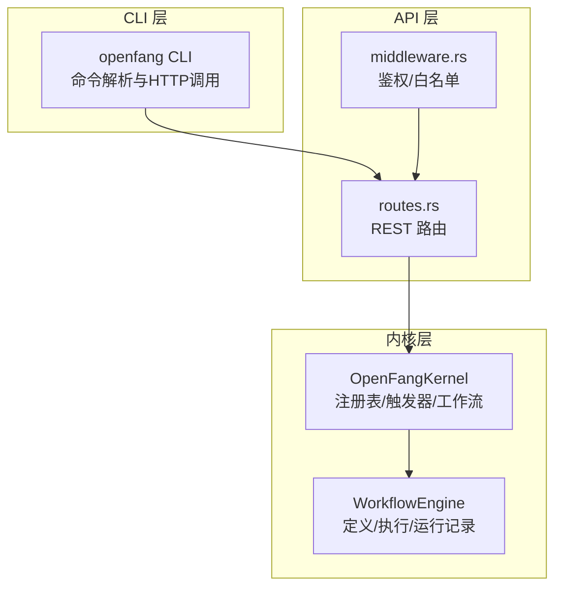
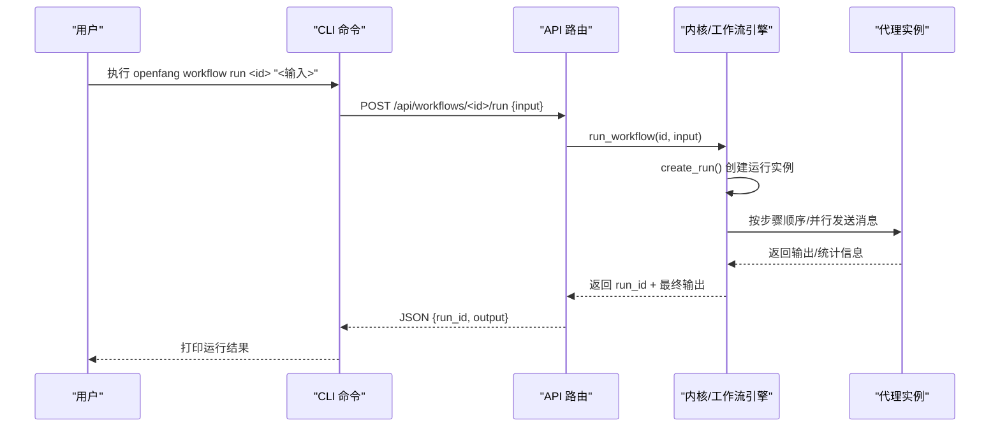
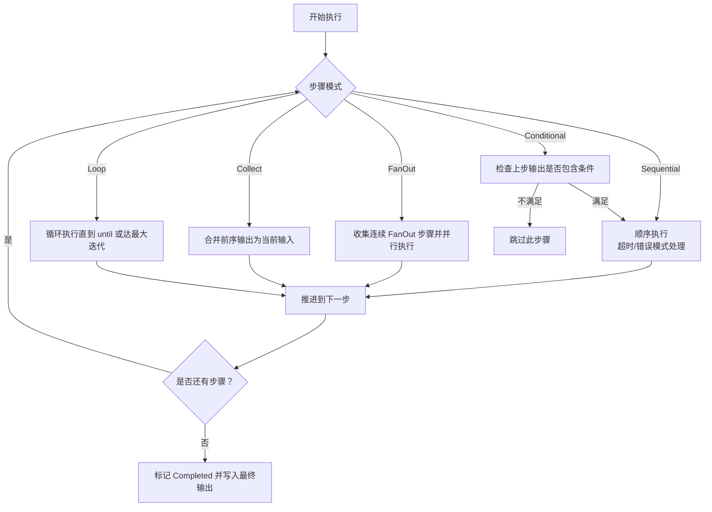
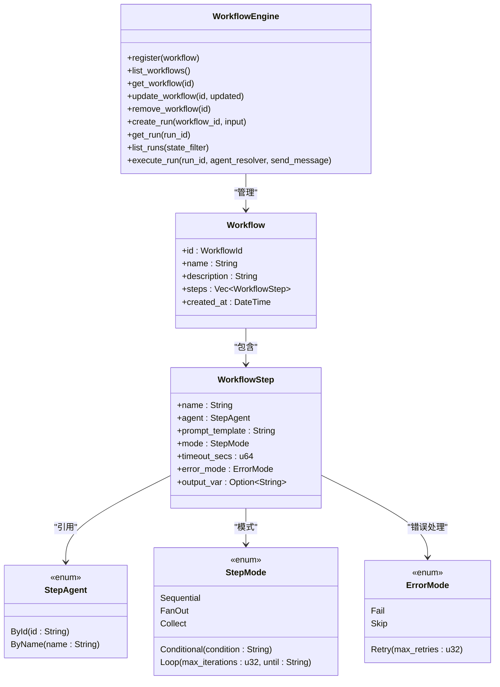
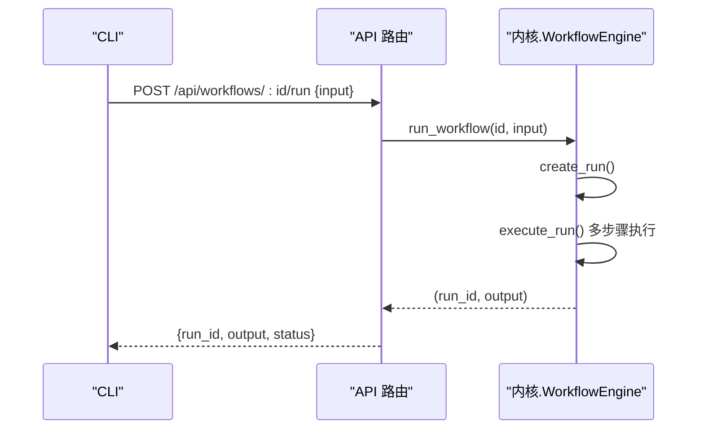
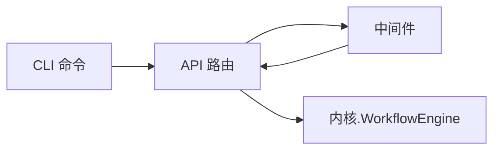

# 工作流管理

<cite>
**本文引用的文件**
- [crates/openfang-cli/src/main.rs](file://crates/openfang-cli/src/main.rs)
- [crates/openfang-api/src/routes.rs](file://crates/openfang-api/src/routes.rs)
- [crates/openfang-api/src/middleware.rs](file://crates/openfang-api/src/middleware.rs)
- [crates/openfang-kernel/src/workflow.rs](file://crates/openfang-kernel/src/workflow.rs)
- [crates/openfang-kernel/tests/workflow_integration_test.rs](file://crates/openfang-kernel/tests/workflow_integration_test.rs)
- [crates/openfang-cli/src/tui/screens/workflows.rs](file://crates/openfang-cli/src/tui/screens/workflows.rs)
- [crates/openfang-api/static/index_body.html](file://crates/openfang-api/static/index_body.html)
</cite>

## 目录
1. [简介](#简介)
2. [项目结构](#项目结构)
3. [核心组件](#核心组件)
4. [架构总览](#架构总览)
5. [详细组件分析](#详细组件分析)
6. [依赖关系分析](#依赖关系分析)
7. [性能考量](#性能考量)
8. [故障排查指南](#故障排查指南)
9. [结论](#结论)
10. [附录](#附录)

## 简介
本文件为 OpenFang 工作流管理命令的权威参考文档，覆盖以下命令与能力：
- 命令：workflow list、workflow create、workflow get、workflow update、workflow delete、workflow run
- 能力：工作流定义、执行、运行历史查询、监控与调试
- 设计：支持顺序、并行（扇出/聚合）、条件跳过、循环迭代、变量存储与复用
- 实践：提供复杂工作流设计模式、错误处理策略与最佳实践

## 项目结构
工作流相关能力由三层协作构成：
- CLI 层：解析命令、调用 API、输出结果
- API 层：REST 接口、请求校验、路由分发
- 内核层：工作流引擎、步骤执行、状态管理、持久化

图表来源
- [crates/openfang-cli/src/main.rs:496-529](file://crates/openfang-cli/src/main.rs#L496-L529)
- [crates/openfang-api/src/routes.rs:873-926](file://crates/openfang-api/src/routes.rs#L873-L926)
- [crates/openfang-api/src/middleware.rs:107-130](file://crates/openfang-api/src/middleware.rs#L107-L130)
- [crates/openfang-kernel/src/workflow.rs:200-206](file://crates/openfang-kernel/src/workflow.rs#L200-L206)

章节来源
- [crates/openfang-cli/src/main.rs:496-529](file://crates/openfang-cli/src/main.rs#L496-L529)
- [crates/openfang-api/src/routes.rs:873-926](file://crates/openfang-api/src/routes.rs#L873-L926)
- [crates/openfang-api/src/middleware.rs:107-130](file://crates/openfang-api/src/middleware.rs#L107-L130)
- [crates/openfang-kernel/src/workflow.rs:200-206](file://crates/openfang-kernel/src/workflow.rs#L200-L206)

## 核心组件
- CLI 工作流命令
  - list：列出所有已注册工作流
  - create：从 JSON 文件创建工作流
  - get：按 ID 获取工作流详情
  - update：按 ID 更新工作流定义
  - delete：按 ID 删除工作流
  - run：按 ID 运行工作流并返回输出
- API 路由
  - GET /api/workflows：列表
  - POST /api/workflows：创建
  - GET /api/workflows/:id：获取
  - PUT /api/workflows/:id：更新
  - DELETE /api/workflows/:id：删除
  - POST /api/workflows/:id/run：运行
  - GET /api/workflows/:id/runs：查询运行历史
- 内核工作流引擎
  - 定义：Workflow、WorkflowStep、StepMode、ErrorMode
  - 执行：create_run、execute_run、状态机、变量扩展
  - 存储：内存中缓存最近运行记录，限制容量

章节来源
- [crates/openfang-cli/src/main.rs:3041-3219](file://crates/openfang-cli/src/main.rs#L3041-L3219)
- [crates/openfang-api/src/routes.rs:873-1086](file://crates/openfang-api/src/routes.rs#L873-L1086)
- [crates/openfang-kernel/src/workflow.rs:66-198](file://crates/openfang-kernel/src/workflow.rs#L66-L198)

## 架构总览
下图展示一次“运行工作流”的端到端流程。

图表来源
- [crates/openfang-cli/src/main.rs:3100-3121](file://crates/openfang-cli/src/main.rs#L3100-L3121)
- [crates/openfang-api/src/routes.rs:891-926](file://crates/openfang-api/src/routes.rs#L891-L926)
- [crates/openfang-kernel/src/workflow.rs:266-314](file://crates/openfang-kernel/src/workflow.rs#L266-L314)

## 详细组件分析

### CLI 命令参考
- workflow list
  - 语法：openfang workflow list
  - 行为：向 /api/workflows 发起 GET 请求，打印表格化的 ID、名称、步骤数、创建时间
  - 输出字段：ID、NAME、STEPS、CREATED
- workflow create
  - 语法：openfang workflow create <文件路径>
  - 行为：读取 JSON 文件，POST 到 /api/workflows；成功返回 workflow_id
  - 输入要求：JSON 包含 name、description、steps 数组
- workflow get
  - 语法：openfang workflow get <ID>
  - 行为：GET /api/workflows/<ID>，打印基本信息与步骤明细
- workflow update
  - 语法：openfang workflow update <ID> <文件路径>
  - 行为：PUT /api/workflows/<ID>，替换定义（保留创建时间）
- workflow delete
  - 语法：openfang workflow delete <ID>
  - 行为：DELETE /api/workflows/<ID>，返回 removed 状态
- workflow run
  - 语法：openfang workflow run <ID> "<输入文本>"
  - 行为：POST /api/workflows/<ID>/run，返回 run_id 与 output

章节来源
- [crates/openfang-cli/src/main.rs:3041-3219](file://crates/openfang-cli/src/main.rs#L3041-L3219)

### API 路由与数据模型
- 列表/创建/获取/更新/删除
  - GET /api/workflows：返回数组，每项含 id、name、steps 长度、created_at
  - POST /api/workflows：创建并持久化到磁盘（默认目录），返回 workflow_id
  - GET /api/workflows/:id：返回完整定义（含 steps）
  - PUT /api/workflows/:id：更新 name/description/steps
  - DELETE /api/workflows/:id：删除定义
- 运行与历史
  - POST /api/workflows/:id/run：执行并返回 run_id、output
  - GET /api/workflows/:id/runs：返回该工作流运行历史摘要
- 步骤定义要点
  - 支持按 agent_id 或 agent_name 引用代理
  - 支持模式：sequential、fan_out、collect、conditional、loop
  - 支持错误模式：fail、skip、retry
  - 支持超时与变量输出（output_var）用于后续步骤模板

章节来源
- [crates/openfang-api/src/routes.rs:873-1086](file://crates/openfang-api/src/routes.rs#L873-L1086)

### 内核工作流引擎
- 数据模型
  - Workflow：id、name、description、steps、created_at
  - WorkflowStep：name、agent（by-id/by-name）、prompt_template、mode、timeout_secs、error_mode、output_var
  - StepMode：Sequential、FanOut、Collect、Conditional、Loop
  - ErrorMode：Fail、Skip、Retry
  - WorkflowRun：run_id、workflow_id、state、step_results、output、error、时间戳
- 执行流程
  - create_run：初始化 Pending，插入运行记录，容量超过上限时按最早完成/失败淘汰
  - execute_run：按步骤执行，支持：
    - Sequential：顺序执行，支持超时与错误模式
    - FanOut：并行执行多个连续 FanOut 步骤，Collect 后合并
    - Conditional：根据上一步输出是否包含条件决定是否执行
    - Loop：重复执行直到满足 until 条件或达到最大迭代次数
  - 变量扩展：模板中可使用 {{input}} 与 {{var_name}}，变量来自先前步骤的 output_var
- 错误处理
  - Fail：直接失败并标记 Failed
  - Skip：忽略错误并继续
  - Retry：最多重试 N 次，最终失败则终止

图表来源
- [crates/openfang-kernel/src/workflow.rs:430-797](file://crates/openfang-kernel/src/workflow.rs#L430-L797)

章节来源
- [crates/openfang-kernel/src/workflow.rs:66-198](file://crates/openfang-kernel/src/workflow.rs#L66-L198)
- [crates/openfang-kernel/src/workflow.rs:430-797](file://crates/openfang-kernel/src/workflow.rs#L430-L797)

### 类型与关系图

图表来源
- [crates/openfang-kernel/src/workflow.rs:66-198](file://crates/openfang-kernel/src/workflow.rs#L66-L198)
- [crates/openfang-kernel:200-206](file://crates/openfang-kernel/src/workflow.rs#L200-L206)

### API 调用序列（以 run 为例）

图表来源
- [crates/openfang-cli/src/main.rs:3100-3121](file://crates/openfang-cli/src/main.rs#L3100-L3121)
- [crates/openfang-api/src/routes.rs:891-926](file://crates/openfang-api/src/routes.rs#L891-L926)

### TUI 与 Web 界面
- TUI 屏幕：提供工作流列表、运行历史、创建向导、运行输入与结果展示
- Web 仪表板：提供可视化工作流画布、导出/保存、自动布局等

章节来源
- [crates/openfang-cli/src/tui/screens/workflows.rs:1-706](file://crates/openfang-cli/src/tui/screens/workflows.rs#L1-L706)
- [crates/openfang-api/static/index_body.html:1377-1517](file://crates/openfang-api/static/index_body.html#L1377-L1517)

## 依赖关系分析
- CLI 依赖 API 层提供的 REST 接口
- API 层依赖内核的 WorkflowEngine 提供执行与状态管理
- 中间件对 /api/workflows 的访问进行白名单控制

图表来源
- [crates/openfang-cli/src/main.rs:3041-3219](file://crates/openfang-cli/src/main.rs#L3041-L3219)
- [crates/openfang-api/src/routes.rs:873-1086](file://crates/openfang-api/src/routes.rs#L873-L1086)
- [crates/openfang-api/src/middleware.rs:107-130](file://crates/openfang-api/src/middleware.rs#L107-L130)

章节来源
- [crates/openfang-api/src/middleware.rs:107-130](file://crates/openfang-api/src/middleware.rs#L107-L130)

## 性能考量
- 步骤超时：每个步骤可配置超时，避免阻塞
- 并行扇出：FanOut 模式可显著缩短长链路时间，但需注意资源与并发限制
- 运行记录容量：默认保留一定数量的历史运行记录，超出后按最早完成/失败淘汰，降低内存占用
- 变量复用：通过 output_var 将中间结果注入后续步骤模板，减少重复计算

## 故障排查指南
- 常见错误
  - 无效 ID：API 对 ID 解析失败会返回错误
  - 缺少 steps：更新/创建时未提供 steps 数组将被拒绝
  - 代理不可达：StepAgent 无法解析（by-id/by-name）导致执行失败
  - 超时/错误：根据 ErrorMode 决定 Fail/Skip/Retry
- 调试建议
  - 使用 workflow get 查看完整定义与步骤
  - 使用 workflow runs 查询运行历史，定位失败步骤
  - 在 CLI 中开启更详细日志（daemon 日志级别）
  - 分步验证：先用最小 steps 验证通路，再逐步增加复杂度

章节来源
- [crates/openfang-api/src/routes.rs:950-1086](file://crates/openfang-api/src/routes.rs#L950-L1086)
- [crates/openfang-kernel/src/workflow.rs:351-428](file://crates/openfang-kernel/src/workflow.rs#L351-L428)

## 结论
OpenFang 的工作流体系以清晰的数据模型与稳健的执行引擎为核心，结合 CLI、API 与可视化界面，提供了从定义、执行到监控的完整闭环。通过合理选择 StepMode 与 ErrorMode，并善用变量与并行扇出，可在保证可靠性的同时提升吞吐与响应速度。

## 附录

### 命令语法与参数速查
- openfang workflow list
  - 无参数
- openfang workflow create <文件路径>
  - file：JSON 文件路径（包含 name、description、steps）
- openfang workflow get <ID>
  - workflow_id：工作流 UUID
- openfang workflow update <ID> <文件路径>
  - workflow_id：工作流 UUID
  - file：JSON 文件（同 create）
- openfang workflow delete <ID>
  - workflow_id：工作流 UUID
- openfang workflow run <ID> "<输入>"
  - workflow_id：工作流 UUID
  - input：输入文本（JSON 或纯文本）

章节来源
- [crates/openfang-cli/src/main.rs:496-529](file://crates/openfang-cli/src/main.rs#L496-L529)
- [crates/openfang-cli/src/main.rs:3065-3219](file://crates/openfang-cli/src/main.rs#L3065-L3219)

### 工作流设计模式与最佳实践
- 设计模式
  - 分层流水线：将复杂任务拆分为分析、生成、校验等阶段
  - 并行扇出：对独立子任务并行处理，最后在 Collect 合并
  - 条件分支：基于前置输出动态决定后续步骤
  - 循环迭代：对需要反复精炼的任务设置 until 条件与最大迭代
- 最佳实践
  - 明确超时：为高风险步骤设置合理超时
  - 错误策略：对关键步骤使用 Fail，对非关键步骤使用 Skip/Retry
  - 变量命名：使用语义化 output_var，便于后续模板引用
  - 可观测性：记录关键中间结果，便于 run 历史回溯

章节来源
- [crates/openfang-kernel/src/workflow.rs:117-145](file://crates/openfang-kernel/src/workflow.rs#L117-L145)
- [crates/openfang-kernel/src/workflow.rs:430-797](file://crates/openfang-kernel/src/workflow.rs#L430-L797)

### 端到端集成测试要点
- 注册与解析：验证 by-id/by-name 的代理解析
- 执行链路：确保输出从 step1 流向 step2
- 运行记录：确认 run 状态、步骤数、token 使用
- E2E LLM：在具备密钥时验证真实模型调用

章节来源
- [crates/openfang-kernel/tests/workflow_integration_test.rs:63-404](file://crates/openfang-kernel/tests/workflow_integration_test.rs#L63-L404)