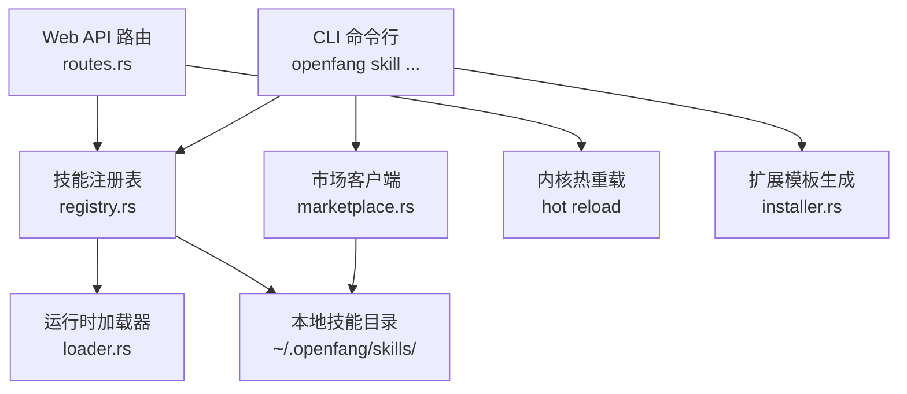
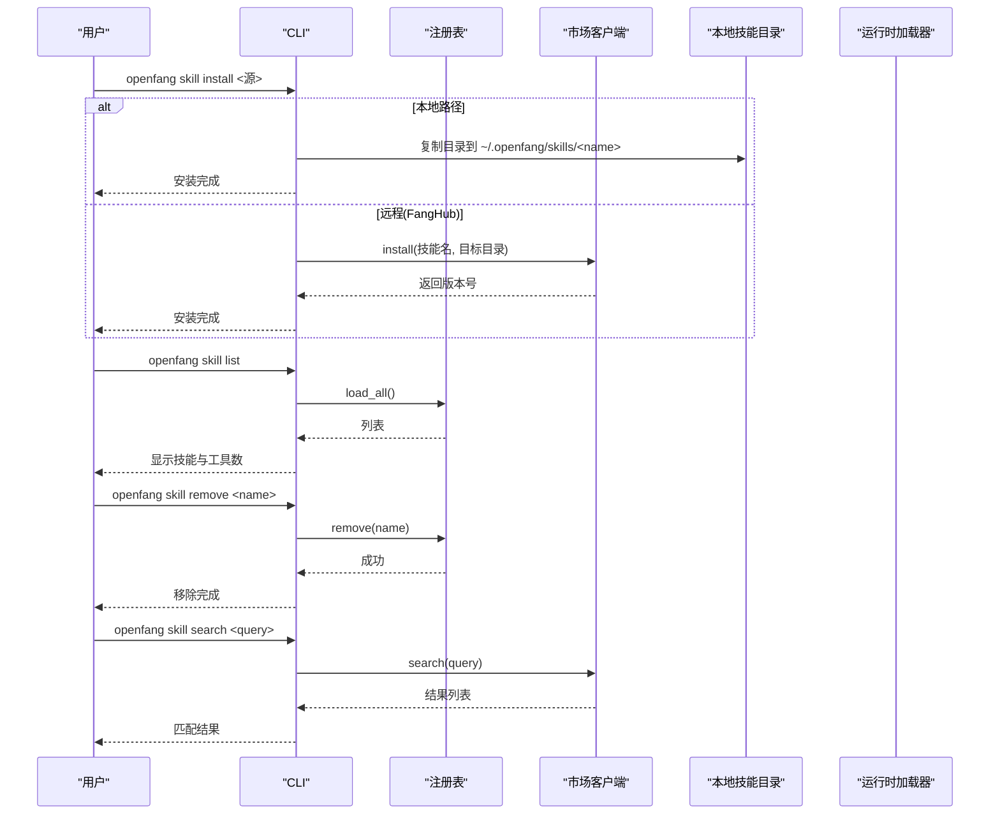
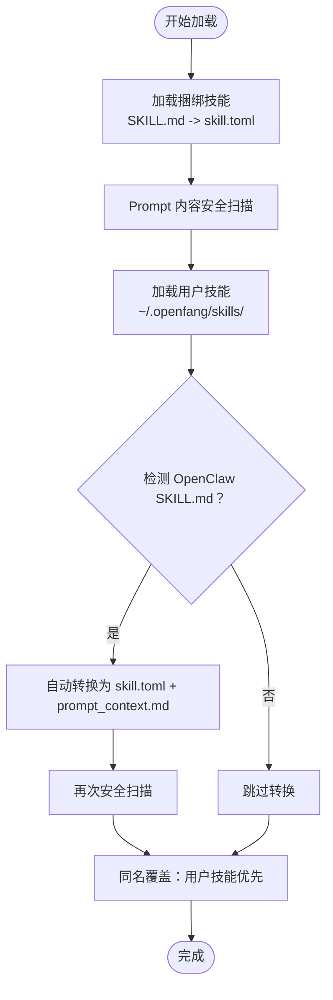
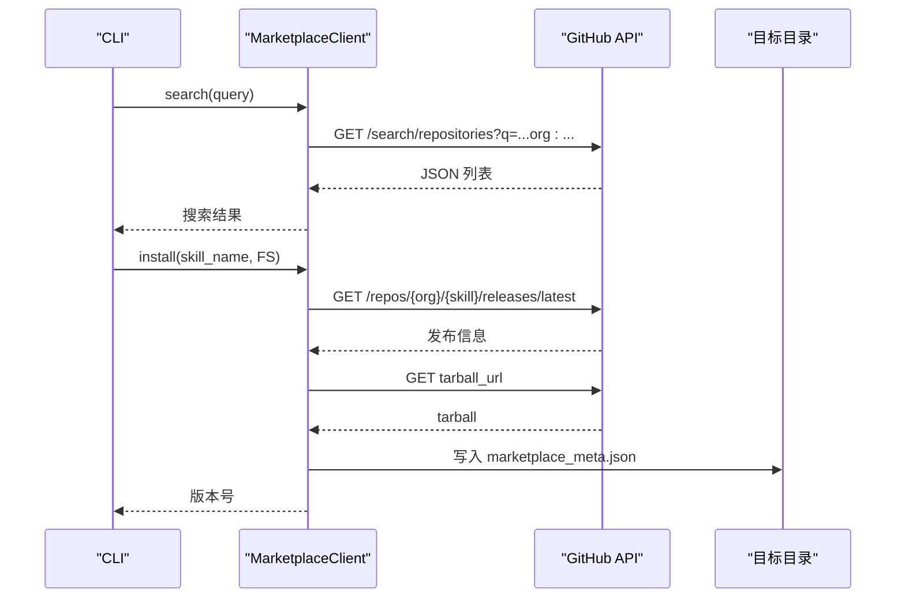
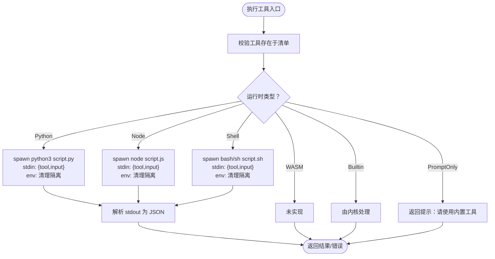
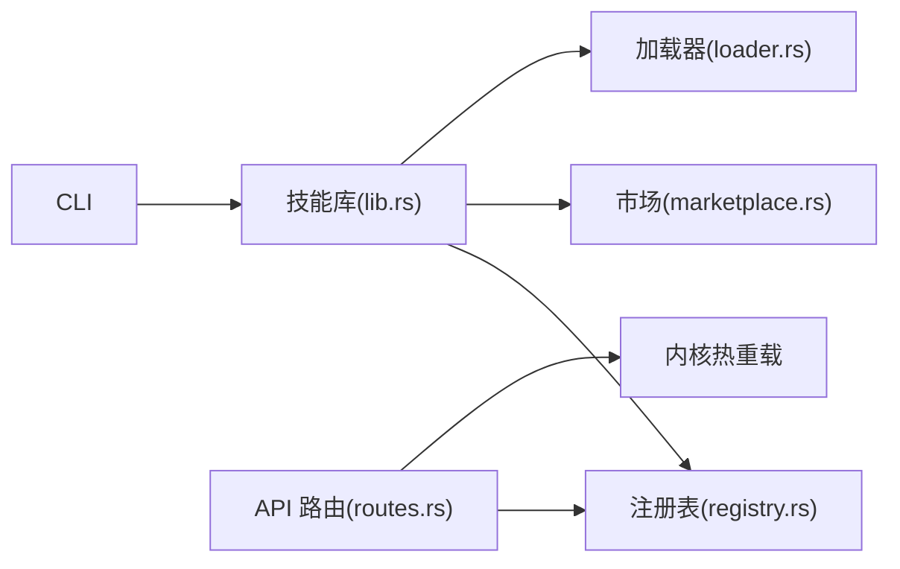

# 技能管理

<cite>
**本文引用的文件**   
- [crates/openfang-cli/src/main.rs](file://crates/openfang-cli/src/main.rs)
- [crates/openfang-skills/src/lib.rs](file://crates/openfang-skills/src/lib.rs)
- [crates/openfang-skills/src/registry.rs](file://crates/openfang-skills/src/registry.rs)
- [crates/openfang-skills/src/marketplace.rs](file://crates/openfang-skills/src/marketplace.rs)
- [crates/openfang-skills/src/loader.rs](file://crates/openfang-skills/src/loader.rs)
- [crates/openfang-api/src/routes.rs](file://crates/openfang-api/src/routes.rs)
- [crates/openfang-api/src/channel_bridge.rs](file://crates/openfang-api/src/channel_bridge.rs)
- [crates/openfang-extensions/src/installer.rs](file://crates/openfang-extensions/src/installer.rs)
- [crates/openfang-skills/bundled/web-search/SKILL.md](file://crates/openfang-skills/bundled/web-search/SKILL.md)
- [crates/openfang-skills/bundled/docker/SKILL.md](file://crates/openfang-skills/bundled/docker/SKILL.md)
- [crates/openfang-skills/bundled/code-reviewer/SKILL.md](file://crates/openfang-skills/bundled/code-reviewer/SKILL.md)
- [crates/openfang-skills/bundled/ansible/SKILL.md](file://crates/openfang-skills/bundled/ansible/SKILL.md)
</cite>

## 目录
1. [简介](#简介)
2. [项目结构](#项目结构)
3. [核心组件](#核心组件)
4. [架构总览](#架构总览)
5. [详细组件分析](#详细组件分析)
6. [依赖关系分析](#依赖关系分析)
7. [性能考量](#性能考量)
8. [故障排查指南](#故障排查指南)
9. [结论](#结论)
10. [附录](#附录)

## 简介
本文件为 OpenFang 技能管理命令的权威参考，覆盖以下内容：
- 技能命令：skill install、skill list、skill remove、skill search、skill create 的完整语法、参数与使用示例
- 技能注册表与加载机制：本地安装、捆绑技能、OpenClaw 兼容转换、安全扫描与覆盖规则
- FangHub 市场：搜索与安装流程、网络请求与错误处理
- 技能开发与自定义扩展：模板生成、提示型技能编写、运行时执行与隔离
- 架构与开发流程：从 CLI 到内核、API、市场与运行时的协作关系
- 实战场景与最佳实践：安装、调试、版本与安全策略

## 项目结构
OpenFang 技能系统由多 crate 协同实现，关键模块如下：
- CLI 层：解析 skill 子命令并调用具体逻辑
- 技能核心层：数据模型、注册表、市场客户端、运行时加载器
- API 层：HTTP 接口支持技能卸载与市场搜索
- 扩展层：提供技能与集成模板的脚手架能力

图表来源
- [crates/openfang-cli/src/main.rs](file://crates/openfang-cli/src/main.rs)
- [crates/openfang-skills/src/registry.rs](file://crates/openfang-skills/src/registry.rs)
- [crates/openfang-skills/src/marketplace.rs](file://crates/openfang-skills/src/marketplace.rs)
- [crates/openfang-skills/src/loader.rs](file://crates/openfang-skills/src/loader.rs)
- [crates/openfang-api/src/routes.rs](file://crates/openfang-api/src/routes.rs)
- [crates/openfang-extensions/src/installer.rs](file://crates/openfang-extensions/src/installer.rs)

章节来源
- [crates/openfang-cli/src/main.rs](file://crates/openfang-cli/src/main.rs)
- [crates/openfang-skills/src/registry.rs](file://crates/openfang-skills/src/registry.rs)
- [crates/openfang-skills/src/marketplace.rs](file://crates/openfang-skills/src/marketplace.rs)
- [crates/openfang-skills/src/loader.rs](file://crates/openfang-skills/src/loader.rs)
- [crates/openfang-api/src/routes.rs](file://crates/openfang-api/src/routes.rs)
- [crates/openfang-extensions/src/installer.rs](file://crates/openfang-extensions/src/installer.rs)

## 核心组件
- 技能清单与元数据：技能名称、版本、描述、作者、许可证、标签等
- 运行时类型：Python、WASM、Node、Shell、Builtin、PromptOnly
- 工具定义：工具名、描述、输入模式（JSON Schema）
- 注册表：加载、覆盖、移除、查询工具提供者
- 市场客户端：基于 GitHub Releases 的搜索与安装
- 运行时加载器：按运行时类型执行脚本，隔离环境变量，捕获输出
- 安全验证：对 PromptOnly 内容进行注入风险扫描

章节来源
- [crates/openfang-skills/src/lib.rs](file://crates/openfang-skills/src/lib.rs)
- [crates/openfang-skills/src/registry.rs](file://crates/openfang-skills/src/registry.rs)
- [crates/openfang-skills/src/marketplace.rs](file://crates/openfang-skills/src/marketplace.rs)
- [crates/openfang-skills/src/loader.rs](file://crates/openfang-skills/src/loader.rs)

## 架构总览
技能系统围绕“清单驱动 + 运行时隔离”的设计展开：
- 清单（skill.toml 或 SKILL.md）定义技能元信息、运行时与工具
- 注册表负责发现、加载与覆盖（用户安装覆盖捆绑技能）
- 市场用于远程安装，下载发布包并写入元数据
- 运行时加载器根据运行时类型启动子进程，传递 JSON 输入，读取 JSON 输出
- API 提供卸载与市场搜索接口，配合内核热重载

图表来源
- [crates/openfang-cli/src/main.rs](file://crates/openfang-cli/src/main.rs)
- [crates/openfang-skills/src/registry.rs](file://crates/openfang-skills/src/registry.rs)
- [crates/openfang-skills/src/marketplace.rs](file://crates/openfang-skills/src/marketplace.rs)

## 详细组件分析

### 命令参考：skill install
- 语法
  - openfang skill install <源>
  - 源可为：本地路径、Git URL、或 FangHub 技能名
- 行为
  - 本地源：复制目录至 ~/.openfang/skills/<技能名>，读取 skill.toml 获取名称与版本
  - 远程源：通过市场客户端拉取最新发布（GitHub Releases），保存元数据
- 选项
  - 无全局选项；具体行为取决于源类型
- 使用示例
  - 安装本地技能：openfang skill install ./my-skill
  - 从 FangHub 安装：openfang skill install web-search
- 注意事项
  - 若本地已存在同名技能，将被覆盖（注册表策略）
  - 远程安装后需重启或热重载以生效

章节来源
- [crates/openfang-cli/src/main.rs](file://crates/openfang-cli/src/main.rs)
- [crates/openfang-skills/src/marketplace.rs](file://crates/openfang-skills/src/marketplace.rs)

### 命令参考：skill list
- 语法
  - openfang skill list
- 行为
  - 加载所有技能（含捆绑与用户安装），打印名称、版本、工具数量与描述
- 使用示例
  - openfang skill list
- 输出要点
  - 当无技能时提示“未安装任何技能”
  - 已禁用技能在注册表中可通过标志位控制显示

章节来源
- [crates/openfang-cli/src/main.rs](file://crates/openfang-cli/src/main.rs)
- [crates/openfang-api/src/channel_bridge.rs](file://crates/openfang-api/src/channel_bridge.rs)

### 命令参考：skill remove
- 语法
  - openfang skill remove <名称>
- 行为
  - 从注册表移除并删除对应目录
  - 调用内核热重载，使代理不再可见该技能
- 使用示例
  - openfang skill remove web-search
- 错误处理
  - 未找到技能返回错误并退出

章节来源
- [crates/openfang-cli/src/main.rs](file://crates/openfang-cli/src/main.rs)
- [crates/openfang-api/src/routes.rs](file://crates/openfang-api/src/routes.rs)

### 命令参考：skill search
- 语法
  - openfang skill search <查询词>
- 行为
  - 调用市场客户端搜索 FangHub 技能仓库，按星数排序
- 使用示例
  - openfang skill search docker
- 输出要点
  - 无结果时提示“未找到匹配技能”
  - 结果包含名称、星数、描述与仓库链接

章节来源
- [crates/openfang-cli/src/main.rs](file://crates/openfang-cli/src/main.rs)
- [crates/openfang-skills/src/marketplace.rs](file://crates/openfang-skills/src/marketplace.rs)

### 命令参考：skill create
- 语法
  - openfang skill create
- 行为
  - 交互式引导：名称、描述、运行时（默认 Python）
  - 在 ~/.openfang/skills/<名称>/ 下创建 src 目录
- 使用示例
  - openfang skill create
- 后续步骤
  - 编写 skill.toml 与运行脚本（Python/Node/Shell）
  - 将技能安装到本地目录并测试

章节来源
- [crates/openfang-cli/src/main.rs](file://crates/openfang-cli/src/main.rs)

### 技能注册表与加载机制
- 加载顺序
  - 首先加载捆绑技能（编译期嵌入的 SKILL.md）
  - 再加载用户安装目录中的技能（自动转换 OpenClaw 的 SKILL.md）
  - 用户安装可覆盖同名捆绑技能
- 安全扫描
  - 对 PromptOnly 内容进行注入风险扫描，阻断高危威胁
- 工具查询
  - 支持按技能名查询工具定义，或列出全部可用工具
- 工作区技能
  - 支持工作区 scoped 技能覆盖全局技能

图表来源
- [crates/openfang-skills/src/registry.rs](file://crates/openfang-skills/src/registry.rs)

章节来源
- [crates/openfang-skills/src/registry.rs](file://crates/openfang-skills/src/registry.rs)

### FangHub 市场
- 搜索
  - 基于 GitHub 搜索 API，限定组织与排序
- 安装
  - 获取最新发布（tarball_url），保存元数据文件
  - 不直接解压 tarball，仅记录来源信息
- 错误处理
  - 网络失败、状态码非成功、解析失败均转为统一错误类型

图表来源
- [crates/openfang-skills/src/marketplace.rs](file://crates/openfang-skills/src/marketplace.rs)

章节来源
- [crates/openfang-skills/src/marketplace.rs](file://crates/openfang-skills/src/marketplace.rs)

### 运行时加载与执行
- 支持运行时
  - Python、Node、Shell、WASM（预留）、Builtin（内核直连）、PromptOnly（提示型）
- 执行流程
  - 构造 JSON 负载（包含工具名与输入），写入子进程 stdin
  - 清理环境变量，仅保留必要项，避免凭据泄露
  - 解析 stdout 为 JSON；失败时返回错误对象
- PromptOnly 特殊处理
  - 不执行外部脚本，返回提示信息，指导使用内置工具

图表来源
- [crates/openfang-skills/src/loader.rs](file://crates/openfang-skills/src/loader.rs)

章节来源
- [crates/openfang-skills/src/loader.rs](file://crates/openfang-skills/src/loader.rs)

### 技能开发与模板
- 模板生成
  - openfang new skill 生成基础 skill.toml 与 SKILL.md
  - 也可通过扩展层的 scaffolding 生成
- 开发建议
  - PromptOnly：使用 SKILL.md 描述角色与原则，不写可执行代码
  - 可执行技能：遵循输入/输出 JSON 规范，严格校验输入模式
  - 安全：避免在运行时读取宿主敏感环境变量
- 示例技能
  - web-search：研究与检索专家
  - docker：容器与 Compose 专家
  - code-reviewer：代码审查专家
  - ansible：自动化专家

章节来源
- [crates/openfang-extensions/src/installer.rs](file://crates/openfang-extensions/src/installer.rs)
- [crates/openfang-skills/bundled/web-search/SKILL.md](file://crates/openfang-skills/bundled/web-search/SKILL.md)
- [crates/openfang-skills/bundled/docker/SKILL.md](file://crates/openfang-skills/bundled/docker/SKILL.md)
- [crates/openfang-skills/bundled/code-reviewer/SKILL.md](file://crates/openfang-skills/bundled/code-reviewer/SKILL.md)
- [crates/openfang-skills/bundled/ansible/SKILL.md](file://crates/openfang-skills/bundled/ansible/SKILL.md)

## 依赖关系分析
- CLI 依赖技能库：命令解析、注册表、市场客户端
- 注册表依赖：捆绑技能、OpenClaw 兼容转换、安全验证
- 市场客户端依赖：HTTP 客户端、GitHub API
- 运行时加载器依赖：各语言运行时二进制查找与隔离
- API 依赖：注册表与内核热重载

图表来源
- [crates/openfang-cli/src/main.rs](file://crates/openfang-cli/src/main.rs)
- [crates/openfang-skills/src/lib.rs](file://crates/openfang-skills/src/lib.rs)
- [crates/openfang-skills/src/registry.rs](file://crates/openfang-skills/src/registry.rs)
- [crates/openfang-skills/src/marketplace.rs](file://crates/openfang-skills/src/marketplace.rs)
- [crates/openfang-skills/src/loader.rs](file://crates/openfang-skills/src/loader.rs)
- [crates/openfang-api/src/routes.rs](file://crates/openfang-api/src/routes.rs)

章节来源
- [crates/openfang-cli/src/main.rs](file://crates/openfang-cli/src/main.rs)
- [crates/openfang-skills/src/lib.rs](file://crates/openfang-skills/src/lib.rs)
- [crates/openfang-skills/src/registry.rs](file://crates/openfang-skills/src/registry.rs)
- [crates/openfang-skills/src/marketplace.rs](file://crates/openfang-skills/src/marketplace.rs)
- [crates/openfang-skills/src/loader.rs](file://crates/openfang-skills/src/loader.rs)
- [crates/openfang-api/src/routes.rs](file://crates/openfang-api/src/routes.rs)

## 性能考量
- 加载性能
  - 捆绑技能一次性嵌入，减少磁盘 IO；用户技能按需加载
  - 自动转换 OpenClaw 技能仅在首次发现时发生
- 执行性能
  - 子进程隔离带来额外开销；建议复用长生命周期进程（未来可选）
  - PromptOnly 技能零执行开销，仅影响提示注入
- 网络性能
  - 市场搜索与安装受网络与 GitHub API 限制；建议缓存常用技能

## 故障排查指南
- 安装失败
  - 本地路径不存在或权限不足：检查路径与权限
  - 远程安装：确认网络可达与 GitHub API 正常
- 加载失败
  - skill.toml 解析错误：检查 TOML 语法与字段完整性
  - OpenClaw 转换失败：确认 SKILL.md 格式正确
- 执行失败
  - 运行时未找到：安装 Python/Node/Bash 并确保在 PATH
  - 子进程返回非零：查看 stderr 输出定位问题
- 卸载无效
  - 确认内核已热重载；重新启动服务或触发重载

章节来源
- [crates/openfang-skills/src/loader.rs](file://crates/openfang-skills/src/loader.rs)
- [crates/openfang-skills/src/marketplace.rs](file://crates/openfang-skills/src/marketplace.rs)
- [crates/openfang-api/src/routes.rs](file://crates/openfang-api/src/routes.rs)

## 结论
OpenFang 技能系统通过“清单驱动 + 运行时隔离 + 市场分发”实现了灵活、安全与可扩展的能力扩展。开发者可快速生成模板、编写 PromptOnly 或可执行技能，并通过 CLI 与 API 完成安装、管理与调试。建议在生产环境中启用 PromptOnly 优先策略，严格控制运行时环境变量，定期更新市场技能并进行安全扫描。

## 附录

### 常用实战场景与最佳实践
- 快速试用
  - openfang skill search docker → openfang skill install docker
- 本地开发
  - openfang skill create → 编写 skill.toml 与运行脚本 → openfang skill install ./my-skill
- 生产安全
  - 优先使用 PromptOnly 技能；对可执行技能进行最小权限与输入校验
  - 定期扫描 PromptOnly 内容，避免注入风险
- 版本与回滚
  - 使用市场安装时关注版本号；必要时手动清理旧版本目录

### 数据模型概览（技能清单关键字段）
- [技能元数据]：名称、版本、描述、作者、许可证、标签
- [运行时配置]：类型（python/node/wasm/shell/builtin/promptonly）、入口文件
- [工具定义]：工具名、描述、输入模式（JSON Schema）
- [需求声明]：所需内置工具、主机能力
- [来源追踪]：原生、捆绑、OpenClaw、FangHub

章节来源
- [crates/openfang-skills/src/lib.rs](file://crates/openfang-skills/src/lib.rs)