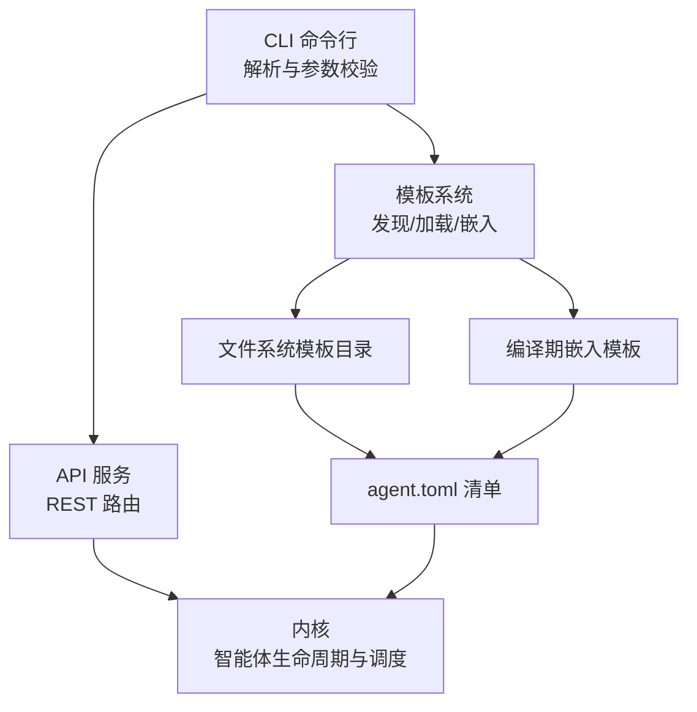
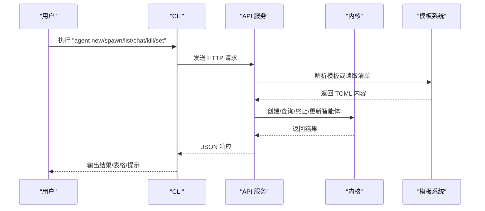
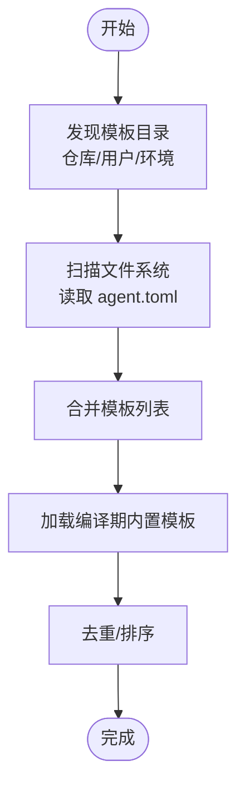
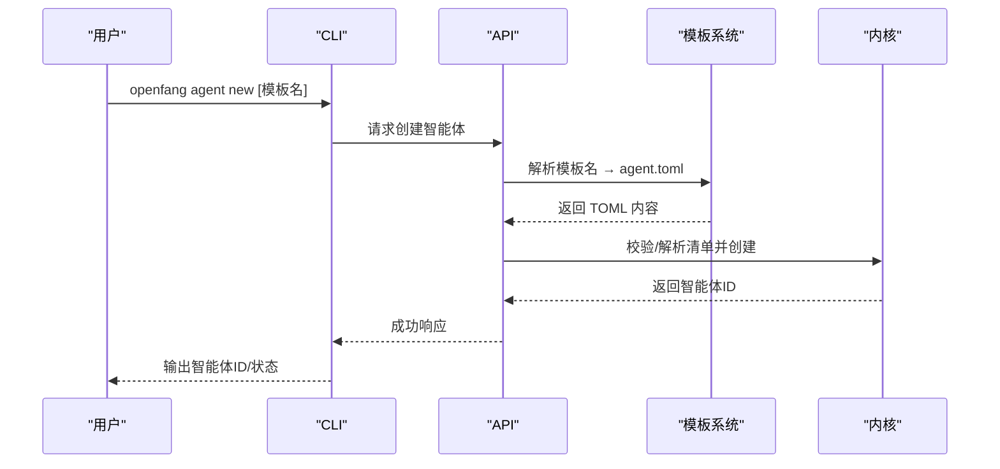
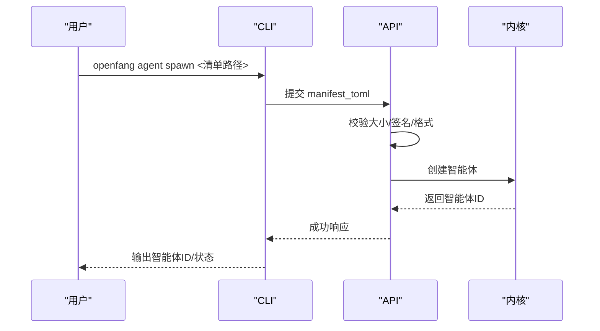
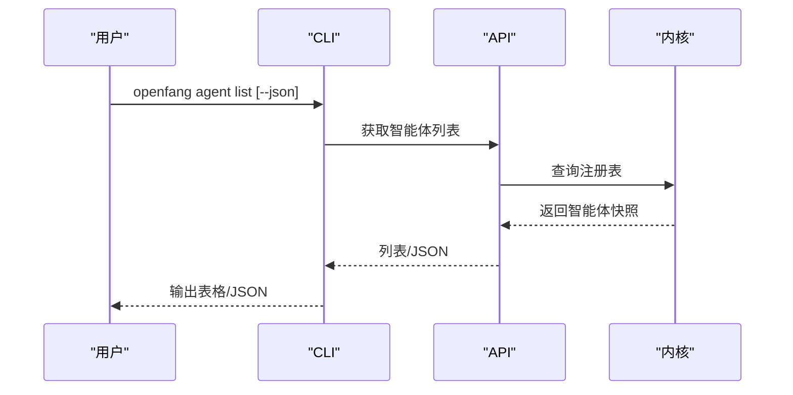
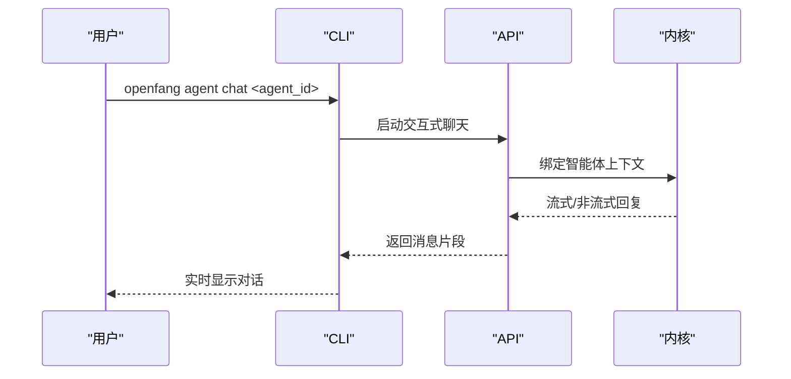
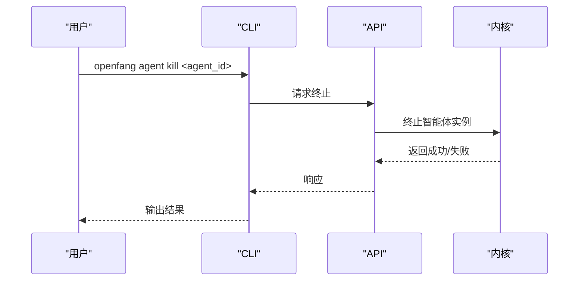
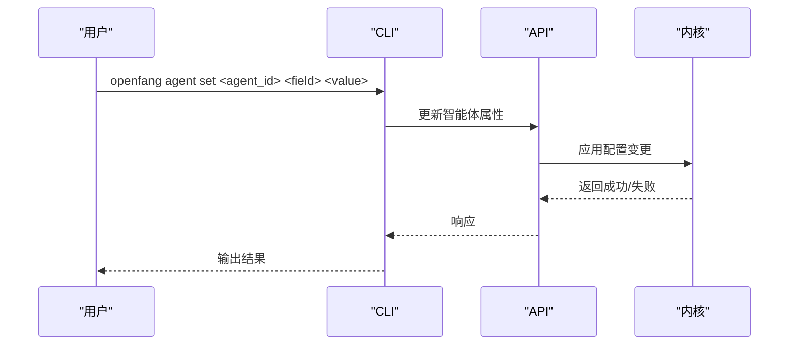
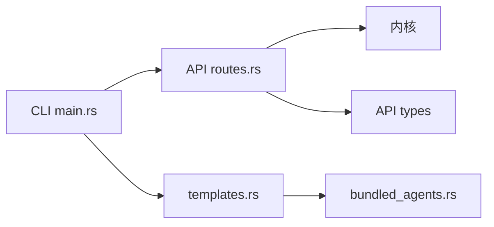

# 智能体管理

<cite>
**本文引用的文件**
- [crates/openfang-cli/src/main.rs](file://crates/openfang-cli/src/main.rs)
- [crates/openfang-cli/src/templates.rs](file://crates/openfang-cli/src/templates.rs)
- [crates/openfang-cli/src/bundled_agents.rs](file://crates/openfang-cli/src/bundled_agents.rs)
- [crates/openfang-api/src/routes.rs](file://crates/openfang-api/src/routes.rs)
- [crates/openfang-api/src/lib.rs](file://crates/openfang-api/src/lib.rs)
- [agents/assistant/agent.toml](file://agents/assistant/agent.toml)
- [agents/coder/agent.toml](file://agents/coder/agent.toml)
- [agents/analyst/agent.toml](file://agents/analyst/agent.toml)
</cite>

## 目录
1. [简介](#简介)
2. [项目结构](#项目结构)
3. [核心组件](#核心组件)
4. [架构总览](#架构总览)
5. [详细组件分析](#详细组件分析)
6. [依赖关系分析](#依赖关系分析)
7. [性能考量](#性能考量)
8. [故障排查指南](#故障排查指南)
9. [结论](#结论)
10. [附录](#附录)

## 简介
本参考文档面向 OpenFang 智能体管理命令，系统性梳理以下内容：
- 命令体系：agent new、agent spawn、agent list、agent chat、agent kill、agent set
- 模板与预设：模板发现、内置模板、用户模板、安装与覆盖策略
- 生命周期管理：创建、运行、交互、终止、配置变更
- 预设与模型：默认模型、别名、提供商、后备模型
- 实战场景与最佳实践：单次与批量操作、自动化脚本建议
- 与 API 层的对接：CLI 如何通过 HTTP 与内核通信

## 项目结构
OpenFang 的智能体管理由 CLI、API 服务与内核共同协作完成：
- CLI 定义命令与参数解析，并在有守护进程时通过 HTTP 调用 API；无守护进程时可单次运行内核。
- API 服务提供 REST 接口，负责代理注册、模板解析、签名验证、资源限制等。
- 内核执行智能体生命周期管理、工具调用、会话与审计日志。

图表来源
- [crates/openfang-cli/src/main.rs:107-494](file://crates/openfang-cli/src/main.rs#L107-L494)
- [crates/openfang-api/src/routes.rs:45-168](file://crates/openfang-api/src/routes.rs#L45-L168)
- [crates/openfang-api/src/lib.rs:1-18](file://crates/openfang-api/src/lib.rs#L1-L18)
- [crates/openfang-cli/src/templates.rs:15-111](file://crates/openfang-cli/src/templates.rs#L15-L111)
- [crates/openfang-cli/src/bundled_agents.rs:7-134](file://crates/openfang-cli/src/bundled_agents.rs#L7-L134)

章节来源
- [crates/openfang-cli/src/main.rs:107-494](file://crates/openfang-cli/src/main.rs#L107-L494)
- [crates/openfang-api/src/routes.rs:45-168](file://crates/openfang-api/src/routes.rs#L45-L168)
- [crates/openfang-cli/src/templates.rs:15-111](file://crates/openfang-cli/src/templates.rs#L15-L111)
- [crates/openfang-cli/src/bundled_agents.rs:7-134](file://crates/openfang-cli/src/bundled_agents.rs#L7-L134)

## 核心组件
- 命令定义与分发：CLI 使用子命令组织 agent 子命令族，统一入口解析与帮助输出。
- 模板系统：支持从文件系统与编译期嵌入模板加载，优先级与去重策略明确。
- API 路由：提供智能体创建、列表、聊天、终止、设置等接口，含安全校验与错误处理。
- 清单规范：agent.toml 描述模型、能力、资源配额、后备模型等关键字段。

章节来源
- [crates/openfang-cli/src/main.rs:107-494](file://crates/openfang-cli/src/main.rs#L107-L494)
- [crates/openfang-cli/src/templates.rs:15-111](file://crates/openfang-cli/src/templates.rs#L15-L111)
- [crates/openfang-api/src/routes.rs:45-168](file://crates/openfang-api/src/routes.rs#L45-L168)
- [agents/assistant/agent.toml:1-82](file://agents/assistant/agent.toml#L1-L82)

## 架构总览
下图展示 CLI 与 API 的交互路径，以及模板加载与清单解析的关键节点。

图表来源
- [crates/openfang-cli/src/main.rs:107-494](file://crates/openfang-cli/src/main.rs#L107-L494)
- [crates/openfang-api/src/routes.rs:45-168](file://crates/openfang-api/src/routes.rs#L45-L168)
- [crates/openfang-cli/src/templates.rs:64-111](file://crates/openfang-cli/src/templates.rs#L64-L111)

## 详细组件分析

### 命令语法与参数总览
- agent new
  - 用途：从模板创建新智能体（交互式或指定模板名）
  - 关键参数：template（可选，模板名）
  - 选项：无
- agent spawn
  - 用途：从本地清单文件直接创建智能体
  - 关键参数：manifest（清单文件路径）
  - 选项：无
- agent list
  - 用途：列出所有运行中的智能体
  - 关键参数：无
  - 选项：json（输出 JSON）
- agent chat
  - 用途：与指定智能体进行交互式聊天
  - 关键参数：agent_id（UUID）
  - 选项：无
- agent kill
  - 用途：终止指定智能体
  - 关键参数：agent_id（UUID）
  - 选项：无
- agent set
  - 用途：设置智能体属性（如模型）
  - 关键参数：agent_id、field、value
  - 选项：无

章节来源
- [crates/openfang-cli/src/main.rs:458-494](file://crates/openfang-cli/src/main.rs#L458-L494)

### 模板系统与预设
- 模板发现顺序
  - 开发模式：从仓库相对路径 agents/ 发现
  - 用户安装：~/.openfang/agents/
  - 环境覆盖：OPENFANG_AGENTS_DIR
- 加载策略
  - 文件系统优先：遍历目录，读取 agent.toml 并提取描述
  - 编译期回退：若磁盘未找到，则使用内置模板集合
  - 去重与排序：按名称去重并排序
- 内置模板
  - 30 个常用智能体模板在编译期嵌入，确保首次使用无需额外安装
  - 支持安装到用户目录，保留用户定制（已存在文件则跳过）

图表来源
- [crates/openfang-cli/src/templates.rs:15-111](file://crates/openfang-cli/src/templates.rs#L15-L111)
- [crates/openfang-cli/src/bundled_agents.rs:7-134](file://crates/openfang-cli/src/bundled_agents.rs#L7-L134)

章节来源
- [crates/openfang-cli/src/templates.rs:15-111](file://crates/openfang-cli/src/templates.rs#L15-L111)
- [crates/openfang-cli/src/bundled_agents.rs:7-134](file://crates/openfang-cli/src/bundled_agents.rs#L7-L134)

### 清单与预设字段
- 基本信息：name、version、description、author、module、tags
- 模型配置：provider、model、api_key_env、max_tokens、temperature、system_prompt、fallback_models
- 资源与能力：resources.max_llm_tokens_per_hour、capabilities.tools/network/memory_read/memory_write/shell/agent_message
- 自主运行：autonomous.max_iterations
- 示例参考：
  - assistant：通用助手，具备多工具与代理委托能力
  - coder：软件工程师，强调实现与测试流程
  - analyst：数据分析师，强调方法论与可视化

章节来源
- [agents/assistant/agent.toml:1-82](file://agents/assistant/agent.toml#L1-L82)
- [agents/coder/agent.toml:1-48](file://agents/coder/agent.toml#L1-L48)
- [agents/analyst/agent.toml:1-50](file://agents/analyst/agent.toml#L1-L50)

### 命令工作流与序列图

#### agent new 工作流

图表来源
- [crates/openfang-cli/src/main.rs:458-463](file://crates/openfang-cli/src/main.rs#L458-L463)
- [crates/openfang-api/src/routes.rs:45-168](file://crates/openfang-api/src/routes.rs#L45-L168)
- [crates/openfang-cli/src/templates.rs:64-111](file://crates/openfang-cli/src/templates.rs#L64-L111)

#### agent spawn 工作流

图表来源
- [crates/openfang-cli/src/main.rs:464-468](file://crates/openfang-cli/src/main.rs#L464-L468)
- [crates/openfang-api/src/routes.rs:45-168](file://crates/openfang-api/src/routes.rs#L45-L168)

#### agent list 工作流

图表来源
- [crates/openfang-cli/src/main.rs:469-474](file://crates/openfang-cli/src/main.rs#L469-L474)
- [crates/openfang-api/src/routes.rs:170-200](file://crates/openfang-api/src/routes.rs#L170-L200)

#### agent chat 工作流

图表来源
- [crates/openfang-cli/src/main.rs:475-479](file://crates/openfang-cli/src/main.rs#L475-L479)
- [crates/openfang-api/src/lib.rs:1-18](file://crates/openfang-api/src/lib.rs#L1-L18)

#### agent kill 工作流

图表来源
- [crates/openfang-cli/src/main.rs:480-484](file://crates/openfang-cli/src/main.rs#L480-L484)
- [crates/openfang-api/src/routes.rs:170-200](file://crates/openfang-api/src/routes.rs#L170-L200)

#### agent set 工作流

图表来源
- [crates/openfang-cli/src/main.rs:485-493](file://crates/openfang-cli/src/main.rs#L485-L493)
- [crates/openfang-api/src/routes.rs:170-200](file://crates/openfang-api/src/routes.rs#L170-L200)

### 智能体生命周期管理
- 创建阶段：模板解析/清单校验 → 内核注册 → 路由器登记
- 运行阶段：上下文维护、工具调用、会话持久化、审计日志
- 终止阶段：清理资源、注销路由、释放句柄
- 变更阶段：仅允许白名单字段更新，避免破坏运行时一致性

章节来源
- [crates/openfang-api/src/routes.rs:45-168](file://crates/openfang-api/src/routes.rs#L45-L168)

### 配置修改与模型预设
- 默认模型与别名：可通过 models list/aliases/providers 与 models set 管理
- 智能体清单内的模型字段可覆盖默认值，支持后备模型以提升可用性
- 能力与资源：tools/network/memory_*/shell 等权限需谨慎配置，避免过度放权

章节来源
- [crates/openfang-cli/src/main.rs:560-587](file://crates/openfang-cli/src/main.rs#L560-L587)
- [agents/assistant/agent.toml:63-82](file://agents/assistant/agent.toml#L63-L82)
- [agents/coder/agent.toml:33-48](file://agents/coder/agent.toml#L33-L48)
- [agents/analyst/agent.toml:36-50](file://agents/analyst/agent.toml#L36-L50)

### 交互式聊天与会话
- CLI 通过 agent chat 进入交互模式，实时接收内核返回的消息片段
- 支持 JSON 输出用于脚本集成（如 --json）

章节来源
- [crates/openfang-cli/src/main.rs:475-479](file://crates/openfang-cli/src/main.rs#L475-L479)

### 批量操作与自动化脚本建议
- 批量创建：循环调用 agent spawn/new，结合 --json 输出解析 agent_id
- 批量终止：先 agent list 获取列表，再循环 agent kill
- 自动化：结合环境变量 OPENFANG_HOME、OPENFANG_AGENTS_DIR 控制模板位置
- 错误处理：对 HTTP 4xx/5xx 做重试与告警，对 413/422 做参数修正

[本节为通用实践建议，不直接分析具体文件，故无章节来源]

## 依赖关系分析
- CLI 依赖模板系统与 API 类型
- API 依赖内核与类型定义
- 模板系统依赖文件系统与编译期嵌入

图表来源
- [crates/openfang-cli/src/main.rs:107-494](file://crates/openfang-cli/src/main.rs#L107-L494)
- [crates/openfang-api/src/routes.rs:1-20](file://crates/openfang-api/src/routes.rs#L1-L20)
- [crates/openfang-cli/src/templates.rs:1-138](file://crates/openfang-cli/src/templates.rs#L1-L138)
- [crates/openfang-cli/src/bundled_agents.rs:1-135](file://crates/openfang-cli/src/bundled_agents.rs#L1-L135)

章节来源
- [crates/openfang-cli/src/main.rs:107-494](file://crates/openfang-cli/src/main.rs#L107-L494)
- [crates/openfang-api/src/routes.rs:1-20](file://crates/openfang-api/src/routes.rs#L1-L20)
- [crates/openfang-cli/src/templates.rs:1-138](file://crates/openfang-cli/src/templates.rs#L1-L138)
- [crates/openfang-cli/src/bundled_agents.rs:1-135](file://crates/openfang-cli/src/bundled_agents.rs#L1-L135)

## 性能考量
- 模板加载：文件系统扫描与 TOML 解析成本较低，但应避免频繁触发
- 清单大小限制：API 对清单大小进行上限控制，防止内存压力
- 并发工具调用：清单中的并发工具数限制有助于稳定运行
- 日志与审计：大量写入可能影响 I/O，建议按需开启

[本节提供一般性指导，不直接分析具体文件，故无章节来源]

## 故障排查指南
- 模板不存在：确认模板名拼写与模板目录路径
- 清单格式错误：检查 TOML 语法与必填字段
- 权限不足：检查 capabilities 与 shell 白名单
- 超出配额：调整 resources 或降低并发
- 无法连接守护进程：确认 openfang start 已启动

章节来源
- [crates/openfang-api/src/routes.rs:45-168](file://crates/openfang-api/src/routes.rs#L45-L168)

## 结论
OpenFang 的智能体管理命令围绕“模板驱动 + 清单规范 + API 驱动”的架构设计，既保证了易用性（内置模板、交互式选择），又兼顾了安全性（签名校验、权限控制、配额限制）。通过标准化的清单字段与严格的生命周期管理，用户可以高效地创建、运行、交互与终止智能体，并将其纳入自动化流水线。

## 附录
- 常用命令速查
  - 初始化与启动：openfang init、openfang start
  - 快速聊天：openfang chat
  - 智能体管理：openfang agent new/spawn/list/chat/kill/set
  - 模型与提供商：openfang models list/aliases/providers/set
- 最佳实践
  - 使用 agent spawn 从受控清单创建
  - 在 agent.toml 中显式声明后备模型
  - 严格控制 capabilities 与 shell 白名单
  - 使用 --json 输出便于脚本解析