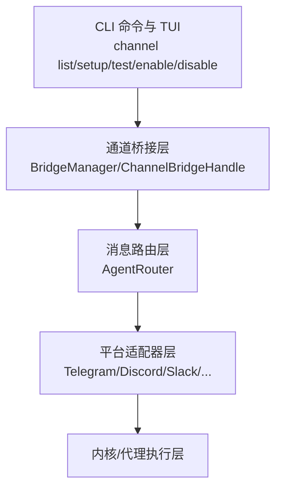
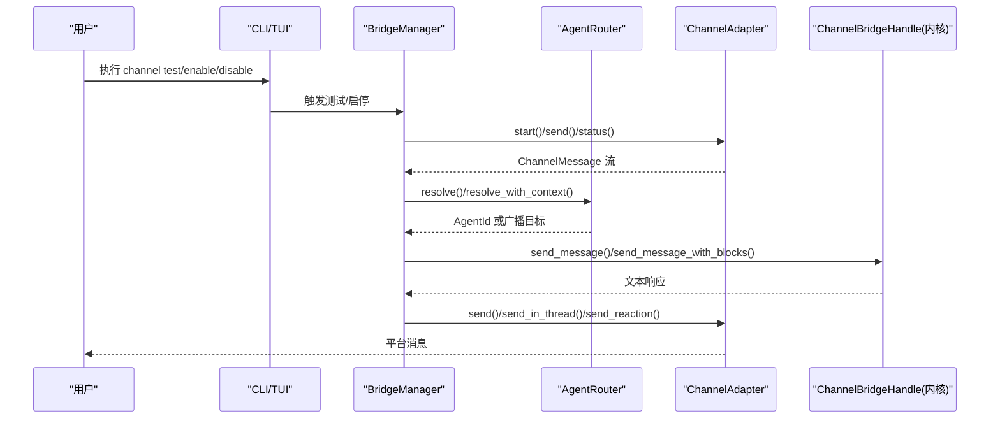
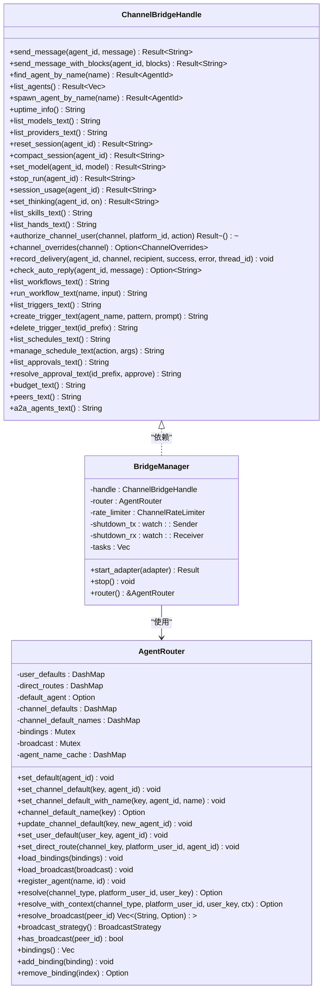
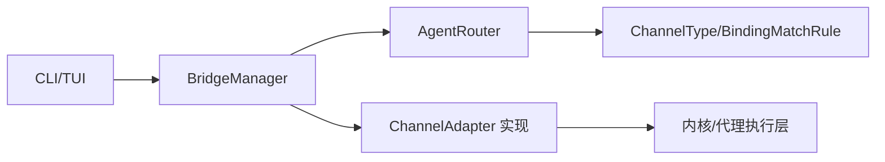

# 渠道管理

<cite>
**本文引用的文件**
- [main.rs](file://crates/openfang-cli/src/main.rs)
- [channels.rs](file://crates/openfang-cli/src/tui/screens/channels.rs)
- [wizard.rs](file://crates/openfang-cli/src/tui/screens/wizard.rs)
- [lib.rs](file://crates/openfang-channels/src/lib.rs)
- [router.rs](file://crates/openfang-channels/src/router.rs)
- [bridge.rs](file://crates/openfang-channels/src/bridge.rs)
- [types.rs](file://crates/openfang-channels/src/types.rs)
- [telegram.rs](file://crates/openfang-channels/src/telegram.rs)
- [discord.rs](file://crates/openfang-channels/src/discord.rs)
- [slack.rs](file://crates/openfang-channels/src/slack.rs)
- [whatsapp.rs](file://crates/openfang-channels/src/whatsapp.rs)
</cite>

## 目录
1. [简介](#简介)
2. [项目结构](#项目结构)
3. [核心组件](#核心组件)
4. [架构总览](#架构总览)
5. [详细组件分析](#详细组件分析)
6. [依赖关系分析](#依赖关系分析)
7. [性能考量](#性能考量)
8. [故障排除指南](#故障排除指南)
9. [结论](#结论)
10. [附录](#附录)

## 简介
本文件为 OpenFang 渠道管理命令的权威参考，覆盖以下内容：
- 渠道相关命令：channel list、channel setup、channel test、channel enable、channel disable 的语法、参数、选项与使用示例
- 40 种消息渠道集成概览与适配器架构
- 消息路由机制与桥接层设计
- 多渠道部署最佳实践与常见问题排查

## 项目结构
OpenFang 的渠道体系由三层构成：
- CLI 层：提供命令行入口与交互式 TUI 界面，负责渠道列表展示、配置向导、测试与启停控制
- 通道桥接层：统一抽象 ChannelAdapter 接口，将各平台消息转换为 ChannelMessage，并通过 AgentRouter 路由到具体 Agent
- 平台适配器层：40 个具体渠道适配器（Telegram、Discord、Slack、WhatsApp 等），负责与平台 API/网关对接

图表来源
- [main.rs:343-367](file://crates/openfang-cli/src/main.rs#L343-L367)
- [bridge.rs:271-382](file://crates/openfang-channels/src/bridge.rs#L271-L382)
- [router.rs:25-45](file://crates/openfang-channels/src/router.rs#L25-L45)
- [lib.rs:1-55](file://crates/openfang-channels/src/lib.rs#L1-L55)

章节来源
- [main.rs:343-367](file://crates/openfang-cli/src/main.rs#L343-L367)
- [lib.rs:1-55](file://crates/openfang-channels/src/lib.rs#L1-L55)

## 核心组件
- CLI 与 TUI
  - 提供 channel 子命令族与交互式渠道管理界面
  - 支持按分类筛选、一键测试、启用/禁用等操作
- 通道桥接层
  - 定义 ChannelBridgeHandle（内核能力接口）与 BridgeManager（适配器生命周期与消息分发）
  - 实现速率限制、输出格式化、线程化发送、生命周期反应等通用逻辑
- 消息路由层
  - AgentRouter：基于绑定规则、直连路由、用户默认、频道默认、系统默认的多级优先级路由
  - 支持广播策略与动态绑定更新
- 平台适配器层
  - 40 个 ChannelAdapter 实现，覆盖主流 IM、企业协作、社交、通知等渠道
  - 统一输入输出模型与错误处理策略

章节来源
- [channels.rs:30-337](file://crates/openfang-cli/src/tui/screens/channels.rs#L30-L337)
- [bridge.rs:27-227](file://crates/openfang-channels/src/bridge.rs#L27-L227)
- [router.rs:25-341](file://crates/openfang-channels/src/router.rs#L25-L341)
- [types.rs:12-280](file://crates/openfang-channels/src/types.rs#L12-L280)

## 架构总览
下图展示了从 CLI 到内核的消息通路与关键职责划分：

图表来源
- [bridge.rs:271-382](file://crates/openfang-channels/src/bridge.rs#L271-L382)
- [router.rs:138-221](file://crates/openfang-channels/src/router.rs#L138-L221)
- [types.rs:215-280](file://crates/openfang-channels/src/types.rs#L215-L280)

## 详细组件分析

### CLI 渠道命令参考
- channel list
  - 功能：列出所有 40 个渠道及其状态（就绪/缺少环境变量/未配置）、分类与环境变量摘要
  - 交互：支持分类筛选（全部/消息/社交/企业/开发者/通知）、刷新、键盘导航
  - 示例：openfang channel list
- channel setup
  - 功能：交互式配置向导，逐项收集渠道所需的环境变量或配置
  - 行为：自动检测已设置的环境变量；保存为 TOML 片段并写入配置
  - 示例：openfang channel setup telegram
- channel test
  - 功能：对指定渠道发送测试消息，验证连通性与配置正确性
  - 示例：openfang channel test telegram
- channel enable
  - 功能：启用某个渠道（仅标记启用，不改变配置）
  - 示例：openfang channel enable telegram
- channel disable
  - 功能：禁用某个渠道（仅标记禁用，不删除配置）
  - 示例：openfang channel disable telegram

章节来源
- [main.rs:343-367](file://crates/openfang-cli/src/main.rs#L343-L367)
- [channels.rs:30-337](file://crates/openfang-cli/src/tui/screens/channels.rs#L30-L337)

### 渠道适配器架构与类型系统
- ChannelType：统一表示渠道类型（Telegram、Discord、Slack、WhatsApp、Signal、Matrix、Email、Teams、Mattermost、WebChat、CLI、自定义）
- ChannelUser/ChannelContent/ChannelMessage：统一的消息结构，支持文本、图片、文件、语音、位置、命令等
- ChannelAdapter trait：定义 start()/send()/send_typing()/send_reaction()/stop()/status()/send_in_thread()/suppress_error_responses()
- 输出格式与线程化：不同渠道采用默认输出格式（如 Telegram HTML、Slack Mrkdwn），支持线程回复与生命周期反应

章节来源
- [types.rs:12-280](file://crates/openfang-channels/src/types.rs#L12-L280)

### 桥接层与消息分发
- ChannelBridgeHandle：由内核实现，提供发送消息、查找/列举代理、工作流/触发器/计划任务等能力
- BridgeManager：启动适配器、订阅消息流、并发派发、速率限制、超时与错误处理
- 发送路径：根据渠道策略选择格式化方式、是否线程化、是否发送生命周期反应；对长文本进行拆分发送

章节来源
- [bridge.rs:27-227](file://crates/openfang-channels/src/bridge.rs#L27-L227)
- [bridge.rs:271-382](file://crates/openfang-channels/src/bridge.rs#L271-L382)
- [bridge.rs:402-454](file://crates/openfang-channels/src/bridge.rs#L402-L454)

### 消息路由机制
- AgentRouter：多级路由优先级（绑定规则 > 直连路由 > 用户默认 > 频道默认 > 系统默认）
- 绑定匹配：支持按渠道、账号、用户、服务器、角色等组合匹配，按“特异性”排序
- 广播：支持并行/串行两种广播策略，可按用户 ID 配置多个目标代理
- 运行时更新：支持动态添加/移除绑定、更新频道默认代理名称与缓存

章节来源
- [router.rs:25-341](file://crates/openfang-channels/src/router.rs#L25-L341)

### 典型适配器实现要点
- Telegram
  - 使用长轮询 getUpdates，带指数退避；支持 @提及检测、HTML 解析模式、4096 字符上限拆分
- Discord
  - 使用 WebSocket 网关（v10），REST API 发送；支持打字指示、心跳、断线重连
- Slack
  - Socket Mode（app token）接收事件，Web API（bot token）发送；支持线程回复、链接预览展开
- WhatsApp
  - 支持 Cloud API 与本地网关两种模式；自动选择，Cloud API 模式需 verify_token/webhook

章节来源
- [telegram.rs:30-200](file://crates/openfang-channels/src/telegram.rs#L30-L200)
- [discord.rs:36-200](file://crates/openfang-channels/src/discord.rs#L36-L200)
- [slack.rs:25-200](file://crates/openfang-channels/src/slack.rs#L25-L200)
- [whatsapp.rs:17-200](file://crates/openfang-channels/src/whatsapp.rs#L17-L200)

### 类图：桥接与路由核心类

图表来源
- [bridge.rs:27-227](file://crates/openfang-channels/src/bridge.rs#L27-L227)
- [bridge.rs:271-382](file://crates/openfang-channels/src/bridge.rs#L271-L382)
- [router.rs:25-341](file://crates/openfang-channels/src/router.rs#L25-L341)

## 依赖关系分析
- CLI 对桥接层的依赖
  - CLI 通过 ChannelBridgeHandle 获取内核能力（代理列表、工作流、触发器等），用于在渠道测试与命令中调用
- 桥接层对路由层的依赖
  - BridgeManager 在分发消息前调用 AgentRouter 决策目标代理，支持广播与绑定优先级
- 路由层对类型系统的依赖
  - AgentRouter 使用 ChannelType、BindingMatchRule 等类型进行匹配与解析

图表来源
- [bridge.rs:271-382](file://crates/openfang-channels/src/bridge.rs#L271-L382)
- [router.rs:113-131](file://crates/openfang-channels/src/router.rs#L113-L131)
- [types.rs:12-280](file://crates/openfang-channels/src/types.rs#L12-L280)

章节来源
- [bridge.rs:271-382](file://crates/openfang-channels/src/bridge.rs#L271-L382)
- [router.rs:113-131](file://crates/openfang-channels/src/router.rs#L113-L131)
- [types.rs:12-280](file://crates/openfang-channels/src/types.rs#L12-L280)

## 性能考量
- 并发派发：BridgeManager 为每条入站消息创建独立任务，避免慢 LLM 调用阻塞后续消息
- 速率限制：ChannelRateLimiter 基于用户维度的 1 分钟滑动窗口计数，防止平台限流
- 文本拆分：针对不同平台的消息长度限制（如 Telegram 4096、Discord 2000、Slack 3000），自动拆分发送
- 生命周期反应与打字指示：周期刷新保持用户体验，同时避免阻塞主消息处理
- 广播策略：并行广播可提升多代理响应速度，串行广播保证顺序一致性

章节来源
- [bridge.rs:309-382](file://crates/openfang-channels/src/bridge.rs#L309-L382)
- [bridge.rs:229-269](file://crates/openfang-channels/src/bridge.rs#L229-L269)
- [types.rs:282-309](file://crates/openfang-channels/src/types.rs#L282-L309)

## 故障排除指南
- 渠道未就绪
  - 现象：状态显示“未配置/缺少环境变量”
  - 排查：检查对应环境变量是否设置；使用 channel setup 交互式补全
- 连接失败/认证错误
  - Telegram：校验 bot token，确认 @BotFather 获取的令牌正确
  - Discord：确认 bot token 与所需 intents；检查网关 URL 获取与重连逻辑
  - Slack：校验 bot token 的 auth.test；确认 app token 可获取 Socket Mode URL
  - WhatsApp：Cloud API 模式需 verify_token 与 webhook 端口；或使用网关模式（gateway_url）
- 速率限制
  - 现象：返回“超过每分钟最大消息数”
  - 处理：降低并发或提高 per_user 限额；合理拆分长文本
- 广播无响应
  - 检查广播配置与目标代理名称是否存在于内核；确认广播策略（并行/串行）
- 绑定不生效
  - 检查绑定匹配字段（渠道、账号、用户、服务器、角色）是否齐全；确认绑定按“特异性”排序

章节来源
- [telegram.rs:75-97](file://crates/openfang-channels/src/telegram.rs#L75-L97)
- [discord.rs:79-96](file://crates/openfang-channels/src/discord.rs#L79-L96)
- [slack.rs:71-92](file://crates/openfang-channels/src/slack.rs#L71-L92)
- [whatsapp.rs:68-75](file://crates/openfang-channels/src/whatsapp.rs#L68-L75)
- [bridge.rs:229-269](file://crates/openfang-channels/src/bridge.rs#L229-L269)
- [router.rs:289-340](file://crates/openfang-channels/src/router.rs#L289-L340)

## 结论
OpenFang 的渠道管理以“统一抽象 + 多级路由 + 并发派发”为核心设计，既能覆盖 40 个主流渠道，又能在复杂场景下保证高可用与高性能。通过 CLI/TUI 的可视化配置与测试流程，用户可以快速完成多渠道部署与运维。

## 附录

### 渠道类别与数量
- 消息类（12）：Telegram、Discord、Slack、WhatsApp、Signal、Matrix、Email、LINE、Viber、Messenger、Threema、Keybase
- 社交类（5）：Reddit、Mastodon、Bluesky、LinkedIn、Nostr
- 企业类（10）：Teams、Mattermost、Google Chat、Webex、飞书/钉钉、Pumble、Flock、Twist、Zulip
- 开发类（9）：IRC、XMPP、Gitter、Discourse、Revolt、Guilded、Nextcloud、Rocket.Chat、Twitch
- 通知类（4）：ntfy、Gotify、Webhook、Mumble
- 小计：40 个渠道

章节来源
- [channels.rs:30-337](file://crates/openfang-cli/src/tui/screens/channels.rs#L30-L337)

### 命令语法与示例（节选）
- openfang channel list
  - 作用：列出所有渠道及状态
- openfang channel setup [channel]
  - 作用：交互式配置渠道；可指定渠道名（如 telegram）
- openfang channel test <channel>
  - 作用：对指定渠道发送测试消息
- openfang channel enable <channel>
  - 作用：启用某渠道
- openfang channel disable <channel>
  - 作用：禁用某渠道

章节来源
- [main.rs:343-367](file://crates/openfang-cli/src/main.rs#L343-L367)