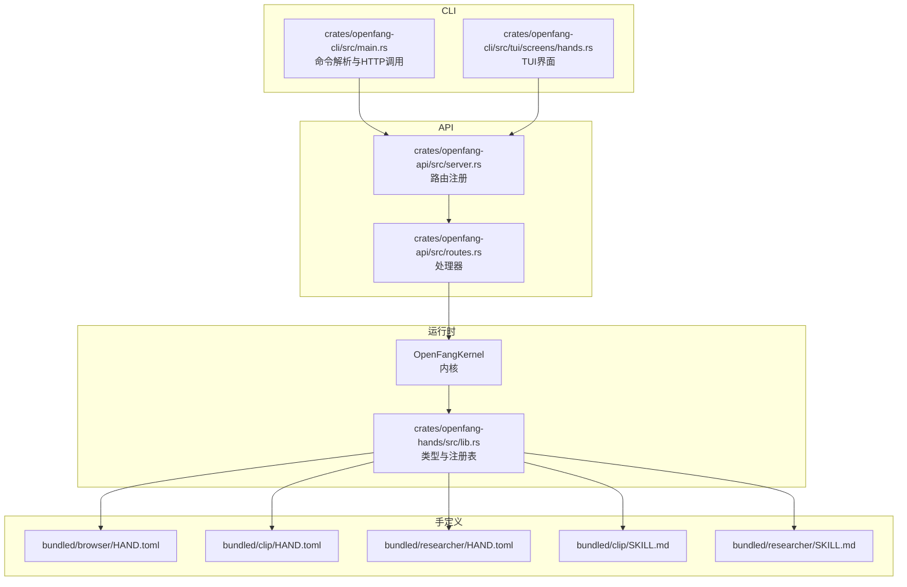
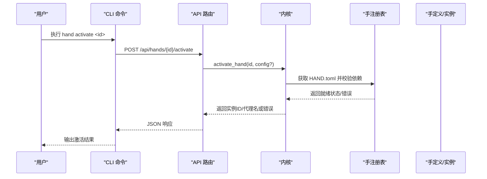
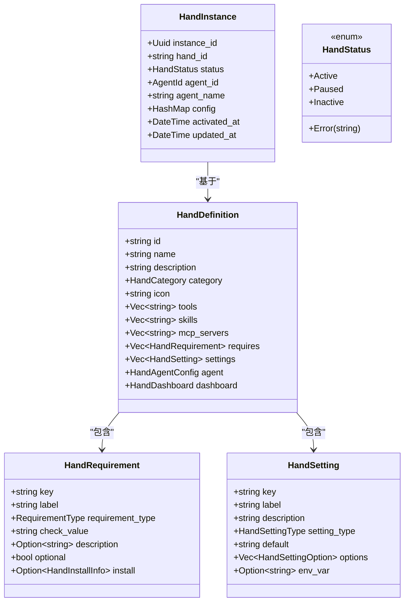
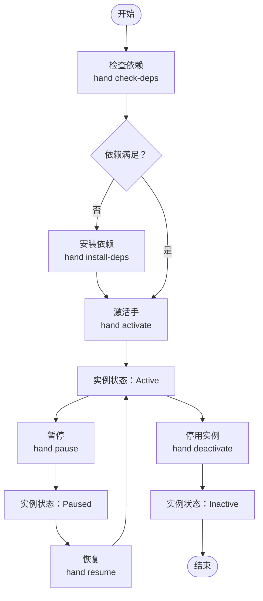
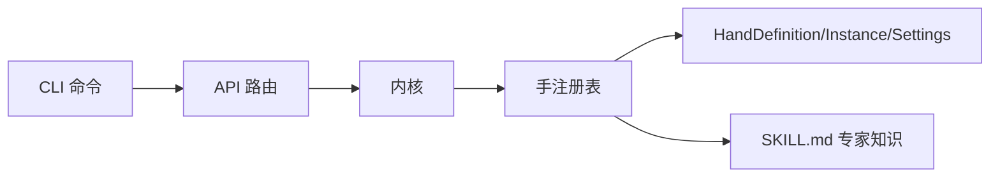

# 自动手管理

<cite>
**本文引用的文件**
- [crates/openfang-cli/src/main.rs](file://crates/openfang-cli/src/main.rs)
- [crates/openfang-api/src/server.rs](file://crates/openfang-api/src/server.rs)
- [crates/openfang-api/src/routes.rs](file://crates/openfang-api/src/routes.rs)
- [crates/openfang-hands/src/lib.rs](file://crates/openfang-hands/src/lib.rs)
- [crates/openfang-hands/bundled/browser/HAND.toml](file://crates/openfang-hands/bundled/browser/HAND.toml)
- [crates/openfang-hands/bundled/clip/HAND.toml](file://crates/openfang-hands/bundled/clip/HAND.toml)
- [crates/openfang-hands/bundled/researcher/HAND.toml](file://crates/openfang-hands/bundled/researcher/HAND.toml)
- [crates/openfang-hands/bundled/clip/SKILL.md](file://crates/openfang-hands/bundled/clip/SKILL.md)
- [crates/openfang-hands/bundled/researcher/SKILL.md](file://crates/openfang-hands/bundled/researcher/SKILL.md)
- [crates/openfang-cli/src/tui/screens/hands.rs](file://crates/openfang-cli/src/tui/screens/hands.rs)
</cite>

## 目录
1. [简介](#简介)
2. [项目结构](#项目结构)
3. [核心组件](#核心组件)
4. [架构总览](#架构总览)
5. [详细组件分析](#详细组件分析)
6. [依赖关系分析](#依赖关系分析)
7. [性能考量](#性能考量)
8. [故障排除指南](#故障排除指南)
9. [结论](#结论)
10. [附录](#附录)

## 简介
本参考文档面向 OpenFang 的“自主手”（Hands）管理命令，覆盖以下子命令与功能：
- 手实例管理：hand list、hand active、hand install、hand activate、hand deactivate、hand info、hand check-deps、hand install-deps、hand pause、hand resume
- 预构建自治能力包：浏览器、视频剪辑、研究助理等内置 HAND.toml 定义
- 生命周期管理：安装、激活、暂停/恢复、停用、查看状态与仪表盘指标
- 依赖处理：检查与安装外部依赖（二进制、环境变量、API 密钥）
- 实际使用场景与最佳实践：如何选择合适的“手”，如何配置与监控，以及常见问题排查

## 项目结构
OpenFang 将“手”的定义、注册表、API 路由与 CLI 命令组织在不同模块中：
- CLI 层：解析命令、调用守护进程 API 或直接与内核交互
- API 层：提供 /api/hands 下的 REST 接口
- 运行时层：内核与手注册表负责实例化、状态管理与生命周期控制
- 手定义层：内置 HAND.toml 与配套技能知识（SKILL.md）

图表来源
- [crates/openfang-cli/src/main.rs](file://crates/openfang-cli/src/main.rs)
- [crates/openfang-api/src/server.rs](file://crates/openfang-api/src/server.rs)
- [crates/openfang-api/src/routes.rs](file://crates/openfang-api/src/routes.rs)
- [crates/openfang-hands/src/lib.rs](file://crates/openfang-hands/src/lib.rs)
- [crates/openfang-hands/bundled/browser/HAND.toml](file://crates/openfang-hands/bundled/browser/HAND.toml)
- [crates/openfang-hands/bundled/clip/HAND.toml](file://crates/openfang-hands/bundled/clip/HAND.toml)
- [crates/openfang-hands/bundled/researcher/HAND.toml](file://crates/openfang-hands/bundled/researcher/HAND.toml)
- [crates/openfang-hands/bundled/clip/SKILL.md](file://crates/openfang-hands/bundled/clip/SKILL.md)
- [crates/openfang-hands/bundled/researcher/SKILL.md](file://crates/openfang-hands/bundled/researcher/SKILL.md)

章节来源
- [crates/openfang-cli/src/main.rs](file://crates/openfang-cli/src/main.rs)
- [crates/openfang-api/src/server.rs](file://crates/openfang-api/src/server.rs)
- [crates/openfang-api/src/routes.rs](file://crates/openfang-api/src/routes.rs)
- [crates/openfang-hands/src/lib.rs](file://crates/openfang-hands/src/lib.rs)

## 核心组件
- CLI 子命令 HandCommands：定义 hand list、hand active、hand install、hand activate、hand deactivate、hand info、hand check-deps、hand install-deps、hand pause、hand resume 等
- API 路由：/api/hands/* 提供手的查询、安装、激活、依赖检查与安装、暂停/恢复、停用、仪表盘统计等接口
- 手注册表与类型：HandDefinition、HandInstance、HandStatus、RequirementType、HandSetting 等
- 内置 HAND.toml：浏览器、视频剪辑、研究助理等预构建能力包，含工具清单、依赖要求、可配置设置与仪表盘指标

章节来源
- [crates/openfang-cli/src/main.rs](file://crates/openfang-cli/src/main.rs)
- [crates/openfang-api/src/server.rs](file://crates/openfang-api/src/server.rs)
- [crates/openfang-api/src/routes.rs](file://crates/openfang-api/src/routes.rs)
- [crates/openfang-hands/src/lib.rs](file://crates/openfang-hands/src/lib.rs)

## 架构总览
下图展示从 CLI 到 API、再到内核与手注册表的调用链路，以及关键数据结构之间的关系。

图表来源
- [crates/openfang-cli/src/main.rs](file://crates/openfang-cli/src/main.rs)
- [crates/openfang-api/src/server.rs](file://crates/openfang-api/src/server.rs)
- [crates/openfang-api/src/routes.rs](file://crates/openfang-api/src/routes.rs)

## 详细组件分析

### 命令参考与使用说明

- hand list
  - 功能：列出所有可用的手定义（含分类、图标、描述、依赖就绪状态）
  - 用法：openfang hand list
  - 说明：用于浏览内置或已安装的手，判断是否满足依赖
  - 参考实现：CLI 中 HandCommands.List；API 路由 /api/hands；TUI 展示

- hand active
  - 功能：显示当前活跃的手实例列表（实例ID、手ID、状态、代理名、激活时间）
  - 用法：openfang hand active
  - 说明：用于监控正在运行的实例与状态
  - 参考实现：CLI 中对应命令；API 路由 /api/hands/active

- hand install
  - 功能：从本地目录安装一个手（需包含 HAND.toml）
  - 用法：openfang hand install <path>
  - 说明：将自定义手加入注册表，后续可 hand activate 使用
  - 参考实现：CLI 中 HandCommands.Install；API 路由 /api/hands/install

- hand activate
  - 功能：激活指定手，启动其专用代理并返回实例ID与代理名
  - 用法：openfang hand activate <id>
  - 说明：支持传入配置覆盖（如 settings），内部通过 /api/hands/{id}/activate 触发
  - 参考实现：CLI 中 cmd_hand_activate；API 路由 /api/hands/{id}/activate

- hand deactivate
  - 功能：停用手实例（删除实例，停止代理）
  - 用法：openfang hand deactivate <id>
  - 说明：需要先通过 hand active 获取实例ID；内部调用 /api/hands/instances/{id}
  - 参考实现：CLI 中 cmd_hand_deactivate；API 路由 /api/hands/instances/{id}

- hand info
  - 功能：查看手的完整定义（含工具、依赖、设置、仪表盘指标）
  - 用法：openfang hand info <id>
  - 说明：用于了解手的能力边界与配置项
  - 参考实现：CLI 中 cmd_hand_info；API 路由 /api/hands/{id}

- hand check-deps
  - 功能：检查手的依赖是否满足（二进制、环境变量、API密钥、可选依赖）
  - 用法：openfang hand check-deps <id>
  - 说明：输出依赖检查结果与建议
  - 参考实现：CLI 中 cmd_hand_check_deps；API 路由 /api/hands/{id}/check-deps

- hand install-deps
  - 功能：尝试安装缺失的依赖（按平台提供安装指引）
  - 用法：openfang hand install-deps <id>
  - 说明：打印安装结果与步骤
  - 参考实现：CLI 中 cmd_hand_install_deps；API 路由 /api/hands/{id}/install-deps

- hand pause
  - 功能：暂停活跃的手实例（不终止代理，保留上下文）
  - 用法：openfang hand pause <instance-id>
  - 说明：内部调用 /api/hands/instances/{id}/pause
  - 参考实现：CLI 中 cmd_hand_pause；API 路由 /api/hands/instances/{id}/pause

- hand resume
  - 功能：恢复暂停的手实例
  - 用法：openfang hand resume <instance-id>
  - 说明：内部调用 /api/hands/instances/{id}/resume
  - 参考实现：CLI 中 cmd_hand_resume；API 路由 /api/hands/instances/{id}/resume

章节来源
- [crates/openfang-cli/src/main.rs](file://crates/openfang-cli/src/main.rs)
- [crates/openfang-api/src/server.rs](file://crates/openfang-api/src/server.rs)
- [crates/openfang-api/src/routes.rs](file://crates/openfang-api/src/routes.rs)

### 数据模型与类型

图表来源
- [crates/openfang-hands/src/lib.rs](file://crates/openfang-hands/src/lib.rs)

章节来源
- [crates/openfang-hands/src/lib.rs](file://crates/openfang-hands/src/lib.rs)

### 预构建手定义与能力

- 浏览器手（browser）
  - 工具：浏览器导航、点击、输入、截图、页面阅读、网页搜索、文件读写、记忆存储/检索、日程管理、知识图谱
  - 依赖：Python 3、Chromium/Chrome（可选）
  - 设置：无头模式、购买确认、每任务最大页面数、默认等待时间、动作后截图
  - 仪表盘指标：访问页数、完成任务数、截图数量
  - 参考：[crates/openfang-hands/bundled/browser/HAND.toml](file://crates/openfang-hands/bundled/browser/HAND.toml)

- 视频剪辑手（clip）
  - 工具：shell_exec、文件读写、网络抓取、记忆存储/检索
  - 依赖：FFmpeg、FFprobe、yt-dlp；可选 STT/TTS 提供商
  - 设置：STT 提供商（本地 Whisper/Groq/OpenAI/Deepgram）、TTS 提供商（Edge/Whisper/OpenAI/ElevenLabs）、发布目标（Telegram/WhatsApp/两者）、API 凭据
  - 技能知识：跨平台命令差异、字幕生成、FFmpeg 处理、平台发布 API
  - 参考：
    - [crates/openfang-hands/bundled/clip/HAND.toml](file://crates/openfang-hands/bundled/clip/HAND.toml)
    - [crates/openfang-hands/bundled/clip/SKILL.md](file://crates/openfang-hands/bundled/clip/SKILL.md)

- 研究助理手（researcher）
  - 工具：网络搜索/抓取、记忆/知识图谱、日程管理、事件发布
  - 设置：研究深度、输出风格、源验证、最大来源数、自动跟进、保存研究日志、引用格式、语言
  - 参考：
    - [crates/openfang-hands/bundled/researcher/HAND.toml](file://crates/openfang-hands/bundled/researcher/HAND.toml)
    - [crates/openfang-hands/bundled/researcher/SKILL.md](file://crates/openfang-hands/bundled/researcher/SKILL.md)

章节来源
- [crates/openfang-hands/bundled/browser/HAND.toml](file://crates/openfang-hands/bundled/browser/HAND.toml)
- [crates/openfang-hands/bundled/clip/HAND.toml](file://crates/openfang-hands/bundled/clip/HAND.toml)
- [crates/openfang-hands/bundled/researcher/HAND.toml](file://crates/openfang-hands/bundled/researcher/HAND.toml)
- [crates/openfang-hands/bundled/clip/SKILL.md](file://crates/openfang-hands/bundled/clip/SKILL.md)
- [crates/openfang-hands/bundled/researcher/SKILL.md](file://crates/openfang-hands/bundled/researcher/SKILL.md)

### 生命周期与状态管理流程

图表来源
- [crates/openfang-cli/src/main.rs](file://crates/openfang-cli/src/main.rs)
- [crates/openfang-api/src/routes.rs](file://crates/openfang-api/src/routes.rs)

## 依赖关系分析

- CLI 与 API
  - CLI 子命令通过 HTTP 请求与 API 交互，API 路由集中于 /api/hands/*
  - API 路由进一步委托给内核与手注册表执行业务逻辑

- API 与内核
  - API 路由处理器调用内核方法（如激活、停用、检查依赖、更新配置等）
  - 内核维护手注册表，负责 HAND.toml 解析、依赖校验、实例生命周期管理

- 手定义与技能
  - HAND.toml 描述手的能力、依赖、设置与仪表盘指标
  - SKILL.md 提供专家知识与操作参考（如 FFmpeg、TTS、平台发布 API）

图表来源
- [crates/openfang-cli/src/main.rs](file://crates/openfang-cli/src/main.rs)
- [crates/openfang-api/src/server.rs](file://crates/openfang-api/src/server.rs)
- [crates/openfang-api/src/routes.rs](file://crates/openfang-api/src/routes.rs)
- [crates/openfang-hands/src/lib.rs](file://crates/openfang-hands/src/lib.rs)

章节来源
- [crates/openfang-cli/src/main.rs](file://crates/openfang-cli/src/main.rs)
- [crates/openfang-api/src/server.rs](file://crates/openfang-api/src/server.rs)
- [crates/openfang-api/src/routes.rs](file://crates/openfang-api/src/routes.rs)
- [crates/openfang-hands/src/lib.rs](file://crates/openfang-hands/src/lib.rs)

## 性能考量
- 依赖检查与安装
  - 检查依赖时尽量避免重复探测，必要时缓存检查结果
  - 安装依赖时按平台提供最简指令，减少失败重试次数
- 实例生命周期
  - 暂停/恢复仅切换状态，避免频繁重启代理带来的资源消耗
  - 仪表盘指标仅读取必要的内存键值，避免高频率 I/O
- CLI 与 API
  - CLI 在守护进程模式下通过本地 HTTP 访问 API，减少进程间通信开销
  - API 对高频端点（如 /api/hands/active）可考虑轻量响应体，避免大对象传输

## 故障排除指南
- 无法激活手
  - 使用 hand check-deps 检查依赖，若缺失则使用 hand install-deps 安装
  - 若提示“手未找到”，确认 HAND.toml 是否正确安装且注册表已加载
- 依赖未满足
  - 按 HAND.toml 中的 install 字段提供的平台指令安装（如 FFmpeg、yt-dlp、Python）
  - 对于 API 密钥类依赖，确保环境变量已设置
- 实例无法停用
  - 先用 hand active 获取实例ID，再执行 hand deactivate
  - 若返回错误，查看 API 返回的错误信息并修正配置或依赖
- 暂停/恢复无效
  - 确认实例状态为 Active 或 Paused，再执行对应命令
- 仪表盘无数据
  - 确认手的 agent 配置中启用了记忆存储/检索，并在任务中调用 memory_store 更新指标键

章节来源
- [crates/openfang-cli/src/main.rs](file://crates/openfang-cli/src/main.rs)
- [crates/openfang-api/src/routes.rs](file://crates/openfang-api/src/routes.rs)
- [crates/openfang-hands/bundled/clip/HAND.toml](file://crates/openfang-hands/bundled/clip/HAND.toml)
- [crates/openfang-hands/bundled/researcher/HAND.toml](file://crates/openfang-hands/bundled/researcher/HAND.toml)

## 结论
OpenFang 的“自主手”体系通过 HAND.toml 定义能力边界，结合依赖检查与安装、生命周期管理与仪表盘指标，为用户提供即插即用的自治能力包。CLI 与 API 形成清晰的分层，既支持命令行自动化，也支持图形化与脚本化集成。遵循本文档的命令参考、最佳实践与故障排除建议，可高效地部署、监控与维护各类手实例。

## 附录

### 常见使用场景与最佳实践
- 快速起步
  - 使用 hand list 查看可用手，hand check-deps 检查依赖，hand install-deps 安装缺失依赖
  - 使用 hand activate 启动常用手（如 browser、clip、researcher）
- 生产监控
  - 定期执行 hand active 查看实例状态
  - 通过 hand info 查看仪表盘指标配置，结合 memory_store 更新关键指标
- 配置优化
  - 在 HAND.toml 的 settings 中调整行为（如浏览器的 headless、clip 的 STT/TTS、researcher 的深度与输出风格）
  - 使用 hand deactivate 清理不再使用的实例，释放资源

### TUI 交互要点
- Marketplace（1）：浏览手列表，按 Enter 或 a 激活
- Active（2）：查看活跃实例，按 d 删除（确认），按 p 暂停/恢复

章节来源
- [crates/openfang-cli/src/tui/screens/hands.rs](file://crates/openfang-cli/src/tui/screens/hands.rs)