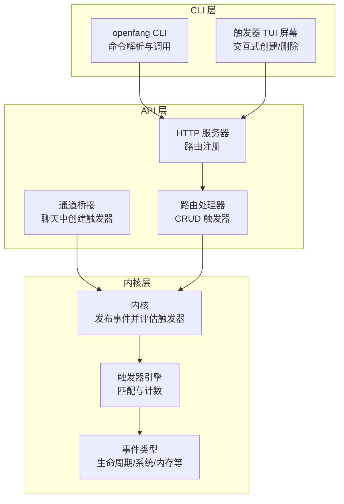
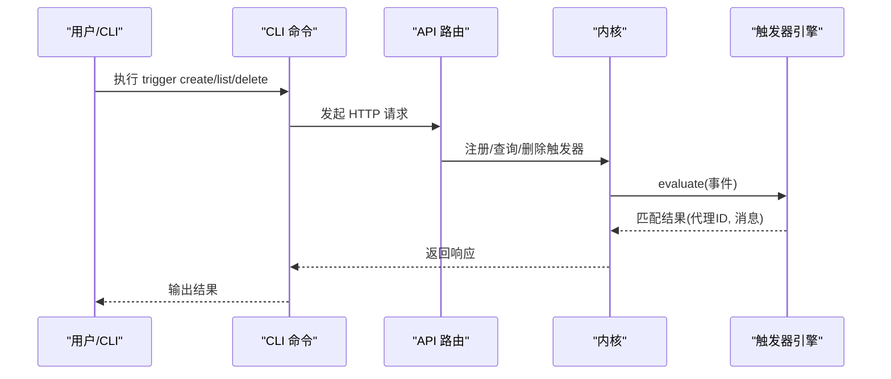
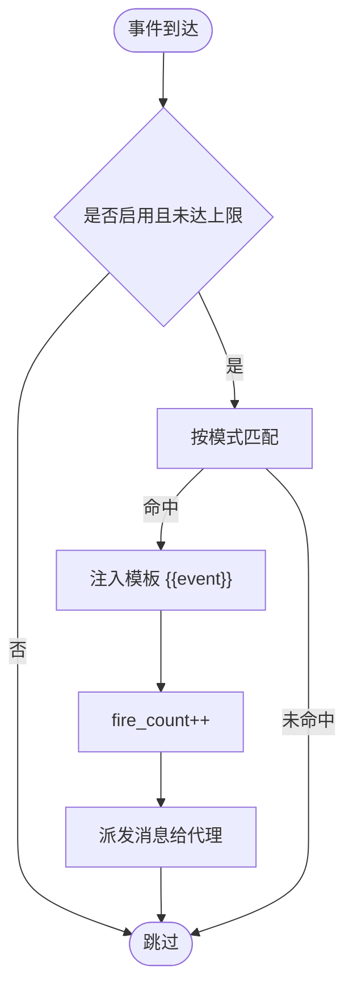
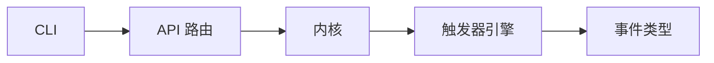

# 触发器管理

<cite>
**本文档引用的文件**
- [crates/openfang-cli/src/main.rs](file://crates/openfang-cli/src/main.rs)
- [crates/openfang-cli/src/tui/screens/triggers.rs](file://crates/openfang-cli/src/tui/screens/triggers.rs)
- [crates/openfang-api/src/server.rs](file://crates/openfang-api/src/server.rs)
- [crates/openfang-api/src/routes.rs](file://crates/openfang-api/src/routes.rs)
- [crates/openfang-api/src/channel_bridge.rs](file://crates/openfang-api/src/channel_bridge.rs)
- [crates/openfang-kernel/src/triggers.rs](file://crates/openfang-kernel/src/triggers.rs)
- [crates/openfang-kernel/src/kernel.rs](file://crates/openfang-kernel/src/kernel.rs)
- [crates/openfang-kernel/src/background.rs](file://crates/openfang-kernel/src/background.rs)
- [crates/openfang-types/src/event.rs](file://crates/openfang-types/src/event.rs)
</cite>

## 目录
1. [简介](#简介)
2. [项目结构](#项目结构)
3. [核心组件](#核心组件)
4. [架构总览](#架构总览)
5. [详细组件分析](#详细组件分析)
6. [依赖关系分析](#依赖关系分析)
7. [性能考虑](#性能考虑)
8. [故障排查指南](#故障排查指南)
9. [结论](#结论)
10. [附录](#附录)

## 简介
本文件为 OpenFang 触发器管理命令的权威参考文档，覆盖以下内容：
- 触发器相关命令：trigger list、trigger create、trigger delete 的完整语法、参数与选项
- 触发器模式定义、事件监听、条件匹配与动作执行机制
- 触发器系统工作原理与典型应用场景
- 复杂触发条件设计与性能优化建议
- 实际使用场景与最佳实践

## 项目结构
触发器管理涉及 CLI、API、内核与类型定义四个层面：
- CLI 层：提供命令行入口与交互式 TUI 屏幕
- API 层：暴露 HTTP 接口，处理触发器的增删改查
- 内核层：实现触发器引擎、事件分发与调度
-统一事件模型与触发器模式定义

**图表来源**
- [crates/openfang-cli/src/main.rs:531-557](file://crates/openfang-cli/src/main.rs#L531-L557)
- [crates/openfang-cli/src/tui/screens/triggers.rs:1-558](file://crates/openfang-cli/src/tui/screens/triggers.rs#L1-L558)
- [crates/openfang-api/src/server.rs:287-295](file://crates/openfang-api/src/server.rs#L287-L295)
- [crates/openfang-api/src/routes.rs:1135-1247](file://crates/openfang-api/src/routes.rs#L1135-L1247)
- [crates/openfang-api/src/channel_bridge.rs:404-432](file://crates/openfang-api/src/channel_bridge.rs#L404-L432)
- [crates/openfang-kernel/src/kernel.rs:3615-3642](file://crates/openfang-kernel/src/kernel.rs#L3615-L3642)
- [crates/openfang-kernel/src/triggers.rs:1-735](file://crates/openfang-kernel/src/triggers.rs#L1-L735)
- [crates/openfang-types/src/event.rs:1-392](file://crates/openfang-types/src/event.rs#L1-L392)

**章节来源**
- [crates/openfang-cli/src/main.rs:531-557](file://crates/openfang-cli/src/main.rs#L531-L557)
- [crates/openfang-api/src/server.rs:287-295](file://crates/openfang-api/src/server.rs#L287-L295)

## 核心组件
- 触发器命令集合：trigger list、trigger create、trigger delete
- 触发器模式：生命周期、代理创建/终止、系统事件、内存更新、内容匹配、全部事件等
- 触发器引擎：匹配事件、生成消息模板、计数与上限控制
- 事件系统：统一的事件模型与描述生成
- API 路由：列表、创建、删除、更新启用状态
- CLI/TUI：命令行与交互界面

**章节来源**
- [crates/openfang-cli/src/main.rs:531-557](file://crates/openfang-cli/src/main.rs#L531-L557)
- [crates/openfang-kernel/src/triggers.rs:37-80](file://crates/openfang-kernel/src/triggers.rs#L37-L80)
- [crates/openfang-types/src/event.rs:69-87](file://crates/openfang-types/src/event.rs#L69-L87)

## 架构总览
触发器系统围绕“事件驱动”展开：内核在事件总线上发布事件，触发器引擎对所有已注册触发器进行条件匹配，命中后将事件描述注入提示模板并发送给订阅代理。

**图表来源**
- [crates/openfang-cli/src/main.rs:3225-3314](file://crates/openfang-cli/src/main.rs#L3225-L3314)
- [crates/openfang-api/src/routes.rs:1135-1247](file://crates/openfang-api/src/routes.rs#L1135-L1247)
- [crates/openfang-kernel/src/kernel.rs:3615-3642](file://crates/openfang-kernel/src/kernel.rs#L3615-L3642)
- [crates/openfang-kernel/src/triggers.rs:272-308](file://crates/openfang-kernel/src/triggers.rs#L272-L308)

## 详细组件分析

### 命令：trigger list
- 功能：列出所有触发器，可按代理过滤
- 语法：openfang trigger list [--agent-id AGENT_ID]
- 参数与选项
  - --agent-id AGENT_ID：可选，按代理 ID 过滤
- 行为
  - 通过 HTTP GET /api/triggers 查询
  - 支持查询参数 ?agent_id=UUID
  - 输出包含 TRIGGER ID、AGENT ID、ENABLED、FIRES 与 PATTERN 字段
- 使用示例
  - 列出全部触发器：openfang trigger list
  - 按代理过滤：openfang trigger list --agent-id <代理ID>

**章节来源**
- [crates/openfang-cli/src/main.rs:531-538](file://crates/openfang-cli/src/main.rs#L531-L538)
- [crates/openfang-cli/src/main.rs:3225-3256](file://crates/openfang-cli/src/main.rs#L3225-L3256)
- [crates/openfang-api/src/routes.rs:1193-1219](file://crates/openfang-api/src/routes.rs#L1193-L1219)

### 命令：trigger create
- 功能：为指定代理创建触发器
- 语法：openfang trigger create --agent-id AGENT_ID --pattern-json PATTERN_JSON [--prompt PROMPT] [--max-fires N]
- 参数与选项
  - --agent-id AGENT_ID：必填，代理 ID（UUID）
  - --pattern-json PATTERN_JSON：必填，触发器模式的 JSON
  - --prompt PROMPT：可选，提示模板，默认为 "Event: {{event}}"
  - --max-fires N：可选，最大触发次数，默认 0（不限制）
- 模式定义（JSON）
  - lifecycle：生命周期事件
  - agent_spawned：代理创建事件，支持 name_pattern
  - agent_terminated：代理终止/崩溃事件
  - system：系统事件
  - system:<keyword>：系统事件关键字匹配
  - memory：内存更新事件
  - memory:<key>：内存键模式匹配
  - all：全部事件
  - content_match：<substring>：内容子串匹配
- 行为
  - 将 JSON 解析为 TriggerPattern
  - 通过 HTTP POST /api/triggers 创建
  - 成功返回 trigger_id 与 agent_id
- 使用示例
  - 生命周期触发：openfang trigger create --agent-id <UUID> --pattern-json '{"lifecycle":{}}'
  - 代理创建触发：openfang trigger create --agent-id <UUID> --pattern-json '{"agent_spawned":{"name_pattern":"*"}}'
  - 系统关键字触发：openfang trigger create --agent-id <UUID> --pattern-json '{"system":"quota"}'

**章节来源**
- [crates/openfang-cli/src/main.rs:539-551](file://crates/openfang-cli/src/main.rs#L539-L551)
- [crates/openfang-cli/src/main.rs:3258-3294](file://crates/openfang-cli/src/main.rs#L3258-L3294)
- [crates/openfang-api/src/routes.rs:1135-1191](file://crates/openfang-api/src/routes.rs#L1135-L1191)
- [crates/openfang-kernel/src/triggers.rs:37-59](file://crates/openfang-kernel/src/triggers.rs#L37-L59)

### 命令：trigger delete
- 功能：删除指定触发器
- 语法：openfang trigger delete --trigger-id TRIGGER_ID
- 参数与选项
  - --trigger-id TRIGGER_ID：必填，触发器 ID（UUID）
- 行为
  - 通过 HTTP DELETE /api/triggers/:id 删除
  - 成功返回状态信息；失败返回错误
- 使用示例
  - openfang trigger delete --trigger-id <触发器ID>

**章节来源**
- [crates/openfang-cli/src/main.rs:552-556](file://crates/openfang-cli/src/main.rs#L552-L556)
- [crates/openfang-cli/src/main.rs:3296-3314](file://crates/openfang-cli/src/main.rs#L3296-L3314)
- [crates/openfang-api/src/routes.rs:1221-1247](file://crates/openfang-api/src/routes.rs#L1221-L1247)

### 触发器模式定义与匹配
- 模式类型
  - Lifecycle：生命周期事件
  - AgentSpawned{name_pattern}：代理创建，name_pattern 支持通配符 "*"
  - AgentTerminated：代理终止或崩溃
  - System：系统事件
  - SystemKeyword{keyword}：系统事件关键字（大小写不敏感）
  - MemoryUpdate：内存更新事件
  - MemoryKeyPattern{key_pattern}：内存键模式匹配
  - All：全部事件
  - ContentMatch{substring}：事件描述的子串匹配（大小写不敏感）
- 匹配逻辑
  - 先检查 enabled 与 max_fires 上限
  - 对不同模式进行精确匹配或模糊匹配
  - 命中后将事件描述注入模板 {{event}} 并计数

**图表来源**
- [crates/openfang-kernel/src/triggers.rs:272-308](file://crates/openfang-kernel/src/triggers.rs#L272-L308)
- [crates/openfang-kernel/src/triggers.rs:322-366](file://crates/openfang-kernel/src/triggers.rs#L322-L366)

**章节来源**
- [crates/openfang-kernel/src/triggers.rs:37-80](file://crates/openfang-kernel/src/triggers.rs#L37-L80)
- [crates/openfang-kernel/src/triggers.rs:322-366](file://crates/openfang-kernel/src/triggers.rs#L322-L366)

### 事件监听与动作执行
- 事件来源
  - 生命周期事件：AgentSpawned、AgentTerminated 等
  - 系统事件：健康检查、配额警告/强制、模型路由等
  - 内存事件：键值变更
  - 自定义事件：任意二进制载荷
- 描述生成
  - 将事件转换为人类可读描述，用于提示模板
- 动作执行
  - 命中触发器后，将描述注入模板并发送给订阅代理
  - 引擎异步派发，避免阻塞事件总线

**章节来源**
- [crates/openfang-types/src/event.rs:69-87](file://crates/openfang-types/src/event.rs#L69-L87)
- [crates/openfang-kernel/src/triggers.rs:368-457](file://crates/openfang-kernel/src/triggers.rs#L368-L457)
- [crates/openfang-kernel/src/kernel.rs:3615-3642](file://crates/openfang-kernel/src/kernel.rs#L3615-L3642)

### 交互式 TUI 触发器管理
- 功能
  - 触发器列表展示与刷新
  - 交互式创建向导：选择代理、模式类型、参数、提示模板、最大触发次数
  - 删除确认与状态反馈
- 模式类型选择
  - Lifecycle、AgentSpawned、ContentMatch、Schedule、Webhook、ChannelMessage 等

**章节来源**
- [crates/openfang-cli/src/tui/screens/triggers.rs:1-558](file://crates/openfang-cli/src/tui/screens/triggers.rs#L1-L558)

### API 参考
- GET /api/triggers
  - 查询参数：agent_id（可选）
  - 返回：触发器数组（含 id、agent_id、pattern、prompt_template、enabled、fire_count、max_fires、created_at）
- POST /api/triggers
  - 请求体字段：agent_id、pattern、prompt_template、max_fires
  - 返回：trigger_id、agent_id
- DELETE /api/triggers/:id
  - 返回：状态信息或错误
- PUT /api/triggers/:id
  - 请求体字段：enabled（布尔）
  - 返回：更新后的状态

**章节来源**
- [crates/openfang-api/src/server.rs:287-295](file://crates/openfang-api/src/server.rs#L287-L295)
- [crates/openfang-api/src/routes.rs:1135-1247](file://crates/openfang-api/src/routes.rs#L1135-L1247)

### 聊天通道中的触发器
- 支持通过聊天输入快速创建触发器
- 支持的简写格式
  - lifecycle、spawned:<name>、terminated、system、system:<keyword>、memory、memory:<key>、match:<text>、all
- 作用：便于非技术用户在对话中即时设置触发器

**章节来源**
- [crates/openfang-api/src/channel_bridge.rs:404-432](file://crates/openfang-api/src/channel_bridge.rs#L404-L432)
- [crates/openfang-api/src/channel_bridge.rs:985-1016](file://crates/openfang-api/src/channel_bridge.rs#L985-L1016)

## 依赖关系分析
- CLI 依赖 API：通过 HTTP 与内核通信
- API 依赖内核：注册/查询/删除触发器
- 内核依赖触发器引擎：事件评估与派发
- 触发器引擎依赖事件类型：统一的事件模型与描述生成

**图表来源**
- [crates/openfang-cli/src/main.rs:3225-3314](file://crates/openfang-cli/src/main.rs#L3225-L3314)
- [crates/openfang-api/src/routes.rs:1135-1247](file://crates/openfang-api/src/routes.rs#L1135-L1247)
- [crates/openfang-kernel/src/kernel.rs:3615-3642](file://crates/openfang-kernel/src/kernel.rs#L3615-L3642)
- [crates/openfang-kernel/src/triggers.rs:1-735](file://crates/openfang-kernel/src/triggers.rs#L1-L735)
- [crates/openfang-types/src/event.rs:1-392](file://crates/openfang-types/src/event.rs#L1-L392)

**章节来源**
- [crates/openfang-cli/src/main.rs:531-557](file://crates/openfang-cli/src/main.rs#L531-L557)
- [crates/openfang-api/src/server.rs:287-295](file://crates/openfang-api/src/server.rs#L287-L295)

## 性能考虑
- 触发器数量与匹配开销
  - 引擎遍历所有已注册触发器，时间复杂度 O(N)
  - 建议限制单个代理的触发器数量，优先使用更具体的模式
- 上限与节流
  - max_fires 用于防止无限触发
  - enabled 字段可用于临时禁用触发器
- 异步派发
  - 触发器命中后异步派发消息，避免阻塞事件总线
- 模板注入成本
  - 模板中使用 {{event}} 时，注意事件描述长度，避免过长文本导致上下文膨胀

[本节为通用指导，无需特定文件引用]

## 故障排查指南
- 常见错误
  - 无效的 agent_id 或 trigger_id：检查 UUID 格式
  - 缺失 pattern：确保传入合法的 JSON 模式
  - 代理不存在：确认目标代理已存在
- 调试步骤
  - 使用 trigger list 验证触发器是否存在
  - 使用 trigger delete 清理异常触发器
  - 查看内核日志以定位匹配问题
- 建议
  - 从简单模式开始（如 lifecycle、all），逐步细化到具体关键字或键模式
  - 合理设置 max_fires，避免重复触发

**章节来源**
- [crates/openfang-api/src/routes.rs:1135-1191](file://crates/openfang-api/src/routes.rs#L1135-L1191)
- [crates/openfang-api/src/routes.rs:1221-1247](file://crates/openfang-api/src/routes.rs#L1221-L1247)

## 结论
OpenFang 的触发器系统以事件驱动为核心，通过简洁的模式定义与强大的匹配能力，实现对生命周期、系统、内存与自定义事件的灵活响应。配合 CLI 与 TUI，用户可以高效地创建、管理和调试触发器，满足从监控告警到自动化编排的多样化需求。

[本节为总结性内容，无需特定文件引用]

## 附录

### 常用使用场景与最佳实践
- 场景一：监控代理生命周期
  - 模式：lifecycle
  - 动作：通知管理员或记录审计日志
  - 最佳实践：结合 max_fires 控制重复通知
- 场景二：新代理上线自动初始化
  - 模式：agent_spawned{name_pattern:"*"}
  - 动作：向新代理发送初始化提示
  - 最佳实践：使用通配符并限定触发次数
- 场景三：系统资源告警
  - 模式：system:<keyword>（如 quota）
  - 动作：触发应急流程或降级策略
  - 最佳实践：关键字大小写不敏感，建议使用稳定关键词
- 场景四：内存关键键变更
  - 模式：memory:<key>（如 agent.*.status）
  - 动作：触发状态同步或清理任务
  - 最佳实践：键模式支持通配符，注意性能影响
- 场景五：内容匹配告警
  - 模式：content_match：<substring>
  - 动作：提取敏感信息并上报
  - 最佳实践：谨慎使用，避免误报

**章节来源**
- [crates/openfang-kernel/src/triggers.rs:37-59](file://crates/openfang-kernel/src/triggers.rs#L37-L59)
- [crates/openfang-kernel/src/background.rs:202-243](file://crates/openfang-kernel/src/background.rs#L202-L243)
- [crates/openfang-api/src/channel_bridge.rs:985-1016](file://crates/openfang-api/src/channel_bridge.rs#L985-L1016)