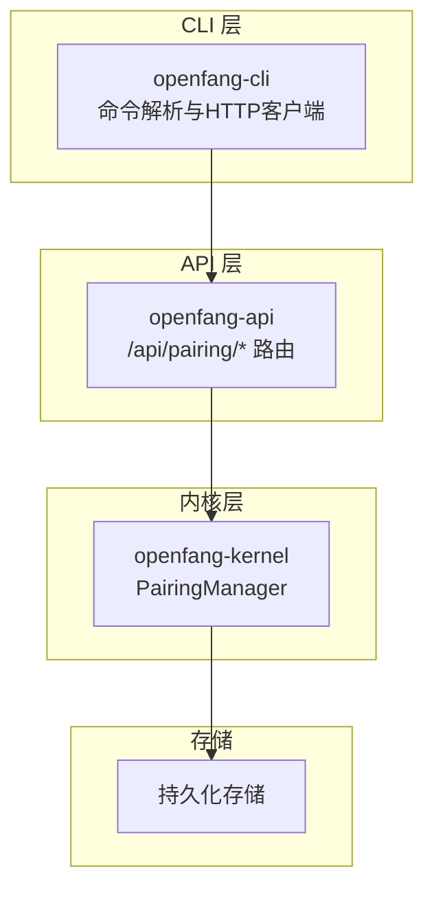
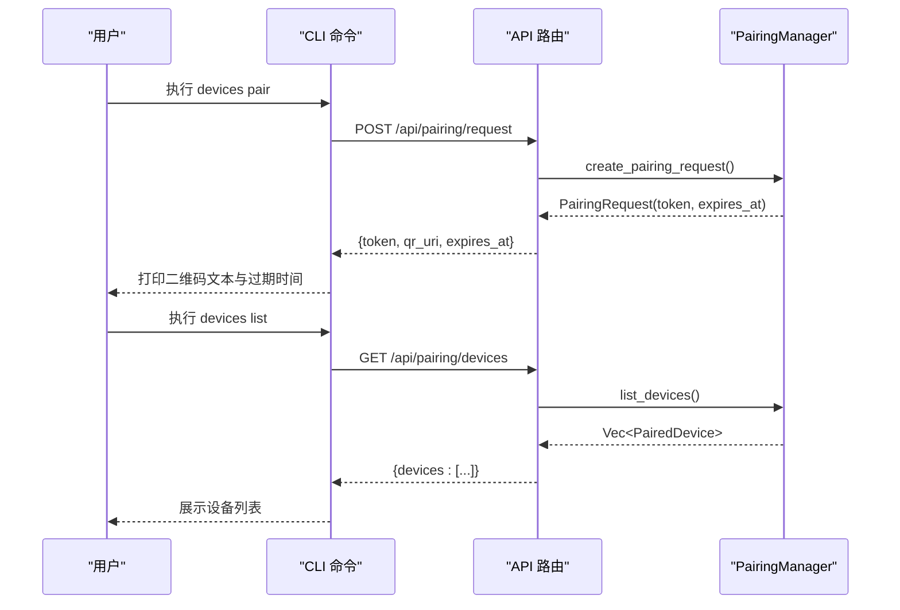
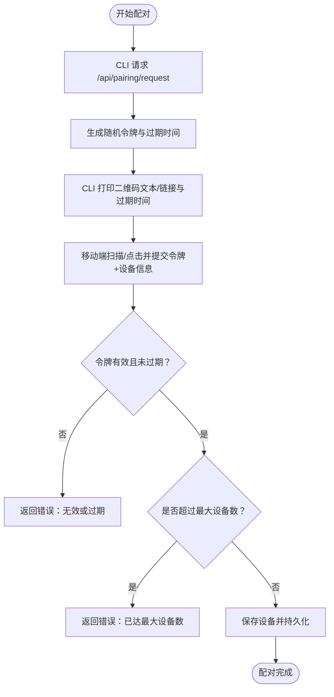
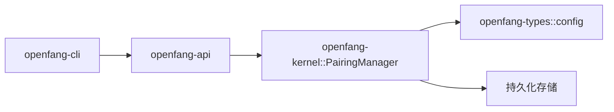

# 设备管理

<cite>
**本文引用的文件**
- [crates/openfang-cli/src/main.rs](file://crates/openfang-cli/src/main.rs)
- [crates/openfang-api/src/routes.rs](file://crates/openfang-api/src/routes.rs)
- [crates/openfang-kernel/src/pairing.rs](file://crates/openfang-kernel/src/pairing.rs)
- [crates/openfang-types/src/config.rs](file://crates/openfang-types/src/config.rs)
</cite>

## 目录
1. [简介](#简介)
2. [项目结构](#项目结构)
3. [核心组件](#核心组件)
4. [架构总览](#架构总览)
5. [详细组件分析](#详细组件分析)
6. [依赖关系分析](#依赖关系分析)
7. [性能考量](#性能考量)
8. [故障排查指南](#故障排查指南)
9. [结论](#结论)
10. [附录](#附录)

## 简介
本文件为 OpenFang 设备管理命令的权威参考，聚焦“设备配对”能力，覆盖以下命令与功能：
- 设备列表：devices list
- 开始配对：devices pair
- 移除设备：devices remove
- 生成配对二维码：qr

内容涵盖命令语法、参数与选项、使用示例、配对流程、令牌管理与安全通信、QR 码生成机制、多设备管理策略与安全配置建议等。

## 项目结构
设备管理命令由 CLI 层、API 层与内核配对管理器协同完成：
- CLI 层负责解析命令、调用守护进程 API 并输出结果
- API 层提供 /api/pairing/* 接口，封装配对状态与设备列表
- 内核配对管理器负责令牌生成、过期清理、设备持久化与数量限制

图表来源
- [crates/openfang-cli/src/main.rs](file://crates/openfang-cli/src/main.rs)
- [crates/openfang-api/src/routes.rs](file://crates/openfang-api/src/routes.rs)
- [crates/openfang-kernel/src/pairing.rs](file://crates/openfang-kernel/src/pairing.rs)

章节来源
- [crates/openfang-cli/src/main.rs](file://crates/openfang-cli/src/main.rs)
- [crates/openfang-api/src/routes.rs](file://crates/openfang-api/src/routes.rs)
- [crates/openfang-kernel/src/pairing.rs](file://crates/openfang-kernel/src/pairing.rs)

## 核心组件
- 设备配对管理器 PairingManager
  - 生成短时效配对令牌
  - 验证令牌并完成配对
  - 维护已配对设备列表
  - 清理过期令牌
  - 受配置项控制（启用开关、最大设备数、令牌有效期、推送通知）
- API 路由
  - POST /api/pairing/request：创建配对请求（返回令牌与过期时间）
  - GET /api/pairing/devices：列出已配对设备
  - DELETE /api/pairing/devices/{id}：移除指定设备
- CLI 命令
  - devices list：查询设备列表（支持 JSON 输出）
  - devices pair：发起配对请求（打印二维码文本与过期信息）
  - devices remove：删除指定设备
  - qr：别名命令，等同 devices pair

章节来源
- [crates/openfang-kernel/src/pairing.rs](file://crates/openfang-kernel/src/pairing.rs)
- [crates/openfang-api/src/routes.rs](file://crates/openfang-api/src/routes.rs)
- [crates/openfang-cli/src/main.rs](file://crates/openfang-cli/src/main.rs)

## 架构总览
下图展示从 CLI 到 API 再到内核配对管理器的端到端交互：

图表来源
- [crates/openfang-cli/src/main.rs](file://crates/openfang-cli/src/main.rs)
- [crates/openfang-api/src/routes.rs](file://crates/openfang-api/src/routes.rs)
- [crates/openfang-kernel/src/pairing.rs](file://crates/openfang-kernel/src/pairing.rs)

## 详细组件分析

### 命令：devices list
- 作用：列出所有已配对设备
- 语法：openfang devices list [--json]
- 参数与选项
  - --json：以 JSON 格式输出，便于脚本处理
- 行为
  - 向守护进程发起 GET 请求至 /api/pairing/devices
  - 若未启用配对或无设备，按约定返回空数组或错误提示
  - 支持 JSON 输出时直接打印美化后的 JSON
- 使用示例
  - openfang devices list
  - openfang devices list --json

章节来源
- [crates/openfang-cli/src/main.rs](file://crates/openfang-cli/src/main.rs)
- [crates/openfang-api/src/routes.rs](file://crates/openfang-api/src/routes.rs)

### 命令：devices pair
- 作用：开始新的设备配对流程
- 语法：openfang devices pair
- 行为
  - 向守护进程发起 POST 请求至 /api/pairing/request
  - 返回包含令牌、二维码 URI 与过期时间
  - CLI 将二维码文本与配对码、过期时间打印到终端
- 使用示例
  - openfang devices pair
- 注意
  - 该命令会触发一次短期令牌生成，随后在移动应用中扫描二维码或点击 deep link 完成配对

章节来源
- [crates/openfang-cli/src/main.rs](file://crates/openfang-cli/src/main.rs)
- [crates/openfang-api/src/routes.rs](file://crates/openfang-api/src/routes.rs)

### 命令：devices remove
- 作用：移除一个已配对设备
- 语法：openfang devices remove <id>
- 参数与选项
  - id：设备唯一标识符（字符串）
- 行为
  - 向守护进程发起 DELETE 请求至 /api/pairing/devices/{id}
  - 成功返回成功消息；若设备不存在则返回错误
- 使用示例
  - openfang devices remove <device-id>

章节来源
- [crates/openfang-cli/src/main.rs](file://crates/openfang-cli/src/main.rs)
- [crates/openfang-api/src/routes.rs](file://crates/openfang-api/src/routes.rs)

### 命令：qr
- 作用：生成配对二维码（别名命令，等同 devices pair）
- 语法：openfang qr
- 行为：与 devices pair 相同，用于快速触发配对请求

章节来源
- [crates/openfang-cli/src/main.rs](file://crates/openfang-cli/src/main.rs)

### 配对流程与令牌管理
- 流程概览
  1) CLI 发起配对请求，获取短期令牌与过期时间
  2) 用户在移动端扫描二维码或点击 deep link
  3) 移动端提交令牌与设备信息完成配对
  4) 服务器将设备写入持久化存储，并返回成功
- 令牌特性
  - 随机生成（32 字节），十六进制编码（64 字符）
  - 默认有效期可配置（秒级）
  - 过期自动清理，防止资源泄漏
- 安全措施
  - 令牌比较采用常量时间算法，降低时序攻击风险
  - 仅在配对启用后允许创建请求
  - 最大并发请求限制，防刷控

图表来源
- [crates/openfang-api/src/routes.rs](file://crates/openfang-api/src/routes.rs)
- [crates/openfang-kernel/src/pairing.rs](file://crates/openfang-kernel/src/pairing.rs)

章节来源
- [crates/openfang-api/src/routes.rs](file://crates/openfang-api/src/routes.rs)
- [crates/openfang-kernel/src/pairing.rs](file://crates/openfang-kernel/src/pairing.rs)

### QR 码生成机制
- 服务端生成
  - 创建配对请求时，同时构造 openfang://pair?token=... 的 deep link
  - 返回给 CLI，CLI 以文本形式展示，便于复制或扫码
- 客户端使用
  - 移动端通过扫描二维码或点击 deep link 触发配对流程
  - 提交令牌与设备信息后完成绑定

章节来源
- [crates/openfang-api/src/routes.rs](file://crates/openfang-api/src/routes.rs)

### 多设备管理与安全配置
- 最大设备数限制
  - 通过配置项控制，超出时拒绝新设备配对
  - 建议根据使用场景合理设置上限
- 令牌有效期
  - 默认 300 秒，可在配置中调整
  - 过期后自动清理，避免长期有效令牌带来的风险
- 推送通知（可选）
  - 支持通过 ntfy.sh 或 gotify 推送配对事件
  - 需要正确配置推送提供商与主题/URL

章节来源
- [crates/openfang-kernel/src/pairing.rs](file://crates/openfang-kernel/src/pairing.rs)
- [crates/openfang-types/src/config.rs](file://crates/openfang-types/src/config.rs)

## 依赖关系分析
- CLI 依赖 API 层提供的配对接口
- API 层依赖内核配对管理器执行业务逻辑
- 配对管理器依赖配置模块读取配对策略
- 持久化回调用于将设备变更写入数据库

图表来源
- [crates/openfang-cli/src/main.rs](file://crates/openfang-cli/src/main.rs)
- [crates/openfang-api/src/routes.rs](file://crates/openfang-api/src/routes.rs)
- [crates/openfang-kernel/src/pairing.rs](file://crates/openfang-kernel/src/pairing.rs)
- [crates/openfang-types/src/config.rs](file://crates/openfang-types/src/config.rs)

章节来源
- [crates/openfang-cli/src/main.rs](file://crates/openfang-cli/src/main.rs)
- [crates/openfang-api/src/routes.rs](file://crates/openfang-api/src/routes.rs)
- [crates/openfang-kernel/src/pairing.rs](file://crates/openfang-kernel/src/pairing.rs)
- [crates/openfang-types/src/config.rs](file://crates/openfang-types/src/config.rs)

## 性能考量
- 并发请求限制
  - 防止短时间内大量令牌生成导致资源压力
- 令牌过期清理
  - 定期清理过期令牌，避免内存膨胀
- JSON 输出优化
  - CLI 在 --json 模式下直接打印美化 JSON，减少二次解析开销

## 故障排查指南
- 无法连接守护进程
  - 现象：提示无法连接或超时
  - 处理：确认守护进程已启动；重试或检查 openfang status
- 配对未启用
  - 现象：返回“配对未启用”
  - 处理：在配置中启用配对功能并重启守护进程
- 设备已达上限
  - 现象：返回“已达最大设备数”
  - 处理：先移除不再使用的设备，再尝试配对
- 令牌无效或过期
  - 现象：返回“无效或过期”
  - 处理：重新发起配对请求，使用最新令牌
- 删除设备失败
  - 现象：返回“设备未找到”
  - 处理：确认设备 ID 正确；使用 devices list 查看当前设备列表

章节来源
- [crates/openfang-cli/src/main.rs](file://crates/openfang-cli/src/main.rs)
- [crates/openfang-api/src/routes.rs](file://crates/openfang-api/src/routes.rs)
- [crates/openfang-kernel/src/pairing.rs](file://crates/openfang-kernel/src/pairing.rs)

## 结论
OpenFang 的设备配对体系以短期令牌为核心，结合 CLI、API 与内核管理器形成清晰的职责边界。通过严格的令牌校验、过期清理与设备数量限制，确保配对过程的安全与稳定。配合 QR 码与 deep link，用户可在移动端便捷完成配对。建议在生产环境中合理配置令牌有效期与最大设备数，并开启必要的安全审计与日志监控。

## 附录

### 命令速查表
- openfang devices list [--json]
  - 列出已配对设备
- openfang devices pair
  - 开始配对流程（打印二维码文本与过期信息）
- openfang devices remove <id>
  - 移除指定设备
- openfang qr
  - 生成配对二维码（别名）

### API 接口一览
- POST /api/pairing/request
  - 返回：token、qr_uri、expires_at
- GET /api/pairing/devices
  - 返回：devices 数组（含设备 ID、显示名、平台、配对时间、最近活跃时间）
- DELETE /api/pairing/devices/{id}
  - 返回：ok 或错误信息

章节来源
- [crates/openfang-api/src/routes.rs](file://crates/openfang-api/src/routes.rs)