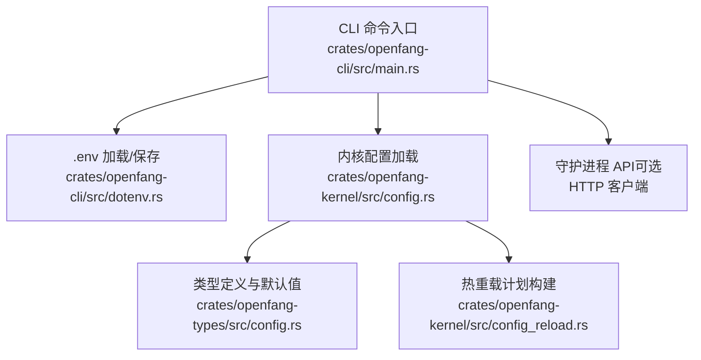
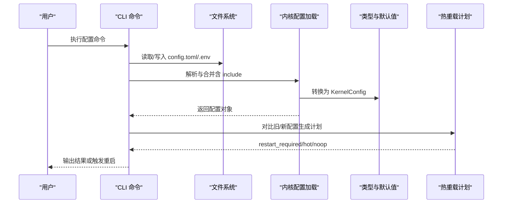
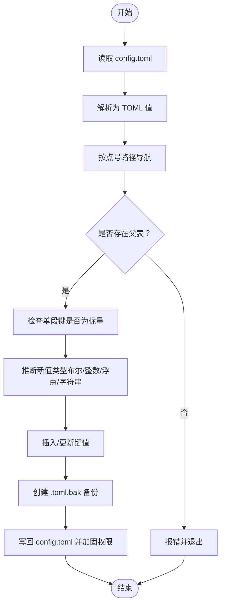
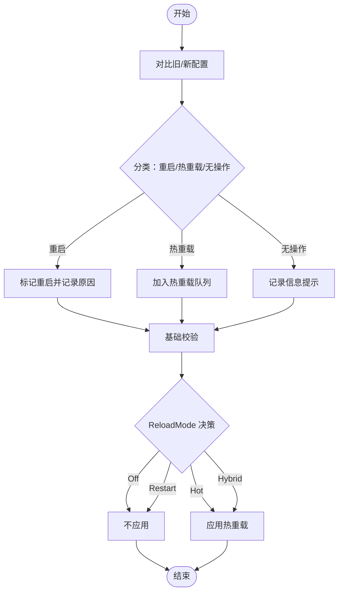
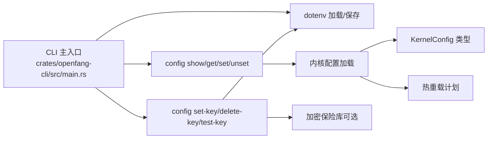

# 配置管理

<cite>
**本文档引用的文件**
- [crates/openfang-cli/src/main.rs](file://crates/openfang-cli/src/main.rs)
- [crates/openfang-cli/src/dotenv.rs](file://crates/openfang-cli/src/dotenv.rs)
- [crates/openfang-kernel/src/config.rs](file://crates/openfang-kernel/src/config.rs)
- [crates/openfang-kernel/src/config_reload.rs](file://crates/openfang-kernel/src/config_reload.rs)
- [crates/openfang-types/src/config.rs](file://crates/openfang-types/src/config.rs)
- [openfang.toml.example](file://openfang.toml.example)
</cite>

## 目录
1. [简介](#简介)
2. [项目结构](#项目结构)
3. [核心组件](#核心组件)
4. [架构总览](#架构总览)
5. [详细组件分析](#详细组件分析)
6. [依赖关系分析](#依赖关系分析)
7. [性能考量](#性能考量)
8. [故障排查指南](#故障排查指南)
9. [结论](#结论)
10. [附录](#附录)

## 简介
本文件为 OpenFang 配置管理命令的权威参考文档，覆盖以下命令族与能力：
- 配置操作：config show、config edit、config get、config set、config unset
- 密钥管理：config set-key、config delete-key、config test-key
- 配置文件结构、环境变量、密钥存储与连接测试
- 配置系统架构与热重载机制
- 实际使用场景与最佳实践（含备份与迁移建议）

## 项目结构
OpenFang 的配置管理由三部分协同完成：
- CLI 层：解析命令、调用编辑/读取逻辑、与守护进程交互
- 内核层：加载与合并配置、深拷贝热重载计划、校验与应用
- 类型层：定义 KernelConfig 结构及各子配置项的默认值与约束

**图表来源**
- [crates/openfang-cli/src/main.rs:979-988](file://crates/openfang-cli/src/main.rs#L979-L988)
- [crates/openfang-cli/src/dotenv.rs:22-32](file://crates/openfang-cli/src/dotenv.rs#L22-L32)
- [crates/openfang-kernel/src/config.rs:18-110](file://crates/openfang-kernel/src/config.rs#L18-L110)
- [crates/openfang-kernel/src/config_reload.rs:123-267](file://crates/openfang-kernel/src/config_reload.rs#L123-L267)
- [crates/openfang-types/src/config.rs:963-1102](file://crates/openfang-types/src/config.rs#L963-L1102)

**章节来源**
- [crates/openfang-cli/src/main.rs:979-988](file://crates/openfang-cli/src/main.rs#L979-L988)
- [crates/openfang-kernel/src/config.rs:18-110](file://crates/openfang-kernel/src/config.rs#L18-L110)

## 核心组件
- 配置命令族
  - config show：打印当前配置文件内容
  - config edit：在编辑器中打开配置文件
  - config get：按点号路径读取配置值
  - config set：按点号路径设置配置值（会写回并覆盖注释）
  - config unset：按点号路径删除配置键
- 密钥管理命令族
  - config set-key：将提供商 API 密钥保存到 .env 或加密保险库，并进行连通性测试
  - config delete-key：从 .env 和保险库中移除密钥
  - config test-key：仅测试指定提供商的密钥连通性
- 环境变量与 .env 文件
  - .env 与 secrets.env 优先级：系统环境变量优先；secrets.env 后加载，优先于 .env
  - 采用最小化解析器，支持注释与引号，写回时保留必要格式
- 配置系统与热重载
  - 支持 config.toml 包含 include 文件，深度合并后根配置覆盖
  - 热重载区分三类：需重启、可热重载、无操作（信息提示）
  - 提供校验规则与应用决策（模式开关）

**章节来源**
- [crates/openfang-cli/src/main.rs:4416-4698](file://crates/openfang-cli/src/main.rs#L4416-L4698)
- [crates/openfang-cli/src/dotenv.rs:22-32](file://crates/openfang-cli/src/dotenv.rs#L22-L32)
- [crates/openfang-kernel/src/config.rs:11-224](file://crates/openfang-kernel/src/config.rs#L11-L224)
- [crates/openfang-kernel/src/config_reload.rs:17-101](file://crates/openfang-kernel/src/config_reload.rs#L17-L101)

## 架构总览
下图展示配置从磁盘到运行时的流转过程，以及热重载的决策流程。

**图表来源**
- [crates/openfang-cli/src/main.rs:4416-4698](file://crates/openfang-cli/src/main.rs#L4416-L4698)
- [crates/openfang-kernel/src/config.rs:18-110](file://crates/openfang-kernel/src/config.rs#L18-L110)
- [crates/openfang-kernel/src/config_reload.rs:123-267](file://crates/openfang-kernel/src/config_reload.rs#L123-L267)
- [crates/openfang-types/src/config.rs:963-1102](file://crates/openfang-types/src/config.rs#L963-L1102)

## 详细组件分析

### 配置命令族详解

#### config show
- 功能：打印当前配置文件内容
- 行为要点：
  - 若不存在配置文件，提示初始化
  - 以纯文本输出完整 TOML
- 使用场景：快速查看当前生效配置

**章节来源**
- [crates/openfang-cli/src/main.rs:4416-4433](file://crates/openfang-cli/src/main.rs#L4416-L4433)

#### config edit
- 功能：在编辑器中打开配置文件
- 行为要点：
  - 自动检测 EDITOR/VISUAL 环境变量，否则按平台选择默认编辑器
  - 编辑器退出码非零时给出提示
- 使用场景：交互式修改配置

**章节来源**
- [crates/openfang-cli/src/main.rs:4435-4463](file://crates/openfang-cli/src/main.rs#L4435-L4463)

#### config get
- 功能：按点号路径读取配置值
- 行为要点：
  - 解析 TOML 并按路径逐段导航
  - 未找到路径或键时返回错误并退出
  - 输出值类型保持原样（字符串/整数/浮点/布尔等）
- 使用场景：脚本化查询特定配置项

**章节来源**
- [crates/openfang-cli/src/main.rs:4465-4507](file://crates/openfang-cli/src/main.rs#L4465-L4507)

#### config set
- 功能：按点号路径设置配置值
- 行为要点：
  - 读取现有 TOML，定位父表并设置最终键
  - 类型推断：若原值存在则尽量保持类型（布尔/整数/浮点），否则根据字符串内容推断
  - 单段键限制：单段键必须是标量字段，不能写入“节”名
  - 写回前自动创建 .toml.bak 备份
  - 写回后对文件权限进行安全加固
- 使用场景：自动化配置更新

**章节来源**
- [crates/openfang-cli/src/main.rs:4509-4630](file://crates/openfang-cli/src/main.rs#L4509-L4630)

#### config unset
- 功能：按点号路径删除配置键
- 行为要点：
  - 与 set 类似，先解析 TOML，再定位父表并删除键
  - 删除失败（键不存在）时返回错误
  - 写回前自动创建 .toml.bak 备份
- 使用场景：清理不再使用的配置项

**章节来源**
- [crates/openfang-cli/src/main.rs:4632-4698](file://crates/openfang-cli/src/main.rs#L4632-L4698)

### 密钥管理命令族详解

#### config set-key
- 功能：保存提供商 API 密钥到 .env 或加密保险库，并进行连通性测试
- 行为要点：
  - 将密钥同时写入 .env（作为后备）
  - 优先尝试写入加密保险库（vault.enc），成功后提示已存入保险库
  - 测试阶段调用连通性测试函数，验证密钥有效性
- 使用场景：首次配置或更换密钥

**章节来源**
- [crates/openfang-cli/src/main.rs:4700-4730](file://crates/openfang-cli/src/main.rs#L4700-L4730)
- [crates/openfang-cli/src/dotenv.rs:68-84](file://crates/openfang-cli/src/dotenv.rs#L68-L84)

#### config delete-key
- 功能：从 .env 和加密保险库中移除密钥
- 行为要点：
  - 先尝试从保险库移除（若存在且可解锁）
  - 再从 .env 移除
- 使用场景：撤销密钥或轮换密钥

**章节来源**
- [crates/openfang-cli/src/main.rs:4732-4754](file://crates/openfang-cli/src/main.rs#L4732-L4754)
- [crates/openfang-cli/src/dotenv.rs:86-99](file://crates/openfang-cli/src/dotenv.rs#L86-L99)

#### config test-key
- 功能：测试指定提供商的密钥连通性
- 行为要点：
  - 检查环境变量是否已设置
  - 调用连通性测试函数，输出 OK 或 FAILED
  - FAILED 时提示重新设置密钥
- 使用场景：验证密钥有效性

**章节来源**
- [crates/openfang-cli/src/main.rs:4756-4774](file://crates/openfang-cli/src/main.rs#L4756-L4774)

### 配置文件结构与环境变量

#### 配置文件位置与优先级
- 默认位置：~/.openfang/config.toml
- 受环境变量 OPENFANG_HOME 影响，可自定义家目录
- 支持 include：根配置先加载 include 文件并深合并，然后根配置覆盖
- include 安全限制：拒绝绝对路径、路径穿越、循环引用；限制最大嵌套深度

**章节来源**
- [crates/openfang-kernel/src/config.rs:18-110](file://crates/openfang-kernel/src/config.rs#L18-L110)
- [crates/openfang-kernel/src/config.rs:112-224](file://crates/openfang-kernel/src/config.rs#L112-L224)

#### .env 与 secrets.env
- 加载顺序：先加载 .env，再加载 secrets.env（后者优先覆盖前者）
- 系统环境变量优先：已存在的系统变量不会被覆盖
- 写回策略：保存时自动创建备份，写回后设置文件权限（Unix 下 0600）

**章节来源**
- [crates/openfang-cli/src/dotenv.rs:22-32](file://crates/openfang-cli/src/dotenv.rs#L22-L32)
- [crates/openfang-cli/src/dotenv.rs:68-84](file://crates/openfang-cli/src/dotenv.rs#L68-L84)

#### 示例配置文件
- 提供了常见配置项示例（如默认模型、内存、网络、频道适配器、MCP 服务器等）
- 建议基于示例进行定制

**章节来源**
- [openfang.toml.example:1-49](file://openfang.toml.example#L1-L49)

### 配置系统架构与热重载机制

#### 配置加载与合并
- 从 config.toml 读取并解析为 TOML 值
- 递归解析 include 列表，深合并后再去除 include 字段
- 迁移兼容：自动将旧 schema 中位于 [api] 的字段迁移到根级别
- 失败回退：解析或反序列化失败时使用默认配置

**章节来源**
- [crates/openfang-kernel/src/config.rs:18-110](file://crates/openfang-kernel/src/config.rs#L18-L110)
- [crates/openfang-kernel/src/config.rs:53-70](file://crates/openfang-kernel/src/config.rs#L53-L70)

#### 热重载计划构建
- 对比旧/新 KernelConfig，分类为三类：
  - restart_required：需重启（如监听地址、网络、内存、API 密钥等）
  - hot_actions：可热重载（如频道、技能、Web 配置、扩展、MCP 服务器、默认模型等）
  - noop_changes：信息提示（如日志级别、语言、模式等）
- 应用决策：根据 ReloadMode（Off/Restart/Hot/Hybrid）决定是否应用热重载

**章节来源**
- [crates/openfang-kernel/src/config_reload.rs:123-267](file://crates/openfang-kernel/src/config_reload.rs#L123-L267)
- [crates/openfang-kernel/src/config_reload.rs:313-320](file://crates/openfang-kernel/src/config_reload.rs#L313-L320)

#### 配置校验
- 基础校验：监听地址不能为空、定时任务上限合理、审批策略有效、启用网络时共享密钥必须设置
- 通过校验后才允许应用热重载

**章节来源**
- [crates/openfang-kernel/src/config_reload.rs:277-303](file://crates/openfang-kernel/src/config_reload.rs#L277-L303)

### 复杂逻辑流程图

#### config set 写入流程

**图表来源**
- [crates/openfang-cli/src/main.rs:4509-4630](file://crates/openfang-cli/src/main.rs#L4509-L4630)

#### 热重载决策流程

**图表来源**
- [crates/openfang-kernel/src/config_reload.rs:123-267](file://crates/openfang-kernel/src/config_reload.rs#L123-L267)
- [crates/openfang-kernel/src/config_reload.rs:313-320](file://crates/openfang-kernel/src/config_reload.rs#L313-L320)

## 依赖关系分析

**图表来源**
- [crates/openfang-cli/src/main.rs:979-988](file://crates/openfang-cli/src/main.rs#L979-L988)
- [crates/openfang-cli/src/dotenv.rs:22-32](file://crates/openfang-cli/src/dotenv.rs#L22-L32)
- [crates/openfang-kernel/src/config.rs:18-110](file://crates/openfang-kernel/src/config.rs#L18-L110)
- [crates/openfang-kernel/src/config_reload.rs:123-267](file://crates/openfang-kernel/src/config_reload.rs#L123-L267)
- [crates/openfang-types/src/config.rs:963-1102](file://crates/openfang-types/src/config.rs#L963-L1102)

**章节来源**
- [crates/openfang-cli/src/main.rs:979-988](file://crates/openfang-cli/src/main.rs#L979-L988)
- [crates/openfang-kernel/src/config.rs:18-110](file://crates/openfang-kernel/src/config.rs#L18-L110)

## 性能考量
- 配置文件读写：set/unset 在写回前会创建备份，频繁变更可能带来额外 IO；建议批处理变更
- 热重载：热重载动作通常开销较小，但涉及数据库、网络、频道桥接等模块时仍需评估影响
- include 合并：深度合并与多次文件读取可能增加启动时间；建议控制 include 数量与层级
- .env 写回：写回时会设置严格权限，避免不必要的重复写入

## 故障排查指南
- 配置解析错误
  - 症状：config get/set/unset 报解析错误
  - 排查：使用 config edit 修复 TOML 语法；或运行 openfang doctor
- 键不存在
  - 症状：config get/unset 报键不存在
  - 排查：确认点号路径正确；注意单段键不能指向“节”
- 权限问题
  - 症状：写回失败或权限异常
  - 排查：确保 ~/.openfang 及 config.toml/.env 权限正确（Unix 下 0600/0700）
- 热重载未生效
  - 症状：修改某些配置后未见变化
  - 排查：确认是否属于 restart_required；检查 ReloadMode 设置；必要时重启守护进程
- 密钥无效
  - 症状：config test-key 失败
  - 排查：使用 config set-key 重新设置；检查环境变量是否正确；确认提供商 API 端点可用

**章节来源**
- [crates/openfang-cli/src/main.rs:4465-4507](file://crates/openfang-cli/src/main.rs#L4465-L4507)
- [crates/openfang-cli/src/main.rs:4632-4698](file://crates/openfang-cli/src/main.rs#L4632-L4698)
- [crates/openfang-kernel/src/config_reload.rs:277-303](file://crates/openfang-kernel/src/config_reload.rs#L277-L303)

## 结论
OpenFang 的配置管理以 CLI 为入口，结合内核的深合并与热重载机制，提供了灵活、安全、可审计的配置体验。通过 .env 与可选保险库的密钥管理，配合严格的 include 安全策略与权限加固，既满足日常运维需求，又兼顾生产环境的安全与稳定性。

## 附录

### 命令语法与选项速查
- config show
  - 语法：openfang config show
  - 说明：打印当前配置文件内容
- config edit
  - 语法：openfang config edit
  - 说明：在编辑器中打开配置文件（自动检测 EDITOR/VISUAL）
- config get <key>
  - 语法：openfang config get <key>
  - 说明：按点号路径读取配置值
- config set <key> <value>
  - 语法：openfang config set <key> <value>
  - 说明：按点号路径设置配置值；会写回并覆盖注释
- config unset <key>
  - 语法：openfang config unset <key>
  - 说明：按点号路径删除配置键
- config set-key <provider>
  - 语法：openfang config set-key <provider>
  - 说明：保存提供商 API 密钥到 .env 或保险库，并进行连通性测试
- config delete-key <provider>
  - 语法：openfang config delete-key <provider>
  - 说明：从 .env 和保险库中移除密钥
- config test-key <provider>
  - 语法：openfang config test-key <provider>
  - 说明：测试指定提供商的密钥连通性

**章节来源**
- [crates/openfang-cli/src/main.rs:4416-4774](file://crates/openfang-cli/src/main.rs#L4416-L4774)

### 配置文件结构要点
- 顶层字段（示例）
  - default_model：默认模型提供商、模型标识、API 密钥环境变量
  - memory：内存衰减率、SQLite 路径等
  - network：监听地址、共享密钥等
  - channels：各频道适配器（如 telegram、discord、slack 等）令牌配置
  - mcp_servers：MCP 服务器列表（命令行、参数、传输方式等）
- include：支持包含其他 TOML 文件并深合并，根配置覆盖 include

**章节来源**
- [openfang.toml.example:8-49](file://openfang.toml.example#L8-L49)
- [crates/openfang-kernel/src/config.rs:1044-1048](file://crates/openfang-kernel/src/config.rs#L1044-L1048)

### 环境变量与密钥管理最佳实践
- 使用 config set-key 保存密钥，优先写入保险库，回退到 .env
- 通过 OPENFANG_HOME 统一管理多实例配置
- .env 写回后自动备份（.toml.bak），便于回滚
- 定期使用 config test-key 验证密钥有效性

**章节来源**
- [crates/openfang-cli/src/main.rs:4700-4774](file://crates/openfang-cli/src/main.rs#L4700-L4774)
- [crates/openfang-cli/src/dotenv.rs:68-84](file://crates/openfang-cli/src/dotenv.rs#L68-L84)

### 热重载与重启判定清单
- 需要重启（restart_required）
  - 监听地址、API 密钥、网络开关、网络配置、内存配置、家目录/数据目录变更、保险库配置
- 可热重载（hot_actions）
  - 频道、技能、Web 配置、浏览器配置、审批策略、定时任务配置、Webhook 触发器、扩展、MCP 服务器、A2A、回退提供商、提供商 URL 覆盖、默认模型
- 无操作（noop_changes）
  - 日志级别、语言、模式等

**章节来源**
- [crates/openfang-kernel/src/config_reload.rs:17-101](file://crates/openfang-kernel/src/config_reload.rs#L17-L101)
- [crates/openfang-kernel/src/config_reload.rs:123-267](file://crates/openfang-kernel/src/config_reload.rs#L123-L267)