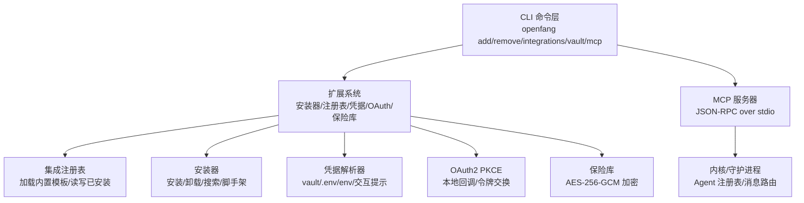
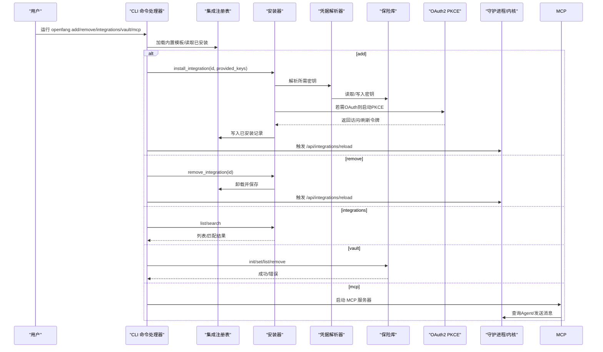
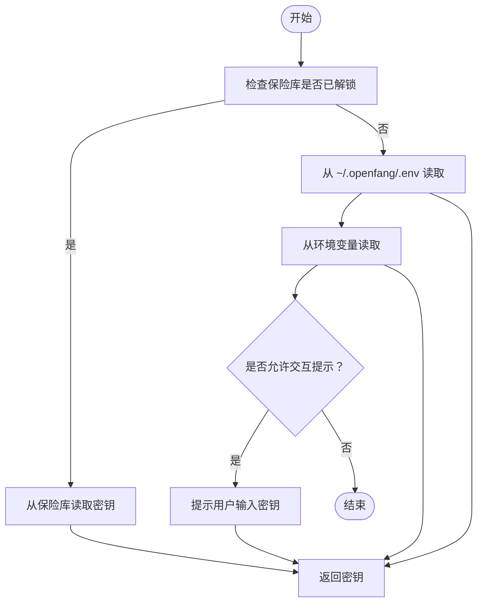
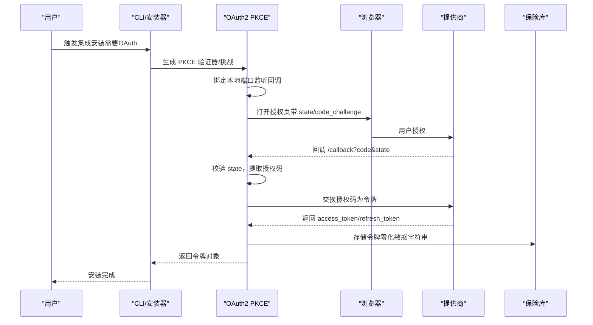
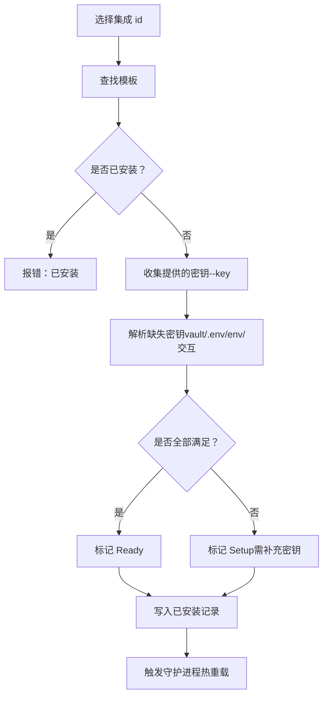
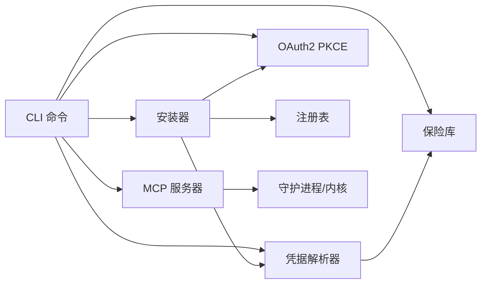

# 集成管理

<cite>
**本文引用的文件**
- [crates/openfang-cli/src/main.rs](file://crates/openfang-cli/src/main.rs)
- [crates/openfang-cli/src/mcp.rs](file://crates/openfang-cli/src/mcp.rs)
- [crates/openfang-extensions/src/lib.rs](file://crates/openfang-extensions/src/lib.rs)
- [crates/openfang-extensions/src/installer.rs](file://crates/openfang-extensions/src/installer.rs)
- [crates/openfang-extensions/src/vault.rs](file://crates/openfang-extensions/src/vault.rs)
- [crates/openfang-extensions/src/credentials.rs](file://crates/openfang-extensions/src/credentials.rs)
- [crates/openfang-extensions/src/oauth.rs](file://crates/openfang-extensions/src/oauth.rs)
- [crates/openfang-extensions/src/registry.rs](file://crates/openfang-extensions/src/registry.rs)
- [crates/openfang-extensions/integrations/github.toml](file://crates/openfang-extensions/integrations/github.toml)
- [crates/openfang-extensions/integrations/slack.toml](file://crates/openfang-extensions/integrations/slack.toml)
- [crates/openfang-extensions/integrations/gmail.toml](file://crates/openfang-extensions/integrations/gmail.toml)
</cite>

## 目录
1. [简介](#简介)
2. [项目结构](#项目结构)
3. [核心组件](#核心组件)
4. [架构总览](#架构总览)
5. [详细组件分析](#详细组件分析)
6. [依赖关系分析](#依赖关系分析)
7. [性能考虑](#性能考虑)
8. [故障排除指南](#故障排除指南)
9. [结论](#结论)
10. [附录](#附录)

## 简介
本文件为 OpenFang 集成管理命令的权威参考，覆盖第三方集成安装与管理（add、remove、integrations）、凭据保险库（vault init、vault set、vault list、vault remove）以及 MCP 服务器支持与 OAuth2 流程。文档面向不同技术背景的读者，既提供命令语法与参数说明，也解释系统架构、扩展机制与安全策略，并给出典型使用场景与最佳实践。

## 项目结构
OpenFang 的集成体系由 CLI 命令层、扩展系统（集成注册表、安装器、凭据解析、OAuth、保险库）与 MCP 服务器组成。CLI 负责用户交互与调用扩展系统；扩展系统负责模板解析、安装流程、凭据解析与持久化；MCP 服务器将运行中的 Agent 暴露为工具供外部调用；OAuth 提供本地回调授权流程；保险库提供加密凭据存储。

图表来源
- [crates/openfang-cli/src/main.rs:4847-5030](file://crates/openfang-cli/src/main.rs#L4847-L5030)
- [crates/openfang-extensions/src/installer.rs:27-130](file://crates/openfang-extensions/src/installer.rs#L27-L130)
- [crates/openfang-extensions/src/registry.rs:108-131](file://crates/openfang-extensions/src/registry.rs#L108-L131)
- [crates/openfang-extensions/src/credentials.rs:16-80](file://crates/openfang-extensions/src/credentials.rs#L16-L80)
- [crates/openfang-extensions/src/oauth.rs:121-258](file://crates/openfang-extensions/src/oauth.rs#L121-L258)
- [crates/openfang-extensions/src/vault.rs:56-130](file://crates/openfang-extensions/src/vault.rs#L56-L130)
- [crates/openfang-cli/src/mcp.rs:114-160](file://crates/openfang-cli/src/mcp.rs#L114-L160)

章节来源
- [crates/openfang-cli/src/main.rs:4847-5030](file://crates/openfang-cli/src/main.rs#L4847-L5030)
- [crates/openfang-extensions/src/lib.rs:1-329](file://crates/openfang-extensions/src/lib.rs#L1-L329)

## 核心组件
- CLI 命令层：定义并执行 openfang add、remove、integrations、vault 子命令，以及启动 MCP 服务器。
- 扩展系统：提供集成模板、安装/卸载、搜索、脚手架生成；凭据解析与存储；OAuth2 PKCE 授权；健康检查与状态管理。
- 注册表：维护内置模板与已安装集成的状态文件。
- 安装器：执行安装流程，处理凭据、OAuth、写入状态文件与触发热重载。
- 凭据解析器：按优先级从 vault、.env、环境变量、交互提示解析密钥。
- OAuth2 PKCE：本地端口回调、浏览器授权、令牌交换与存储。
- 保险库：基于 AES-256-GCM 的加密存储，支持 OS 密钥环或环境变量主密钥。
- MCP 服务器：将运行中的 Agent 暴露为工具，通过 JSON-RPC over stdio 通信。

章节来源
- [crates/openfang-extensions/src/installer.rs:1-403](file://crates/openfang-extensions/src/installer.rs#L1-L403)
- [crates/openfang-extensions/src/credentials.rs:1-273](file://crates/openfang-extensions/src/credentials.rs#L1-L273)
- [crates/openfang-extensions/src/oauth.rs:1-384](file://crates/openfang-extensions/src/oauth.rs#L1-L384)
- [crates/openfang-extensions/src/vault.rs:1-659](file://crates/openfang-extensions/src/vault.rs#L1-L659)
- [crates/openfang-cli/src/mcp.rs:1-440](file://crates/openfang-cli/src/mcp.rs#L1-L440)

## 架构总览
下图展示 openfang add/remove/integrations/vault/mcp 的关键交互路径与数据流。

图表来源
- [crates/openfang-cli/src/main.rs:4847-5030](file://crates/openfang-cli/src/main.rs#L4847-L5030)
- [crates/openfang-extensions/src/installer.rs:27-130](file://crates/openfang-extensions/src/installer.rs#L27-L130)
- [crates/openfang-extensions/src/credentials.rs:47-80](file://crates/openfang-extensions/src/credentials.rs#L47-L80)
- [crates/openfang-extensions/src/oauth.rs:121-258](file://crates/openfang-extensions/src/oauth.rs#L121-L258)
- [crates/openfang-extensions/src/vault.rs:78-130](file://crates/openfang-extensions/src/vault.rs#L78-L130)
- [crates/openfang-cli/src/mcp.rs:114-160](file://crates/openfang-cli/src/mcp.rs#L114-L160)

## 详细组件分析

### 命令：openfang add
- 功能：一键安装第三方集成（MCP 服务器），自动解析/存储凭据，必要时启动 OAuth2 PKCE 授权，写入已安装记录并触发守护进程热重载。
- 语法
  - openfang add <name> [--key <值>]
- 参数
  - name：集成标识（如 github、slack、gmail 等）
  - --key：可选，直接提供首个“秘密”环境变量的值，自动存入保险库
- 行为
  - 校验模板存在性；初始化凭据解析器（支持 vault/.env/env/交互提示）；若提供 --key，则映射到模板要求的第一个秘密环境变量并存入 vault；调用安装器执行安装；根据状态输出提示；若守护进程运行，POST /api/integrations/reload 触发热重载。
- 使用示例
  - openfang add github
  - openfang add slack --key xoxb-...
  - openfang add gmail --key <Google 访问令牌>
- 注意事项
  - 若模板声明了必需密钥且未满足，安装后会提示使用 openfang vault set 添加对应密钥。
  - 已安装的集成不可重复安装。

章节来源
- [crates/openfang-cli/src/main.rs:4847-4931](file://crates/openfang-cli/src/main.rs#L4847-L4931)
- [crates/openfang-extensions/src/installer.rs:27-130](file://crates/openfang-extensions/src/installer.rs#L27-L130)

### 命令：openfang remove
- 功能：卸载指定集成，更新已安装记录并触发热重载。
- 语法
  - openfang remove <name>
- 参数
  - name：集成标识
- 行为
  - 读取注册表，卸载并保存；若守护进程运行，POST /api/integrations/reload。
- 使用示例
  - openfang remove github
  - openfang remove slack

章节来源
- [crates/openfang-cli/src/main.rs:4933-4954](file://crates/openfang-cli/src/main.rs#L4933-L4954)
- [crates/openfang-extensions/src/installer.rs:132-143](file://crates/openfang-extensions/src/installer.rs#L132-L143)

### 命令：openfang integrations
- 功能：列出或搜索可用集成，显示分类、状态与描述。
- 语法
  - openfang integrations [<query>]
- 参数
  - query：可选，搜索关键词
- 行为
  - 无查询时列出所有；有查询时进行匹配；按类别分组输出；统计已安装数量。
- 使用示例
  - openfang integrations
  - openfang integrations git
  - openfang integrations slack

章节来源
- [crates/openfang-cli/src/main.rs:4957-5030](file://crates/openfang-cli/src/main.rs#L4957-L5030)
- [crates/openfang-extensions/src/installer.rs:145-219](file://crates/openfang-extensions/src/installer.rs#L145-L219)

### 命令：openfang vault
- 功能：凭据保险库管理（初始化、设置、列出、删除）。
- 语法
  - openfang vault init
  - openfang vault set <key>
  - openfang vault list
  - openfang vault remove <key>
- 行为
  - init：初始化保险库文件，优先使用 OS 密钥环存储主密钥，否则提示设置 OPENFANG_VAULT_KEY 环境变量。
  - set：解锁保险库后交互式输入密钥并存储。
  - list：解锁后列出所有键名。
  - remove：解锁后删除指定键。
- 使用示例
  - openfang vault init
  - openfang vault set GITHUB_PERSONAL_ACCESS_TOKEN
  - openfang vault list
  - openfang vault remove SLACK_BOT_TOKEN

章节来源
- [crates/openfang-cli/src/main.rs:5035-5130](file://crates/openfang-cli/src/main.rs#L5035-L5130)
- [crates/openfang-extensions/src/vault.rs:78-130](file://crates/openfang-extensions/src/vault.rs#L78-L130)
- [crates/openfang-extensions/src/vault.rs:151-177](file://crates/openfang-extensions/src/vault.rs#L151-L177)
- [crates/openfang-extensions/src/vault.rs:179-182](file://crates/openfang-extensions/src/vault.rs#L179-L182)
- [crates/openfang-extensions/src/vault.rs:166-177](file://crates/openfang-extensions/src/vault.rs#L166-L177)

### 命令：openfang mcp
- 功能：在标准输入/输出上启动 MCP 服务器，将运行中的 Agent 暴露为工具。
- 语法
  - openfang mcp
- 行为
  - 优先连接运行中的守护进程，否则启动内核单实例；读取 Content-Length 帧的 JSON-RPC 请求；支持 initialize、tools/list、tools/call 等方法；对 tools/call 将消息转发给目标 Agent 并返回文本内容。
- 使用示例
  - openfang mcp
- 安全
  - 对超大消息进行限制以防止内存耗尽。

章节来源
- [crates/openfang-cli/src/mcp.rs:114-160](file://crates/openfang-cli/src/mcp.rs#L114-L160)
- [crates/openfang-cli/src/mcp.rs:162-226](file://crates/openfang-cli/src/mcp.rs#L162-L226)
- [crates/openfang-cli/src/mcp.rs:228-358](file://crates/openfang-cli/src/mcp.rs#L228-L358)

### 集成模板与示例
- 模板字段概览（以 GitHub、Slack、Gmail 为例）
  - id/name/description/category/icon/tags：元信息
  - transport：MCP 传输方式（stdio/SSE）
  - required_env：必需环境变量（名称、标签、帮助、是否秘密、获取链接）
  - oauth：OAuth 提供商、作用域、授权/令牌端点
  - health_check：健康检查间隔与阈值
  - setup_instructions：安装指引
- 示例文件
  - GitHub：API Key + OAuth 支持
  - Slack：Bot Token + Team ID + OAuth 支持
  - Gmail：OAuth Google 账号授权

章节来源
- [crates/openfang-extensions/integrations/github.toml:1-35](file://crates/openfang-extensions/integrations/github.toml#L1-L35)
- [crates/openfang-extensions/integrations/slack.toml:1-42](file://crates/openfang-extensions/integrations/slack.toml#L1-L42)
- [crates/openfang-extensions/integrations/gmail.toml:1-28](file://crates/openfang-extensions/integrations/gmail.toml#L1-L28)

### 凭据解析与存储流程

图表来源
- [crates/openfang-extensions/src/credentials.rs:47-80](file://crates/openfang-extensions/src/credentials.rs#L47-L80)

章节来源
- [crates/openfang-extensions/src/credentials.rs:1-273](file://crates/openfang-extensions/src/credentials.rs#L1-L273)
- [crates/openfang-extensions/src/vault.rs:132-149](file://crates/openfang-extensions/src/vault.rs#L132-L149)

### OAuth2 PKCE 授权流程

图表来源
- [crates/openfang-extensions/src/oauth.rs:121-258](file://crates/openfang-extensions/src/oauth.rs#L121-L258)
- [crates/openfang-extensions/src/vault.rs:156-164](file://crates/openfang-extensions/src/vault.rs#L156-L164)

章节来源
- [crates/openfang-extensions/src/oauth.rs:1-384](file://crates/openfang-extensions/src/oauth.rs#L1-L384)
- [crates/openfang-extensions/src/vault.rs:1-659](file://crates/openfang-extensions/src/vault.rs#L1-L659)

### 安装器工作流

图表来源
- [crates/openfang-extensions/src/installer.rs:27-130](file://crates/openfang-extensions/src/installer.rs#L27-L130)
- [crates/openfang-cli/src/main.rs:4918-4924](file://crates/openfang-cli/src/main.rs#L4918-L4924)

章节来源
- [crates/openfang-extensions/src/installer.rs:1-403](file://crates/openfang-extensions/src/installer.rs#L1-L403)

## 依赖关系分析
- CLI 依赖扩展系统：命令处理器调用安装器、注册表、凭据解析器、OAuth、保险库。
- 安装器依赖：注册表（模板/状态）、凭据解析器（密钥解析/存储）、OAuth（可选）、操作系统密钥环（可选）。
- 保险库依赖：AES-256-GCM、Argon2 密钥派生、平台密钥环或环境变量主密钥。
- MCP 服务器依赖：守护进程或内核，用于查询 Agent 列表与发送消息。

图表来源
- [crates/openfang-cli/src/main.rs:4847-5030](file://crates/openfang-cli/src/main.rs#L4847-L5030)
- [crates/openfang-extensions/src/installer.rs:1-403](file://crates/openfang-extensions/src/installer.rs#L1-L403)
- [crates/openfang-extensions/src/credentials.rs:1-273](file://crates/openfang-extensions/src/credentials.rs#L1-L273)
- [crates/openfang-extensions/src/oauth.rs:1-384](file://crates/openfang-extensions/src/oauth.rs#L1-L384)
- [crates/openfang-extensions/src/vault.rs:1-659](file://crates/openfang-extensions/src/vault.rs#L1-L659)
- [crates/openfang-cli/src/mcp.rs:1-440](file://crates/openfang-cli/src/mcp.rs#L1-L440)

章节来源
- [crates/openfang-extensions/src/lib.rs:1-329](file://crates/openfang-extensions/src/lib.rs#L1-L329)

## 性能考虑
- MCP 消息大小限制：防止异常或恶意请求导致内存占用过高。
- OAuth 回调服务：仅在授权时短暂监听本地端口，超时后关闭。
- 安装器：按需解析密钥，避免不必要的 IO；成功后触发热重载，减少重启成本。
- 保险库：使用零化内存与一次性密钥派生，降低泄露风险。

## 故障排除指南
- 无法解锁保险库
  - 症状：提示“保险库锁定”
  - 处理：确保 OS 密钥环可用或设置 OPENFANG_VAULT_KEY 环境变量；确认主密钥正确。
- 未知集成
  - 症状：提示“未知集成”
  - 处理：使用 openfang integrations 查看可用列表，确认拼写与 id。
- 已安装重复安装
  - 症状：提示“集成已安装”
  - 处理：先使用 openfang remove 卸载后再安装。
- OAuth 授权失败
  - 症状：回调超时或状态不匹配
  - 处理：检查本地端口可用性；确认浏览器打开授权页；重新发起安装。
- MCP 工具不可用
  - 症状：tools/list 不显示预期工具
  - 处理：确认守护进程运行；触发 /api/integrations/reload；检查 Agent 名称与 ID 映射规则。

章节来源
- [crates/openfang-extensions/src/vault.rs:132-149](file://crates/openfang-extensions/src/vault.rs#L132-L149)
- [crates/openfang-extensions/src/oauth.rs:121-258](file://crates/openfang-extensions/src/oauth.rs#L121-L258)
- [crates/openfang-cli/src/main.rs:4854-4863](file://crates/openfang-cli/src/main.rs#L4854-L4863)
- [crates/openfang-cli/src/mcp.rs:162-226](file://crates/openfang-cli/src/mcp.rs#L162-L226)

## 结论
OpenFang 的集成管理通过 CLI 与扩展系统实现了从模板解析、凭据管理、OAuth 授权到 MCP 工具暴露的完整闭环。其设计强调安全性（保险库加密、零化内存、PKCE）、易用性（一键安装、热重载）与可扩展性（内置模板与自定义脚手架）。遵循本文的最佳实践与故障排除建议，可高效、安全地完成第三方服务集成与日常运维。

## 附录

### 命令速查表
- openfang add <name> [--key <值>]
- openfang remove <name>
- openfang integrations [<query>]
- openfang vault init
- openfang vault set <key>
- openfang vault list
- openfang vault remove <key>
- openfang mcp

### 最佳实践
- 安装前准备
  - 使用 openfang integrations 搜索并确认模板信息与所需权限。
  - 在集成模板的“获取链接”处创建并获取密钥。
- 安全配置
  - 优先使用保险库存储敏感密钥；避免将明文密钥写入 .env 或环境变量。
  - 在 CI/无头环境使用 OPENFANG_VAULT_KEY；在交互环境使用 OS 密钥环。
- OAuth 授权
  - 确保本地端口可访问；授权完成后检查令牌是否成功存储。
- MCP 使用
  - 守护进程运行时，安装/卸载集成后会自动热重载；也可手动触发 /api/integrations/reload。
- 故障排查
  - 从保险库、.env、环境变量逐级检查密钥；确认 OAuth 回调状态；验证 MCP 消息帧长度限制。