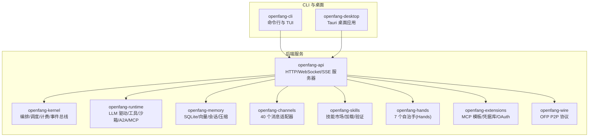
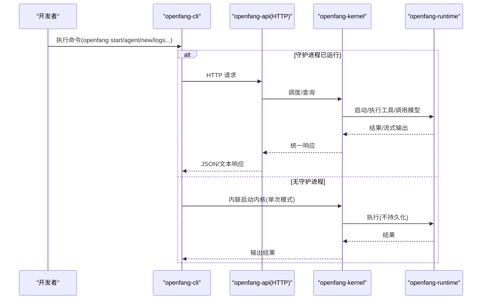
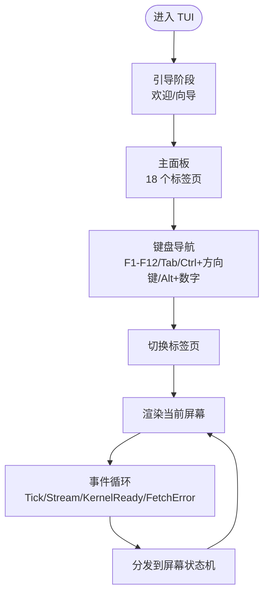
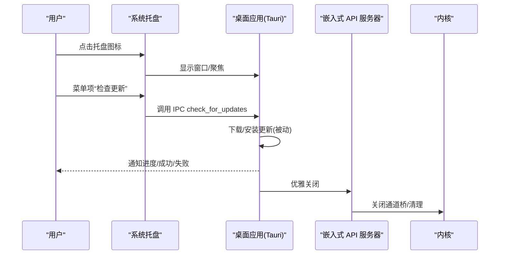
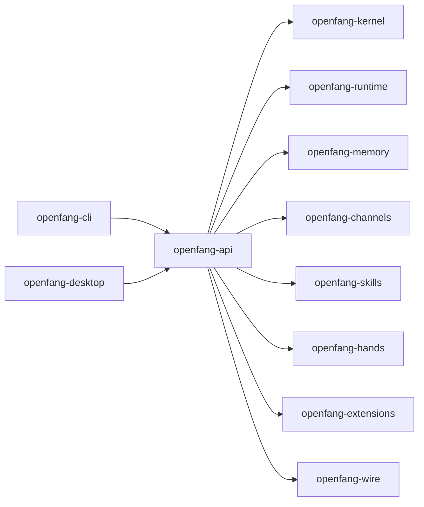

# CLI 工具和桌面应用

<cite>
**本文引用的文件**
- [README.md](file://README.md)
- [cli 参考.md](file://docs/cli-reference.md)
- [桌面应用.md](file://docs/desktop.md)
- [配置参考.md](file://docs/configuration.md)
- [API 参考.md](file://docs/api-reference.md)
- [openfang-cli 主程序](file://crates/openfang-cli/src/main.rs)
- [openfang-cli TUI 模块](file://crates/openfang-cli/src/tui/mod.rs)
- [openfang-cli TUI 屏幕模块索引](file://crates/openfang-cli/src/tui/screens/mod.rs)
- [openfang-api 库入口](file://crates/openfang-api/src/lib.rs)
- [openfang-api Cargo.toml](file://crates/openfang-api/Cargo.toml)
- [openfang-cli Cargo.toml](file://crates/openfang-cli/Cargo.toml)
- [示例配置文件](file://openfang.toml.example)
</cite>

## 目录
1. [简介](#简介)
2. [项目结构](#项目结构)
3. [核心组件](#核心组件)
4. [架构总览](#架构总览)
5. [详细组件分析](#详细组件分析)
6. [依赖分析](#依赖分析)
7. [性能考量](#性能考量)
8. [故障排除指南](#故障排除指南)
9. [结论](#结论)
10. [附录](#附录)

## 简介
本文件面向开发者，系统化梳理 OpenFang 的 CLI 工具与桌面应用（Tauri）能力，覆盖命令参考、TUI 仪表板、桌面应用特性、守护进程管理、智能体生命周期、配置与日志、API 关系、高级用法与自动化集成、故障排除与性能优化等主题。目标是帮助你快速掌握从本地开发到生产部署的完整工具链。

## 项目结构
OpenFang 采用多 crate 的模块化设计，CLI、API、内核、运行时、通道适配器、技能与手（Hands）、内存、扩展、迁移、类型定义、协议与前端静态资源等均独立封装，便于按需组合使用。

图表来源
- [openfang-cli Cargo.toml:1-34](file://crates/openfang-cli/Cargo.toml#L1-L34)
- [openfang-api Cargo.toml:1-46](file://crates/openfang-api/Cargo.toml#L1-L46)

章节来源
- [README.md: 第 231–250 行:231-250](file://README.md#L231-L250)

## 核心组件
- CLI（openfang-cli）
  - 子命令体系：初始化、启动/停止守护进程、代理聊天、智能体生命周期、工作流/触发器、技能/渠道/手管理、配置、日志、健康检查、审计、内存、设备配对、Webhook、系统信息、重置/卸载等。
  - TUI 交互：基于 ratatui 的全屏仪表板，包含 18 个标签页（仪表盘、智能体、聊天、会话、工作流、触发器、内存、渠道、技能、手、扩展、模板、节点、通信、安全、审计、用量、设置、日志）。
- API（openfang-api）
  - 提供 140+ REST/WS/SSE 接口，支持 OpenAI 兼容路径；内置安全头、GCRA 限流、认证开关、审计链、速率限制等。
- 桌面应用（openfang-desktop）
  - Tauri 2.0 包装内核与 API 服务器，提供系统托盘、通知、自动更新、全局快捷键、单实例、隐藏到托盘等特性。

章节来源
- [openfang-cli 主程序: 第 107–296 行:107-296](file://crates/openfang-cli/src/main.rs#L107-L296)
- [openfang-cli TUI 模块: 第 29–84 行:29-84](file://crates/openfang-cli/src/tui/mod.rs#L29-L84)
- [openfang-api 库入口: 第 1–19 行:1-19](file://crates/openfang-api/src/lib.rs#L1-L19)

## 架构总览
CLI 与桌面应用均通过 HTTP 与内核/API 交互；桌面应用在本地嵌入一个仅监听 127.0.0.1 的 API 服务器，WebView 渲染由 axum 提供的前端界面。

图表来源
- [openfang-cli 主程序: 第 16–25 行:16-25](file://crates/openfang-cli/src/main.rs#L16-L25)
- [openfang-api 库入口: 第 1–19 行:1-19](file://crates/openfang-api/src/lib.rs#L1-L19)

## 详细组件分析

### CLI 命令参考与高级用法
- 全局选项
  - --config：自定义配置路径；--help/--version。
  - 环境变量：RUST_LOG 控制日志级别；OPENFANG_AGENTS_DIR 覆盖模板目录；EDITOR/VISUAL 用于编辑配置。
- 守护进程管理
  - openfang start：启动内核+API；写入 daemon.json 以便 CLI 发现；阻塞直到 Ctrl+C。
  - openfang stop/status/doctor/health：停止、状态查询、诊断、健康检查。
- 智能体生命周期
  - openfang agent new/spawn/list/chat/kill/set：模板生成、从清单创建、列出、交互聊天、终止、动态设置字段。
- 工作流与触发器
  - openfang workflow list/create/run：注册/创建/执行工作流。
  - openfang trigger list/create/delete：事件触发器管理。
- 技能/渠道/手
  - openfang skill list/install/remove/search/create：技能生态。
  - openfang channel list/setup/test/enable/disable：渠道配置与测试。
  - openfang hand list/active/install/activate/deactivate/info/check-deps/install-deps/pause/resume：手的生命周期与依赖管理。
- 配置与密钥
  - openfang config show/edit/get/set/unset/set-key/delete-key/test-key：配置读写与密钥测试。
- 日志与健康
  - openfang logs：查看/跟随日志。
  - openfang doctor：自动修复模式。
- 审计/内存/设备/Webhook/系统信息
  - openfang security audit/verify、memory list/get/set/delete、devices list/pair/remove、webhooks list/create/delete/test、system info/version。
- 高级用法与自动化
  - --json 输出便于脚本解析；completion 生成补全；dashboard 打开浏览器；mcp 启动 MCP 服务器；gateway 子命令控制守护进程；approvals 列表/批准/拒绝；cron 计划任务；sessions 会话列表；message 一次性消息；reset/uninstall 安全清理。

章节来源
- [cli 参考.md: 第 41–58 行:41-58](file://docs/cli-reference.md#L41-L58)
- [cli 参考.md: 第 110–154 行:110-154](file://docs/cli-reference.md#L110-L154)
- [cli 参考.md: 第 158–183 行:158-183](file://docs/cli-reference.md#L158-L183)
- [cli 参考.md: 第 187–226 行:187-226](file://docs/cli-reference.md#L187-L226)
- [cli 参考.md: 第 284–424 行:284-424](file://docs/cli-reference.md#L284-L424)
- [cli 参考.md: 第 427–485 行:427-485](file://docs/cli-reference.md#L427-L485)
- [cli 参考.md: 第 488–564 行:488-564](file://docs/cli-reference.md#L488-L564)
- [cli 参考.md: 第 566–687 行:566-687](file://docs/cli-reference.md#L566-L687)
- [cli 参考.md: 第 689–800 行:689-800](file://docs/cli-reference.md#L689-L800)

### TUI 仪表板功能与导航
- 两阶段引导：欢迎/向导 → 主面板。
- 18 个标签页：仪表盘、智能体、聊天、会话、工作流、触发器、内存、渠道、技能、手、扩展、模板、节点、通信、安全、审计、用量、设置、日志。
- 导航方式：F1–F12 快捷键、Tab/Shift+Tab、Ctrl+方向键、Alt+数字；双 Ctrl+C 退出（主面板）或提示再次退出（引导面板）。
- 实时数据：各标签页通过后台事件刷新，支持分页/筛选/状态提示。
- 事件驱动：键盘事件路由至当前屏幕状态机，统一通过 AppEvent 分发处理。

图表来源
- [openfang-cli TUI 模块: 第 30–84 行:30-84](file://crates/openfang-cli/src/tui/mod.rs#L30-L84)
- [openfang-cli TUI 模块: 第 612–778 行:612-778](file://crates/openfang-cli/src/tui/mod.rs#L612-L778)

章节来源
- [openfang-cli TUI 模块: 第 1–120 行:1-120](file://crates/openfang-cli/src/tui/mod.rs#L1-L120)
- [openfang-cli TUI 屏幕模块索引: 第 1–23 行:1-23](file://crates/openfang-cli/src/tui/screens/mod.rs#L1-L23)

### 桌面应用特性（系统托盘、通知、全局快捷键、自动更新）
- 架构与启动流程
  - tracing 初始化、内核启动、随机端口绑定、后台线程运行 API 服务器、WebView 加载本地地址、优雅关闭。
- 系统托盘
  - 菜单项：显示窗口、浏览器打开、运行中智能体数量、运行时长、开机自启、检查更新、打开配置目录、退出。
  - 左键托盘图标显示主窗口。
- 单实例与隐藏到托盘
  - 单实例插件阻止重复启动；关闭窗口不退出，而是隐藏并抑制关闭事件。
- 通知
  - 订阅内核事件总线，转发关键事件为原生通知（如 Agent 启动/崩溃/健康检查失败）。
- IPC 命令
  - get_port、get_status、get_agent_count、import_agent_toml、import_skill_file、get/set_autostart、check_for_updates、install_update、open_config_dir/open_logs_dir。
- 自动更新
  - 启动后延迟检查更新，支持被动安装；签名公钥配置于 tauri.conf.json；发布包由 GitHub Actions 生成并签名。
- CSP 与构建
  - WebView CSP 仅允许本地回环连接；支持多平台打包（MSI/EXE、DMG/APP、DEB/RPM/AppImage）。

图表来源
- [桌面应用.md: 第 36–79 行:36-79](file://docs/desktop.md#L36-L79)
- [桌面应用.md: 第 82–149 行:82-149](file://docs/desktop.md#L82-L149)
- [桌面应用.md: 第 152–221 行:152-221](file://docs/desktop.md#L152-L221)
- [桌面应用.md: 第 238–266 行:238-266](file://docs/desktop.md#L238-L266)

章节来源
- [桌面应用.md: 第 1–413 行:1-413](file://docs/desktop.md#L1-L413)

### 配置管理与环境变量
- 配置文件
  - 默认位置：~/.openfang/config.toml；最小配置只需提供默认模型与对应 API 密钥环境变量。
  - 支持默认模型、内存、网络、Web 搜索/抓取、渠道适配器、MCP 服务器、A2A 外部代理、RBAC 用户、回退提供商等。
- 环境变量
  - RUST_LOG：日志级别；OPENFANG_AGENTS_DIR：模板目录覆盖；EDITOR/VISUAL：编辑器选择。
- CLI 与桌面共享同一内核配置，桌面应用启动时同样加载 config.toml 并继承所有环境变量。

章节来源
- [配置参考.md: 第 29–45 行:29-45](file://docs/configuration.md#L29-L45)
- [配置参考.md: 第 48–72 行:48-72](file://docs/configuration.md#L48-L72)
- [配置参考.md: 第 219–253 行:219-253](file://docs/configuration.md#L219-L253)
- [示例配置文件: 第 1–49 行:1-49](file://openfang.toml.example#L1-L49)
- [cli 参考.md: 第 51–58 行:51-58](file://docs/cli-reference.md#L51-L58)
- [桌面应用.md: 第 406–412 行:406-412](file://docs/desktop.md#L406-L412)

### 日志查看与实时监控
- CLI
  - openfang logs：查看最近 N 行并可 follow 实时输出。
- TUI
  - Logs 标签页：分页/筛选/刷新，展示审计链与系统事件。
- 桌面应用
  - 通过 IPC 获取状态与端口，结合日志文件定位问题；通知关键事件便于监控。

章节来源
- [cli 参考.md: 第 225–239 行:225-239](file://docs/cli-reference.md#L225-L239)
- [openfang-cli TUI 模块: 第 531–535 行:531-535](file://crates/openfang-cli/src/tui/mod.rs#L531-L535)

### CLI 与 API 的关系
- 当守护进程运行时，CLI 通过 HTTP 与 API 交互；API 在内核之上提供统一接口。
- openfang-api 暴露 140+ 接口，包括智能体、工作流、触发器、内存、渠道、模板、系统、模型目录、MCP/A2A、审计/安全、用量、会话、WebSocket/SSE 等。
- OpenAI 兼容路径可用于现有工具无缝接入。

章节来源
- [openfang-api 库入口: 第 1–19 行:1-19](file://crates/openfang-api/src/lib.rs#L1-L19)
- [API 参考.md: 第 1–30 行:1-30](file://docs/api-reference.md#L1-L30)
- [API 参考.md: 第 33–57 行:33-57](file://docs/api-reference.md#L33-L57)
- [README.md: 第 389–403 行:389-403](file://README.md#L389-L403)

### 高级用法、批处理脚本与自动化集成
- 使用 --json 输出便于脚本解析与管道处理。
- 通过 completion 生成 shell 补全，提升交互效率。
- 使用 dashboard 打开浏览器仪表盘，结合 API 进行二次开发。
- 通过 MCP 服务器模式与外部工具对接，实现能力扩展。
- 通过 webhook 与外部系统联动，配合 trigger 实现事件驱动。

章节来源
- [cli 参考.md: 第 252–281 行:252-281](file://docs/cli-reference.md#L252-L281)
- [cli 参考.md: 第 174–175 行:174-175](file://docs/cli-reference.md#L174-L175)
- [API 参考.md: 第 1–30 行:1-30](file://docs/api-reference.md#L1-L30)

## 依赖分析
- openfang-cli 依赖 openfang-api、openfang-kernel、openfang-runtime、openfang-skills、openfang-extensions、openfang-migrate 等，提供命令行与 TUI 能力。
- openfang-api 依赖内核、运行时、内存、通道、技能、手、扩展、迁移、wire 等，提供 HTTP/WebSocket/SSE 服务。
- 二者通过 HTTP 通信，桌面应用以嵌入式服务器形式复用相同 API。

图表来源
- [openfang-cli Cargo.toml: 第 12–31 行:12-31](file://crates/openfang-cli/Cargo.toml#L12-L31)
- [openfang-api Cargo.toml: 第 8–18 行:8-18](file://crates/openfang-api/Cargo.toml#L8-L18)

章节来源
- [openfang-cli Cargo.toml: 第 1–34 行:1-34](file://crates/openfang-cli/Cargo.toml#L1-L34)
- [openfang-api Cargo.toml: 第 1–46 行:1-46](file://crates/openfang-api/Cargo.toml#L1-L46)

## 性能考量
- 冷启动时间与内存占用：官方基准显示 OpenFang 在冷启动与内存占用方面具有优势，适合长时间运行与多场景并发。
- 限流与安全：GCRA 成本感知令牌桶限流、CSP/X-Frame-Options/HSTS 等安全头、WASM 双计量沙箱、审计链等保障稳定与安全。
- 日志与追踪：RUST_LOG 控制粒度，避免 TUI 日志污染；桌面应用与 CLI 均支持细粒度日志输出。
- 网络与通道：通道适配器支持速率限制与策略控制，减少带宽与 API 调用压力。

章节来源
- [README.md: 第 121–186 行:121-186](file://README.md#L121-L186)
- [API 参考.md: 第 1–6 行:1-6](file://docs/api-reference.md#L1-L6)

## 故障排除指南
- doctor 诊断
  - 检查目录权限、配置语法、守护进程状态、端口占用、数据库校验、磁盘空间、智能体清单、提供商密钥有效性、渠道令牌格式、配置一致性、工具链版本等。
  - 支持 --repair 自动修复（逐项确认）。
- 常见问题
  - 守护进程未启动：使用 openfang start 或桌面应用启动；确认端口未被占用。
  - 权限不足：确保配置与 .env 文件权限正确（Unix 上 0600）。
  - 渠道配置错误：使用 channel list/test/enable/disable 定位问题。
  - 日志定位：使用 logs --follow 实时查看；TUI Logs 标签页辅助过滤。
  - 审计与安全：使用 security audit/verify 核验审计链完整性。
- 卸载与重置
  - openfang reset/uninstall 支持清理配置与状态；注意 --confirm/--yes 与 --keep-config 选项。

章节来源
- [cli 参考.md: 第 187–226 行:187-226](file://docs/cli-reference.md#L187-L226)
- [API 参考.md: 第 622–715 行:622-715](file://docs/api-reference.md#L622-L715)

## 结论
OpenFang 的 CLI 与桌面应用提供了从开发到生产的完整工具链：命令行高效、TUI 交互直观、桌面应用体验原生且安全。通过统一的 API 与配置体系，开发者可以轻松完成守护进程管理、智能体生命周期、工作流与触发器、渠道与技能生态、审计与安全、日志与监控等任务，并与现有工具链（如 OpenAI 兼容 API、MCP、Webhook）无缝集成。

## 附录
- 快速开始
  - 安装与初始化：openfang init；启动：openfang start；打开仪表盘：openfang dashboard；激活手：openfang hand activate。
- 示例与最佳实践
  - 使用 --quick 非交互初始化；使用 --json 输出便于脚本；通过 MCP 与外部工具对接；利用 trigger 与 webhook 构建事件驱动工作流。

章节来源
- [README.md: 第 407–442 行:407-442](file://README.md#L407-L442)
- [cli 参考.md: 第 77–106 行:77-106](file://docs/cli-reference.md#L77-L106)