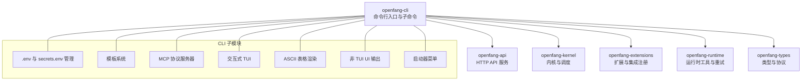
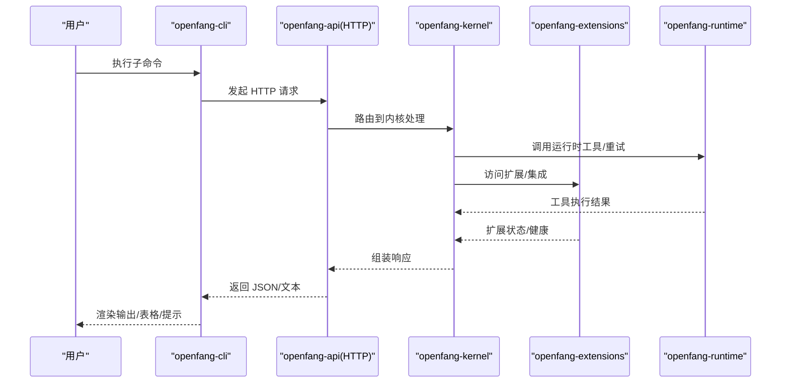
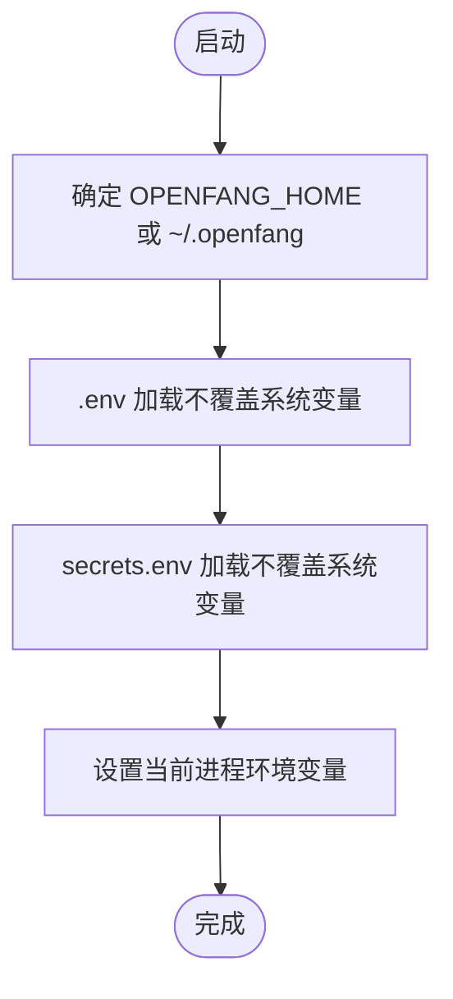
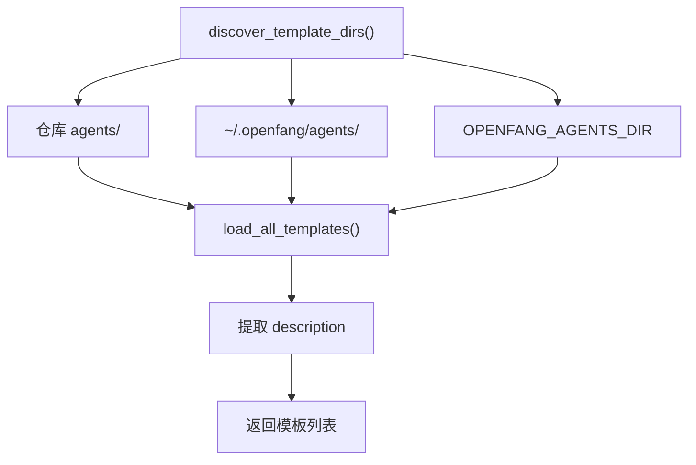
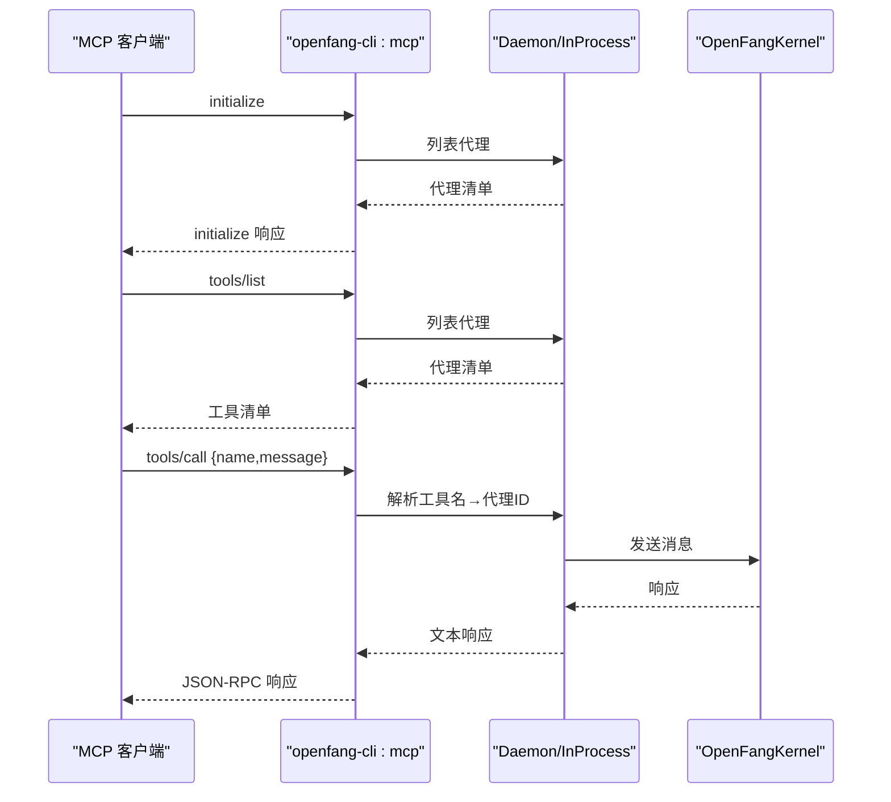
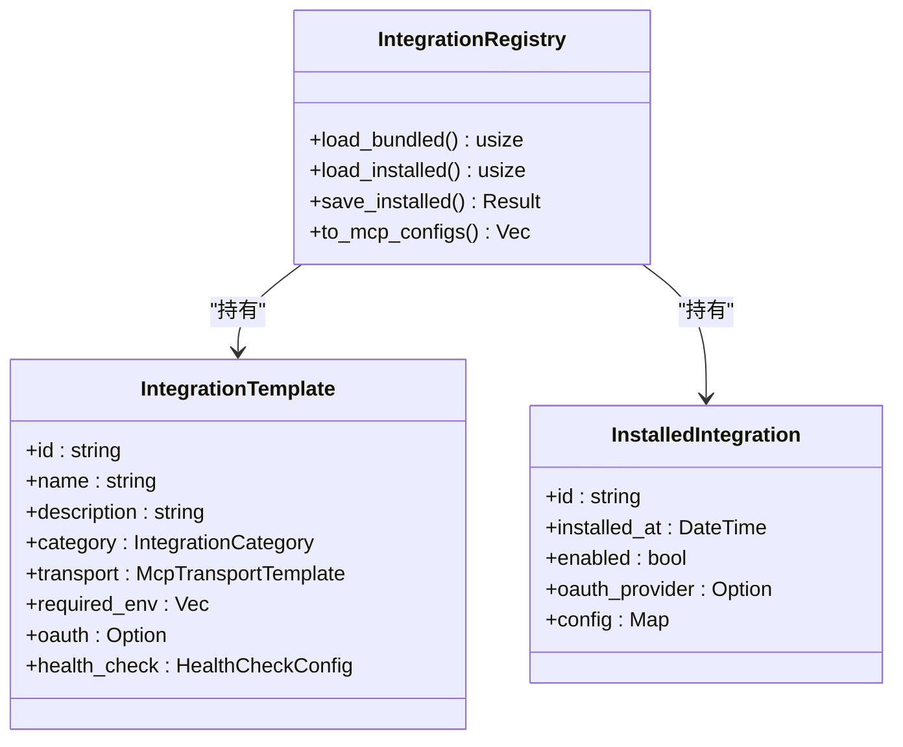
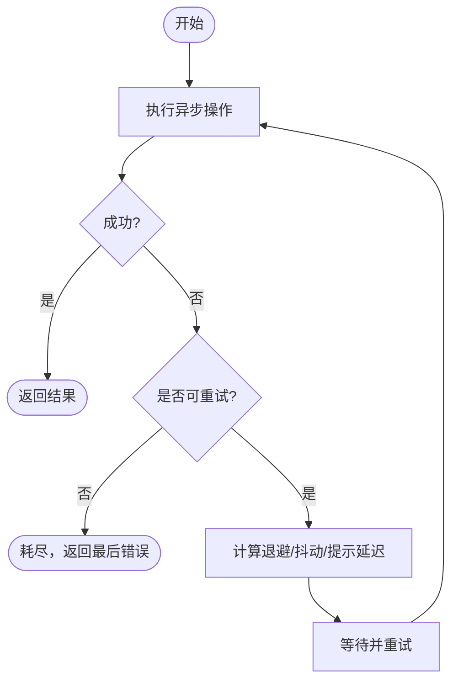
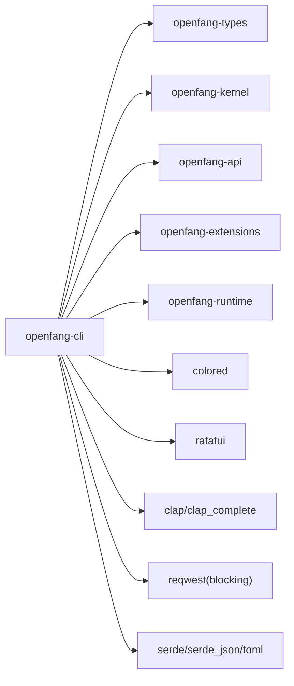

# CLI 高级用法

<cite>
**本文引用的文件**
- [crates/openfang-cli/src/main.rs](file://crates/openfang-cli/src/main.rs)
- [crates/openfang-cli/src/dotenv.rs](file://crates/openfang-cli/src/dotenv.rs)
- [crates/openfang-cli/src/mcp.rs](file://crates/openfang-cli/src/mcp.rs)
- [crates/openfang-cli/src/templates.rs](file://crates/openfang-cli/src/templates.rs)
- [crates/openfang-cli/src/launcher.rs](file://crates/openfang-cli/src/launcher.rs)
- [crates/openfang-cli/src/tui/mod.rs](file://crates/openfang-cli/src/tui/mod.rs)
- [crates/openfang-cli/src/ui.rs](file://crates/openfang-cli/src/ui.rs)
- [crates/openfang-cli/src/table.rs](file://crates/openfang-cli/src/table.rs)
- [crates/openfang-cli/src/bundled_agents.rs](file://crates/openfang-cli/src/bundled_agents.rs)
- [crates/openfang-cli/Cargo.toml](file://crates/openfang-cli/Cargo.toml)
- [crates/openfang-extensions/src/lib.rs](file://crates/openfang-extensions/src/lib.rs)
- [crates/openfang-extensions/src/registry.rs](file://crates/openfang-extensions/src/registry.rs)
- [crates/openfang-runtime/src/retry.rs](file://crates/openfang-runtime/src/retry.rs)
- [crates/openfang-runtime/src/tool_runner.rs](file://crates/openfang-runtime/src/tool_runner.rs)
- [crates/openfang-api/src/routes.rs](file://crates/openfang-api/src/routes.rs)
- [crates/openfang-kernel/src/config.rs](file://crates/openfang-kernel/src/config.rs)
</cite>

## 目录
1. [简介](#简介)
2. [项目结构](#项目结构)
3. [核心组件](#核心组件)
4. [架构总览](#架构总览)
5. [详细组件分析](#详细组件分析)
6. [依赖关系分析](#依赖关系分析)
7. [性能考虑](#性能考虑)
8. [故障排查指南](#故障排查指南)
9. [结论](#结论)
10. [附录](#附录)

## 简介
本指南面向 OpenFang CLI 的高级用户与开发者，系统讲解 CLI 的高级功能与专业用法，包括：
- 环境变量与凭据管理（dotenv 文件、密钥存储、安全策略）
- 模板系统与代理生成
- MCP 协议集成与工具调用
- 批量操作与自动化脚本
- 与外部工具集成、API 调用、JSON 数据处理与管道操作
- 配置文件格式、环境变量继承、凭据管理与安全最佳实践
- 性能优化、并发处理、错误重试机制
- 高级脚本示例、CI/CD 集成、监控告警与日志分析
- 扩展机制、自定义命令与插件系统
- 调试技巧、问题诊断与性能分析

## 项目结构
OpenFang CLI 位于 crates/openfang-cli，围绕子命令体系组织，配合 openfang-api、openfang-kernel、openfang-extensions、openfang-runtime 等模块实现与后端内核、扩展系统、运行时工具链的协作。

图表来源
- [crates/openfang-cli/src/main.rs:1-120](file://crates/openfang-cli/src/main.rs#L1-L120)
- [crates/openfang-cli/Cargo.toml:12-32](file://crates/openfang-cli/Cargo.toml#L12-L32)

章节来源
- [crates/openfang-cli/src/main.rs:88-294](file://crates/openfang-cli/src/main.rs#L88-L294)
- [crates/openfang-cli/Cargo.toml:12-32](file://crates/openfang-cli/Cargo.toml#L12-L32)

## 核心组件
- 命令解析与分发：基于 Clap 定义的 Commands 枚举，覆盖 agent、workflow、trigger、skill、channel、hand、config、models、gateway、approvals、cron、security、memory、devices、webhooks、system、logs、dashboard、completion、mcp、add/remove/integrations、vault、new、tui、doctor、status、chat、message、reset、uninstall 等子命令。
- 环境变量与密钥管理：.env 与 secrets.env 的加载、写入、权限控制；与 API 层 secrets.env 写入逻辑协同。
- 模板系统：发现与加载代理模板，支持内置与用户安装模板。
- MCP 集成：在进程内或通过 HTTP 与守护态内核通信，暴露工具调用能力。
- 扩展系统：集成模板注册、安装、健康检查、重连与 OAuth 流程。
- 运行时工具与重试：内置工具集与重试机制，保障网络与外部进程调用的稳定性。
- UI 与表格：非 TUI 的 doctor/status/logs 等输出与 ASCII 表格渲染。

章节来源
- [crates/openfang-cli/src/main.rs:107-294](file://crates/openfang-cli/src/main.rs#L107-L294)
- [crates/openfang-cli/src/dotenv.rs:1-116](file://crates/openfang-cli/src/dotenv.rs#L1-L116)
- [crates/openfang-cli/src/templates.rs:15-62](file://crates/openfang-cli/src/templates.rs#L15-L62)
- [crates/openfang-cli/src/mcp.rs:137-160](file://crates/openfang-cli/src/mcp.rs#L137-L160)
- [crates/openfang-extensions/src/lib.rs:146-177](file://crates/openfang-extensions/src/lib.rs#L146-L177)
- [crates/openfang-runtime/src/retry.rs:123-174](file://crates/openfang-runtime/src/retry.rs#L123-L174)

## 架构总览
CLI 与内核/扩展/运行时的关系如下：

图表来源
- [crates/openfang-cli/src/main.rs:3041-3108](file://crates/openfang-cli/src/main.rs#L3041-L3108)
- [crates/openfang-api/src/routes.rs:8064-8088](file://crates/openfang-api/src/routes.rs#L8064-L8088)
- [crates/openfang-runtime/src/retry.rs:123-174](file://crates/openfang-runtime/src/retry.rs#L123-L174)

## 详细组件分析

### 环境变量与凭据管理（dotenv、secrets.env）
- 加载顺序与优先级：系统环境变量优先于 .env；.env 优先于 secrets.env；两者均不覆盖已存在的系统变量。
- 写入行为：保存 .env 时自动设置文件权限（Unix 上 0600）；同时更新当前进程环境。
- API 层协同：API 写入 secrets.env 并同步设置进程变量，确保内核与扩展读取一致。
- 安全建议：避免在 .env 中硬编码敏感信息；使用 vault 或系统密钥环；定期轮换密钥并清理历史配置。

图表来源
- [crates/openfang-cli/src/dotenv.rs:22-32](file://crates/openfang-cli/src/dotenv.rs#L22-L32)
- [crates/openfang-cli/src/dotenv.rs:68-99](file://crates/openfang-cli/src/dotenv.rs#L68-L99)
- [crates/openfang-api/src/routes.rs:2588-2621](file://crates/openfang-api/src/routes.rs#L2588-L2621)

章节来源
- [crates/openfang-cli/src/dotenv.rs:18-99](file://crates/openfang-cli/src/dotenv.rs#L18-L99)
- [crates/openfang-api/src/routes.rs:2588-2621](file://crates/openfang-api/src/routes.rs#L2588-L2621)

### 模板系统与代理生成
- 模板发现：优先仓库 agents/，再用户目录 ~/.openfang/agents/，最后可由 OPENFANG_AGENTS_DIR 覆盖。
- 加载策略：先扫描文件系统模板，未找到则回退到编译期嵌入的模板集合。
- 显示与提示：对描述进行截断与提示格式化，便于交互选择。

图表来源
- [crates/openfang-cli/src/templates.rs:15-62](file://crates/openfang-cli/src/templates.rs#L15-L62)
- [crates/openfang-cli/src/templates.rs:64-111](file://crates/openfang-cli/src/templates.rs#L64-L111)
- [crates/openfang-cli/src/bundled_agents.rs:123-135](file://crates/openfang-cli/src/bundled_agents.rs#L123-L135)

章节来源
- [crates/openfang-cli/src/templates.rs:15-111](file://crates/openfang-cli/src/templates.rs#L15-L111)
- [crates/openfang-cli/src/bundled_agents.rs:7-135](file://crates/openfang-cli/src/bundled_agents.rs#L7-L135)

### MCP 协议集成与工具调用
- 后端选择：优先连接运行中的守护态（HTTP），否则在进程内启动内核。
- 工具暴露：将每个代理包装为工具 openfang_agent_<name>，输入参数为 message。
- 协议实现：JSON-RPC over stdio，Content-Length 头帧，最大消息大小限制，超限丢弃并报错。
- 错误处理：未知工具名、缺失参数、HTTP/解析错误均返回标准 JSON-RPC 错误。

图表来源
- [crates/openfang-cli/src/mcp.rs:114-160](file://crates/openfang-cli/src/mcp.rs#L114-L160)
- [crates/openfang-cli/src/mcp.rs:228-339](file://crates/openfang-cli/src/mcp.rs#L228-L339)

章节来源
- [crates/openfang-cli/src/mcp.rs:137-160](file://crates/openfang-cli/src/mcp.rs#L137-L160)
- [crates/openfang-cli/src/mcp.rs:162-226](file://crates/openfang-cli/src/mcp.rs#L162-L226)
- [crates/openfang-cli/src/mcp.rs:228-339](file://crates/openfang-cli/src/mcp.rs#L228-L339)

### 扩展系统与插件（集成模板、安装、健康）
- 模板结构：包含传输方式（stdio/sse）、所需环境变量、OAuth 配置、健康检查等字段。
- 注册与持久化：从 bundled 模板加载，合并用户安装状态至 integrations.toml。
- MCP 配置转换：将启用的集成转换为内核可用的 MCP 服务器配置条目。
- 健康监控：周期性健康检查、失败阈值、自动重连与重连尝试计数。

图表来源
- [crates/openfang-extensions/src/lib.rs:146-177](file://crates/openfang-extensions/src/lib.rs#L146-L177)
- [crates/openfang-extensions/src/lib.rs:207-239](file://crates/openfang-extensions/src/lib.rs#L207-L239)
- [crates/openfang-extensions/src/registry.rs:16-82](file://crates/openfang-extensions/src/registry.rs#L16-L82)
- [crates/openfang-extensions/src/registry.rs:176-208](file://crates/openfang-extensions/src/registry.rs#L176-L208)

章节来源
- [crates/openfang-extensions/src/lib.rs:54-177](file://crates/openfang-extensions/src/lib.rs#L54-L177)
- [crates/openfang-extensions/src/registry.rs:36-82](file://crates/openfang-extensions/src/registry.rs#L36-L82)
- [crates/openfang-extensions/src/registry.rs:176-208](file://crates/openfang-extensions/src/registry.rs#L176-L208)

### 运行时工具与重试机制
- 工具集：包含文件、内存、代理、媒体、Docker、计划任务等工具定义。
- 重试策略：指数退避、抖动、最大尝试次数、可选“retry-after”提示延迟。
- 安全限制：HTTP 工具限制响应大小，防止内存耗尽；进程工具非阻塞轮询 stdout/stderr。

图表来源
- [crates/openfang-runtime/src/retry.rs:123-174](file://crates/openfang-runtime/src/retry.rs#L123-L174)
- [crates/openfang-runtime/src/tool_runner.rs:1365-1399](file://crates/openfang-runtime/src/tool_runner.rs#L1365-L1399)
- [crates/openfang-runtime/src/tool_runner.rs:3085-3120](file://crates/openfang-runtime/src/tool_runner.rs#L3085-L3120)

章节来源
- [crates/openfang-runtime/src/retry.rs:123-174](file://crates/openfang-runtime/src/retry.rs#L123-L174)
- [crates/openfang-runtime/src/tool_runner.rs:1365-1399](file://crates/openfang-runtime/src/tool_runner.rs#L1365-L1399)
- [crates/openfang-runtime/src/tool_runner.rs:3085-3120](file://crates/openfang-runtime/src/tool_runner.rs#L3085-L3120)

### 配置文件格式与环境变量继承
- 配置包含：内核配置、模型路由、通道配置、集成配置等。
- 包含文件：支持 include 列表，深度限制与路径安全校验（拒绝绝对路径、父目录穿越、逃逸配置目录）。
- 环境变量：OPENFANG_HOME 控制 HOME 目录；OPENFANG_AGENTS_DIR 控制模板目录；OPENFANG_VAULT_KEY 控制 vault 解锁。

章节来源
- [crates/openfang-kernel/src/config.rs:112-182](file://crates/openfang-kernel/src/config.rs#L112-L182)

### UI 与表格渲染（非 TUI）
- ASCII 表格：自动宽度、列对齐、Unicode 边框、可选彩色输出。
- Doctor/Status/Logs 等输出：统一风格的提示、键值展示、步骤与修复建议。

章节来源
- [crates/openfang-cli/src/table.rs:1-146](file://crates/openfang-cli/src/table.rs#L1-L146)
- [crates/openfang-cli/src/ui.rs:1-123](file://crates/openfang-cli/src/ui.rs#L1-L123)

### 交互式启动器与 TUI
- 启动器：无子命令时进入交互菜单，检测守护态、提供首次/回归用户路径。
- TUI：18 个标签页，事件驱动，后台数据拉取，支持 Ctrl+C 双击退出。

章节来源
- [crates/openfang-cli/src/launcher.rs:40-57](file://crates/openfang-cli/src/launcher.rs#L40-L57)
- [crates/openfang-cli/src/launcher.rs:175-269](file://crates/openfang-cli/src/launcher.rs#L175-L269)
- [crates/openfang-cli/src/tui/mod.rs:29-84](file://crates/openfang-cli/src/tui/mod.rs#L29-L84)
- [crates/openfang-cli/src/tui/mod.rs:612-780](file://crates/openfang-cli/src/tui/mod.rs#L612-L780)

## 依赖关系分析

图表来源
- [crates/openfang-cli/Cargo.toml:12-32](file://crates/openfang-cli/Cargo.toml#L12-L32)

章节来源
- [crates/openfang-cli/Cargo.toml:12-32](file://crates/openfang-cli/Cargo.toml#L12-L32)

## 性能考虑
- I/O 与网络
  - HTTP 客户端超时与连接池：合理设置超时，避免阻塞；对长连接场景复用客户端。
  - MCP 消息帧：限制最大消息大小，防止内存压力；超限丢弃并记录错误。
  - 工具调用：HTTP 工具限制响应大小；进程工具非阻塞轮询输出。
- 并发与事件
  - TUI 使用多线程后台拉取数据并通过消息通道更新界面，避免阻塞渲染。
  - 启动器后台探测守护态，避免阻塞主循环。
- 重试与退避
  - 使用指数退避与抖动，避免雪崩；根据错误类型决定是否重试；支持“retry-after”提示延迟。
- 资源与安全
  - .env/secrets.env 权限限制（Unix 0600）；避免在 .env 中硬编码敏感信息。
  - 配置 include 的路径安全校验，防止路径遍历与逃逸。

章节来源
- [crates/openfang-cli/src/mcp.rs:187-204](file://crates/openfang-cli/src/mcp.rs#L187-L204)
- [crates/openfang-runtime/src/tool_runner.rs:1378-1383](file://crates/openfang-runtime/src/tool_runner.rs#L1378-L1383)
- [crates/openfang-runtime/src/retry.rs:123-174](file://crates/openfang-runtime/src/retry.rs#L123-L174)
- [crates/openfang-kernel/src/config.rs:150-182](file://crates/openfang-kernel/src/config.rs#L150-L182)

## 故障排查指南
- 环境变量与密钥
  - 确认 OPENFANG_HOME、OPENFANG_VAULT_KEY 等关键环境变量；检查 .env 与 secrets.env 是否存在且权限正确。
  - 使用 doctor 与 health 子命令快速定位问题。
- MCP 与工具调用
  - 检查守护态是否运行；确认工具名与代理名称映射；查看 JSON-RPC 错误码与消息。
- 扩展与集成
  - 查看集成健康状态与重连尝试次数；必要时重新连接或移除后重装。
- 日志与审计
  - 使用 logs 子命令查看实时日志；security audit 查看审计链完整性。
- 重试与超时
  - 观察重试配置与退避策略；根据错误类型调整最大尝试次数与延迟上限。

章节来源
- [crates/openfang-cli/src/dotenv.rs:166-190](file://crates/openfang-cli/src/dotenv.rs#L166-L190)
- [crates/openfang-cli/src/mcp.rs:228-339](file://crates/openfang-cli/src/mcp.rs#L228-L339)
- [crates/openfang-api/src/routes.rs:8064-8088](file://crates/openfang-api/src/routes.rs#L8064-L8088)
- [crates/openfang-cli/src/main.rs:232-237](file://crates/openfang-cli/src/main.rs#L232-L237)

## 结论
OpenFang CLI 提供了从环境管理、模板与代理生成、MCP 集成到扩展系统与运行时工具的完整链路。通过合理的配置、安全策略与重试机制，可在生产环境中实现稳定高效的自动化与批处理。结合 TUI 与非 TUI 输出，既能满足日常运维，也能胜任复杂场景的脚本化与 CI/CD 集成。

## 附录

### 高级脚本示例与自动化
- 批量工作流
  - 使用 workflow list/create/run 与 JSON 输入进行批处理；结合 shell 管道与 jq 处理响应。
- MCP 工具调用
  - 在外部 MCP 客户端中调用 openfang_agent_* 工具，传入 message 参数；注意工具名大小写与连字符/下划线映射。
- 扩展安装与健康
  - 通过 CLI 安装集成后，使用 health 接口轮询健康状态；失败时触发重连或告警。
- 日志与审计
  - 使用 logs --follow 实时跟踪；security audit 获取审计链验证结果。

章节来源
- [crates/openfang-cli/src/main.rs:3041-3108](file://crates/openfang-cli/src/main.rs#L3041-L3108)
- [crates/openfang-cli/src/mcp.rs:93-112](file://crates/openfang-cli/src/mcp.rs#L93-L112)
- [crates/openfang-api/src/routes.rs:8064-8088](file://crates/openfang-api/src/routes.rs#L8064-L8088)