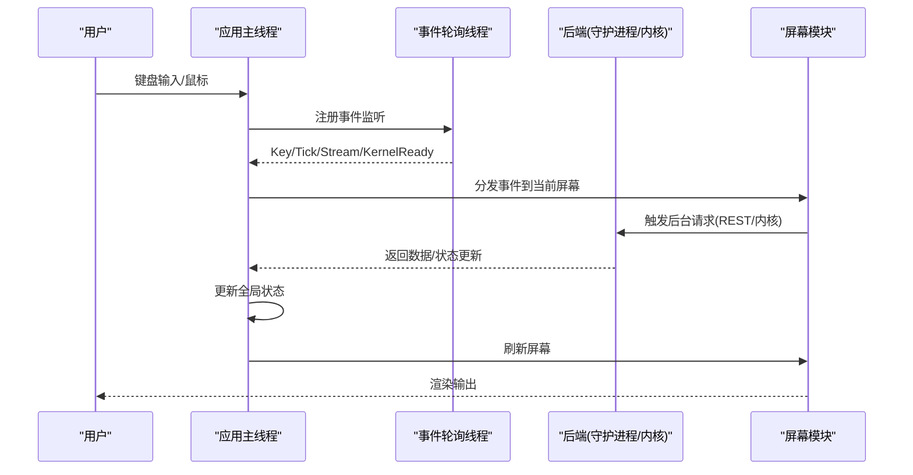
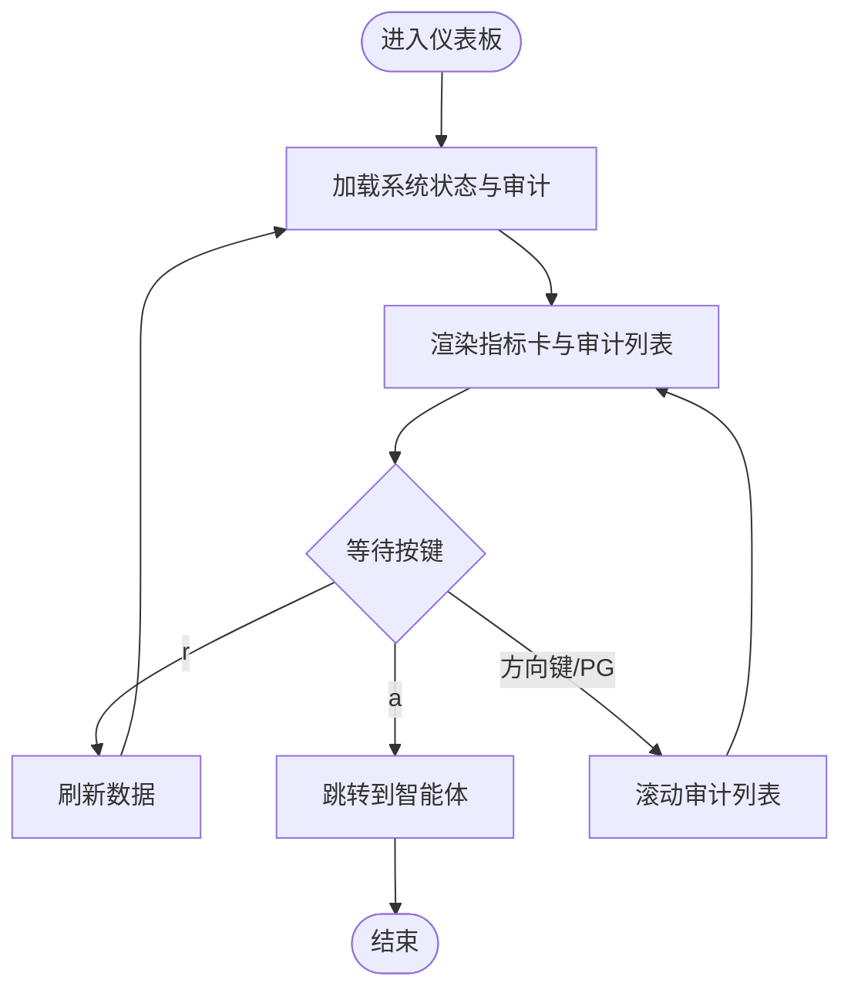
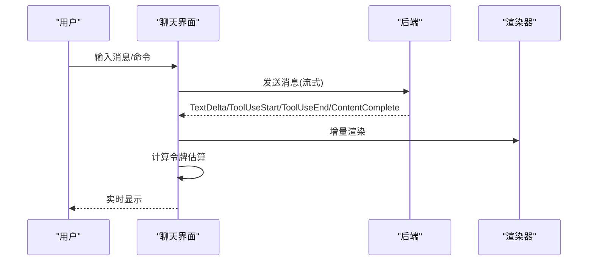
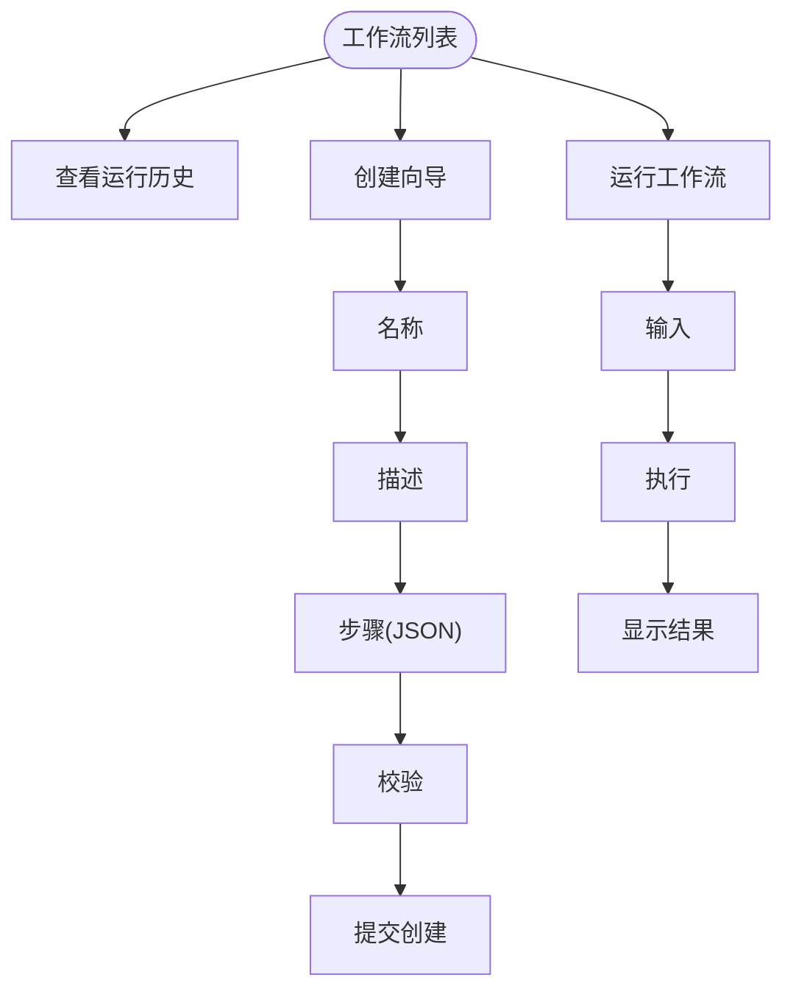
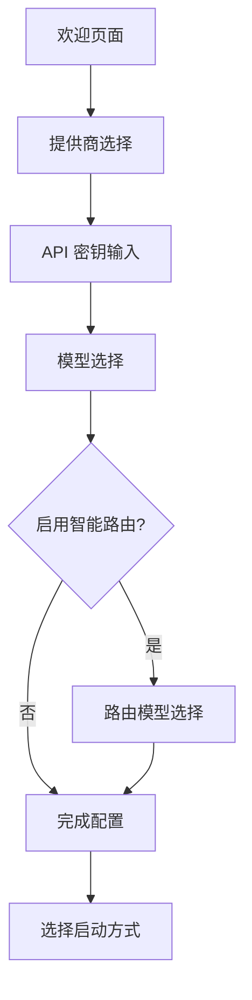
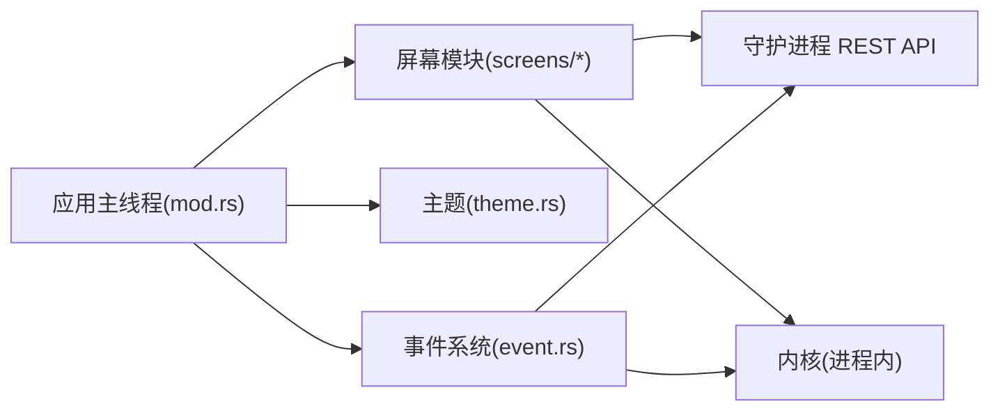

# TUI 仪表板

<cite>
**本文引用的文件**
- [mod.rs](file://crates/openfang-cli/src/tui/mod.rs)
- [event.rs](file://crates/openfang-cli/src/tui/event.rs)
- [theme.rs](file://crates/openfang-cli/src/tui/theme.rs)
- [main.rs](file://crates/openfang-cli/src/main.rs)
- [screens/mod.rs](file://crates/openfang-cli/src/tui/screens/mod.rs)
- [dashboard.rs](file://crates/openfang-cli/src/tui/screens/dashboard.rs)
- [chat.rs](file://crates/openfang-cli/src/tui/screens/chat.rs)
- [agents.rs](file://crates/openfang-cli/src/tui/screens/agents.rs)
- [settings.rs](file://crates/openfang-cli/src/tui/screens/settings.rs)
- [workflows.rs](file://crates/openfang-cli/src/tui/screens/workflows.rs)
- [logs.rs](file://crates/openfang-cli/src/tui/screens/logs.rs)
- [skills.rs](file://crates/openfang-cli/src/tui/screens/skills.rs)
- [init_wizard.rs](file://crates/openfang-cli/src/tui/screens/init_wizard.rs)
- [wizard.rs](file://crates/openfang-cli/src/tui/screens/wizard.rs)
- [launcher.rs](file://crates/openfang-cli/src/launcher.rs)
</cite>

## 更新摘要
**所做更改**
- 移除了 TUI 初始化向导中关于迁移步骤的完整内容
- 更新了初始化向导的步骤说明，从 7 步简化为 6 步
- 移除了迁移检测逻辑和相关 UI 元素
- 更新了相关的屏幕截图和交互说明

## 目录
1. [简介](#简介)
2. [项目结构](#项目结构)
3. [核心组件](#核心组件)
4. [架构总览](#架构总览)
5. [详细组件分析](#详细组件分析)
6. [依赖关系分析](#依赖关系分析)
7. [性能考虑](#性能考虑)
8. [故障排除指南](#故障排除指南)
9. [结论](#结论)
10. [附录](#附录)

## 简介
本文件为 OpenFang 终端用户界面（TUI）仪表板的完整使用与技术文档。内容覆盖 TUI 架构设计、屏幕布局、导航机制与交互模式；逐项说明仪表板概览、智能体管理、聊天界面、工作流编辑器、渠道配置、技能管理、设置面板、日志查看、系统监控等屏幕的功能与操作；记录键盘快捷键、鼠标操作、屏幕切换、实时数据刷新机制；并阐述 TUI 的配置选项、主题定制、颜色方案与字体设置；解释 TUI 与后台内核的通信方式、数据同步机制、错误处理与性能优化策略，并提供最佳实践、故障排除与扩展开发指导。

**更新** 移除了初始化向导中的迁移步骤相关内容，简化了向导流程。

## 项目结构
OpenFang TUI 位于 CLI 子模块中，采用"两阶段导航"设计：启动引导阶段（欢迎/向导）→ 主界面（19 个标签页）。主应用负责事件循环、渲染调度与状态管理，各屏幕模块独立维护自身状态与绘制逻辑，通过统一的事件系统与后端（守护进程或内核）进行数据交互。

```mermaid
graph TB
subgraph "CLI 启动"
MAIN["main.rs<br/>命令入口与子命令解析"]
LAUNCHER["launcher.rs<br/>桌面启动器与迁移提示"]
END
subgraph "TUI 核心"
MOD["mod.rs<br/>应用状态与事件分发"]
EVT["event.rs<br/>事件系统与后台线程"]
THEME["theme.rs<br/>主题与配色"]
END
subgraph "屏幕模块"
S_MOD["screens/mod.rs"]
DASH["dashboard.rs"]
CHAT["chat.rs"]
AGENTS["agents.rs"]
SETTINGS["settings.rs"]
WORKFLOWS["workflows.rs"]
LOGS["logs.rs"]
SKILLS["skills.rs"]
INIT_WIZARD["init_wizard.rs<br/>初始化向导(6步)"]
WIZARD["wizard.rs<br/>设置向导(3步)"]
END
MAIN --> MOD
MOD --> EVT
MOD --> THEME
MOD --> S_MOD
S_MOD --> DASH
S_MOD --> CHAT
S_MOD --> AGENTS
S_MOD --> SETTINGS
S_MOD --> WORKFLOWS
S_MOD --> LOGS
S_MOD --> SKILLS
S_MOD --> INIT_WIZARD
S_MOD --> WIZARD
LAUNCHER --> INIT_WIZARD
```

**图表来源**
- [main.rs:1-120](file://crates/openfang-cli/src/main.rs#L1-L120)
- [mod.rs:1-120](file://crates/openfang-cli/src/tui/mod.rs#L1-L120)
- [event.rs:1-120](file://crates/openfang-cli/src/tui/event.rs#L1-L120)
- [theme.rs:1-80](file://crates/openfang-cli/src/tui/theme.rs#L1-L80)
- [screens/mod.rs:1-23](file://crates/openfang-cli/src/tui/screens/mod.rs#L1-L23)
- [launcher.rs:498-513](file://crates/openfang-cli/src/launcher.rs#L498-L513)

**章节来源**
- [main.rs:1-200](file://crates/openfang-cli/src/main.rs#L1-L200)
- [mod.rs:1-120](file://crates/openfang-cli/src/tui/mod.rs#L1-L120)
- [screens/mod.rs:1-23](file://crates/openfang-cli/src/tui/screens/mod.rs#L1-L23)

## 核心组件
- 应用状态与生命周期
  - 阶段化导航：Boot（欢迎/向导）→ Main（19 个标签页）
  - 全局状态：当前阶段、活动标签、滚动偏移、配置路径、退出标志、事件通道、内核状态等
  - 双 Ctrl+C 退出策略（Main 阶段提示二次确认）
- 事件系统
  - 键盘事件、周期性 Tick、流式事件（LLM）、内核就绪/错误、后端检测结果等
  - 跨线程事件通道，统一在应用主线程处理
- 主题与样式
  - 深色配色体系，语义化颜色（成功/信息/警告/错误/装饰），标签页与状态徽章样式
- 后端抽象
  - 守护进程（HTTP REST）与内核（进程内）两种模式
  - 自动探测守护进程，失败则启动内核

**章节来源**
- [mod.rs:29-180](file://crates/openfang-cli/src/tui/mod.rs#L29-L180)
- [event.rs:30-204](file://crates/openfang-cli/src/tui/event.rs#L30-L204)
- [theme.rs:1-140](file://crates/openfang-cli/src/tui/theme.rs#L1-L140)

## 架构总览
TUI 采用"事件驱动 + 状态机"的架构。应用主线程负责渲染与事件分发；事件系统负责从 crossterm 与后台线程收集事件；屏幕模块各自维护局部状态；主题模块提供统一视觉风格；后端抽象屏蔽守护进程与内核差异。



**图表来源**
- [mod.rs:224-365](file://crates/openfang-cli/src/tui/mod.rs#L224-L365)
- [event.rs:205-238](file://crates/openfang-cli/src/tui/event.rs#L205-L238)
- [event.rs:525-581](file://crates/openfang-cli/src/tui/event.rs#L525-L581)

**章节来源**
- [mod.rs:224-365](file://crates/openfang-cli/src/tui/mod.rs#L224-L365)
- [event.rs:205-238](file://crates/openfang-cli/src/tui/event.rs#L205-L238)

## 详细组件分析

### 仪表板概览（Dashboard）
- 功能
  - 显示系统关键指标：活跃智能体数量、运行时长、版本、提供商/模型
  - 实时审计追踪列表，支持上下滚动与刷新
- 交互
  - 快捷键：r 刷新、a 跳转到智能体、方向键/PGUP/PGDN 滚动
  - 支持加载动画与空态提示
- 数据来源
  - 守护进程状态接口与审计最近条目
- 布局
  - 三段式布局：指标卡区域、分隔线、审计列表、提示行



**图表来源**
- [dashboard.rs:60-85](file://crates/openfang-cli/src/tui/screens/dashboard.rs#L60-L85)
- [event.rs:527-581](file://crates/openfang-cli/src/tui/event.rs#L527-L581)

**章节来源**
- [dashboard.rs:1-282](file://crates/openfang-cli/src/tui/screens/dashboard.rs#L1-L282)
- [event.rs:527-581](file://crates/openfang-cli/src/tui/event.rs#L527-L581)

### 智能体管理（Agents）
- 功能
  - 列表：显示守护进程与内核中的智能体，支持搜索过滤
  - 详情：展示智能体元信息、能力、技能、MCP 服务器等
  - 创建：模板选择或自定义构建（名称/描述/系统提示/工具/技能/MCP）
  - 编辑：为现有智能体更新技能与 MCP 服务器
  - 操作：聊天、终止、刷新
- 交互
  - 搜索：/ 进入搜索模式，Esc 退出
  - 列表导航：上下移动，Enter 打开详情或创建新智能体
  - 详情页：c 聊天、k 终止、s 编辑技能、m 编辑 MCP
  - 自定义流程：多步骤向导，Enter 下一步，Esc 返回
- 数据来源
  - 守护进程智能体列表、内核注册表、模板库、技能/MCP 服务枚举

```mermaid
sequenceDiagram
participant User as "用户"
participant List as "智能体列表"
participant Detail as "详情页"
participant Create as "创建向导"
participant Backend as "后端"
User->>List : 导航/搜索
List->>Detail : 查看详情
Detail->>User : 展示技能/MCP/能力
User->>Detail : s/m 编辑
Detail->>Backend : 获取技能/MCP 列表
Backend-->>Detail : 返回可用项
User->>Create : 新建智能体
Create->>Backend : 提交清单
Backend-->>List : 刷新列表
```

**图表来源**
- [agents.rs:353-538](file://crates/openfang-cli/src/tui/screens/agents.rs#L353-L538)
- [agents.rs:574-732](file://crates/openfang-cli/src/tui/screens/agents.rs#L574-L732)
- [event.rs:527-581](file://crates/openfang-cli/src/tui/event.rs#L527-L581)

**章节来源**
- [agents.rs:1-800](file://crates/openfang-cli/src/tui/screens/agents.rs#L1-L800)
- [event.rs:527-581](file://crates/openfang-cli/src/tui/event.rs#L527-L581)

### 聊天界面（Chat）
- 功能
  - 流式消息渲染：文本增量、工具调用块、思考中指示器、令牌计数估算
  - 输入缓冲与延迟发送：流式期间可暂存多条消息，流结束后自动发送
  - 模型切换：Ctrl+M 打开模型选择器，支持过滤与高亮
  - 工具执行可视化：工具开始/结束、输入/结果/错误状态
- 交互
  - 发送：Enter（非流式）或 Esc（流式停止）
  - 模型切换：Ctrl+M → 上下移动 → Enter 选择
  - 滚动：上下键/PGUP/PGDN，支持大步滚动
  - 停止：Esc 在流式中停止
- 数据来源
  - 守护进程 SSE 或内核 mpsc 流式事件
  - 模型目录与工具清单



**图表来源**
- [chat.rs:252-386](file://crates/openfang-cli/src/tui/screens/chat.rs#L252-L386)
- [event.rs:328-444](file://crates/openfang-cli/src/tui/event.rs#L328-L444)

**章节来源**
- [chat.rs:1-800](file://crates/openfang-cli/src/tui/screens/chat.rs#L1-L800)
- [event.rs:328-444](file://crates/openfang-cli/src/tui/event.rs#L328-L444)

### 工作流编辑器（Workflows）
- 功能
  - 列表：ID/名称/步骤数/创建时间
  - 运行历史：状态徽章、耗时、输出预览
  - 创建向导：名称/描述/步骤 JSON/校验
  - 运行：输入文本或 JSON，查看结果
- 交互
  - 列表：上下移动、Enter 查看运行历史，x 运行工作流
  - 运行历史：上下移动查看
  - 创建：四步向导，Enter 下一步，Esc 返回
  - 运行：输入后运行，完成显示结果
- 数据来源
  - 守护进程工作流 API



**图表来源**
- [workflows.rs:101-277](file://crates/openfang-cli/src/tui/screens/workflows.rs#L101-L277)
- [event.rs:718-798](file://crates/openfang-cli/src/tui/event.rs#L718-L798)

**章节来源**
- [workflows.rs:1-706](file://crates/openfang-cli/src/tui/screens/workflows.rs#L1-L706)
- [event.rs:718-798](file://crates/openfang-cli/src/tui/event.rs#L718-L798)

### 渠道配置（Channels）
- 功能
  - 列出已配置渠道，显示状态（就绪/缺失环境变量/未配置）
  - 测试渠道连通性
- 交互
  - 列表导航、测试按钮、刷新
- 数据来源
  - 守护进程渠道 API

**章节来源**
- [event.rs:583-682](file://crates/openfang-cli/src/tui/event.rs#L583-L682)

### 技能管理（Skills）
- 功能
  - 已安装：名称、运行时、来源、描述
  - ClawHub 市场：按趋势/热门/最新排序浏览，支持搜索与安装
  - MCP 服务器：连接状态与工具数量
- 交互
  - 子标签页切换：1/2/3
  - 已安装：u 卸载确认、r 刷新
  - ClawHub：/ 搜索、s 切换排序、i 安装、r 刷新
  - MCP：r 刷新
- 数据来源
  - 技能与 MCP 服务枚举

**章节来源**
- [skills.rs:1-631](file://crates/openfang-cli/src/tui/screens/skills.rs#L1-L631)
- [event.rs:414-485](file://crates/openfang-cli/src/tui/event.rs#L414-L485)

### 设置面板（Settings）
- 功能
  - 提供商密钥管理：列出、设置、删除、测试
  - 模型目录：ID/提供商/等级/上下文窗口/成本
  - 工具清单：名称与描述
- 交互
  - 子标签页：1 提供商、2 模型、3 工具
  - 提供商：e 设置密钥（输入模式）、d 删除、t 测试、r 刷新
  - 模型/工具：上下移动、r 刷新
- 数据来源
  - 提供商/模型/工具 API

**章节来源**
- [settings.rs:1-623](file://crates/openfang-cli/src/tui/screens/settings.rs#L1-L623)
- [event.rs:473-523](file://crates/openfang-cli/src/tui/event.rs#L473-L523)

### 日志查看（Logs）
- 功能
  - 实时日志查看：级别过滤（全部/错误/警告/信息）、关键词搜索
  - 自动刷新控制与滚动定位
- 交互
  - f 切换级别过滤、/ 进入搜索、a 切换自动刷新、r 刷新
  - 导航：上下移动、Home/End 快速定位
- 数据来源
  - 日志列表与筛选

**章节来源**
- [logs.rs:1-414](file://crates/openfang-cli/src/tui/screens/logs.rs#L1-L414)
- [event.rs:531-567](file://crates/openfang-cli/src/tui/event.rs#L531-L567)

### 系统监控（Usage）
- 功能
  - 总览摘要、按模型/按智能体使用统计
- 交互
  - 列表导航、刷新
- 数据来源
  - 使用统计 API

**章节来源**
- [event.rs:457-472](file://crates/openfang-cli/src/tui/event.rs#L457-L472)

### 初始化向导（Init Wizard）
**更新** 移除了迁移步骤，简化为 6 步向导流程：

- 步骤 1：欢迎页面
  - 显示 OpenFang 标识和安全声明
  - 用户确认理解风险后进入下一步
- 步骤 2：提供商选择
  - 列出支持的 LLM 提供商（如 OpenAI、Anthropic、Groq 等）
  - 自动检测已配置的环境变量
  - 支持本地模型（如 Ollama、LM Studio）
- 步骤 3：API 密钥输入
  - 输入提供商 API 密钥或使用环境变量
  - 支持密钥验证（可选）
- 步骤 4：默认模型选择
  - 从提供商的模型目录中选择默认模型
  - 显示模型分类（Fast/Balanced/Frontier）
- 步骤 5：智能路由配置
  - 询问是否启用智能模型路由
  - 如启用，为三个模型层级（Fast/Balanced/Frontier）选择具体模型
- 步骤 6：完成与启动
  - 显示配置摘要
  - 选择启动方式：Web 仪表板或终端聊天



**图表来源**
- [init_wizard.rs:246-254](file://crates/openfang-cli/src/tui/screens/init_wizard.rs#L246-L254)
- [init_wizard.rs:1038-1045](file://crates/openfang-cli/src/tui/screens/init_wizard.rs#L1038-L1045)

**章节来源**
- [init_wizard.rs:1-1773](file://crates/openfang-cli/src/tui/screens/init_wizard.rs#L1-L1773)

### 设置向导（Wizard）
**更新** 保持原有的 3 步向导流程，用于首次运行时的基础配置：

- 步骤 1：提供商选择
- 步骤 2：API 密钥输入
- 步骤 3：模型名称输入与配置保存

此向导与初始化向导不同，专门用于首次运行时的基础设置。

**章节来源**
- [wizard.rs:156-176](file://crates/openfang-cli/src/tui/screens/wizard.rs#L156-L176)
- [wizard.rs:440-443](file://crates/openfang-cli/src/tui/screens/wizard.rs#L440-L443)

### 桌面启动器（Launcher）
**更新** 移除了迁移提示相关的功能，保留基本的桌面应用启动功能：

- 首次运行检测：检测是否为首次运行
- OpenClaw 迁移提示：如果检测到 OpenClaw，显示迁移提示
- 菜单选择：提供不同的启动选项

**章节来源**
- [launcher.rs:147-171](file://crates/openfang-cli/src/launcher.rs#L147-L171)
- [launcher.rs:498-513](file://crates/openfang-cli/src/launcher.rs#L498-L513)

## 依赖关系分析
- 组件耦合
  - 应用主线程与屏幕模块松耦合：通过事件与状态更新解耦
  - 事件系统集中处理：统一接收 crossterm 与后台线程事件
  - 主题模块被所有屏幕共享，保证视觉一致性
- 外部依赖
  - 守护进程 REST API：用于获取系统状态、审计、渠道、工作流、日志、技能、设置等
  - 内核：进程内模式下的流式对话与内核事件
  - 第三方库：ratatui（UI）、crossterm（事件）、reqwest（HTTP）、tokio（异步）



**图表来源**
- [mod.rs:10-25](file://crates/openfang-cli/src/tui/mod.rs#L10-L25)
- [event.rs:30-37](file://crates/openfang-cli/src/tui/event.rs#L30-L37)

**章节来源**
- [mod.rs:10-25](file://crates/openfang-cli/src/tui/mod.rs#L10-L25)
- [event.rs:30-37](file://crates/openfang-cli/src/tui/event.rs#L30-L37)

## 性能考虑
- 事件轮询与 Tick
  - 低开销轮询：无事件时发送 Tick，用于动画与定时刷新
- 流式渲染
  - 文本增量渲染，避免全屏重绘
  - 工具调用块与思考指示器按需渲染
- 列表与筛选
  - 日志与技能等列表支持搜索与过滤，减少可视数据量
- 后台线程
  - 守护进程探测、内核启动、流式对话均在后台线程执行，避免阻塞 UI
- 资源限制
  - 审计与日志列表按可见高度裁剪，避免超大数据集导致渲染卡顿

## 故障排除指南
- 无法连接守护进程
  - 现象：无法加载系统状态、审计、渠道等
  - 排查：确认守护进程已启动；检查网络与端口；使用健康检查命令
  - 参考：守护进程探测与错误事件
- 流式对话无响应
  - 现象：发送消息后无输出
  - 排查：检查网络连通性；确认后端支持 SSE；查看流式事件通道
- 模型不可用或切换失败
  - 现象：模型列表为空或切换无效
  - 排查：刷新模型列表；检查本地/远程模型可达性
- 日志不刷新
  - 现象：新日志未显示
  - 排查：关闭自动刷新或手动刷新；检查过滤条件与搜索关键词
- 初始化向导问题
  - 现象：向导卡在某个步骤
  - 排查：检查网络连接；确认提供商 API 密钥有效；重新启动向导

**章节来源**
- [event.rs:242-284](file://crates/openfang-cli/src/tui/event.rs#L242-L284)
- [event.rs:328-444](file://crates/openfang-cli/src/tui/event.rs#L328-L444)
- [logs.rs:149-152](file://crates/openfang-cli/src/tui/screens/logs.rs#L149-L152)

## 结论
OpenFang TUI 仪表板以清晰的两阶段导航、模块化的屏幕设计与统一的事件系统，提供了高效、直观的终端管理体验。通过深色主题与语义化配色提升可读性；通过流式渲染与后台线程保障交互流畅；通过丰富的快捷键与筛选能力提升生产力。最新的更新移除了初始化向导中的迁移步骤，简化了用户体验，同时保持了完整的功能完整性。建议在生产环境中结合日志与使用统计持续监控，并遵循最佳实践进行配置与扩展。

## 附录

### 键盘快捷键与交互速查
- 全局
  - Ctrl+C × 2：退出（Boot 阶段仅提示，Main 阶段直接退出）
  - Ctrl+Q：退出（Main 阶段）
  - F1-F12：快速跳转标签页
  - Tab/Shift+Tab、Ctrl+左右、Ctrl+[ ]：标签页循环切换
- 仪表板
  - r：刷新；a：跳转到智能体；方向键/PGUP/PGDN：滚动审计
- 聊天
  - Enter：发送（非流式）；Esc：停止（流式）
  - Ctrl+M：打开模型选择器；上下移动选择；Enter 确认
  - 方向键/PGUP/PGDN：滚动消息
- 智能体
  - /：进入搜索；Esc：退出搜索
  - c：聊天；k：终止；s：编辑技能；m：编辑 MCP
- 工作流
  - x：运行；r：刷新；回车：下一步（创建向导）
- 日志
  - f：切换级别过滤；/：进入搜索；a：切换自动刷新；r：刷新
- 技能
  - 1/2/3：切换子标签；/：搜索（ClawHub）；s：切换排序；i：安装；u：卸载确认；r：刷新
- 初始化向导
  - Enter：确认；Esc：返回；方向键/PGUP/PGDN：导航；1/2：快速选择启动方式

**章节来源**
- [mod.rs:612-778](file://crates/openfang-cli/src/tui/mod.rs#L612-L778)
- [dashboard.rs:60-85](file://crates/openfang-cli/src/tui/screens/dashboard.rs#L60-L85)
- [chat.rs:252-386](file://crates/openfang-cli/src/tui/screens/chat.rs#L252-L386)
- [agents.rs:353-538](file://crates/openfang-cli/src/tui/screens/agents.rs#L353-L538)
- [workflows.rs:101-277](file://crates/openfang-cli/src/tui/screens/workflows.rs#L101-L277)
- [logs.rs:183-253](file://crates/openfang-cli/src/tui/screens/logs.rs#L183-L253)
- [skills.rs:121-279](file://crates/openfang-cli/src/tui/screens/skills.rs#L121-L279)
- [init_wizard.rs:1764-1771](file://crates/openfang-cli/src/tui/screens/init_wizard.rs#L1764-L1771)

### 主题与颜色方案
- 配色体系
  - 主色调：OpenFang 橙色（强调）
  - 背景：深色系（主背景/卡片/悬停/代码块）
  - 文本：高对比度主文本/次级/三级文本
  - 边框：深色边框
  - 语义色：绿色（成功）、蓝色（信息）、黄色（警告/缺失）、红色（错误/崩溃）、紫色（装饰）
- 状态徽章
  - 运行中/新建/暂停/结束/错误/崩溃 等状态徽章样式
- 字体与渲染
  - 使用 ratatui 默认字体；建议终端启用 UTF-8 以正确显示符号与动画帧

**章节来源**
- [theme.rs:9-140](file://crates/openfang-cli/src/tui/theme.rs#L9-L140)

### 与后台内核通信与数据同步
- 通信方式
  - 守护进程：HTTP REST（reqwest）
  - 内核：进程内（tokio 异步运行时）
- 数据同步
  - 事件驱动：后台线程通过 mpsc 将数据与状态推送到 UI
  - 屏幕刷新：统一在 UI 主线程渲染，避免竞态
- 错误处理
  - 后台错误事件统一映射到当前屏幕状态，显示友好提示

**章节来源**
- [event.rs:242-284](file://crates/openfang-cli/src/tui/event.rs#L242-L284)
- [event.rs:286-326](file://crates/openfang-cli/src/tui/event.rs#L286-L326)
- [event.rs:525-581](file://crates/openfang-cli/src/tui/event.rs#L525-L581)

### 最佳实践与扩展开发
- 最佳实践
  - 使用快捷键提高效率；合理利用搜索与过滤
  - 关注日志与使用统计，及时发现异常
  - 在内核模式下谨慎使用流式对话，避免长时间占用
  - 定期检查 API 密钥有效性
- 扩展开发
  - 新增屏幕：在 screens/mod.rs 中添加模块并在主应用中注册
  - 新增事件：在 event.rs 中定义 AppEvent 分支与后台抓取函数
  - 主题定制：在 theme.rs 中新增颜色与样式，保持一致的视觉语言
- 初始化向导扩展
  - 新增提供商：在 PROVIDERS 数组中添加新的提供商信息
  - 自定义步骤：修改 Step 枚举和相应的处理逻辑

**章节来源**
- [screens/mod.rs:1-23](file://crates/openfang-cli/src/tui/screens/mod.rs#L1-L23)
- [event.rs:41-203](file://crates/openfang-cli/src/tui/event.rs#L41-L203)
- [theme.rs:39-140](file://crates/openfang-cli/src/tui/theme.rs#L39-L140)
- [init_wizard.rs:30-223](file://crates/openfang-cli/src/tui/screens/init_wizard.rs#L30-L223)