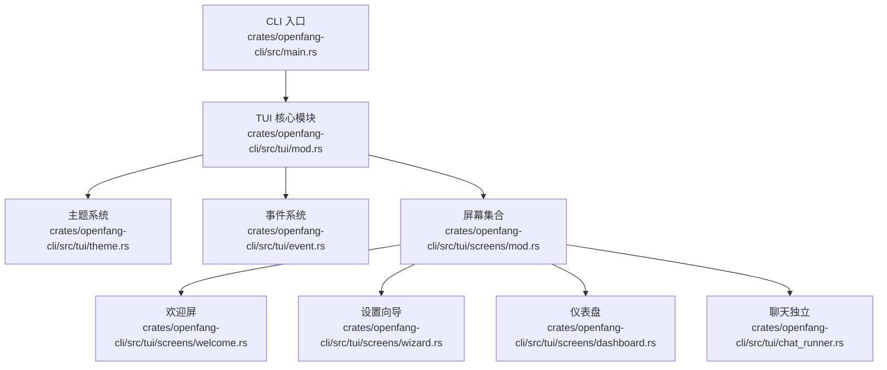
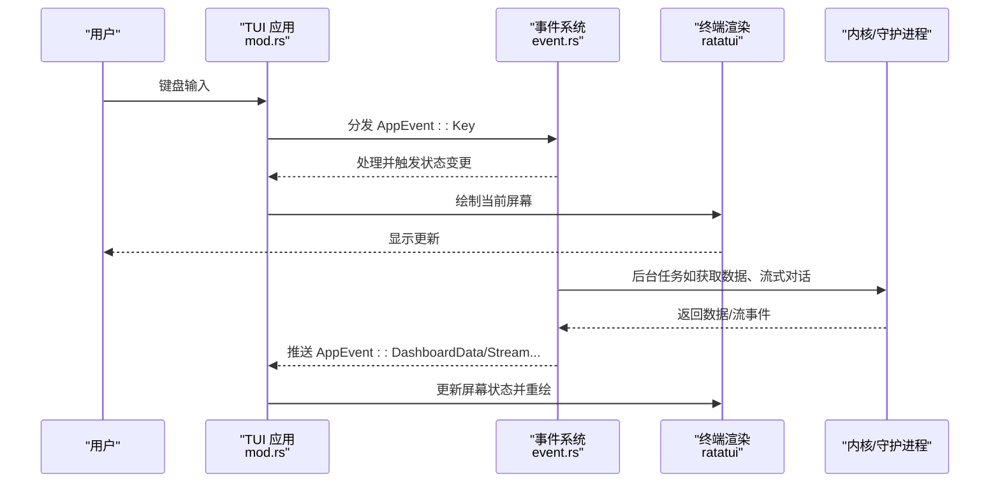
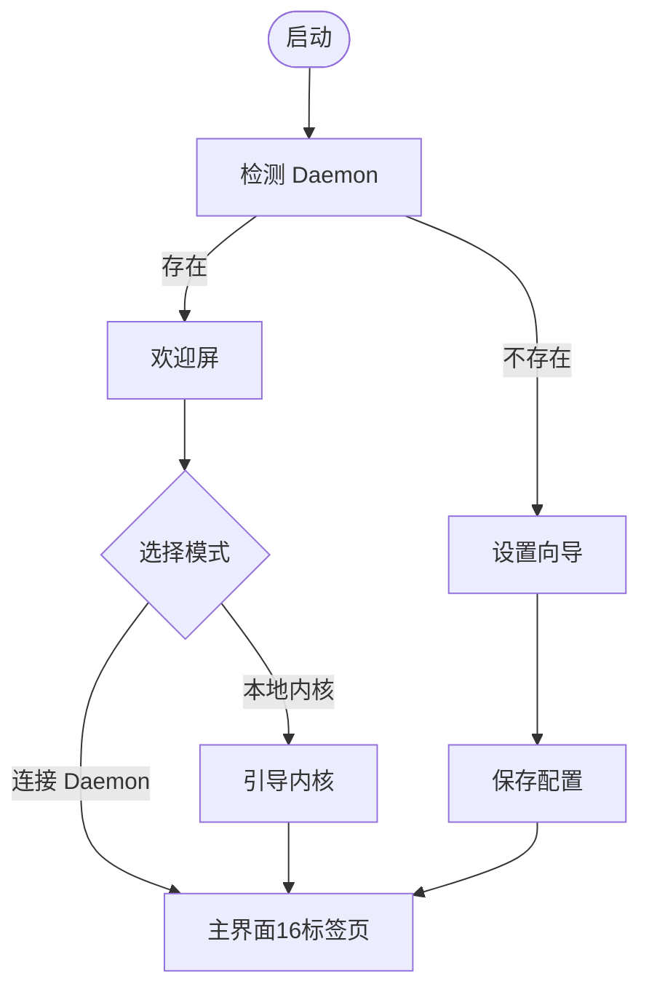
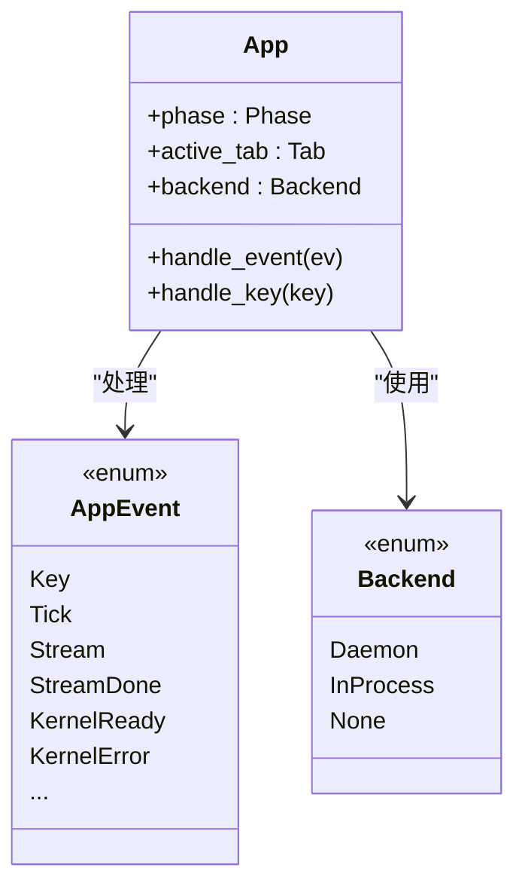
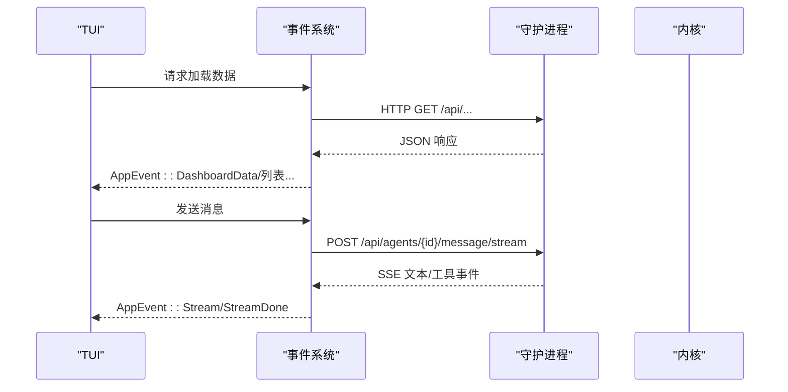
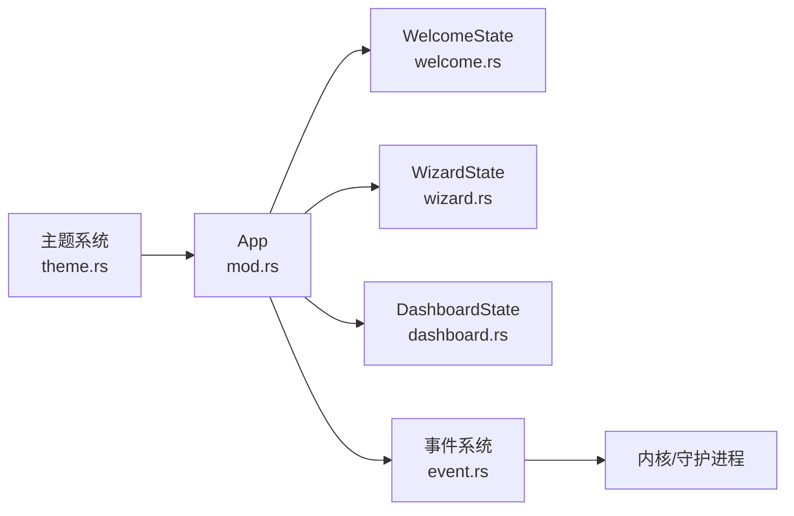

# TUI 概述

<cite>
**本文档引用的文件**
- [mod.rs](file://crates/openfang-cli/src/tui/mod.rs)
- [main.rs](file://crates/openfang-cli/src/main.rs)
- [theme.rs](file://crates/openfang-cli/src/tui/theme.rs)
- [event.rs](file://crates/openfang-cli/src/tui/event.rs)
- [welcome.rs](file://crates/openfang-cli/src/tui/screens/welcome.rs)
- [wizard.rs](file://crates/openfang-cli/src/tui/screens/wizard.rs)
- [dashboard.rs](file://crates/openfang-cli/src/tui/screens/dashboard.rs)
- [chat_runner.rs](file://crates/openfang-cli/src/tui/chat_runner.rs)
- [mod.rs](file://crates/openfang-cli/src/tui/screens/mod.rs)
</cite>

## 目录
1. [简介](#简介)
2. [项目结构](#项目结构)
3. [核心组件](#核心组件)
4. [架构总览](#架构总览)
5. [详细组件分析](#详细组件分析)
6. [依赖关系分析](#依赖关系分析)
7. [性能考虑](#性能考虑)
8. [故障排除指南](#故障排除指南)
9. [结论](#结论)
10. [附录](#附录)

## 简介
本文件为 OpenFang TUI 仪表板的总体概述文档，面向使用者与开发者，系统阐述 TUI 的整体架构设计、核心概念与设计理念。重点包括：
- 两阶段导航体系：引导阶段（欢迎/向导）与主界面阶段（16个标签页）
- 生命周期管理、状态管理与事件处理机制
- 主题系统、颜色方案与字体配置
- 与后台内核的通信方式、数据同步机制与性能优化策略
- 安装要求、兼容性与系统要求

## 项目结构
OpenFang 的 TUI 位于命令行子项目中，采用模块化组织，核心入口在 CLI 主程序，TUI 子模块负责渲染与交互。

图表来源
- [main.rs:1-120](file://crates/openfang-cli/src/main.rs#L1-L120)
- [mod.rs:1-120](file://crates/openfang-cli/src/tui/mod.rs#L1-L120)
- [theme.rs:1-80](file://crates/openfang-cli/src/tui/theme.rs#L1-L80)
- [event.rs:1-120](file://crates/openfang-cli/src/tui/event.rs#L1-L120)
- [mod.rs:1-23](file://crates/openfang-cli/src/tui/screens/mod.rs#L1-L23)

章节来源
- [main.rs:1-120](file://crates/openfang-cli/src/main.rs#L1-L120)
- [mod.rs:1-120](file://crates/openfang-cli/src/tui/mod.rs#L1-L120)
- [mod.rs:1-23](file://crates/openfang-cli/src/tui/screens/mod.rs#L1-L23)

## 核心组件
- 应用状态与生命周期
  - 双阶段导航：引导阶段（Welcome/Wizard）→ 主界面阶段（16个标签页）
  - 生命周期：启动检测、内核引导、会话建立、事件循环、退出清理
- 事件系统
  - 键盘输入、定时器、流式响应、内核状态、后台任务结果
- 屏幕与状态
  - 每个标签页对应独立状态机，支持搜索、过滤、滚动、分页与状态提示
- 主题与视觉
  - 深色配色、语义化颜色、徽章样式、旋转器动画帧

章节来源
- [mod.rs:29-120](file://crates/openfang-cli/src/tui/mod.rs#L29-L120)
- [event.rs:30-203](file://crates/openfang-cli/src/tui/event.rs#L30-L203)
- [theme.rs:1-140](file://crates/openfang-cli/src/tui/theme.rs#L1-L140)

## 架构总览
TUI 采用“事件驱动 + 状态机”的架构模式，通过统一事件通道协调键盘、定时器与后台任务，驱动各屏幕状态更新并重绘。

图表来源
- [mod.rs:224-610](file://crates/openfang-cli/src/tui/mod.rs#L224-L610)
- [event.rs:205-238](file://crates/openfang-cli/src/tui/event.rs#L205-L238)
- [chat_runner.rs:58-100](file://crates/openfang-cli/src/tui/chat_runner.rs#L58-L100)

## 详细组件分析

### 两阶段导航系统
- 引导阶段（Welcome/Wizard）
  - 欢迎屏：ASCII Logo、Daemon 检测、提供者检测、菜单选择
  - 设置向导：提供者选择 → API Key 输入 → 模型名 → 配置保存
- 主界面阶段（16个标签页）
  - 仪表盘、代理、聊天、会话、工作流、触发器、内存、通道、技能、手（Hands）、扩展、模板、对等节点、通信、安全、审计、用量、设置、日志

图表来源
- [welcome.rs:117-212](file://crates/openfang-cli/src/tui/screens/welcome.rs#L117-L212)
- [wizard.rs:156-438](file://crates/openfang-cli/src/tui/screens/wizard.rs#L156-L438)
- [mod.rs:30-62](file://crates/openfang-cli/src/tui/mod.rs#L30-L62)

章节来源
- [welcome.rs:1-212](file://crates/openfang-cli/src/tui/screens/welcome.rs#L1-L212)
- [wizard.rs:1-176](file://crates/openfang-cli/src/tui/screens/wizard.rs#L1-L176)
- [mod.rs:64-120](file://crates/openfang-cli/src/tui/mod.rs#L64-L120)

### 生命周期管理与事件处理
- 生命周期
  - 启动：检测 Daemon 或引导内核；初始化事件线程与渲染
  - 运行：接收键盘与定时事件，派发到当前屏幕状态机
  - 退出：恢复终端、清理资源
- 事件类型
  - 键盘事件、周期性 Tick、流式事件（LLM/工具调用）、内核就绪/错误、后台任务结果
- 事件通道
  - 使用无阻塞通道在后台线程与主线程间传递事件

图表来源
- [mod.rs:138-180](file://crates/openfang-cli/src/tui/mod.rs#L138-L180)
- [event.rs:42-203](file://crates/openfang-cli/src/tui/event.rs#L42-L203)

章节来源
- [mod.rs:184-235](file://crates/openfang-cli/src/tui/mod.rs#L184-L235)
- [event.rs:205-284](file://crates/openfang-cli/src/tui/event.rs#L205-L284)

### 主题系统与视觉设计
- 调色板
  - 深色背景、卡片、悬停、代码块等基础色
  - 语义化颜色：成功、信息、警告、错误、装饰色
- 语义样式
  - 标题、选中项、提示、输入、标签页激活/非激活
  - 状态徽章：运行、新建/空闲、暂停/挂起、终止、崩溃
- 动画与指示
  - 旋转器帧序列用于加载与引导过程
- 字体与排版
  - 使用终端文本样式与修饰符实现粗体、下划线、闪烁等效果

章节来源
- [theme.rs:1-140](file://crates/openfang-cli/src/tui/theme.rs#L1-L140)

### 与后台内核的通信与数据同步
- 通信模式
  - 守护进程模式：HTTP REST 与 SSE 流式传输
  - 内核模式：Tokio 运行时内的本地调用
- 数据同步
  - 后台线程拉取状态（仪表盘、通道、工作流、触发器、技能、扩展、通信、日志等）
  - 流式事件实时更新聊天与工具执行状态
- 性能优化
  - SSE 流聚合令牌统计，避免过早结束
  - 后台线程池化，避免阻塞 UI
  - 事件队列限速与批处理

图表来源
- [event.rs:527-581](file://crates/openfang-cli/src/tui/event.rs#L527-L581)
- [event.rs:328-444](file://crates/openfang-cli/src/tui/event.rs#L328-L444)

章节来源
- [event.rs:328-444](file://crates/openfang-cli/src/tui/event.rs#L328-L444)
- [event.rs:527-581](file://crates/openfang-cli/src/tui/event.rs#L527-L581)

### 屏幕与状态管理（示例：仪表盘）
- 状态字段：代理数、运行时长、版本、提供商/模型、最近审计、滚动偏移、加载标志
- 交互：刷新、跳转到代理、上下/翻页滚动
- 渲染：统计卡片、审计列表、滚动条、提示行

章节来源
- [dashboard.rs:23-86](file://crates/openfang-cli/src/tui/screens/dashboard.rs#L23-L86)
- [dashboard.rs:90-130](file://crates/openfang-cli/src/tui/screens/dashboard.rs#L90-L130)

### 独立聊天（openfang chat）
- 独立于完整 TUI 的聊天体验，复用 ChatState 与主题系统
- 支持守护进程与内核两种后端，自动解析或创建代理
- 支持斜杠命令（帮助、状态、模型切换、清屏、杀进程、退出）

章节来源
- [chat_runner.rs:1-120](file://crates/openfang-cli/src/tui/chat_runner.rs#L1-L120)
- [chat_runner.rs:229-259](file://crates/openfang-cli/src/tui/chat_runner.rs#L229-L259)
- [chat_runner.rs:263-375](file://crates/openfang-cli/src/tui/chat_runner.rs#L263-L375)

## 依赖关系分析
- 组件耦合
  - App 对所有屏幕状态持有组合关系，通过枚举与方法分派解耦
  - 事件系统作为中央枢纽，降低屏幕间的直接依赖
- 外部依赖
  - 终端渲染库（ratatui）
  - HTTP 客户端（reqwest）
  - Tokio 运行时（异步与流式）
- 可能的循环依赖
  - 事件系统与屏幕模块通过 AppEvent 解耦，未见循环导入

图表来源
- [mod.rs:138-180](file://crates/openfang-cli/src/tui/mod.rs#L138-L180)
- [welcome.rs:60-107](file://crates/openfang-cli/src/tui/screens/welcome.rs#L60-L107)
- [wizard.rs:178-188](file://crates/openfang-cli/src/tui/screens/wizard.rs#L178-L188)
- [dashboard.rs:23-33](file://crates/openfang-cli/src/tui/screens/dashboard.rs#L23-L33)
- [event.rs:30-37](file://crates/openfang-cli/src/tui/event.rs#L30-L37)
- [theme.rs:1-40](file://crates/openfang-cli/src/tui/theme.rs#L1-L40)

章节来源
- [mod.rs:138-180](file://crates/openfang-cli/src/tui/mod.rs#L138-L180)
- [event.rs:30-37](file://crates/openfang-cli/src/tui/event.rs#L30-L37)

## 性能考虑
- 事件驱动与后台线程
  - 将网络请求与流式处理放入后台线程，避免阻塞 UI
- SSE 流聚合
  - 聚合多轮工具调用的令牌统计，仅在连接关闭时确认完成
- 限频与批处理
  - Tick 速率控制动画刷新频率
  - 批量处理事件队列，减少频繁绘制
- 内存与状态
  - 列表滚动与可见窗口裁剪，避免全量渲染

## 故障排除指南
- 无法连接守护进程
  - 现象：欢迎屏显示“无守护进程”
  - 处理：检查守护进程是否启动、监听地址与端口、网络连通性
- 流式对话中断
  - 现象：SSE 连接提前断开
  - 处理：确认服务端支持 SSE 并允许跨域；必要时回退到非流式接口
- 代理创建失败
  - 现象：创建新代理报错
  - 处理：检查模板内容、权限与环境变量；查看状态消息
- 主题显示异常
  - 现象：颜色不正确或终端不支持
  - 处理：更换终端、启用真彩模式、调整主题配置

章节来源
- [welcome.rs:109-115](file://crates/openfang-cli/src/tui/screens/welcome.rs#L109-L115)
- [event.rs:328-444](file://crates/openfang-cli/src/tui/event.rs#L328-L444)
- [chat_runner.rs:206-212](file://crates/openfang-cli/src/tui/chat_runner.rs#L206-L212)

## 结论
OpenFang TUI 以清晰的两阶段导航与事件驱动架构为核心，结合统一的主题系统与稳健的后台通信机制，提供了从首次配置到日常运维的完整终端体验。其模块化设计便于扩展与维护，同时通过后台线程与流式处理保障了良好的交互性能与用户体验。

## 附录

### 安装要求与系统要求
- 系统要求
  - 支持 Linux/macOS/Windows（Windows 需要兼容的终端）
  - 需要可写入用户目录（默认 ~/.openfang）
- 运行时依赖
  - Rust 工具链（Cargo）
  - 可选：守护进程（openfang start）或本地内核单次运行
- 兼容性
  - 终端需支持 ANSI/UTF-8 与基本光标控制
  - SSE 与 HTTP 访问需开放相应端口与权限

章节来源
- [main.rs:62-85](file://crates/openfang-cli/src/main.rs#L62-L85)