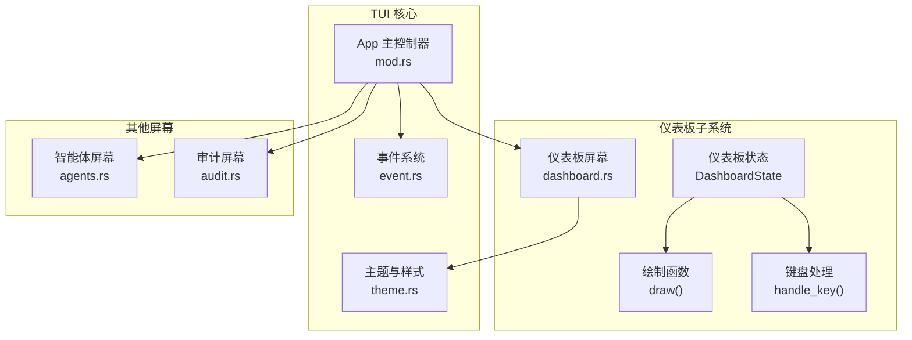
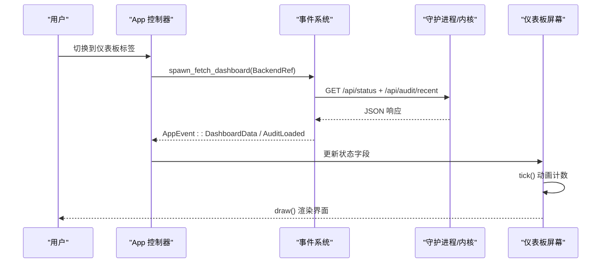
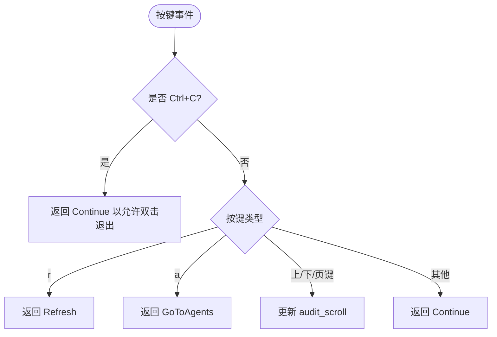
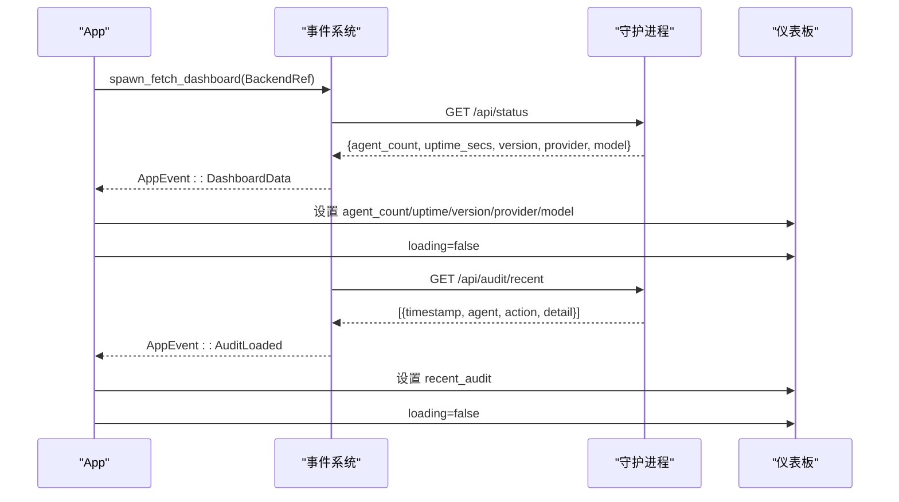
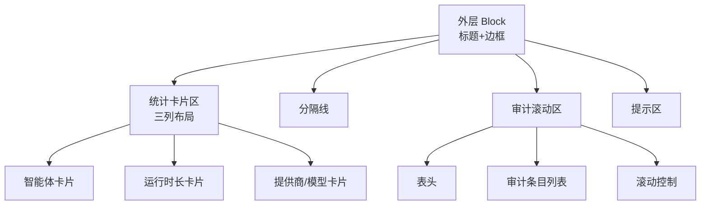
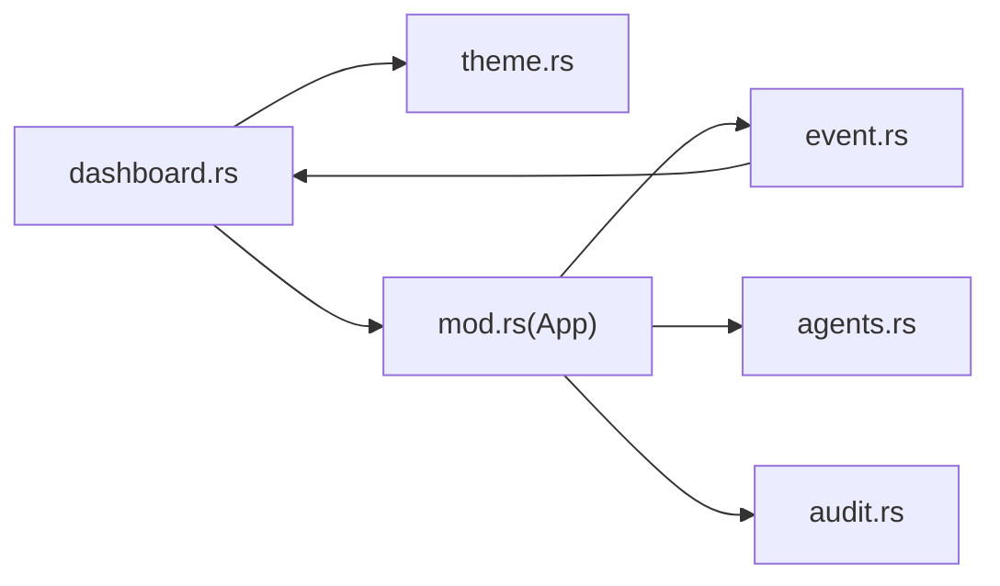

# 仪表板屏幕

<cite>
**本文档引用的文件**
- [dashboard.rs](file://crates/openfang-cli/src/tui/screens/dashboard.rs)
- [mod.rs](file://crates/openfang-cli/src/tui/mod.rs)
- [event.rs](file://crates/openfang-cli/src/tui/event.rs)
- [theme.rs](file://crates/openfang-cli/src/tui/theme.rs)
- [screens/mod.rs](file://crates/openfang-cli/src/tui/screens/mod.rs)
- [agents.rs](file://crates/openfang-cli/src/tui/screens/agents.rs)
- [audit.rs](file://crates/openfang-cli/src/tui/screens/audit.rs)
- [main.rs](file://crates/openfang-cli/src/main.rs)
</cite>

## 目录
1. [简介](#简介)
2. [项目结构](#项目结构)
3. [核心组件](#核心组件)
4. [架构总览](#架构总览)
5. [详细组件分析](#详细组件分析)
6. [依赖关系分析](#依赖关系分析)
7. [性能考虑](#性能考虑)
8. [故障排除指南](#故障排除指南)
9. [结论](#结论)

## 简介
本文件面向 OpenFang TUI 仪表板屏幕，系统性阐述其功能定位、数据来源与实时更新机制、界面布局与交互设计、以及在整体 TUI 应用中的集成方式。仪表板作为 TUI 的首个入口页面，提供系统状态概览（智能体数量、运行时长、版本与模型信息）、最近审计活动的滚动列表，并通过键盘快捷键实现快速导航与刷新。文档同时给出使用技巧、信息解读方法与常见问题排查建议，帮助用户高效掌握仪表板的使用与运维要点。

## 项目结构
仪表板屏幕位于 TUI 子模块的 screens 目录下，采用模块化组织：每个屏幕独立定义状态、事件处理与绘制逻辑；顶层 App 负责调度与事件分发；事件模块负责与后端（守护进程或内核）通信；主题模块统一管理配色与样式。

图示来源
- [mod.rs:138-180](file://crates/openfang-cli/src/tui/mod.rs#L138-L180)
- [dashboard.rs:23-86](file://crates/openfang-cli/src/tui/screens/dashboard.rs#L23-L86)
- [theme.rs:1-140](file://crates/openfang-cli/src/tui/theme.rs#L1-L140)

章节来源
- [mod.rs:1-120](file://crates/openfang-cli/src/tui/mod.rs#L1-L120)
- [dashboard.rs:1-40](file://crates/openfang-cli/src/tui/screens/dashboard.rs#L1-L40)
- [theme.rs:1-60](file://crates/openfang-cli/src/tui/theme.rs#L1-L60)

## 核心组件
- 仪表板状态（DashboardState）
  - 维护智能体数量、运行时长、版本、提供商与模型名称
  - 维护最近审计条目列表、加载状态、滚动偏移与动画计数
  - 提供 tick 更新与键盘事件处理
- 仪表板绘制（draw 函数族）
  - 分层布局：统计卡片区、分隔线、审计滚动区、提示区
  - 统计卡片：智能体数量、运行时长、提供商/模型
  - 审计区域：表头与条目列表，支持滚动与占位加载
- 事件与数据刷新
  - 后台线程拉取守护进程状态与最近审计
  - App 在标签切换时触发刷新
  - 顶层 Tick 触发仪表板动画帧更新

章节来源
- [dashboard.rs:23-86](file://crates/openfang-cli/src/tui/screens/dashboard.rs#L23-L86)
- [dashboard.rs:90-130](file://crates/openfang-cli/src/tui/screens/dashboard.rs#L90-L130)
- [dashboard.rs:132-198](file://crates/openfang-cli/src/tui/screens/dashboard.rs#L132-L198)
- [dashboard.rs:200-258](file://crates/openfang-cli/src/tui/screens/dashboard.rs#L200-L258)
- [event.rs:527-581](file://crates/openfang-cli/src/tui/event.rs#L527-L581)
- [mod.rs:983-988](file://crates/openfang-cli/src/tui/mod.rs#L983-L988)

## 架构总览
仪表板在 TUI 中的职责是“系统概览”。它不直接承载复杂业务逻辑，而是通过事件系统从后端获取数据并在本地渲染。整体流程如下：
- 用户进入 TUI 后，App 初始化并进入 Main 阶段
- 进入仪表板标签时，App 调用后台刷新函数
- 后台线程向守护进程发起 HTTP 请求，解析 JSON 并通过事件通道回传
- App 将事件映射到仪表板状态，随后由 draw 函数渲染

图示来源
- [mod.rs:947-969](file://crates/openfang-cli/src/tui/mod.rs#L947-L969)
- [mod.rs:983-988](file://crates/openfang-cli/src/tui/mod.rs#L983-L988)
- [event.rs:527-581](file://crates/openfang-cli/src/tui/event.rs#L527-L581)
- [dashboard.rs:90-130](file://crates/openfang-cli/src/tui/screens/dashboard.rs#L90-L130)

## 详细组件分析

### 仪表板状态与键盘交互
- 状态字段
  - agent_count：智能体总数
  - uptime_secs：系统运行秒数
  - version/provider/model：版本与模型信息
  - recent_audit：最近审计条目列表
  - loading：是否处于加载中
  - tick：动画计数
  - audit_scroll：审计列表滚动偏移
- 键盘快捷键
  - Ctrl+C：退出（双击生效）
  - r：刷新仪表板数据
  - a：跳转到智能体屏幕
  - 上/下/ PageUp/PageDown：审计列表滚动
- tick 更新
  - 每个 Tick 增量 tick，用于旋转加载动画帧

图示来源
- [dashboard.rs:60-85](file://crates/openfang-cli/src/tui/screens/dashboard.rs#L60-L85)

章节来源
- [dashboard.rs:23-58](file://crates/openfang-cli/src/tui/screens/dashboard.rs#L23-L58)
- [dashboard.rs:60-85](file://crates/openfang-cli/src/tui/screens/dashboard.rs#L60-L85)

### 数据获取与实时更新
- 后台刷新
  - App.on_tab_enter 在进入仪表板时调用 refresh_dashboard
  - refresh_dashboard 创建后台线程，调用 spawn_fetch_dashboard
- 守护进程接口
  - /api/status：获取 agent_count、uptime_secs、version、provider、model
  - /api/audit/recent：获取最近审计条目数组
- 事件映射
  - AppEvent::DashboardData → 更新 DashboardState 字段并关闭 loading
  - AppEvent::AuditLoaded → 替换 recent_audit 并关闭 loading
- Tick 驱动
  - App.handle_tick 调用 dashboard.tick，tick 增量用于动画帧轮换

图示来源
- [mod.rs:947-969](file://crates/openfang-cli/src/tui/mod.rs#L947-L969)
- [mod.rs:983-988](file://crates/openfang-cli/src/tui/mod.rs#L983-L988)
- [event.rs:527-581](file://crates/openfang-cli/src/tui/event.rs#L527-L581)
- [dashboard.rs:240-257](file://crates/openfang-cli/src/tui/screens/dashboard.rs#L240-L257)

章节来源
- [mod.rs:947-969](file://crates/openfang-cli/src/tui/mod.rs#L947-L969)
- [mod.rs:983-988](file://crates/openfang-cli/src/tui/mod.rs#L983-L988)
- [event.rs:527-581](file://crates/openfang-cli/src/tui/event.rs#L527-L581)

### 界面布局与视觉设计
- 整体布局
  - 外层 Block 包裹标题与边框，内部垂直分割为四段：统计卡片区、分隔线、审计滚动区、提示区
  - 统计卡片水平三列布局，分别展示智能体数量、运行时长、提供商/模型
- 统计卡片
  - 使用不同颜色强调关键信息：绿色（智能体数量）、黄色（运行时长）、蓝色（提供商/模型）
  - 数字加粗突出，文本辅助说明
- 审计区域
  - 表头固定列宽，包含时间戳、智能体、动作、详情
  - 支持滚动：通过 audit_scroll 控制可见范围
  - 加载态：显示旋转动画与提示文字
  - 无数据：显示“暂无审计条目”提示
- 提示区
  - 显示可用快捷键：刷新、跳转、上下滚动

图示来源
- [dashboard.rs:90-130](file://crates/openfang-cli/src/tui/screens/dashboard.rs#L90-L130)
- [dashboard.rs:132-198](file://crates/openfang-cli/src/tui/screens/dashboard.rs#L132-L198)
- [dashboard.rs:200-258](file://crates/openfang-cli/src/tui/screens/dashboard.rs#L200-L258)
- [theme.rs:41-59](file://crates/openfang-cli/src/tui/theme.rs#L41-L59)
- [theme.rs:136-140](file://crates/openfang-cli/src/tui/theme.rs#L136-L140)

章节来源
- [dashboard.rs:90-130](file://crates/openfang-cli/src/tui/screens/dashboard.rs#L90-L130)
- [dashboard.rs:132-198](file://crates/openfang-cli/src/tui/screens/dashboard.rs#L132-L198)
- [dashboard.rs:200-258](file://crates/openfang-cli/src/tui/screens/dashboard.rs#L200-L258)
- [theme.rs:1-140](file://crates/openfang-cli/src/tui/theme.rs#L1-L140)

### 与其他屏幕的关系
- 仪表板与智能体屏幕
  - 仪表板提供全局概览，智能体屏幕提供具体智能体列表与操作
  - 仪表板快捷键 a 可直接跳转到智能体屏幕
- 仪表板与审计屏幕
  - 仪表板展示最近审计条目，审计屏幕提供完整列表与链式验证
  - 两者共享审计数据结构，但呈现维度不同

章节来源
- [dashboard.rs:60-85](file://crates/openfang-cli/src/tui/screens/dashboard.rs#L60-L85)
- [agents.rs:1-120](file://crates/openfang-cli/src/tui/screens/agents.rs#L1-L120)
- [audit.rs:1-60](file://crates/openfang-cli/src/tui/screens/audit.rs#L1-L60)

## 依赖关系分析
- 模块耦合
  - dashboard.rs 仅依赖 theme.rs 的样式常量与样式函数，低耦合
  - 与 mod.rs 的 App 通过事件进行松耦合通信
- 外部依赖
  - 与 event.rs 的后台线程解耦，避免阻塞 UI
  - 与 ratatui 的布局与绘制 API 解耦，便于主题替换
- 潜在循环依赖
  - 未发现循环导入；各屏幕独立模块化

图示来源
- [dashboard.rs:1-10](file://crates/openfang-cli/src/tui/screens/dashboard.rs#L1-L10)
- [mod.rs:14-17](file://crates/openfang-cli/src/tui/mod.rs#L14-L17)
- [event.rs:11-28](file://crates/openfang-cli/src/tui/event.rs#L11-L28)

章节来源
- [dashboard.rs:1-10](file://crates/openfang-cli/src/tui/screens/dashboard.rs#L1-L10)
- [mod.rs:14-17](file://crates/openfang-cli/src/tui/mod.rs#L14-L17)
- [event.rs:11-28](file://crates/openfang-cli/src/tui/event.rs#L11-L28)

## 性能考虑
- 后台拉取
  - 仪表板数据通过后台线程异步获取，避免阻塞 UI
  - 超时设置为 5 秒，防止网络异常导致卡顿
- 渲染优化
  - 仅在状态变化时重绘，减少不必要的重排
  - 审计列表按可见高度裁剪，滚动时仅更新可见部分
- 动画帧
  - tick 计数驱动旋转动画，帧率稳定且开销极小

## 故障排除指南
- 无法加载仪表板数据
  - 检查守护进程是否启动：命令 openfang start
  - 检查网络连通性与端口占用
  - 查看 AppEvent::FetchError（若存在）或日志输出
- 审计列表为空
  - 确认守护进程已启用审计功能
  - 检查 /api/audit/recent 接口返回
- 快捷键无效
  - 确认当前处于仪表板标签
  - 检查终端是否正确传递按键事件（某些终端需使用 F1-F12 或 Ctrl+方向键）
- 退出行为
  - 单次 Ctrl+C：显示“再次按 Ctrl+C 退出”的提示
  - 双次 Ctrl+C：强制退出

章节来源
- [mod.rs:612-780](file://crates/openfang-cli/src/tui/mod.rs#L612-L780)
- [event.rs:98-100](file://crates/openfang-cli/src/tui/event.rs#L98-L100)

## 结论
OpenFang TUI 仪表板以简洁高效的架构实现了系统概览与审计浏览两大核心功能。通过后台线程异步拉取、事件驱动的状态更新与模块化的绘制逻辑，仪表板在保持良好用户体验的同时，具备良好的可维护性与扩展性。建议在生产环境中结合守护进程健康检查与审计链验证，确保数据可信与系统稳定。