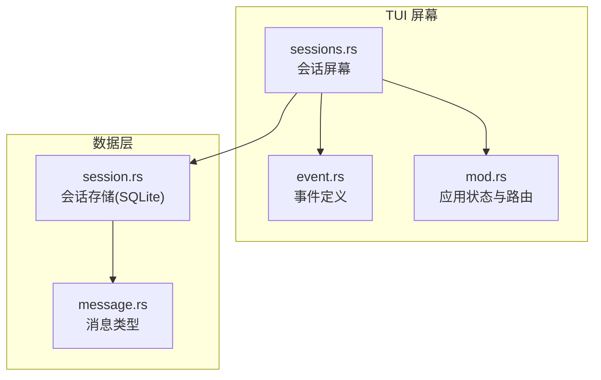
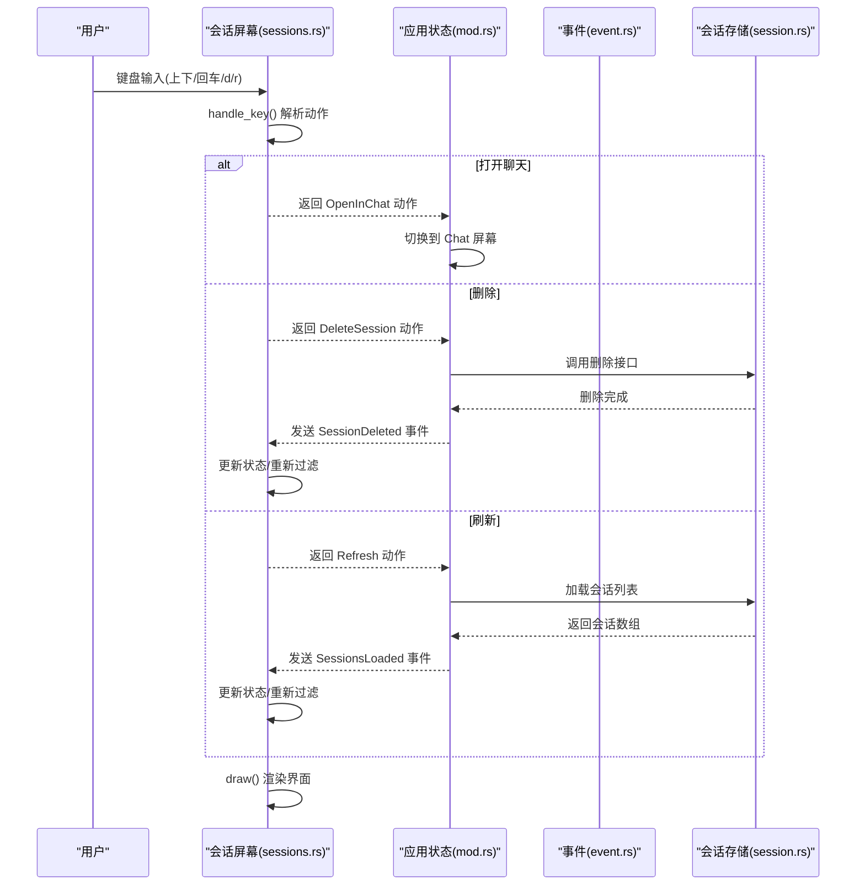
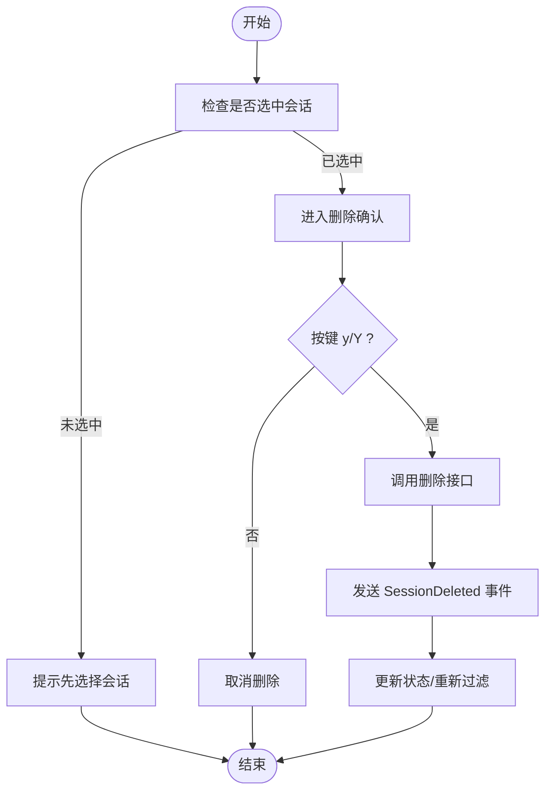
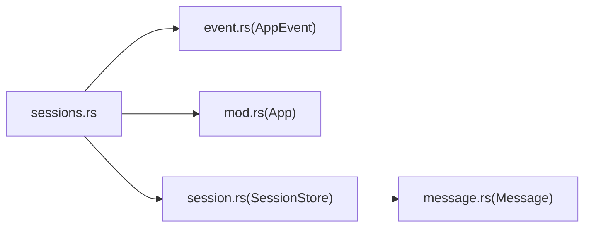

# 会话屏幕

<cite>
**本文引用的文件**
- [crates/openfang-cli/src/tui/screens/sessions.rs](file://crates/openfang-cli/src/tui/screens/sessions.rs)
- [crates/openfang-cli/src/tui/mod.rs](file://crates/openfang-cli/src/tui/mod.rs)
- [crates/openfang-cli/src/tui/event.rs](file://crates/openfang-cli/src/tui/event.rs)
- [crates/openfang-memory/src/session.rs](file://crates/openfang-memory/src/session.rs)
- [crates/openfang-types/src/message.rs](file://crates/openfang-types/src/message.rs)
</cite>

## 目录
1. [简介](#简介)
2. [项目结构](#项目结构)
3. [核心组件](#核心组件)
4. [架构总览](#架构总览)
5. [详细组件分析](#详细组件分析)
6. [依赖关系分析](#依赖关系分析)
7. [性能考虑](#性能考虑)
8. [故障排查指南](#故障排查指南)
9. [结论](#结论)
10. [附录](#附录)

## 简介
本文件面向 OpenFang TUI 的“会话屏幕”，系统性阐述会话管理功能与交互：会话列表查看、会话详情、消息历史、会话筛选与搜索、创建、删除、刷新等。文档覆盖界面布局、状态机、事件驱动的数据加载与渲染、搜索与过滤算法、以及与后端存储（SQLite）和类型系统的集成方式，并提供使用指南、数据备份建议与性能优化技巧。

## 项目结构
会话屏幕位于 TUI 子模块中，采用“屏幕模块 + 全局应用状态”的分层组织：
- 屏幕模块：负责键盘输入处理、绘制与状态维护
- 应用状态：统一调度各屏幕状态、事件派发与后台任务
- 数据层：会话存储在内存/磁盘（SQLite），支持列表、创建、删除、镜像导出等

图表来源
- [crates/openfang-cli/src/tui/screens/sessions.rs:1-317](file://crates/openfang-cli/src/tui/screens/sessions.rs#L1-L317)
- [crates/openfang-cli/src/tui/event.rs:1-200](file://crates/openfang-cli/src/tui/event.rs#L1-L200)
- [crates/openfang-cli/src/tui/mod.rs:1-200](file://crates/openfang-cli/src/tui/mod.rs#L1-L200)
- [crates/openfang-memory/src/session.rs:1-260](file://crates/openfang-memory/src/session.rs#L1-L260)
- [crates/openfang-types/src/message.rs:1-100](file://crates/openfang-types/src/message.rs#L1-L100)

章节来源
- [crates/openfang-cli/src/tui/screens/sessions.rs:1-317](file://crates/openfang-cli/src/tui/screens/sessions.rs#L1-L317)
- [crates/openfang-cli/src/tui/mod.rs:1-200](file://crates/openfang-cli/src/tui/mod.rs#L1-L200)
- [crates/openfang-cli/src/tui/event.rs:1-200](file://crates/openfang-cli/src/tui/event.rs#L1-L200)
- [crates/openfang-memory/src/session.rs:1-260](file://crates/openfang-memory/src/session.rs#L1-L260)
- [crates/openfang-types/src/message.rs:1-100](file://crates/openfang-types/src/message.rs#L1-L100)

## 核心组件
- 会话信息模型：包含会话标识、所属代理、消息数量、创建时间等
- 屏幕状态：维护会话列表、过滤索引、当前选中项、搜索缓冲区、加载状态、确认删除提示、状态消息等
- 动作枚举：用于将键盘输入转换为高层动作（打开聊天、刷新、删除）
- 绘制函数：按区域渲染标题栏、搜索提示/输入框、会话列表、状态提示与快捷键提示

章节来源
- [crates/openfang-cli/src/tui/screens/sessions.rs:13-59](file://crates/openfang-cli/src/tui/screens/sessions.rs#L13-L59)
- [crates/openfang-cli/src/tui/screens/sessions.rs:36-44](file://crates/openfang-cli/src/tui/screens/sessions.rs#L36-L44)
- [crates/openfang-cli/src/tui/screens/sessions.rs:176-305](file://crates/openfang-cli/src/tui/screens/sessions.rs#L176-L305)

## 架构总览
会话屏幕通过事件系统与应用状态协同工作：键盘事件被转换为动作，应用状态根据动作触发数据加载或执行删除；数据加载完成后通过事件回传到会话屏幕，屏幕更新状态并重绘。

图表来源
- [crates/openfang-cli/src/tui/screens/sessions.rs:85-171](file://crates/openfang-cli/src/tui/screens/sessions.rs#L85-L171)
- [crates/openfang-cli/src/tui/mod.rs:366-376](file://crates/openfang-cli/src/tui/mod.rs#L366-L376)
- [crates/openfang-cli/src/tui/event.rs:102-105](file://crates/openfang-cli/src/tui/event.rs#L102-L105)
- [crates/openfang-memory/src/session.rs:103-130](file://crates/openfang-memory/src/session.rs#L103-L130)

## 详细组件分析

### 会话信息与状态
- 会话信息字段：id、agent_name、agent_id、message_count、created
- 屏幕状态字段：sessions、filtered、list_state、search_buf、search_mode、loading、tick、confirm_delete、status_msg
- 过滤逻辑：空查询时显示全部；非空时按代理名称进行不区分大小写子串匹配，生成 filtered 索引；更新选中项
- 搜索模式：进入/退出、字符输入/退格、确认提交；每次变更触发 refilter

章节来源
- [crates/openfang-cli/src/tui/screens/sessions.rs:13-59](file://crates/openfang-cli/src/tui/screens/sessions.rs#L13-L59)
- [crates/openfang-cli/src/tui/screens/sessions.rs:65-83](file://crates/openfang-cli/src/tui/screens/sessions.rs#L65-L83)
- [crates/openfang-cli/src/tui/screens/sessions.rs:196-230](file://crates/openfang-cli/src/tui/screens/sessions.rs#L196-L230)

### 键盘交互与动作
- 基本导航：上下移动、回车打开、d 删除、/ 进入搜索、r 刷新
- 搜索模式：Esc 退出并清空缓冲、Backspace 删除末尾字符、Char 追加字符、Enter 提交
- 删除确认：y/Y 确认删除，否则取消
- 双 Ctrl+C 退出（全局）

章节来源
- [crates/openfang-cli/src/tui/screens/sessions.rs:85-171](file://crates/openfang-cli/src/tui/screens/sessions.rs#L85-L171)
- [crates/openfang-cli/src/tui/mod.rs:612-778](file://crates/openfang-cli/src/tui/mod.rs#L612-L778)

### 绘制与界面布局
- 分块布局：标题栏/搜索区、会话列表区、提示/状态区
- 标题栏：显示“会话”标题与边框
- 搜索区：非搜索模式显示表头与过滤提示；搜索模式显示输入光标闪烁
- 列表区：加载中显示旋转器；无结果提示；否则按选中样式高亮
- 提示区：删除确认提示、状态消息、快捷键提示

章节来源
- [crates/openfang-cli/src/tui/screens/sessions.rs:176-305](file://crates/openfang-cli/src/tui/screens/sessions.rs#L176-L305)

### 会话数据模型与存储
- 会话模型：包含会话标识、代理标识、消息列表、上下文令牌数、可选标签
- 存储接口：创建、保存、删除、按代理列出、按标签查找、设置标签、写入 JSONL 镜像
- 列表排序：按创建时间倒序
- 消息计数：通过反序列化消息数组计算长度

章节来源
- [crates/openfang-memory/src/session.rs:12-25](file://crates/openfang-memory/src/session.rs#L12-L25)
- [crates/openfang-memory/src/session.rs:145-183](file://crates/openfang-memory/src/session.rs#L145-L183)
- [crates/openfang-memory/src/session.rs:263-298](file://crates/openfang-memory/src/session.rs#L263-L298)

### 消息类型与内容
- 消息角色：系统、用户、助手
- 内容块：文本、图片、工具调用、工具结果、思考内容等
- 文本提取与长度统计：用于消息计数与摘要生成

章节来源
- [crates/openfang-types/src/message.rs:5-96](file://crates/openfang-types/src/message.rs#L5-L96)
- [crates/openfang-types/src/message.rs:129-167](file://crates/openfang-types/src/message.rs#L129-L167)

### 会话创建与删除流程
- 创建：通过存储接口创建空会话并持久化
- 删除：支持按会话 ID 删除，或按代理批量删除
- 删除确认：在会话屏幕中以 y/Y 确认的方式避免误删

图表来源
- [crates/openfang-cli/src/tui/screens/sessions.rs:113-129](file://crates/openfang-cli/src/tui/screens/sessions.rs#L113-L129)
- [crates/openfang-cli/src/tui/mod.rs:372-376](file://crates/openfang-cli/src/tui/mod.rs#L372-L376)
- [crates/openfang-memory/src/session.rs:103-130](file://crates/openfang-memory/src/session.rs#L103-L130)

### 会话列表加载与刷新
- 加载入口：应用状态接收 SessionsLoaded 事件，填充 sessions 并触发 refilter
- 刷新：r 键触发 Refresh 动作，应用重新拉取会话列表
- 错误处理：FetchError 事件统一映射到当前屏幕状态消息

章节来源
- [crates/openfang-cli/src/tui/mod.rs:366-371](file://crates/openfang-cli/src/tui/mod.rs#L366-L371)
- [crates/openfang-cli/src/tui/mod.rs:349-364](file://crates/openfang-cli/src/tui/mod.rs#L349-L364)
- [crates/openfang-cli/src/tui/event.rs:102-105](file://crates/openfang-cli/src/tui/event.rs#L102-L105)

### 搜索与过滤算法
- 查询字符串：不区分大小写子串匹配
- 过滤过程：遍历 sessions，收集满足条件的索引，生成 filtered；若非空则选中首项，否则取消选中
- 性能特征：线性扫描，适合中小规模会话集；复杂度 O(n)

章节来源
- [crates/openfang-cli/src/tui/screens/sessions.rs:65-83](file://crates/openfang-cli/src/tui/screens/sessions.rs#L65-L83)

## 依赖关系分析
- 屏幕依赖：依赖主题样式、布局与小部件；依赖应用状态与事件系统
- 数据依赖：依赖会话存储接口；消息类型用于内容统计与展示
- 事件依赖：通过 AppEvent 传递 SessionsLoaded、SessionDeleted 等事件

图表来源
- [crates/openfang-cli/src/tui/screens/sessions.rs:1-10](file://crates/openfang-cli/src/tui/screens/sessions.rs#L1-L10)
- [crates/openfang-cli/src/tui/event.rs:42-105](file://crates/openfang-cli/src/tui/event.rs#L42-L105)
- [crates/openfang-cli/src/tui/mod.rs:138-180](file://crates/openfang-cli/src/tui/mod.rs#L138-L180)
- [crates/openfang-memory/src/session.rs:28-31](file://crates/openfang-memory/src/session.rs#L28-L31)
- [crates/openfang-types/src/message.rs:5-12](file://crates/openfang-types/src/message.rs#L5-L12)

章节来源
- [crates/openfang-cli/src/tui/screens/sessions.rs:1-10](file://crates/openfang-cli/src/tui/screens/sessions.rs#L1-L10)
- [crates/openfang-cli/src/tui/event.rs:42-105](file://crates/openfang-cli/src/tui/event.rs#L42-L105)
- [crates/openfang-cli/src/tui/mod.rs:138-180](file://crates/openfang-cli/src/tui/mod.rs#L138-L180)
- [crates/openfang-memory/src/session.rs:28-31](file://crates/openfang-memory/src/session.rs#L28-L31)
- [crates/openfang-types/src/message.rs:5-12](file://crates/openfang-types/src/message.rs#L5-L12)

## 性能考虑
- 列表渲染：按需渲染，仅在状态变化或刷新时重绘
- 过滤策略：当前为全量线性过滤，适合中小规模；大规模场景建议：
  - 引入索引（如按代理名建立二级索引）
  - 使用前缀树/倒排索引加速模糊匹配
  - 增加分页或虚拟滚动
- I/O 优化：会话存储基于 SQLite，建议：
  - 合理使用事务批量写入
  - 对频繁读取的列建立索引（如 created_at）
  - 控制消息序列化体积，必要时压缩
- 渲染优化：减少不必要的样式切换与文本截断计算

## 故障排查指南
- 无法看到会话列表
  - 检查是否收到 SessionsLoaded 事件；确认后端连接正常
  - 查看状态消息中的错误提示
- 搜索无效
  - 确认处于搜索模式（/），输入字符后应实时过滤
  - 检查查询字符串是否为空或过长
- 删除失败
  - 确认已选中会话且按键为 y/Y
  - 查看 SessionDeleted 事件是否到达
- 性能问题
  - 大量会话时考虑分页或虚拟列表
  - 检查 SQLite 是否存在未使用索引导致慢查询

章节来源
- [crates/openfang-cli/src/tui/mod.rs:349-364](file://crates/openfang-cli/src/tui/mod.rs#L349-L364)
- [crates/openfang-cli/src/tui/mod.rs:366-376](file://crates/openfang-cli/src/tui/mod.rs#L366-L376)
- [crates/openfang-cli/src/tui/screens/sessions.rs:65-83](file://crates/openfang-cli/src/tui/screens/sessions.rs#L65-L83)

## 结论
会话屏幕以简洁的状态机与事件驱动模型实现了完整的会话浏览、搜索、打开与删除能力。其界面清晰、交互直观，数据层通过 SQLite 提供可靠持久化。对于更大规模的会话数据，建议引入索引与分页/虚拟化等优化手段，以进一步提升性能与用户体验。

## 附录

### 快捷键一览
- 上/下 或 j/k：在会话列表中移动
- 回车：打开所选会话到聊天界面
- d：删除当前会话（需二次确认）
- /：进入搜索模式
- r：刷新会话列表
- Ctrl+C：双击退出（全局）

章节来源
- [crates/openfang-cli/src/tui/screens/sessions.rs:132-171](file://crates/openfang-cli/src/tui/screens/sessions.rs#L132-L171)

### 数据备份建议
- 定期导出会话 JSONL 镜像：会话存储支持将消息序列化为人类可读的 JSONL 文件，便于离线归档与审计
- 备份 SQLite 数据库：定期复制数据库文件，确保会话元数据与消息体完整
- 备份策略：结合增量与全量备份，保留最近 N 天的会话快照

章节来源
- [crates/openfang-memory/src/session.rs:528-618](file://crates/openfang-memory/src/session.rs#L528-L618)