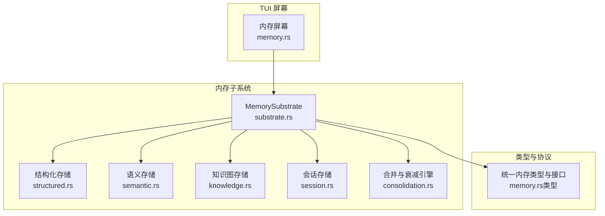
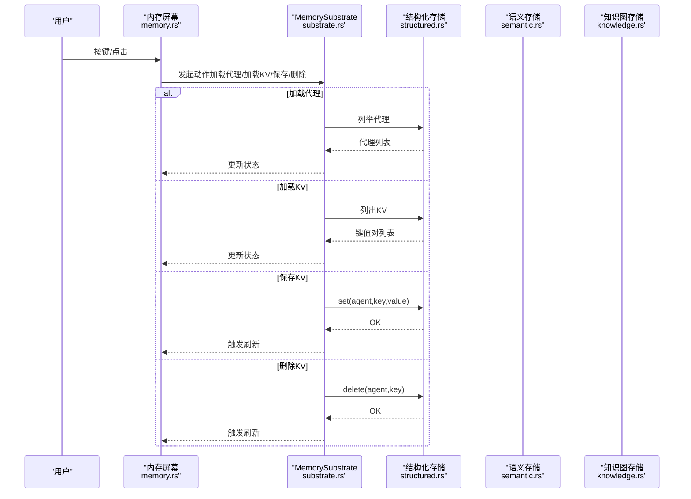
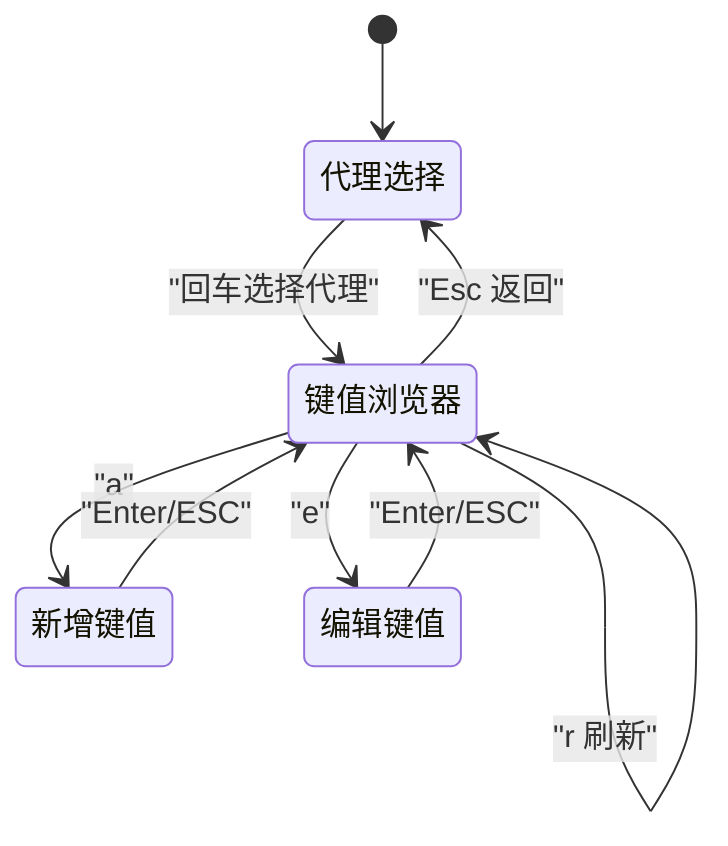
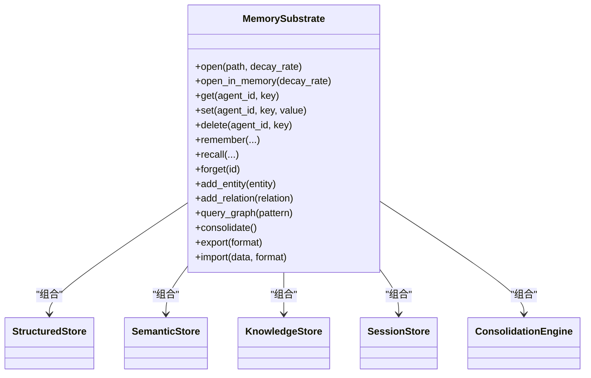
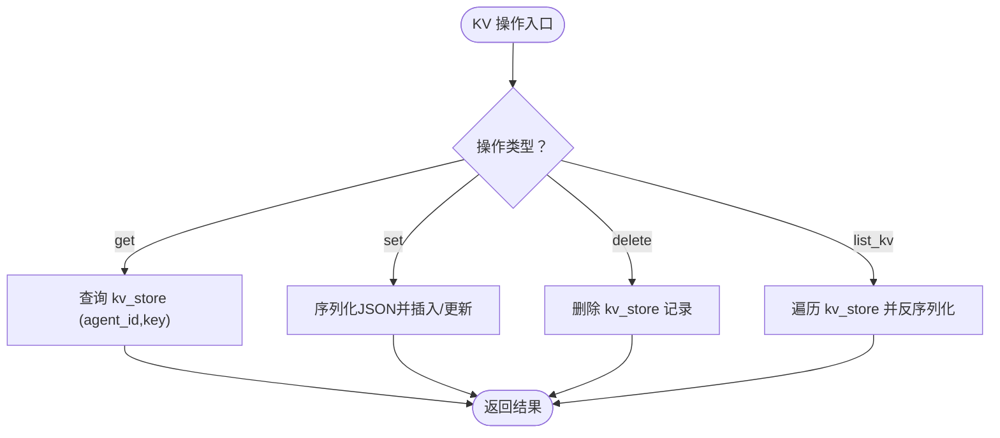
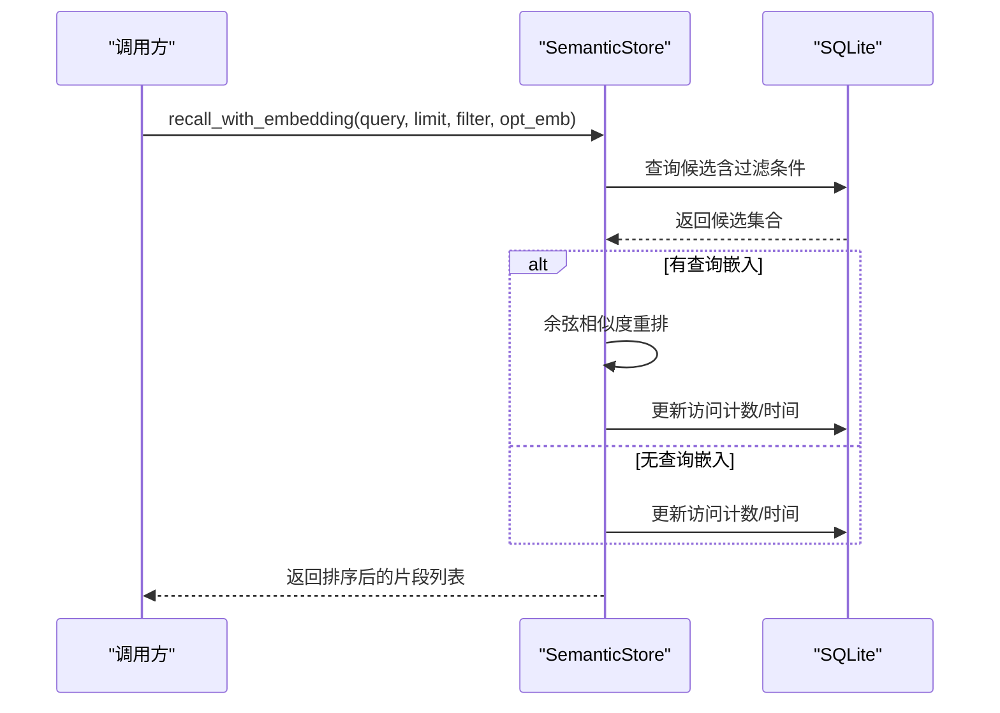
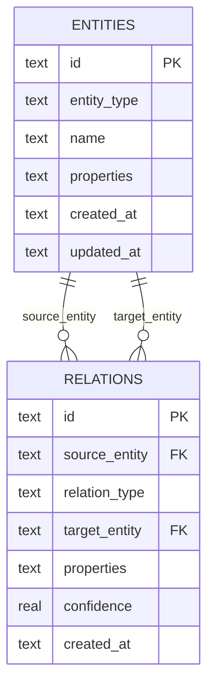
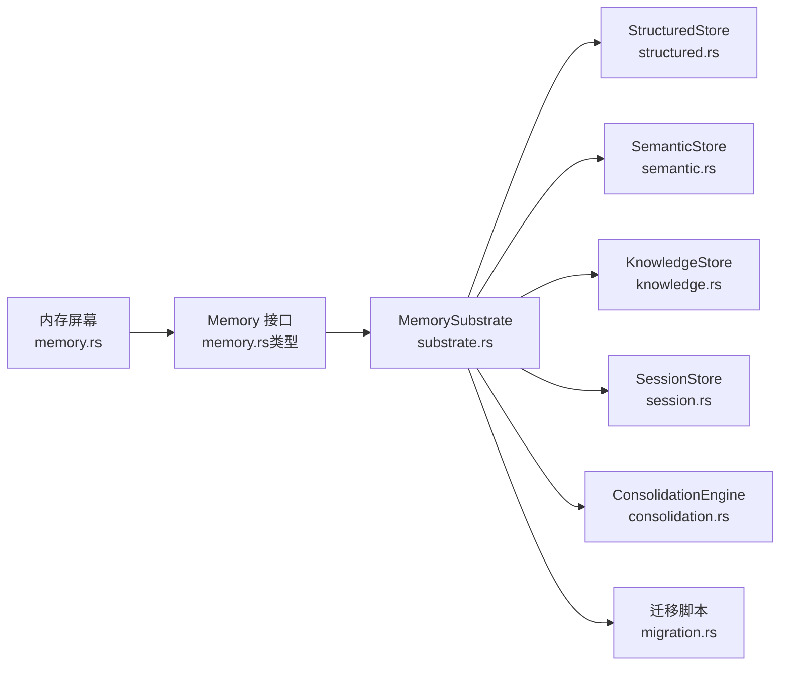

# 内存屏幕

<cite>
**本文引用的文件**
- [memory.rs](file://crates/openfang-cli/src/tui/screens/memory.rs)
- [lib.rs](file://crates/openfang-memory/src/lib.rs)
- [memory.rs（类型）](file://crates/openfang-types/src/memory.rs)
- [substrate.rs](file://crates/openfang-memory/src/substrate.rs)
- [structured.rs](file://crates/openfang-memory/src/structured.rs)
- [semantic.rs](file://crates/openfang-memory/src/semantic.rs)
- [knowledge.rs](file://crates/openfang-memory/src/knowledge.rs)
- [migration.rs](file://crates/openfang-memory/src/migration.rs)
- [session.rs](file://crates/openfang-memory/src/session.rs)
- [consolidation.rs](file://crates/openfang-memory/src/consolidation.rs)
- [mod.rs（屏幕模块）](file://crates/openfang-cli/src/tui/screens/mod.rs)
</cite>

## 目录
1. [简介](#简介)
2. [项目结构](#项目结构)
3. [核心组件](#核心组件)
4. [架构总览](#架构总览)
5. [详细组件分析](#详细组件分析)
6. [依赖关系分析](#依赖关系分析)
7. [性能考量](#性能考量)
8. [故障排查指南](#故障排查指南)
9. [结论](#结论)
10. [附录](#附录)

## 简介
本文件面向 OpenFang TUI 的“内存屏幕”，系统性阐述其在统一内存子系统之上的交互与能力边界。内存屏幕以每代理为单位的键值存储浏览与编辑为核心，同时承载知识库查看、智能体记忆检索、会话上下文与图谱查询等能力入口。本文从界面设计、数据结构、存储机制、查询接口、导入导出、索引优化、备份恢复到使用指南与性能优化策略进行完整说明。

## 项目结构
- TUI 屏幕层：负责用户交互、状态机与渲染，位于 CLI 子工程中。
- 内存子系统层：统一抽象三类存储后端（结构化KV、语义记忆、知识图谱），并提供一致的异步 API。
- 类型与协议层：定义统一的内存片段、实体、关系、过滤器、导出格式等数据模型与接口契约。

图表来源
- [memory.rs:1-558](file://crates/openfang-cli/src/tui/screens/memory.rs#L1-L558)
- [substrate.rs:1-777](file://crates/openfang-memory/src/substrate.rs#L1-L777)
- [structured.rs:1-494](file://crates/openfang-memory/src/structured.rs#L1-L494)
- [semantic.rs:1-557](file://crates/openfang-memory/src/semantic.rs#L1-L557)
- [knowledge.rs:1-355](file://crates/openfang-memory/src/knowledge.rs#L1-L355)
- [session.rs:1-814](file://crates/openfang-memory/src/session.rs#L1-L814)
- [consolidation.rs:1-102](file://crates/openfang-memory/src/consolidation.rs#L1-L102)
- [memory.rs（类型）:1-369](file://crates/openfang-types/src/memory.rs#L1-L369)

章节来源
- [memory.rs:1-558](file://crates/openfang-cli/src/tui/screens/memory.rs#L1-L558)
- [lib.rs:1-20](file://crates/openfang-memory/src/lib.rs#L1-L20)
- [memory.rs（类型）:1-369](file://crates/openfang-types/src/memory.rs#L1-L369)

## 核心组件
- 内存屏幕（TUI）
  - 提供三段式状态机：代理选择、键值浏览器、编辑/新增表单。
  - 键盘快捷键驱动：上下导航、回车进入、a/e/d 添加/编辑/删除、Esc 返回、r 刷新。
  - 渲染布局：标题块、列表项、提示行；支持加载动画与确认删除提示。
- 统一内存子系统（MemorySubstrate）
  - 聚合结构化KV、语义记忆、知识图谱、会话与使用统计，并暴露统一异步接口。
  - 通过共享 SQLite 连接与 WAL 模式、BusyTimeout 配置保障并发与一致性。
- 结构化存储（StructuredStore）
  - 基于 SQLite 的键值对持久化，支持按代理维度读写、列出与删除。
  - 使用 JSON Blob 存储 serde_json::Value，兼容版本字段与更新时间。
- 语义存储（SemanticStore）
  - 支持文本 LIKE 回退与向量相似度排序；可选嵌入列；访问计数与最近访问时间用于重排。
  - 提供软删除、向量更新与基于查询嵌入的召回。
- 知识图存储（KnowledgeStore）
  - 实体与关系的增删改查，支持基于模式的图查询（源/关系/目标过滤）。
- 会话存储（SessionStore）
  - 会话的创建、保存、删除、标签设置与按代理列表；支持跨通道的“规范会话”持久化与压缩。
- 合并与衰减引擎（ConsolidationEngine）
  - 定期降低长期未访问记忆的置信度，为后续检索排序提供权重。
- 数据模型与接口（openfang-types）
  - 统一的 Memory trait、MemoryFragment、Entity/Relation、MemoryFilter、ExportFormat 等。

章节来源
- [memory.rs:1-558](file://crates/openfang-cli/src/tui/screens/memory.rs#L1-L558)
- [substrate.rs:1-777](file://crates/openfang-memory/src/substrate.rs#L1-L777)
- [structured.rs:1-494](file://crates/openfang-memory/src/structured.rs#L1-L494)
- [semantic.rs:1-557](file://crates/openfang-memory/src/semantic.rs#L1-L557)
- [knowledge.rs:1-355](file://crates/openfang-memory/src/knowledge.rs#L1-L355)
- [session.rs:1-814](file://crates/openfang-memory/src/session.rs#L1-L814)
- [consolidation.rs:1-102](file://crates/openfang-memory/src/consolidation.rs#L1-L102)
- [memory.rs（类型）:1-369](file://crates/openfang-types/src/memory.rs#L1-L369)

## 架构总览
内存屏幕作为 TUI 的一个标签页，通过统一内存接口访问底层三类存储。其交互流程如下：

图表来源
- [memory.rs:95-257](file://crates/openfang-cli/src/tui/screens/memory.rs#L95-L257)
- [substrate.rs:113-140](file://crates/openfang-memory/src/substrate.rs#L113-L140)
- [structured.rs:82-111](file://crates/openfang-memory/src/structured.rs#L82-L111)

## 详细组件分析

### 内存屏幕（TUI）组件
- 数据结构
  - KvPair：键值对展示。
  - AgentEntry：代理条目（ID、名称）。
  - MemoryState：状态机与渲染所需的所有状态（当前子视图、代理列表、KV 列表、输入缓冲、加载/确认状态、提示消息等）。
  - MemoryAction：动作枚举，用于将按键事件转换为具体操作（加载代理、加载KV、保存KV、删除KV）。
- 状态机与交互
  - 代理选择：上下移动、回车进入、r 刷新。
  - 键值浏览器：上下移动、a 添加、e 编辑、d 删除（先弹出确认）、r 刷新、Esc 返回。
  - 编辑/新增：Tab 切换字段、Enter 保存、Esc 取消、Backspace 输入删除、字符输入。
- 渲染
  - 三段式布局：标题、内容列表、提示行。
  - 加载态显示旋转指示器与文案。
  - 确认删除时高亮提示。
- 键盘快捷键
  - 导航：↑/k 下移，↓/j 上移。
  - 功能：a 添加、e 编辑、d 删除、r 刷新、Esc 返回、Ctrl+C 退出（返回上层）。

图表来源
- [memory.rs:27-104](file://crates/openfang-cli/src/tui/screens/memory.rs#L27-L104)

章节来源
- [memory.rs:1-558](file://crates/openfang-cli/src/tui/screens/memory.rs#L1-L558)

### 统一内存子系统（MemorySubstrate）
- 组成
  - 共享 SQLite 连接（WAL 模式、BusyTimeout），迁移初始化。
  - 结构化、语义、知识、会话、使用统计与合并引擎。
- 关键职责
  - 对外暴露统一异步接口（get/set/delete、remember/recall/forget、add_entity/add_relation/query_graph、consolidate、export/import）。
  - 将所有写操作包装为 tokio::task::spawn_blocking，避免阻塞运行时。
  - 提供结构化 KV 的同步访问（用于内核句柄场景）。
  - 提供会话生命周期管理与跨通道“规范会话”持久化。
- 导入导出
  - Phase 1：export 返回空字节流，import 返回“尚未实现”的报告。

图表来源
- [substrate.rs:26-777](file://crates/openfang-memory/src/substrate.rs#L26-L777)

章节来源
- [substrate.rs:1-777](file://crates/openfang-memory/src/substrate.rs#L1-L777)

### 结构化存储（KV）
- 表结构要点
  - kv_store：(agent_id, key) 主键，value 为 JSON Blob，version 与 updated_at。
  - agents：代理注册表，支持 manifest/state/identity/session_id 等字段（迁移兼容）。
- 操作
  - get/set/delete：按代理维度的键值对 CRUD。
  - list_kv：列出某代理全部键值对。
  - save_agent/load_agent/remove_agent/list_agents：代理元数据持久化与列表。
- 序列化
  - KV 值使用 serde_json::Value；代理 manifest 使用 MessagePack（rmp_serde）。

图表来源
- [structured.rs:21-111](file://crates/openfang-memory/src/structured.rs#L21-L111)

章节来源
- [structured.rs:1-494](file://crates/openfang-memory/src/structured.rs#L1-L494)

### 语义存储（记忆检索）
- 表结构要点
  - memories：包含 content、source、scope、metadata、confidence、embedding、deleted 等。
- 检索策略
  - 文本 LIKE 回退：无嵌入时按 content LIKE 查询。
  - 向量相似度：提供查询嵌入时，按余弦相似度重排并截断 limit。
  - 访问计数与最近访问时间用于重排。
- 操作
  - remember/remember_with_embedding：存储记忆片段（可带嵌入）。
  - recall/recall_with_embedding：检索并更新访问统计。
  - forget：软删除。
  - update_embedding：更新已有记忆的嵌入。

图表来源
- [semantic.rs:95-277](file://crates/openfang-memory/src/semantic.rs#L95-L277)

章节来源
- [semantic.rs:1-557](file://crates/openfang-memory/src/semantic.rs#L1-L557)

### 知识图存储（实体与关系）
- 表结构要点
  - entities：实体（id、entity_type、name、properties、created_at/updated_at）。
  - relations：关系（source_entity、relation_type、target_entity、properties、confidence、created_at）。
- 操作
  - add_entity：插入或更新实体。
  - add_relation：插入关系。
  - query_graph：按模式（源/关系/目标）查询三元组匹配。

图表来源
- [knowledge.rs:15-196](file://crates/openfang-memory/src/knowledge.rs#L15-L196)

章节来源
- [knowledge.rs:1-355](file://crates/openfang-memory/src/knowledge.rs#L1-L355)

### 会话存储（跨通道上下文）
- 功能
  - 会话的创建、保存、删除、按代理列表与标签查找。
  - “规范会话”：跨通道持久化同一代理的历史，支持压缩与摘要生成。
- 用途
  - 为聊天与工作流提供连续上下文，避免不同渠道间上下文割裂。

章节来源
- [session.rs:1-814](file://crates/openfang-memory/src/session.rs#L1-L814)

### 合并与衰减引擎
- 目标
  - 降低长期未访问记忆的置信度，减少检索噪音。
- 策略
  - 每次周期：对超过阈值未访问的记忆按衰减率乘法衰减，最低不低于阈值。
- 报告
  - 返回本次周期衰减的记忆数量与耗时。

章节来源
- [consolidation.rs:1-102](file://crates/openfang-memory/src/consolidation.rs#L1-L102)

### 数据模型与接口（类型）
- 统一内存接口（Memory trait）
  - 键值操作：get/set/delete。
  - 语义操作：remember/recall/forget。
  - 知识图操作：add_entity/add_relation/query_graph。
  - 维护：consolidate/export/import。
- 关键类型
  - MemoryFragment、Entity、Relation、GraphPattern/GraphMatch、MemoryFilter、ExportFormat、ImportReport、ConsolidationReport。
- 作用
  - 为上层（TUI、内核、API）提供一致的抽象，屏蔽底层存储差异。

章节来源
- [memory.rs（类型）:1-369](file://crates/openfang-types/src/memory.rs#L1-L369)

## 依赖关系分析
- 内存屏幕依赖
  - TUI 状态机与渲染依赖 openfang-types 的主题与样式常量。
  - 业务逻辑通过 MemorySubstrate 的异步接口与结构化存储交互。
- 内存子系统依赖
  - 所有存储均依赖 SQLite（rusqlite）与 WAL 模式。
  - 迁移脚本确保表结构与索引就绪。
  - 合并引擎与语义存储共同影响检索质量与性能。

图表来源
- [memory.rs:1-558](file://crates/openfang-cli/src/tui/screens/memory.rs#L1-L558)
- [memory.rs（类型）:258-335](file://crates/openfang-types/src/memory.rs#L258-L335)
- [substrate.rs:1-777](file://crates/openfang-memory/src/substrate.rs#L1-L777)
- [structured.rs:1-494](file://crates/openfang-memory/src/structured.rs#L1-L494)
- [semantic.rs:1-557](file://crates/openfang-memory/src/semantic.rs#L1-L557)
- [knowledge.rs:1-355](file://crates/openfang-memory/src/knowledge.rs#L1-L355)
- [session.rs:1-814](file://crates/openfang-memory/src/session.rs#L1-L814)
- [consolidation.rs:1-102](file://crates/openfang-memory/src/consolidation.rs#L1-L102)
- [migration.rs:1-364](file://crates/openfang-memory/src/migration.rs#L1-L364)

章节来源
- [mod.rs（屏幕模块）:1-23](file://crates/openfang-cli/src/tui/screens/mod.rs#L1-L23)

## 性能考量
- I/O 与并发
  - 所有数据库写操作通过 spawn_blocking 在阻塞线程池执行，避免阻塞 Tokio 运行时。
  - SQLite 使用 WAL 模式与 BusyTimeout，提升并发与锁等待稳定性。
- 检索效率
  - 语义检索：无嵌入时走 LIKE；有嵌入时先取较多候选再按余弦相似度重排，限制最终返回数量。
  - 索引：memories 表按 agent_id、scope 建立索引；relations 表按 source/target/type 建立索引；events 表按 timestamp/source 建立索引。
- 存储体积
  - 通过合并与衰减引擎定期清理低价值记忆，控制表规模。
  - 会话压缩：超过阈值时生成摘要并裁剪历史消息，保持最近窗口大小。

章节来源
- [substrate.rs:571-681](file://crates/openfang-memory/src/substrate.rs#L571-L681)
- [semantic.rs:107-156](file://crates/openfang-memory/src/semantic.rs#L107-L156)
- [migration.rs:133-172](file://crates/openfang-memory/src/migration.rs#L133-L172)
- [session.rs:410-475](file://crates/openfang-memory/src/session.rs#L410-L475)
- [consolidation.rs:26-53](file://crates/openfang-memory/src/consolidation.rs#L26-L53)

## 故障排查指南
- 无法加载代理或键值对
  - 检查数据库连接是否成功打开与迁移是否完成。
  - 查看是否存在 BusyTimeout 或锁冲突导致的超时。
- 检索结果为空
  - 若无嵌入：确认查询词与 content 匹配；考虑扩大查询范围或添加更多上下文。
  - 若有嵌入：确认查询嵌入维度与存储一致；检查 embedding 列是否已填充。
- 删除确认误触发
  - d 操作需要二次确认，按任意非 y/Y 键取消。
- 导入导出
  - Phase 1：export 返回空，import 返回“尚未实现”的错误报告，需后续完善。

章节来源
- [memory.rs:141-212](file://crates/openfang-cli/src/tui/screens/memory.rs#L141-L212)
- [substrate.rs:668-680](file://crates/openfang-memory/src/substrate.rs#L668-L680)

## 结论
内存屏幕以简洁直观的 TUI 交互，将统一内存子系统的三大能力（结构化KV、语义记忆、知识图谱）整合在一个界面中。通过合理的状态机、渲染与快捷键设计，用户可以高效地浏览、编辑与管理每个智能体的记忆数据。配合 SQLite 的 WAL 模式、索引与合并衰减策略，系统在可用性与性能之间取得平衡。未来可在导入导出、向量检索与图谱查询方面进一步增强。

## 附录
- 使用指南
  - 打开内存屏幕：F7 快捷键或在主菜单切换至“Memory”。
  - 浏览代理：上下移动选择，回车进入该代理的键值浏览器。
  - 浏览键值：上下移动选择，a 新增、e 编辑、d 删除（需确认）、r 刷新、Esc 返回。
  - 编辑键值：Tab 切换字段，Enter 保存，Esc 取消。
- 数据组织建议
  - 键值对命名：采用清晰的键前缀与分层命名，便于筛选与检索。
  - 语义记忆：按 scope（如 episodic、declarative）组织，便于检索与可视化。
  - 知识图谱：实体与关系尽量规范化，使用标准关系类型，减少自定义带来的维护成本。
- 性能优化策略
  - 为高频查询字段建立索引（如 agent_id、scope、timestamp）。
  - 控制会话长度与压缩阈值，避免过长历史导致检索开销增大。
  - 定期运行合并与衰减，清理低价值记忆，保持检索质量稳定。