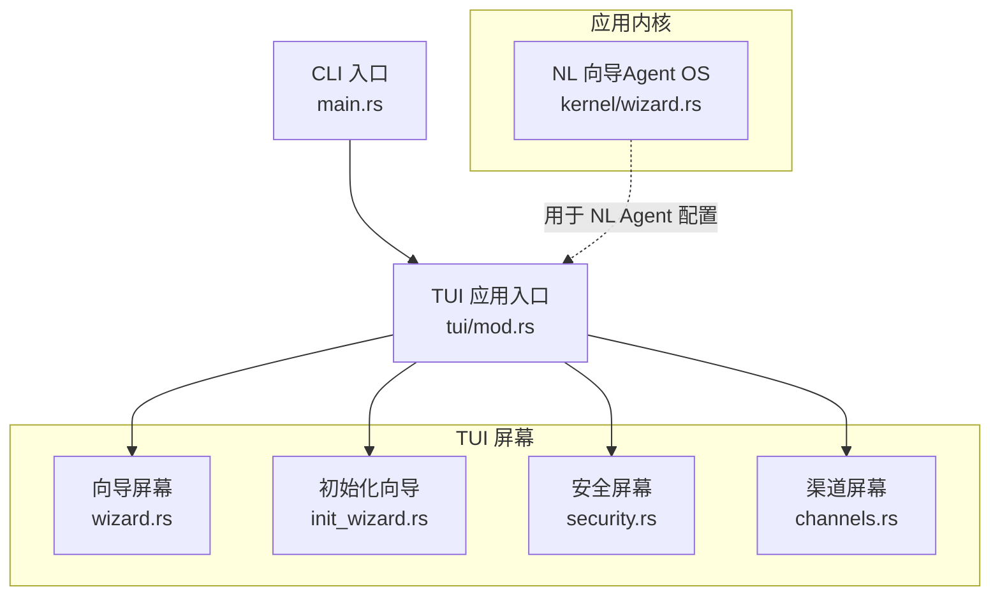
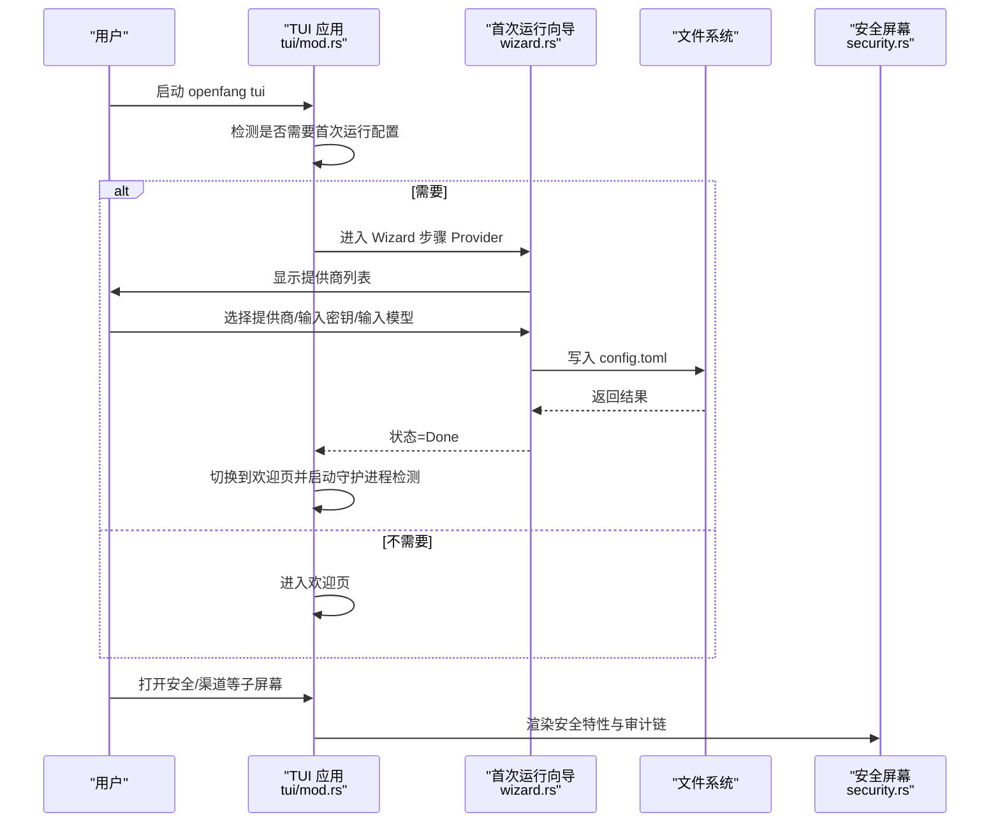
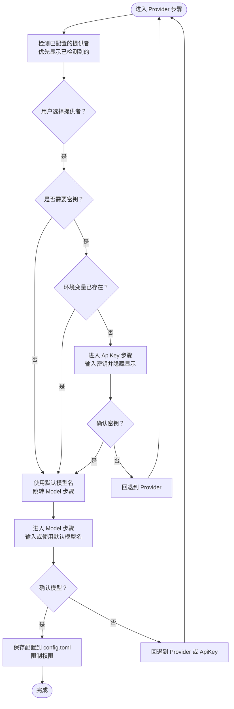
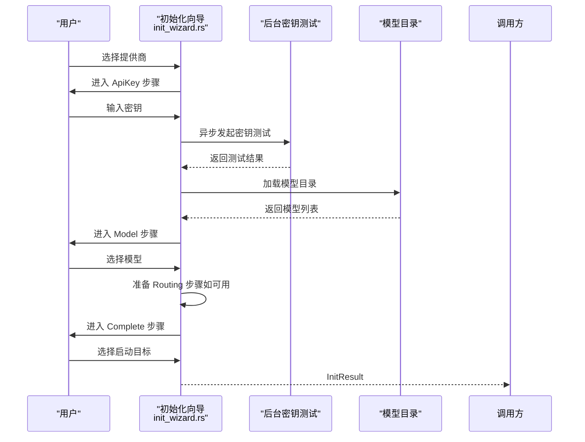
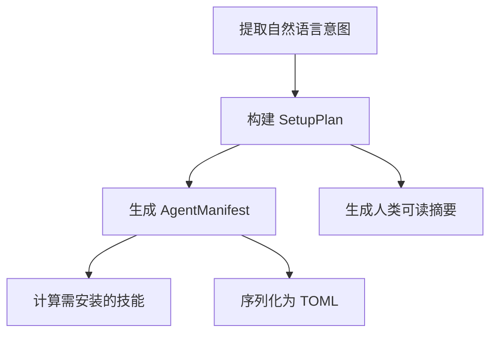
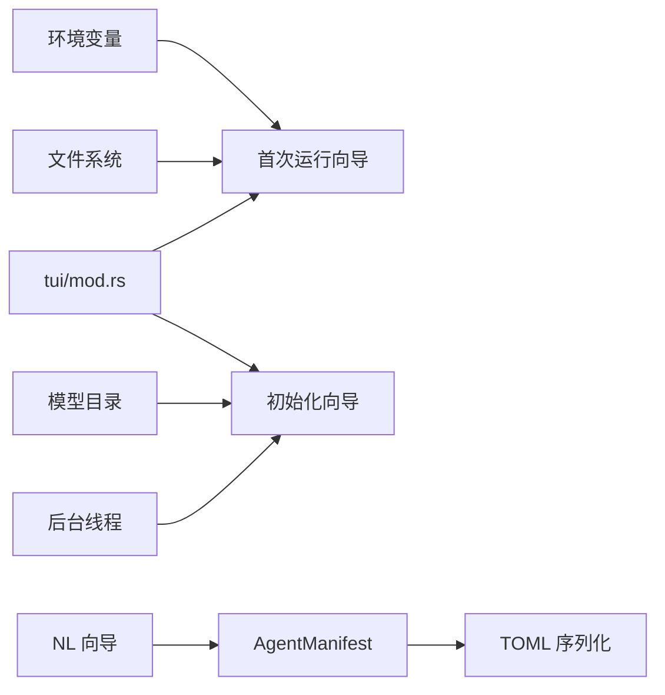

# 向导屏幕

<cite>
**本文引用的文件**
- [crates/openfang-cli/src/tui/screens/wizard.rs](file://crates/openfang-cli/src/tui/screens/wizard.rs)
- [crates/openfang-cli/src/tui/mod.rs](file://crates/openfang-cli/src/tui/mod.rs)
- [crates/openfang-cli/src/tui/screens/init_wizard.rs](file://crates/openfang-cli/src/tui/screens/init_wizard.rs)
- [crates/openfang-kernel/src/wizard.rs](file://crates/openfang-kernel/src/wizard.rs)
- [crates/openfang-cli/src/tui/screens/security.rs](file://crates/openfang-cli/src/tui/screens/security.rs)
- [crates/openfang-cli/src/tui/screens/channels.rs](file://crates/openfang-cli/src/tui/screens/channels.rs)
- [crates/openfang-cli/src/main.rs](file://crates/openfang-cli/src/main.rs)
</cite>

## 目录
1. [简介](#简介)
2. [项目结构](#项目结构)
3. [核心组件](#核心组件)
4. [架构总览](#架构总览)
5. [详细组件分析](#详细组件分析)
6. [依赖关系分析](#依赖关系分析)
7. [性能考虑](#性能考虑)
8. [故障排查指南](#故障排查指南)
9. [结论](#结论)
10. [附录](#附录)

## 简介
本文件面向 OpenFang 的 TUI 向导屏幕，系统性梳理“首次运行配置向导”（简称为“向导”）与“初始化向导”的多步骤配置流程，覆盖以下方面：
- 配置文件创建与写入策略
- LLM 提供商选择、API 密钥录入与环境变量检测
- 模型名称输入与默认值回退
- 步骤状态管理、键盘导航与取消机制
- 数据验证、错误处理与用户反馈
- 进度跟踪、配置预览与确认流程
- 安全设置与渠道配置的衔接
- 最佳实践、配置建议与常见问题解决

本向导以交互式 TUI 形式运行，采用分步引导与即时反馈，确保新用户在终端中快速完成基础配置。

## 项目结构
向导相关代码主要分布在以下模块：
- TUI 屏幕：提供交互式 UI 与事件处理
  - 首次运行配置向导：[crates/openfang-cli/src/tui/screens/wizard.rs](file://crates/openfang-cli/src/tui/screens/wizard.rs)
  - 初始化向导（6 步完整流程）：[crates/openfang-cli/src/tui/screens/init_wizard.rs](file://crates/openfang-cli/src/tui/screens/init_wizard.rs)
  - 安全仪表盘：[crates/openfang-cli/src/tui/screens/security.rs](file://crates/openfang-cli/src/tui/screens/security.rs)
  - 渠道配置：[crates/openfang-cli/src/tui/screens/channels.rs](file://crates/openfang-cli/src/tui/screens/channels.rs)
- 应用入口与生命周期：[crates/openfang-cli/src/tui/mod.rs](file://crates/openfang-cli/src/tui/mod.rs)
- 自然语言生成代理配置向导（NL Auto-Bootstrap Wizard）：[crates/openfang-kernel/src/wizard.rs](file://crates/openfang-kernel/src/wizard.rs)
- CLI 命令入口：[crates/openfang-cli/src/main.rs](file://crates/openfang-cli/src/main.rs)

图表来源
- [crates/openfang-cli/src/tui/screens/wizard.rs:1-686](file://crates/openfang-cli/src/tui/screens/wizard.rs#L1-L686)
- [crates/openfang-cli/src/tui/screens/init_wizard.rs:1-800](file://crates/openfang-cli/src/tui/screens/init_wizard.rs#L1-L800)
- [crates/openfang-cli/src/tui/mod.rs:2390-2428](file://crates/openfang-cli/src/tui/mod.rs#L2390-L2428)
- [crates/openfang-kernel/src/wizard.rs:1-439](file://crates/openfang-kernel/src/wizard.rs#L1-L439)
- [crates/openfang-cli/src/main.rs:108-294](file://crates/openfang-cli/src/main.rs#L108-L294)

章节来源
- [crates/openfang-cli/src/tui/mod.rs:2390-2428](file://crates/openfang-cli/src/tui/mod.rs#L2390-L2428)
- [crates/openfang-cli/src/tui/screens/wizard.rs:1-686](file://crates/openfang-cli/src/tui/screens/wizard.rs#L1-L686)
- [crates/openfang-cli/src/tui/screens/init_wizard.rs:1-800](file://crates/openfang-cli/src/tui/screens/init_wizard.rs#L1-L800)
- [crates/openfang-kernel/src/wizard.rs:1-439](file://crates/openfang-kernel/src/wizard.rs#L1-L439)
- [crates/openfang-cli/src/main.rs:108-294](file://crates/openfang-cli/src/main.rs#L108-L294)

## 核心组件
- 首次运行配置向导（三步）
  - 步骤枚举与状态：提供者选择、API 密钥录入、模型名称输入、保存中、完成
  - 状态机：根据用户输入推进或回退，支持 ESC 取消、Ctrl+C 中断
  - 配置生成：写入 config.toml，限制目录与文件权限，输出成功/失败消息
- 初始化向导（6 步）
  - 步骤枚举：欢迎、提供商、API 密钥、模型、路由、完成
  - 背景密钥测试：异步线程验证密钥有效性，自动跳转下一步
  - 模型目录：从模型目录加载可用模型，支持按 tier 自动推荐
  - 路由配置：可选的 tier 路由模型选择
- NL 向导（Agent OS）
  - 将自然语言意图映射为代理清单（TOML），自动推导能力与工具
- 安全与渠道
  - 安全仪表盘展示内置安全特性与审计链验证
  - 渠道列表与设置向导，支持按类别筛选、测试与启用/禁用

章节来源
- [crates/openfang-cli/src/tui/screens/wizard.rs:169-438](file://crates/openfang-cli/src/tui/screens/wizard.rs#L169-L438)
- [crates/openfang-cli/src/tui/screens/init_wizard.rs:246-526](file://crates/openfang-cli/src/tui/screens/init_wizard.rs#L246-L526)
- [crates/openfang-kernel/src/wizard.rs:14-264](file://crates/openfang-kernel/src/wizard.rs#L14-L264)
- [crates/openfang-cli/src/tui/screens/security.rs:138-194](file://crates/openfang-cli/src/tui/screens/security.rs#L138-L194)
- [crates/openfang-cli/src/tui/screens/channels.rs:348-624](file://crates/openfang-cli/src/tui/screens/channels.rs#L348-L624)

## 架构总览
向导在 TUI 主循环中运行，通过事件驱动更新状态并渲染界面。首次运行时若未检测到配置文件，则自动进入“首次运行配置向导”。初始化向导则提供更完整的 6 步流程，包含密钥测试、模型选择与路由配置。

图表来源
- [crates/openfang-cli/src/tui/mod.rs:2396-2404](file://crates/openfang-cli/src/tui/mod.rs#L2396-L2404)
- [crates/openfang-cli/src/tui/screens/wizard.rs:367-437](file://crates/openfang-cli/src/tui/screens/wizard.rs#L367-L437)
- [crates/openfang-cli/src/tui/screens/security.rs:198-326](file://crates/openfang-cli/src/tui/screens/security.rs#L198-L326)

章节来源
- [crates/openfang-cli/src/tui/mod.rs:2390-2428](file://crates/openfang-cli/src/tui/mod.rs#L2390-L2428)
- [crates/openfang-cli/src/tui/screens/wizard.rs:446-686](file://crates/openfang-cli/src/tui/screens/wizard.rs#L446-L686)

## 详细组件分析

### 组件 A：首次运行配置向导（三步）
- 功能概述
  - 提供者选择：按“已检测到/未检测到”排序，本地/无需密钥提供者优先
  - API 密钥录入：支持从环境变量检测；可手动输入并隐藏显示
  - 模型名称输入：支持默认值回退与自定义
  - 配置保存：生成 config.toml，限制目录与文件权限，提示成功/失败
- 状态管理与导航
  - 步骤枚举：Provider → ApiKey → Model → Saving → Done
  - 键盘操作：上下移动、回车确认、ESC 回退、Ctrl+C 取消
  - 取消机制：Ctrl+C 返回取消结果；ESC 在不同步骤回退到上一步
- 数据验证与错误处理
  - 无输入验证逻辑（仅检查空输入与环境变量存在性）
  - 失败时返回错误消息并在 Done 步骤显示
- 用户反馈
  - 步骤标签与进度提示
  - 成功/失败图标与消息
- 默认值与环境变量
  - 每个提供者内置默认模型名
  - 本地/无需密钥提供者自动跳过密钥步骤

图表来源
- [crates/openfang-cli/src/tui/screens/wizard.rs:257-365](file://crates/openfang-cli/src/tui/screens/wizard.rs#L257-L365)
- [crates/openfang-cli/src/tui/screens/wizard.rs:367-437](file://crates/openfang-cli/src/tui/screens/wizard.rs#L367-L437)

章节来源
- [crates/openfang-cli/src/tui/screens/wizard.rs:169-438](file://crates/openfang-cli/src/tui/screens/wizard.rs#L169-L438)

### 组件 B：初始化向导（6 步）
- 步骤与职责
  - Welcome：欢迎提示
  - Provider：选择提供商（含“已检测到/未检测到”提示）
  - ApiKey：输入密钥，支持环境变量检测；后台线程测试密钥
  - Model：从模型目录加载可用模型，支持上下选择
  - Routing：可选的 tier 路由模型选择（Fast/Balanced/Frontier）
  - Complete：选择启动到仪表盘或聊天，并返回 InitResult
- 关键特性
  - 背景密钥测试：收到测试结果后自动前进到 Model 步骤
  - 模型目录：按 tier 分类，自动推荐各 tier 的候选模型
  - 路由配置：当模型数量≥2时启用，否则跳过
- 键盘与交互
  - 支持 ESC 取消、回退
  - 数字快捷键 1/2 选择启动目标（仪表盘/聊天）

图表来源
- [crates/openfang-cli/src/tui/screens/init_wizard.rs:541-800](file://crates/openfang-cli/src/tui/screens/init_wizard.rs#L541-L800)
- [crates/openfang-cli/src/tui/screens/init_wizard.rs:653-746](file://crates/openfang-cli/src/tui/screens/init_wizard.rs#L653-L746)

章节来源
- [crates/openfang-cli/src/tui/screens/init_wizard.rs:246-526](file://crates/openfang-cli/src/tui/screens/init_wizard.rs#L246-L526)
- [crates/openfang-cli/src/tui/screens/init_wizard.rs:541-800](file://crates/openfang-cli/src/tui/screens/init_wizard.rs#L541-L800)

### 组件 C：NL 向导（Agent OS）
- 功能概述
  - 将自然语言描述映射为代理清单（TOML），自动推导能力、工具与调度
  - 根据模型 tier 推荐 provider/model
- 输出
  - 生成的 AgentManifest 与安装技能列表
  - 可序列化为 TOML 字符串

图表来源
- [crates/openfang-kernel/src/wizard.rs:50-264](file://crates/openfang-kernel/src/wizard.rs#L50-L264)

章节来源
- [crates/openfang-kernel/src/wizard.rs:14-264](file://crates/openfang-kernel/src/wizard.rs#L14-L264)

### 组件 D：安全与渠道
- 安全屏幕
  - 展示内置安全特性（核心、可配置、监控）
  - 支持审计链验证与刷新
- 渠道屏幕
  - 列出 40+ 渠道适配器，按类别筛选
  - 支持设置向导、测试与启用/禁用
  - 基于环境变量检测状态（就绪/缺失/未配置）

章节来源
- [crates/openfang-cli/src/tui/screens/security.rs:138-194](file://crates/openfang-cli/src/tui/screens/security.rs#L138-L194)
- [crates/openfang-cli/src/tui/screens/channels.rs:348-624](file://crates/openfang-cli/src/tui/screens/channels.rs#L348-L624)

## 依赖关系分析
- 首次运行向导依赖：
  - 环境变量检测（用于判断提供者密钥是否已配置）
  - 文件系统写入（config.toml）
  - 权限控制（限制目录与文件权限）
- 初始化向导依赖：
  - 模型目录（从模型目录加载可用模型）
  - 背景线程（密钥测试）
  - TUI 事件循环（按键与绘制）
- NL 向导依赖：
  - 类型定义与序列化（AgentManifest/TOML）

图表来源
- [crates/openfang-cli/src/tui/screens/wizard.rs:367-437](file://crates/openfang-cli/src/tui/screens/wizard.rs#L367-L437)
- [crates/openfang-cli/src/tui/mod.rs:2390-2428](file://crates/openfang-cli/src/tui/mod.rs#L2390-L2428)
- [crates/openfang-cli/src/tui/screens/init_wizard.rs:541-800](file://crates/openfang-cli/src/tui/screens/init_wizard.rs#L541-L800)
- [crates/openfang-kernel/src/wizard.rs:255-264](file://crates/openfang-kernel/src/wizard.rs#L255-L264)

章节来源
- [crates/openfang-cli/src/tui/mod.rs:2390-2428](file://crates/openfang-cli/src/tui/mod.rs#L2390-L2428)
- [crates/openfang-cli/src/tui/screens/wizard.rs:367-437](file://crates/openfang-cli/src/tui/screens/wizard.rs#L367-L437)
- [crates/openfang-cli/src/tui/screens/init_wizard.rs:541-800](file://crates/openfang-cli/src/tui/screens/init_wizard.rs#L541-L800)
- [crates/openfang-kernel/src/wizard.rs:255-264](file://crates/openfang-kernel/src/wizard.rs#L255-L264)

## 性能考虑
- 事件循环与帧率
  - TUI 使用 50ms tick，保证动画与按键响应流畅
- 背景测试
  - 密钥测试在独立线程执行，避免阻塞 UI
- 文件写入
  - 写入配置后立即限制权限，减少后续 I/O 开销
- 模型目录加载
  - 仅在进入模型步骤时加载，避免不必要的初始化

## 故障排查指南
- 首次运行向导无法保存配置
  - 检查 OPENFANG_HOME 是否正确设置
  - 确认目标目录可写且权限正确
  - 查看状态消息中的错误提示
- API 密钥无效或未生效
  - 确认环境变量名与提供商匹配
  - 使用“测试密钥”功能验证连接性
- 模型选择异常
  - 若模型目录为空，将回退到默认模型
  - 确认提供商支持的模型列表
- 取消与中断
  - Ctrl+C 可随时取消当前向导
  - ESC 在不同步骤回退到上一步

章节来源
- [crates/openfang-cli/src/tui/screens/wizard.rs:367-437](file://crates/openfang-cli/src/tui/screens/wizard.rs#L367-L437)
- [crates/openfang-cli/src/tui/screens/init_wizard.rs:653-746](file://crates/openfang-cli/src/tui/screens/init_wizard.rs#L653-L746)
- [crates/openfang-cli/src/tui/mod.rs:2390-2428](file://crates/openfang-cli/src/tui/mod.rs#L2390-L2428)

## 结论
OpenFang 的向导系统通过清晰的步骤划分与即时反馈，帮助用户在终端中高效完成首次运行配置与初始化流程。首次运行向导聚焦关键要素（提供商、密钥、模型），初始化向导进一步扩展到密钥测试、模型选择与路由配置。结合安全与渠道屏幕，用户可在同一界面完成从基础配置到安全加固与通信渠道的全链路设置。

## 附录
- 最佳实践
  - 首次运行时优先使用环境变量存储密钥，避免明文输入
  - 选择与预算/性能匹配的提供商与模型 tier
  - 完成配置后启用安全特性与审计链验证
- 常见问题
  - 配置文件未生成：检查 OPENFANG_HOME 与目录权限
  - 模型不可用：确认提供商与地区支持情况
  - 渠道无法启用：检查所需环境变量是否齐全