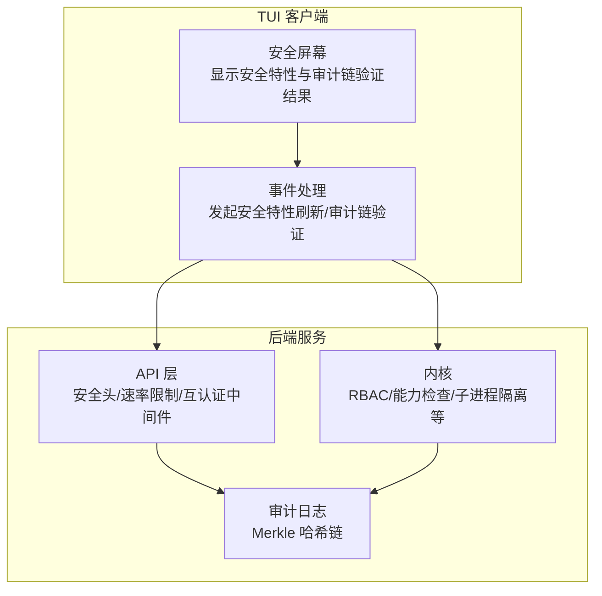
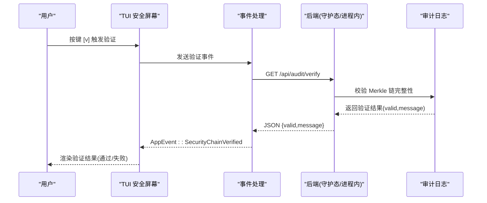
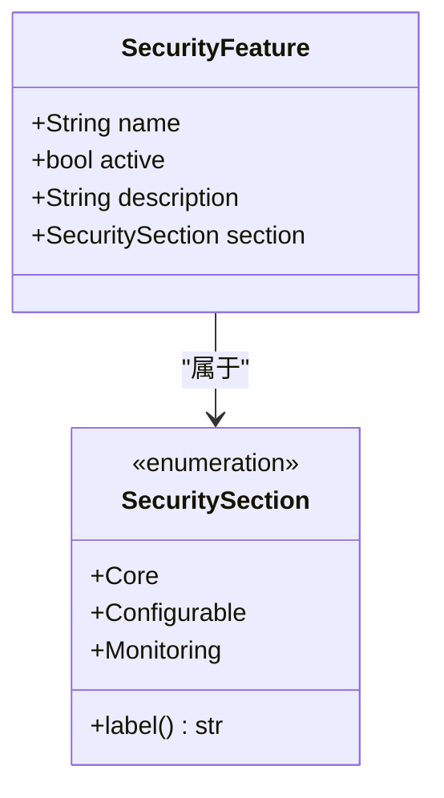
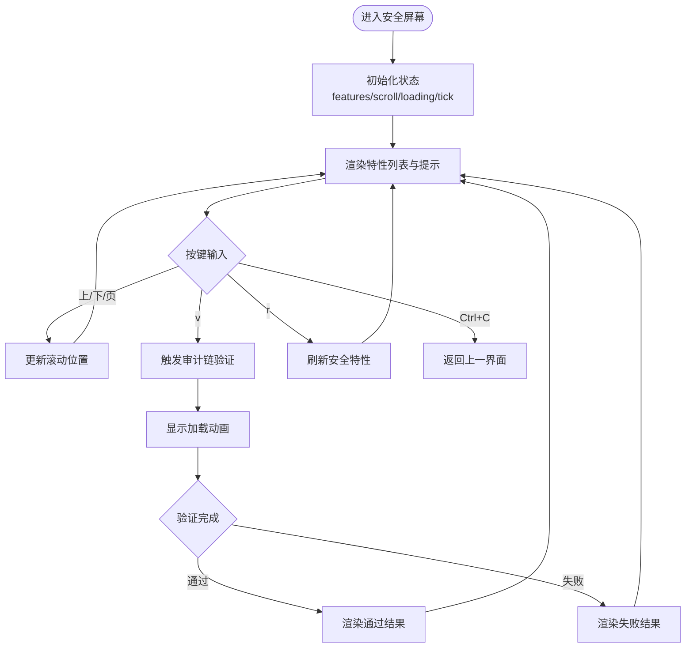
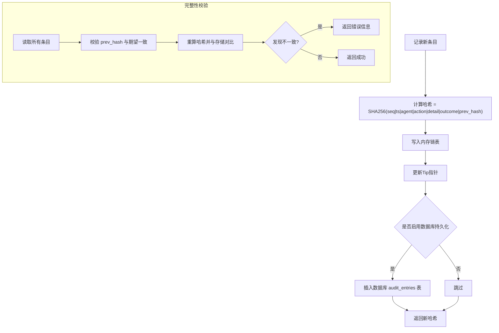
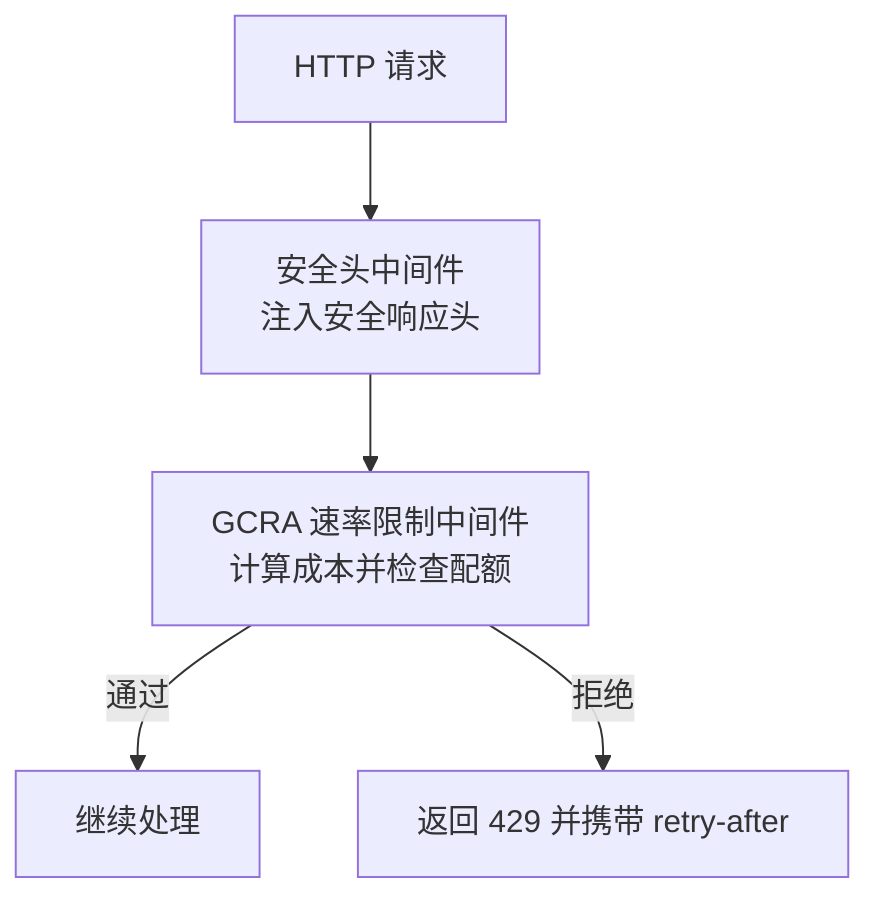
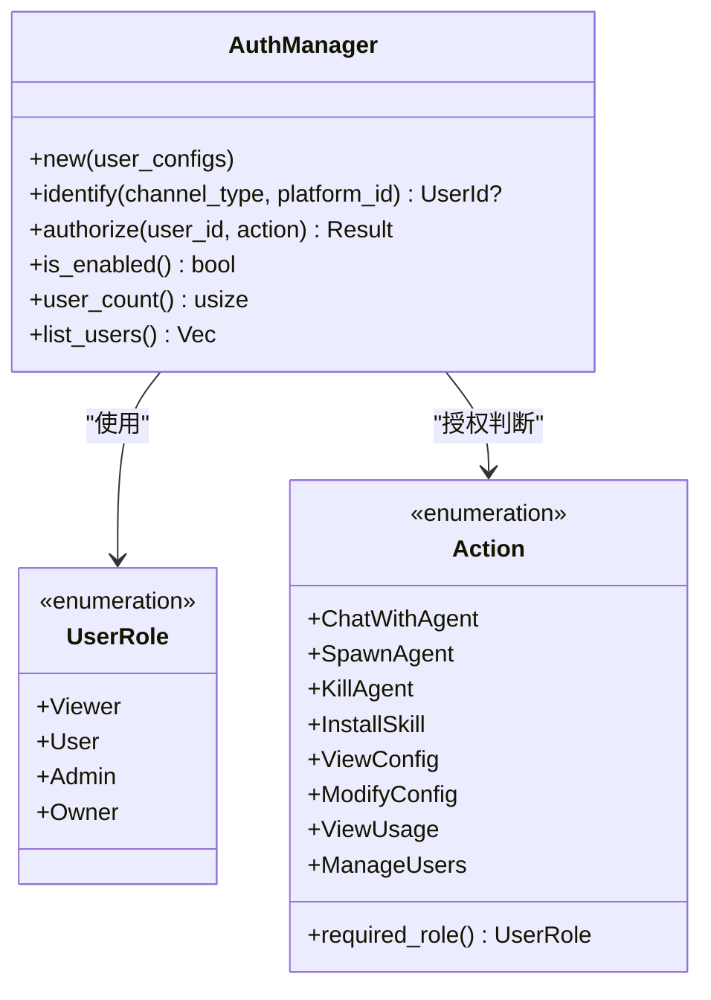
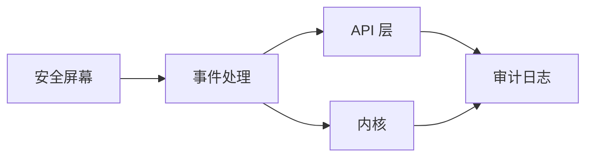

# 安全屏幕

<cite>
**本文引用的文件**
- [crates/openfang-cli/src/tui/screens/security.rs](file://crates/openfang-cli/src/tui/screens/security.rs)
- [crates/openfang-cli/src/tui/event.rs](file://crates/openfang-cli/src/tui/event.rs)
- [crates/openfang-cli/src/tui/mod.rs](file://crates/openfang-cli/src/tui/mod.rs)
- [crates/openfang-runtime/src/audit.rs](file://crates/openfang-runtime/src/audit.rs)
- [crates/openfang-api/src/middleware.rs](file://crates/openfang-api/src/middleware.rs)
- [crates/openfang-api/src/rate_limiter.rs](file://crates/openfang-api/src/rate_limiter.rs)
- [crates/openfang-kernel/src/auth.rs](file://crates/openfang-kernel/src/auth.rs)
- [SECURITY.md](file://SECURITY.md)
</cite>

## 目录
1. [简介](#简介)
2. [项目结构](#项目结构)
3. [核心组件](#核心组件)
4. [架构总览](#架构总览)
5. [详细组件分析](#详细组件分析)
6. [依赖关系分析](#依赖关系分析)
7. [性能考量](#性能考量)
8. [故障排查指南](#故障排查指南)
9. [结论](#结论)
10. [附录](#附录)

## 简介
本文件为 OpenFang TUI 安全屏幕的权威技术文档，聚焦于安全配置与监控功能的实现与使用。内容涵盖安全特性检查清单、证书与密钥管理、访问控制（RBAC）、安全审计（Merkle 哈希链）以及运行时防护机制（路径穿越防护、SSRF 防护、子进程隔离、WASM 双重计量、能力继承、秘密擦除、Taint 跟踪、OFP 互认证、速率限制、安全头等）。文档同时提供界面交互说明、操作流程、最佳实践、风险评估与安全加固建议，帮助运维与安全人员快速掌握并正确使用安全屏幕的各项能力。

## 项目结构
安全屏幕位于 TUI 的多标签页之一，通过事件驱动从后端拉取安全特性状态，并支持手动触发审计链验证。后端由内核与 API 提供安全能力与审计日志；审计日志采用 Merkle 哈希链实现不可篡改的审计轨迹。

图表来源
- [crates/openfang-cli/src/tui/screens/security.rs:1-327](file://crates/openfang-cli/src/tui/screens/security.rs#L1-L327)
- [crates/openfang-cli/src/tui/event.rs:1629-1703](file://crates/openfang-cli/src/tui/event.rs#L1629-L1703)
- [crates/openfang-api/src/middleware.rs:232-259](file://crates/openfang-api/src/middleware.rs#L232-L259)
- [crates/openfang-api/src/rate_limiter.rs:1-98](file://crates/openfang-api/src/rate_limiter.rs#L1-L98)
- [crates/openfang-runtime/src/audit.rs:1-423](file://crates/openfang-runtime/src/audit.rs#L1-L423)

章节来源
- [crates/openfang-cli/src/tui/mod.rs:42-84](file://crates/openfang-cli/src/tui/mod.rs#L42-L84)
- [crates/openfang-cli/src/tui/screens/security.rs:1-327](file://crates/openfang-cli/src/tui/screens/security.rs#L1-L327)

## 核心组件
- 安全屏幕状态与渲染：负责展示内置安全特性清单（核心、可配置、监控三类），滚动浏览、按键交互（上下翻页、验证审计链、刷新），以及验证结果提示。
- 事件处理：从后端获取安全特性列表与审计链验证结果，支持在守护态与进程内两种模式下进行验证。
- 审计日志：基于 Merkle 哈希链的不可篡改审计轨迹，支持完整性校验与最近条目查询。
- API 安全中间件：统一注入安全头、速率限制、互认证等。
- 内核安全能力：RBAC 多用户、能力继承防越权、子进程环境隔离、路径穿越与 SSRF 防护等。

章节来源
- [crates/openfang-cli/src/tui/screens/security.rs:13-194](file://crates/openfang-cli/src/tui/screens/security.rs#L13-L194)
- [crates/openfang-cli/src/tui/event.rs:1629-1703](file://crates/openfang-cli/src/tui/event.rs#L1629-L1703)
- [crates/openfang-runtime/src/audit.rs:81-301](file://crates/openfang-runtime/src/audit.rs#L81-L301)
- [crates/openfang-api/src/middleware.rs:232-259](file://crates/openfang-api/src/middleware.rs#L232-L259)
- [crates/openfang-kernel/src/auth.rs:13-84](file://crates/openfang-kernel/src/auth.rs#L13-L84)

## 架构总览
安全屏幕通过 TUI 事件线程向后端发起请求，后端返回安全特性与审计链验证结果，再由安全屏幕渲染到终端界面。审计链验证同时影响安全屏幕与审计页面的状态。

图表来源
- [crates/openfang-cli/src/tui/event.rs:1672-1703](file://crates/openfang-cli/src/tui/event.rs#L1672-L1703)
- [crates/openfang-runtime/src/audit.rs:241-274](file://crates/openfang-runtime/src/audit.rs#L241-L274)

章节来源
- [crates/openfang-cli/src/tui/event.rs:1672-1703](file://crates/openfang-cli/src/tui/event.rs#L1672-L1703)
- [crates/openfang-runtime/src/audit.rs:241-274](file://crates/openfang-runtime/src/audit.rs#L241-L274)

## 详细组件分析

### 安全特性清单与分类
安全特性分为三类：
- 核心安全：路径穿越防护、SSRF 防护、子进程隔离、WASM 双重计量、能力继承、秘密擦除、Ed25519 清单签名、Taint 跟踪。
- 可配置安全：OFP 互认证、RBAC 多用户、速率限制、安全头。
- 监控安全：Merkle 审计链、心跳监控、提示词注入扫描。

图表来源
- [crates/openfang-cli/src/tui/screens/security.rs:13-36](file://crates/openfang-cli/src/tui/screens/security.rs#L13-L36)

章节来源
- [crates/openfang-cli/src/tui/screens/security.rs:40-136](file://crates/openfang-cli/src/tui/screens/security.rs#L40-L136)

### 安全屏幕状态机与交互
- 状态字段：特性列表、审计链验证结果、滚动位置、加载状态、tick 计数。
- 交互按键：
  - 上/下/页键：滚动特性列表
  - v：验证审计链
  - r：刷新安全特性
  - Ctrl+C：退出当前屏幕
- 渲染逻辑：按分组标题分段显示特性，根据 active 状态显示不同徽标；验证区域根据 loading 与 chain_verified 状态显示不同提示与颜色。

图表来源
- [crates/openfang-cli/src/tui/screens/security.rs:140-194](file://crates/openfang-cli/src/tui/screens/security.rs#L140-L194)

章节来源
- [crates/openfang-cli/src/tui/screens/security.rs:140-327](file://crates/openfang-cli/src/tui/screens/security.rs#L140-L327)

### 审计日志与 Merkle 验证
- 数据模型：审计条目包含序列号、时间戳、主体代理、动作类型、详情、结果、前一哈希与当前哈希。
- 完整性校验：遍历链路，逐条重算哈希并与存储值比对，检测篡改或断链。
- Tip 指针：记录最新条目的哈希，便于后续追加与校验。
- 数据持久化：可选数据库持久化，重启后加载并再次校验。

图表来源
- [crates/openfang-runtime/src/audit.rs:39-301](file://crates/openfang-runtime/src/audit.rs#L39-L301)

章节来源
- [crates/openfang-runtime/src/audit.rs:39-301](file://crates/openfang-runtime/src/audit.rs#L39-L301)

### API 安全中间件与速率限制
- 安全头：统一注入 X-Content-Type-Options、X-Frame-Options、X-XSS-Protection、CSP、Referrer-Policy、Cache-Control、Strict-Transport-Security。
- 速率限制：基于 GCRA（通用单元速率算法），按路径与方法分配令牌成本，每分钟配额 500。
- 互认证：OFP 线协议采用 HMAC-SHA256 互认证与随机数，防止重放。

图表来源
- [crates/openfang-api/src/middleware.rs:232-259](file://crates/openfang-api/src/middleware.rs#L232-L259)
- [crates/openfang-api/src/rate_limiter.rs:14-79](file://crates/openfang-api/src/rate_limiter.rs#L14-L79)

章节来源
- [crates/openfang-api/src/middleware.rs:232-259](file://crates/openfang-api/src/middleware.rs#L232-L259)
- [crates/openfang-api/src/rate_limiter.rs:1-98](file://crates/openfang-api/src/rate_limiter.rs#L1-L98)

### 内核安全能力（RBAC、能力继承、子进程隔离等）
- RBAC 多用户：角色分级（Viewer/User/Admin/Owner），按动作最小权限授权。
- 能力继承：子代理能力必须为父代理能力的子集，防止越权。
- 子进程隔离：清理环境变量，仅传递白名单变量，避免敏感信息泄露。
- 输入与网络安全：路径解析安全函数、SSRF 私网与元数据站点阻断、DNS 解析校验。
- 密码学：Ed25519 清单签名、HMAC-SHA256 互认证、秘密自动擦除、常量时间比较。

图表来源
- [crates/openfang-kernel/src/auth.rs:13-84](file://crates/openfang-kernel/src/auth.rs#L13-L84)
- [crates/openfang-kernel/src/auth.rs:98-189](file://crates/openfang-kernel/src/auth.rs#L98-L189)

章节来源
- [crates/openfang-kernel/src/auth.rs:13-189](file://crates/openfang-kernel/src/auth.rs#L13-L189)

## 依赖关系分析
- TUI 安全屏幕依赖事件模块发起“获取安全特性”和“验证审计链”两类请求。
- 事件模块在守护态模式下调用后端 API，在进程内模式下直接返回适用结果。
- 审计日志由内核与 API 共同使用，API 在响应中注入安全头，内核执行能力与输入校验。

图表来源
- [crates/openfang-cli/src/tui/event.rs:1629-1703](file://crates/openfang-cli/src/tui/event.rs#L1629-L1703)
- [crates/openfang-runtime/src/audit.rs:81-301](file://crates/openfang-runtime/src/audit.rs#L81-L301)

章节来源
- [crates/openfang-cli/src/tui/event.rs:1629-1703](file://crates/openfang-cli/src/tui/event.rs#L1629-L1703)
- [crates/openfang-runtime/src/audit.rs:81-301](file://crates/openfang-runtime/src/audit.rs#L81-L301)

## 性能考量
- 审计链验证：Merkle 校验为 O(n) 时间复杂度，n 为条目数量；建议定期裁剪历史条目以控制规模。
- 速率限制：GCRA 使用键控状态存储，内存占用与并发客户端数量相关；可根据部署规模调整配额。
- TUI 渲染：特性列表渲染为线性扫描，滚动优化通过局部重绘；建议保持特性数量稳定，避免频繁刷新导致抖动。

## 故障排查指南
- 审计链验证失败
  - 现象：界面提示验证失败并显示错误消息。
  - 排查：确认后端是否启用数据库持久化；检查是否存在篡改或断链；查看最近审计条目。
  - 参考：审计日志完整性校验与 tip 指针更新逻辑。
- 审计链验证无结果
  - 现象：界面显示加载动画但无结果。
  - 排查：检查后端可达性与网络策略；确认 API 路径 /api/audit/verify 是否可用。
- 安全特性列表为空
  - 现象：安全屏幕未显示任何特性。
  - 排查：确认事件线程已发送获取安全特性请求；检查后端返回格式与字段映射。
- 速率限制 429
  - 现象：请求被拒绝并提示配额耗尽。
  - 排查：降低请求频率或提升配额；检查路径成本与客户端 IP 归属。

章节来源
- [crates/openfang-runtime/src/audit.rs:241-274](file://crates/openfang-runtime/src/audit.rs#L241-L274)
- [crates/openfang-api/src/rate_limiter.rs:51-79](file://crates/openfang-api/src/rate_limiter.rs#L51-L79)
- [crates/openfang-cli/src/tui/event.rs:1629-1703](file://crates/openfang-cli/src/tui/event.rs#L1629-L1703)

## 结论
安全屏幕提供了对 OpenFang 安全能力的集中可视化与即时验证入口。结合 Merkle 审计链、API 安全中间件、内核级防护与 RBAC 控制，系统实现了从输入校验、能力继承、子进程隔离到网络与传输层的安全纵深。建议在生产环境中启用数据库持久化审计、严格配置安全头与速率限制、定期验证审计链完整性，并遵循最小权限原则与零信任实践。

## 附录

### 安全特性检查项与验证机制对照
- 路径穿越防护：使用安全解析函数，禁止 ../ 等攻击路径。
- SSRF 防护：阻断私网与元数据站点，DNS 解析校验。
- 子进程隔离：清理环境变量，仅传递白名单变量。
- WASM 双重计量：燃料限制 + 时钟中断 + 守望线程。
- 能力继承：子代理能力必须为父代理能力子集。
- 秘密擦除：内存中的敏感信息在生命周期结束时自动清零。
- Ed25519 清单签名：代理清单使用 Ed25519 签名与验证。
- Taint 跟踪：跨工具边界的敏感数据流标记与约束。
- OFP 互认证：HMAC-SHA256 互认证与随机数，常量时间比较。
- RBAC 多用户：角色分级与动作授权。
- 速率限制：GCRA 成本感知令牌桶。
- 安全头：CSP、X-Frame-Options、HSTS 等。

章节来源
- [crates/openfang-cli/src/tui/screens/security.rs:40-136](file://crates/openfang-cli/src/tui/screens/security.rs#L40-L136)
- [crates/openfang-api/src/middleware.rs:232-259](file://crates/openfang-api/src/middleware.rs#L232-L259)
- [crates/openfang-api/src/rate_limiter.rs:1-98](file://crates/openfang-api/src/rate_limiter.rs#L1-L98)
- [crates/openfang-kernel/src/auth.rs:13-84](file://crates/openfang-kernel/src/auth.rs#L13-L84)

### 最佳实践与风险加固建议
- 启用数据库持久化审计日志，确保链路完整性和可追溯性。
- 严格配置安全头，最小化浏览器与网络暴露面。
- 合理设置速率限制配额，区分健康检查与业务操作的成本。
- 使用 RBAC 明确角色边界，定期审计用户与权限。
- 对外部依赖与第三方集成实施最小权限与凭据轮换策略。
- 定期演练审计链验证流程，建立异常告警与处置机制。

章节来源
- [SECURITY.md:46-95](file://SECURITY.md#L46-L95)