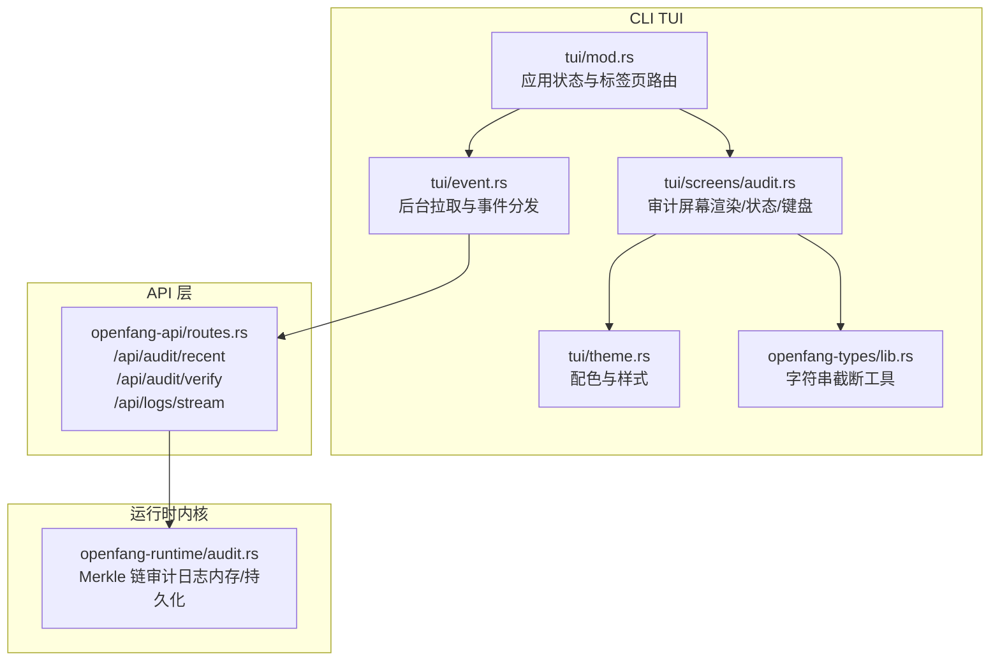
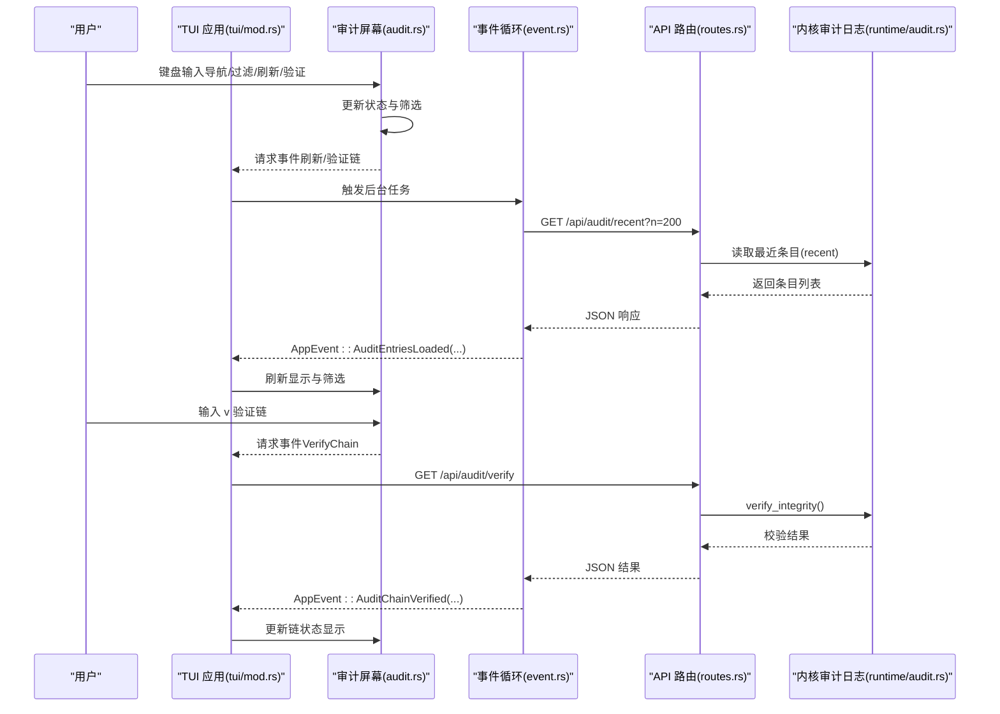
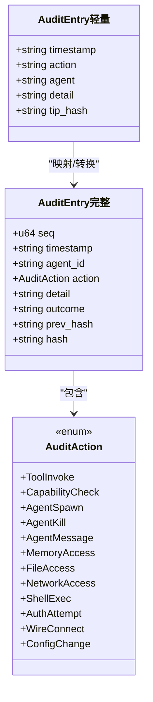
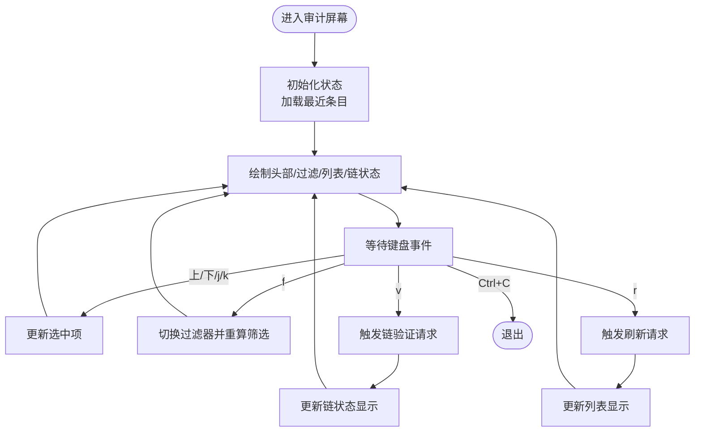
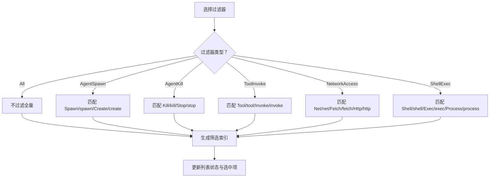
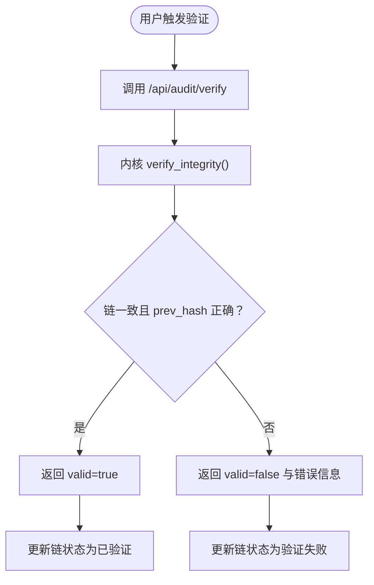
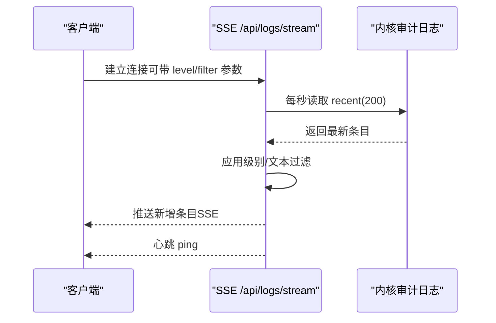
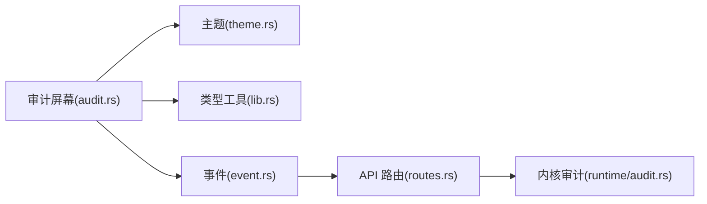

# 审计屏幕

<cite>
**本文引用的文件**
- [audit.rs](file://crates/openfang-cli/src/tui/screens/audit.rs)
- [mod.rs](file://crates/openfang-cli/src/tui/mod.rs)
- [event.rs](file://crates/openfang-cli/src/tui/event.rs)
- [audit.rs](file://crates/openfang-runtime/src/audit.rs)
- [routes.rs](file://crates/openfang-api/src/routes.rs)
- [lib.rs](file://crates/openfang-types/src/lib.rs)
- [theme.rs](file://crates/openfang-cli/src/tui/theme.rs)
- [SKILL.md](file://crates/openfang-skills/bundled/compliance/SKILL.md)
</cite>

## 目录
1. [简介](#简介)
2. [项目结构](#项目结构)
3. [核心组件](#核心组件)
4. [架构总览](#架构总览)
5. [详细组件分析](#详细组件分析)
6. [依赖关系分析](#依赖关系分析)
7. [性能考量](#性能考量)
8. [故障排查指南](#故障排查指南)
9. [结论](#结论)
10. [附录](#附录)

## 简介
本文件面向 OpenFang TUI 的“审计屏幕”，系统化阐述审计日志管理功能与实现：包括审计记录查看、过滤、链式完整性验证、以及与后端 API 的交互流程。文档同时说明审计日志的数据模型、字段、级别分类、时间范围、以及在 TUI 中的界面布局与交互方式，并给出审计分析、合规检查与安全监控的实践建议。

## 项目结构
审计屏幕位于 CLI TUI 的 screens 子模块中，通过事件循环从后端 API 拉取审计数据并渲染。后端 API 提供审计日志的最近条目查询、链式完整性校验与实时流推送；运行时内核维护基于 Merkle 链的不可篡改审计日志，并可持久化到数据库。

**图表来源**
- [mod.rs:14-84](file://crates/openfang-cli/src/tui/mod.rs#L14-L84)
- [audit.rs:1-350](file://crates/openfang-cli/src/tui/screens/audit.rs#L1-L350)
- [event.rs:2066-2107](file://crates/openfang-cli/src/tui/event.rs#L2066-L2107)
- [routes.rs:4874-4937](file://crates/openfang-api/src/routes.rs#L4874-L4937)
- [audit.rs:81-301](file://crates/openfang-runtime/src/audit.rs#L81-L301)

**章节来源**
- [mod.rs:14-84](file://crates/openfang-cli/src/tui/mod.rs#L14-L84)
- [audit.rs:1-350](file://crates/openfang-cli/src/tui/screens/audit.rs#L1-L350)
- [event.rs:2066-2107](file://crates/openfang-cli/src/tui/event.rs#L2066-L2107)
- [routes.rs:4874-4937](file://crates/openfang-api/src/routes.rs#L4874-L4937)
- [audit.rs:81-301](file://crates/openfang-runtime/src/audit.rs#L81-L301)

## 核心组件
- 审计屏幕状态与渲染：负责展示审计条目、过滤器、链式状态提示与用户交互（上下移动、切换过滤、刷新、验证链）。
- 审计数据模型：TUI 使用轻量结构体承载条目字段；运行时内核使用更完整的审计条目结构与 Merkle 链。
- 后端 API：提供最近审计条目查询、链完整性验证、以及基于 SSE 的实时审计流。
- 事件与状态：TUI 通过后台线程定期轮询后端，将结果注入应用事件，驱动审计屏幕刷新与链验证结果回显。

**章节来源**
- [audit.rs:13-191](file://crates/openfang-cli/src/tui/screens/audit.rs#L13-L191)
- [audit.rs:39-58](file://crates/openfang-runtime/src/audit.rs#L39-L58)
- [routes.rs:4874-4937](file://crates/openfang-api/src/routes.rs#L4874-L4937)
- [mod.rs:155-177](file://crates/openfang-cli/src/tui/mod.rs#L155-L177)

## 架构总览
审计屏幕的请求-响应-渲染流程如下：

**图表来源**
- [mod.rs:226-610](file://crates/openfang-cli/src/tui/mod.rs#L226-L610)
- [audit.rs:160-191](file://crates/openfang-cli/src/tui/screens/audit.rs#L160-L191)
- [event.rs:2066-2107](file://crates/openfang-cli/src/tui/event.rs#L2066-L2107)
- [routes.rs:4874-4937](file://crates/openfang-api/src/routes.rs#L4874-L4937)
- [audit.rs:295-301](file://crates/openfang-runtime/src/audit.rs#L295-L301)

## 详细组件分析

### 数据模型与字段
- TUI 审计条目（轻量结构）：
  - 字段：时间戳、动作、代理标识、详情、Tip Hash
  - 用途：用于 TUI 列表渲染与筛选
- 运行时审计条目（完整结构）：
  - 字段：序列号、ISO 时间戳、代理 ID、动作类别、详情、结果、前一哈希、当前哈希
  - 用途：构建 Merkle 链、持久化、完整性校验
- 动作类别枚举：工具调用、能力检查、代理创建/终止、消息、内存/文件访问、网络访问、Shell 执行、认证尝试、网络连接、配置变更等

**图表来源**
- [audit.rs:13-20](file://crates/openfang-cli/src/tui/screens/audit.rs#L13-L20)
- [audit.rs:39-58](file://crates/openfang-runtime/src/audit.rs#L39-L58)
- [audit.rs:16-31](file://crates/openfang-runtime/src/audit.rs#L16-L31)

**章节来源**
- [audit.rs:13-20](file://crates/openfang-cli/src/tui/screens/audit.rs#L13-L20)
- [audit.rs:39-58](file://crates/openfang-runtime/src/audit.rs#L39-L58)
- [audit.rs:16-31](file://crates/openfang-runtime/src/audit.rs#L16-L31)

### 界面与交互
- 布局：标题栏、过滤区、日志列表、链状态与提示区
- 过滤器：全部、代理创建、代理终止、工具使用、网络访问、Shell 执行
- 键盘快捷键：
  - 上/下或 j/k 导航
  - f 切换过滤器
  - v 触发链验证
  - r 刷新
  - Ctrl+C 退出
- 渲染要点：
  - 行高亮与选中态
  - 动作按语义着色（如终止/拒绝为红色，创建为绿色，工具为蓝色等）
  - Tip Hash 截断显示
  - 加载态与空结果提示

**图表来源**
- [audit.rs:160-191](file://crates/openfang-cli/src/tui/screens/audit.rs#L160-L191)
- [audit.rs:195-338](file://crates/openfang-cli/src/tui/screens/audit.rs#L195-L338)

**章节来源**
- [audit.rs:195-338](file://crates/openfang-cli/src/tui/screens/audit.rs#L195-L338)
- [theme.rs:41-59](file://crates/openfang-cli/src/tui/theme.rs#L41-L59)

### 过滤与筛选逻辑
- 过滤器枚举与匹配规则：根据动作关键字进行模糊匹配（大小写不敏感），支持“全部”“代理创建/终止”“工具使用”“网络访问”“Shell 执行”
- 筛选过程：对已加载条目进行预筛选，生成索引列表，更新选中项
- 友好动作名：将内部动作名映射为用户可读名称（如 AgentSpawn → Agent Created）

**图表来源**
- [audit.rs:22-92](file://crates/openfang-cli/src/tui/screens/audit.rs#L22-L92)
- [audit.rs:145-158](file://crates/openfang-cli/src/tui/screens/audit.rs#L145-L158)

**章节来源**
- [audit.rs:22-92](file://crates/openfang-cli/src/tui/screens/audit.rs#L22-L92)
- [audit.rs:145-158](file://crates/openfang-cli/src/tui/screens/audit.rs#L145-L158)

### 链式完整性验证
- 运行时内核维护 Merkle 链，每个条目包含自身内容哈希与前一哈希，形成不可篡改链
- 验证流程：顺序校验 prev_hash 与递推计算哈希一致性
- API 提供独立的验证端点，返回是否有效、条目总数、Tip Hash 或错误信息
- TUI 在用户触发后发起验证请求，接收结果并在界面提示

**图表来源**
- [routes.rs:4910-4937](file://crates/openfang-api/src/routes.rs#L4910-L4937)
- [audit.rs:237-274](file://crates/openfang-runtime/src/audit.rs#L237-L274)

**章节来源**
- [routes.rs:4910-4937](file://crates/openfang-api/src/routes.rs#L4910-L4937)
- [audit.rs:237-274](file://crates/openfang-runtime/src/audit.rs#L237-L274)

### 实时流与级别分类
- SSE 端点：/api/logs/stream 每秒轮询内核审计日志，仅推送新增条目，并支持按“级别”和“文本”过滤
- 级别分类：根据动作字符串包含的关键字（error/warn 等）归类为 info/warn/error
- TUI 当前主要使用轮询获取最近条目，但 SSE 机制可用于前端页面的实时监控

**图表来源**
- [routes.rs:4939-5046](file://crates/openfang-api/src/routes.rs#L4939-L5046)
- [audit.rs:295-301](file://crates/openfang-runtime/src/audit.rs#L295-L301)

**章节来源**
- [routes.rs:4939-5046](file://crates/openfang-api/src/routes.rs#L4939-L5046)
- [audit.rs:295-301](file://crates/openfang-runtime/src/audit.rs#L295-L301)

### 查询、排序与筛选
- 查询：TUI 通过后台线程轮询 /api/audit/recent?n=200 获取最近条目
- 排序：后端返回按序列号升序的最近 N 条
- 筛选：TUI 在本地按动作关键字进行布尔匹配筛选
- 批量导出：当前 TUI 未提供直接导出功能；可通过 SSE 订阅流或后端接口自行实现导出

**章节来源**
- [event.rs:2066-2107](file://crates/openfang-cli/src/tui/event.rs#L2066-L2107)
- [routes.rs:4874-4908](file://crates/openfang-api/src/routes.rs#L4874-L4908)
- [audit.rs:295-301](file://crates/openfang-runtime/src/audit.rs#L295-L301)

## 依赖关系分析
- 组件耦合：
  - 审计屏幕依赖主题模块进行样式渲染
  - 审计屏幕依赖类型库的字符串截断工具以保证列宽与字符边界安全
  - 事件模块负责与 API 层交互，解耦 UI 与网络层
  - API 路由依赖运行时内核的审计日志实现
- 外部依赖：
  - 后端提供 REST 与 SSE 接口
  - 内核使用 SHA-256 与 SQLite（可选）进行链式哈希与持久化

**图表来源**
- [audit.rs:1-350](file://crates/openfang-cli/src/tui/screens/audit.rs#L1-L350)
- [theme.rs:1-140](file://crates/openfang-cli/src/tui/theme.rs#L1-L140)
- [lib.rs:25-35](file://crates/openfang-types/src/lib.rs#L25-L35)
- [event.rs:2066-2107](file://crates/openfang-cli/src/tui/event.rs#L2066-L2107)
- [routes.rs:4874-4937](file://crates/openfang-api/src/routes.rs#L4874-L4937)
- [audit.rs:81-301](file://crates/openfang-runtime/src/audit.rs#L81-L301)

**章节来源**
- [audit.rs:1-350](file://crates/openfang-cli/src/tui/screens/audit.rs#L1-L350)
- [theme.rs:1-140](file://crates/openfang-cli/src/tui/theme.rs#L1-L140)
- [lib.rs:25-35](file://crates/openfang-types/src/lib.rs#L25-L35)
- [event.rs:2066-2107](file://crates/openfang-cli/src/tui/event.rs#L2066-L2107)
- [routes.rs:4874-4937](file://crates/openfang-api/src/routes.rs#L4874-L4937)
- [audit.rs:81-301](file://crates/openfang-runtime/src/audit.rs#L81-L301)

## 性能考量
- 轮询频率：TUI 默认每秒轮询最近 200 条，避免一次性传输大量数据
- 本地筛选：在 UI 端进行动作关键字筛选，降低后端压力
- 列宽控制：使用安全截断函数避免 UTF-8 字符边界破坏
- 链验证成本：完整性校验在内核侧进行，TUI 仅触发请求，避免在终端渲染路径中执行重计算

[本节为通用指导，无需特定文件引用]

## 故障排查指南
- 无审计条目显示：
  - 检查后端是否正常返回条目
  - 确认过滤器是否过于严格导致为空
- 链验证失败：
  - 查看 API 返回的错误信息，定位具体序列号与哈希不一致问题
  - 检查是否存在外部修改或数据库异常
- SSE 无法接收新条目：
  - 确认客户端参数（level/filter/token）是否正确
  - 检查心跳与连接状态

**章节来源**
- [routes.rs:4910-4937](file://crates/openfang-api/src/routes.rs#L4910-L4937)
- [routes.rs:4939-5046](file://crates/openfang-api/src/routes.rs#L4939-L5046)

## 结论
OpenFang TUI 的审计屏幕提供了直观的审计日志浏览体验，结合后端 API 的链式完整性验证与实时流能力，能够满足日常审计查看、快速筛选与安全基线核查需求。对于批量导出与更复杂的分析场景，可在现有 SSE/REST 能力基础上扩展实现。

[本节为总结性内容，无需特定文件引用]

## 附录

### 审计日志字段与级别参考
- 字段说明（运行时完整结构）：
  - seq：序列号（递增）
  - timestamp：ISO 时间戳
  - agent_id：触发动作的代理标识
  - action：动作类别枚举
  - detail：动作详情（如工具名、文件路径等）
  - outcome：结果（如 ok/denied/错误信息）
  - prev_hash：前一节点哈希
  - hash：当前节点内容哈希
- 级别分类（SSE 端点）：
  - info：默认
  - warn：包含 kill/block 等关键词
  - error：包含 error/fail/crash/denied 等关键词

**章节来源**
- [audit.rs:39-58](file://crates/openfang-runtime/src/audit.rs#L39-L58)
- [routes.rs:5036-5046](file://crates/openfang-api/src/routes.rs#L5036-L5046)

### 审计分析与合规建议
- 建议采用自动化审计轨迹导出，定期归档至不可篡改存储
- 将审计日志纳入 SIEM/日志平台，设置告警规则（异常动作、失败登录、配置变更）
- 结合合规技能提供的方法论，建立证据收集流水线、访问评审与供应商风险评估机制

**章节来源**
- [SKILL.md:1-39](file://crates/openfang-skills/bundled/compliance/SKILL.md#L1-L39)