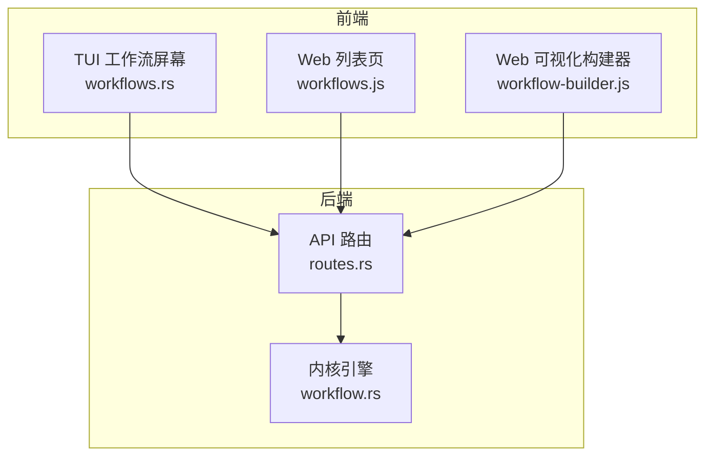
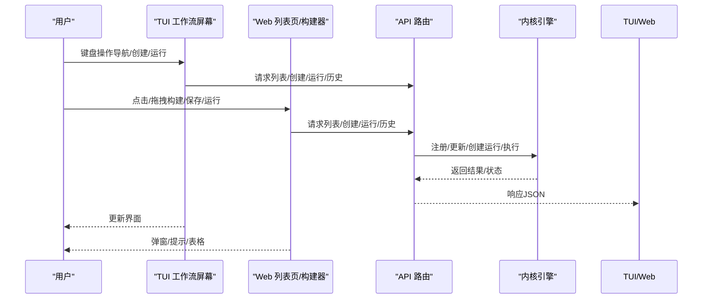
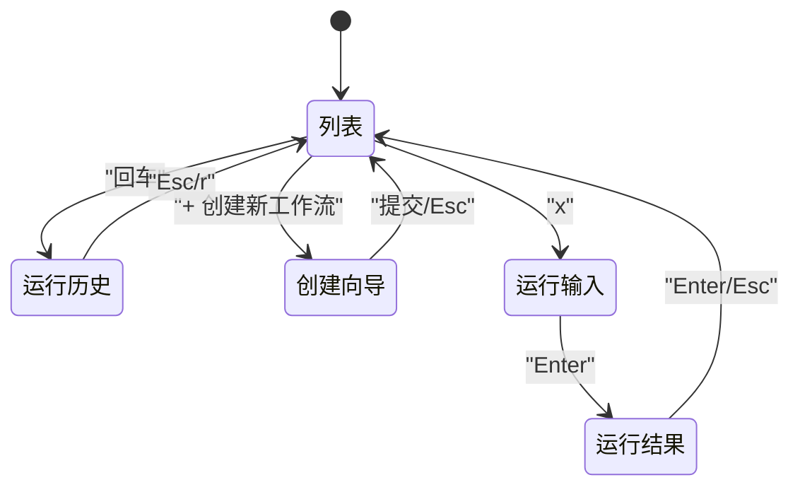
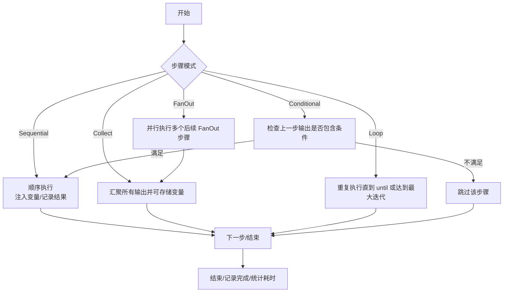
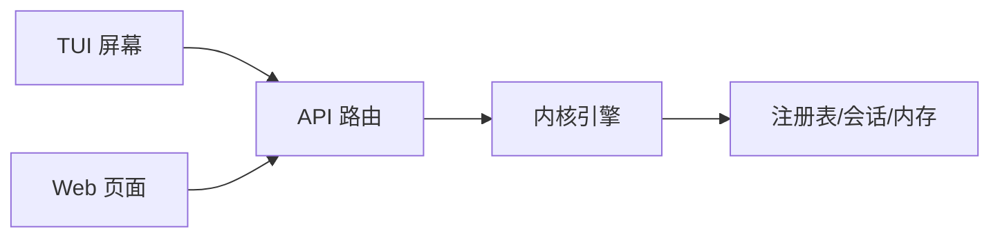

# 工作流屏幕

<cite>
**本文引用的文件**
- [crates/openfang-cli/src/tui/screens/workflows.rs](file://crates/openfang-cli/src/tui/screens/workflows.rs)
- [crates/openfang-api/src/routes.rs](file://crates/openfang-api/src/routes.rs)
- [crates/openfang-api/static/js/pages/workflows.js](file://crates/openfang-api/static/js/pages/workflows.js)
- [crates/openfang-api/static/js/pages/workflow-builder.js](file://crates/openfang-api/static/js/pages/workflow-builder.js)
- [crates/openfang-kernel/src/workflow.rs](file://crates/openfang-kernel/src/workflow.rs)
- [crates/openfang-kernel/tests/workflow_integration_test.rs](file://crates/openfang-kernel/tests/workflow_integration_test.rs)
- [crates/openfang-cli/src/main.rs](file://crates/openfang-cli/src/main.rs)
</cite>

## 目录
1. [简介](#简介)
2. [项目结构](#项目结构)
3. [核心组件](#核心组件)
4. [架构总览](#架构总览)
5. [详细组件分析](#详细组件分析)
6. [依赖关系分析](#依赖关系分析)
7. [性能考量](#性能考量)
8. [故障排查指南](#故障排查指南)
9. [结论](#结论)
10. [附录](#附录)

## 简介
本文件系统化阐述 OpenFang 的“工作流屏幕”能力，覆盖 TUI（终端用户界面）与 Web 前端两套交互形态，围绕工作流的全生命周期管理：列表展示、创建、编辑、运行、查看执行历史；并深入解析工作流的可视化编辑器、节点连接、条件与循环设置、错误处理策略、超时控制等关键机制。同时给出数据持久化、导入导出、最佳实践、调试技巧与性能优化建议，帮助开发者与运维人员高效构建与维护多智能体协作流水线。

## 项目结构
工作流相关能力由以下模块协同实现：
- TUI 屏幕：提供工作流列表、运行历史、创建向导、运行输入与结果展示的键盘驱动界面。
- Web 前端：提供工作流列表页与可视化构建器，支持拖拽式节点编排、生成步骤 JSON、保存到后端。
- 后端 API：提供工作流的增删改查、运行、历史查询等 REST 接口。
- 内核引擎：负责工作流定义注册、运行实例创建、步骤执行、变量注入、错误模式处理、并行/条件/循环等执行语义。

图表来源
- [crates/openfang-cli/src/tui/screens/workflows.rs:1-706](file://crates/openfang-cli/src/tui/screens/workflows.rs#L1-L706)
- [crates/openfang-api/static/js/pages/workflows.js:1-133](file://crates/openfang-api/static/js/pages/workflows.js#L1-L133)
- [crates/openfang-api/static/js/pages/workflow-builder.js:1-635](file://crates/openfang-api/static/js/pages/workflow-builder.js#L1-L635)
- [crates/openfang-api/src/routes.rs:767-1114](file://crates/openfang-api/src/routes.rs#L767-L1114)
- [crates/openfang-kernel/src/workflow.rs:200-798](file://crates/openfang-kernel/src/workflow.rs#L200-L798)

章节来源
- [crates/openfang-cli/src/tui/screens/workflows.rs:1-706](file://crates/openfang-cli/src/tui/screens/workflows.rs#L1-L706)
- [crates/openfang-api/static/js/pages/workflows.js:1-133](file://crates/openfang-api/static/js/pages/workflows.js#L1-L133)
- [crates/openfang-api/static/js/pages/workflow-builder.js:1-635](file://crates/openfang-api/static/js/pages/workflow-builder.js#L1-L635)
- [crates/openfang-api/src/routes.rs:767-1114](file://crates/openfang-api/src/routes.rs#L767-L1114)
- [crates/openfang-kernel/src/workflow.rs:200-798](file://crates/openfang-kernel/src/workflow.rs#L200-L798)

## 核心组件
- TUI 工作流状态机与渲染
  - 状态枚举：列表、运行历史、创建向导、运行输入、运行结果。
  - 行为动作：刷新、加载运行历史、创建工作流、运行工作流。
  - 渲染：表格化列表、分步创建表单、运行输入框、运行结果展示。
- Web 列表页
  - 加载、创建、编辑、删除、执行、查看运行历史。
- Web 可视化构建器
  - 节点类型：开始/结束、Agent 步骤、并行分支、条件判断、循环、收集。
  - 连接管理：起点/终点端口、连线路径、预览、删除。
  - 输出：生成 TOML/JSON 步骤描述，提交后端保存。
- 后端 API
  - 工作流：创建、列表、获取、更新、删除。
  - 运行：创建运行实例、执行、列出运行历史。
- 内核引擎
  - 定义注册、运行实例管理、步骤执行、变量注入、错误模式、并行/条件/循环/收集。

章节来源
- [crates/openfang-cli/src/tui/screens/workflows.rs:31-74](file://crates/openfang-cli/src/tui/screens/workflows.rs#L31-L74)
- [crates/openfang-api/static/js/pages/workflows.js:4-132](file://crates/openfang-api/static/js/pages/workflows.js#L4-L132)
- [crates/openfang-api/static/js/pages/workflow-builder.js:4-634](file://crates/openfang-api/static/js/pages/workflow-builder.js#L4-L634)
- [crates/openfang-api/src/routes.rs:771-1114](file://crates/openfang-api/src/routes.rs#L771-L1114)
- [crates/openfang-kernel/src/workflow.rs:200-798](file://crates/openfang-kernel/src/workflow.rs#L200-L798)

## 架构总览
下图展示了从用户操作到内核执行的端到端流程，涵盖 TUI 与 Web 两种入口。

图表来源
- [crates/openfang-cli/src/tui/screens/workflows.rs:101-276](file://crates/openfang-cli/src/tui/screens/workflows.rs#L101-L276)
- [crates/openfang-api/static/js/pages/workflows.js:20-130](file://crates/openfang-api/static/js/pages/workflows.js#L20-L130)
- [crates/openfang-api/static/js/pages/workflow-builder.js:543-571](file://crates/openfang-api/static/js/pages/workflow-builder.js#L543-L571)
- [crates/openfang-api/src/routes.rs:771-948](file://crates/openfang-api/src/routes.rs#L771-L948)
- [crates/openfang-kernel/src/workflow.rs:217-314](file://crates/openfang-kernel/src/workflow.rs#L217-L314)

## 详细组件分析

### TUI 工作流屏幕
- 状态与子屏
  - 子屏：列表、运行历史、创建向导、运行输入、运行结果。
  - 创建向导四步：名称、描述、步骤 JSON、复核。
- 键盘交互
  - 列表：上下导航、回车进入运行历史、x 执行、r 刷新。
  - 运行历史：上下导航、Esc 返回、r 刷新。
  - 创建向导：Enter 下一步/提交、Esc 上一步/取消、字符输入、退格。
  - 运行输入：Enter 提交、Esc 取消、输入文本。
  - 运行结果：Enter/Esc 返回。
- 渲染要点
  - 列表采用表格风格，含 ID、名称、步骤数、创建时间。
  - 运行历史含运行 ID、状态徽章、耗时、输出预览。
  - 创建向导带步骤指示与占位符提示。
  - 运行结果支持加载动画与完成态展示。

图表来源
- [crates/openfang-cli/src/tui/screens/workflows.rs:114-276](file://crates/openfang-cli/src/tui/screens/workflows.rs#L114-L276)

章节来源
- [crates/openfang-cli/src/tui/screens/workflows.rs:31-301](file://crates/openfang-cli/src/tui/screens/workflows.rs#L31-L301)

### Web 工作流列表页
- 功能
  - 加载工作流列表、创建、编辑、删除、执行、查看运行历史。
  - 通过 OpenFangAPI 调用后端接口。
- 数据模型
  - 新建/编辑使用 steps 数组，每项包含 name、agent_name、mode、prompt。
- 交互
  - 执行时弹出输入框，提交后显示输出或错误信息。

章节来源
- [crates/openfang-api/static/js/pages/workflows.js:4-132](file://crates/openfang-api/static/js/pages/workflows.js#L4-L132)

### Web 可视化构建器
- 节点类型与端口
  - 开始/结束、Agent 步骤、并行分支、条件判断、循环、收集。
- 连接管理
  - 端口拖拽建立连接，支持预览、删除、自动布局。
- 输出与保存
  - 生成 TOML/JSON 步骤描述，提交后端保存为工作流定义。

章节来源
- [crates/openfang-api/static/js/pages/workflow-builder.js:4-634](file://crates/openfang-api/static/js/pages/workflow-builder.js#L4-L634)

### 后端 API（工作流）
- 路由
  - 创建：POST /api/workflows
  - 列表：GET /api/workflows
  - 获取：GET /api/workflows/:id
  - 更新：PUT /api/workflows/:id
  - 删除：DELETE /api/workflows/:id
  - 运行：POST /api/workflows/:id/run
  - 运行历史：GET /api/workflows/:id/runs
- 数据持久化
  - 创建成功后写入磁盘目录（默认 workflows_dir 或 home_dir/workflows），文件名以工作流 ID 命名。

章节来源
- [crates/openfang-api/src/routes.rs:771-1114](file://crates/openfang-api/src/routes.rs#L771-L1114)

### 内核引擎（工作流）
- 数据结构
  - Workflow/WorkflowStep/WorkflowRun/StepResult
  - StepMode：Sequential/FanOut/Collect/Conditional/Loop
  - ErrorMode：Fail/Skip/Retry
- 执行语义
  - 变量注入：{{input}}、{{var_name}}
  - 并行：连续 FanOut 步骤并行执行，随后 Collect 汇聚。
  - 条件：根据上一步输出是否包含指定字符串决定跳过或继续。
  - 循环：按最大迭代次数与 until 条件终止。
  - 错误模式：Fail 直接失败、Skip 跳过、Retry 重试若干次。
- 运行管理
  - create_run：创建运行实例并限制历史运行数量（保留最近完成/失败的运行）。
  - execute_run：按步骤顺序执行，记录 step_results、token 使用、耗时与最终输出。

图表来源
- [crates/openfang-kernel/src/workflow.rs:430-798](file://crates/openfang-kernel/src/workflow.rs#L430-L798)

章节来源
- [crates/openfang-kernel/src/workflow.rs:67-198](file://crates/openfang-kernel/src/workflow.rs#L67-L198)
- [crates/openfang-kernel/src/workflow.rs:200-798](file://crates/openfang-kernel/src/workflow.rs#L200-L798)

### CLI 工作流命令
- 子命令
  - list、create、get、update、delete、run
- 用途
  - 在无守护进程时直接启动内核进行一次性操作；在守护进程运行时通过 HTTP 与后端通信。

章节来源
- [crates/openfang-cli/src/main.rs:496-529](file://crates/openfang-cli/src/main.rs#L496-L529)

## 依赖关系分析
- 组件耦合
  - TUI 与 Web 前端均依赖后端 API；API 依赖内核引擎；内核引擎独立于 UI。
- 关键依赖链
  - TUI/WEB → API → 内核引擎 → 注册表/内存/会话
- 外部依赖
  - HTTP 客户端（Axum）、JSON/TOML 序列化、异步运行时（Tokio）

图表来源
- [crates/openfang-cli/src/tui/screens/workflows.rs:1-10](file://crates/openfang-cli/src/tui/screens/workflows.rs#L1-L10)
- [crates/openfang-api/src/routes.rs:21-43](file://crates/openfang-api/src/routes.rs#L21-L43)
- [crates/openfang-kernel/src/workflow.rs:200-206](file://crates/openfang-kernel/src/workflow.rs#L200-L206)

章节来源
- [crates/openfang-api/src/routes.rs:21-43](file://crates/openfang-api/src/routes.rs#L21-L43)
- [crates/openfang-kernel/src/workflow.rs:200-206](file://crates/openfang-kernel/src/workflow.rs#L200-L206)

## 性能考量
- 并行执行
  - FanOut 模式下并发调用多个 Agent，注意合理设置超时与资源配额，避免阻塞。
- 变量注入与模板展开
  - 长输出注入可能增加 prompt 长度，建议在 Collect 后再拼接，或对大文本做截断/摘要。
- 历史运行清理
  - 内核限制最大保留运行数，避免内存膨胀；建议结合外部归档策略。
- 超时与重试
  - 为易波动的步骤设置合理 timeout_secs 与 ErrorMode::Retry，平衡稳定性与吞吐。
- 前端渲染
  - Web 构建器采用手动 SVG 渲染，避免频繁重排；连接路径计算采用贝塞尔曲线，保持视觉一致性。

## 故障排查指南
- 常见问题
  - Agent 未找到：StepAgent::ByName 解析不到匹配名称，或 ById 对应的 Agent 不存在。
  - 步骤超时：检查 timeout_secs 设置与网络延迟。
  - 条件不满足导致跳过：确认上一步输出包含预期关键词（大小写不敏感）。
  - 循环未终止：确保 until 条件可被满足，或增大 max_iterations。
- 调试建议
  - 查看运行历史与 step_results，定位具体失败步骤。
  - 使用 CLI WorkflowCommands 的 get/run/delete 辅助验证定义与执行。
  - 在 Web 列表页中逐个执行工作流，观察输出与错误信息。
- 单元测试参考
  - 集成测试覆盖了按名称/ID 解析 Agent、顺序/并行/条件/循环执行、E2E 真实 LLM 调用等场景。

章节来源
- [crates/openfang-kernel/tests/workflow_integration_test.rs:64-404](file://crates/openfang-kernel/tests/workflow_integration_test.rs#L64-L404)

## 结论
OpenFang 的工作流体系以“定义即代码”的方式将多智能体流水线抽象为可编辑、可执行、可观测的结构化对象。TUI 与 Web 前端提供了不同层次的交互体验，后端 API 与内核引擎保证了执行的可靠性与可观测性。通过合理的模式选择（顺序/并行/条件/循环）、错误处理策略与资源控制，可在复杂业务场景中稳定地编排多 Agent 的协作。

## 附录

### 最佳实践
- 设计阶段
  - 明确步骤边界与职责，避免单步输出过大。
  - 使用 output_var 串联中间结果，便于后续步骤引用。
- 执行阶段
  - 为不稳定步骤启用 ErrorMode::Retry，并设置合理 max_retries。
  - 对长输出使用 Collect 汇聚后再拼接，减少后续 prompt 长度。
- 可观测性
  - 记录关键变量与输出，便于审计与回放。
  - 定期清理历史运行，保留最近完成/失败的记录用于分析。

### 调试技巧
- 使用 Web 列表页的“查看运行历史”，快速定位失败步骤与错误信息。
- 在 TUI 中逐步执行，观察中间输出与状态变化。
- 通过 CLI WorkflowCommands 的 get/run/delete 快速验证定义与执行。

### 数据管理（保存/加载/导入/导出）
- 保存与持久化
  - 创建工作流后，后端会将定义写入磁盘目录（默认 workflows_dir 或 home_dir/workflows），文件名为工作流 ID 的 JSON。
- 导入/导出
  - Web 构建器可生成 TOML/JSON 步骤描述，便于版本化管理与团队共享。
  - CLI 支持从 JSON 文件创建/更新工作流定义。

章节来源
- [crates/openfang-api/src/routes.rs:849-865](file://crates/openfang-api/src/routes.rs#L849-L865)
- [crates/openfang-api/static/js/pages/workflow-builder.js:542-571](file://crates/openfang-api/static/js/pages/workflow-builder.js#L542-L571)
- [crates/openfang-cli/src/main.rs:496-529](file://crates/openfang-cli/src/main.rs#L496-L529)