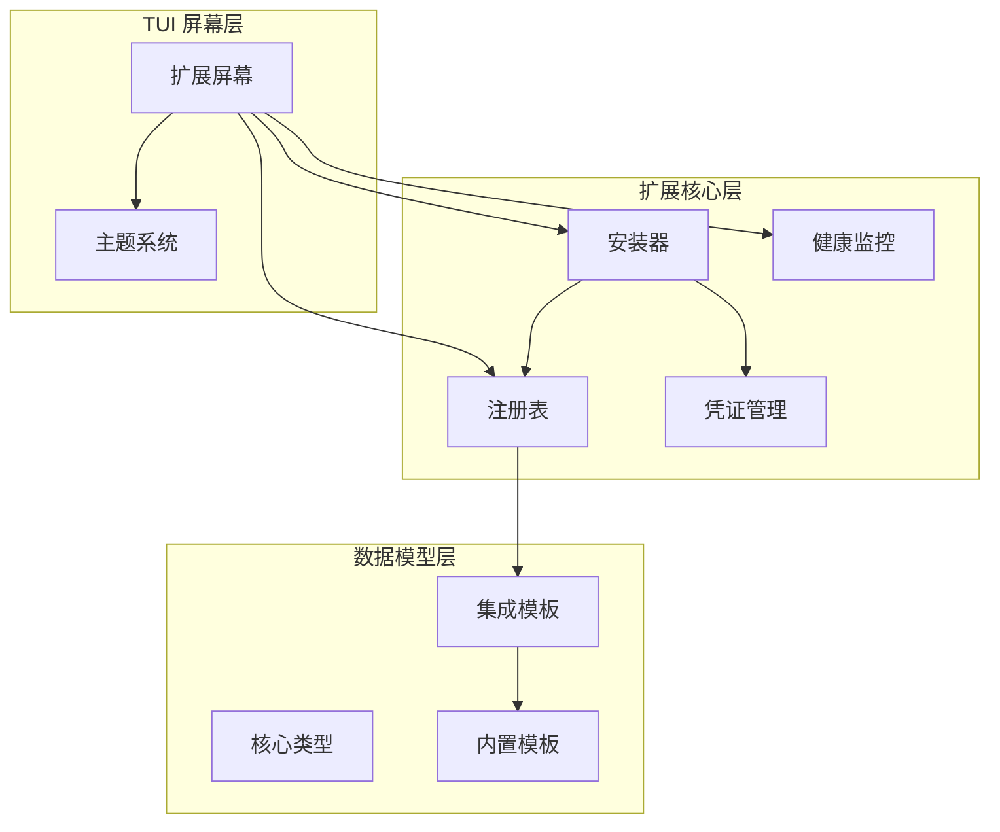
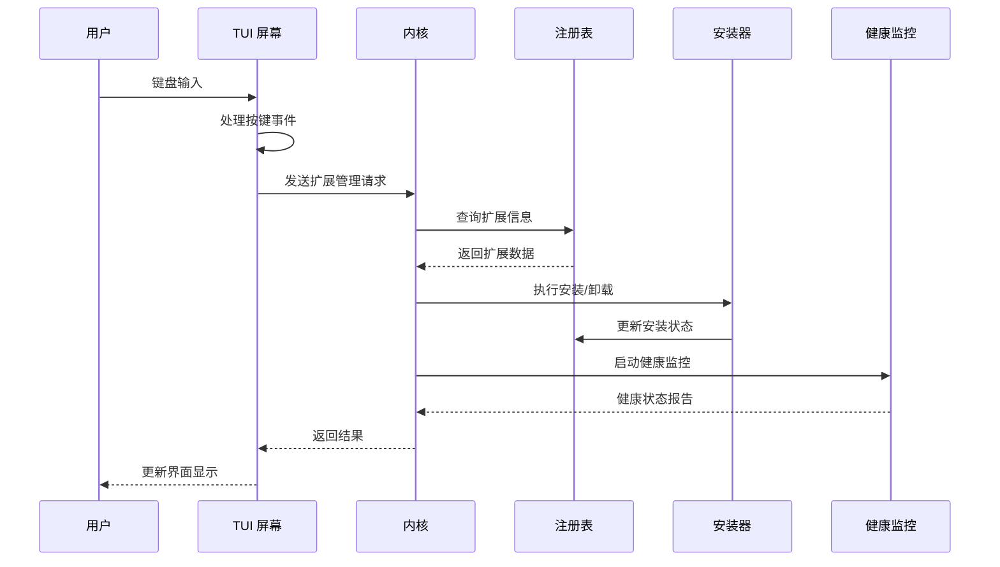
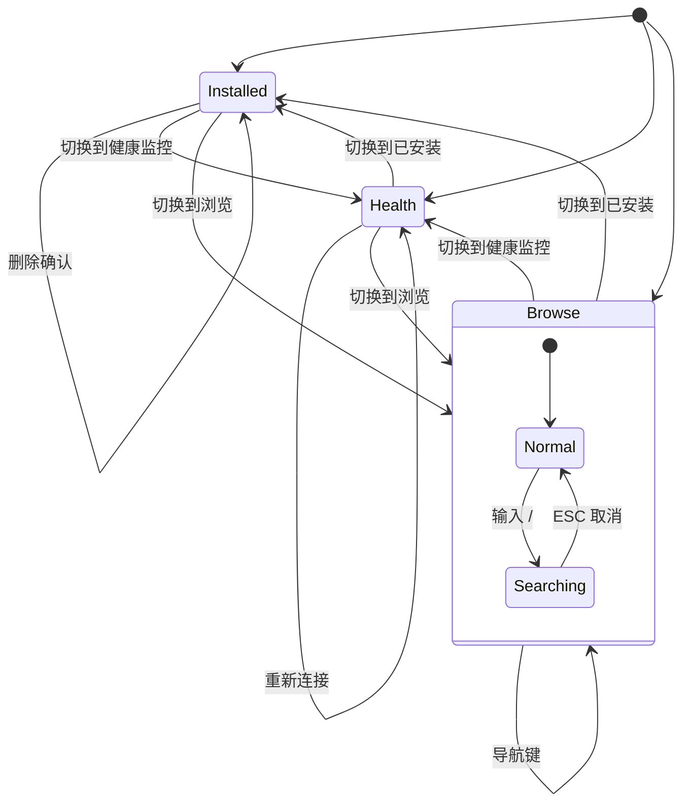
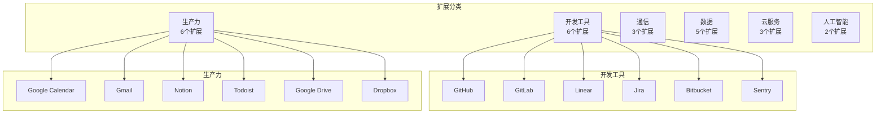
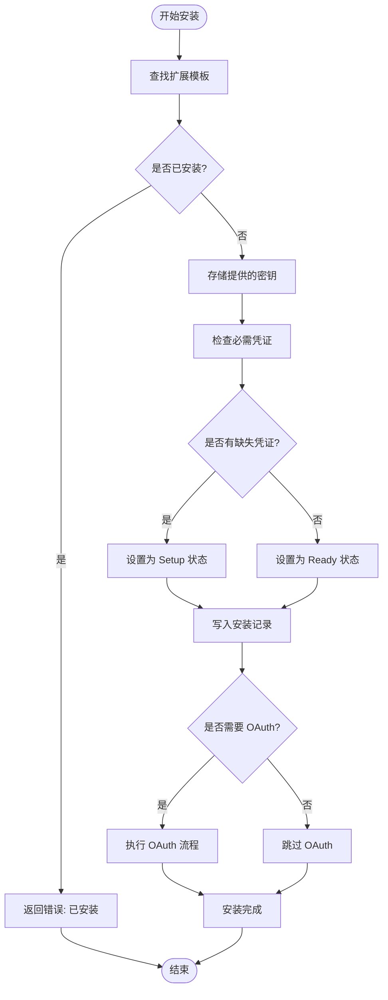
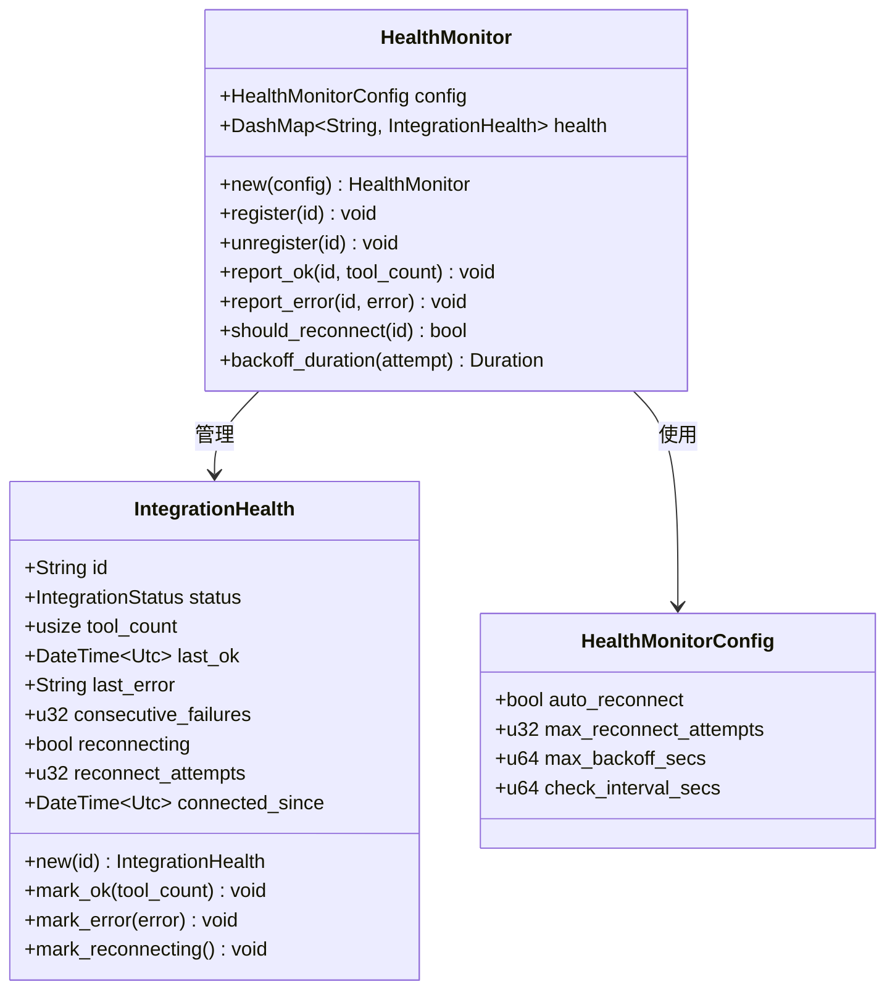
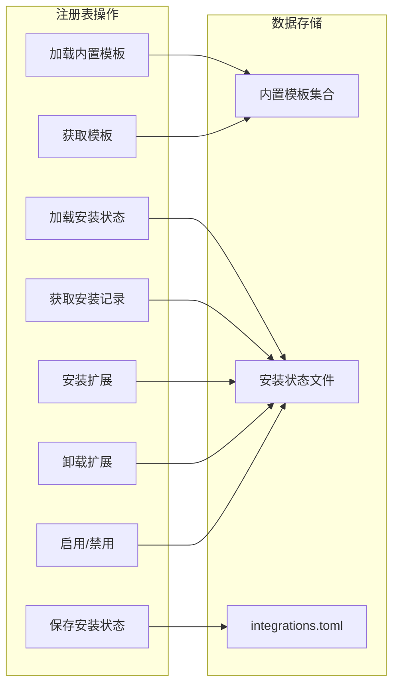
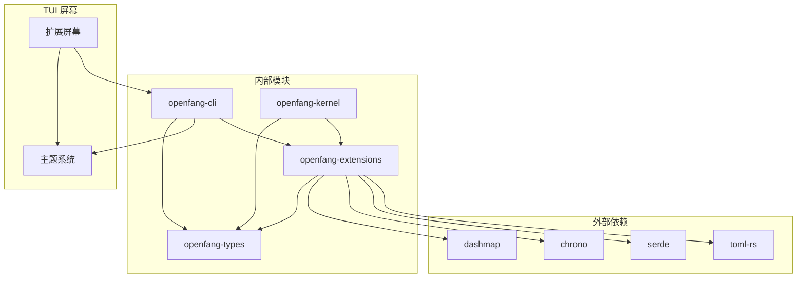

# 扩展屏幕

<cite>
**本文档引用的文件**
- [extensions.rs](file://crates/openfang-cli/src/tui/screens/extensions.rs)
- [lib.rs](file://crates/openfang-extensions/src/lib.rs)
- [installer.rs](file://crates/openfang-extensions/src/installer.rs)
- [registry.rs](file://crates/openfang-extensions/src/registry.rs)
- [health.rs](file://crates/openfang-extensions/src/health.rs)
- [bundled.rs](file://crates/openfang-extensions/src/bundled.rs)
- [github.toml](file://crates/openfang-extensions/integrations/github.toml)
- [slack.toml](file://crates/openfang-extensions/integrations/slack.toml)
- [notion.toml](file://crates/openfang-extensions/integrations/notion.toml)
- [brave-search.toml](file://crates/openfang-extensions/integrations/brave-search.toml)
- [mod.rs](file://crates/openfang-cli/src/tui/mod.rs)
- [theme.rs](file://crates/openfang-cli/src/tui/theme.rs)
- [event.rs](file://crates/openfang-cli/src/tui/event.rs)
- [kernel.rs](file://crates/openfang-kernel/src/kernel.rs)
</cite>

## 目录
1. [简介](#简介)
2. [项目结构](#项目结构)
3. [核心组件](#核心组件)
4. [架构概览](#架构概览)
5. [详细组件分析](#详细组件分析)
6. [依赖关系分析](#依赖关系分析)
7. [性能考虑](#性能考虑)
8. [故障排除指南](#故障排除指南)
9. [结论](#结论)
10. [附录](#附录)

## 简介

OpenFang 扩展屏幕是 TUI（文本用户界面）中的一个关键功能模块，为用户提供了一个直观的界面来管理 MCP（模型上下文协议）扩展。该屏幕支持扩展浏览、安装、卸载、配置和健康检查等功能，是 OpenFang Agent Operating System 的重要组成部分。

扩展屏幕提供了三个主要子界面：浏览扩展、已安装扩展管理和健康监控。用户可以通过键盘快捷键在这些界面之间切换，并使用标准的 j/k 导航键进行列表选择。

## 项目结构

OpenFang 扩展系统采用模块化设计，主要由以下几个核心部分组成：

**图表来源**
- [extensions.rs:1-590](file://crates/openfang-cli/src/tui/screens/extensions.rs#L1-L590)
- [lib.rs:1-329](file://crates/openfang-extensions/src/lib.rs#L1-L329)

**章节来源**
- [extensions.rs:1-590](file://crates/openfang-cli/src/tui/screens/extensions.rs#L1-L590)
- [lib.rs:1-329](file://crates/openfang-extensions/src/lib.rs#L1-L329)

## 核心组件

扩展屏幕的核心组件包括状态管理、数据模型、界面渲染和交互处理四个主要方面：

### 数据模型组件

扩展系统定义了完整的数据模型体系，包括扩展信息、健康状态、安装记录等核心数据结构：

- **ExtensionInfo**: 扩展基本信息展示
- **ExtensionHealthInfo**: 扩展健康状态信息
- **IntegrationTemplate**: 集成模板定义
- **InstalledIntegration**: 已安装集成记录
- **IntegrationStatus**: 扩展状态枚举

### 状态管理组件

扩展屏幕维护复杂的状态管理系统，支持三种不同的显示模式：

- **Browse 模式**: 浏览可用扩展
- **Installed 模式**: 管理已安装扩展
- **Health 模式**: 监控扩展健康状态

每种模式都有独立的列表状态管理和交互逻辑。

### 界面渲染组件

扩展屏幕实现了完整的 TUI 渲染系统，包括：

- **子标签栏**: 支持三种视图模式切换
- **表格渲染**: 结构化数据显示
- **状态徽章**: 健康状态可视化
- **搜索功能**: 实时扩展搜索过滤

**章节来源**
- [extensions.rs:13-62](file://crates/openfang-cli/src/tui/screens/extensions.rs#L13-L62)
- [lib.rs:54-239](file://crates/openfang-extensions/src/lib.rs#L54-L239)

## 架构概览

扩展系统的整体架构采用分层设计，确保了良好的模块分离和可维护性：

**图表来源**
- [mod.rs:580-609](file://crates/openfang-cli/src/tui/mod.rs#L580-L609)
- [event.rs:2525-2581](file://crates/openfang-cli/src/tui/event.rs#L2525-L2581)

**章节来源**
- [mod.rs:580-609](file://crates/openfang-cli/src/tui/mod.rs#L580-L609)
- [event.rs:2525-2581](file://crates/openfang-cli/src/tui/event.rs#L2525-L2581)

## 详细组件分析

### 扩展屏幕状态管理

扩展屏幕实现了完整的状态管理模式，支持三种不同的视图模式和复杂的交互逻辑：

**图表来源**
- [extensions.rs:42-71](file://crates/openfang-cli/src/tui/screens/extensions.rs#L42-L71)

扩展屏幕的状态管理包括以下关键特性：

1. **搜索功能**: 支持实时搜索扩展名称、ID、类别和标签
2. **键盘导航**: 支持 j/k 上下导航和 Enter 确认选择
3. **删除确认**: 卸载前的安全确认机制
4. **自动刷新**: 支持手动刷新扩展列表和健康状态

**章节来源**
- [extensions.rs:95-278](file://crates/openfang-cli/src/tui/screens/extensions.rs#L95-L278)

### 扩展类型分类系统

OpenFang 提供了完整的扩展类型分类系统，将 25 个内置扩展按照功能领域进行组织：

**图表来源**
- [bundled.rs:8-65](file://crates/openfang-extensions/src/bundled.rs#L8-L65)

每个扩展都具有以下标准属性：
- **唯一标识符**: 短小的字母数字 ID
- **人类可读名称**: 易于理解的扩展名称
- **描述信息**: 简短的功能描述
- **图标**: Emoji 图标用于视觉识别
- **标签**: 用于搜索和过滤的关键词
- **传输配置**: MCP 服务器启动方式

**章节来源**
- [bundled.rs:67-174](file://crates/openfang-extensions/src/bundled.rs#L67-L174)
- [lib.rs:146-177](file://crates/openfang-extensions/src/lib.rs#L146-L177)

### 扩展安装机制

扩展安装机制提供了完整的端到端安装流程，从模板查找到底层系统集成：

**图表来源**
- [installer.rs:36-130](file://crates/openfang-extensions/src/installer.rs#L36-L130)

安装过程的关键步骤包括：

1. **模板验证**: 确保扩展模板存在且有效
2. **重复安装防护**: 防止重复安装同一扩展
3. **密钥存储**: 将提供的 API 密钥安全存储到凭证库
4. **凭证检查**: 验证所有必需的环境变量已就绪
5. **OAuth 处理**: 对需要 OAuth 的扩展执行授权流程
6. **安装记录**: 更新安装状态文件

**章节来源**
- [installer.rs:27-130](file://crates/openfang-extensions/src/installer.rs#L27-L130)

### 扩展健康检查系统

扩展健康检查系统提供了全面的 MCP 服务器监控能力，包括自动重连和故障恢复：

**图表来源**
- [health.rs:14-194](file://crates/openfang-extensions/src/health.rs#L14-L194)

健康监控系统的核心特性：

1. **自动重连**: 错误发生后自动尝试重新连接
2. **指数退避**: 重连间隔按 5s, 10s, 20s... 增长，最多 5 分钟
3. **失败计数**: 跟踪连续失败次数并触发重连
4. **状态跟踪**: 记录最后成功时间和连接持续时间
5. **并发安全**: 使用 DashMap 确保多线程安全

**章节来源**
- [health.rs:81-194](file://crates/openfang-extensions/src/health.rs#L81-L194)
- [kernel.rs:5057-5084](file://crates/openfang-kernel/src/kernel.rs#L5057-L5084)

### 扩展注册表管理

扩展注册表负责管理所有扩展模板和安装状态，提供统一的数据访问接口：

**图表来源**
- [registry.rs:26-224](file://crates/openfang-extensions/src/registry.rs#L26-L224)

注册表系统的主要功能：

1. **模板管理**: 维护 25 个内置扩展模板
2. **状态持久化**: 将安装状态保存到 TOML 文件
3. **查询接口**: 提供多种查询和筛选功能
4. **配置转换**: 将安装状态转换为 MCP 服务器配置

**章节来源**
- [registry.rs:16-224](file://crates/openfang-extensions/src/registry.rs#L16-L224)

## 依赖关系分析

扩展系统的依赖关系清晰明确，遵循单一职责原则：

**图表来源**
- [lib.rs:18-21](file://crates/openfang-extensions/src/lib.rs#L18-L21)
- [mod.rs:14-17](file://crates/openfang-cli/src/tui/mod.rs#L14-L17)

**章节来源**
- [lib.rs:18-21](file://crates/openfang-extensions/src/lib.rs#L18-L21)
- [mod.rs:14-17](file://crates/openfang-cli/src/tui/mod.rs#L14-L17)

## 性能考虑

扩展系统在设计时充分考虑了性能优化：

### 内存管理
- 使用 DashMap 实现高性能并发访问
- 避免不必要的数据复制，使用引用传递
- 合理的缓存策略减少重复计算

### I/O 优化
- 扩展模板编译时嵌入，运行时无需磁盘访问
- 安装状态文件采用增量更新策略
- 健康检查采用异步非阻塞模式

### 网络效率
- OAuth 授权通过本地回调处理，避免网络延迟
- MCP 连接池复用，减少连接建立开销
- 批量健康检查，减少轮询频率

## 故障排除指南

### 常见问题及解决方案

**扩展无法安装**
1. 检查必需凭证是否完整
2. 验证网络连接和代理设置
3. 查看扩展日志获取详细错误信息

**扩展状态显示异常**
1. 手动触发刷新操作 (r 键)
2. 检查扩展健康监控状态
3. 重启相关 MCP 服务器进程

**搜索功能失效**
1. 确认搜索模式已正确激活 (/)
2. 检查输入字符编码
3. 重置搜索状态并重新输入

**章节来源**
- [extensions.rs:115-203](file://crates/openfang-cli/src/tui/screens/extensions.rs#L115-L203)
- [health.rs:158-183](file://crates/openfang-extensions/src/health.rs#L158-L183)

## 结论

OpenFang 扩展屏幕是一个设计精良、功能完整的扩展管理界面。它提供了直观的用户交互、强大的扩展管理能力和可靠的健康监控系统。通过模块化的架构设计和清晰的职责分离，该系统既保证了易用性，又确保了可维护性和可扩展性。

扩展系统的核心优势包括：
- **用户友好**: 直观的 TUI 界面和键盘快捷键
- **功能完整**: 支持扩展浏览、安装、卸载、配置和健康检查
- **可靠性强**: 自动重连和故障恢复机制
- **性能优秀**: 并发安全和高效的内存管理

## 附录

### 快速参考

**键盘快捷键**
- `1/2/3`: 在浏览、已安装、健康视图间切换
- `/`: 激活搜索模式
- `j/k`: 上下导航
- `Enter`: 确认选择或重新连接
- `d/Delete`: 卸载选中的扩展
- `r`: 刷新当前视图
- `Ctrl+C`: 返回上一级菜单

**扩展类型**
- 开发工具: GitHub, GitLab, Linear, Jira, Bitbucket, Sentry
- 生产力: Google Calendar, Gmail, Notion, Todoist, Google Drive, Dropbox
- 通信: Slack, Discord-MCP, Teams-MCP
- 数据: PostgreSQL, SQLite-MCP, MongoDB, Redis, Elasticsearch
- 云服务: AWS, GCP-MCP, Azure-MCP
- 人工智能: Brave Search, Exa Search

**章节来源**
- [extensions.rs:141-162](file://crates/openfang-cli/src/tui/screens/extensions.rs#L141-L162)
- [bundled.rs:8-65](file://crates/openfang-extensions/src/bundled.rs#L8-L65)