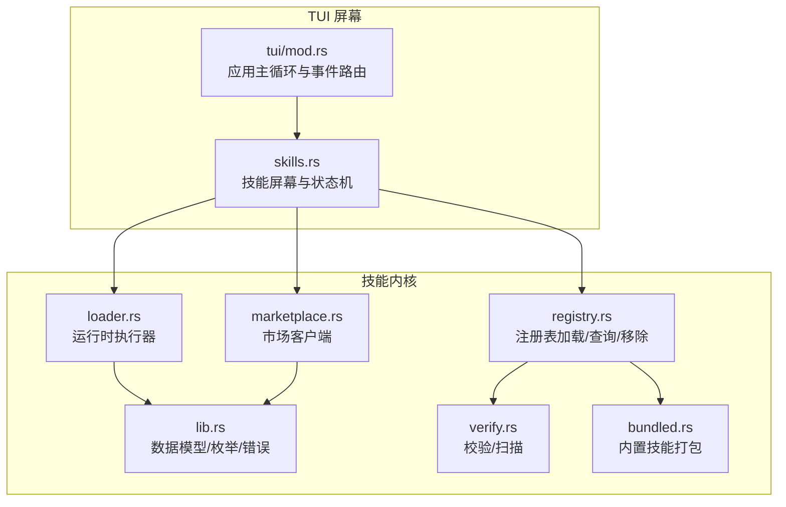
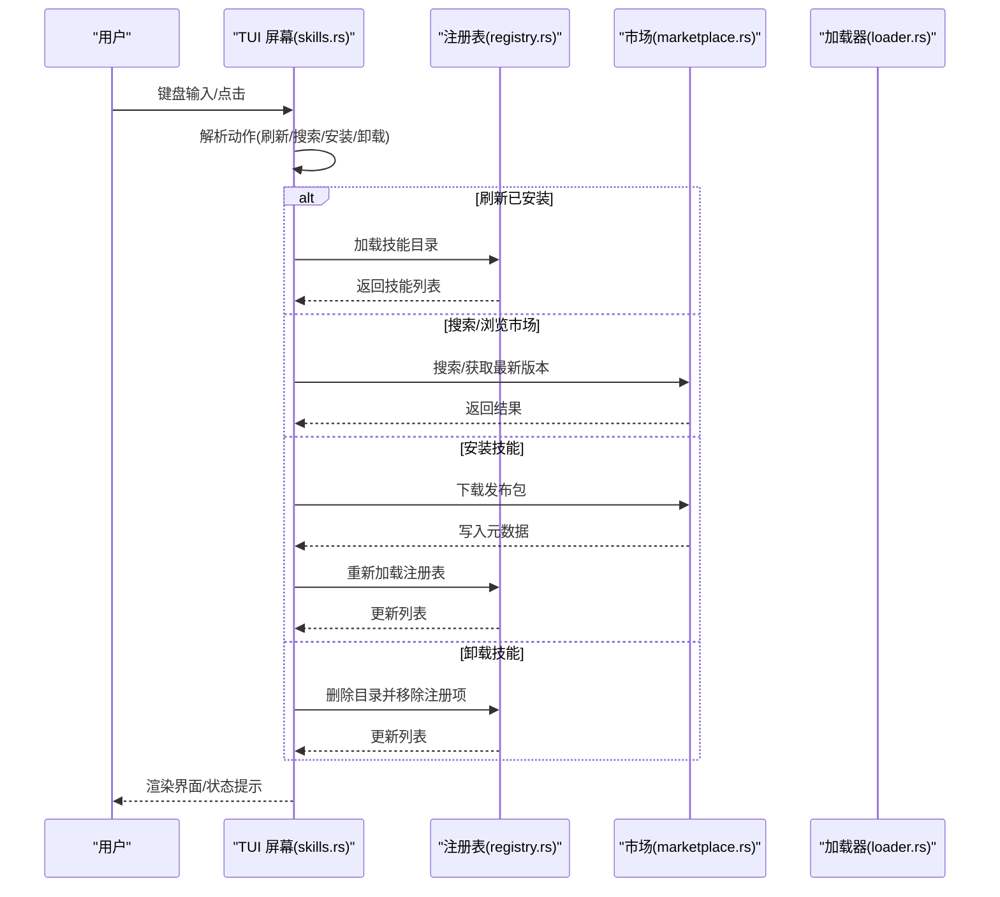
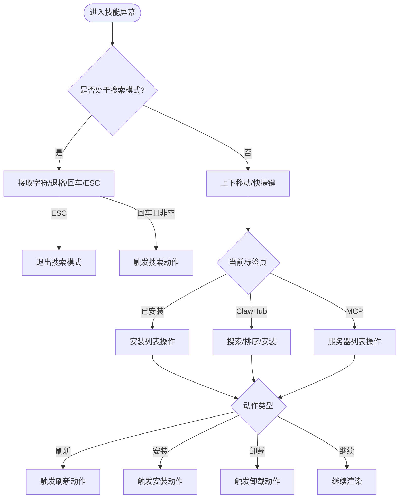
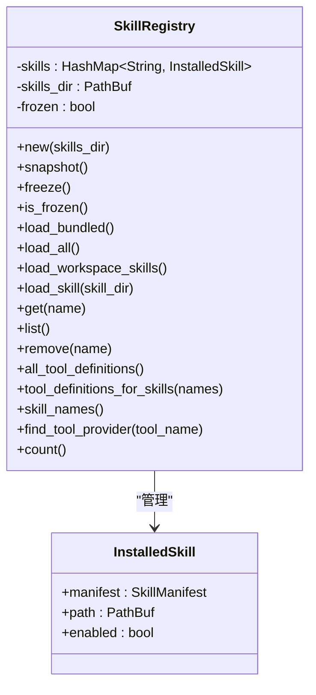
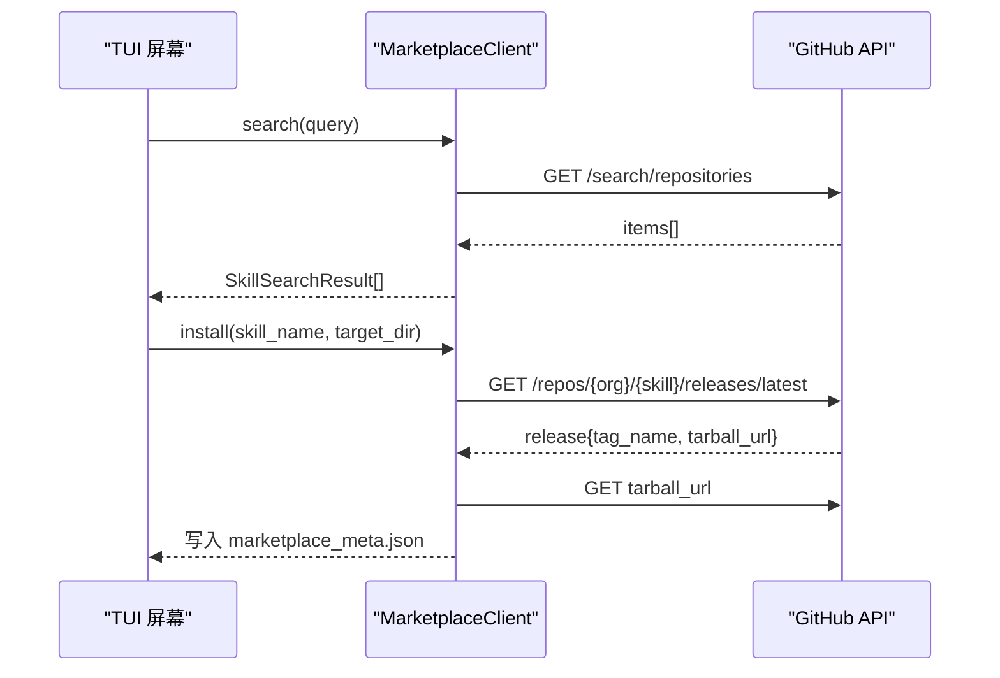
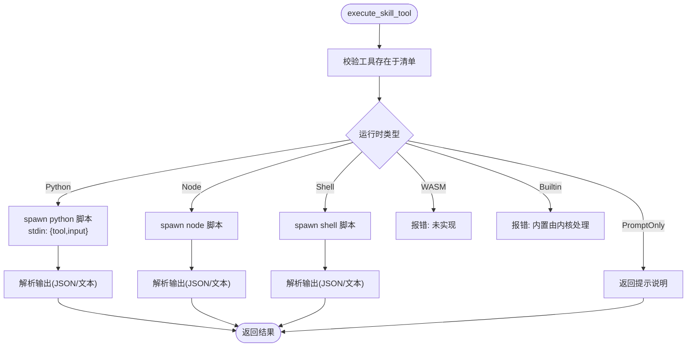
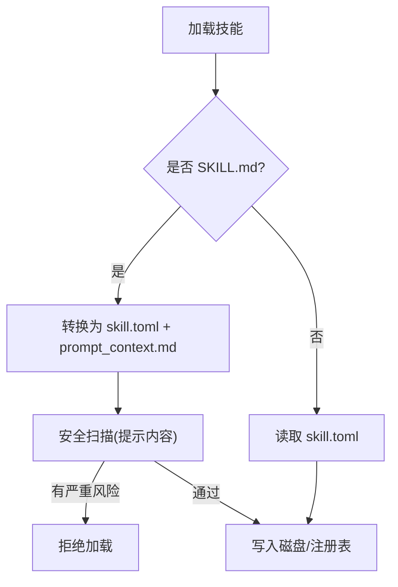
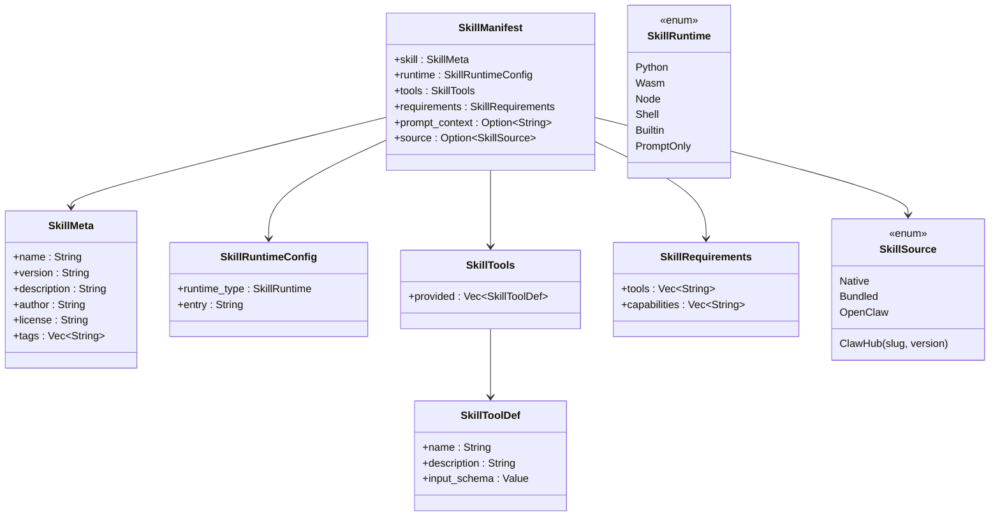
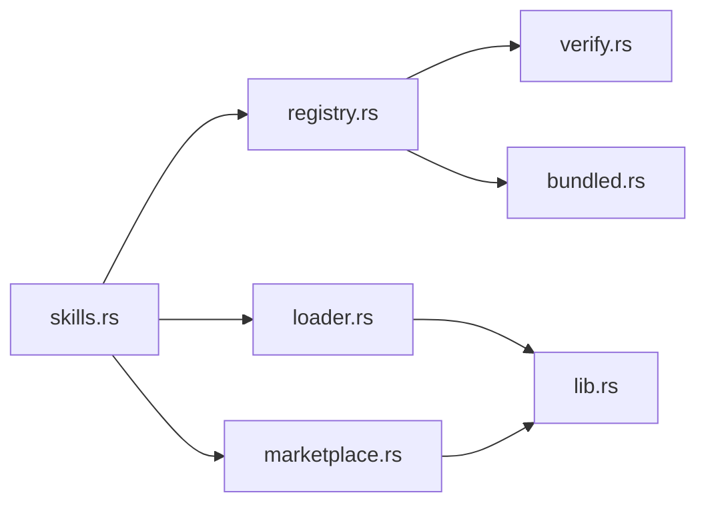

# 技能屏幕

<cite>
**本文引用的文件**
- [crates/openfang-cli/src/tui/screens/skills.rs](file://crates/openfang-cli/src/tui/screens/skills.rs)
- [crates/openfang-cli/src/tui/mod.rs](file://crates/openfang-cli/src/tui/mod.rs)
- [crates/openfang-skills/src/lib.rs](file://crates/openfang-skills/src/lib.rs)
- [crates/openfang-skills/src/registry.rs](file://crates/openfang-skills/src/registry.rs)
- [crates/openfang-skills/src/marketplace.rs](file://crates/openfang-skills/src/marketplace.rs)
- [crates/openfang-skills/src/loader.rs](file://crates/openfang-skills/src/loader.rs)
- [crates/openfang-skills/src/verify.rs](file://crates/openfang-skills/src/verify.rs)
- [crates/openfang-skills/src/bundled.rs](file://crates/openfang-skills/src/bundled.rs)
- [crates/openfang-skills/bundled/web-search/SKILL.md](file://crates/openfang-skills/bundled/web-search/SKILL.md)
- [crates/openfang-skills/bundled/github/SKILL.md](file://crates/openfang-skills/bundled/github/SKILL.md)
- [crates/openfang-skills/bundled/kubernetes/SKILL.md](file://crates/openfang-skills/bundled/kubernetes/SKILL.md)
</cite>

## 目录
1. [简介](#简介)
2. [项目结构](#项目结构)
3. [核心组件](#核心组件)
4. [架构总览](#架构总览)
5. [详细组件分析](#详细组件分析)
6. [依赖关系分析](#依赖关系分析)
7. [性能考量](#性能考量)
8. [故障排除指南](#故障排除指南)
9. [结论](#结论)
10. [附录](#附录)

## 简介
本文件面向 OpenFang 的 TUI 技能屏幕，系统性阐述技能管理功能与交互流程，覆盖技能列表、安装（含市场与向导）、配置、测试、卸载、更新与批量管理等。同时解析技能分类体系、安装机制、依赖关系与版本管理策略，并给出开发指南、最佳实践与故障排除建议。

## 项目结构
技能相关能力由两部分组成：
- TUI 屏幕：提供用户交互界面与操作入口（键位导航、搜索、排序、安装、卸载、刷新）。
- 技能内核：负责技能清单解析、注册表加载、运行时执行、安全校验与市场下载。

**图表来源**
- [crates/openfang-cli/src/tui/screens/skills.rs:1-631](file://crates/openfang-cli/src/tui/screens/skills.rs#L1-L631)
- [crates/openfang-cli/src/tui/mod.rs:1-800](file://crates/openfang-cli/src/tui/mod.rs#L1-L800)
- [crates/openfang-skills/src/registry.rs:1-553](file://crates/openfang-skills/src/registry.rs#L1-L553)
- [crates/openfang-skills/src/lib.rs:1-255](file://crates/openfang-skills/src/lib.rs#L1-L255)
- [crates/openfang-skills/src/marketplace.rs:1-201](file://crates/openfang-skills/src/marketplace.rs#L1-L201)
- [crates/openfang-skills/src/loader.rs:1-462](file://crates/openfang-skills/src/loader.rs#L1-L462)
- [crates/openfang-skills/src/verify.rs:1-295](file://crates/openfang-skills/src/verify.rs#L1-L295)
- [crates/openfang-skills/src/bundled.rs:1-298](file://crates/openfang-skills/src/bundled.rs#L1-L298)

**章节来源**
- [crates/openfang-cli/src/tui/screens/skills.rs:1-631](file://crates/openfang-cli/src/tui/screens/skills.rs#L1-L631)
- [crates/openfang-cli/src/tui/mod.rs:1-800](file://crates/openfang-cli/src/tui/mod.rs#L1-L800)

## 核心组件
- 技能数据模型与错误类型：定义技能元数据、运行时类型、工具定义、来源、要求等；统一错误类型便于上层处理。
- 注册表：扫描并加载已安装技能，支持冻结模式、工作区覆盖、工具定义聚合与提供者查找。
- 市场客户端：基于 GitHub Releases 的技能仓库，提供搜索与安装能力。
- 运行时加载器：根据技能声明的运行时类型，调用对应解释器或沙箱执行工具。
- 安全校验：对清单与提示内容进行安全扫描，阻断高危风险。
- 内置技能：编译期打包的 60 个提示型技能，作为默认能力集。

**章节来源**
- [crates/openfang-skills/src/lib.rs:1-255](file://crates/openfang-skills/src/lib.rs#L1-L255)
- [crates/openfang-skills/src/registry.rs:1-553](file://crates/openfang-skills/src/registry.rs#L1-L553)
- [crates/openfang-skills/src/marketplace.rs:1-201](file://crates/openfang-skills/src/marketplace.rs#L1-L201)
- [crates/openfang-skills/src/loader.rs:1-462](file://crates/openfang-skills/src/loader.rs#L1-L462)
- [crates/openfang-skills/src/verify.rs:1-295](file://crates/openfang-skills/src/verify.rs#L1-L295)
- [crates/openfang-skills/src/bundled.rs:1-298](file://crates/openfang-skills/src/bundled.rs#L1-L298)

## 架构总览
技能屏幕在 TUI 中以“子标签页”形式呈现三类视图：已安装、ClawHub 市场、MCP 服务器。状态机负责键盘输入与动作分发，事件驱动刷新 UI 与后台任务。

**图表来源**
- [crates/openfang-cli/src/tui/screens/skills.rs:121-279](file://crates/openfang-cli/src/tui/screens/skills.rs#L121-L279)
- [crates/openfang-skills/src/registry.rs:106-196](file://crates/openfang-skills/src/registry.rs#L106-L196)
- [crates/openfang-skills/src/marketplace.rs:46-168](file://crates/openfang-skills/src/marketplace.rs#L46-L168)
- [crates/openfang-skills/src/loader.rs:9-51](file://crates/openfang-skills/src/loader.rs#L9-L51)

## 详细组件分析

### 技能屏幕与状态机
- 子标签页：1 已安装、2 ClawHub、3 MCP 服务器。
- 搜索与排序：ClawHub 支持按趋势/热门/最近排序，支持输入框搜索。
- 动作映射：上下移动、安装/卸载、刷新、切换标签等。
- 状态字段：当前选中项、搜索缓冲、加载指示、确认卸载提示、状态消息。

**图表来源**
- [crates/openfang-cli/src/tui/screens/skills.rs:121-279](file://crates/openfang-cli/src/tui/screens/skills.rs#L121-L279)

**章节来源**
- [crates/openfang-cli/src/tui/screens/skills.rs:1-631](file://crates/openfang-cli/src/tui/screens/skills.rs#L1-L631)

### 技能注册表与生命周期
- 加载策略：先加载内置技能，再扫描用户目录与工作区目录；同名工作区覆盖全局。
- 冻结模式：稳定模式下禁止动态加载新技能，防止运行时变更。
- 工具聚合：按启用状态聚合所有技能提供的工具定义，供上层路由使用。
- 提供者查找：根据工具名反查提供该工具的技能。
- 移除：删除目录并从注册表移除条目。

**图表来源**
- [crates/openfang-skills/src/registry.rs:11-385](file://crates/openfang-skills/src/registry.rs#L11-L385)

**章节来源**
- [crates/openfang-skills/src/registry.rs:1-553](file://crates/openfang-skills/src/registry.rs#L1-L553)

### 市场客户端与安装流程
- 配置：GitHub 组织与 API 基础地址。
- 搜索：基于仓库名称与描述的 star 排序。
- 安装：获取最新发布版 tarball URL，保存元数据，不直接解压（保留后续扩展点）。
- 版本管理：记录安装版本与时间戳，便于后续升级与审计。

**图表来源**
- [crates/openfang-skills/src/marketplace.rs:46-168](file://crates/openfang-skills/src/marketplace.rs#L46-L168)

**章节来源**
- [crates/openfang-skills/src/marketplace.rs:1-201](file://crates/openfang-skills/src/marketplace.rs#L1-L201)

### 运行时执行器
- 工具调用：根据 manifest 中声明的运行时类型选择执行路径。
- Python/Node/Shell：通过子进程执行脚本，隔离环境变量，仅保留必要 PATH/HOME 等。
- 输出解析：优先解析 JSON，否则将 stdout 作为字符串结果返回。
- Prompt-only：直接返回提示注入说明，引导使用内置工具。

**图表来源**
- [crates/openfang-skills/src/loader.rs:9-51](file://crates/openfang-skills/src/loader.rs#L9-L51)

**章节来源**
- [crates/openfang-skills/src/loader.rs:1-462](file://crates/openfang-skills/src/loader.rs#L1-L462)

### 安全校验与内置技能
- 校验规则：运行时类型、能力需求、工具需求、提示内容注入模式、过大提示内容等。
- 内置技能：编译期嵌入 60 个提示型技能，自动转换为 OpenFang 格式并写入磁盘，支持覆盖用户自定义同名技能。

**图表来源**
- [crates/openfang-skills/src/registry.rs:106-196](file://crates/openfang-skills/src/registry.rs#L106-L196)
- [crates/openfang-skills/src/bundled.rs:185-189](file://crates/openfang-skills/src/bundled.rs#L185-L189)

**章节来源**
- [crates/openfang-skills/src/verify.rs:1-295](file://crates/openfang-skills/src/verify.rs#L1-L295)
- [crates/openfang-skills/src/bundled.rs:1-298](file://crates/openfang-skills/src/bundled.rs#L1-L298)

### 数据模型与分类体系
- 运行时类型：Python、WASM、Node、Shell、Builtin、PromptOnly。
- 来源：Native、Bundled、OpenClaw、ClawHub。
- 工具定义：名称、描述、输入 Schema。
- 要求：所需内置工具、宿主能力。
- 元数据：名称、版本、作者、许可证、标签等。

**图表来源**
- [crates/openfang-skills/src/lib.rs:104-179](file://crates/openfang-skills/src/lib.rs#L104-L179)

**章节来源**
- [crates/openfang-skills/src/lib.rs:1-255](file://crates/openfang-skills/src/lib.rs#L1-L255)

## 依赖关系分析
- TUI 依赖注册表与市场客户端获取数据；事件驱动刷新状态与 UI。
- 注册表依赖安全校验与内置技能转换逻辑。
- 运行时加载器依赖数据模型与错误类型。
- 市场客户端依赖网络库与 JSON 解析。

**图表来源**
- [crates/openfang-cli/src/tui/screens/skills.rs:1-631](file://crates/openfang-cli/src/tui/screens/skills.rs#L1-L631)
- [crates/openfang-skills/src/registry.rs:1-553](file://crates/openfang-skills/src/registry.rs#L1-L553)
- [crates/openfang-skills/src/marketplace.rs:1-201](file://crates/openfang-skills/src/marketplace.rs#L1-L201)
- [crates/openfang-skills/src/loader.rs:1-462](file://crates/openfang-skills/src/loader.rs#L1-L462)
- [crates/openfang-skills/src/verify.rs:1-295](file://crates/openfang-skills/src/verify.rs#L1-L295)
- [crates/openfang-skills/src/bundled.rs:1-298](file://crates/openfang-skills/src/bundled.rs#L1-L298)
- [crates/openfang-skills/src/lib.rs:1-255](file://crates/openfang-skills/src/lib.rs#L1-L255)

**章节来源**
- [crates/openfang-cli/src/tui/mod.rs:1-800](file://crates/openfang-cli/src/tui/mod.rs#L1-L800)

## 性能考量
- UI 渲染：列表项按需截断与样式化，避免大文本渲染开销。
- 网络请求：市场搜索与下载应限制并发与重试次数，避免阻塞 UI。
- 执行隔离：子进程启动与 I/O 复杂度与脚本规模相关，建议控制提示内容长度与工具输入大小。
- 注册表扫描：按需加载与快照（snapshot）减少锁持有时间，避免跨 await 导致的生命周期问题。

[本节为通用指导，无需特定文件来源]

## 故障排除指南
- 安装失败
  - 症状：安装后无法出现在已安装列表。
  - 排查：检查 marketplace_meta.json 是否存在、skill.toml 是否生成、注册表是否成功加载。
  - 参考
    - [crates/openfang-skills/src/marketplace.rs:135-168](file://crates/openfang-skills/src/marketplace.rs#L135-L168)
    - [crates/openfang-skills/src/registry.rs:106-196](file://crates/openfang-skills/src/registry.rs#L106-L196)
- 卸载后残留
  - 症状：卸载后仍可见或工具可用。
  - 排查：确认目录删除与注册表移除是否成功；检查冻结模式是否阻止了动态加载。
  - 参考
    - [crates/openfang-skills/src/registry.rs:234-248](file://crates/openfang-skills/src/registry.rs#L234-L248)
- 运行时不可用
  - 症状：提示找不到 Python/Node/Shell 或执行失败。
  - 排查：确认可执行文件存在与版本满足要求；检查子进程隔离环境变量。
  - 参考
    - [crates/openfang-skills/src/loader.rs:24-51](file://crates/openfang-skills/src/loader.rs#L24-L51)
    - [crates/openfang-skills/src/loader.rs:54-157](file://crates/openfang-skills/src/loader.rs#L54-L157)
- 安全拦截
  - 症状：加载被拒绝或警告。
  - 排查：检查安全扫描结果与提示内容模式；必要时调整技能声明。
  - 参考
    - [crates/openfang-skills/src/verify.rs:105-179](file://crates/openfang-skills/src/verify.rs#L105-L179)
    - [crates/openfang-skills/src/registry.rs:120-180](file://crates/openfang-skills/src/registry.rs#L120-L180)

**章节来源**
- [crates/openfang-skills/src/marketplace.rs:91-168](file://crates/openfang-skills/src/marketplace.rs#L91-L168)
- [crates/openfang-skills/src/registry.rs:234-248](file://crates/openfang-skills/src/registry.rs#L234-L248)
- [crates/openfang-skills/src/loader.rs:54-157](file://crates/openfang-skills/src/loader.rs#L54-L157)
- [crates/openfang-skills/src/verify.rs:105-179](file://crates/openfang-skills/src/verify.rs#L105-L179)

## 结论
技能屏幕通过清晰的状态机与事件驱动，将“已安装、市场、MCP 服务器”三大视图整合到统一交互框架中。技能内核以注册表为核心，结合市场下载、安全校验与多运行时执行，形成从发现到使用的完整闭环。内置技能与覆盖机制确保默认能力与用户定制的平衡。建议在生产环境中启用安全扫描与冻结模式，配合规范的版本管理与批量操作流程，保障系统稳定性与安全性。

[本节为总结，无需特定文件来源]

## 附录

### 技能开发指南
- 清单结构：遵循 skill.toml 字段与运行时声明，明确工具定义与输入 Schema。
- 提示内容：优先采用 PromptOnly 类型，保持提示简洁，避免注入模式。
- 依赖声明：最小化工具与能力需求，降低安全风险。
- 测试建议：本地验证工具调用输出格式，确保 JSON 可解析。

**章节来源**
- [crates/openfang-skills/src/lib.rs:104-179](file://crates/openfang-skills/src/lib.rs#L104-L179)
- [crates/openfang-skills/src/verify.rs:105-179](file://crates/openfang-skills/src/verify.rs#L105-L179)

### 示例技能参考
- Web Search：研究与信息合成专家，强调引用来源与事实区分。
- GitHub：PR/Issue/Actions 管理专家，强调 CLI 使用与最佳实践。
- Kubernetes：调试与部署专家，强调最小权限与零停机策略。

**章节来源**
- [crates/openfang-skills/bundled/web-search/SKILL.md:1-39](file://crates/openfang-skills/bundled/web-search/SKILL.md#L1-L39)
- [crates/openfang-skills/bundled/github/SKILL.md:1-37](file://crates/openfang-skills/bundled/github/SKILL.md#L1-L37)
- [crates/openfang-skills/bundled/kubernetes/SKILL.md:1-44](file://crates/openfang-skills/bundled/kubernetes/SKILL.md#L1-L44)