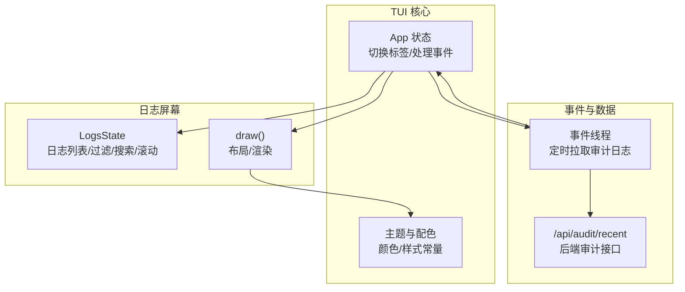
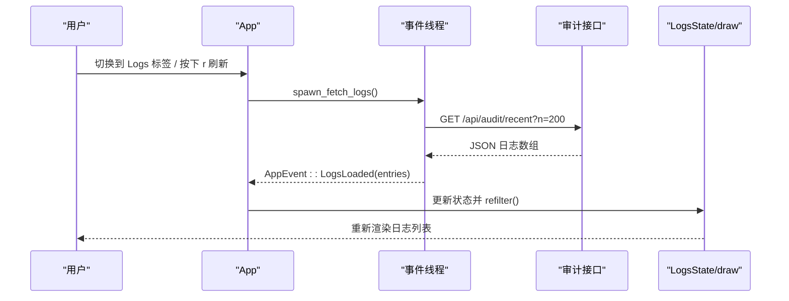
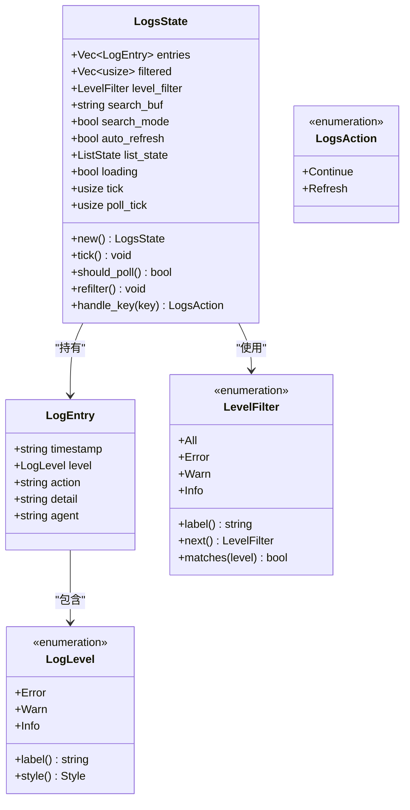
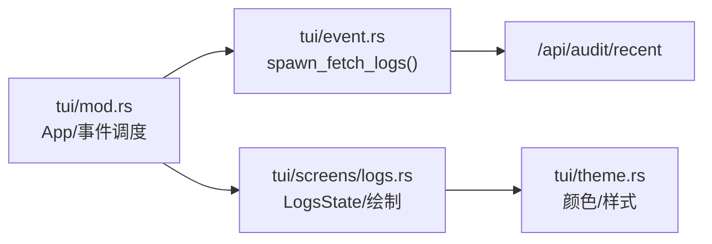

# 日志屏幕

<cite>
**本文引用的文件**
- [logs.rs](file://crates/openfang-cli/src/tui/screens/logs.rs)
- [theme.rs](file://crates/openfang-cli/src/tui/theme.rs)
- [lib.rs](file://crates/openfang-types/src/lib.rs)
- [event.rs](file://crates/openfang-types/src/event.rs)
- [mod.rs](file://crates/openfang-cli/src/tui/mod.rs)
- [event.rs](file://crates/openfang-cli/src/tui/event.rs)
</cite>

## 目录
1. [简介](#简介)
2. [项目结构](#项目结构)
3. [核心组件](#核心组件)
4. [架构总览](#架构总览)
5. [详细组件分析](#详细组件分析)
6. [依赖关系分析](#依赖关系分析)
7. [性能考量](#性能考量)
8. [故障排查指南](#故障排查指南)
9. [结论](#结论)
10. [附录](#附录)

## 简介
本文件面向 OpenFang TUI 的“日志屏幕”，系统性阐述其日志管理能力：实时查看、历史查询、日志过滤（按级别）、关键字搜索、自动刷新与手动刷新、以及日志条目的字段与样式规范。文档同时给出界面布局、交互流程、关键数据结构与依赖关系，并提供日志分析方法、故障诊断技巧与最佳实践。

## 项目结构
日志屏幕位于 TUI 子系统的屏幕模块中，采用“屏幕状态 + 绘制函数”的分层设计；日志数据通过事件线程从后端审计接口拉取，再由应用状态统一调度渲染。

图表来源
- [mod.rs:2223-2243](file://crates/openfang-cli/src/tui/mod.rs#L2223-L2243)
- [logs.rs:258-402](file://crates/openfang-cli/src/tui/screens/logs.rs#L258-L402)
- [event.rs:2066-2107](file://crates/openfang-cli/src/tui/event.rs#L2066-L2107)

章节来源
- [mod.rs:2223-2243](file://crates/openfang-cli/src/tui/mod.rs#L2223-L2243)
- [logs.rs:258-402](file://crates/openfang-cli/src/tui/screens/logs.rs#L258-L402)
- [event.rs:2066-2107](file://crates/openfang-cli/src/tui/event.rs#L2066-L2107)

## 核心组件
- 日志条目模型：包含时间戳、级别、动作、详情、来源代理等字段，用于展示与过滤。
- 日志级别：错误、警告、信息三档，支持自动关键词分类与手动筛选。
- 过滤器：按级别过滤（All/Error/Warn/Info）。
- 搜索：支持在动作与详情中进行大小写不敏感的关键字检索。
- 自动刷新：基于帧循环计数，周期性触发后台拉取。
- 界面渲染：标题栏（级别/计数/自动刷新状态/搜索提示）、日志列表、快捷键提示。

章节来源
- [logs.rs:13-69](file://crates/openfang-cli/src/tui/screens/logs.rs#L13-L69)
- [logs.rs:73-106](file://crates/openfang-cli/src/tui/screens/logs.rs#L73-L106)
- [logs.rs:110-181](file://crates/openfang-cli/src/tui/screens/logs.rs#L110-L181)
- [logs.rs:258-402](file://crates/openfang-cli/src/tui/screens/logs.rs#L258-L402)

## 架构总览
日志屏幕的运行链路如下：
- 应用状态在进入 Logs 标签或满足刷新条件时，启动后台线程拉取审计日志。
- 后台线程请求 /api/audit/recent 接口，解析为日志条目并发送到事件通道。
- 主循环接收事件，更新 LogsState 并触发重绘。
- 绘制函数根据状态生成标题行、日志列表与提示信息。

图表来源
- [mod.rs:1130-1135](file://crates/openfang-cli/src/tui/mod.rs#L1130-L1135)
- [event.rs:2066-2107](file://crates/openfang-cli/src/tui/event.rs#L2066-L2107)
- [mod.rs:531-535](file://crates/openfang-cli/src/tui/mod.rs#L531-L535)
- [logs.rs:258-402](file://crates/openfang-cli/src/tui/screens/logs.rs#L258-L402)

## 详细组件分析

### 数据模型与级别分类
- 日志条目包含字段：时间戳、级别、动作、详情、来源代理。
- 级别枚举：错误、警告、信息，默认信息。
- 自动分类：根据动作与详情中的关键词（如 error/fail/crash/panic；warn/deny/denied/block/timeout）推断级别。
- 级别样式：不同级别对应主题中的颜色与强调样式。

章节来源
- [logs.rs:13-69](file://crates/openfang-cli/src/tui/screens/logs.rs#L13-L69)
- [theme.rs:27-31](file://crates/openfang-cli/src/tui/theme.rs#L27-L31)
- [theme.rs:41-60](file://crates/openfang-cli/src/tui/theme.rs#L41-L60)

### 过滤与搜索
- 级别过滤：支持 All/Error/Warn/Info 循环切换，仅显示匹配级别的条目。
- 关键字搜索：在“动作+详情”中进行大小写不敏感匹配；输入时即时刷新结果。
- 自动滚动：新条目加入后自动滚动到底部，便于观察最新日志。

章节来源
- [logs.rs:73-106](file://crates/openfang-cli/src/tui/screens/logs.rs#L73-L106)
- [logs.rs:154-181](file://crates/openfang-cli/src/tui/screens/logs.rs#L154-L181)

### 界面与交互
- 布局分为三段：标题行（级别/计数/自动刷新/搜索提示）、日志列表、快捷键提示。
- 键盘操作：
  - 上/下方向键或 j/k：上下导航
  - Home/End：跳转首尾
  - f：切换级别过滤
  - /：进入搜索模式
  - a：切换自动刷新
  - r：手动刷新
  - Ctrl+C：退出（双击生效）
- 搜索模式：显示当前输入缓冲与光标闪烁，输入回车或 ESC 结束搜索。

章节来源
- [logs.rs:258-402](file://crates/openfang-cli/src/tui/screens/logs.rs#L258-L402)
- [logs.rs:183-253](file://crates/openfang-cli/src/tui/screens/logs.rs#L183-L253)

### 自动刷新与手动刷新
- 自动刷新：每约 2 秒触发一次轮询（基于帧循环计数），若启用则自动拉取最新日志。
- 手动刷新：按下 r 键触发一次拉取，立即更新列表。

章节来源
- [logs.rs:144-152](file://crates/openfang-cli/src/tui/screens/logs.rs#L144-L152)
- [mod.rs:1130-1135](file://crates/openfang-cli/src/tui/mod.rs#L1130-L1135)
- [mod.rs:1725-1730](file://crates/openfang-cli/src/tui/mod.rs#L1725-L1730)

### 数据来源与格式规范
- 数据来源：/api/audit/recent 接口返回的日志数组，每条记录包含时间戳、动作、详情、代理等字段。
- 字符串截断：使用通用工具对字段进行安全截断，避免破坏 UTF-8 边界。
- 时间戳：来源于后端事件的时间戳字段，前端仅展示与排序。

章节来源
- [event.rs:2066-2107](file://crates/openfang-cli/src/tui/event.rs#L2066-L2107)
- [lib.rs:25-35](file://crates/openfang-types/src/lib.rs#L25-L35)
- [event.rs:282-300](file://crates/openfang-types/src/event.rs#L282-L300)

### 类图：日志相关类型

图表来源
- [logs.rs:13-69](file://crates/openfang-cli/src/tui/screens/logs.rs#L13-L69)
- [logs.rs:73-106](file://crates/openfang-cli/src/tui/screens/logs.rs#L73-L106)
- [logs.rs:110-181](file://crates/openfang-cli/src/tui/screens/logs.rs#L110-L181)
- [logs.rs:123-126](file://crates/openfang-cli/src/tui/screens/logs.rs#L123-L126)

## 依赖关系分析
- 主应用状态负责：
  - 调度日志刷新（进入标签或按键触发）
  - 处理后台事件（LogsLoaded）
  - 调用日志屏幕绘制函数
- 日志屏幕负责：
  - 维护状态（条目、过滤索引、搜索缓冲、滚动位置）
  - 键盘事件处理与状态变更
  - 渲染标题行、列表与提示
- 主题模块提供：
  - 颜色与样式常量，保证一致的视觉风格

图表来源
- [mod.rs:1130-1135](file://crates/openfang-cli/src/tui/mod.rs#L1130-L1135)
- [event.rs:2066-2107](file://crates/openfang-cli/src/tui/event.rs#L2066-L2107)
- [logs.rs:258-402](file://crates/openfang-cli/src/tui/screens/logs.rs#L258-L402)
- [theme.rs:1-140](file://crates/openfang-cli/src/tui/theme.rs#L1-L140)

章节来源
- [mod.rs:2223-2243](file://crates/openfang-cli/src/tui/mod.rs#L2223-L2243)
- [event.rs:2066-2107](file://crates/openfang-cli/src/tui/event.rs#L2066-L2107)
- [logs.rs:258-402](file://crates/openfang-cli/src/tui/screens/logs.rs#L258-L402)
- [theme.rs:1-140](file://crates/openfang-cli/src/tui/theme.rs#L1-L140)

## 性能考量
- 列表渲染：每次刷新会重建 ListItems，建议在大量日志场景下限制单次拉取数量或启用更严格的过滤。
- 搜索复杂度：每次 refilter 对 entries 进行枚举与字符串匹配，建议使用更高效的索引或前缀树可进一步优化。
- 自动刷新频率：默认约 2 秒一次，可根据终端性能与网络状况调整 tick 周期。
- 字符串截断：使用安全截断函数避免 UTF-8 破坏，确保渲染稳定。

## 故障排查指南
- 无日志显示
  - 检查后端是否可达与审计接口返回内容
  - 确认 LogsLoaded 事件已到达并更新状态
- 搜索无效
  - 确认搜索模式已正确进入（/ 键）
  - 检查关键字是否存在于“动作+详情”字段
- 自动刷新未生效
  - 检查状态中的 auto_refresh 标志
  - 确认 tick 计数已递增且达到轮询阈值
- 渲染异常
  - 检查字段截断逻辑是否导致显示截断
  - 核对主题颜色与终端背景对比度

章节来源
- [event.rs:2066-2107](file://crates/openfang-cli/src/tui/event.rs#L2066-L2107)
- [logs.rs:144-181](file://crates/openfang-cli/src/tui/screens/logs.rs#L144-L181)
- [lib.rs:25-35](file://crates/openfang-types/src/lib.rs#L25-L35)
- [theme.rs:136-140](file://crates/openfang-cli/src/tui/theme.rs#L136-L140)

## 结论
日志屏幕提供了简洁高效的日志浏览体验：支持按级别快速筛选、关键字即时搜索、自动/手动刷新与稳定的渲染。通过清晰的状态分离与事件驱动，系统在 TUI 中实现了低耦合、高可维护的日志管理能力。建议在生产环境中结合更细粒度的过滤与导出能力，以满足更大规模的日志分析需求。

## 附录

### 快捷键一览
- 上/下方向键 或 j/k：上下导航
- Home/End：跳转首尾
- f：切换级别过滤（All/Error/Warn/Info）
- /：进入搜索模式
- a：切换自动刷新
- r：手动刷新
- Ctrl+C：退出（双击生效）

章节来源
- [logs.rs:258-402](file://crates/openfang-cli/src/tui/screens/logs.rs#L258-L402)
- [logs.rs:183-253](file://crates/openfang-cli/src/tui/screens/logs.rs#L183-L253)