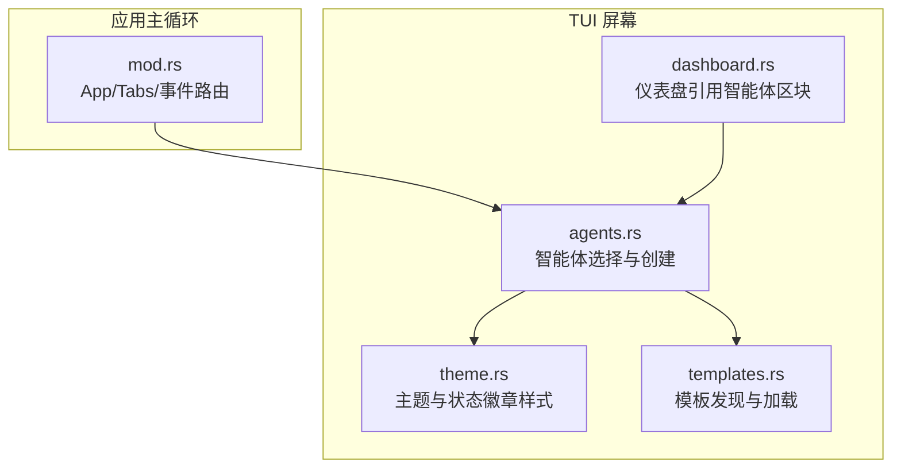
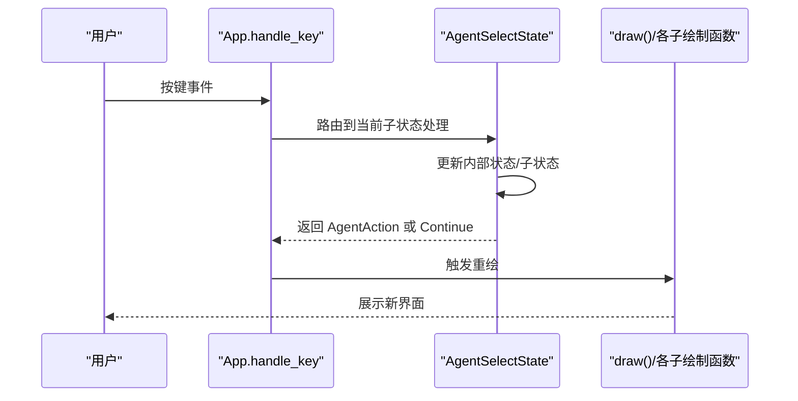
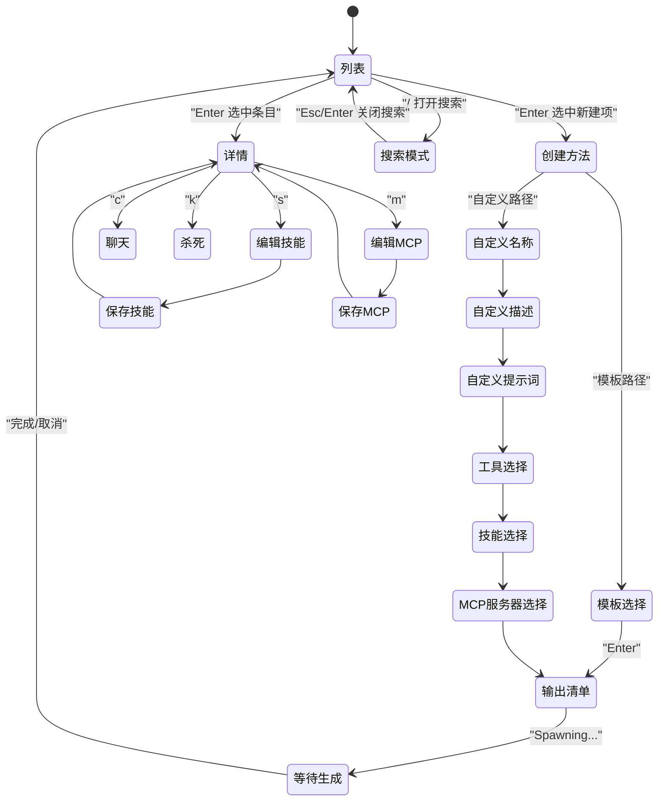
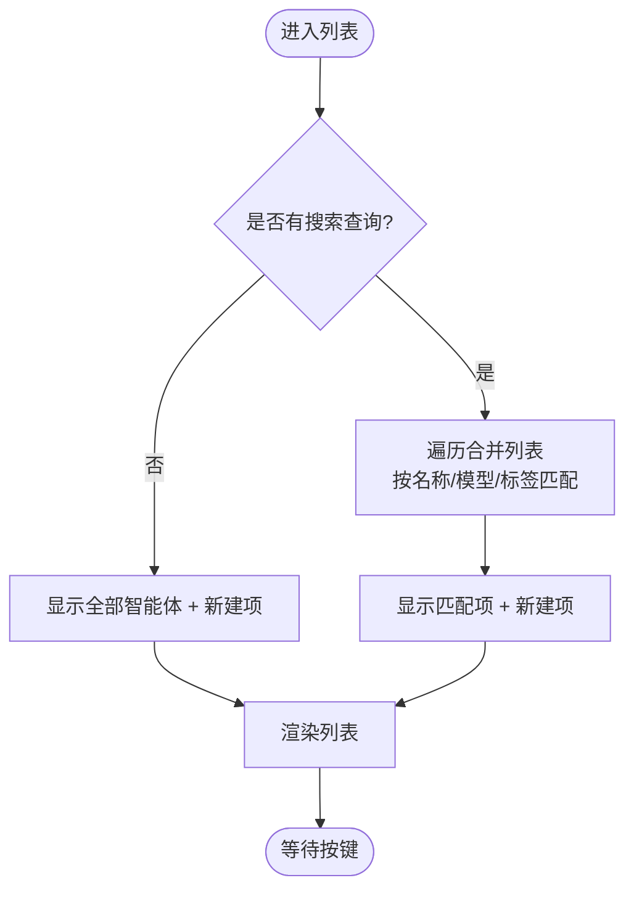
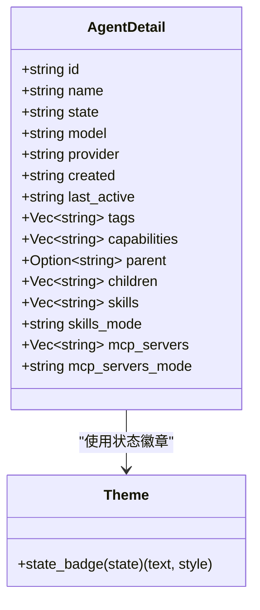
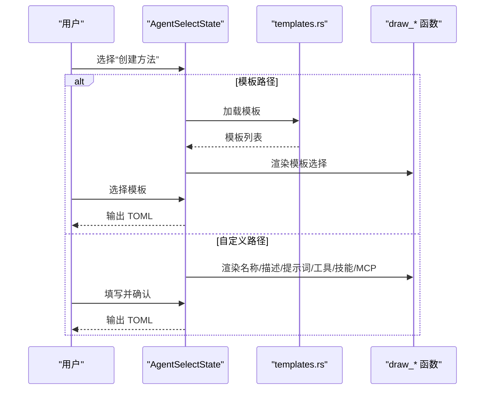
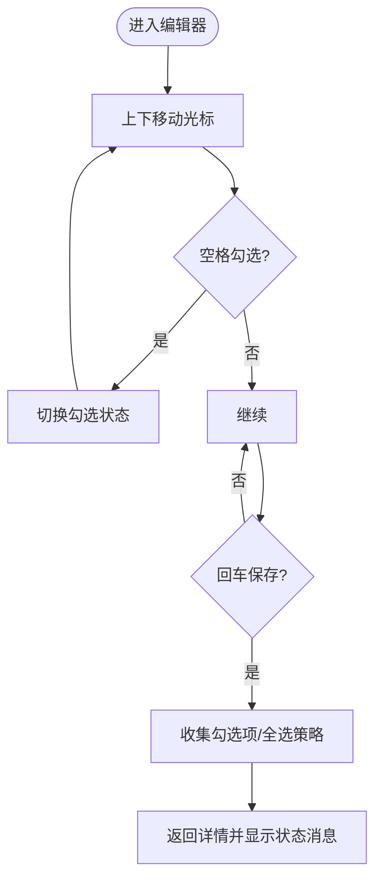
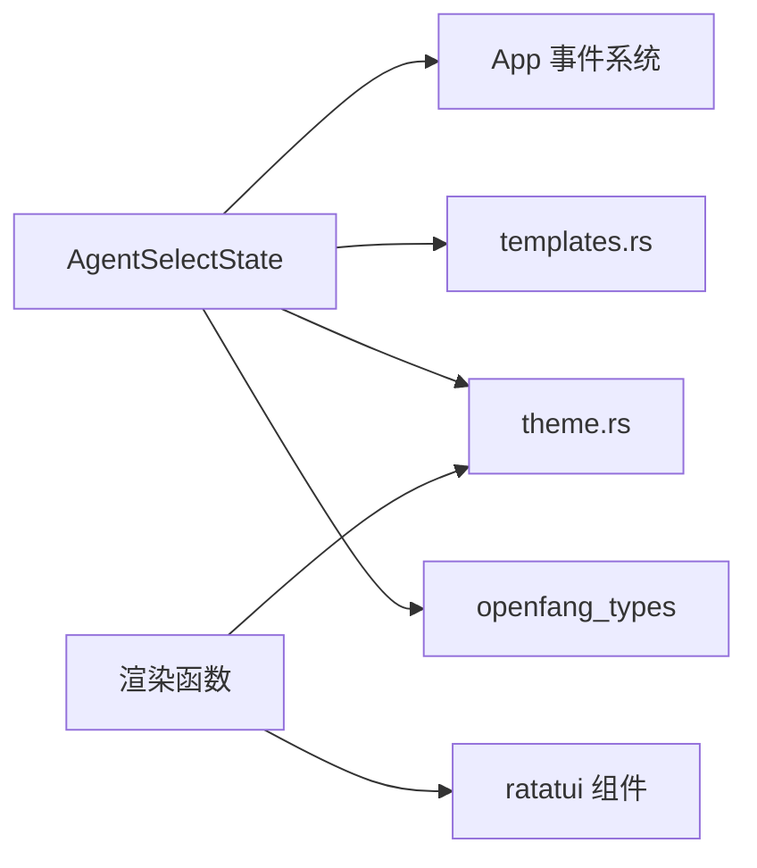

# 智能体屏幕

<cite>
**本文引用的文件**
- [agents.rs](file://crates/openfang-cli/src/tui/screens/agents.rs)
- [mod.rs](file://crates/openfang-cli/src/tui/mod.rs)
- [theme.rs](file://crates/openfang-cli/src/tui/theme.rs)
- [templates.rs](file://crates/openfang-cli/src/templates.rs)
- [dashboard.rs](file://crates/openfang-cli/src/tui/screens/dashboard.rs)
- [ui.rs](file://crates/openfang-cli/src/ui.rs)
</cite>

## 目录
1. [简介](#简介)
2. [项目结构](#项目结构)
3. [核心组件](#核心组件)
4. [架构总览](#架构总览)
5. [详细组件分析](#详细组件分析)
6. [依赖关系分析](#依赖关系分析)
7. [性能考量](#性能考量)
8. [故障排除指南](#故障排除指南)
9. [结论](#结论)
10. [附录](#附录)

## 简介
本文件系统性地记录 OpenFang TUI 中“智能体屏幕”的设计与实现，覆盖以下方面：
- 智能体管理功能：列表查看、详情展示、状态监控、操作控制（聊天、杀死、编辑技能与 MCP 服务器）
- 智能体选择机制：搜索过滤、可见项映射、组合索引
- 技能分配与 MCP 服务器配置：模板选择、自定义构建、编辑器
- 界面布局与交互：列表视图、详情面板、操作按钮、键盘快捷键
- 操作流程：创建、删除、重启（通过杀死后重建）、暂停（如适用）等
- 最佳实践、性能优化建议与故障排除

## 项目结构
智能体屏幕位于 TUI 子模块中，采用按屏幕拆分的模块化组织方式，便于维护与扩展。

图表来源
- [agents.rs:1-1533](file://crates/openfang-cli/src/tui/screens/agents.rs#L1-L1533)
- [mod.rs:1-2428](file://crates/openfang-cli/src/tui/mod.rs#L1-L2428)
- [theme.rs:1-140](file://crates/openfang-cli/src/tui/theme.rs#L1-L140)
- [templates.rs:1-138](file://crates/openfang-cli/src/templates.rs#L1-L138)
- [dashboard.rs:1-200](file://crates/openfang-cli/src/tui/screens/dashboard.rs#L1-L200)

章节来源
- [agents.rs:1-1533](file://crates/openfang-cli/src/tui/screens/agents.rs#L1-L1533)
- [mod.rs:1-2428](file://crates/openfang-cli/src/tui/mod.rs#L1-L2428)
- [theme.rs:1-140](file://crates/openfang-cli/src/tui/theme.rs#L1-L140)
- [templates.rs:1-138](file://crates/openfang-cli/src/templates.rs#L1-L138)
- [dashboard.rs:1-200](file://crates/openfang-cli/src/tui/screens/dashboard.rs#L1-L200)

## 核心组件
- AgentSelectState：智能体屏幕的状态机，负责列表、详情、创建向导、编辑器等子状态的切换与数据承载
- AgentSubScreen：子屏幕枚举，涵盖列表、详情、创建方法、模板选择、自定义构建各步骤、编辑器、等待生成等
- AgentDetail：详情面板的数据模型，包含基础信息、能力、父子关系、技能与 MCP 配置
- AgentAction：屏幕决策输出，用于驱动应用层执行具体动作（如创建清单、聊天、杀死、更新技能/MCP）
- 主应用 App：持有 AgentSelectState 并在事件循环中处理按键与后台事件，驱动状态变更与渲染

章节来源
- [agents.rs:28-158](file://crates/openfang-cli/src/tui/screens/agents.rs#L28-L158)
- [mod.rs:138-180](file://crates/openfang-cli/src/tui/mod.rs#L138-L180)

## 架构总览
智能体屏幕采用“状态机 + 渲染分离”的设计：
- 状态机负责解析用户输入、维护内部数据与子状态
- 渲染函数根据当前子状态绘制不同 UI 片段（列表、详情、向导卡片、编辑器）
- 应用主循环将按键事件与后台事件分派到对应屏幕处理器，并将结果转化为全局动作

图表来源
- [mod.rs:612-780](file://crates/openfang-cli/src/tui/mod.rs#L612-L780)
- [agents.rs:353-373](file://crates/openfang-cli/src/tui/screens/agents.rs#L353-L373)
- [agents.rs:878-970](file://crates/openfang-cli/src/tui/screens/agents.rs#L878-L970)

## 详细组件分析

### 状态机与子屏幕
AgentSubScreen 定义了完整的交互流程，从顶层列表到详情，再到创建向导与编辑器，最后回到列表或等待生成。

图表来源
- [agents.rs:28-56](file://crates/openfang-cli/src/tui/screens/agents.rs#L28-L56)
- [agents.rs:358-373](file://crates/openfang-cli/src/tui/screens/agents.rs#L358-L373)
- [agents.rs:498-539](file://crates/openfang-cli/src/tui/screens/agents.rs#L498-L539)
- [agents.rs:541-572](file://crates/openfang-cli/src/tui/screens/agents.rs#L541-L572)
- [agents.rs:574-732](file://crates/openfang-cli/src/tui/screens/agents.rs#L574-L732)
- [agents.rs:734-818](file://crates/openfang-cli/src/tui/screens/agents.rs#L734-L818)

章节来源
- [agents.rs:28-56](file://crates/openfang-cli/src/tui/screens/agents.rs#L28-L56)
- [agents.rs:358-373](file://crates/openfang-cli/src/tui/screens/agents.rs#L358-L373)

### 列表与搜索过滤
- 可见项计算：空查询时显示所有智能体 + “新建”项；有查询时仅显示匹配项 + “新建”
- 过滤规则：名称、模型、标签（模板中提取描述作为标签）包含查询词即命中
- 组合索引：将守护进程与本地进程智能体合并排序，支持统一导航与选中

图表来源
- [agents.rs:249-278](file://crates/openfang-cli/src/tui/screens/agents.rs#L249-L278)
- [agents.rs:280-318](file://crates/openfang-cli/src/tui/screens/agents.rs#L280-L318)
- [agents.rs:1024-1092](file://crates/openfang-cli/src/tui/screens/agents.rs#L1024-L1092)

章节来源
- [agents.rs:249-278](file://crates/openfang-cli/src/tui/screens/agents.rs#L249-L278)
- [agents.rs:280-318](file://crates/openfang-cli/src/tui/screens/agents.rs#L280-L318)
- [agents.rs:1024-1092](file://crates/openfang-cli/src/tui/screens/agents.rs#L1024-L1092)

### 详情面板与状态徽章
- 详情字段：ID、名称、状态、提供商、模型、创建时间、活跃时间、标签、能力、父子关系、技能、MCP 服务器及其模式
- 状态徽章：根据状态字符串推断状态类型，输出不同颜色与文本的徽章（运行、新建/空闲、挂起/暂停、终止、错误）

图表来源
- [agents.rs:119-136](file://crates/openfang-cli/src/tui/screens/agents.rs#L119-L136)
- [theme.rs:96-112](file://crates/openfang-cli/src/tui/theme.rs#L96-L112)

章节来源
- [agents.rs:119-136](file://crates/openfang-cli/src/tui/screens/agents.rs#L119-L136)
- [theme.rs:96-112](file://crates/openfang-cli/src/tui/theme.rs#L96-L112)

### 创建向导与模板
- 创建方法：模板选择、自定义构建
- 模板加载：从多处目录发现模板（仓库内、用户安装目录、环境变量），并回退到内置模板
- 自定义构建：名称、描述、系统提示词、工具勾选、技能勾选、MCP 勾选，最终生成 TOML

图表来源
- [agents.rs:498-539](file://crates/openfang-cli/src/tui/screens/agents.rs#L498-L539)
- [agents.rs:541-572](file://crates/openfang-cli/src/tui/screens/agents.rs#L541-L572)
- [agents.rs:574-732](file://crates/openfang-cli/src/tui/screens/agents.rs#L574-L732)
- [templates.rs:64-111](file://crates/openfang-cli/src/templates.rs#L64-L111)

章节来源
- [agents.rs:498-539](file://crates/openfang-cli/src/tui/screens/agents.rs#L498-L539)
- [agents.rs:541-572](file://crates/openfang-cli/src/tui/screens/agents.rs#L541-L572)
- [agents.rs:574-732](file://crates/openfang-cli/src/tui/screens/agents.rs#L574-L732)
- [templates.rs:64-111](file://crates/openfang-cli/src/templates.rs#L64-L111)

### 技能与 MCP 编辑器
- 编辑器模式：技能编辑、MCP 服务器编辑
- 交互：上下移动光标、空格勾选/取消、回车保存
- 保存策略：未勾选任何项表示“全部”，否则收集勾选项名称

图表来源
- [agents.rs:734-818](file://crates/openfang-cli/src/tui/screens/agents.rs#L734-L818)
- [agents.rs:1441-1469](file://crates/openfang-cli/src/tui/screens/agents.rs#L1441-L1469)

章节来源
- [agents.rs:734-818](file://crates/openfang-cli/src/tui/screens/agents.rs#L734-L818)
- [agents.rs:1441-1469](file://crates/openfang-cli/src/tui/screens/agents.rs#L1441-L1469)

### 键盘交互与操作
- 列表：方向键/字符 j/k 导航，/ 打开搜索，Enter 打开详情或创建向导，Esc 返回上一级
- 详情：c 聊天、k 杀死、s 编辑技能、m 编辑 MCP、Esc 返回列表
- 向导与编辑：方向键上下、空格勾选、回车下一步/保存、Esc 返回

章节来源
- [agents.rs:375-455](file://crates/openfang-cli/src/tui/screens/agents.rs#L375-L455)
- [agents.rs:457-496](file://crates/openfang-cli/src/tui/screens/agents.rs#L457-L496)
- [agents.rs:574-732](file://crates/openfang-cli/src/tui/screens/agents.rs#L574-L732)
- [agents.rs:734-818](file://crates/openfang-cli/src/tui/screens/agents.rs#L734-L818)

### 渲染与界面布局
- 列表区域：标题块、搜索栏（可选）、表头、列表项、状态消息、提示
- 详情区域：标题块、关键字段、技能/MCP 段落、操作提示
- 向导卡片：居中卡片、标题、输入/列表提示、提示行
- 主题：强调色、选中高亮、状态徽章、表头样式、输入样式、提示样式

章节来源
- [agents.rs:878-970](file://crates/openfang-cli/src/tui/screens/agents.rs#L878-L970)
- [agents.rs:972-1121](file://crates/openfang-cli/src/tui/screens/agents.rs#L972-L1121)
- [agents.rs:1123-1263](file://crates/openfang-cli/src/tui/screens/agents.rs#L1123-L1263)
- [agents.rs:1265-1329](file://crates/openfang-cli/src/tui/screens/agents.rs#L1265-L1329)
- [agents.rs:1331-1376](file://crates/openfang-cli/src/tui/screens/agents.rs#L1331-L1376)
- [agents.rs:1378-1439](file://crates/openfang-cli/src/tui/screens/agents.rs#L1378-L1439)
- [agents.rs:1441-1521](file://crates/openfang-cli/src/tui/screens/agents.rs#L1441-L1521)
- [theme.rs:41-112](file://crates/openfang-cli/src/tui/theme.rs#L41-L112)

## 依赖关系分析
- AgentSelectState 依赖：
  - 主应用事件系统：按键事件、后台事件（如 AgentKilled、AgentSkillsLoaded、AgentMcpServersLoaded 等）
  - 模板系统：templates.rs 提供模板发现与加载
  - 主题系统：theme.rs 提供状态徽章样式
  - 类型与工具：openfang_types 提供字符串截断等工具
- 渲染依赖：
  - ratatui 的 Block/List/Paragraph/Style 等组件
  - 主题样式与状态徽章

图表来源
- [agents.rs:1-1533](file://crates/openfang-cli/src/tui/screens/agents.rs#L1-L1533)
- [mod.rs:226-610](file://crates/openfang-cli/src/tui/mod.rs#L226-L610)
- [templates.rs:1-138](file://crates/openfang-cli/src/templates.rs#L1-L138)
- [theme.rs:1-140](file://crates/openfang-cli/src/tui/theme.rs#L1-L140)

章节来源
- [agents.rs:1-1533](file://crates/openfang-cli/src/tui/screens/agents.rs#L1-L1533)
- [mod.rs:226-610](file://crates/openfang-cli/src/tui/mod.rs#L226-L610)

## 性能考量
- 列表渲染
  - 使用固定高度与最小高度约束，避免频繁重排
  - 搜索过滤在内存中进行，建议限制模板数量与列表长度
- 数据访问
  - 合并列表与过滤索引减少重复计算
  - 详情构建按需从守护进程或内核读取，避免冗余请求
- 渲染优化
  - 仅在状态变化时触发重绘
  - 使用主题样式缓存与复用，减少样式构造成本
- 输入处理
  - 将按键事件路由到当前子状态，避免全局扫描
  - 搜索输入即时重建过滤索引，保持响应性

## 故障排除指南
- 无法看到任何智能体
  - 检查守护进程是否运行与可达
  - 检查内核注册表是否为空
- 搜索无结果
  - 确认查询词大小写不敏感且匹配名称/模型/标签
- 创建失败
  - 确认模板目录存在且包含有效 agent.toml
  - 确认自定义构建必填项已填写
- 编辑技能/MCP 不生效
  - 确认已保存（回车），并检查状态消息提示
- 杀死失败
  - 查看状态消息中的错误提示，确认权限与目标存在

章节来源
- [mod.rs:305-312](file://crates/openfang-cli/src/tui/mod.rs#L305-L312)
- [mod.rs:341-348](file://crates/openfang-cli/src/tui/mod.rs#L341-L348)
- [agents.rs:1094-1109](file://crates/openfang-cli/src/tui/screens/agents.rs#L1094-L1109)

## 结论
智能体屏幕以清晰的状态机与模块化渲染为核心，提供了从列表浏览到详情编辑、从模板选择到自定义构建的完整工作流。通过主题化状态徽章与一致的键盘交互，提升了可用性与一致性。建议在实际部署中关注模板与注册表的健康度、渲染性能与事件路由的稳定性。

## 附录

### 快捷键速查
- 列表：方向键/jk 导航、/ 打开搜索、Enter 详情/新建、Esc 返回
- 详情：c 聊天、k 杀死、s 编辑技能、m 编辑 MCP、Esc 返回列表
- 向导/编辑：方向键上下、空格勾选、回车下一步/保存、Esc 返回

### 操作流程参考
- 创建智能体：模板选择 → 输出 TOML → 等待生成 → 列表刷新
- 编辑技能/MCP：详情 → 编辑器 → 保存 → 返回详情
- 杀死智能体：详情 → 确认 → 状态消息 → 列表刷新