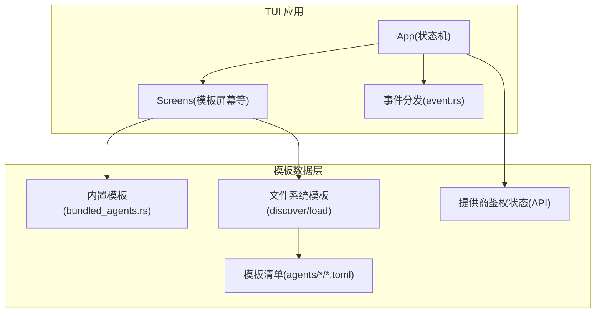
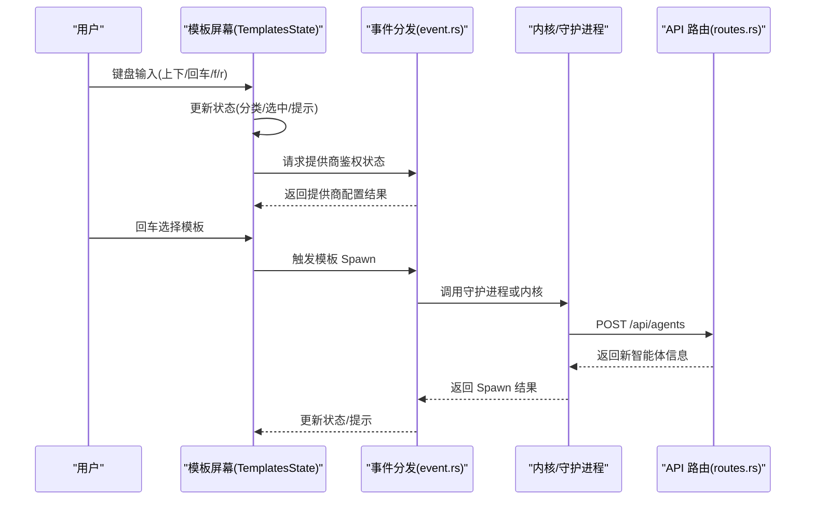
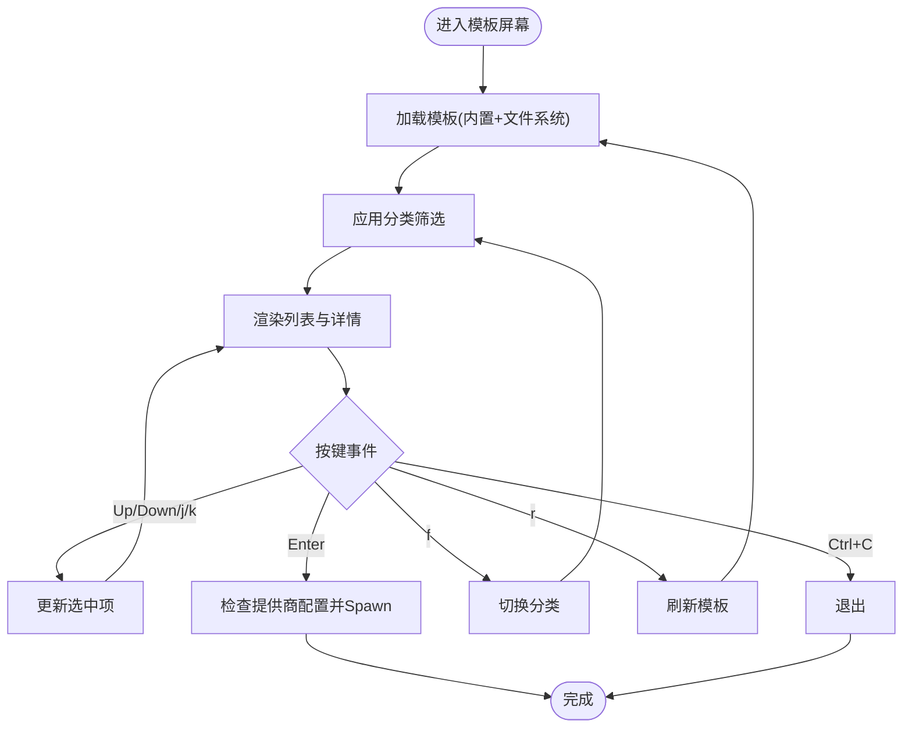
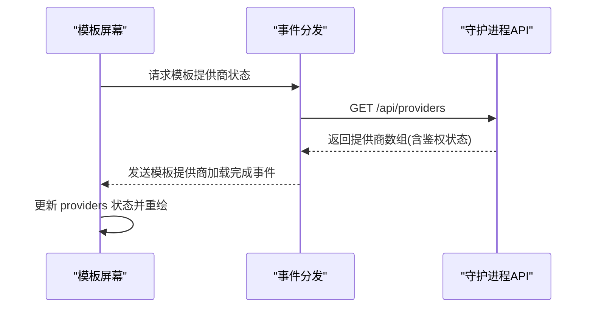
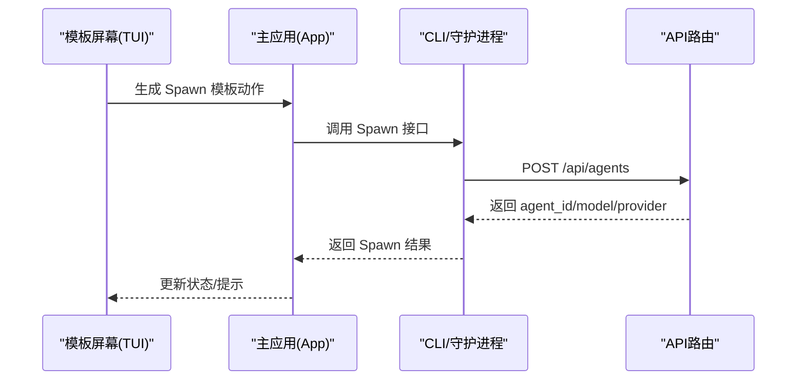
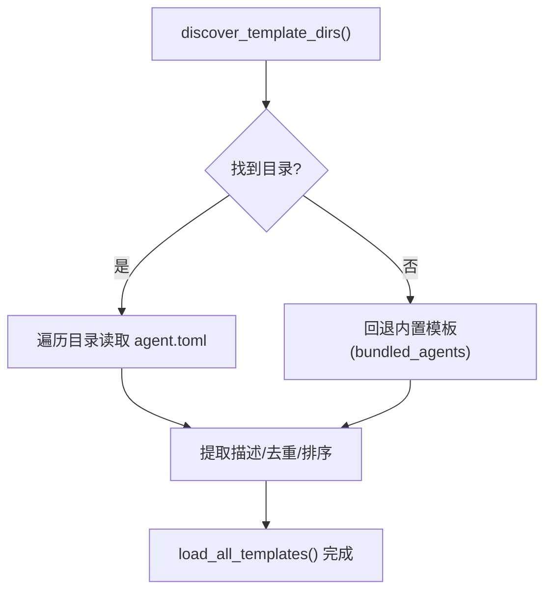
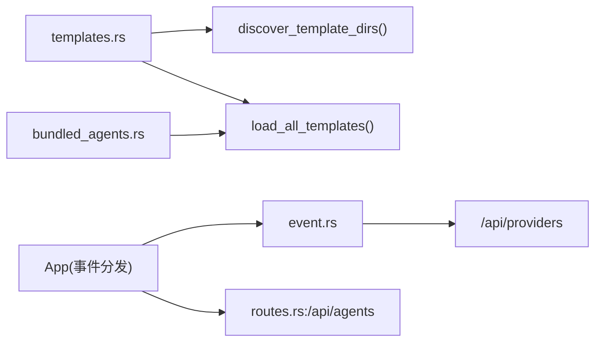

# 模板屏幕

<cite>
**本文引用的文件**
- [crates/openfang-cli/src/tui/screens/templates.rs](file://crates/openfang-cli/src/tui/screens/templates.rs)
- [crates/openfang-cli/src/tui/mod.rs](file://crates/openfang-cli/src/tui/mod.rs)
- [crates/openfang-cli/src/tui/screens/mod.rs](file://crates/openfang-cli/src/tui/screens/mod.rs)
- [crates/openfang-cli/src/tui/event.rs](file://crates/openfang-cli/src/tui/event.rs)
- [crates/openfang-cli/src/templates.rs](file://crates/openfang-cli/src/templates.rs)
- [crates/openfang-cli/src/bundled_agents.rs](file://crates/openfang-cli/src/bundled_agents.rs)
- [crates/openfang-api/src/routes.rs](file://crates/openfang-api/src/routes.rs)
- [crates/openfang-cli/src/main.rs](file://crates/openfang-cli/src/main.rs)
- [crates/openfang-cli/src/tui/screens/agents.rs](file://crates/openfang-cli/src/tui/screens/agents.rs)
- [agents/analyst/agent.toml](file://agents/analyst/agent.toml)
- [agents/architect/agent.toml](file://agents/architect/agent.toml)
</cite>

## 目录
1. [简介](#简介)
2. [项目结构](#项目结构)
3. [核心组件](#核心组件)
4. [架构总览](#架构总览)
5. [详细组件分析](#详细组件分析)
6. [依赖关系分析](#依赖关系分析)
7. [性能考量](#性能考量)
8. [故障排查指南](#故障排查指南)
9. [结论](#结论)
10. [附录](#附录)

## 简介
本文件面向 OpenFang TUI 的“模板屏幕”，系统性阐述智能体模板管理能力与交互流程，覆盖模板浏览、筛选、预览、一键启动（Spawn）等核心功能；并结合现有代码实现，说明模板的分类体系、内置模板、模板发现与加载机制、模板提供商鉴权状态、以及与 CLI 和 Web 前端模板选择流程的关系。文档同时给出模板开发最佳实践与社区分享建议，帮助用户高效使用与扩展模板生态。

## 项目结构
模板屏幕位于 TUI 子系统的 screens 模块中，通过统一的 App 生命周期与事件分发进行渲染与交互。模板数据来源包括：
- 内置模板：编译期嵌入的 30 个官方模板
- 文件系统模板：从用户安装目录或环境变量指定目录加载
- 外部 API 提供者：用于判断模板所需提供商是否已配置

**图表来源**
- [crates/openfang-cli/src/tui/mod.rs:14-17](file://crates/openfang-cli/src/tui/mod.rs#L14-L17)
- [crates/openfang-cli/src/tui/screens/mod.rs](file://crates/openfang-cli/src/tui/screens/mod.rs#L17)
- [crates/openfang-cli/src/tui/event.rs:1597-1627](file://crates/openfang-cli/src/tui/event.rs#L1597-L1627)
- [crates/openfang-cli/src/bundled_agents.rs:1-135](file://crates/openfang-cli/src/bundled_agents.rs#L1-L135)
- [crates/openfang-cli/src/templates.rs:15-62](file://crates/openfang-cli/src/templates.rs#L15-L62)

**章节来源**
- [crates/openfang-cli/src/tui/mod.rs:14-17](file://crates/openfang-cli/src/tui/mod.rs#L14-L17)
- [crates/openfang-cli/src/tui/screens/mod.rs](file://crates/openfang-cli/src/tui/screens/mod.rs#L17)

## 核心组件
- 模板信息模型与状态
  - 模板信息：名称、描述、分类、提供商、模型
  - 屏幕状态：模板列表、提供商鉴权、分类过滤、选中项、加载态、提示消息
- 分类体系
  - 支持 “All/General/Development/Research/Writing/Business” 共 6 个分类
- 关键交互
  - 上下移动、回车选择、f 切换分类、r 刷新、Ctrl+C 退出
- 渲染布局
  - 顶部：分类过滤与表头
  - 中部：模板列表（含提供商/模型徽章）
  - 底部：详情预览与状态提示/快捷键提示

**章节来源**
- [crates/openfang-cli/src/tui/screens/templates.rs:13-26](file://crates/openfang-cli/src/tui/screens/templates.rs#L13-L26)
- [crates/openfang-cli/src/tui/screens/templates.rs:105-112](file://crates/openfang-cli/src/tui/screens/templates.rs#L105-L112)
- [crates/openfang-cli/src/tui/screens/templates.rs:116-125](file://crates/openfang-cli/src/tui/screens/templates.rs#L116-L125)
- [crates/openfang-cli/src/tui/screens/templates.rs:190-234](file://crates/openfang-cli/src/tui/screens/templates.rs#L190-L234)
- [crates/openfang-cli/src/tui/screens/templates.rs:239-396](file://crates/openfang-cli/src/tui/screens/templates.rs#L239-L396)

## 架构总览
模板屏幕在 TUI 应用中的职责是：展示模板、根据提供商鉴权状态提示可用性、支持分类筛选与快速选择，并触发“Spawn 智能体”的后续流程。

**图表来源**
- [crates/openfang-cli/src/tui/screens/templates.rs:190-234](file://crates/openfang-cli/src/tui/screens/templates.rs#L190-L234)
- [crates/openfang-cli/src/tui/event.rs:1597-1627](file://crates/openfang-cli/src/tui/event.rs#L1597-L1627)
- [crates/openfang-api/src/routes.rs:45-77](file://crates/openfang-api/src/routes.rs#L45-L77)

## 详细组件分析

### 组件一：模板列表与筛选
- 数据来源
  - 内置模板：通过编译期嵌入，保证首次使用即可创建
  - 文件系统模板：从用户安装目录或环境变量目录扫描 agent.toml
  - 合并去重后按名称排序
- 分类筛选
  - 使用循环索引切换当前分类，All 表示不过滤
- 鉴权徽章
  - 根据提供商配置状态显示“已配置/未配置”
- 交互行为
  - Up/Down/j/k 移动光标
  - Enter 选择并尝试 Spawn
  - f 切换分类
  - r 触发刷新
  - Ctrl+C 退出

**图表来源**
- [crates/openfang-cli/src/tui/screens/templates.rs:134-182](file://crates/openfang-cli/src/tui/screens/templates.rs#L134-L182)
- [crates/openfang-cli/src/tui/screens/templates.rs:190-234](file://crates/openfang-cli/src/tui/screens/templates.rs#L190-L234)

**章节来源**
- [crates/openfang-cli/src/tui/screens/templates.rs:30-101](file://crates/openfang-cli/src/tui/screens/templates.rs#L30-L101)
- [crates/openfang-cli/src/templates.rs:15-62](file://crates/openfang-cli/src/templates.rs#L15-L62)
- [crates/openfang-cli/src/bundled_agents.rs:1-135](file://crates/openfang-cli/src/bundled_agents.rs#L1-L135)

### 组件二：模板提供商鉴权状态
- 获取方式
  - 通过后台请求 /api/providers，解析返回的提供商数组
  - 将 “configured/not_required” 视为已配置
- 屏幕表现
  - 在模板列表右侧显示徽章，提示当前模板所需的提供商是否可用
  - 若不可用，会显示提示信息，引导用户前往设置页配置

**图表来源**
- [crates/openfang-cli/src/tui/event.rs:1597-1627](file://crates/openfang-cli/src/tui/event.rs#L1597-L1627)
- [crates/openfang-cli/src/tui/screens/templates.rs:184-188](file://crates/openfang-cli/src/tui/screens/templates.rs#L184-L188)

**章节来源**
- [crates/openfang-cli/src/tui/event.rs:1597-1627](file://crates/openfang-cli/src/tui/event.rs#L1597-L1627)
- [crates/openfang-cli/src/tui/screens/templates.rs:184-188](file://crates/openfang-cli/src/tui/screens/templates.rs#L184-L188)

### 组件三：模板 Spawn 流程（CLI 与 TUI）
- TUI 侧
  - 选中模板后，若提供商未配置则提示；否则触发 Spawn 动作
- CLI 侧
  - 解析模板名或交互选择模板，调用守护进程或内核 Spawn
  - 守护进程路由负责校验模板名并读取 agent.toml，最终返回新智能体 ID 与模型信息

**图表来源**
- [crates/openfang-cli/src/tui/screens/templates.rs:211-224](file://crates/openfang-cli/src/tui/screens/templates.rs#L211-L224)
- [crates/openfang-api/src/routes.rs:45-77](file://crates/openfang-api/src/routes.rs#L45-L77)
- [crates/openfang-cli/src/main.rs:1837-1864](file://crates/openfang-cli/src/main.rs#L1837-L1864)

**章节来源**
- [crates/openfang-cli/src/tui/screens/templates.rs:211-224](file://crates/openfang-cli/src/tui/screens/templates.rs#L211-L224)
- [crates/openfang-api/src/routes.rs:45-77](file://crates/openfang-api/src/routes.rs#L45-L77)
- [crates/openfang-cli/src/main.rs:1837-1864](file://crates/openfang-cli/src/main.rs#L1837-L1864)

### 组件四：模板清单与加载机制
- 模板发现路径
  - 开发构建：从可执行文件向上查找 agents 目录
  - 用户安装：OPENFANG_HOME 或 ~/.openfang 下的 agents 目录
  - 环境变量：OPENFANG_AGENTS_DIR 覆盖
- 加载策略
  - 优先扫描文件系统模板，再回退到内置模板
  - 过滤掉重复名称与特殊目录，提取描述字段用于显示
- 内置模板
  - 编译期嵌入 30 个官方模板，确保首次使用即可用

**图表来源**
- [crates/openfang-cli/src/templates.rs:19-62](file://crates/openfang-cli/src/templates.rs#L19-L62)
- [crates/openfang-cli/src/templates.rs:65-111](file://crates/openfang-cli/src/templates.rs#L65-L111)
- [crates/openfang-cli/src/bundled_agents.rs:1-135](file://crates/openfang-cli/src/bundled_agents.rs#L1-L135)

**章节来源**
- [crates/openfang-cli/src/templates.rs:15-125](file://crates/openfang-cli/src/templates.rs#L15-L125)
- [crates/openfang-cli/src/bundled_agents.rs:1-135](file://crates/openfang-cli/src/bundled_agents.rs#L1-L135)

### 组件五：与“智能体选择/创建”屏幕的衔接
- 模板屏幕与“智能体选择/创建”屏幕共享相同的入口与导航
- 模板屏幕主要负责“模板浏览与 Spawn”，而“智能体选择/创建”屏幕提供更丰富的自定义构建流程（工具、技能、MCP 等）

**章节来源**
- [crates/openfang-cli/src/tui/mod.rs:64-84](file://crates/openfang-cli/src/tui/mod.rs#L64-L84)
- [crates/openfang-cli/src/tui/screens/agents.rs:28-56](file://crates/openfang-cli/src/tui/screens/agents.rs#L28-L56)

## 依赖关系分析
- 模板屏幕依赖
  - 模板数据：内置模板 + 文件系统模板
  - 提供商鉴权：通过事件分发获取 /api/providers
  - 渲染：基于 ratatui 的 List/Paragraph/Block 组件
- 事件与路由
  - 模板提供商状态事件：AppEvent::TemplateProvidersLoaded
  - Spawn 模板：通过守护进程 API POST /api/agents

**图表来源**
- [crates/openfang-cli/src/tui/screens/templates.rs:116-125](file://crates/openfang-cli/src/tui/screens/templates.rs#L116-L125)
- [crates/openfang-cli/src/tui/event.rs:1597-1627](file://crates/openfang-cli/src/tui/event.rs#L1597-L1627)
- [crates/openfang-api/src/routes.rs:45-77](file://crates/openfang-api/src/routes.rs#L45-L77)

**章节来源**
- [crates/openfang-cli/src/tui/event.rs:1597-1627](file://crates/openfang-cli/src/tui/event.rs#L1597-L1627)
- [crates/openfang-api/src/routes.rs:45-77](file://crates/openfang-api/src/routes.rs#L45-L77)

## 性能考量
- 模板加载
  - 文件系统扫描与 TOML 描述提取为轻量操作，复杂度近似 O(N)（N 为模板数量）
  - 内置模板直接嵌入，避免磁盘 IO，提升首次启动体验
- 渲染与交互
  - 列表渲染采用增量更新与局部重绘，键盘事件响应即时
  - 分类筛选为内存过滤，开销极低
- 并发与异步
  - 提供商鉴权状态通过独立线程拉取，不阻塞 UI 主循环

[本节为通用性能讨论，无需特定文件引用]

## 故障排查指南
- 无法看到任何模板
  - 检查 OPENFANG_HOME 或 ~/.openfang 是否存在 agents 目录
  - 确认 OPENFANG_AGENTS_DIR 是否正确设置
  - 若无文件系统模板，应能看到内置模板回退
- 模板提供商未配置
  - 列表右侧徽章显示未配置，需前往设置页添加对应提供商密钥
- Spawn 失败
  - 查看状态栏提示信息，确认模板名称有效且 agent.toml 可读
  - 检查守护进程 /api/agents 路由返回的错误信息

**章节来源**
- [crates/openfang-cli/src/templates.rs:19-62](file://crates/openfang-cli/src/templates.rs#L19-L62)
- [crates/openfang-cli/src/tui/screens/templates.rs:215-222](file://crates/openfang-cli/src/tui/screens/templates.rs#L215-L222)
- [crates/openfang-api/src/routes.rs:45-77](file://crates/openfang-api/src/routes.rs#L45-L77)

## 结论
模板屏幕以简洁直观的方式提供了模板浏览、分类筛选与一键 Spawn 的核心能力。其数据来源灵活（内置+文件系统），并与提供商鉴权状态联动，确保用户在合适的环境下创建智能体。配合 CLI 与 Web 前端的模板选择流程，形成完整的模板生态入口。未来可在模板搜索、版本管理、导入导出等方面进一步增强，以满足更复杂的模板管理需求。

[本节为总结性内容，无需特定文件引用]

## 附录

### 模板清单与示例
- 示例模板（节选）
  - [analyst/agent.toml:1-50](file://agents/analyst/agent.toml#L1-L50)
  - [architect/agent.toml:1-46](file://agents/architect/agent.toml#L1-L46)

**章节来源**
- [agents/analyst/agent.toml:1-50](file://agents/analyst/agent.toml#L1-L50)
- [agents/architect/agent.toml:1-46](file://agents/architect/agent.toml#L1-L46)

### 模板开发最佳实践
- 模板命名与目录
  - 每个模板一个独立目录，包含 agent.toml
- 描述与元信息
  - 在 agent.toml 中提供清晰的 description，便于模板列表展示
- 资源与能力
  - 明确声明所需工具、网络访问、内存权限等，避免运行时权限不足
- 版本与兼容
  - 在 agent.toml 中声明版本号，便于升级与迁移
- 社区分享
  - 将模板打包为独立仓库，README 包含使用说明与截图
  - 提交至官方模板市场或社区渠道，便于他人发现与复用

[本节为通用指导，无需特定文件引用]