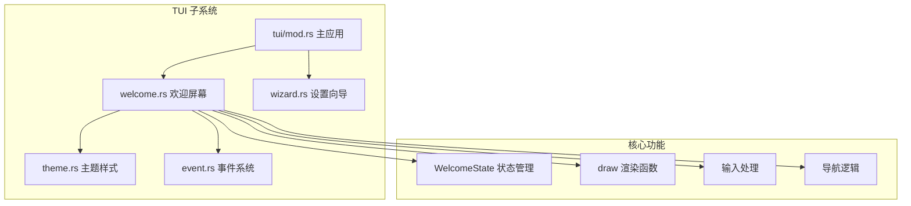
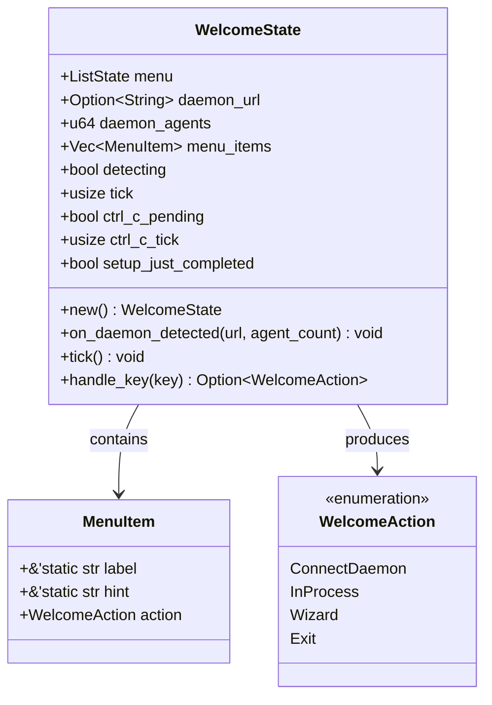
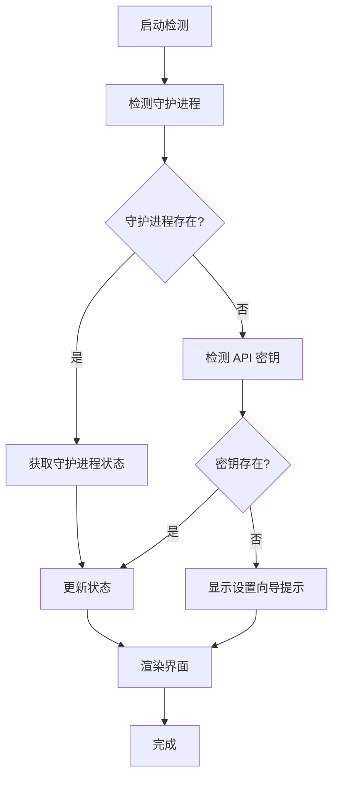
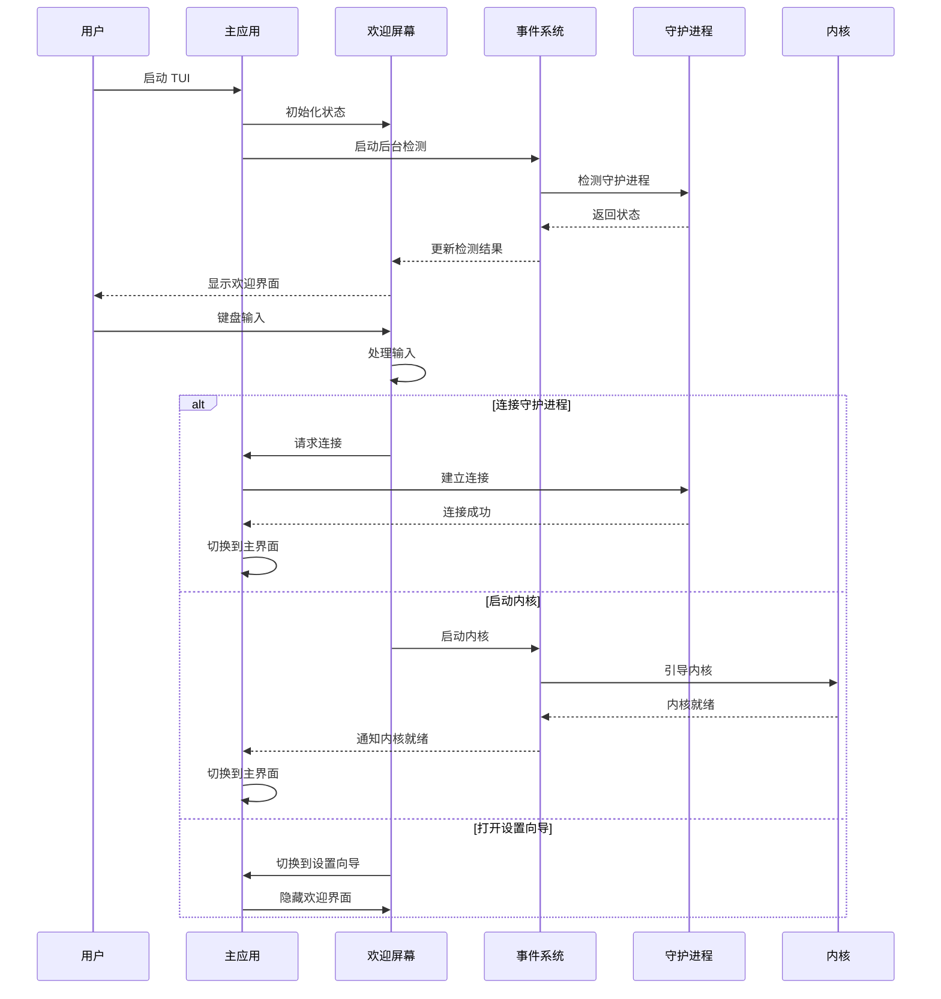
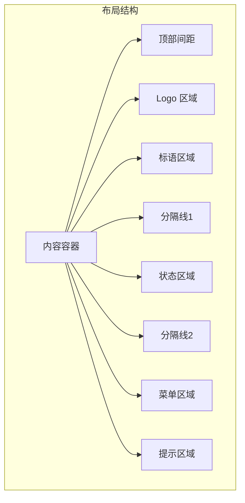
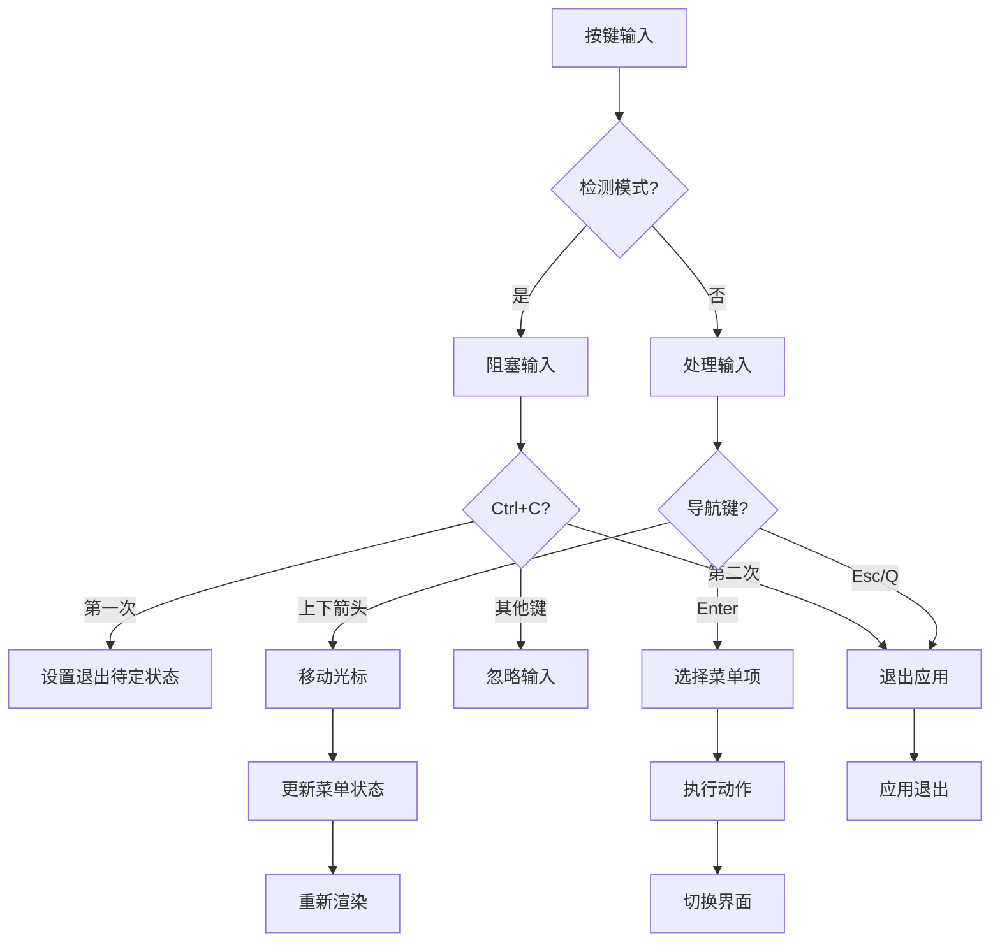
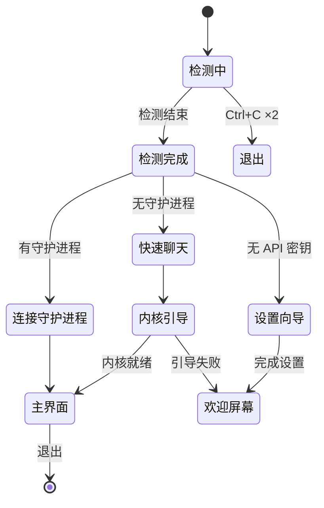
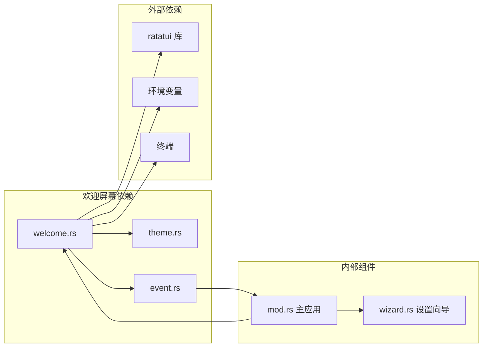

# 欢迎屏幕

<cite>
**本文档引用的文件**
- [welcome.rs](file://crates/openfang-cli/src/tui/screens/welcome.rs)
- [theme.rs](file://crates/openfang-cli/src/tui/theme.rs)
- [event.rs](file://crates/openfang-cli/src/tui/event.rs)
- [mod.rs](file://crates/openfang-cli/src/tui/mod.rs)
- [wizard.rs](file://crates/openfang-cli/src/tui/screens/wizard.rs)
- [main.rs](file://crates/openfang-cli/src/main.rs)
</cite>

## 目录
1. [简介](#简介)
2. [项目结构](#项目结构)
3. [核心组件](#核心组件)
4. [架构概览](#架构概览)
5. [详细组件分析](#详细组件分析)
6. [依赖关系分析](#依赖关系分析)
7. [性能考虑](#性能考虑)
8. [故障排除指南](#故障排除指南)
9. [结论](#结论)

## 简介

OpenFang TUI 欢迎屏幕是用户首次进入 OpenFang 终端界面时看到的核心入口界面。该屏幕提供了品牌化展示、系统状态检测、启动选项选择等关键功能，是用户与 OpenFang 系统交互的第一站。

欢迎屏幕的主要功能包括：
- 品牌化 ASCII 艺术标题展示
- 系统环境检测（守护进程、API 密钥）
- 启动模式选择（连接守护进程、本地内核、设置向导）
- 实时状态更新和用户交互反馈
- 平滑的动画效果和视觉设计

## 项目结构

欢迎屏幕位于 OpenFang CLI 的 TUI 子系统中，采用模块化设计：

**图表来源**
- [mod.rs:1-800](file://crates/openfang-cli/src/tui/mod.rs#L1-L800)
- [welcome.rs:1-434](file://crates/openfang-cli/src/tui/screens/welcome.rs#L1-L434)

**章节来源**
- [mod.rs:1-800](file://crates/openfang-cli/src/tui/mod.rs#L1-L800)
- [welcome.rs:1-434](file://crates/openfang-cli/src/tui/screens/welcome.rs#L1-L434)

## 核心组件

### 状态管理系统

欢迎屏幕采用集中式状态管理模式，通过 `WelcomeState` 结构体管理所有界面状态：

**图表来源**
- [welcome.rs:59-90](file://crates/openfang-cli/src/tui/screens/welcome.rs#L59-L90)

### 系统检测机制

欢迎屏幕实现了多层系统检测，确保为用户提供准确的系统状态信息：

**图表来源**
- [welcome.rs:48-55](file://crates/openfang-cli/src/tui/screens/welcome.rs#L48-L55)
- [welcome.rs:109-115](file://crates/openfang-cli/src/tui/screens/welcome.rs#L109-L115)

**章节来源**
- [welcome.rs:48-115](file://crates/openfang-cli/src/tui/screens/welcome.rs#L48-L115)

## 架构概览

欢迎屏幕在整个 TUI 应用中的位置和交互关系：

**图表来源**
- [mod.rs:1259-1284](file://crates/openfang-cli/src/tui/mod.rs#L1259-L1284)
- [event.rs:242-263](file://crates/openfang-cli/src/tui/event.rs#L242-L263)

**章节来源**
- [mod.rs:1259-1284](file://crates/openfang-cli/src/tui/mod.rs#L1259-L1284)
- [event.rs:242-263](file://crates/openfang-cli/src/tui/event.rs#L242-L263)

## 详细组件分析

### 界面布局系统

欢迎屏幕采用响应式布局设计，能够适应不同终端尺寸：

**图表来源**
- [welcome.rs:255-274](file://crates/openfang-cli/src/tui/screens/welcome.rs#L255-L274)

#### Logo 显示逻辑

欢迎屏幕支持两种 Logo 显示模式：

| 模式 | 条件 | 高度 | 特点 |
|------|------|------|------|
| 全尺寸 Logo | 终端宽度 ≥ 75 字符 | 6 行 | 包含完整的 ASCII 艺术 |
| 紧凑 Logo | 终端宽度 < 75 字符 | 1 行 | 简化的文本标识 |

**章节来源**
- [welcome.rs:14-26](file://crates/openfang-cli/src/tui/screens/welcome.rs#L14-L26)
- [welcome.rs:277-291](file://crates/openfang-cli/src/tui/screens/welcome.rs#L277-L291)

### 输入处理机制

欢迎屏幕实现了丰富的键盘交互功能：

**图表来源**
- [welcome.rs:152-211](file://crates/openfang-cli/src/tui/screens/welcome.rs#L152-L211)

#### 双重 Ctrl+C 退出机制

为了防止误操作，欢迎屏幕实现了双重 Ctrl+C 退出保护：

| 状态 | 行为 | 提示 |
|------|------|------|
| 初始状态 | 接受 Ctrl+C | 显示"再次按 Ctrl+C 退出"提示 |
| 第一次 Ctrl+C | 设置待定状态 | 保持应用运行 |
| 第二次 Ctrl+C | 立即退出 | 完成应用退出 |

**章节来源**
- [welcome.rs:152-182](file://crates/openfang-cli/src/tui/screens/welcome.rs#L152-L182)
- [welcome.rs:144-150](file://crates/openfang-cli/src/tui/screens/welcome.rs#L144-L150)

### 状态管理与导航

欢迎屏幕的状态管理采用有限状态机设计：

**图表来源**
- [welcome.rs:117-142](file://crates/openfang-cli/src/tui/screens/welcome.rs#L117-L142)
- [mod.rs:1259-1284](file://crates/openfang-cli/src/tui/mod.rs#L1259-L1284)

**章节来源**
- [welcome.rs:117-142](file://crates/openfang-cli/src/tui/screens/welcome.rs#L117-L142)
- [mod.rs:1259-1284](file://crates/openfang-cli/src/tui/mod.rs#L1259-L1284)

### 视觉设计系统

欢迎屏幕采用统一的主题设计系统：

| 设计元素 | 颜色值 | 用途 |
|----------|--------|------|
| 主色调 | #FF5C00 | 品牌标识、选中状态 |
| 背景色 | #0F0E0E | 主背景 |
| 卡片色 | #1F1D1C | 控件背景 |
| 文本色 | #F0EFEE | 主要文本 |
| 辅助色 | #A8A29E | 次要文本 |
| 成功色 | #22C55E | 状态指示 |
| 警告色 | #EAB308 | 警告状态 |
| 错误色 | #EF4444 | 错误状态 |

**章节来源**
- [theme.rs:11-31](file://crates/openfang-cli/src/tui/theme.rs#L11-L31)
- [theme.rs:136-139](file://crates/openfang-cli/src/tui/theme.rs#L136-L139)

## 依赖关系分析

欢迎屏幕与其他组件的依赖关系：

**图表来源**
- [welcome.rs:3-10](file://crates/openfang-cli/src/tui/screens/welcome.rs#L3-L10)
- [mod.rs:10-18](file://crates/openfang-cli/src/tui/mod.rs#L10-L18)

### 关键依赖说明

1. **ratatui 库依赖**：用于终端 UI 渲染和事件处理
2. **环境变量检测**：用于 API 密钥和配置检测
3. **后台事件系统**：用于非阻塞的系统状态检测
4. **主题系统**：提供一致的视觉设计

**章节来源**
- [welcome.rs:3-10](file://crates/openfang-cli/src/tui/screens/welcome.rs#L3-L10)
- [event.rs:1-28](file://crates/openfang-cli/src/tui/event.rs#L1-L28)

## 性能考虑

### 渲染优化

欢迎屏幕采用了多项性能优化策略：

1. **条件渲染**：根据终端尺寸动态调整布局
2. **增量更新**：只在状态变化时重新渲染相关区域
3. **动画节流**：控制动画帧率避免过度 CPU 使用

### 内存管理

- 使用 `Option<T>` 类型避免不必要的内存分配
- 合理的字符串处理减少内存拷贝
- 状态对象的生命周期管理

### 网络请求优化

- 异步守护进程检测，避免阻塞主线程
- 超时控制防止长时间等待
- 失败重试机制

## 故障排除指南

### 常见问题及解决方案

#### 问题：欢迎屏幕无法检测到守护进程

**可能原因**：
- 守护进程未启动
- 网络连接问题
- 端口被占用

**解决方案**：
1. 检查守护进程状态：`openfang status`
2. 确认网络连接正常
3. 检查防火墙设置
4. 尝试重启守护进程

#### 问题：API 密钥检测失败

**可能原因**：
- 环境变量未正确设置
- 密钥格式不正确
- 网络连接问题

**解决方案**：
1. 检查环境变量：`echo $OPENAI_API_KEY`
2. 验证密钥格式
3. 测试网络连接
4. 使用设置向导重新配置

#### 问题：键盘输入无响应

**可能原因**：
- 终端不支持某些按键序列
- 输入法冲突
- 终端编码问题

**解决方案**：
1. 尝试不同的终端
2. 检查输入法设置
3. 确认终端编码为 UTF-8
4. 使用备用按键组合

### 调试技巧

1. **启用调试模式**：在启动时添加调试参数
2. **查看日志文件**：检查应用日志获取详细信息
3. **简化测试**：使用最小化配置进行测试
4. **网络诊断**：使用 `ping` 和 `curl` 测试网络连接

**章节来源**
- [welcome.rs:152-211](file://crates/openfang-cli/src/tui/screens/welcome.rs#L152-L211)
- [event.rs:242-263](file://crates/openfang-cli/src/tui/event.rs#L242-L263)

## 结论

OpenFang TUI 欢迎屏幕是一个设计精良、功能完整的用户界面组件。它通过以下特点体现了高质量的软件设计：

1. **用户体验优先**：直观的界面设计和流畅的交互体验
2. **系统集成良好**：与整个 TUI 系统无缝集成
3. **可扩展性强**：模块化设计便于功能扩展
4. **错误处理完善**：全面的错误处理和用户反馈机制
5. **性能优化到位**：高效的渲染和资源管理

欢迎屏幕不仅提供了基础的系统检测和导航功能，更重要的是为用户建立了对 OpenFang 系统的信任感和使用信心。其设计充分考虑了不同用户的技术水平和使用场景，是 OpenFang 用户体验的重要组成部分。

通过持续的优化和改进，欢迎屏幕将继续为 OpenFang 生态系统的用户带来优秀的交互体验。