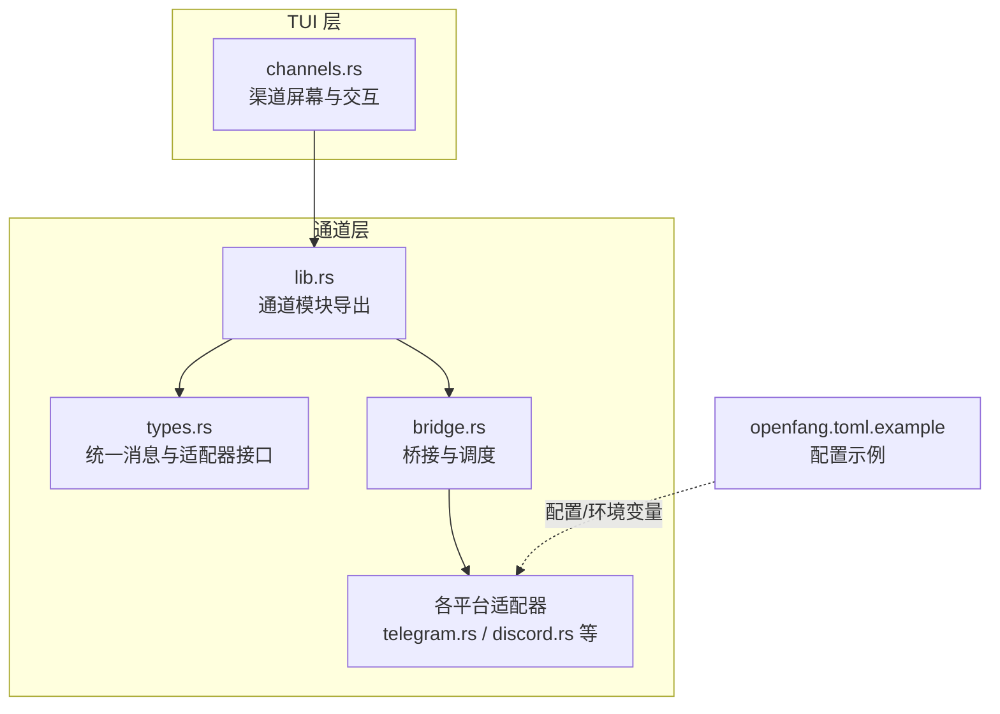
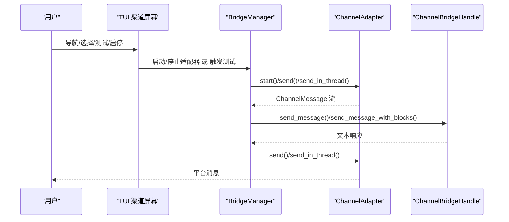
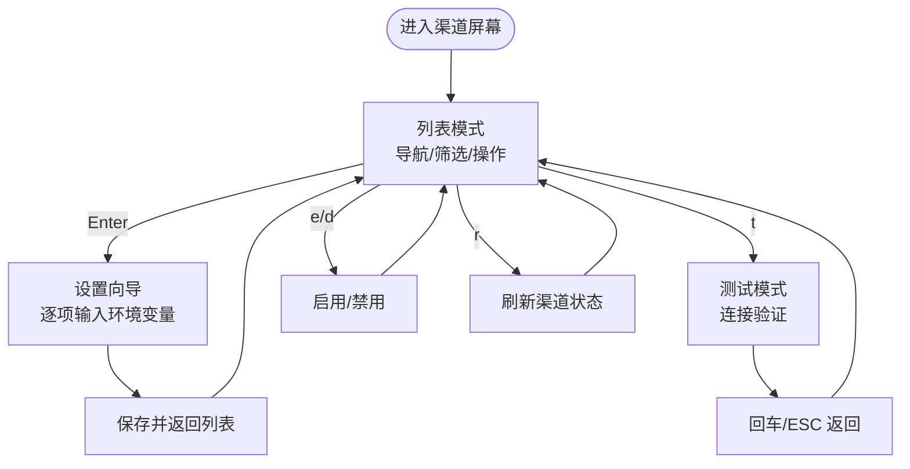
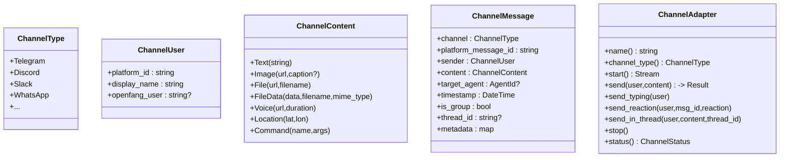
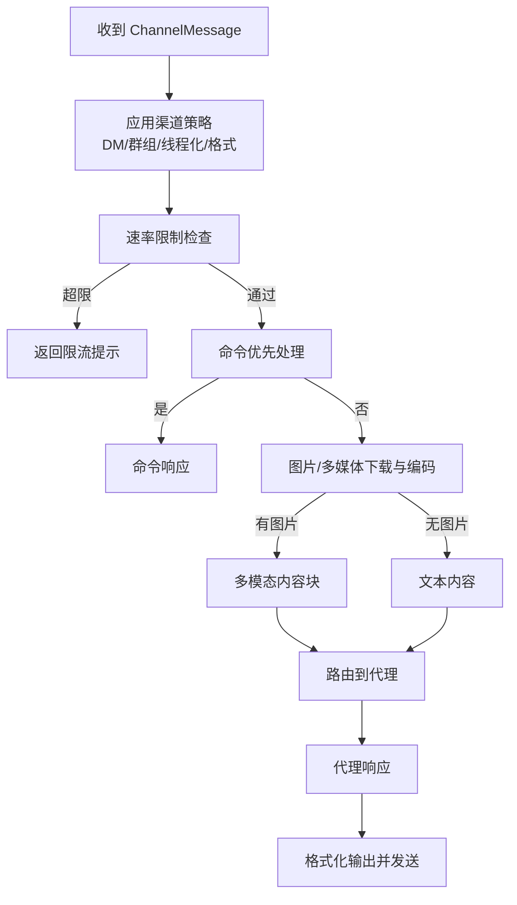
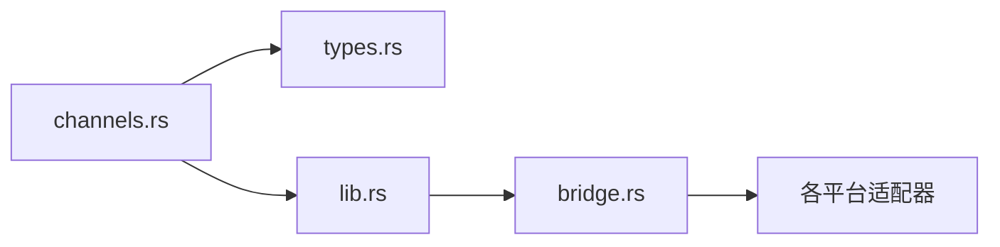

# 渠道屏幕

<cite>
**本文档引用的文件**
- [channels.rs](file://crates/openfang-cli/src/tui/screens/channels.rs)
- [lib.rs](file://crates/openfang-channels/src/lib.rs)
- [types.rs](file://crates/openfang-channels/src/types.rs)
- [bridge.rs](file://crates/openfang-channels/src/bridge.rs)
- [telegram.rs](file://crates/openfang-channels/src/telegram.rs)
- [discord.rs](file://crates/openfang-channels/src/discord.rs)
- [openfang.toml.example](file://openfang.toml.example)
</cite>

## 目录
1. [简介](#简介)
2. [项目结构](#项目结构)
3. [核心组件](#核心组件)
4. [架构总览](#架构总览)
5. [详细组件分析](#详细组件分析)
6. [依赖关系分析](#依赖关系分析)
7. [性能考虑](#性能考虑)
8. [故障排除指南](#故障排除指南)
9. [结论](#结论)
10. [附录](#附录)

## 简介
本文件面向 OpenFang TUI 的“渠道屏幕”，系统性阐述消息渠道管理功能：包括渠道列表、渠道配置、连接测试、消息转发与策略控制。文档覆盖 40 种适配器的统一抽象、认证与环境变量、消息格式与输出渲染、速率限制与线程化回复、以及 TUI 屏幕的交互流程（导航、筛选、设置向导、测试与启停）。

## 项目结构
- TUI 渠道屏幕位于 CLI 子工程，负责展示与操作渠道；通道适配器与桥接逻辑位于 openfang-channels 子工程，负责与平台对接、消息分发与策略执行。
- 配置示例位于根目录，展示如何通过环境变量与配置文件进行渠道接入。

图示来源
- [channels.rs:1-945](file://crates/openfang-cli/src/tui/screens/channels.rs#L1-L945)
- [lib.rs:1-55](file://crates/openfang-channels/src/lib.rs#L1-L55)
- [types.rs:1-478](file://crates/openfang-channels/src/types.rs#L1-L478)
- [bridge.rs:1-1982](file://crates/openfang-channels/src/bridge.rs#L1-L1982)
- [telegram.rs:1-800](file://crates/openfang-channels/src/telegram.rs#L1-L800)
- [discord.rs:1-200](file://crates/openfang-channels/src/discord.rs#L1-L200)
- [openfang.toml.example:1-49](file://openfang.toml.example#L1-L49)

章节来源
- [channels.rs:1-945](file://crates/openfang-cli/src/tui/screens/channels.rs#L1-L945)
- [lib.rs:1-55](file://crates/openfang-channels/src/lib.rs#L1-L55)
- [openfang.toml.example:1-49](file://openfang.toml.example#L1-L49)

## 核心组件
- 渠道信息模型与状态机
  - 渠道信息：名称、显示名、分类、状态、环境变量集合、启用标记。
  - 渠道状态：已就绪、缺少环境变量、未配置。
  - 子屏幕：列表、设置向导、测试中。
- 通道类型与统一消息
  - ChannelType：抽象所有支持的渠道类型。
  - ChannelMessage：跨平台统一的消息事件，包含发送者、内容、时间戳、是否群聊、线程 ID、元数据等。
  - ChannelAdapter 接口：start/send/send_typing/send_reaction/send_in_thread/stop/status。
- 桥接与调度
  - BridgeManager：启动适配器、订阅消息流、并发派发、速率限制、生命周期反应、错误清洗与重解析。
  - ChannelBridgeHandle：内核能力接口（会话、模型、技能、工作流、触发器、预算、网络等）。
- 输出格式与线程化
  - 不同渠道默认输出格式不同，支持按渠道覆盖。
  - 支持线程化回复（论坛主题等），并带持续打字指示刷新。

章节来源
- [channels.rs:13-373](file://crates/openfang-cli/src/tui/screens/channels.rs#L13-L373)
- [types.rs:12-280](file://crates/openfang-channels/src/types.rs#L12-L280)
- [bridge.rs:27-382](file://crates/openfang-channels/src/bridge.rs#L27-L382)

## 架构总览
下图展示从 TUI 到通道适配器再到内核的端到端路径，以及消息在内核侧的路由与策略应用。

图示来源
- [channels.rs:454-624](file://crates/openfang-cli/src/tui/screens/channels.rs#L454-L624)
- [bridge.rs:271-382](file://crates/openfang-channels/src/bridge.rs#L271-L382)
- [types.rs:215-280](file://crates/openfang-channels/src/types.rs#L215-L280)

## 详细组件分析

### TUI 渠道屏幕（channels.rs）
- 数据结构
  - ChannelInfo：渠道基本信息与状态。
  - ChannelStatus：Ready/MissingEnv/NotConfigured。
  - ChannelState：子屏幕、渠道列表、过滤器、设置向导状态、测试结果、状态提示。
- 行为与交互
  - 列表页：上下移动、Tab 切换分类、Enter 进入设置、t 键测试、e/d 启用/禁用、r 刷新。
  - 设置向导：逐项收集环境变量值，生成 TOML 预览，保存后返回列表。
  - 测试页：显示测试进度与结果，支持回车/ESC 返回。
- 绘制
  - 列表页：分类标签、表头、条目（状态徽章、环境变量摘要）、快捷键提示。
  - 设置页：标题/描述、字段序号、输入框、TOML 预览、提示。
  - 测试页：标题、加载/成功/失败状态、提示。

图示来源
- [channels.rs:454-624](file://crates/openfang-cli/src/tui/screens/channels.rs#L454-L624)
- [channels.rs:628-945](file://crates/openfang-cli/src/tui/screens/channels.rs#L628-L945)

章节来源
- [channels.rs:13-373](file://crates/openfang-cli/src/tui/screens/channels.rs#L13-L373)
- [channels.rs:454-624](file://crates/openfang-cli/src/tui/screens/channels.rs#L454-L624)
- [channels.rs:628-945](file://crates/openfang-cli/src/tui/screens/channels.rs#L628-L945)

### 通道类型与统一消息（types.rs）
- ChannelType：抽象 40+ 平台类型。
- ChannelUser/ChannelContent：统一的用户与内容模型，支持文本、图片、文件、语音、位置、命令等。
- ChannelMessage：跨平台统一事件，携带路由所需元数据（群聊标识、线程 ID、自定义元数据）。
- ChannelAdapter 接口：定义适配器必须实现的方法集，含可选的生命周期反应与线程化发送。

图示来源
- [types.rs:12-280](file://crates/openfang-channels/src/types.rs#L12-L280)

章节来源
- [types.rs:12-280](file://crates/openfang-channels/src/types.rs#L12-L280)

### 桥接与调度（bridge.rs）
- BridgeManager
  - 订阅适配器消息流，为每条消息派发到内核，使用信号量限制并发，避免内存膨胀。
  - 提供 ChannelRateLimiter：按用户与渠道类型统计近一分钟内的消息数，超过阈值则阻断。
- 路由与策略
  - 按渠道覆盖策略：DM/群组策略、输出格式、线程化、生命周期反应。
  - 命令优先：识别斜杠命令与 ChannelContent::Command，先走命令处理。
  - 图片/多媒体：下载并编码为多模态内容块，再路由给内核。
  - 广播：支持并行/串行广播到多个代理。
- 错误处理与用户体验
  - 错误清洗：对常见错误（限流、鉴权、上下文超限、服务过载、超时、模型不存在）进行友好提示。
  - 生命周期反应：在支持的渠道上展示“排队/思考/完成/错误”等表情反馈。
  - 打字指示：长轮询/心跳刷新，保持体验连贯。

图示来源
- [bridge.rs:526-1010](file://crates/openfang-channels/src/bridge.rs#L526-L1010)

章节来源
- [bridge.rs:271-382](file://crates/openfang-channels/src/bridge.rs#L271-L382)
- [bridge.rs:526-1010](file://crates/openfang-channels/src/bridge.rs#L526-L1010)
- [bridge.rs:1012-1080](file://crates/openfang-channels/src/bridge.rs#L1012-L1080)

### 典型通道适配器（Telegram/Discord）
- TelegramAdapter
  - 使用 getUpdates 长轮询，指数退避；支持清理 webhook、@提及检测、文件下载、HTML 解析与长度切分。
  - 发送支持文本、图片、文档、语音、位置、命令；支持线程化回复与反应。
- DiscordAdapter
  - 使用网关 WebSocket（v10）接收消息，REST API 发送；支持意图、会话恢复、打字指示。
  - 发送内容长度限制与切分处理。

章节来源
- [telegram.rs:408-596](file://crates/openfang-channels/src/telegram.rs#L408-L596)
- [telegram.rs:600-645](file://crates/openfang-channels/src/telegram.rs#L600-L645)
- [discord.rs:148-198](file://crates/openfang-channels/src/discord.rs#L148-L198)

### 配置与认证
- 环境变量驱动
  - 大多数渠道通过环境变量注入令牌（如 TELEGRAM_BOT_TOKEN、DISCORD_BOT_TOKEN、SLACK_BOT_TOKEN/APP_TOKEN 等）。
  - TUI 在构建默认渠道列表时会检测这些变量是否存在，并据此标注 Ready/MissingEnv/NotConfigured。
- 配置文件
  - 示例配置文件展示了如何在配置文件中声明渠道段落与令牌来源（bot_token_env 等）。
- 通道覆盖策略
  - 可在内核侧为特定渠道设置 DM/群组策略、速率限制、输出格式、线程化与生命周期反应开关。

章节来源
- [channels.rs:424-452](file://crates/openfang-cli/src/tui/screens/channels.rs#L424-L452)
- [openfang.toml.example:31-49](file://openfang.toml.example#L31-L49)
- [bridge.rs:539-555](file://crates/openfang-channels/src/bridge.rs#L539-L555)

## 依赖关系分析
- TUI 仅依赖通道定义与状态，不直接依赖具体适配器实现。
- 通道层通过 lib.rs 汇聚所有适配器模块，types.rs 定义统一接口，bridge.rs 实现调度与策略。
- 适配器各自封装平台差异（HTTP/WS、长轮询、意图等），向上提供一致的 ChannelAdapter 接口。

图示来源
- [channels.rs:1-945](file://crates/openfang-cli/src/tui/screens/channels.rs#L1-L945)
- [lib.rs:1-55](file://crates/openfang-channels/src/lib.rs#L1-L55)
- [types.rs:1-478](file://crates/openfang-channels/src/types.rs#L1-L478)
- [bridge.rs:1-1982](file://crates/openfang-channels/src/bridge.rs#L1-L1982)

章节来源
- [channels.rs:1-945](file://crates/openfang-cli/src/tui/screens/channels.rs#L1-L945)
- [lib.rs:1-55](file://crates/openfang-channels/src/lib.rs#L1-L55)

## 性能考虑
- 并发派发与背压
  - 每个消息派发独立任务，使用信号量限制并发，防止突发流量导致内存暴涨。
- 速率限制
  - 基于用户与渠道类型的滑动窗口计数，支持按渠道覆盖配置。
- 输出优化
  - 按渠道默认输出格式，减少客户端解析成本；长文本自动切分。
- I/O 与网络
  - Telegram 长轮询指数退避；Discord 网关断线重连与会话恢复；图片下载大小限制与媒体类型检测。
- 用户体验
  - 持续打字指示刷新，生命周期反应即时反馈，提升感知性能。

章节来源
- [bridge.rs:309-373](file://crates/openfang-channels/src/bridge.rs#L309-L373)
- [bridge.rs:229-269](file://crates/openfang-channels/src/bridge.rs#L229-L269)
- [telegram.rs:408-596](file://crates/openfang-channels/src/telegram.rs#L408-L596)
- [discord.rs:148-198](file://crates/openfang-channels/src/discord.rs#L148-L198)

## 故障排除指南
- 渠道状态异常
  - “未配置”：检查对应环境变量是否设置；TUI 列表会根据环境变量存在与否标注状态。
  - “缺少环境变量”：按设置向导逐项补齐；完成后返回列表刷新。
- 连接测试失败
  - Telegram：校验 bot token 是否正确，必要时重新从 BotFather 获取；确认未残留 webhook。
  - Discord：确认 bot token 有效、意图配置正确、网关 URL 可达。
- 速率限制
  - 若收到限流提示，降低发送频率或调整渠道覆盖中的 rate_limit_per_user。
- 错误提示清洗
  - 常见错误会被清洗为更友好的提示（如限流、鉴权问题、上下文超限、服务过载、超时、模型不可用）。
- 代理路由问题
  - 若代理不存在或被移除，桥接层会尝试按名称重新解析，若仍失败则返回错误并记录。

章节来源
- [channels.rs:424-452](file://crates/openfang-cli/src/tui/screens/channels.rs#L424-L452)
- [telegram.rs:75-97](file://crates/openfang-channels/src/telegram.rs#L75-L97)
- [bridge.rs:1012-1080](file://crates/openfang-channels/src/bridge.rs#L1012-L1080)
- [bridge.rs:487-524](file://crates/openfang-channels/src/bridge.rs#L487-L524)

## 结论
TUI 渠道屏幕提供了直观的渠道管理入口：列表浏览、分类筛选、设置向导、一键测试与启停。通道层通过统一接口与桥接调度，实现了跨平台消息的稳定转发、策略控制与用户体验优化。结合环境变量与配置文件，用户可以快速完成多渠道接入与精细化配置。

## 附录

### 渠道类别与数量
- 分类：全部、消息、社交、企业、开发者、通知。
- 适配器总数：40+

章节来源
- [channels.rs:339-346](file://crates/openfang-cli/src/tui/screens/channels.rs#L339-L346)
- [lib.rs:1-55](file://crates/openfang-channels/src/lib.rs#L1-L55)

### 最佳实践
- 使用环境变量集中管理密钥，避免硬编码。
- 为高并发渠道设置合理的 rate_limit_per_user。
- 启用线程化回复以提升论坛场景下的可读性。
- 对公开广播渠道开启生命周期反应，增强用户感知。
- 定期检查渠道健康状态与错误日志。

章节来源
- [bridge.rs:539-555](file://crates/openfang-channels/src/bridge.rs#L539-L555)
- [bridge.rs:428-435](file://crates/openfang-channels/src/bridge.rs#L428-L435)