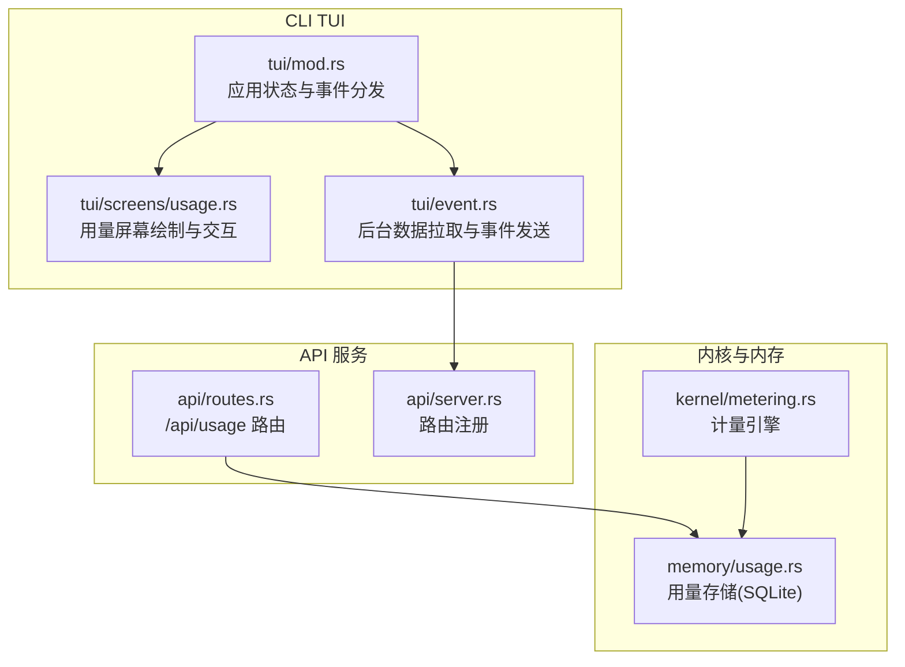
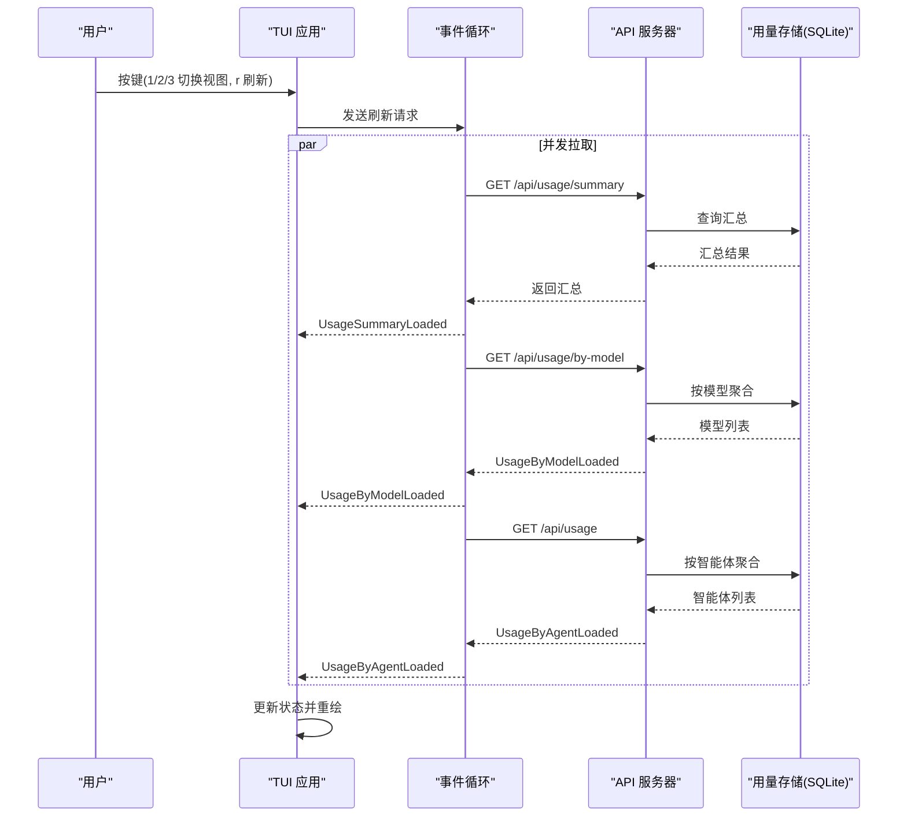
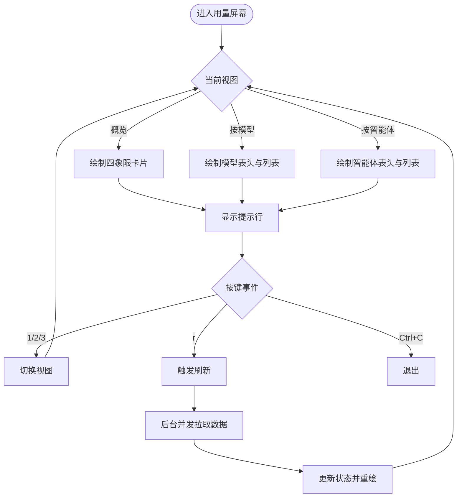
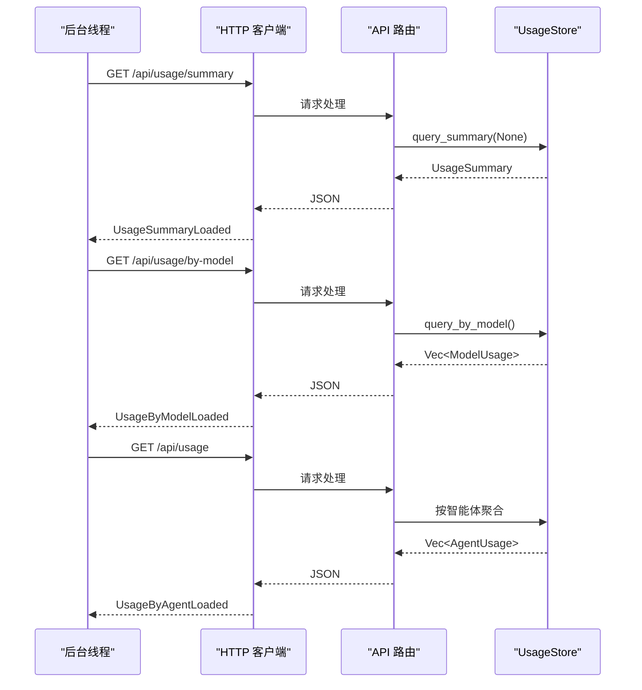
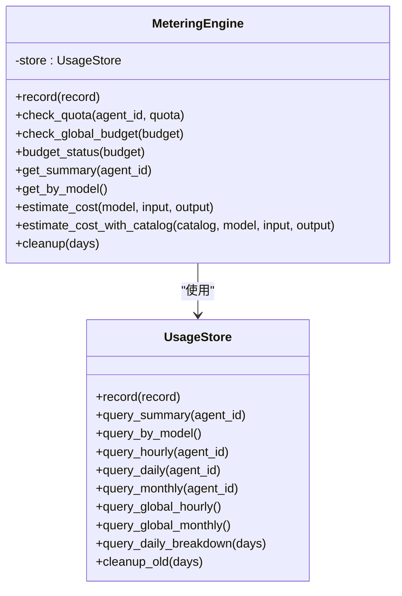
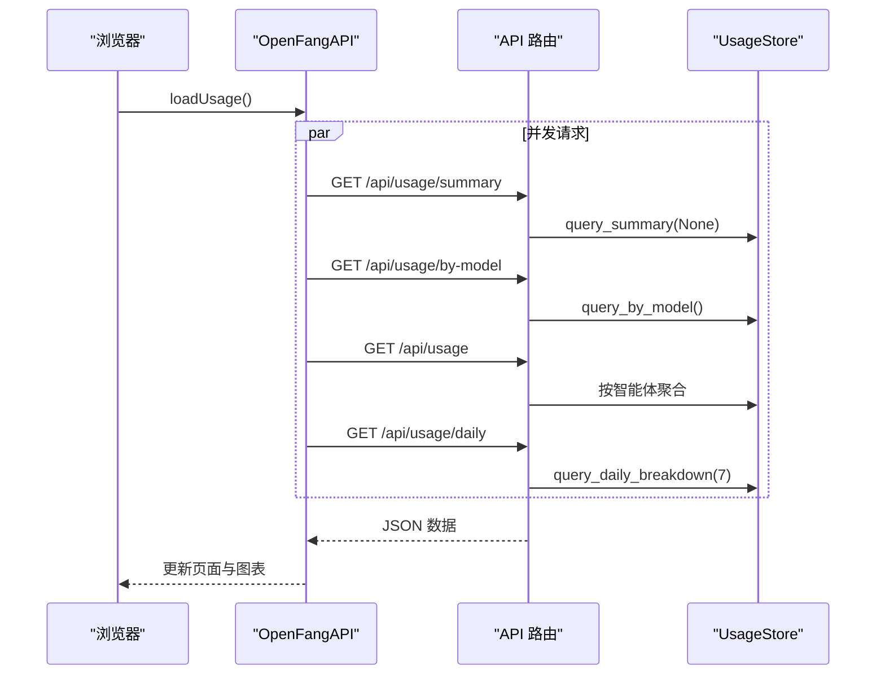
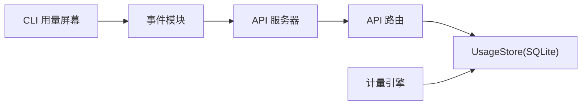

# 用量屏幕

<cite>
**本文档引用的文件**
- [usage.rs](file://crates/openfang-cli/src/tui/screens/usage.rs)
- [mod.rs（CLI TUI）](file://crates/openfang-cli/src/tui/mod.rs)
- [event.rs](file://crates/openfang-cli/src/tui/event.rs)
- [usage.rs（内存模块）](file://crates/openfang-memory/src/usage.rs)
- [metering.rs](file://crates/openfang-kernel/src/metering.rs)
- [routes.rs（API）](file://crates/openfang-api/src/routes.rs)
- [server.rs（API）](file://crates/openfang-api/src/server.rs)
- [usage.js（Web仪表板）](file://crates/openfang-api/static/js/pages/usage.js)
- [overview.js（Web仪表板）](file://crates/openfang-api/static/js/pages/overview.js)
- [index_body.html（Web仪表板）](file://crates/openfang-api/static/index_body.html)
</cite>

## 目录
1. [简介](#简介)
2. [项目结构](#项目结构)
3. [核心组件](#核心组件)
4. [架构总览](#架构总览)
5. [详细组件分析](#详细组件分析)
6. [依赖关系分析](#依赖关系分析)
7. [性能考虑](#性能考虑)
8. [故障排查指南](#故障排查指南)
9. [结论](#结论)
10. [附录](#附录)

## 简介
本文件为 OpenFang TUI 用量屏幕的详细技术文档，聚焦于用量统计功能与界面交互。内容涵盖：
- 用量概览：输入/输出令牌总量、总成本、调用次数
- 模型使用统计：按模型分组的成本与令牌消耗
- 智能体使用分析：按智能体分组的总令牌与工具调用
- 成本分析：小时/日/月预算与配额检查
- 数据来源与聚合：SQLite 存储、Metering 引擎、API 路由
- 界面交互：子标签页切换、列表选择、刷新键绑定
- 查询与导出：TUI 刷新机制、Web 仪表板数据加载与图表展示

## 项目结构
用量屏幕位于 CLI TUI 的 screens 子模块中，通过事件循环从 API 获取数据，并以卡片与列表形式渲染。内存模块提供 SQLite 后端的用量存储与查询；内核的计量引擎负责成本估算与配额检查。

**图示来源**
- [mod.rs（CLI TUI）:138-180](file://crates/openfang-cli/src/tui/mod.rs#L138-L180)
- [usage.rs（CLI TUI）:160-203](file://crates/openfang-cli/src/tui/screens/usage.rs#L160-L203)
- [event.rs:1763-1802](file://crates/openfang-cli/src/tui/event.rs#L1763-L1802)
- [routes.rs（API）:5167-5234](file://crates/openfang-api/src/routes.rs#L5167-L5234)
- [server.rs（API）:476-485](file://crates/openfang-api/src/server.rs#L476-L485)
- [usage.rs（内存模块）:70-352](file://crates/openfang-memory/src/usage.rs#L70-L352)
- [metering.rs:8-23](file://crates/openfang-kernel/src/metering.rs#L8-L23)

**章节来源**
- [mod.rs（CLI TUI）:138-180](file://crates/openfang-cli/src/tui/mod.rs#L138-L180)
- [usage.rs（CLI TUI）:1-448](file://crates/openfang-cli/src/tui/screens/usage.rs#L1-L448)
- [event.rs:1763-1802](file://crates/openfang-cli/src/tui/event.rs#L1763-L1802)
- [usage.rs（内存模块）:1-542](file://crates/openfang-memory/src/usage.rs#L1-L542)
- [metering.rs:1-213](file://crates/openfang-kernel/src/metering.rs#L1-L213)
- [routes.rs（API）:5167-5234](file://crates/openfang-api/src/routes.rs#L5167-L5234)
- [server.rs（API）:476-485](file://crates/openfang-api/src/server.rs#L476-L485)

## 核心组件
- 用量屏幕状态与渲染
  - 状态类型：概览、按模型、按智能体三类视图
  - 渲染布局：标题栏、分隔线、内容区、提示行
  - 交互键位：数字键切换视图，r 键刷新，Ctrl+C 退出
- 用量数据模型
  - 概览：输入令牌、输出令牌、总成本、调用次数
  - 按模型：模型名、输入/输出令牌、成本、调用次数
  - 按智能体：智能体名称/ID、总令牌、成本、工具调用次数
- 数据来源与聚合
  - SQLite 存储：记录每次 LLM 调用事件，支持按时间窗口与维度聚合
  - 计量引擎：成本估算、配额检查、预算状态
  - API 路由：/api/usage、/api/usage/summary、/api/usage/by-model、/api/usage/daily

**章节来源**
- [usage.rs（CLI TUI）:13-58](file://crates/openfang-cli/src/tui/screens/usage.rs#L13-L58)
- [usage.rs（CLI TUI）:160-203](file://crates/openfang-cli/src/tui/screens/usage.rs#L160-L203)
- [usage.rs（内存模块）:10-68](file://crates/openfang-memory/src/usage.rs#L10-L68)
- [metering.rs:8-23](file://crates/openfang-kernel/src/metering.rs#L8-L23)
- [routes.rs（API）:5167-5234](file://crates/openfang-api/src/routes.rs#L5167-L5234)

## 架构总览
用量数据在后端以 SQLite 存储，前端通过 API 获取并渲染。CLI TUI 在后台线程并发拉取多维数据，通过事件通道更新状态，实现无阻塞的刷新体验。

**图示来源**
- [mod.rs（CLI TUI）:457-472](file://crates/openfang-cli/src/tui/mod.rs#L457-L472)
- [event.rs:1763-1802](file://crates/openfang-cli/src/tui/event.rs#L1763-L1802)
- [routes.rs（API）:5167-5234](file://crates/openfang-api/src/routes.rs#L5167-L5234)
- [usage.rs（内存模块）:193-303](file://crates/openfang-memory/src/usage.rs#L193-L303)

**章节来源**
- [mod.rs（CLI TUI）:457-472](file://crates/openfang-cli/src/tui/mod.rs#L457-L472)
- [event.rs:1763-1802](file://crates/openfang-cli/src/tui/event.rs#L1763-L1802)
- [routes.rs（API）:5167-5234](file://crates/openfang-api/src/routes.rs#L5167-L5234)

## 详细组件分析

### CLI 用量屏幕（TUI）
- 视图与布局
  - 子标签：概览、按模型、按智能体
  - 布局：上下分割为子标签栏、分隔线、内容区、提示行
  - 加载态：旋转指示器与“加载中”提示
- 数据渲染
  - 概览：四象限卡片显示输入/输出令牌、总成本、调用次数
  - 按模型：表头 + 列表项，包含模型名、输入/输出令牌、成本、调用次数
  - 按智能体：表头 + 列表项，包含智能体名、总令牌、成本、工具调用次数
- 交互行为
  - 数字键 1/2/3 切换视图
  - 上下方向键或 j/k 在列表中导航
  - r 键触发刷新
  - Ctrl+C 退出

**图示来源**
- [usage.rs（CLI TUI）:160-203](file://crates/openfang-cli/src/tui/screens/usage.rs#L160-L203)
- [usage.rs（CLI TUI）:83-155](file://crates/openfang-cli/src/tui/screens/usage.rs#L83-L155)

**章节来源**
- [usage.rs（CLI TUI）:1-448](file://crates/openfang-cli/src/tui/screens/usage.rs#L1-L448)

### 事件与数据加载（后台线程）
- 后台任务并发拉取
  - /api/usage/summary：全局汇总
  - /api/usage/by-model：按模型聚合
  - /api/usage：按智能体聚合
- 事件分发
  - 使用 AppEvent::UsageSummaryLoaded/ByModelLoaded/ByAgentLoaded 更新状态
  - 自动选择首项并停止加载态

**图示来源**
- [event.rs:1763-1802](file://crates/openfang-cli/src/tui/event.rs#L1763-L1802)
- [routes.rs（API）:5167-5234](file://crates/openfang-api/src/routes.rs#L5167-L5234)
- [usage.rs（内存模块）:193-303](file://crates/openfang-memory/src/usage.rs#L193-L303)

**章节来源**
- [event.rs:1763-1802](file://crates/openfang-cli/src/tui/event.rs#L1763-L1802)
- [mod.rs（CLI TUI）:457-472](file://crates/openfang-cli/src/tui/mod.rs#L457-L472)

### 内存与计量引擎
- 用量存储
  - 记录字段：agent_id、model、input_tokens、output_tokens、cost_usd、tool_calls
  - 聚合接口：按模型、按智能体、按时间窗口（小时/日/月）、每日分解
  - 清理策略：按天数删除过期记录
- 计量引擎
  - 成本估算：内置定价表或模型目录定价
  - 配额检查：按小时/日/月限额
  - 全局预算：跨智能体的预算状态与阈值

**图示来源**
- [usage.rs（内存模块）:70-352](file://crates/openfang-memory/src/usage.rs#L70-L352)
- [metering.rs:8-213](file://crates/openfang-kernel/src/metering.rs#L8-L213)

**章节来源**
- [usage.rs（内存模块）:1-542](file://crates/openfang-memory/src/usage.rs#L1-L542)
- [metering.rs:1-213](file://crates/openfang-kernel/src/metering.rs#L1-L213)

### API 路由与 Web 仪表板
- API 路由
  - GET /api/usage：按智能体返回用量列表
  - GET /api/usage/summary：返回全局汇总
  - GET /api/usage/by-model：按模型聚合
  - GET /api/usage/daily：最近 N 天每日成本与首条事件日期
- Web 仪表板
  - 并发加载：汇总、按模型、按智能体、每日成本
  - 表格展示：按模型与按智能体的表格
  - 图表：Provider 分布、成本趋势（由前端脚本负责）

**图示来源**
- [usage.js（Web仪表板）:26-78](file://crates/openfang-api/static/js/pages/usage.js#L26-L78)
- [routes.rs（API）:5167-5234](file://crates/openfang-api/src/routes.rs#L5167-L5234)
- [index_body.html（Web仪表板）:3893-3916](file://crates/openfang-api/static/index_body.html#L3893-L3916)

**章节来源**
- [routes.rs（API）:5167-5234](file://crates/openfang-api/src/routes.rs#L5167-L5234)
- [server.rs（API）:476-485](file://crates/openfang-api/src/server.rs#L476-L485)
- [usage.js（Web仪表板）:1-100](file://crates/openfang-api/static/js/pages/usage.js#L1-L100)
- [overview.js（Web仪表板）:83-104](file://crates/openfang-api/static/js/pages/overview.js#L83-L104)
- [index_body.html（Web仪表板）:3893-3916](file://crates/openfang-api/static/index_body.html#L3893-L3916)

## 依赖关系分析
- 组件耦合
  - CLI 用量屏幕依赖事件循环与 App 状态机，通过事件解耦网络层
  - API 路由依赖 UsageStore 进行数据聚合
  - 计量引擎封装成本估算与配额逻辑，供内核与 API 复用
- 外部依赖
  - SQLite：持久化用量事件
  - Axum：REST API 服务
  - Ratatui：TUI 渲染

**图示来源**
- [mod.rs（CLI TUI）:138-180](file://crates/openfang-cli/src/tui/mod.rs#L138-L180)
- [event.rs:1763-1802](file://crates/openfang-cli/src/tui/event.rs#L1763-L1802)
- [routes.rs（API）:5167-5234](file://crates/openfang-api/src/routes.rs#L5167-L5234)
- [usage.rs（内存模块）:70-352](file://crates/openfang-memory/src/usage.rs#L70-L352)
- [metering.rs:8-23](file://crates/openfang-kernel/src/metering.rs#L8-L23)

**章节来源**
- [mod.rs（CLI TUI）:138-180](file://crates/openfang-cli/src/tui/mod.rs#L138-L180)
- [event.rs:1763-1802](file://crates/openfang-cli/src/tui/event.rs#L1763-L1802)
- [routes.rs（API）:5167-5234](file://crates/openfang-api/src/routes.rs#L5167-L5234)

## 性能考虑
- 后台并发拉取：避免主线程阻塞，提升响应速度
- SQLite 聚合：在数据库层面完成分组与求和，减少传输与前端计算
- 缓存与节流：API 层对频繁访问的端点设置速率限制，降低热点压力
- 数据清理：定期清理过期用量事件，控制数据库规模

[本节为通用指导，无需特定文件引用]

## 故障排查指南
- 无法加载数据
  - 检查 API 服务是否运行与可达
  - 查看事件循环是否成功发送 Usage*Loaded 事件
- 用量为空
  - 确认是否有 LLM 调用事件写入 SQLite
  - 检查清理策略是否误删近期数据
- 配额/预算告警
  - 核对 ResourceQuota 与 BudgetConfig 设置
  - 关注计量引擎的配额检查错误信息

**章节来源**
- [event.rs:1763-1802](file://crates/openfang-cli/src/tui/event.rs#L1763-L1802)
- [usage.rs（内存模块）:336-351](file://crates/openfang-memory/src/usage.rs#L336-L351)
- [metering.rs:27-100](file://crates/openfang-kernel/src/metering.rs#L27-L100)

## 结论
用量屏幕通过清晰的视图划分与高效的后台数据拉取，为用户提供全面的用量概览与深入的维度分析。结合 SQLite 聚合与计量引擎的成本估算能力，既能满足日常监控，也能支撑成本优化与预算管理。

[本节为总结性内容，无需特定文件引用]

## 附录

### 交互与快捷键
- 子标签切换：1 概览、2 按模型、3 按智能体
- 列表导航：↑/k 向上、↓/j 向下
- 刷新：r
- 退出：Ctrl+C

**章节来源**
- [usage.rs（CLI TUI）:83-155](file://crates/openfang-cli/src/tui/screens/usage.rs#L83-L155)

### 数据维度与时间范围
- 维度：智能体、模型
- 时间范围：小时、日、月、最近 N 天（默认 7 天）
- 聚合方式：SUM/计数/COUNT

**章节来源**
- [usage.rs（内存模块）:108-191](file://crates/openfang-memory/src/usage.rs#L108-L191)
- [usage.rs（内存模块）:267-303](file://crates/openfang-memory/src/usage.rs#L267-L303)
- [metering.rs:64-133](file://crates/openfang-kernel/src/metering.rs#L64-L133)

### 成本估算与配额
- 成本估算：内置模型定价表或模型目录定价
- 配额检查：小时/日/月限额，超限返回 QuotaExceeded
- 预算状态：返回当前花费与百分比，支持告警阈值

**章节来源**
- [metering.rs:145-213](file://crates/openfang-kernel/src/metering.rs#L145-L213)