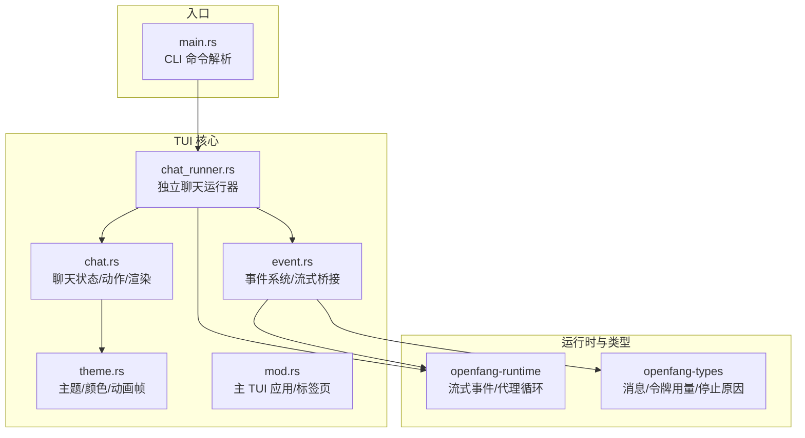
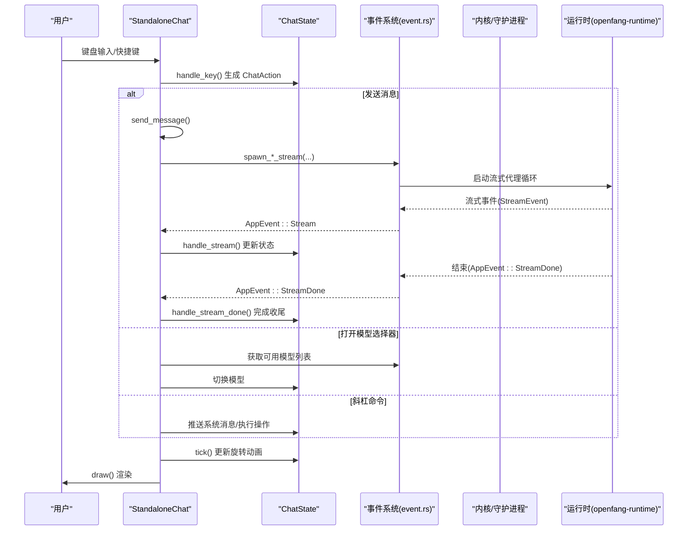
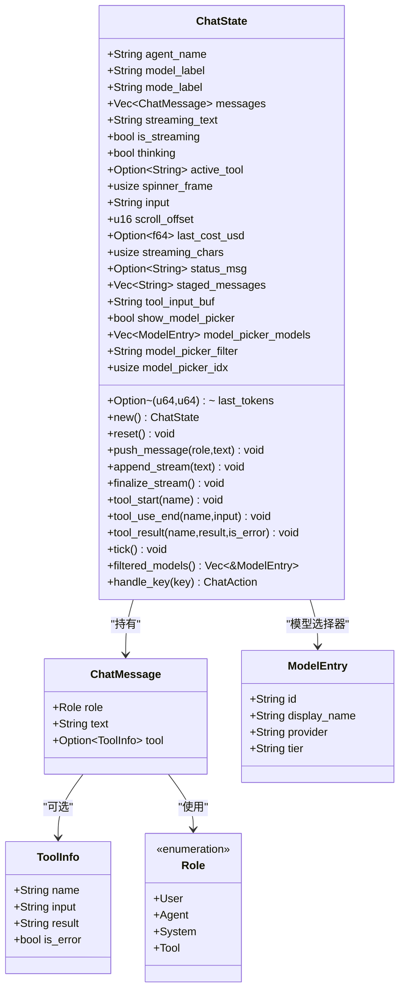
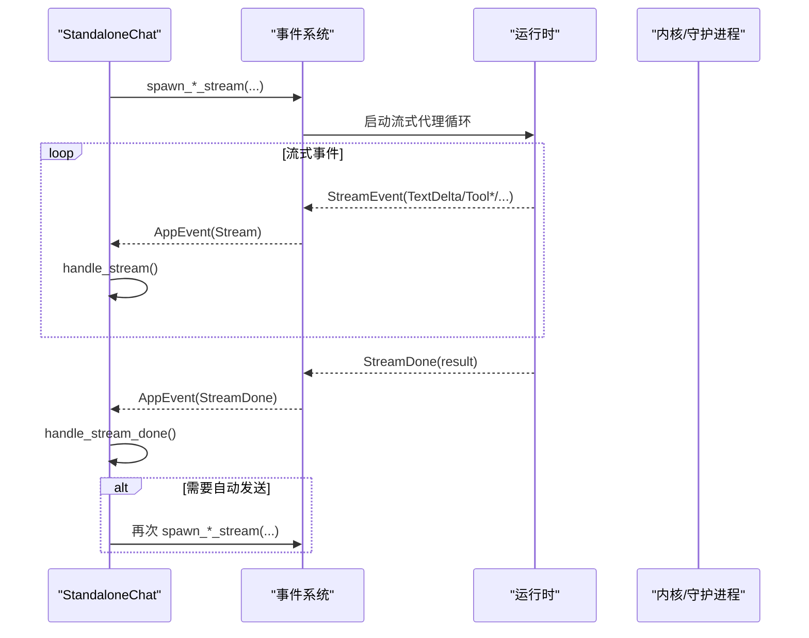
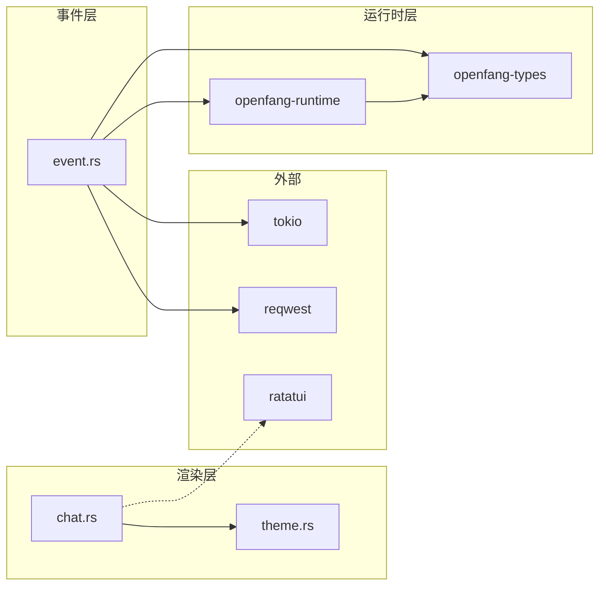

# 聊天屏幕

<cite>
**本文引用的文件**
- [chat.rs](file://crates/openfang-cli/src/tui/screens/chat.rs)
- [chat_runner.rs](file://crates/openfang-cli/src/tui/chat_runner.rs)
- [event.rs](file://crates/openfang-cli/src/tui/event.rs)
- [theme.rs](file://crates/openfang-cli/src/tui/theme.rs)
- [mod.rs](file://crates/openfang-cli/src/tui/mod.rs)
- [main.rs](file://crates/openfang-cli/src/main.rs)
- [message.rs](file://crates/openfang-types/src/message.rs)
</cite>

## 目录
1. [简介](#简介)
2. [项目结构](#项目结构)
3. [核心组件](#核心组件)
4. [架构总览](#架构总览)
5. [详细组件分析](#详细组件分析)
6. [依赖关系分析](#依赖关系分析)
7. [性能考量](#性能考量)
8. [故障排除指南](#故障排除指南)
9. [结论](#结论)
10. [附录](#附录)

## 简介
本文件系统性地阐述 OpenFang TUI 聊天屏幕的设计与实现，覆盖消息历史显示、实时消息输入、智能体选择、会话管理、布局与渲染、输入处理与发送机制、交互逻辑与快捷键、消息格式化与状态显示、与智能体运行时的通信（含流式响应）、错误处理与性能优化，并提供最佳实践与故障排除建议。

## 项目结构
聊天屏幕位于命令行 TUI 子系统中，采用模块化组织：
- 屏幕层：聊天屏幕定义状态、动作与渲染逻辑
- 运行器层：独立聊天 TUI 的事件循环、后端选择与生命周期
- 事件系统：统一事件通道，桥接键盘、定时器、流式事件与内核/守护进程
- 主程序入口：CLI 命令解析，支持直接进入独立聊天模式

图表来源
- [chat.rs:1-895](file://crates/openfang-cli/src/tui/screens/chat.rs#L1-L895)
- [chat_runner.rs:1-807](file://crates/openfang-cli/src/tui/chat_runner.rs#L1-L807)
- [event.rs:1-800](file://crates/openfang-cli/src/tui/event.rs#L1-L800)
- [theme.rs:1-140](file://crates/openfang-cli/src/tui/theme.rs#L1-L140)
- [mod.rs:1-2428](file://crates/openfang-cli/src/tui/mod.rs#L1-L2428)
- [main.rs:1-6734](file://crates/openfang-cli/src/main.rs#L1-L6734)
- [message.rs:1-341](file://crates/openfang-types/src/message.rs#L1-L341)

章节来源
- [chat.rs:1-895](file://crates/openfang-cli/src/tui/screens/chat.rs#L1-L895)
- [chat_runner.rs:1-807](file://crates/openfang-cli/src/tui/chat_runner.rs#L1-L807)
- [event.rs:1-800](file://crates/openfang-cli/src/tui/event.rs#L1-L800)
- [theme.rs:1-140](file://crates/openfang-cli/src/tui/theme.rs#L1-L140)
- [mod.rs:1-2428](file://crates/openfang-cli/src/tui/mod.rs#L1-L2428)
- [main.rs:1-6734](file://crates/openfang-cli/src/main.rs#L1-L6734)
- [message.rs:1-341](file://crates/openfang-types/src/message.rs#L1-L341)

## 核心组件
- 聊天状态与动作
  - ChatState：维护消息历史、流式文本、工具执行状态、滚动偏移、令牌用量、状态消息、模型选择器等
  - ChatAction：封装键盘输入产生的动作（发送、打开模型选择器、切换模型、斜杠命令等）
- 渲染与主题
  - draw/draw_messages：按角色渲染用户消息、代理回复、系统提示、工具调用块；支持滚动、占位提示、估计令牌数、状态消息
  - 主题系统：颜色、样式、旋转动画帧
- 事件系统与运行器
  - StandaloneChat：独立聊天运行器，负责事件分发、键盘处理、流式事件处理、内核/守护进程连接、模型切换、斜杠命令
  - 事件通道：统一 AppEvent，桥接键盘、定时器、流式事件、内核启动、代理实例化等
- 消息类型与令牌用量
  - openfang-types 提供消息结构、内容块、令牌用量、停止原因等

章节来源
- [chat.rs:45-186](file://crates/openfang-cli/src/tui/screens/chat.rs#L45-L186)
- [chat.rs:90-386](file://crates/openfang-cli/src/tui/screens/chat.rs#L90-L386)
- [chat.rs:390-828](file://crates/openfang-cli/src/tui/screens/chat.rs#L390-L828)
- [chat_runner.rs:29-754](file://crates/openfang-cli/src/tui/chat_runner.rs#L29-L754)
- [event.rs:42-203](file://crates/openfang-cli/src/tui/event.rs#L42-L203)
- [message.rs:6-231](file://crates/openfang-types/src/message.rs#L6-L231)
- [theme.rs:136-140](file://crates/openfang-cli/src/tui/theme.rs#L136-L140)

## 架构总览
聊天屏幕的运行时交互链路如下：

图表来源
- [chat_runner.rs:76-100](file://crates/openfang-cli/src/tui/chat_runner.rs#L76-L100)
- [chat_runner.rs:229-259](file://crates/openfang-cli/src/tui/chat_runner.rs#L229-L259)
- [event.rs:287-326](file://crates/openfang-cli/src/tui/event.rs#L287-L326)
- [event.rs:328-444](file://crates/openfang-cli/src/tui/event.rs#L328-L444)
- [chat_runner.rs:109-161](file://crates/openfang-cli/src/tui/chat_runner.rs#L109-L161)
- [chat_runner.rs:163-189](file://crates/openfang-cli/src/tui/chat_runner.rs#L163-L189)
- [chat.rs:229-234](file://crates/openfang-cli/src/tui/screens/chat.rs#L229-L234)
- [chat.rs:390-476](file://crates/openfang-cli/src/tui/screens/chat.rs#L390-L476)

## 详细组件分析

### 组件一：聊天状态与渲染（ChatState 与 draw）
- 状态字段
  - 消息历史、当前流式文本、是否正在流式、思考态、活动工具、旋转帧索引、输入缓冲、滚动偏移、最近令牌用量与费用估算、流式字符计数、状态消息、待发送队列、工具输入缓冲、模型选择器状态与过滤
- 关键方法
  - push_message：将完成的消息加入历史并自动滚动到底部
  - append_stream：追加流式增量，清空“等待首个 token”状态
  - finalize_stream：将累积的流式文本归档为一条代理消息，重置流式状态
  - tool_start/tool_use_end/tool_result：管理工具调用块的开始、结束与结果回填
  - tick：推进旋转动画帧
  - filtered_models：根据过滤字符串返回匹配模型
  - handle_key：解析键盘事件，区分模型选择器模式、流式模式与普通模式，返回 ChatAction
- 渲染逻辑
  - draw：整体布局分为消息区、分隔线、输入行、提示行；支持模型选择器弹窗
  - draw_messages：按角色渲染，支持工具块边框、输入/结果/错误状态、占位提示、滚动指示、估计令牌数、令牌用量与费用、状态消息
  - 辅助函数：wrap_text 文本换行、sanitize_function_tags 清理残留函数标签、truncate_line 截断显示

图表来源
- [chat.rs:11-88](file://crates/openfang-cli/src/tui/screens/chat.rs#L11-L88)
- [chat.rs:148-186](file://crates/openfang-cli/src/tui/screens/chat.rs#L148-L186)
- [chat.rs:252-386](file://crates/openfang-cli/src/tui/screens/chat.rs#L252-L386)
- [chat.rs:390-828](file://crates/openfang-cli/src/tui/screens/chat.rs#L390-L828)

章节来源
- [chat.rs:45-186](file://crates/openfang-cli/src/tui/screens/chat.rs#L45-L186)
- [chat.rs:252-386](file://crates/openfang-cli/src/tui/screens/chat.rs#L252-L386)
- [chat.rs:390-828](file://crates/openfang-cli/src/tui/screens/chat.rs#L390-L828)

### 组件二：事件系统与运行器（StandaloneChat）
- 后端选择
  - 守护进程模式：通过 HTTP 与守护进程通信，支持模型查询、代理实例化、流式 SSE
  - 内核模式：在进程中启动内核，直接调用内核 API
- 生命周期
  - 引导阶段：检测守护进程或启动内核；引导失败显示错误
  - 事件循环：接收键盘、定时器、流式事件、内核/守护进程状态变化
  - 退出：支持双 Ctrl+C 退出
- 流式处理
  - TextDelta：追加到流式文本
  - ToolUseStart/ToolUseEnd：开始/结束工具调用，更新工具块
  - ToolInputDelta：累积工具输入
  - ContentComplete：累计令牌用量
  - PhaseChange：工具使用/思考阶段切换
  - ThinkingDelta：思考阶段增量
  - ToolExecutionResult：工具执行结果回填
  - StreamDone：完成收尾，自动发送待发送消息
- 模型选择
  - 守护进程：GET /api/models 查询可用模型
  - 内核：从模型目录读取可用模型
  - 切换：PUT /api/agents/{id}/model 或内核注册表更新
- 斜杠命令
  - /help、/status、/model、/clear、/kill、/exit 等

图表来源
- [chat_runner.rs:109-161](file://crates/openfang-cli/src/tui/chat_runner.rs#L109-L161)
- [chat_runner.rs:163-189](file://crates/openfang-cli/src/tui/chat_runner.rs#L163-L189)
- [event.rs:328-444](file://crates/openfang-cli/src/tui/event.rs#L328-L444)

章节来源
- [chat_runner.rs:23-754](file://crates/openfang-cli/src/tui/chat_runner.rs#L23-L754)
- [event.rs:205-238](file://crates/openfang-cli/src/tui/event.rs#L205-L238)
- [event.rs:287-326](file://crates/openfang-cli/src/tui/event.rs#L287-L326)
- [event.rs:328-444](file://crates/openfang-cli/src/tui/event.rs#L328-L444)

### 组件三：输入处理与发送机制
- 输入处理
  - 普通模式：Enter 发送，Backspace 删除，上下/翻页滚动
  - 流式模式：Enter 将输入暂存为“待发送”，Esc 退出流式；滚动键用于浏览历史
  - 模型选择器模式：上下导航、回车选择、Esc 关闭、输入过滤
- 发送机制
  - 选择后端（守护进程或内核）并启动流式代理循环
  - 初始化流式状态（清空令牌、设置思考态、清除状态消息）
  - 收到流式事件时即时更新 UI，完成后归档消息并可能自动发送下一条

章节来源
- [chat.rs:252-386](file://crates/openfang-cli/src/tui/screens/chat.rs#L252-L386)
- [chat_runner.rs:229-259](file://crates/openfang-cli/src/tui/chat_runner.rs#L229-L259)

### 组件四：消息格式化与状态显示
- 角色渲染
  - User：带箭头前缀，多行换行
  - Agent：纯文本块
  - System：灰色提示
  - Tool：带边框的块，包含输入/结果/错误状态，支持旋转动画
- 工具块
  - 开始：创建 ToolMessage 并清空输入缓冲
  - 结束：填充工具输入
  - 结果：回填结果或错误，清空活动工具
- 状态与统计
  - “思考”旋转动画
  - 估计令牌数（约 4 字符 ≈ 1 令牌）
  - 最近令牌用量与费用
  - 滚动指示（上方/下方剩余行数）

章节来源
- [chat.rs:598-828](file://crates/openfang-cli/src/tui/screens/chat.rs#L598-L828)
- [chat.rs:830-895](file://crates/openfang-cli/src/tui/screens/chat.rs#L830-L895)

### 组件五：与智能体运行时的通信与流式响应
- 守护进程流式
  - 使用 SSE 接收流式事件，解析 content/tool/usage/done 等字段
  - 累计令牌用量并在 done 时转发 ContentComplete
- 内核流式
  - 通过内核 API 启动流式代理循环，接收流式事件并通过通道转发
- 代理循环结果
  - StreamDone 返回 AgentLoopResult，包含 response、usage、cost_usd 等

章节来源
- [event.rs:328-444](file://crates/openfang-cli/src/tui/event.rs#L328-L444)
- [event.rs:287-326](file://crates/openfang-cli/src/tui/event.rs#L287-L326)
- [message.rs:217-247](file://crates/openfang-types/src/message.rs#L217-L247)

### 组件六：交互逻辑与键盘快捷键
- 全局
  - 双 Ctrl+C 退出
- 聊天屏幕
  - Esc：返回/退出
  - Enter：发送/暂存消息
  - Backspace：删除输入
  - 上/下/翻页：滚动历史
  - Ctrl+M：打开模型选择器
  - Ctrl+C/Ctrl+Q：退出（独立聊天）
- 模型选择器
  - 方向键导航、回车选择、Esc 关闭、输入过滤

章节来源
- [chat_runner.rs:76-100](file://crates/openfang-cli/src/tui/chat_runner.rs#L76-L100)
- [chat.rs:252-309](file://crates/openfang-cli/src/tui/screens/chat.rs#L252-L309)

## 依赖关系分析
- 模块耦合
  - chat.rs 仅依赖 theme.rs 的样式与动画帧，低耦合
  - chat_runner.rs 依赖 event.rs 的事件通道、openfang-runtime 的流式事件、openfang-types 的消息与令牌类型
  - event.rs 作为桥接层，向上提供统一 AppEvent，向下连接守护进程 HTTP 与内核 mpsc
- 外部依赖
  - ratatui：终端 UI 渲染
  - reqwest：守护进程 HTTP 请求
  - tokio：异步运行时（守护进程流式回退、内核流式）

图表来源
- [chat.rs:1-10](file://crates/openfang-cli/src/tui/screens/chat.rs#L1-L10)
- [theme.rs:1-140](file://crates/openfang-cli/src/tui/theme.rs#L1-L140)
- [event.rs:1-800](file://crates/openfang-cli/src/tui/event.rs#L1-L800)
- [message.rs:1-341](file://crates/openfang-types/src/message.rs#L1-L341)

章节来源
- [chat.rs:1-10](file://crates/openfang-cli/src/tui/screens/chat.rs#L1-L10)
- [event.rs:1-800](file://crates/openfang-cli/src/tui/event.rs#L1-L800)
- [message.rs:1-341](file://crates/openfang-types/src/message.rs#L1-L341)

## 性能考量
- 流式渲染
  - 即时追加增量文本，避免全量重绘
  - 估计令牌数基于字符计数，减少额外计算
- 滚动优化
  - 仅在需要时计算滚动偏移，避免昂贵的滚动计算
- 文本处理
  - wrap_text 采用贪心换行策略，减少内存分配
  - truncate_line 与 openfang_types::truncate_str 配合截断长行
- 事件驱动
  - 通过定时器事件推进旋转动画，避免忙轮询
- 后端选择
  - 在进程内核模式下避免网络往返，降低延迟

## 故障排除指南
- 无法连接后端
  - 独立聊天启动时若未检测到守护进程，则尝试启动内核；若失败，显示错误并允许退出
  - 断言：检查守护进程地址、网络连通性、代理实例化是否成功
- 流式响应异常
  - SSE 解析失败或连接中断：触发回退路径，返回非流式结果
  - 断言：确认流式事件序列完整性（content/tool/usage/done）
- 模型切换失败
  - 守护进程：检查 PUT /api/agents/{id}/model 返回状态
  - 内核：检查模型目录与注册表更新
- 工具执行问题
  - ToolExecutionResult 中 is_error 为真时，工具块以红色边框显示错误
  - 断言：确保工具名称与输入匹配，结果及时回填
- 输入卡顿
  - 检查事件通道阻塞、渲染刷新频率、终端能力

章节来源
- [chat_runner.rs:193-212](file://crates/openfang-cli/src/tui/chat_runner.rs#L193-L212)
- [chat_runner.rs:437-519](file://crates/openfang-cli/src/tui/chat_runner.rs#L437-L519)
- [event.rs:328-444](file://crates/openfang-cli/src/tui/event.rs#L328-L444)
- [chat.rs:660-739](file://crates/openfang-cli/src/tui/screens/chat.rs#L660-L739)

## 结论
OpenFang TUI 聊天屏幕通过清晰的状态机与事件驱动架构，实现了高响应性的消息历史展示、实时流式输入与工具执行反馈。其模块化设计便于扩展与维护，同时在渲染与事件处理上注重性能与用户体验。结合本文的最佳实践与故障排除建议，可在不同后端环境下稳定运行并提供一致的交互体验。

## 附录

### 快捷键一览
- Esc：返回/退出
- Enter：发送/暂存消息
- Backspace：删除输入
- 上/下/翻页：滚动历史
- Ctrl+M：打开模型选择器
- Ctrl+C/Ctrl+Q：退出（独立聊天）

章节来源
- [chat.rs:252-386](file://crates/openfang-cli/src/tui/screens/chat.rs#L252-L386)
- [chat_runner.rs:76-100](file://crates/openfang-cli/src/tui/chat_runner.rs#L76-L100)

### 消息格式规范
- 角色
  - User：用户消息
  - Agent：代理回复
  - System：系统提示
  - Tool：工具调用块
- 工具块字段
  - name：工具名
  - input：工具输入
  - result：执行结果或空
  - is_error：是否错误
- 令牌用量
  - TokenUsage：input_tokens/output_tokens
  - StopReason：结束原因枚举

章节来源
- [message.rs:6-231](file://crates/openfang-types/src/message.rs#L6-L231)
- [chat.rs:21-27](file://crates/openfang-cli/src/tui/screens/chat.rs#L21-L27)

### 最佳实践
- 使用斜杠命令进行快速操作（/help、/status、/model、/clear、/kill、/exit）
- 在流式过程中，利用暂存消息机制连续发送多条消息
- 通过模型选择器动态切换模型，关注令牌用量与费用提示
- 遇到工具错误时，优先查看工具块中的错误提示与输入参数

章节来源
- [chat_runner.rs:263-375](file://crates/openfang-cli/src/tui/chat_runner.rs#L263-L375)
- [chat.rs:770-791](file://crates/openfang-cli/src/tui/screens/chat.rs#L770-L791)