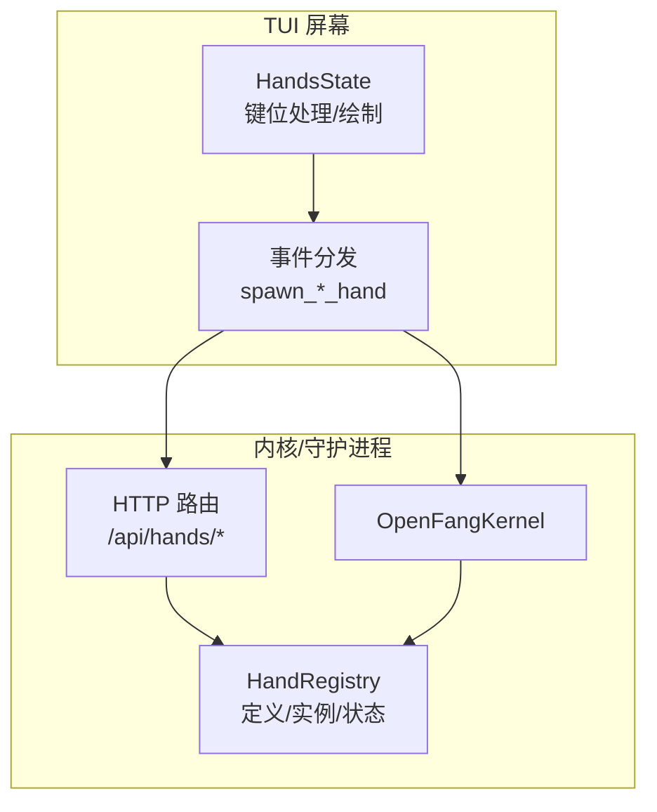
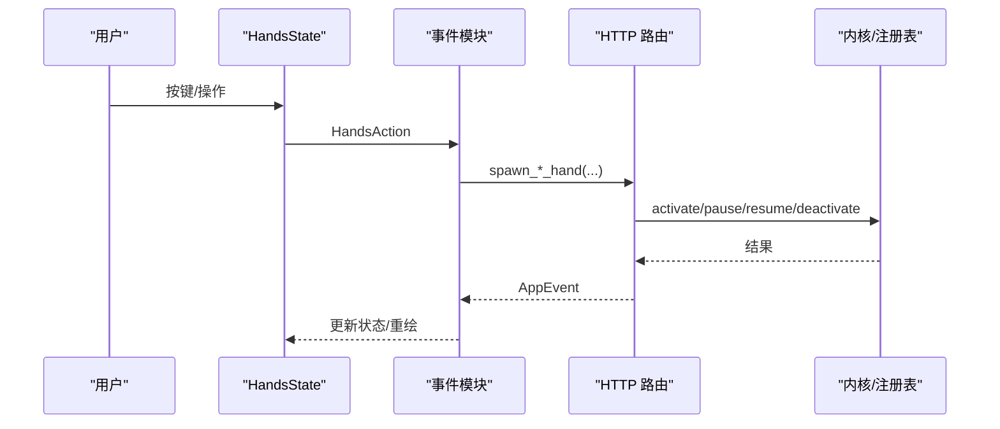
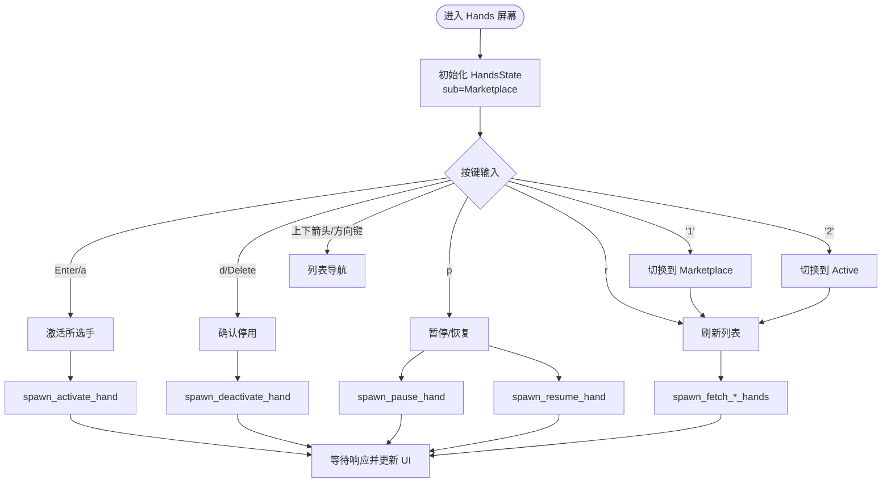
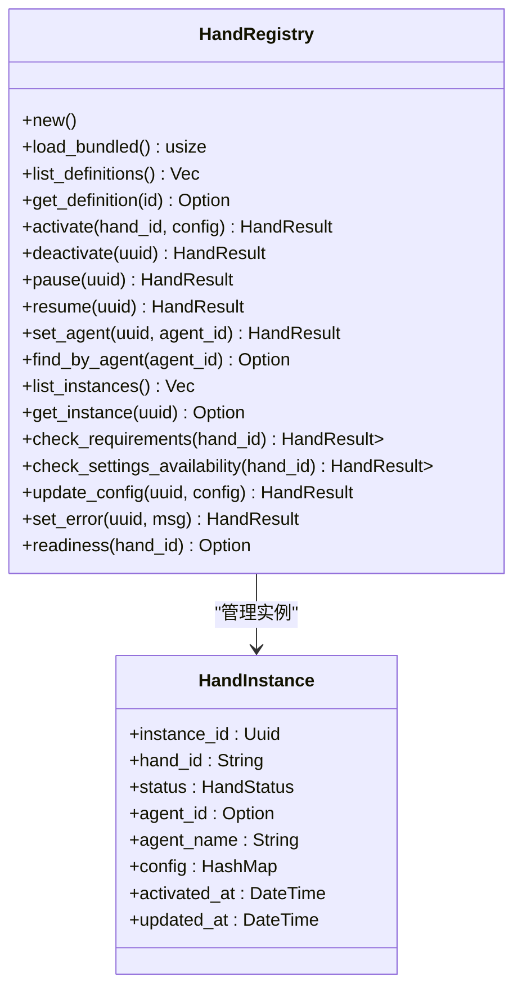
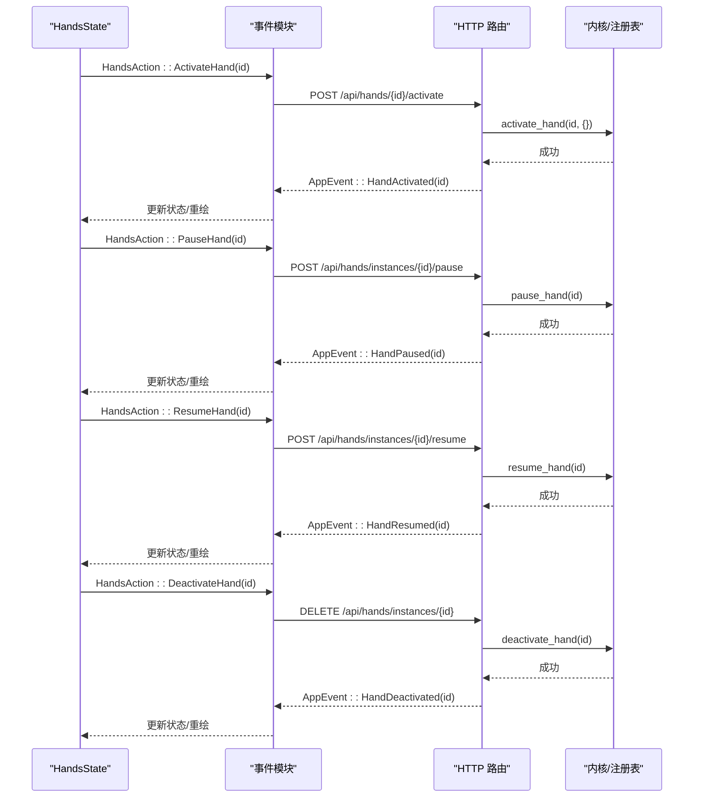
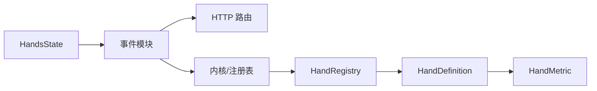

# 自主手屏幕

<cite>
**本文引用的文件**
- [hands.rs](file://crates/openfang-cli/src/tui/screens/hands.rs)
- [mod.rs](file://crates/openfang-cli/src/tui/mod.rs)
- [event.rs](file://crates/openfang-cli/src/tui/event.rs)
- [lib.rs](file://crates/openfang-hands/src/lib.rs)
- [registry.rs](file://crates/openfang-hands/src/registry.rs)
- [tool_runner.rs](file://crates/openfang-runtime/src/tool_runner.rs)
- [routes.rs](file://crates/openfang-api/src/routes.rs)
- [index_body.html](file://crates/openfang-api/static/index_body.html)
- [hands.js](file://crates/openfang-api/static/js/pages/hands.js)
- [browser/HAND.toml](file://crates/openfang-hands/bundled/browser/HAND.toml)
- [clip/HAND.toml](file://crates/openfang-hands/bundled/clip/HAND.toml)
- [researcher/HAND.toml](file://crates/openfang-hands/bundled/researcher/HAND.toml)
- [lead/HAND.toml](file://crates/openfang-hands/bundled/lead/HAND.toml)
- [predictor/HAND.toml](file://crates/openfang-hands/bundled/predictor/HAND.toml)
- [twitter/HAND.toml](file://crates/openfang-hands/bundled/twitter/HAND.toml)
</cite>

## 目录
1. [简介](#简介)
2. [项目结构](#项目结构)
3. [核心组件](#核心组件)
4. [架构总览](#架构总览)
5. [详细组件分析](#详细组件分析)
6. [依赖关系分析](#依赖关系分析)
7. [性能考量](#性能考量)
8. [故障排除指南](#故障排除指南)
9. [结论](#结论)
10. [附录](#附录)

## 简介
本文件面向 OpenFang TUI 的“自主手屏幕”，系统性阐述自主手（Hand）的管理能力：手定义查看、手实例管理、激活/停用/暂停/恢复、配置与就绪状态检查、实例监控与性能指标等。文档同时覆盖 TUI 界面的交互设计、列表展示、状态指示与操作按钮，并提供最佳实践与故障排除建议。

## 项目结构
自主手屏幕位于 TUI 子系统中，通过事件驱动与后端内核或守护进程通信，拉取手定义与活动实例，支持用户在终端内完成手的激活、暂停/恢复、停用等全生命周期管理。

图表来源
- [hands.rs:1-441](file://crates/openfang-cli/src/tui/screens/hands.rs#L1-L441)
- [event.rs:2100-2299](file://crates/openfang-cli/src/tui/event.rs#L2100-L2299)
- [routes.rs:4494-4526](file://crates/openfang-api/src/routes.rs#L4494-L4526)
- [registry.rs:38-406](file://crates/openfang-hands/src/registry.rs#L38-L406)

章节来源
- [hands.rs:1-441](file://crates/openfang-cli/src/tui/screens/hands.rs#L1-L441)
- [event.rs:2100-2299](file://crates/openfang-cli/src/tui/event.rs#L2100-L2299)

## 核心组件
- HandsState：维护当前子视图（市场/活动）、数据源（手定义、活动实例）、选择状态、加载动画与提示信息。
- 键位与动作：支持在市场与活动两个子视图间切换、导航、激活、暂停/恢复、停用、刷新等。
- 事件系统：封装后台线程发起的网络请求或内核调用，统一返回 AppEvent 并更新 UI。
- 手注册表：负责手定义加载、实例创建/停用、暂停/恢复、就绪状态计算、配置更新等。
- 工具与仪表盘：手定义内声明的设置项、要求项与仪表盘指标，用于 UI 展示与运行时统计。

章节来源
- [hands.rs:42-193](file://crates/openfang-cli/src/tui/screens/hands.rs#L42-L193)
- [event.rs:2111-2255](file://crates/openfang-cli/src/tui/event.rs#L2111-L2255)
- [lib.rs:111-151](file://crates/openfang-hands/src/lib.rs#L111-L151)
- [registry.rs:38-406](file://crates/openfang-hands/src/registry.rs#L38-L406)

## 架构总览
自主手屏幕的交互流程从键位输入开始，经由事件模块触发后台任务，最终通过内核或 HTTP 接口与手注册表交互，回传结果并刷新 UI。

图表来源
- [mod.rs:1591-1622](file://crates/openfang-cli/src/tui/mod.rs#L1591-L1622)
- [event.rs:2218-2299](file://crates/openfang-cli/src/tui/event.rs#L2218-L2299)
- [routes.rs:4494-4526](file://crates/openfang-api/src/routes.rs#L4494-L4526)
- [registry.rs:202-257](file://crates/openfang-hands/src/registry.rs#L202-L257)

## 详细组件分析

### TUI 屏幕：HandsState 与交互
- 子视图：Marketplace（手定义列表）与 Active（活动实例列表），通过数字键在两者间切换。
- 市场页：展示手图标、名称、分类、就绪状态与描述；支持 Enter/a 激活选中的手；支持 r 刷新。
- 活动页：展示代理名、状态、手 ID、激活时间；支持 p 在 Active/Paused 之间切换；支持 d 删除确认；支持 r 刷新。
- 加载态：使用旋转动画与状态消息提示。
- 状态栏：显示当前操作提示与确认对话。

图表来源
- [hands.rs:83-193](file://crates/openfang-cli/src/tui/screens/hands.rs#L83-L193)
- [event.rs:2111-2255](file://crates/openfang-cli/src/tui/event.rs#L2111-L2255)

章节来源
- [hands.rs:197-441](file://crates/openfang-cli/src/tui/screens/hands.rs#L197-L441)

### 事件与后台任务
- 获取手定义：spawn_fetch_hands，支持守护模式（HTTP）与内核模式（直接查询注册表）。
- 获取活动实例：spawn_fetch_active_hands，返回实例列表与状态。
- 激活手：spawn_activate_hand，向 /api/hands/{id}/activate 发起请求或调用内核。
- 停用手：spawn_deactivate_hand，DELETE /api/hands/instances/{id}。
- 暂停/恢复：spawn_pause_hand/spawn_resume_hand，POST /api/hands/instances/{id}/pause 或 /resume。

章节来源
- [event.rs:2111-2299](file://crates/openfang-cli/src/tui/event.rs#L2111-L2299)

### 手注册表与生命周期
- 注册表职责：加载内置手、安装/更新手定义、列出定义与实例、激活/停用、暂停/恢复、设置代理 ID、错误标记、就绪状态计算。
- 实例状态：Active、Paused、Error、Inactive；支持按代理查找实例。
- 就绪状态：结合需求检查与实例状态，区分 requirements_met、active、degraded。

图表来源
- [registry.rs:38-406](file://crates/openfang-hands/src/registry.rs#L38-L406)
- [lib.rs:387-427](file://crates/openfang-hands/src/lib.rs#L387-L427)

章节来源
- [registry.rs:202-406](file://crates/openfang-hands/src/registry.rs#L202-L406)
- [lib.rs:367-427](file://crates/openfang-hands/src/lib.rs#L367-L427)

### 手定义与仪表盘指标
- 手定义包含：id、name、description、category、icon、tools、skills、mcp_servers、requires、settings、agent、dashboard。
- 仪表盘指标：每个指标包含 label 与 memory_key，用于从代理结构化内存读取数值并格式化显示。
- 示例：浏览器手、剪辑手、研究员手、预测手、推特手等均在 HAND.toml 中声明了 dashboard.metrics。

章节来源
- [lib.rs:137-151](file://crates/openfang-hands/src/lib.rs#L137-L151)
- [browser/HAND.toml:240-255](file://crates/openfang-hands/bundled/browser/HAND.toml#L240-L255)
- [clip/HAND.toml:574-599](file://crates/openfang-hands/bundled/clip/HAND.toml#L574-L599)
- [researcher/HAND.toml:1-200](file://crates/openfang-hands/bundled/researcher/HAND.toml#L1-L200)
- [lead/HAND.toml:1-200](file://crates/openfang-hands/bundled/lead/HAND.toml#L1-L200)
- [predictor/HAND.toml:368-381](file://crates/openfang-hands/bundled/predictor/HAND.toml#L368-L381)
- [twitter/HAND.toml:389-408](file://crates/openfang-hands/bundled/twitter/HAND.toml#L389-L408)

### 状态管理与仪表盘
- 状态枚举：Active、Paused、Error、Inactive；Error 包含错误信息。
- 仪表盘指标：通过 memory_key 从代理内存读取，支持 number、duration、percentage 等格式。
- Web 端展示：页面会渲染 requirements 与 tools/dashboard 数量等元信息。

章节来源
- [lib.rs:367-385](file://crates/openfang-hands/src/lib.rs#L367-L385)
- [index_body.html:2555-2571](file://crates/openfang-api/static/index_body.html#L2555-L2571)

### 管理操作序列
以下序列展示从 TUI 触发到内核/路由执行的关键步骤。

图表来源
- [mod.rs:1591-1622](file://crates/openfang-cli/src/tui/mod.rs#L1591-L1622)
- [event.rs:2218-2299](file://crates/openfang-cli/src/tui/event.rs#L2218-L2299)
- [routes.rs:4494-4526](file://crates/openfang-api/src/routes.rs#L4494-L4526)
- [registry.rs:227-257](file://crates/openfang-hands/src/registry.rs#L227-L257)

## 依赖关系分析
- TUI 屏幕依赖事件模块进行网络/内核调用。
- 事件模块依赖内核或 HTTP 路由访问手注册表。
- 手注册表提供激活/停用/暂停/恢复/就绪状态等能力。
- 手定义与仪表盘指标由 HAND.toml 提供，供 UI 展示与运行时统计。

图表来源
- [hands.rs:1-441](file://crates/openfang-cli/src/tui/screens/hands.rs#L1-L441)
- [event.rs:2100-2299](file://crates/openfang-cli/src/tui/event.rs#L2100-L2299)
- [registry.rs:38-406](file://crates/openfang-hands/src/registry.rs#L38-L406)
- [lib.rs:137-151](file://crates/openfang-hands/src/lib.rs#L137-L151)

章节来源
- [hands.rs:1-441](file://crates/openfang-cli/src/tui/screens/hands.rs#L1-L441)
- [event.rs:2100-2299](file://crates/openfang-cli/src/tui/event.rs#L2100-L2299)
- [registry.rs:38-406](file://crates/openfang-hands/src/registry.rs#L38-L406)

## 性能考量
- 列表渲染：使用固定列宽与截断策略，避免过长文本影响渲染性能。
- 加载动画：通过 tick 计数驱动旋转符号，提升交互反馈。
- 后台并发：事件模块通过线程池发起网络/内核调用，避免阻塞 UI。
- 就绪状态：在内核模式下直接查询注册表，减少网络往返。
- 仪表盘指标：仅读取 memory_key 对应值，避免复杂计算。

## 故障排除指南
- 激活失败：检查手定义是否已存在、环境变量/二进制是否满足要求、守护进程连接状态。
- 停用失败：确认实例 ID 是否有效、实例是否存在、守护进程是否在线。
- 暂停/恢复异常：确认实例状态为 Active/Paused，检查内核日志。
- 仪表盘无数据：确认代理已写入 memory_key 对应值，或手定义 dashboard 配置正确。
- Web 端展示异常：检查 /api/hands 与 /api/hands/active 返回格式，确保字段完整。

章节来源
- [event.rs:2218-2299](file://crates/openfang-cli/src/tui/event.rs#L2218-L2299)
- [routes.rs:4494-4526](file://crates/openfang-api/src/routes.rs#L4494-L4526)
- [registry.rs:290-406](file://crates/openfang-hands/src/registry.rs#L290-L406)

## 结论
自主手屏幕通过清晰的子视图与键位映射，提供了从手定义浏览到活动实例管理的完整闭环。借助事件模块与内核/HTTP 接口，实现了可靠的生命周期管理与状态可视化。结合 HAND.toml 声明的设置与仪表盘指标，用户可在 TUI 中高效地部署、监控与优化各类自主手。

## 附录
- 最佳实践
  - 在激活前先查看手的 requirements 与 settings，确保环境满足。
  - 使用暂停功能临时停止资源占用，恢复后再继续。
  - 定期检查仪表盘指标，评估手的工作效果与资源消耗。
  - 对于需要外部服务的手（如浏览器手），提前准备 API 密钥与可执行文件。
- 常见问题
  - “requirements not met”：根据提示安装缺失的二进制或设置环境变量。
  - “already active”：同一手不可重复激活，需先停用旧实例。
  - “invalid instance ID”：确认传入的是有效 UUID。